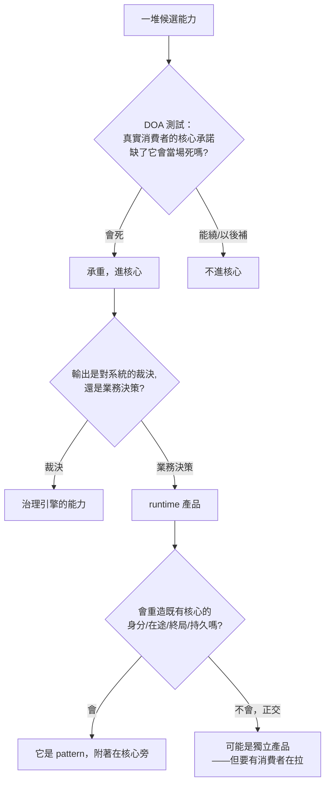

+++
title = "實踐驅動的封裝：把邊界從慣例手裡奪回並守住"
date = "2026-07-12T01:16:02+08:00"
author = "TTL::0"
draft = false
isCJKLanguage = true
description = "薄產品的誕生，是實踐與領域驅動的封裝。這篇給出把封裝邊界從慣例手裡奪回的方法：以真實消費者釘範圍的決策漏斗、事前劃界與命名世界觀、事後重寫，以及讓薄核不偷偷回胖的會咬治理與解耦紀律。"
tags = [
    "分析論述", # term:AnalyticalEssay
    "AI 代理人", # term:AiAgent
    "分析論文", # term:AnalyticalEssay
    "薄產品", # term:ThinProduct
    "領域驅動設計", # term:DomainDrivenDesign
    "決策漏斗", # term:DecisionFunnel
    "事後重寫", # term:PostHocRewrite
    "封裝邊界", # term:EncapsulationBoundary
  ]
series = ["封裝邊界由誰劃：在 AI agent 的慣例引力下守住薄產品"]
[ai_info]
    [ai_info.generation]
        model = "Claude Opus 4.8"
        agent = "Claude Code VSCode Extension 2.1.206"
    [ai_info.refinement]
        model = "Claude Opus 4.8"
        agent = "Claude Code VSCode Extension 2.1.206"
+++

---

<!--more-->

## 導言

用 AI agent 做元件開發時，**封裝邊界**（Encapsulation Boundary） <!-- term:EncapsulationBoundary -->有一個預設的漂移方向：往肥。你要一個只掌管一件事的薄核，生成端卻把它補全成生態系裡最常見的重平台——你沒明說的每一個「不要」，都被慣例當成「應該要」填了進來。這個引力很強，強到連刻意求薄的核心，都會不自覺地擁有本該屬於使用者的應用語義；而且它剎不住，因為「補得少」正是補全引擎最不會的事。

> [!IMPORTANT]
> **封裝邊界** <!-- term:EncapsulationBoundary --> (Encapsulation Boundary): 一個元件對某件事有最終發言權、又刻意不擁有周邊職責的那條劃分線。 <!-- anchor:EncapsulationBoundary -->


這篇不重述這個病有多深，而是回答它的正面問題：**既然慣例會替你劃界，怎麼讓邊界改由真實的實踐與領域來劃，而且劃了以後守得住？** 主張只有一句，其餘都是它的展開：**薄產品**（Thin Product） <!-- term:ThinProduct -->的誕生，是實踐／領域驅動的封裝。** 它不是「做得小」，而是讓邊界的來源，從「大家通常怎麼做」換成「這一個真實消費者的關鍵路徑真正需要什麼」；並且，因為生成端剎不住，還需要事前劃界、**事後重寫**（Post-Hoc Rewrite） <!-- term:PostHocRewrite -->、與會咬的治理三道紀律來守住。

> [!IMPORTANT]
> **薄產品** <!-- term:ThinProduct --> (Thin Product): 對某件事保有權威、但刻意不擁有周邊職責的克制型核心。 <!-- anchor:ThinProduct -->
> **事後重寫** <!-- term:PostHocRewrite --> (Post-Hoc Rewrite): 因生成端無法即時煞車，改以事後重寫把已漂移長肥的核心收回薄形態的防線。 <!-- anchor:PostHocRewrite -->


## 正面定義：邊界的來源是實踐，不是慣例

先把「薄」講精確，否則它會退化成「小就好」這種沒有操作性的口號。

薄核 = **有某種權威的核心 − 平台**擁有權**（Ownership） <!-- term:Ownership -->。它對某一件事（一段生命週期、一個裁決）有最終發言權，但刻意不擁有周邊的一切（重試、逾時、路由、排程、持久化）。這個減號是重點：薄不是規模小，是**擁有權 <!-- term:Ownership -->的克制**。

> [!IMPORTANT]
> **擁有權** <!-- term:Ownership --> (Ownership): 系統元件對資料、狀態或生命週期的絕對控制權。 <!-- anchor:Ownership -->


而決定「該擁有什麼、不該擁有什麼」的，正是實踐／領域。這其實是**領域驅動設計**（Domain-Driven Design） <!-- term:DomainDrivenDesign -->那條直覺的重述：**邊界的來源應該是領域，不是框架的慣例。** 慣例說「背景工作執行器通常配重試與死信」；領域說「這一段生命週期真正需要對外負責的，只有『被認領』與『**終局結果**（Terminal Result） <!-- term:TerminalResult -->』，重試政策是呼叫者的事」。同一個核心，兩種劃界來源，長出兩種截然不同的東西。實踐驅動的封裝，就是堅持讓後者——真實的領域需求——來當劃界的手。

> [!IMPORTANT]
> **領域驅動設計** <!-- term:DomainDrivenDesign --> (Domain-Driven Design): 指採用領域驅動架構（DDD），將邏輯與行為封裝於自描述領域實體中的結構化設計方法。 <!-- anchor:DomainDrivenDesign -->
> **終局結果** <!-- term:TerminalResult --> (Terminal Result): 系統執行完一系列狀態變更後的最終穩定一致狀態。 <!-- anchor:TerminalResult -->


## 決策漏斗：用真實消費者把邊界一刀一刀切出來

實踐驅動不是一句態度，它是一條可操作的漏斗：先用真實消費者釘住範圍，再兩刀切出核心的**形狀**（Data Shape） <!-- term:DataShape -->。

> [!IMPORTANT]
> **形狀** <!-- term:DataShape --> (Data Shape): 資料結構或物件所包含的屬性與型別定義，通常由型別系統來描述 <!-- anchor:DataShape -->




**第一刀是範圍。** 界定薄核最大的陷阱，是用「它可能碰到什麼」列需求——任何有點野心的系統都碰得到一長串能力，全列進來就是全選，而全選等於沒選。正確的做法是找一個真實消費者，走它最關鍵的那條路徑，對每個候選能力做一次 DOA 測試（dead on arrival）：這個能力在第一版缺席、或用一個爛 hack 頂著，這個消費者的核心承諾會不會**當場死掉**？會死的才承重、進核心；能繞的、以後補的，一律不進。「碰得到」不是「承重」——這個區分，是把一張膨脹的痛點清單收斂成薄核的唯一可靠工具。

**第二刀是能力還是產品。** 承重的東西裡，還要分：它的輸出是「對你的系統/架構的裁決」（輸入是系統長什麼樣，輸出是合不合規），還是「業務決策或狀態」（輸入是業務事件，輸出是業務意圖）？前者屬治理引擎的能力，後者是 runtime 產品。這一刀防的是引擎變胖：把業務產品的職責塞進引擎，引擎會失焦；而引擎要不要長一條新維度，該由**引擎依自己的設計判斷去 pull**，不是下游產品覺得「順手」就 push 進來——裁判的中立性，正是它作為裁判的價值來源。

**第三刀是產品還是 pattern。** 判斷某物是 runtime 產品後，還有一刀：它是獨立產品，還是既有核心旁的一個 pattern？判準是重建權威測試——它會不會重造既有核心已經擁有的東西（**身分**（Identity） <!-- term:Identity -->、在途狀態、終局結果 <!-- term:TerminalResult -->、持久化）？會重造多個，它就是 pattern（以附著的方式存在），不是同輩產品。這裡有個容易滑倒的地方：正交（不重建核心權威）只證明它**可以**獨立，沒證明它**該**現在獨立——充分條件是有一個真實消費者在拉它。用「它很正交、很優雅」當獨立的理由，是把「不耦合」冒充成「被需要」。

> [!IMPORTANT]
> **身分** <!-- term:Identity --> (Identity): 系統元件在架構中宣告的核心職責與自我定位。 <!-- anchor:Identity -->


## 事前防線：鎖範圍，並拍板命名世界觀

漏斗要在對的時機用。因為生成端剎不住，第一道防線必須在**開發初期、動手生成之前**就落下：把範圍與命名世界觀先釘死。

範圍的釘法就是上一節的漏斗——在讓生成端動手前，先用真實消費者把承重集合圈出來。一個更硬的手法，是讓這條界**在編譯期就會咬人**：用可反映（reflectable）的方式把藍圖鎖進型別，讓任何越界的實作直接編譯報錯。編譯器於是變成一個環境回饋——生成端每越界一次，就撞一次紅燈，被迫在範圍內重新推理（近似一個以編譯錯誤為觀察訊號的推理迴圈）。這比「事後 code review 時但願有人記得」可靠得多。

命名世界觀同樣要在初期拍板，因為名字會默默把人往錯誤的方向帶。三條可操作的原則：

- **領域繞過**：品牌名取自產品工程領域**以外**的域。工程語彙留給 API，品牌不碰——否則程式碼會變成品牌隱喻的俘虜。
- **生僻優先**：冷僻的詞沒有既定聯想，是乾淨的畫布；通用語的詞你我都已經有既定含義，最容易撞義。
- **多語源**（Poly-Etymology） <!-- term:PolyEtymology -->，避免子模組錯覺**：一族元件若名字全來自同一語源，會讓它們看起來像「同一個框架的子模組」。刻意讓名字來自不同語源，讓「各自獨立的產品」這件事在名字層就被看見。

> [!IMPORTANT]
> **多語源** <!-- term:PolyEtymology --> (Poly-Etymology): 在產品家族命名中刻意使用不同的語源系統，以打破「同一世界觀」的錯覺，維持各產品的獨立辨識度。 <!-- anchor:PolyEtymology -->


這三條都指向同一件事：**名字要離產品的工程語彙越遠越安全**——遠到不撞既有聯想、也不被誤認成同一框架的分身。命名之所以值得在初期就講究，正因為它便宜：品牌與 API 分兩層，換品牌不動一行 API，所以沒有藉口將就一個帶錯誤聯想的名字。

## 事後防線：重寫

事前防線再嚴，生成端仍會漂。所以第二道防線是承認這件事：**攔不住當下，就在事後把長肥的那一版丟掉、照薄核重寫。** 煞車踩在生成之後，不在生成之中。

一個真實的重寫可以說明這條防線的形狀 <!-- term:DataShape -->。有一個較全的背景執行器，把 obligation semantics（重試、退避、死信政策、排程）全烤進了核心——它擁有了使用者的應用語義。重寫的產物，是一個**只掌管持久生命週期**的薄核：認領、租約、失效、終局結果 <!-- term:TerminalResult -->，就這些；而重試、退避、逾時的**編排完全不做**，obligation 語義被推出核心，交給使用者以「受治理的 pattern」形式自行附掛；持久後端則住在核心之外，各自對同一份一致性測試自證行為。對比很清楚：

```text
// 慣例驅動（前一版）：核心擁有應用語義
core = durable-lifecycle
     + retry-policy + backoff + dead-letter + scheduling   // ← 使用者的業務決策，被核心吞掉

// 實踐驅動（重寫後）：核心只留權威，語義外推
core = durable-lifecycle-only                              // ← 對「認領/失效/終局」有權威
obligations = user-attached governed patterns              // ← 重試/退避由呼叫者按自己的業務決定
backends    = independent, proven against one conformance  // ← 持久化在核外，不被核心擁有
```

從回推因果看，這次重寫做對的，正是漏斗的第二刀：它認出「重試/死信政策」是業務決策（不同業務答案不同），不是核心該裁決的東西，於是把它們從擁有權 <!-- term:Ownership -->裡摘出去。重寫不是失敗的補救，它是這個時代唯一有效的煞車——你無法生成得更薄，但你可以在看清「核心還在錯誤地擁有什麼」之後，把它劃回去。

## 守界：會咬的治理，讓薄不會偷偷回胖

重寫出的薄核，若沒有東西守著，會被下一輪相鄰需求重新拉胖——每個相鄰功能都有一個看似合理的理由要擠進來。所以薄需要牙齒。

牙齒的意思，是讓「不長大」這件事**在有人試圖讓它長大時真的失敗**，而不是靠某個人在 code review 時記得。但「會咬」不等於「消滅所有文字」。治理有兩種：結構型的規則（依賴邊界、某種純度、命名圍籬）**應該**變成會失敗的檢查；判斷型的規則（何時破例、風格取捨）**只能**留成散文或一道人審。關鍵不是少寫散文，而是**沒有**孤兒散文**（Orphan Prose） <!-- term:OrphanProse -->——每一句治理陳述，要嘛會咬（一個自動檢查），要嘛是焊在某個咬點旁的理由，要嘛是明講「還不能執行」的判斷；三者之外、既不咬也不解釋咬的散文，就是要消滅的孤兒。理由本身是刻意保留、不可消滅的散文，且要與檢查焊在一起：改檢查就改理由，治理才既有牙齒又能演化。

> [!IMPORTANT]
> **孤兒散文** <!-- term:OrphanProse --> (Orphan Prose): 寫在文件上卻沒有程式碼強制力對應的規範，極易隨時間腐敗而被忽視。 <!-- anchor:OrphanProse -->


守界還有一個結構面：**組合**（Compose） <!-- term:Compose -->不等於耦合。** 一族薄核之間，存在兩張截然不同的圖。**相依**（Depend） <!-- term:Depend -->圖裡，每個核心是一座孤島，彼此沒有箭頭——它們只依賴少數通用函式庫，不依賴任何兄弟核心。資料流圖裡箭頭滿天飛——但每條箭頭都是組裝者在把值從一個孤島搬到下一個，並在每一跳做型別轉換。**箭頭多不等於依賴多。** 唯一合法的依賴邊，是單向、選配、住在兩核之外的橋接：它同時依賴兩個核心，但兩個核心都不依賴對方。必須明令禁止的是中央 framework——一個「依賴全部、或被全部依賴」的節點，會讓所有元件不再能各自獨立演化。而這條孤島性不能只是口頭約定，要讓每個元件的治理把「依賴任何兄弟」設成違憲，越界就編譯失敗——核心彼此正交，是被機械強制的性質，不是被期望的美德。

> [!IMPORTANT]
> **組合** <!-- term:Compose --> (Compose): 將多個獨立元件串聯運作的方式，強調資料流轉而非直接相依。 <!-- anchor:Compose -->
> **相依** <!-- term:Depend --> (Depend): 元件之間產生的耦合關係，一方改動會強制影響另一方。 <!-- anchor:Depend -->


當這一族要跨多個 repo 時，同樣的直覺再現一次：**共享的是紀律，不是程式碼。** 紀律靠複製傳播（每個 repo 各自持有自己那份治理檔），不靠依賴傳播（所有 repo include 一份中央檔＝改中央即靜默改所有人）。新成員從一個**參考實作**（Reference Implementation） <!-- term:ReferenceImplementation -->複製骨架長出來，出生後剪斷臍帶——無 submodule、無 upstream 追蹤，改進靠人刻意 re-copy。每一次你想找一個中央的東西把一切收攏，紀律都要你把它推回邊緣。

> [!IMPORTANT]
> **參考實作** <!-- term:ReferenceImplementation --> (Reference Implementation): 提供架構樣板與基礎建設設定，供後續專案複製並依循的標準範例。 <!-- anchor:ReferenceImplementation -->


## 反思：邊界、比例，與那個交不出的判斷

這套紀律有三個必須正視的張力。

**不是所有東西都該薄化。** 有些東西本質上就是「大而整合才有價值」——某些一站式體驗，拆薄反而失去意義。判準仍回到消費者：如果它的核心承諾**需要**整合本身，那整合就是承重的，不該被薄化。薄是對抗慣例漂移的武器，不是對所有東西的教條。

**治理必須比它治理的對象輕。** 一個五百行的憲法包著一個兩百行的核心，就是倒置了。「只提升被證明的模式」這條紀律對治理自己也適用：只編碼你此刻已經在主張的不變式，其餘看見但還用不到的，記錄延後，不要預先建造。治理若失去比例，它就從「保護薄核的牙齒」變成「另一個要維護的胖東西」。

**最難的一關，紀律也只能逼近、不能替代。** 這整套漏斗都預設你能找到「那個真實消費者」。但找消費者本身有個三難：沒有消費者則慣例代畫（漂移），只抓一個則耦合，抓多個則稀釋成所有需求的聯集（又一個 god module）。生成端解不開它。能從一堆嘗試（往往是失敗的嘗試）裡，抽出「那個能把邊界拉對、又不稀釋成聯集」的單一困難個案的，目前只有人的判斷。紀律能把這個判斷需要的資訊擺到最清楚——但按下那一刀的，還是人。

## 結論

薄產品 <!-- term:ThinProduct -->的誕生，是實踐／領域驅動的封裝：讓邊界的來源，從「大家通常怎麼做」的慣例，換成「這一個真實消費者的關鍵路徑真正需要什麼」的實踐。這句話展開成一條漏斗（用 DOA 測試釘範圍、分能力與產品、分產品與 pattern）和三道守界紀律（事前鎖範圍與命名、事後重寫 <!-- term:PostHocRewrite -->、會咬的治理）。

但最該記住的，不是任何單一手法，而是薄的性質：

```text
薄不是一次達成的狀態，是一場持續的對抗。
生成端每一次想用慣例替你把邊界劃肥，
實踐驅動的封裝就要你把它推回那條由真實需求劃定的線——
事前劃界、事後重寫、治理守界，缺一，它都會偷偷長回去。
```

慣例的引力不會消失；它是生成端的預設方向。所以薄核不是蓋好就完工的建築，是一條要一直守的邊界。守它的方法可以工程化、可以自動咬，但決定「這條線該劃在哪」的那一下判斷，始終是這件事裡最貴、也最像人的部分。