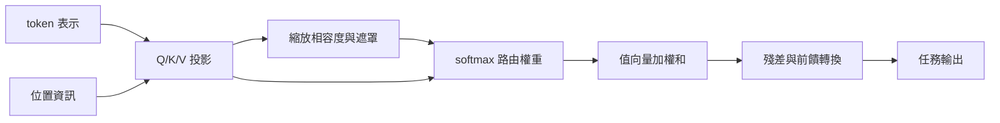

+++
title = "注意力如何路由資訊而不等於記憶"
date = "2026-09-06T21:16:05+08:00"
author = "TTL::0"
draft = false
isCJKLanguage = true
description = "內容相依加權縮短了位置之間的路徑，卻不等於保存也不等於解釋。界定注意力作為資訊路由的能力範圍與兩種常見過度推論。"
tags = [
    "分析論述", # term:AnalyticalEssay
    "AI 代理人", # term:AiAgent
    "自我注意力", # term:SelfAttention
    "縮放點積注意力", # term:ScaledDotProductAttention
    "位置編碼", # term:PositionalEncoding
    "持久記憶", # term:PersistentMemory
  ]
series = ["從有限證據到生成分佈：統計學習如何形成模型能力"]
[ai_info]
    [ai_info.generation]
        model = "GPT 5.6 Sol"
        agent = "Codex VS Code extension 26.901.22334"
    [ai_info.refinement]
        model = "Claude Opus 5"
        agent = "Claude Code VSCode Extension 2.1.261"
+++

<!--more-->

## 導言

兩個查詢面對同一組鍵和值，會產生不同的加權和。這個簡單現象讓位置之間可以直接交換資訊，也容易造成兩個過度推論：路徑短就等於不會遺忘，權重高就等於該輸入造成了輸出。

**自我注意力**（Self-Attention） <!-- term:SelfAttention -->是內容**相依**（Depend） <!-- term:Depend -->的資訊路由。Transformer 以它取代序列內的遞迴與卷積，讓訓練可沿位置平行，並縮短遠距位置的計算圖路徑。[Vaswani 等人，NeurIPS 2017](https://proceedings.neurips.cc/paper/2017/hash/3f5ee243547dee91fbd053c1c4a845aa-Abstract.html) 這裡要回答：注意力如何形成可學習的關聯，又為何不能單獨保證保存與解釋？

> [!IMPORTANT]
> **自我注意力** <!-- term:SelfAttention --> (Self-Attention): 讓序列中任一位置直接以內容相依的權重聚合其他位置表示的機制。 <!-- anchor:SelfAttention -->
> **相依** <!-- term:Depend --> (Depend): 元件之間產生的耦合關係，一方改動會強制影響另一方。 <!-- anchor:Depend -->


## 分析

### 加權混合的機制與失效點

**縮放點積注意力**（Scaled Dot-Product Attention） <!-- term:ScaledDotProductAttention -->定義為

> [!IMPORTANT]
> **縮放點積注意力** <!-- term:ScaledDotProductAttention --> (Scaled Dot-Product Attention): 以查詢與鍵的點積除以維度平方根作為關聯分數的注意力計算方式。 <!-- anchor:ScaledDotProductAttention -->


$$
A=\operatorname{softmax}\left(\frac{QK^\top}{\sqrt{d_k}}+M\right),
\qquad O=AV.
$$

$Q$、$K$、$V$ 分別是查詢、鍵和值，$d_k$ 是鍵維度，$M$ 是遮罩。點積產生相容度，softmax 把每列變成非負且總和為一的權重，最後以 $A$ 混合值向量。

除以 $\sqrt{d_k}$ 的理由可從高維點積回推。若查詢與鍵的各分量獨立、均值零、變異數一，點積的變異數約為 $d_k$。不縮放時，維度增加會把 logits 推向較大絕對值；softmax 變尖，許多位置的梯度變小。縮放把典型尺度拉回常數級。失效點是若分量分布或**投影**（Projection） <!-- term:Projection -->尺度不符假設，單靠這個係數不能保證適當熵。

> [!IMPORTANT]
> **投影** <!-- term:Projection --> (Projection): 產物透過穩定鍵間接引用共享庫時，它不再是凍結快照，而是共享庫當前狀態一個可隨時重算的呈現。 <!-- anchor:Projection -->


資訊保存還多一層限制。$O_i$ 是值向量的加權和，不是把所有 $V_j$ 無損複製到位置 $i$。多個輸入可能產生相同 $O_i$；有限頭維度、遮罩、殘差與後續前饋層都會改變可辨識資訊。因果鏈是：查詢—鍵相容度選擇路由；softmax 正規化形成競爭；值投影 <!-- term:Projection -->被加權壓縮；後續層只看壓縮後表示。失效點是把「計算圖上可直接連到」誤當成「資訊被完整保留」。

### 順序不是注意力自行產生

若沒有位置資訊，對輸入位置施加同一排列，注意力輸出會作相同排列。這種排列等變性使裸注意力不能區分相同 token 的先後。原始 Transformer 將正弦、餘弦**位置編碼**（Positional Encoding） <!-- term:PositionalEncoding -->加到輸入表示，以補入順序。[NeurIPS 論文](https://papers.neurips.cc/paper/7181-attention-is-all-you-need.pdf)

> [!IMPORTANT]
> **位置編碼** <!-- term:PositionalEncoding --> (Positional Encoding): 為本身不含順序資訊的注意力模型補入序列位置的表示方法。 <!-- anchor:PositionalEncoding -->


下圖把必要部件拆開。它解決的問題是：看到注意力矩陣時，哪些能力其實由其他元件提供。



圖中 $A$ 只是**中介變數**（Mediating Variable） <!-- term:MediatingVariable -->。最終輸出還受到值投影 <!-- term:Projection -->、殘差及後續轉換影響，因此不能只看 $A$ 判定輸入的因果貢獻。

> [!IMPORTANT]
> **中介變數** <!-- term:MediatingVariable --> (Mediating Variable): 位於原因與結果之間、承載並使該段因果得以被觀察的可測量變數。 <!-- anchor:MediatingVariable -->


### 一個同時測縮放與非唯一解釋的實驗

下列程式先比較不同維度下有無縮放的注意力熵，再構造兩組不同權重，讓它們對線性相依 <!-- term:Depend -->的值產生相同輸出。

```python
import numpy as np

def softmax(x):
    x = x - np.max(x, axis=-1, keepdims=True)
    e = np.exp(x)
    return e / e.sum(axis=-1, keepdims=True)

def entropy(p):
    return -np.sum(p * np.log(p + 1e-12), axis=-1).mean()

def trial(seed, d):
    rng = np.random.default_rng(seed)
    q = rng.normal(size=(400, d))
    k = rng.normal(size=(400, 16, d))
    logits = np.einsum("bd,bnd->bn", q, k)
    return entropy(softmax(logits)), entropy(softmax(logits / np.sqrt(d)))

for d in (8, 64, 512):
    runs = np.array([trial(seed, d) for seed in range(30)])
    mean, std = runs.mean(axis=0), runs.std(axis=0)
    print(d, "unscaled", mean[0], std[0], "scaled", mean[1], std[1])

value_rows = np.array([[0.0], [1.0], [2.0]])
a = np.array([0.0, 1.0, 0.0])
b = np.array([0.5, 0.0, 0.5])
print("outputs", a @ value_rows, b @ value_rows)
```

第一部分若顯示未縮放熵隨維度下降，而縮放後較穩定，便支持尺度機制。第二部分中兩個權重分布不同但輸出同為 1，直接反駁「注意力分布是唯一輸出解釋」。Jain 與 Wallace 在多個 NLP 任務中也發現，標準注意力權重常與梯度式重要度不相關，並可找到輸出近似但權重相異的分布。[ACL Anthology](https://aclanthology.org/N19-1357/)

### 框架對照：在 MultiheadAttention 上重做同兩個檢查

下列程式把縮放與非唯一性兩個主張搬到框架實作上：先比較不同 `embed_dim` 的注意力熵，再用兩組權重驗證輸出可以相同。

```python
import torch

for d in (8, 64, 512):
    torch.manual_seed(23)
    attn = torch.nn.MultiheadAttention(d, num_heads=1, batch_first=True)
    q = torch.randn(400, 1, d)
    kv = torch.randn(400, 16, d)
    with torch.no_grad():
        _, w = attn(q, kv, kv, need_weights=True, average_attn_weights=True)
    entropy = -(w * (w + 1e-12).log()).sum(-1).mean()
    print(d, "entropy", entropy.item(), "log16", torch.tensor(16.0).log().item())

value_rows = torch.tensor([[0.0], [1.0], [2.0]])
a = torch.tensor([[0.0, 1.0, 0.0]])
b = torch.tensor([[0.5, 0.0, 0.5]])
print("outputs", (a @ value_rows).item(), (b @ value_rows).item())
```

`MultiheadAttention` 內建 $1/\sqrt{d_k}$ 縮放，所以熵不應隨維度崩向零；這正是手寫版本未縮放分支的對照組。第二段輸出相同而權重不同，在框架實作下同樣成立，因此「權重即解釋」的反駁不是手寫實作的偏差。本段未在撰稿環境執行。

### 驗證契約

這個實驗的兩個子問題使用相同隨機生成器，但不能把結果互相替代。熵檢查尺度，反事實權重檢查解釋非唯一性。

| 項目 | 契約 |
| :--- | :--- |
| 資料 | 標準高斯 Q/K；固定三個線性相依 <!-- term:Depend -->的一維值 |
| 切分 | 機制模擬無訓練切分；另做任務驗證時必須獨立測試 |
| seed | 0–29，各 400 個查詢、16 個鍵 |
| 指標 | 注意力熵；替代權重的 $L_1$ 距離；輸出差 |
| 控制變因 | Q/K 分布、鍵數固定；只改維度與縮放 |
| 觀察量 | 熵對維度的斜率，以及權重相異而輸出相同的可行性 |
| 反駁條件 | 縮放不能穩定熵；或替代權重必然造成相應輸出差 |
| 停止條件 | 30 個 seed 完成；不依結果更換值向量 |

若真實模型的值向量線性獨立且後續映射可逆，非唯一性可能減弱。這正是邊界，不應由玩具反例推成所有注意力都不可分析。

## 反思

「注意力不是解釋」也不能被誤用成「注意力毫無資訊」。權重可以描述特定前向計算的路由，並適合做診斷線索；問題在於把觀察性中介量直接提升為唯一因果歸因。需要干預輸入、替換權重或比較梯度與遮蔽結果，才能判斷解釋是否穩健。

另一個邊界是複雜度。標準全注意力形成 $N\times N$ 分數矩陣，核心項對序列長度為二次；但整體速度還取決於前饋層、批次、記憶體傳輸與硬體。$O(N^2)$ 不能單獨推出某長度下一定比遞迴慢。

有限上下文則是更直接的反例。窗口外資訊根本沒有路徑，窗口內資訊也可能因位置偏差或競爭被弱化。計算圖的一步連接只表示可達，不表示訓練已學得正確路由。

## 實務對比

錯誤做法是把熱圖中最高權重 token 標成「造成答案的理由」。較可靠的做法先遮蔽或替換該 token，再比較輸出；同時尋找是否存在差異很大的權重分布卻維持相同預測。

另一個錯誤是比較長文本模型時同時改窗口、位置編碼 <!-- term:PositionalEncoding -->、資料與參數量。正確對照會固定模型與資料，只操弄關鍵資訊的位置，畫出準確率對相對距離的曲線。這能測路由的距離效應，卻仍不等同外部**持久記憶**（Persistent Memory） <!-- term:PersistentMemory -->。

> [!IMPORTANT]
> **持久記憶** <!-- term:PersistentMemory --> (Persistent Memory): 代理人跨對話維護的長期記憶，用於存放使用者偏好與互動規則。 <!-- anchor:PersistentMemory -->


最後，若任務本質上是集合而非序列，強行加入順序可能引入偽訊號。反之，語序決定意義時移除位置資訊又必然不足。架構選擇應由任務所需的不變性與等變性決定。

## 結論

注意力形成能力的路徑是：內容相容度產生競爭權重，權重混合值表示，位置與殘差等元件再讓混合結果成為可用序列表示。這條路縮短關聯距離，沒有把有限維表示變成無損記憶。

因此，注意力權重可以回答「這次計算如何路由值」，不能單獨回答「哪些輸入唯一造成輸出」。保存、順序與因果解釋都需要額外結構與干預證據。