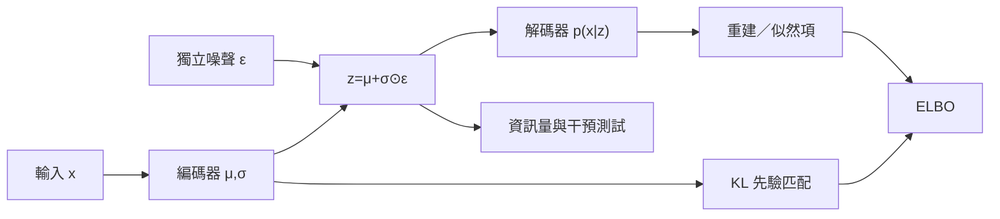

+++
title = "VAE 的潛在變數何時會被使用"
date = "2026-09-06T21:16:06+08:00"
author = "TTL::0"
draft = false
isCJKLanguage = true
description = "ELBO 同時獎勵重建與先驗匹配，強解碼器卻可能繞過潛在通道。說明潛在空間何時被實際使用，何時容許潛在資訊消失。"
tags = [
    "分析論述", # term:AnalyticalEssay
    "AI 代理人", # term:AiAgent
    "變分自動編碼器", # term:VariationalAutoencoder
    "證據下界", # term:EvidenceLowerBound
    "重參數化技巧", # term:ReparameterizationTrick
    "後驗坍縮", # term:PosteriorCollapse
  ]
series = ["從有限證據到生成分佈：統計學習如何形成模型能力"]
[ai_info]
    [ai_info.generation]
        model = "GPT 5.6 Sol"
        agent = "Codex VS Code extension 26.901.22334"
    [ai_info.refinement]
        model = "Claude Opus 5"
        agent = "Claude Code VSCode Extension 2.1.261"
+++

<!--more-->

## 導言

一個編碼器若對所有輸入都輸出標準常態，KL 成本可以降到零，解碼器卻無法從潛在變數區分樣本。這不是數值上的矛盾：**變分自動編碼器**（Variational Autoencoder） <!-- term:VariationalAutoencoder -->的目標同時獎勵資料擬合與近似後驗接近先驗，強解碼器有時可以繞過潛在通道完成前者。

> [!IMPORTANT]
> **變分自動編碼器** <!-- term:VariationalAutoencoder --> (Variational Autoencoder): 學習潛在變數的條件分佈，並以證據下界同時訓練編碼器與解碼器的生成模型。 <!-- anchor:VariationalAutoencoder -->


Kingma 與 Welling 提出的自動編碼變分貝葉斯，目標是讓帶連續潛在變數、難解後驗的模型可用隨機梯度進行推論與學習；重參數化是其中的梯度估計工具。[原始論文](https://arxiv.org/abs/1312.6114) 這裡真正要問的是：ELBO 經什麼機制建立可取樣的潛在空間，又在何時容許潛在資訊消失？

## 分析

### 下界中的兩個力量

設生成模型為 $p_\theta(x,z)=p(z)p_\theta(x\mid z)$，編碼器以 $q_\phi(z\mid x)$ 近似難解後驗。對數邊際似然可分解為

$$
\log p_\theta(x)=
\underbrace{\mathbb E_{q_\phi(z\mid x)}[\log p_\theta(x\mid z)]
-D_{\mathrm{KL}}(q_\phi(z\mid x)\|p(z))}_{\mathcal L_{\mathrm{ELBO}}(x)}
+D_{\mathrm{KL}}(q_\phi(z\mid x)\|p_\theta(z\mid x)).
$$

最後一項非負，因此**證據下界**（Evidence Lower Bound） <!-- term:EvidenceLowerBound -->確實是下界。第一項鼓勵 $z$ 支持重建，第二項使各輸入後驗不要任意偏離可取樣先驗。兩項作用於同一編碼通道，構成資訊與規則性的取捨。

> [!IMPORTANT]
> **證據下界** <!-- term:EvidenceLowerBound --> (Evidence Lower Bound): 對數邊際似然的可最佳化下界，由重建項與 KL 正則項組成。 <!-- anchor:EvidenceLowerBound -->


若 $q_\phi(z\mid x)=\mathcal N(\mu,\operatorname{diag}(\sigma^2))$、$p(z)=\mathcal N(0,I)$，KL 為

$$
D_{\mathrm{KL}}=\frac12\sum_j
(\mu_j^2+\sigma_j^2-\log\sigma_j^2-1).
$$

$\mu=0,\sigma^2=1$ 時成本為零。從**後驗坍縮**（Posterior Collapse） <!-- term:PosteriorCollapse -->的症狀回推：解碼器可在忽略 $z$ 時仍擬合條件分布；編碼器若攜帶輸入資訊便支付 KL；最佳化因此把 $q(z\mid x)$ 推向共同先驗；$I_q(X;Z)$ 下降，潛在變數停止區分輸入。失效點是把低 KL 當成良好正則化，而未測潛在通道是否仍被使用。

> [!IMPORTANT]
> **後驗坍縮** <!-- term:PosteriorCollapse --> (Posterior Collapse): 近似後驗退化為先驗、潛在變數不再攜帶輸入資訊的失效現象。 <!-- anchor:PosteriorCollapse -->


Dieng 等人針對強 likelihood 模型下的 latent-variable collapse，利用生成端跳接加強 $z$ 與觀察之間的連結，並從理論與實驗檢查**互資訊**（Mutual Information） <!-- term:MutualInformation -->。[PMLR 論文](https://proceedings.mlr.press/v89/dieng19a.html) 這支持「解碼器路徑」是成因之一，但不代表所有坍縮只有單一病因；局部最優與資料結構也可能參與。[Dai、Wang 與 Wipf，ICML 2020](https://proceedings.mlr.press/v119/dai20c.html)

> [!IMPORTANT]
> **互資訊** <!-- term:MutualInformation --> (Mutual Information): 兩個隨機變數之間共享的資訊量，用來量化潛在變數是否攜帶輸入資訊。 <!-- anchor:MutualInformation -->


### 重參數化解決的是求導

直接寫 $z\sim q_\phi(z\mid x)$ 會讓一般路徑導數難以穿過抽樣操作。**重參數化技巧**（Reparameterization Trick） <!-- term:ReparameterizationTrick -->改寫成

> [!IMPORTANT]
> **重參數化技巧** <!-- term:ReparameterizationTrick --> (Reparameterization Trick): 把隨機取樣改寫成可微分變換與獨立噪聲，使梯度能穿過取樣節點。 <!-- anchor:ReparameterizationTrick -->


$$
z=\mu_\phi(x)+\sigma_\phi(x)\odot\epsilon,
\qquad \epsilon\sim\mathcal N(0,I).
$$

隨機性被隔離到與 $\phi$ 無關的 $\epsilon$，因而可對 $\mu_\phi$ 與 $\sigma_\phi$ 求路徑導數。這提高梯度估計可行性，不會保證不同潛在方向對應人類可命名因素。

下圖把「可微抽樣」與「潛在資訊存活」分成兩條檢查。這能避免從訓練可執行直接跳到語意有意義。



ELBO 是訓練目標，資訊量與干預則檢查模型是否真的使用 $z$。兩者相關但不可互相取代。

### 隔離 KL 壓力的實驗

下列程式先驗證解析 KL，再用一個代理目標展示提高 $\beta$ 如何讓表示幅度縮小。代理模型不是完整 VAE；它刻意隔離「攜帶訊息帶來重建收益，同時支付先驗成本」這個機制。

```python
import numpy as np

def gaussian_kl(mu, log_var):
    return -0.5 * np.sum(1 + log_var - mu**2 - np.exp(log_var))

for mu, log_var in ((0.0, 0.0), (1.0, 0.0), (0.0, np.log(0.25))):
    print("KL", mu, np.exp(log_var), gaussian_kl(np.array([mu]), log_var))

# z = a*x；代理重建希望 a≈1，先驗成本懲罰 a²
grid = np.linspace(0.0, 1.5, 10001)
for beta in (0.0, 0.1, 1.0, 10.0):
    objective = (1.0 - grid) ** 2 + beta * grid**2
    a = grid[np.argmin(objective)]
    print("beta", beta, "latent_gain", a)
```

KL 應在後驗等於先驗時為零。代理模型中，$\beta$ 增加應降低 `latent_gain`；若解碼器另有不經 $z$ 的捷徑，重建仍可能良好。這支持目標張力，不能證明真實非線性 VAE 一定坍縮。

### 框架對照：重參數化讓梯度真的穿過抽樣

代理目標避開了抽樣。下列程式直接對比兩種寫法：`torch.normal` 產生的樣本切斷梯度，重參數化則保留它。

```python
import torch

torch.manual_seed(0)
mu = torch.zeros(1, requires_grad=True)
log_var = torch.zeros(1, requires_grad=True)

eps = torch.randn(1)
z_reparam = mu + (0.5 * log_var).exp() * eps
z_reparam.pow(2).mean().backward()
print("reparam grad", mu.grad.item(), log_var.grad.item())

mu2 = torch.zeros(1, requires_grad=True)
z_sampled = torch.normal(mu2.detach(), torch.ones(1))
print("sampled requires_grad", z_sampled.requires_grad)   # False：路徑被切斷
print("sampled grad_fn", z_sampled.grad_fn)               # None
```

第一組應得到非零梯度，第二組的 `requires_grad` 為 `False`、`grad_fn` 為 `None`，連反向都無從開始。這說明重參數化解決的是可微性，不是 KL 與重建之間的張力；把兩者混為一談，會誤以為換個抽樣寫法就能避免後驗坍縮 <!-- term:PosteriorCollapse -->。本段未在撰稿環境執行。

### 驗證契約

完整 VAE 實驗要同時報告目標、資訊與生成行為。只報 ELBO 會把不同失效模式壓成同一數字。

| 項目 | 契約 |
| :--- | :--- |
| 資料 | MNIST 或固定二維高斯混合；不做標籤監督訓練 |
| 切分 | 80/10/10，切分在任何超參數選擇前固定 |
| seed | 0–9 初始化與抽樣 seed |
| 指標 | 重建項、KL/維度、active units、先驗樣本品質、$z$ 置換後性能差 |
| 控制變因 | 編解碼器容量、資料與訓練預算固定，只改 $\beta$ 或 KL warm-up |
| 觀察量 | KL 與潛在干預效果是否同時趨近零 |
| 反駁條件 | 低 KL 時 $z$ 置換仍穩定改變輸出，或所稱坍縮不能跨 seed 重現 |
| 停止條件 | 固定 epoch，或驗證 ELBO 20 次評估無改善；測試集不早停 |

這份契約把「後驗接近先驗」與「解碼器不使用 $z$」分開量測。只有兩者連同輸出干預一致，才足以診斷潛在通道坍縮。

## 反思

低 KL 不總是故障。若某些潛在維度對資料確實多餘，讓它們回到先驗是合理的自動容量選擇。故應區分部分維度閒置與整體表示無資訊，也應依任務是否需要可用表示判斷代價。

連續潛在空間也不保證線性插值具有語意。解碼器只在訓練後驗與先驗實際覆蓋的區域受到約束；某條插值路徑若穿過低密度區，平滑向量變化仍可能產生不可信樣本。

最後，ELBO 變好不等於樣本品質、似然估計與表示品質同時變好。三者可能在解碼器容量、觀察模型與 $\beta$ 改變時分岔。這是單一目標值不能取代多面驗證的反例。

## 實務對比

錯誤做法是只挑選重建良好的樣本，便宣稱潛在空間可生成。重建使用的是 $q(z\mid x)$ 附近；真正生成從 $p(z)$ 取樣。較可靠的做法並列重建、先驗樣本與後驗聚合分布，檢查兩個使用情境是否一致。

另一個錯誤是看到 KL 接近零就直接提高重建權重。若根因是強解碼器繞過 $z$，這可能只讓捷徑更強。正確對照會做 $z$ 置換、遮蔽或固定測試，再比較容量限制、warm-up、free bits 或生成端連結等針對性介入。

若目標只需要高品質條件生成，不需要可解釋表示，部分坍縮的實務代價可能有限。若下游依賴 $z$ 做控制或聚類，同一現象就會直接破壞產品契約。

## 結論

VAE 的潛在能力來自一個受約束通道：重建項獎勵 $z$ 保留輸入資訊，KL 項要求後驗保持可由共同先驗取樣，重參數化讓兩者可用梯度共同訓練。當解碼器能繞過 $z$，這個目標也可能理性地選擇零資訊通道。

因此，「潛在變數被使用」必須由 KL、資訊或 active units，以及對 $z$ 的輸出干預共同證成。可微、可取樣與有語意是三個不同命題，任何一個都不能代替另外兩個。