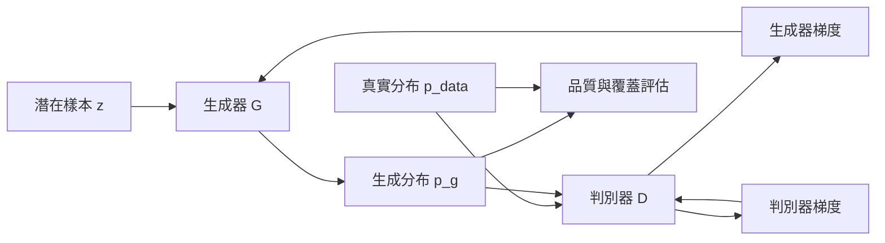

+++
title = "GAN 為何能生成銳利樣本卻漏掉模式"
date = "2026-09-06T21:16:07+08:00"
author = "TTL::0"
draft = false
isCJKLanguage = true
description = "樣本像真與分佈覆蓋完整是兩個目標。說明兩個同步移動的目標如何提供學習訊號，又為何在有限模型下產生模式坍縮。"
tags = [
    "分析論述", # term:AnalyticalEssay
    "AI 代理人", # term:AiAgent
    "生成對抗網路", # term:GenerativeAdversarialNetwork
    "模式坍縮", # term:ModeCollapse
    "組合", # term:Compose
  ]
series = ["從有限證據到生成分佈：統計學習如何形成模型能力"]
[ai_info]
    [ai_info.generation]
        model = "GPT 5.6 Sol"
        agent = "Codex VS Code extension 26.901.22334"
    [ai_info.refinement]
        model = "Claude Opus 5"
        agent = "Claude Code VSCode Extension 2.1.261"
+++

<!--more-->

## 導言

一個生成器只輸出雙峰資料的右峰，仍可產生看起來真實的單筆樣本。若評估只展示最佳樣本或局部品質，左峰完全消失也不會被發現。這個事故把「樣本像真」與「分布覆蓋完整」拆成兩個不同目標。

**生成對抗網路**（Generative Adversarial Network） <!-- term:GenerativeAdversarialNetwork -->讓判別器估計樣本來自資料而非生成器的機率，生成器則學習讓判別器犯錯。原始論文證明，在任意函數與理想最佳化條件下，平衡點可達 $p_g=p_{data}$ 且判別器輸出 $1/2$。[Goodfellow 等人，NeurIPS 2014](https://papers.neurips.cc/paper_files/paper/2014/hash/f033ed80deb0234979a61f95710dbe25-Abstract.html) 這裡要追問的是：有限模型與交替更新如何偏離這個理想，並產生**模式坍縮**（Mode Collapse） <!-- term:ModeCollapse -->？

> [!IMPORTANT]
> **生成對抗網路** <!-- term:GenerativeAdversarialNetwork --> (Generative Adversarial Network): 由生成器與判別器相互競爭、以隱式方式逼近資料分佈的架構。 <!-- anchor:GenerativeAdversarialNetwork -->
> **模式坍縮** <!-- term:ModeCollapse --> (Mode Collapse): 生成器只覆蓋資料分佈中少數模式，導致樣本多樣性不足的失效現象。 <!-- anchor:ModeCollapse -->


## 分析

### 理想判別器與實際移動目標

原始極小極大目標為

$$
\min_G\max_D V(D,G)=
\mathbb E_{x\sim p_{data}}[\log D(x)]
+\mathbb E_{z\sim p(z)}[\log(1-D(G(z)))].
$$

固定生成器且允許逐點最佳化時，最優判別器為

$$
D^*(x)=\frac{p_{data}(x)}{p_{data}(x)+p_g(x)}.
$$

將它代回目標可連到 Jensen–Shannon divergence，理想平衡確實要求兩分布一致。然而實際訓練沒有每步求出 $D^*$。判別器與生成器交替更新，任一方看到的損失曲面都會隨另一方移動。

從漏掉左峰的症狀回推，可得到一條機制鏈：目前判別器在右峰附近提供容易利用的梯度；多個潛在輸入被生成器映到相近右峰；該區局部品質改善，判別器再把注意力轉向新弱點；被遺漏的左峰若沒有提供足夠梯度，映射不會自行展開。失效點是以目前判別器的局部成功取代整體 $p_g$ 覆蓋檢查。

這個賽局的狀態傳播可用下圖外化。圖的重點是「評分規則也在學」，因此損失下降沒有固定標尺的通常意義。



只有右下角的外部評估能檢查整體分布；賽局內損失主要描述雙方當下的相對狀態。

### 為何單一平均值看不到坍縮

下列實驗比較真實雙峰分布、只覆蓋右峰的生成分布，以及兩峰都覆蓋但變異較大的生成分布。它同時測平均值、模式比例與最近模式距離。

```python
import numpy as np

def metrics(samples):
    left = np.mean(samples < 0)
    nearest = np.minimum(abs(samples + 3), abs(samples - 3)).mean()
    return samples.mean(), left, nearest

def trial(seed):
    rng = np.random.default_rng(seed)
    real = np.concatenate((rng.normal(-3, 0.3, 1000),
                           rng.normal(3, 0.3, 1000)))
    collapsed = rng.normal(3, 0.3, 2000)
    wide = np.concatenate((rng.normal(-3, 0.8, 1000),
                           rng.normal(3, 0.8, 1000)))
    return [metrics(s) for s in (real, collapsed, wide)]

runs = np.array([trial(seed) for seed in range(20)])
for i, name in enumerate(("real", "collapsed", "wide")):
    print(name, "mean", runs[:, i].mean(axis=0), "sd", runs[:, i].std(axis=0))
```

`collapsed` 可在右峰附近具有很小的最近模式距離，卻有接近零的左峰覆蓋；`wide` 覆蓋兩峰，局部精度卻較差。這正是品質與召回不能互相取代的對比。程式展示輸出形態，不模擬 GAN 梯度，因此不能把坍縮歸因到某個特定損失。

Metz 等人讓生成器對判別器未來數步更新反向求導，藉此降低只利用當前判別器的短視，並在實驗中改善模式多樣性與穩定性。[ICLR 2017 論文](https://research.google/pubs/unrolled-generative-adversarial-networks/) 這是移動目標機制的介入證據，但不表示 unrolling 能消除所有坍縮。

### 一個最小賽局反例

即使沒有神經網路，雙線性賽局 $\min_x\max_y xy$ 的同時梯度更新也可能繞著平衡點旋轉：

$$
x_{t+1}=x_t-\eta y_t,
\qquad y_{t+1}=y_t+\eta x_t.
$$

平方半徑變成 $(1+\eta^2)(x_t^2+y_t^2)$，所以離平衡點反而逐步增加。這個反例說明「雙方各自沿正確梯度」不推出聯合動力收斂；真正 GAN 的非線性與更新次序會更複雜。

### 框架對照：目標會在對手更新後移動

上面的程式比較固定樣本。GAN 的難處在於判別器每次更新都改寫生成器的損失面。下列程式在同一批生成樣本上，量測判別器更新前後生成器損失的變化。

```python
import torch

torch.manual_seed(4)
real = torch.cat((torch.randn(512, 1) * 0.3 - 3,
                  torch.randn(512, 1) * 0.3 + 3))
disc = torch.nn.Sequential(torch.nn.Linear(1, 32), torch.nn.ReLU(),
                           torch.nn.Linear(32, 1))
opt_d = torch.optim.Adam(disc.parameters(), lr=1e-3)
fake = torch.randn(1024, 1) * 0.3 + 3          # 固定的坍縮生成器輸出
bce = torch.nn.functional.binary_cross_entropy_with_logits

def generator_loss():
    with torch.no_grad():
        return bce(disc(fake), torch.ones_like(disc(fake))).item()

for d_steps in (0, 1, 5, 20):
    for _ in range(d_steps):
        opt_d.zero_grad()
        loss = (bce(disc(real), torch.ones(1024, 1))
                + bce(disc(fake), torch.zeros(1024, 1)))
        loss.backward()
        opt_d.step()
    print(d_steps, "generator loss", generator_loss())
```

生成器完全沒有改變，它的損失卻應隨判別器步數上升。這是非定態目標的直接證據，也是雙時間尺度更新比需要被當成控制變因的原因。單看生成器損失曲線無法區分「生成變差」與「判別器變強」。本段未在撰稿環境執行。

### 驗證契約

GAN 評估必須同時**量化**（Quantization） <!-- term:Quantization -->品質與覆蓋，並固定挑樣規則。否則漂亮樣本會系統性隱藏失敗區域。

> [!IMPORTANT]
> **量化** <!-- term:Quantization --> (Quantization): 以較少位元表示權重或啟動值，改變數值格點以降低記憶體與計算成本的近似方法。 <!-- anchor:Quantization -->


| 項目 | 契約 |
| :--- | :--- |
| 資料 | 八個等權二維高斯模式，中心與方差預先固定 |
| 切分 | 70/15/15；測試樣本不供判別器訓練或 checkpoint 選擇 |
| seed | 初始化、資料與潛在 seed 0–19 |
| 指標 | 模式覆蓋率、各模式比例 KL、最近中心距離、非有限更新次數 |
| 控制變因 | 架構、資料量、總更新數固定；只改更新比或 unrolling |
| 觀察量 | 品質—覆蓋前緣與訓練軌跡 |
| 反駁條件 | 所稱介入只改善挑選樣本而不改善盲測覆蓋，或效果不跨 seed |
| 停止條件 | 固定更新預算；若連續五次非有限更新則記為失敗，不重啟挑結果 |

這份契約能判斷某介入是否改善玩具分布的動力與覆蓋。它不能直接預測高維影像的感知品質。

## 反思

模式坍縮 <!-- term:ModeCollapse -->不是所有低多樣性的同義詞。資料本身不平衡、潛在維度不足、條件標籤錯誤或評估器偏差，都可能產生相似輸出。診斷需要先確認目標分布確實含有被漏掉的模式。

判別器太強也不是完整病因。理論中的最優判別器支撐分布散度推導；問題出現在有限支撐、飽和損失、函數容量與交替動力的**組合**（Compose） <!-- term:Compose -->。某些損失改寫可改善梯度，但不會自動解決資料覆蓋或模型容量限制。

> [!IMPORTANT]
> **組合** <!-- term:Compose --> (Compose): 將多個獨立元件串聯運作的方式，強調資料流轉而非直接相依。 <!-- anchor:Compose -->


反例是簡單凸—凹且採合適賽局演算法的情形。額外梯度或樂觀更新可收斂，說明非定態不等於必然不穩。因而應量測實際軌跡，而不是從「對抗」一詞推論震盪。

## 實務對比

錯誤評估從十萬個生成樣本中人工挑二十張最佳圖。它只測可能品質，不測典型品質與資料支持的覆蓋。可靠做法固定抽樣 seed 與數量，盲報分位數、重複率及分群覆蓋，再輔以人工檢查。

另一個錯誤是只看生成器損失。判別器同步改變時，相同數值可對應完全不同的分布差距。較好的診斷保存 checkpoint，使用固定外部分類器或已知玩具模式計算可比較指標，並繪出時間軌跡。

若介入同時更換架構、損失、正規化與更新比，即使結果改善也不知道哪條因果邊被修復。實務對照應一次改一類機制，並在相同計算預算下比較。

## 結論

GAN 的學習訊號來自一個會適應的比較器。這讓生成器在沒有顯式似然的情況下取得資料導向梯度，也讓目標曲面隨訓練狀態移動。局部欺騙判別器可以提升樣本品質，卻不保證所有資料模式都被覆蓋。

因此，對抗生成的能力至少要由兩個明確問題驗證：生成樣本離真實支持有多近，以及真實支持有多少被生成器觸及。缺少任一方，銳利樣本都可能只是分布缺口的漂亮遮罩。