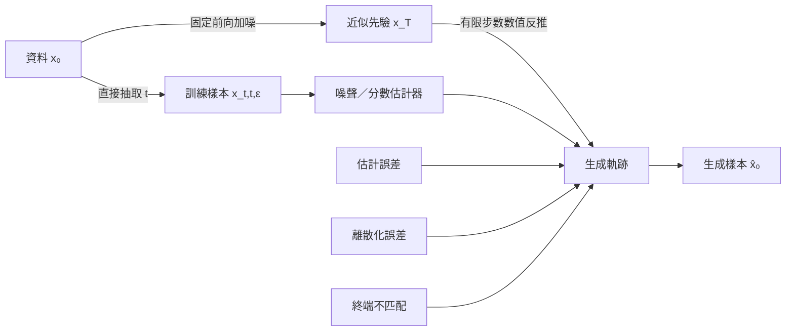

+++
title = "擴散去噪如何把生成拆成可學習步驟"
date = "2026-09-06T21:16:08+08:00"
author = "TTL::0"
draft = false
isCJKLanguage = true
description = "已知的加噪程序讓任意噪聲尺度都能構造監督訊號。說明生成如何被拆成可學習的局部問題，以及採樣誤差從哪裡進入。"
tags = [
    "分析論述", # term:AnalyticalEssay
    "AI 代理人", # term:AiAgent
    "擴散模型", # term:DiffusionModel
    "去噪分數匹配", # term:DenoisingScoreMatching
    "噪聲排程", # term:NoiseSchedule
    "擴散機率模型", # term:DiffusionProbabilisticModel
    "差異", # term:Delta
  ]
series = ["從有限證據到生成分佈：統計學習如何形成模型能力"]
[ai_info]
    [ai_info.generation]
        model = "GPT 5.6 Sol"
        agent = "Codex VS Code extension 26.901.22334"
    [ai_info.refinement]
        model = "Claude Opus 5"
        agent = "Claude Code VSCode Extension 2.1.261"
+++

<!--more-->

## 導言

在乾淨向量上逐步加入已知高斯噪聲時，任何時間點的帶噪樣本都可以直接由乾淨樣本構造。訓練因此能隨機抽一個噪聲尺度來建立監督訊號；生成卻要從噪聲出發，沿多個反向步驟回到資料區域。把這兩條路混在一起，便容易誤以為訓練也需逐步加噪，或步數越多誤差必然越大。

**擴散機率模型**（Diffusion Probabilistic Model） <!-- term:DiffusionProbabilisticModel -->以固定前向過程逐漸破壞資料，再學習反向轉移。Ho、Jain 與 Abbeel 將噪聲預測參數化連到**去噪分數匹配**（Denoising Score Matching） <!-- term:DenoisingScoreMatching -->，並在影像生成上驗證這個訓練方式。[NeurIPS 2020 論文](https://proceedings.neurips.cc/paper/2020/hash/4c5bcfec8584af0d967f1ab10179ca4b-Abstract.html) 這裡真正要問的是：已知加噪如何把整體生成轉成可學習的局部問題，採樣誤差又從哪裡進入？

> [!IMPORTANT]
> **擴散機率模型** <!-- term:DiffusionProbabilisticModel --> (Diffusion Probabilistic Model): 以固定前向加噪程序破壞資料，再學習反向轉移以生成樣本的機率模型。 <!-- anchor:DiffusionProbabilisticModel -->
> **去噪分數匹配** <!-- term:DenoisingScoreMatching --> (Denoising Score Matching): 以預測加入的噪聲取代直接估計對數密度梯度的訓練目標。 <!-- anchor:DenoisingScoreMatching -->


## 分析

### 前向邊際創造任意尺度的訓練樣本

令 $\beta_t\in(0,1)$、$\alpha_t=1-\beta_t$，前向 Markov 過程為

$$
q(x_t\mid x_{t-1})=\mathcal N(\sqrt{\alpha_t}x_{t-1},\beta_tI).
$$

定義 $\bar\alpha_t=\prod_{s=1}^t\alpha_s$，利用高斯封閉性可直接得到

$$
q(x_t\mid x_0)=\mathcal N(\sqrt{\bar\alpha_t}x_0,(1-\bar\alpha_t)I),
$$

也就是

$$
x_t=\sqrt{\bar\alpha_t}x_0+\sqrt{1-\bar\alpha_t}\epsilon,
\qquad \epsilon\sim\mathcal N(0,I).
$$

這個式子的後文用途是建立控制實驗：$\bar\alpha_t$ 直接決定訊號與噪聲的尺度。訓練可隨機抽 $t$，最小化

$$
L_{simple}(\theta)=
\mathbb E\left[\|\epsilon-\epsilon_\theta(x_t,t)\|_2^2\right].
$$

模型不是只學一個「去噪器」，而是學受 $t$ 條件控制的一族估計器。若時間條件錯誤或某些噪聲尺度抽樣不足，同一個 $x_t$ 對應的最佳修正方向可能含混。

### 從生成瑕疵回推三種誤差

生成從近似高斯的 $x_T$ 開始，反覆使用學得的反向轉移。從最終樣本失真回推，有三個中介：有限資料與網路造成分數估計誤差；有限步數造成數值離散化誤差；起始分布與前向終點未完全一致造成終端誤差。三者沿反向路徑共同影響 $x_0$。



圖把前向定義、訓練取樣與生成採樣分開。增加步數通常可降低某些離散化誤差，卻增加網路評估成本；若估計器本身在某尺度偏誤，多走幾步不必然改善。失效點是把三種誤差都歸因為「每步累積」。

Song 等人以連續時間 SDE 統一分數模型與**擴散模型**（Diffusion Model） <!-- term:DiffusionModel -->；反向時間 SDE 依賴各時刻擾動分布的 score，並可用不同數值解法採樣。[ICLR 2021 論文](https://openreview.net/pdf?id=PxTIG12RRHS) 這進一步說明，訓練目標近似相同時，採樣器仍是獨立設計與驗證對象。

> [!IMPORTANT]
> **擴散模型** <!-- term:DiffusionModel --> (Diffusion Model): 以前向加噪與反向去噪的多步轉移建立生成程序的模型族。 <!-- anchor:DiffusionModel -->


### 隔離噪聲排程的實驗

下列程式以大量向量估計 $x_0$ 與 $x_t$ 的相關，並與理論 $\sqrt{\bar\alpha_t}$ 比較。控制組重用同一批 $x_0$ 與 $\epsilon$，只改 $\bar\alpha_t$。

```python
import numpy as np

def trial(data_seed, noise_seed, alpha_bar):
    x0 = np.random.default_rng(data_seed).normal(size=200000)
    epsilon = np.random.default_rng(noise_seed).normal(size=x0.shape)
    xt = (np.sqrt(alpha_bar) * x0
          + np.sqrt(1.0 - alpha_bar) * epsilon)
    correlation = np.corrcoef(x0, xt)[0, 1]
    signal_mse = np.mean((xt - np.sqrt(alpha_bar) * x0) ** 2)
    return correlation, signal_mse

for alpha_bar in (0.9, 0.5, 0.1, 0.01):
    runs = np.array([trial(data, noise, alpha_bar)
                     for data, noise in zip(range(10), range(100, 110))])
    mean, std = runs.mean(axis=0), runs.std(axis=0)
    print(alpha_bar, "corr", mean[0], std[0], "residual", mean[1], std[1])
```

在標準化且獨立的高斯設定下，相關應接近 $\sqrt{\bar\alpha_t}$，殘差 MSE 應接近 $1-\bar\alpha_t$。若偏離超出抽樣誤差，前向構造或隨機獨立性可能有錯。這只驗證加噪公式，不驗證學得的反向模型。

要隔離採樣器，應固定同一個已訓練噪聲預測器與初始噪聲，僅改反向步數或積分器。DDIM 展示了可使用與 DDPM 相同訓練目標的非 Markov、可較少步採樣路徑，因此「訓練步數等於生成步數」並非必要條件。[DDIM 論文](https://arxiv.org/abs/2010.02502)

### 框架對照：同一條排程決定訓練訊號的難度

前向邊際是閉式的，所以上面的檢查不需要網路。下列程式加入一個最小的噪聲預測器，觀察同一批資料在不同 $\bar\alpha_t$ 下的可學習程度。

```python
import torch

torch.manual_seed(11)
x0 = torch.randn(4096, 1)
for alpha_bar in (0.9, 0.5, 0.1, 0.01):
    net = torch.nn.Sequential(torch.nn.Linear(2, 64), torch.nn.SiLU(),
                              torch.nn.Linear(64, 1))   # 每個排程點重新初始化
    opt = torch.optim.Adam(net.parameters(), lr=1e-3)
    a = torch.full_like(x0, alpha_bar)
    eps = torch.randn_like(x0)
    xt = a.sqrt() * x0 + (1 - a).sqrt() * eps
    for _ in range(300):
        opt.zero_grad()
        loss = ((net(torch.cat((xt, a), dim=1)) - eps) ** 2).mean()
        loss.backward()
        opt.step()
    print(alpha_bar, "eps-mse", loss.item())
```

在高 $\bar\alpha_t$（訊噪比高）時網路仍難以從幾乎乾淨的樣本反推噪聲，在極低 $\bar\alpha_t$ 時輸入接近純噪聲、$x_0$ 幾乎不提供資訊——兩端的損失都應接近 1（即預測不到 $\epsilon$ 的基準），中段才有可學訊號。若損失在所有排程點都相同，排程對訓練訊號沒有作用，本節的機制主張就被反駁。本段未在撰稿環境執行。

### 驗證契約

完整驗證分為前向單元測試與反向生成測試。前者失敗時不得用最終圖像品質掩蓋；後者失敗時也不能怪罪已被單元測試確認的前向公式。

| 項目 | 契約 |
| :--- | :--- |
| 資料 | 固定二維八高斯混合；前向單測另用 200,000 個標準常態樣本 |
| 切分 | 80/10/10；驗證集選 checkpoint，測試集只評一次 |
| seed | 訓練 seed 0–9；採樣 seed 100–109 與訓練 seed 分離 |
| 指標 | 各 $t$ 噪聲 MSE、模式覆蓋、最近中心距離、每樣本網路評估次數 |
| 控制變因 | 模型、資料、checkpoint 與初始噪聲固定，只改採樣器或步數 |
| 觀察量 | 品質—覆蓋—計算量前緣，以及誤差對噪聲尺度的分布 |
| 反駁條件 | 增加步數不改善任何品質指標；或**差異**（Delta） <!-- term:Delta -->在固定初始噪聲下消失 |
| 停止條件 | 預註冊步數 10、25、50、100 全部完成；不得依最佳樣本追加設定 |

> [!IMPORTANT]
> **差異** <!-- term:Delta --> (Delta): 特定變更的契約，用於驅動實作並作為驗證實作的基準對象。 <!-- anchor:Delta -->


這份契約可以定位排程、估計器與採樣器的責任。它不能把玩具分布結果外推到高解析影像或條件 guidance。

## 反思

人工加噪與資料污染不是同一件事。前者有已知條件分布、可重現 seed 與明確預測目標；錯誤標註或未知來源偏差則改變資料機制本身。把兩者混稱為噪聲會讓控制手段錯位。

「多步」也沒有單調結論。對固定連續路徑，更細步長可能降低數值誤差；但模型誤差、隨機性與 solver 設計會改變結果。反例是品質已由估計器偏誤主導時，增加相同錯誤方向的評估次數可能沒有收益。

此外，噪聲預測的低平均 MSE 可能被容易的尺度主宰。某些 $t$ 的小誤差對最終樣本更關鍵，因此需要分時間報告損失與干預結果，不能只看整體平均。

## 實務對比

錯誤比較同時改採樣器、步數、guidance、解析度與 seed，再把品質差歸因於步數。正確對照固定 checkpoint 和初始噪聲，只改一個採樣設定，並同時報告品質、覆蓋與網路評估次數。

另一個錯誤是逐步實作前向加噪來訓練，卻沒有檢查直接邊際公式。可靠實作會先以均值、變異數與相關的單元測試確認任意 $t$ 的構造，再驗證時間條件與預測目標。

最後，只展示一條去噪動畫不能證明分布學得正確。動畫是單一軌跡；模型主張需要跨 seed 的終點分布、模式覆蓋與對資料支持的距離。

## 結論

擴散模型 <!-- term:DiffusionModel -->把生成變成可學習問題的關鍵不是「反覆修圖」，而是固定前向過程提供任意噪聲尺度的監督資料，時間條件估計器再供反向過程使用。最終能力由估計誤差、終端匹配與採樣離散化共同形成。

因此，前向公式、分尺度預測與固定 checkpoint 的採樣對照應分別驗證。步數本身既不是品質保證，也不是錯誤來源；它只是在特定估計器與數值路徑下調節計算與近似的其中一個旋鈕。