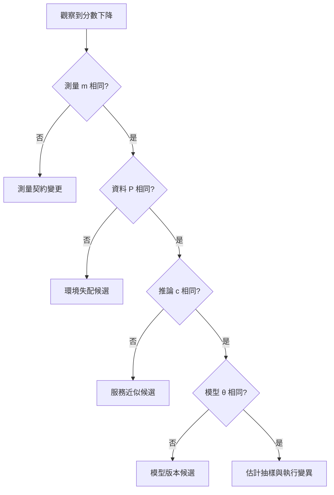

+++
title = "下降不是退化：能力失效的四軸診斷座標"
date = "2026-09-06T22:50:01+08:00"
author = "TTL::0"
draft = false
isCJKLanguage = true
description = "分數下降是警報，不是病名。把模型參數、資料分佈、推論設定與測量契約拆成四個座標，說明同一次掉分要怎麼分辨究竟是誰變了。"
tags = [
    "分析論述", # term:AnalyticalEssay
    "AI 代理人", # term:AiAgent
    "測量契約", # term:MeasurementContract
    "實務對比", # term:PracticalContrastiveExamples
    "差異", # term:Delta
    "反思", # term:Reflection
    "導言", # term:Introduction
  ]
series = ["模型能力失效：從一句「模型變差了」到可被推翻的診斷"]
[ai_info]
    [ai_info.generation]
        model = "GPT 5.6 Sol"
        agent = "Codex VS Code extension 26.901.22334"
    [ai_info.refinement]
        model = "Claude Opus 5"
        agent = "Claude Code VSCode Extension 2.1.261"
+++

<!--more-->

## 導言

同一個分類器昨天得 90%，今天得 75%。這個結果常被直接命名為「模型退化」，但分數是整套評估程序的輸出，不是權重的體檢報告。模型版本可能改了；使用者族群、數值精度或計分程式也可能改了。若多項同時變動，下降只能構成警報，不能構成歸因。

回過頭來看，真正要問的是：如何讓「能力下降」成為可反駁主張？答案是把能力定義為條件式行為，並保存四個比較座標。NIST 的 AI RMF 要求記錄測試集、指標與工具，並在接近部署條件下測量表現；這支持把評測契約視為模型證據的一部分，而非附帶行政資料。[NIST AI RMF Core](https://airc.nist.gov/airmf-resources/airmf/5-sec-core/)

## 分析

令觀察分數為

$$
S(\theta,P,c,m),
$$

其中 $\theta$ 是參數與模型程式，$P$ 是評估資料生成分佈，$c$ 是前後處理與推論設定，$m$ 是把輸出轉成分數的**測量契約**（Measurement Contract） <!-- term:MeasurementContract -->。這個記號不假定四者獨立；它要求比較者明說哪些條件被固定。

> [!IMPORTANT]
> **測量契約** <!-- term:MeasurementContract --> (Measurement Contract): 固定評測資料、指標定義與計分程式的約定，用來讓不同版本的分數可以互相比較。 <!-- anchor:MeasurementContract -->


四軸能把「75%」拆成不同事故。若要把**差異**（Delta） <!-- term:Delta -->歸因於參數，所需反事實是

> [!IMPORTANT]
> **差異** <!-- term:Delta --> (Delta): 特定變更的契約，用於驅動實作並作為驗證實作的基準對象。 <!-- anchor:Delta -->


$$
\Delta_\theta S=S(\theta_1,P^*,c^*,m^*)-S(\theta_0,P^*,c^*,m^*).
$$

星號表示兩邊共用同一快照。即使 $\Delta_\theta S<0$，也只能定位到模型版本；它尚未說明訓練更新、序列化或算子改寫哪一項造成差異 <!-- term:Delta -->。

下圖外化最低限度的排除順序。它解決的閱讀問題是：每一種故事需要哪個受控比較。



圖不是宣稱一定要按此順序操作。它表示只要上游座標未對齊，就存在足以解釋下降的替代原因。ML 系統的資料依賴、設定問題與外部世界變化會形成維護風險，也說明為何只保存權重不足以重建能力。[Hidden **技術債**（Technical Debt） <!-- term:TechnicalDebt --> in **機器學習**（Machine Learning） <!-- term:MachineLearning --> Systems](https://proceedings.neurips.cc/paper_files/paper/2015/hash/86df7dcfd896fcaf2674f757a2463eba-Abstract.html)

> [!IMPORTANT]
> **技術債** <!-- term:TechnicalDebt --> (Technical Debt): 程式碼中為求快速交付而妥協、待重構與修復的設計或品質缺陷。 <!-- anchor:TechnicalDebt -->
> **機器學習** <!-- term:MachineLearning --> (Machine Learning): 先界定可選函數的範圍，再以資料估計其中參數的建模方法。 <!-- anchor:MachineLearning -->


以下 NumPy 實驗刻意製造相同的 25 個百分點下降。操弄變因分別是閾值與標籤關係；控制變因是另一個座標；觀察量是準確率。

```python
import numpy as np

x = np.array([-2., -1., 1., 2.])
y_ref = np.array([0, 0, 1, 1])
y_shift = np.array([0, 1, 1, 1])

def accuracy(threshold, labels):
    return np.mean((x >= threshold).astype(int) == labels)

print("baseline", accuracy(0.0, y_ref))
print("model changed", accuracy(-1.5, y_ref))
print("data changed", accuracy(0.0, y_shift))
```

預期輸出是 `1.0, 0.75, 0.75`。相同結果來自不同中介變數：第一個事故移動決策邊界，第二個事故改變輸入與標籤的關係。這個玩具例只能證明分數不識別病因，不能證明真實系統四軸互不交互。

驗證契約如下：資料固定為成對快照並保留個體識別；切分採預先凍結的參考集與最新部署切片；seed 至少 5 個；指標含整體分數、個體翻轉率與切片差；控制模型、資料、推論、測量時每次只換一軸；觀察量是 $\差異 <!-- term:Delta --> S$ 及其區間；若固定三軸後差異 <!-- term:Delta -->消失，即反駁被替換軸的歸因；當區間窄於預先定義的最小實務差異 <!-- term:Delta -->，或資源上限用盡時停止。

## 反思

能力不是脫離任務存在的單一物質。它是模型在某種輸入分佈、執行契約與容許誤差下展現的行為。因此「固定條件」不是推卸線上問題；它先回答模型是否改變，再另問模型是否仍適合今日世界。

反例是：模型和資料都固定，但指標由整體準確率改成罕見類別召回率，數字下降。這不代表模型遺失能力，新指標甚至可能更符合風險。相反地，舊測試分數不變也不能證明服務無害，因為部署族群可能已離開參考分佈。

## 實務對比

錯誤做法是看到線上點擊率下降便回滾權重。若流量來源改變，回滾只是替換無辜的版本。正確做法先用同一輸入重放新舊模型，再用同一模型交叉新舊資料，最後核對數值精度、提示、後處理與指標程式。

另一個錯誤是兩個模型平均分數同為 90% 就宣稱能力相同。正確對比會保存逐樣本輸出，檢查哪些個體翻轉、損失集中在哪些切片。平均值是測量壓縮，不是行為同一性的證明。

## 結論

「退化」不是分數的同義詞，而是排除替代解釋後的因果判斷。任何下降都應先明列四個問題：模型版本是否相同、資料生成程序是否相同、推論契約是否相同、測量契約 <!-- term:MeasurementContract -->是否相同。只有固定其餘三軸後仍重現的差異 <!-- term:Delta -->，才有資格歸因於被替換的一軸。