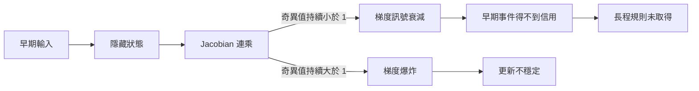

+++
title = "長程訊號為何學不到：遞迴網路的信用分配失敗"
date = "2026-09-06T22:50:02+08:00"
author = "TTL::0"
draft = false
isCJKLanguage = true
description = "架構存得住早期狀態，訓練後卻只對最近輸入敏感。沿著 Jacobian 連乘追蹤跨時間的梯度通道，把長程依賴的取得失敗與其他坍縮分開。"
tags = [
    "分析論述", # term:AnalyticalEssay
    "AI 代理人", # term:AiAgent
    "遞迴神經網路", # term:RecurrentNeuralNetwork
    "梯度消失", # term:VanishingGradient
    "信用分配", # term:CreditAssignment
    "反向傳播", # term:Backpropagation
  ]
series = ["模型能力失效：從一句「模型變差了」到可被推翻的診斷"]
[ai_info]
    [ai_info.generation]
        model = "GPT 5.6 Sol"
        agent = "Codex VS Code extension 26.901.22334"
    [ai_info.refinement]
        model = "Claude Opus 5"
        agent = "Claude Code VSCode Extension 2.1.261"
+++

<!--more-->

## 導言

一個**遞迴神經網路**（Recurrent Neural Network） <!-- term:RecurrentNeuralNetwork -->可以在架構上保存早期狀態，訓練後卻只對最近輸入敏感。此時能力不是先存在再消失，而是早期訊號從未得到足夠更新。要避免把它和其他「坍縮」混為一談，診斷必須追蹤跨時間的梯度通道。

> [!IMPORTANT]
> **遞迴神經網路** <!-- term:RecurrentNeuralNetwork --> (Recurrent Neural Network): 以隱藏狀態沿序列遞迴傳遞資訊的網路結構。 <!-- anchor:RecurrentNeuralNetwork -->


Pascanu、Mikolov 與 Bengio 從分析、幾何及動態系統角度研究**梯度消失**（Vanishing Gradient） <!-- term:VanishingGradient -->與爆炸，並提出梯度範數裁剪處理爆炸問題。論文也說明裁剪並不等於修復消失的長程訊號。[On the Difficulty of Training Recurrent Neural Networks](https://proceedings.mlr.press/v28/pascanu13.html)

> [!IMPORTANT]
> **梯度消失** <!-- term:VanishingGradient --> (Vanishing Gradient): 梯度沿深度或時間反向傳播時逐層衰減，使早期參數幾乎收不到更新訊號的現象。 <!-- anchor:VanishingGradient -->


## 分析

令狀態更新為 $h_t=F(h_{t-1},x_t;\theta)$。末端損失對較早狀態的敏感度包含 Jacobian 連乘：

$$
\frac{\partial h_T}{\partial h_k}
=\prod_{t=k+1}^{T}J_t,
\qquad J_t=\frac{\partial h_t}{\partial h_{t-1}}.
$$

因果鏈是：局部 Jacobian 在相關方向收縮，連乘的奇異值隨距離衰減，早期事件對損失的梯度接近數值零，最佳化器無法分配信用，長程規則因而未被取得。失效點位於訓練訊號，不是僅憑網路是否「有記憶單元」便能判斷。

下列實驗隔離連乘。操弄變因是每步尺度與序列長度；控制組是尺度 1；觀察量是早期影響的絕對值。

```python
import numpy as np

for scale in (0.8, 0.95, 1.0, 1.05, 1.2):
    values = [scale ** length for length in (10, 25, 50)]
    print(scale, np.array(values))
```

尺度 0.8 在 50 步後約為 $1.43\times10^{-5}$，1.2 則約為 $9.10\times10^3$。讀者應觀察距離如何放大微小局部差異。標量模型不能預測真實 RNN 的全部方向，因為矩陣非交換、非線性飽和與門控旁路都會改變有效 Jacobian。

為了把流程變成可檢查結構，下圖標出中介量與失效點。



圖支持兩條不同失效路徑。裁剪可以限制 E，卻未必恢復 D；這正是不能以單一「梯度穩定化」宣稱修復的原因。

純量模型無法顯示裁剪的作用範圍。下列 PyTorch 程式在同一個序列上取跨時間梯度，並比較裁剪前後：裁剪應改變爆炸情形的更新幅度，卻不會把已衰減到零的方向救回來。

```python
import torch

def profile(scale, length=60, hidden=16, seed=0):
    torch.manual_seed(seed)
    cell = torch.nn.RNN(hidden, hidden, batch_first=True, nonlinearity="relu")
    with torch.no_grad():                      # 直接設定轉移尺度
        cell.weight_hh_l0.copy_(scale * torch.eye(hidden))
    x = torch.randn(1, length, hidden, requires_grad=True)
    out, _ = cell(x)
    out[:, -1].sum().backward()
    per_step = x.grad[0].norm(dim=1)
    total = torch.nn.utils.clip_grad_norm_([x], max_norm=1.0)
    return per_step[0].item(), per_step[-1].item(), total.item()

for scale in (0.8, 1.0, 1.2):
    early, late, norm = profile(scale)
    print(scale, "t=0", early, "t=59", late, "pre-clip norm", norm)
```

$0.8$ 應在 $t=0$ 給出接近零的梯度，裁剪不改變這個比值；$1.2$ 的裁剪前範數應遠大於 1，裁剪把它壓回門檻。兩者說明同一個工具只處理其中一條失效路徑。撰寫時的環境未安裝 PyTorch，此段未執行。

驗證契約：資料採延遲複製任務，訓練、驗證、測試依亂數序列獨立切分；seed 為 0–9；指標含不同延遲下的準確率、$\|\partial L/\partial h_k\|$ 與梯度裁剪比例；控制參數量、最佳化器、批次與訓練步數；操弄延遲及門控；若長延遲表現改善卻沒有對應梯度通道，則反駁「梯度恢復是唯一機制」；驗證區間穩定且相鄰兩輪改善低於 0.5 個百分點時停止。

## 反思

小梯度不必然是錯誤。若遠端事件與任務無關，模型抑制它反而合理。只有在資料生成程序明確要求遠端依賴，且模型在近距離控制組成功、長距離失敗時，**信用分配**（Credit Assignment） <!-- term:CreditAssignment -->故事才獲得支持。

> [!IMPORTANT]
> **信用分配** <!-- term:CreditAssignment --> (Credit Assignment): 判定某個結果應歸因於哪些參數或決策步驟的問題。 <!-- anchor:CreditAssignment -->


反例是具有加法記憶路徑的門控網路：即使某些局部導數小，另一條近似恆等的路徑仍可傳遞訊號。這表示單一平均梯度範數會掩蓋方向性；奇異值、時間位置與任務表現必須共同解讀。

## 實務對比

錯誤做法是看到長序列失敗就一律降低學習率。降低學習率可能緩和爆炸，卻讓已經微弱的訊號更難形成有效更新。正確做法比較不同延遲，直接記錄跨時間梯度，並加入門控或截斷**反向傳播**（Backpropagation） <!-- term:Backpropagation -->的對照。

> [!IMPORTANT]
> **反向傳播** <!-- term:Backpropagation --> (Backpropagation): 以連鎖律沿計算圖回傳誤差，有效求得各層參數梯度的演算法。 <!-- anchor:Backpropagation -->


另一個錯誤是以短序列訓練損失收斂證明記憶能力。正確對比把訓練長度和測試長度分開，檢查模型究竟取得可延伸規則，還是只在短視窗內成功。

## 結論

遞迴架構的表示能力不保證最佳化可達性。長程能力失效的可檢查鏈是：有效 Jacobian 收縮或膨脹，跨時間梯度失真，早期事件無法獲得正確信用，模型因而未取得所需規則。診斷必須同時量測距離、方向與任務行為；「梯度坍縮」這個名稱本身不提供修復答案。