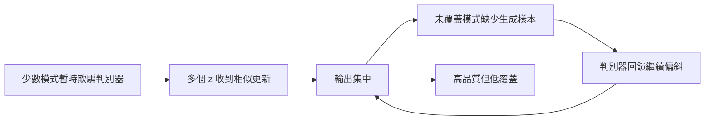

+++
title = "漂亮樣本為何仍可能失覆：GAN 的模式坍縮診斷"
date = "2026-09-06T22:50:03+08:00"
author = "TTL::0"
draft = false
isCJKLanguage = true
description = "幾張逼真的圖不等於覆蓋了分佈。分開樣本品質與模式覆蓋兩組觀察量，說明要證明模式坍縮失去的是模式，還需要哪些對照。"
tags = [
    "分析論述", # term:AnalyticalEssay
    "AI 代理人", # term:AiAgent
    "生成對抗網路", # term:GenerativeAdversarialNetwork
    "模式坍縮", # term:ModeCollapse
    "分佈覆蓋", # term:DistributionCoverage
  ]
series = ["模型能力失效：從一句「模型變差了」到可被推翻的診斷"]
[ai_info]
    [ai_info.generation]
        model = "GPT 5.6 Sol"
        agent = "Codex VS Code extension 26.901.22334"
    [ai_info.refinement]
        model = "Claude Opus 5"
        agent = "Claude Code VSCode Extension 2.1.261"
+++

<!--more-->

## 導言

**生成對抗網路**（Generative Adversarial Network） <!-- term:GenerativeAdversarialNetwork -->可以產出幾張極逼真的圖，卻反覆生成相似內容。若審查只看最佳樣本，局部品質會遮蔽**分佈覆蓋**（Distribution Coverage） <!-- term:DistributionCoverage -->。這就衍生出一個問題：如何證明**模式坍縮**（Mode Collapse） <!-- term:ModeCollapse -->失去的是模式，而不是單純的樣本品質或評估器偏差？

> [!IMPORTANT]
> **生成對抗網路** <!-- term:GenerativeAdversarialNetwork --> (Generative Adversarial Network): 由生成器與判別器相互競爭、以隱式方式逼近資料分佈的架構。 <!-- anchor:GenerativeAdversarialNetwork -->
> **分佈覆蓋** <!-- term:DistributionCoverage --> (Distribution Coverage): 生成分佈涵蓋目標分佈中各個模式的程度，與單一樣本的品質是不同的觀察量。 <!-- anchor:DistributionCoverage -->
> **模式坍縮** <!-- term:ModeCollapse --> (Mode Collapse): 生成器只覆蓋資料分佈中少數模式，導致樣本多樣性不足的失效現象。 <!-- anchor:ModeCollapse -->


原始 GAN 以生成器與判別器的對抗目標估計資料分佈。[Generative Adversarial Networks](https://arxiv.org/abs/1406.2661) Metz 等人則以展開判別器更新改善訓練，報告其方法增加多樣性與覆蓋；這提供了「生成器未預見判別器反應」的動態解釋，但不是所有模式坍縮 <!-- term:ModeCollapse -->的唯一理論。[Unrolled Generative Adversarial Networks](https://arxiv.org/abs/1611.02163)

## 分析

標準極小極大目標為

$$
\min_G\max_D
\mathbb E_{x\sim p_{data}}\log D(x)
+\mathbb E_{z\sim p(z)}\log(1-D(G(z))).
$$

實際訓練只交替做有限步更新。因果鏈是：當前判別器對一個模式給出特別有利的梯度，許多潛在點朝同一輸出區域移動，短期生成損失下降，其他資料模式缺少樣本與梯度，覆蓋進一步變差。失效點是兩方共同移動的最佳化動態，而非「圖片不夠漂亮」。

以下 NumPy 實驗不訓練 GAN，而是隔離評估問題。真實資料有四個等機率模式；兩個生成器具有相同樣本數，但一個只覆蓋單一模式。

```python
import numpy as np

def diagnostics(samples):
    p = np.bincount(samples, minlength=4) / len(samples)
    entropy = -(p[p > 0] * np.log(p[p > 0])).sum()
    return entropy, np.count_nonzero(p)

def trial(seed):
    rng = np.random.default_rng(seed)
    covered = rng.integers(0, 4, size=4000)
    collapsed = np.zeros(4000, dtype=int)
    return [diagnostics(covered), diagnostics(collapsed)]

runs = np.array([trial(seed) for seed in range(20)])
for i, name in enumerate(("covered", "collapsed")):
    print(name, "entropy", runs[:, i, 0].mean(), runs[:, i, 0].std(),
          "modes", runs[:, i, 1].mean())
```

操弄變因是生成分佈；控制資料量、模式內品質與評估器；觀察量是每模式質量、熵與覆蓋數。預期完整模型接近四個模式且熵約 $\log 4$，坍縮模型只有一個模式且熵為 0。這只能驗證離散覆蓋指標，不能代表高維語義模式已知或可無誤標註。

為了避免把症狀與機制混成一層，下圖標出證據鏈。



圖說明為何單張品質與分佈覆蓋 <!-- term:DistributionCoverage -->可背離。它不能證明迴圈總會自我強化；批次多樣性、目標函數、資料幾何與更新比例都可能打斷它。

離散計數需要事先知道模式標籤。下列程式改用連續樣本，並刻意讓「品質」與「覆蓋」兩個觀察量分開：坍縮生成器在最近真實樣本距離上可以不輸，召回卻明顯較低。

```python
import torch

torch.manual_seed(7)
centers = torch.tensor([[-3.0], [-1.0], [1.0], [3.0]])
real = centers[torch.randint(0, 4, (4000,))] + 0.2 * torch.randn(4000, 1)
covered = centers[torch.randint(0, 4, (4000,))] + 0.2 * torch.randn(4000, 1)
collapsed = centers[3] + 0.2 * torch.randn(4000, 1)

def quality(fake):                      # 每個生成樣本到最近真實樣本的距離
    return torch.cdist(fake, real).min(dim=1).values.mean().item()

def recall(fake):                       # 有多少真實樣本被生成分佈覆蓋
    return (torch.cdist(real, fake).min(dim=1).values < 0.6).float().mean().item()

for name, fake in (("covered", covered), ("collapsed", collapsed)):
    print(name, "quality", quality(fake), "recall", recall(fake))
```

兩個生成器的 `quality` 應相近，`recall` 卻應差約四倍。這是「只報單一距離型指標會讓坍縮隱形」的直接對照，也是為何契約要求品質與覆蓋分列。這段程式未在撰寫時的環境執行。

驗證契約：資料使用具已知模式的混合高斯及一個真實資料集；切分保留獨立測試樣本；seed 為 0–19；指標含 precision、recall、每模式質量與重複率；控制生成樣本數、評估表示與挑樣程序；操弄判別器步數及展開步數；若覆蓋指標未下降或下降可由評估器辨識錯誤解釋，則反駁模式坍縮 <!-- term:ModeCollapse -->；當 95% 區間可排除預設 5% 覆蓋差或訓練預算耗盡時停止。

## 反思

低多樣性不必然是模式坍縮 <!-- term:ModeCollapse -->。條件生成若固定同一類別，輸出集中可能符合契約；真實資料本身若只有一個模式，追求四模式反而是評估錯誤。模式數也不是自然給定，高維資料的「語義模式」會隨表示與距離改變。

反例是生成器覆蓋所有模式，但每個樣本都模糊。它的覆蓋指標可能很好，品質卻差。反方向也成立：精選的少數樣本品質極高，但 recall 很低。因此任何單一指標都不足以判定生成能力。

## 實務對比

錯誤做法是每輪挑 16 張最佳圖片給人看。正確做法固定無人工挑選的取樣程序，報告模式頻率、近鄰重複與品質—覆蓋曲線，並保留多個 seed。

另一個錯誤是因為生成器損失下降就宣稱訓練改善。對抗損失的尺度依賴判別器狀態。正確對比在同一外部評估器與同一真實測試集上比較，並檢查結果是否只來自評估器偏好。

## 結論

GAN 模式坍縮 <!-- term:ModeCollapse -->失去的是資料分佈覆蓋 <!-- term:DistributionCoverage -->，不是跨時間梯度，也不是潛在後驗接近先驗。可信診斷要同時證明輸出集中、真實模式確實存在，以及集中不是取樣或評估器造成。漂亮樣本只能證明局部品質；只有品質與覆蓋的受控對比，才能支持完整的生成能力主張。