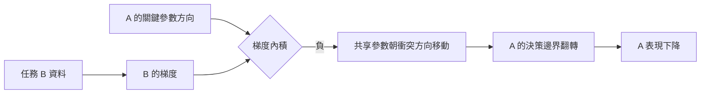

+++
title = "新能力如何覆寫舊能力：共享參數上的梯度干涉"
date = "2026-09-06T22:50:06+08:00"
author = "TTL::0"
draft = false
isCJKLanguage = true
description = "災難性遺忘不是參數自然老化，而是新目標改寫了支撐舊行為的共享參數。把遺忘定位到梯度干涉上，並說明參數距離為何不等於功能損失。"
tags = [
    "分析論述", # term:AnalyticalEssay
    "AI 代理人", # term:AiAgent
    "災難性遺忘", # term:CatastrophicForgetting
    "梯度干涉", # term:GradientInterference
    "彈性權重固化", # term:ElasticWeightConsolidation
    "梯度下降", # term:GradientDescent
  ]
series = ["模型能力失效：從一句「模型變差了」到可被推翻的診斷"]
[ai_info]
    [ai_info.generation]
        model = "GPT 5.6 Sol"
        agent = "Codex VS Code extension 26.901.22334"
    [ai_info.refinement]
        model = "Claude Opus 5"
        agent = "Claude Code VSCode Extension 2.1.261"
+++

<!--more-->

## 導言

模型先學會任務 A，再微調任務 B，A 的表現可能快速下降。這種**災難性遺忘**（Catastrophic Forgetting） <!-- term:CatastrophicForgetting -->不是參數自然老化，而是後續更新改變了支撐舊行為的共享結構。Kirkpatrick 等人把它定位於順序任務中重要權重被新目標改寫，並以參數重要性加上二次約束。[Overcoming 災難性遺忘 <!-- term:CatastrophicForgetting --> in Neural Networks](https://doi.org/10.1073/pnas.1611835114)

> [!IMPORTANT]
> **災難性遺忘** <!-- term:CatastrophicForgetting --> (Catastrophic Forgetting): 針對新任務更新參數後，先前任務表現急劇下降的現象。 <!-- anchor:CatastrophicForgetting -->


這就衍生出一個問題：一次新任務更新在什麼局部條件下會傷害舊任務，以及這個線索為何不是完整充分條件？

## 分析

令兩項損失為 $L_A(\theta)$ 與 $L_B(\theta)$。針對 B 做一步**梯度下降**（Gradient Descent） <!-- term:GradientDescent -->：

> [!IMPORTANT]
> **梯度下降** <!-- term:GradientDescent --> (Gradient Descent): 沿損失函數負梯度方向反覆更新參數的最佳化方法。 <!-- anchor:GradientDescent -->


$$
\theta'=\theta-\eta\nabla L_B(\theta).
$$

對 A 作一階 Taylor 展開：

$$
L_A(\theta')\approx L_A(\theta)-
\eta\nabla L_A(\theta)^\top\nabla L_B(\theta).
$$

若內積為負，新更新在局部提高舊損失。因果鏈是：兩任務共用關鍵參數方向，新任務梯度與舊任務梯度衝突，更新移動決策邊界，舊任務行為翻轉。失效點是共享表示上的目標衝突；學習率與曲率決定一階近似能維持多遠。

以下 NumPy 實驗以兩個互斥二次目標隔離干涉。操弄變因是是否加入舊任務約束；控制初始化與 B 的資料；觀察量是兩項損失。

```python
import numpy as np

def run(lam):
    theta, eta = 1.0, 0.25
    rows = []
    for step in range(7):
        la = 0.5 * (theta - 1.0) ** 2
        lb = 0.5 * (theta + 1.0) ** 2
        rows.append((step, theta, la, lb))
        grad_b = theta + 1.0
        grad_keep_a = lam * (theta - 1.0)
        theta -= eta * (grad_b + grad_keep_a)
    return np.array(rows)

print("unconstrained\n", run(0.0))
print("consolidated\n", run(4.0))
```

無約束時參數從 A 的最佳點移向 B，B 降而 A 升；強約束保留 A，卻限制 B 的取得。這展示穩定性—可塑性取捨。它不能代表高維網路的冗餘方向，也不能證明二次懲罰最優。

**彈性權重固化**（Elastic Weight Consolidation） <!-- term:ElasticWeightConsolidation -->的典型目標為

> [!IMPORTANT]
> **彈性權重固化** <!-- term:ElasticWeightConsolidation --> (Elastic Weight Consolidation): 依參數對舊任務的重要性施加懲罰，以減緩遺忘的正則化方法。 <!-- anchor:ElasticWeightConsolidation -->


$$
L(\theta)=L_B(\theta)+\frac\lambda2\sum_iF_i(\theta_i-\theta^*_{A,i})^2,
$$

其中 $F_i$ 近似參數對舊任務的重要性。$\lambda$ 越大，重要方向越難移動；若 A 與 B 的定義真的矛盾，限制更新只能選擇取捨，不能創造同時滿足兩者的解。

下圖標出從更新到行為損失的**中介變數**（Mediating Variable） <!-- term:MediatingVariable -->。

> [!IMPORTANT]
> **中介變數** <!-- term:MediatingVariable --> (Mediating Variable): 位於原因與結果之間、承載並使該段因果得以被觀察的可測量變數。 <!-- anchor:MediatingVariable -->




圖支持局部干涉假說，卻不能由單步內積推斷長期結局；後續梯度、曲率及新表示都可能改變路徑。

純量模型只有一個參數，內積必然是 $\pm1$。下列程式改用共享表示的網路，直接量測契約要求的逐層梯度餘弦。

```python
import torch

torch.manual_seed(0)
net = torch.nn.Sequential(torch.nn.Linear(8, 32), torch.nn.ReLU(),
                          torch.nn.Linear(32, 2))
xa, ya = torch.randn(256, 8), torch.randint(0, 2, (256,))
xb, yb = torch.randn(256, 8), torch.randint(0, 2, (256,))
ce = torch.nn.functional.cross_entropy

def grads(x, y):
    net.zero_grad()
    ce(net(x), y).backward()
    return [p.grad.flatten().clone() for p in net.parameters()]

ga, gb = grads(xa, ya), grads(xb, yb)
for i, (a, b) in enumerate(zip(ga, gb)):
    print(i, "cosine", torch.nn.functional.cosine_similarity(a, b, dim=0).item())
print("flat cosine", torch.nn.functional.cosine_similarity(
    torch.cat(ga), torch.cat(gb), dim=0).item())
```

隨機標籤下逐層餘弦應接近零，代表沒有系統性衝突；若把 `yb` 改成 `1 - ya` 並共用輸入，餘弦應轉為明顯負值。差別是診斷的重點：干涉是可量測的方向關係，不是「訓練了新任務」這個事實本身。這段程式未在撰寫時的環境執行。

驗證契約：資料使用 A、B 各自獨立訓練與測試集，並保留聯合測試；seed 為 0–9；指標含兩任務損失、準確率、逐層梯度餘弦與輸出翻轉；控制資料順序、步數、學習率及容量；操弄重播比例與 EWC 的 $\lambda$；若 A 下降但衝突方向被**投影**（Projection） <!-- term:Projection -->或重播消除後仍不變，則反駁**梯度干涉**（Gradient Interference） <!-- term:GradientInterference -->為主要原因；當 Pareto 前緣穩定或預算耗盡時停止。

> [!IMPORTANT]
> **投影** <!-- term:Projection --> (Projection): 產物透過穩定鍵間接引用共享庫時，它不再是凍結快照，而是共享庫當前狀態一個可隨時重算的呈現。 <!-- anchor:Projection -->
> **梯度干涉** <!-- term:GradientInterference --> (Gradient Interference): 不同任務的梯度方向相衝，使一方的更新提高另一方損失的情形。 <!-- anchor:GradientInterference -->


## 反思

參數距離不等於功能距離。網路可重新參數化，極小權重變化也可能移動關鍵邊界；大幅變化則可能沿功能等價方向。舊任務輸出必須直接重放。

反例是兩任務梯度局部衝突，但高維模型之後找到另一條不傷 A 的路徑。負內積是警報而非充分條件。另一邊界是任務定義互相矛盾；此時 A 下降可能是明示政策更新，而非未預期遺忘。

## 實務對比

錯誤做法是只比較微調前後的平均權重距離。正確做法保存舊任務切片與 logits，在每個階段重播，並把行為翻轉連回梯度方向。

另一個錯誤是要求新舊能力完全不變。正確做法預先定義 A 的容許損失與 B 的最低收益，報告兩者的 Pareto 取捨，而不是以單一總分藏起衝突。

## 結論

災難性遺忘 <!-- term:CatastrophicForgetting -->是後續更新造成的功能改寫。其可檢查機制是：任務共享參數，梯度在關鍵方向衝突，更新改變舊任務決策，舊能力因而下降。梯度內積提供局部線索，舊任務重放提供功能證據；兩者必須並用。所有緩解方法都在管理穩定與可塑性的取捨，不能普遍消除真實的任務矛盾。