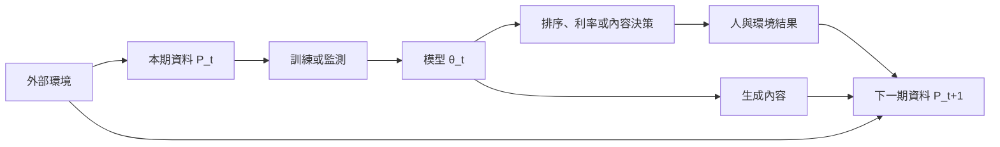

+++
title = "模型沒變，世界已變：分佈漂移與回饋資料的失配"
date = "2026-09-06T22:50:08+08:00"
author = "TTL::0"
draft = false
isCJKLanguage = true
description = "參數一個位元都沒動，風險仍持續上升。區分外生漂移、決策回饋與遞迴生成資料三種資料生成程序，說明它們的介入位置為何不能互相取代。"
tags = [
    "分析論述", # term:AnalyticalEssay
    "AI 代理人", # term:AiAgent
    "分佈漂移", # term:DistributionShift
    "表演性預測", # term:PerformativePrediction
  ]
series = ["模型能力失效：從一句「模型變差了」到可被推翻的診斷"]
[ai_info]
    [ai_info.generation]
        model = "GPT 5.6 Sol"
        agent = "Codex VS Code extension 26.901.22334"
    [ai_info.refinement]
        model = "Claude Opus 5"
        agent = "Claude Code VSCode Extension 2.1.261"
+++

<!--more-->

## 導言

部署模型的參數可以完全不變，任務風險仍持續上升。使用者族群、感測器、政策與語言會改變，形成**分佈漂移**（Distribution Shift） <!-- term:DistributionShift -->；模型輸出也可能影響決策，進而塑造下一輪資料。後者稱為**表演性預測**（Performative Prediction） <!-- term:PerformativePrediction -->。兩者雖有相同症狀，介入位置不同。

> [!IMPORTANT]
> **分佈漂移** <!-- term:DistributionShift --> (Distribution Shift): 部署資料的分佈偏離訓練分佈，使模型在參數不變下失去效用的現象。 <!-- anchor:DistributionShift -->
> **表演性預測** <!-- term:PerformativePrediction --> (Performative Prediction): 模型輸出影響人類行動，進而改變後續資料分佈的回饋情形。 <!-- anchor:PerformativePrediction -->


資料漂移實驗顯示，高維兩樣本偵測的效力取決於表示、樣本量與漂移型態，偵測到統計差異也不等同任務損失增加。[Failing Loudly](https://papers.neurips.cc/paper_files/paper/2019/file/846c260d715e5b854ffad5f70a516c88-Paper.pdf) 表演性預測 <!-- term:PerformativePrediction -->則形式化了模型決策改變後續資料分佈的情況。[表演性預測 <!-- term:PerformativePrediction -->](https://proceedings.mlr.press/v119/perdomo20a.html)

## 分析

固定 $f_\theta$ 時，兩個環境的風險是

$$
R_{P_j}(\theta)=\mathbb E_{(x,y)\sim P_j}
[\ell(f_\theta(x),y)],\qquad j\in\{0,1\}.
$$

$P_0\ne P_1$ 不保證風險一定不同；若改變落在模型不敏感的區域，表現可以不變。反方向也可能成立：單一特徵平均值不變，條件關係 $P(y\mid x)$ 已改變。因果鏈是：資料生成程序改變，重要切片的機率或標籤關係改變，固定決策邊界產生更多錯誤，聚合指標在標籤延遲後才顯現。

當預測影響行動，分佈還依賴參數：

$$
P_{t+1}=\mathcal D(\theta_t,P_t),
\qquad
R(\theta)=\mathbb E_{z\sim\mathcal D(\theta)}[\ell(z;\theta)].
$$

例如風險分數影響利率，利率改變借款行為，後續違約資料便不是舊世界的被動樣本。只做反覆重訓可能追逐自己改變的目標。

下圖區分三種容易被「漂移」一詞混合的資料路徑。



外部環境到 N 是外生漂移；A 經 O 到 N 是決策回饋；S 到 N 是生成資料遞迴。圖表支持分流診斷，不能說三條路徑在現實中互斥。

遞迴生成的研究在特定有限樣本與替代程序下發現尾部分佈先消失，並把統計、函數近似與學習近似誤差列為累積來源。[AI Models Collapse When Trained on Recursively Generated Data](https://www.nature.com/articles/s41586-024-07566-y) 以下 NumPy 實驗只隔離有限抽樣造成的罕見事件消失。

```python
import numpy as np

def trial(seed, p0=0.05, n=100, generations=12):
    rng = np.random.default_rng(seed)
    p, path = p0, []
    for _ in range(generations):
        rare = rng.binomial(n, p)
        path.append(rare)
        p = rare / n
    return path

runs = np.array([trial(seed) for seed in range(20)])
for generation in range(runs.shape[1]):
    column = runs[:, generation] / 100
    print(generation, column.mean(), column.std(),
          "absorbed", np.mean(column == 0))
```

操弄變因是是否以當代估計完全取代來源分佈；控制樣本數與抽樣器；觀察罕見事件機率。某次抽到零後，後代無法自行恢復。這不能證明所有合成資料有害；保留真實資料、擴大樣本、標示來源或主動補尾端都會改變結果。

驗證契約：資料保存來源、時間、介入策略與生成代次；時間切分禁止未來洩漏；seed 為 0–19；指標含任務風險、切片錯誤、兩樣本統計量、罕見事件覆蓋與回饋彈性；控制模型版本和評測；操弄決策政策、真實資料保留率及生成替代率；若 $P$ 的差異不改變風險，則反駁有害漂移；若隨機化或自然實驗顯示決策不影響後續資料，則反駁表演性路徑；當最小有害差異的區間被排除或監測預算到達時停止。

## 反思

「模型仍精確執行舊映射」與「系統仍服務今天的人」是不同問題。參數不變可排除內部更新，不能排除關係性能力失效。另一方面，輸入分佈改變也不必然有害；只有落在任務敏感方向的改變才值得升級。

反例是上游感測器經重新**校準**（Calibration） <!-- term:Calibration -->，輸入平均改變但真實標籤關係更準確。漂移偵測會告警，任務風險卻下降。另一邊界是選擇偏差：只觀察接受貸款者的違約，會把決策造成的缺失資料誤認為世界完整分佈。

> [!IMPORTANT]
> **校準** <!-- term:Calibration --> (Calibration): 模型輸出機率與實際正確率的一致程度。 <!-- anchor:Calibration -->


## 實務對比

錯誤做法是線上分數下降便立即微調。若原因是感測器故障，模型會適應錯誤訊號，設備修復後再度失效。正確做法先固定模型，比較輸入、標籤與條件錯誤，再決定修資料管線、改政策或更新模型。

另一個錯誤是宣稱生成資料必然毒害模型。正確做法記錄來源與代次，分別測試完全替代、混合保留與尾端補樣；結論只能涵蓋實際驗證的比例與生成程序。

## 結論

部署風險由模型與當前資料生成程序共同決定。診斷必須分清三條路徑：外部世界自行改變、模型決策改變人類結果、模型輸出直接進入後續資料。統計漂移只有在連到任務損失時才是有害證據；回饋只有在介入模型或政策後改變後續分佈時才成立。模型沒變，不代表能力與世界的關係沒變。