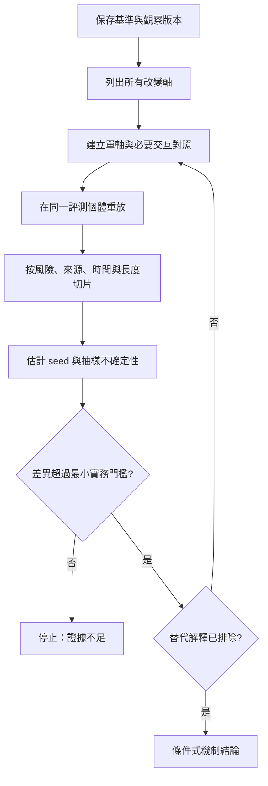

+++
title = "把退化警報變成可反駁診斷：版本、切片與停止條件"
date = "2026-09-06T22:50:09+08:00"
author = "TTL::0"
draft = false
isCJKLanguage = true
description = "監測紅線只表示某個數字越界。用版本向量、交叉重放、行為切片與統計停止條件，把退化故事收束成可以被觀察推翻的因果判斷。"
tags = [
    "分析論述", # term:AnalyticalEssay
    "AI 代理人", # term:AiAgent
    "退化診斷", # term:DegradationDiagnosis
    "行為切片", # term:BehavioralSlice
    "不確定性", # term:Uncertainty
    "損失函數", # term:LossFunction
  ]
series = ["模型能力失效：從一句「模型變差了」到可被推翻的診斷"]
[ai_info]
    [ai_info.generation]
        model = "GPT 5.6 Sol"
        agent = "Codex VS Code extension 26.901.22334"
    [ai_info.refinement]
        model = "Claude Opus 5"
        agent = "Claude Code VSCode Extension 2.1.261"
+++

<!--more-->

## 導言

監測圖上的紅線只表示某個觀察量越界。要證明能力退化，團隊還需重現基線、固定比較條件、**量化**（Quantization） <!-- term:Quantization -->**不確定性**（Uncertainty） <!-- term:Uncertainty -->，並設計能排除資料、服務與測量變更的對照。模型行為具有抽樣與執行變異，因此「在我的機器跑一次也變差」仍不足以形成因果結論。

> [!IMPORTANT]
> **量化** <!-- term:Quantization --> (Quantization): 以較少位元表示權重或啟動值，改變數值格點以降低記憶體與計算成本的近似方法。 <!-- anchor:Quantization -->
> **不確定性** <!-- term:Uncertainty --> (Uncertainty): 估計值因抽樣與執行變異而帶有的波動範圍，是判定分數差異是否顯著的前提。 <!-- anchor:Uncertainty -->


NIST AI RMF 的 Measure 功能要求記錄測試集、工具和指標，使用不確定性 <!-- term:Uncertainty -->與基準比較，並在生產環境監測系統元件。[NIST AI RMF Core](https://airc.nist.gov/airmf-resources/airmf/5-sec-core/) 本文把這些要求落成一套有反駁與停止條件的技術契約。

## 分析

將一次可重放評估表示為版本向量（version vector）

$$
v=(\theta,P,c,m,s),
$$

其中 $s$ 是 seed、抽樣順序與其他隨機狀態。若 $v_0$ 與 $v_1$ 有三個座標同時改變，單一 $\差異 S$ 無法識別各因素。最小診斷單位是混合版本：每次只替換一項，並在同一個體上成對比較。

下列程式先把不可識別狀態顯式化，再生成所需對照。操弄變因是版本軸；控制其餘欄位；觀察量是 changed axes。

```python
baseline = {
    "model": "weights-v1", "data": "snapshot-a",
    "inference": "fp32-greedy", "metric": "risk-v2", "seed": 17,
}
observed = {
    "model": "weights-v2", "data": "snapshot-b",
    "inference": "int8-greedy", "metric": "risk-v2", "seed": 17,
}

changed = [k for k in baseline if baseline[k] != observed[k]]
controls = []
for axis in changed:
    mixed = baseline.copy()
    mixed[axis] = observed[axis]
    controls.append((axis, mixed))

print("changed axes:", changed)
print("causal attribution ready:", len(changed) == 1)
for axis, version in controls:
    print(axis, version)
```

預期列出 model、data、inference 三軸，並判定尚不能單因歸因。混合版本提供三個最小對照。逐軸差分不能分解所有交互作用；若量化 <!-- term:Quantization -->只傷害新資料，還需完整的模型乘資料二乘二設計。

下圖呈現從警報到條件式結論的證據鏈。



圖的關鍵是 H：證據不足是有效終點，不是診斷失敗。它阻止小樣本波動被包裝成微幅退化。流程也要求結論只涵蓋被測資料與設定。

**行為切片**（Behavioral Slice） <!-- term:BehavioralSlice -->用來定位損失集中區域，不是增加儀表板。切片應預先由風險契約定義；探索中偶然發現的切片，要在獨立確認集重驗，避免多重比較製造訊號。資料漂移方法在不同資料與漂移下表現不一，也支持把「未偵測到」保留為檢驗力有限的條件式結果。[Failing Loudly](https://papers.neurips.cc/paper_files/paper/2019/file/846c260d715e5b854ffad5f70a516c88-Paper.pdf)

> [!IMPORTANT]
> **行為切片** <!-- term:BehavioralSlice --> (Behavioral Slice): 依輸入屬性切出的評測子集，用來揭露被整體平均掩蓋的局部損失。 <!-- anchor:BehavioralSlice -->


完整驗證契約：資料包含不可變參考集、最新部署樣本與預先定義風險切片；時間、來源與個體層級避免洩漏；seed 至少 10 個；指標含逐樣本損失、翻轉率、最差切片、**校準**（Calibration） <!-- term:Calibration -->與成對信賴區間；控制版本向量其餘座標；觀察主效應與交互效應；若差異落回抽樣區間、無法在第二快照重現，或單軸替換不復現症狀，則反駁目前歸因；當區間可排除最小實務差異、所有預註冊假說已判定，或時間預算用盡時停止。

> [!IMPORTANT]
> **校準** <!-- term:Calibration --> (Calibration): 模型輸出機率與實際正確率的一致程度。 <!-- anchor:Calibration -->


## 反思

監測與診斷有不同**損失函數**（Loss Function） <!-- term:LossFunction -->。監測為了早發現，容許高敏感度代理指標；診斷為了正確歸因，必須提高特異度並保存可重放證據。要求警報在觸發當下就附根因，只會鼓勵系統輸出未證成故事。

> [!IMPORTANT]
> **損失函數** <!-- term:LossFunction --> (Loss Function): 把模型輸出與目標之間的差距量化為單一數值的評分函數。 <!-- anchor:LossFunction -->


反例是固定所有已知座標後差異仍在，但真正原因是未版本化的 GPU kernel。這不是參數退化的證明，而是版本向量不完整。另一邊界是多個因素真有交互；逐軸替換都不復現，完整**組合**（Compose） <!-- term:Compose -->卻復現，此時不能以「單軸皆無效」宣稱沒有問題。

> [!IMPORTANT]
> **組合** <!-- term:Compose --> (Compose): 將多個獨立元件串聯運作的方式，強調資料流轉而非直接相依。 <!-- anchor:Compose -->


## 實務對比

錯誤做法是只保存模型權重。沒有資料快照、前處理、硬體精度與計分程式，舊權重只是孤立檔案。正確做法把整個版本向量和逐樣本輸出一起封存，發布前驗證可重放。

另一個錯誤是反覆瀏覽數百切片，挑一個顯著結果寫進事故報告。正確做法區分預先指定與探索切片，校正多重比較，並在新資料確認探索結果。

## 結論

**退化診斷**（Degradation Diagnosis） <!-- term:DegradationDiagnosis -->必須回答四個明確問題：哪個版本座標改變、哪個行為切片 <!-- term:BehavioralSlice -->承受損失、差異是否超出抽樣與 seed 不確定性 <!-- term:Uncertainty -->、什麼結果會推翻歸因。可重放版本提供反事實，成對切片提供定位，停止條件防止追逐噪聲。只有這四項閉合，下降才從警報升格為有邊界的因果主張。

> [!IMPORTANT]
> **退化診斷** <!-- term:DegradationDiagnosis --> (Degradation Diagnosis): 把能力下降的警報轉成可反駁機制歸因的程序。 <!-- anchor:DegradationDiagnosis -->
