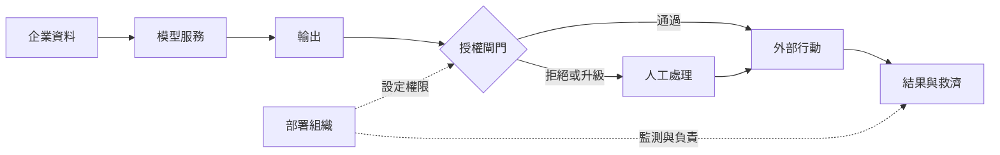

+++
title = "AI 商品的可交付邊界：從模型輸出到可追責結果"
date = "2026-09-07T00:28:01+08:00"
author = "TTL::0"
draft = false
isCJKLanguage = true
description = "模型分數不是商品。把 API、整合、授權閘門、人工覆核與救濟放回同一條交付鏈，用端到端效用式盤點哪一層讓漂亮輸出仍變不成可追責的結果。"
tags = [
    "分析論述", # term:AnalyticalEssay
    "AI 代理人", # term:AiAgent
    "社會技術系統", # term:SociotechnicalSystem
    "端到端效用", # term:EndToEndUtility
    "人工補償", # term:HumanCompensation
    "不同角色", # term:DifferentRoles
    "貢獻利益", # term:ContributionMargin
    "中介變數", # term:MediatingVariable
  ]
series = ["從能力宣稱到可驗證效用：AI 敘事的現實化鏈條"]
[ai_info]
    [ai_info.generation]
        model = "GPT 5.6 Sol"
        agent = "Codex VS Code extension 26.901.22334"
    [ai_info.refinement]
        model = "Claude Opus 5"
        agent = "Claude Code VSCode Extension 2.1.261"
+++

<!--more-->

## 導言

企業購買「AI 助理」時，簡報常以模型分數代表商品。實際合約交付的卻包含 API、容量、企業資料連接、權限、監測、人工支援與事故處理。問題因此不是模型會不會生成答案，而是哪些元件共同把答案變成可用、可停止、可救濟的結果。

這種分析單位稱為**社會技術系統**（Sociotechnical System） <!-- term:SociotechnicalSystem -->：技術元件與組織安排必須共同運作才產生價值。NIST 的 AI RMF 也把模型開發、部署、運行監測、治理與評估分給**不同角色**（Different Roles） <!-- term:DifferentRoles -->；部署者必須處理情境決策、舊系統相容與組織變革，而非把責任留給模型供應者。[NIST AI RMF 1.0](https://www.nist.gov/publications/artificial-intelligence-risk-management-framework-ai-rmf-10)

> [!IMPORTANT]
> **社會技術系統** <!-- term:SociotechnicalSystem --> (Sociotechnical System): 由技術元件與組織安排共同構成、必須整體運作才產生價值的系統。 <!-- anchor:SociotechnicalSystem -->
> **不同角色** <!-- term:DifferentRoles --> (Different Roles): 在 1:N 協作拓撲中，將 Agent 分配為生成者與審查者等不同職責角色進行協作，藉由職能分工與視角差異來發現設計缺陷。 <!-- anchor:DifferentRoles -->


## 分析

### 一次看似成功的回答為何仍不是產品成功

設某流程每期的實現價值為

$$
V=p_a(B_q+B_t)-C_s-C_i-C_h-p_eL.
$$

$p_a$ 是輸出被正確採用的機率，$B_q$ 與 $B_t$ 分別是品質與時間收益。$C_s$、$C_i$、$C_h$ 是服務、整合與人工成本；$p_eL$ 是錯誤機率乘上平均損害。這不是會計恆等式，而是避免成本與責任消失的盤點式。模型分數最多影響 $p_a$ 或 $p_e$，不能單獨決定 $V$。

這張圖把資料流和責任流疊在一起。它解決的閱讀問題是：錯誤究竟在哪個轉換點從「文字」變成「後果」。



真正的**中介變數**（Mediating Variable） <!-- term:MediatingVariable -->是授權率、例外率、人工處理時間與損害。失效點可在模型、資料連接、閘門或救濟。模型即使不變，權限放寬也會放大外部效果；模型升級若增加整合錯誤，端到端價值仍可能下降。

> [!IMPORTANT]
> **中介變數** <!-- term:MediatingVariable --> (Mediating Variable): 位於原因與結果之間、承載並使該段因果得以被觀察的可測量變數。 <!-- anchor:MediatingVariable -->


Microsoft 於截至 2026 年 6 月的 10-K 揭露，Microsoft 365 Copilot 的席次與用量成長同時推升 AI 基礎設施成本。這個案例顯示產品採用、服務容量與財務結果同屬一條交付鏈，不能把模型權重當作完整商品。[Microsoft 2026 Form 10-K](https://www.sec.gov/Archives/edgar/data/789019/000119312526323660/msft-20260630.htm)

### 可重現的機制隔離

接下來這段只用標準函式庫的程式固定模型正確率，只操弄組織的覆核設計。觀察量是每 10,000 件的淨價值與損害件數。

```python
import random

def run(review, seed=41, n=10_000):
    rng = random.Random(seed)
    value = 0.0
    harm = 0
    for _ in range(n):
        correct = rng.random() < 0.90
        flagged = review and (rng.random() < (0.75 if not correct else 0.05))
        value -= 0.20 if flagged else 0.0
        if flagged:
            correct = True
        if correct:
            value += 1.0
        else:
            value -= 8.0
            harm += 1
    return round(value, 2), harm

print("model only:", run(False))
print("review gate:", run(True))
```

兩組共用資料規模、seed、模型正確率與損害值，控制組沒有覆核。預期覆核組以人工成本換取較少損害；若旗標沒有辨識力，成本可能高於收益。實驗只能證明「同一模型可因組織設計產生不同結果」，不能估計任何真實產品的成本。

## 反思

反例是低風險、完全可逆的創意草稿。若錯誤幾乎沒有外部損害，繁重閘門會降低效用；此時模型輸出與產品效用的距離確實較短。另一個邊界是高度標準化 API：供應者可能只承諾服務可用性，不承諾客戶如何使用輸出。

因此不能推出「只要有人覆核就安全」。覆核者若沒有時間、資訊、權限或退出機制，人工節點只是責任裝飾。也不能因產品含人工作業就否定模型價值；成熟服務本就包含運營，問題是成本與責任是否被明列。

要讓這個主張可被推翻，驗證契約是這樣設計的：資料採單一工作流連續十二週的請求、人工接手與最終結果；前八週設計、後四週鎖定測試。seed 固定為 41，只用於抽樣稽核。指標是端到端完成時間、重工率、重大損害率與每件**貢獻利益**（Contribution Margin） <!-- term:ContributionMargin -->。控制變因包含任務類型、客戶層級、模型版本與權限。觀察量是各轉換點的失敗率。若模型指標改善但**端到端效用**（End-To-End Utility） <!-- term:EndToEndUtility -->未改善，核心主張獲支持；若模型分數單獨穩定預測所有結果且其他層無增量解釋力，主張被反駁。重大損害超過預設上限即停止實驗。

> [!IMPORTANT]
> **貢獻利益** <!-- term:ContributionMargin --> (Contribution Margin): 收入扣除隨使用量變動的成本後，可用以覆蓋固定支出的餘額。 <!-- anchor:ContributionMargin -->
> **端到端效用** <!-- term:EndToEndUtility --> (End-To-End Utility): 扣除整合、人工與失誤成本後，一條完整流程實際交付給使用者的價值。 <!-- anchor:EndToEndUtility -->


## 實務對比

錯誤採購法用離線準確率乘以員工人數，直接估算可替代職位。它跳過任務分解、例外、審核與損害。較好的做法選一條流程，先記錄輸入、輸出、授權、接手與結果，再用上式估算同一口徑的收益與成本。

錯誤治理法把「human in the loop」寫進簡報便視為完成。正確治理法指定誰能否決、何時升級、如何記錄、誰通知受影響者，以及如何停止自動執行。模型生成與組織授權因此不再被一句「AI 決定」壓扁。

## 結論

AI 商品的最小可信單位不是模型，而是能把輸出轉成效用、處理例外並承擔後果的服務安排。判斷一項能力是否進入現實，要逐一檢查模型、整合、授權、人工與救濟；任何一層沒有可觀察責任，漂亮輸出都仍只是候選行動。