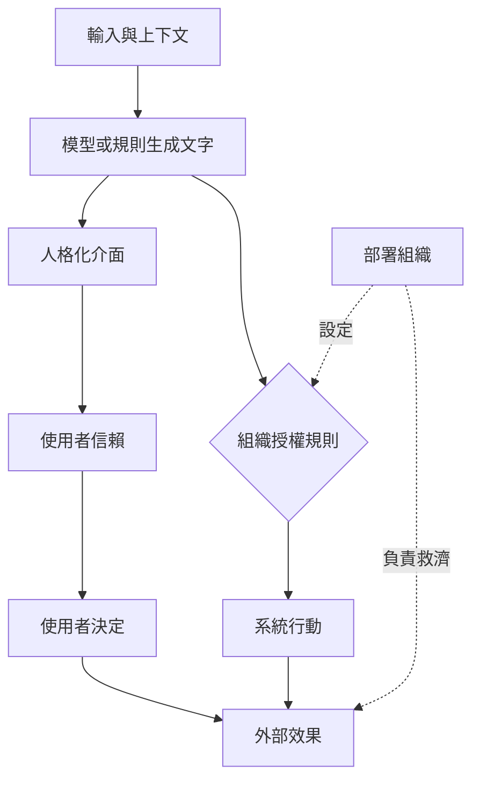

+++
title = "會說話的介面不會自行取得責任"
date = "2026-09-07T00:28:02+08:00"
author = "TTL::0"
draft = false
isCJKLanguage = true
description = "Air Canada 判決顯示聊天機器人不是獨立責任主體。分離生成、授權、執行與救濟四個角色，說明擬人化為何讓使用者誤認行動權，而揭露本身並不等於治理。"
tags = [
    "分析論述", # term:AnalyticalEssay
    "AI 代理人", # term:AiAgent
    "擬人化", # term:Anthropomorphism
    "中介變數", # term:MediatingVariable
    "主體", # term:Subject
  ]
series = ["從能力宣稱到可驗證效用：AI 敘事的現實化鏈條"]
[ai_info]
    [ai_info.generation]
        model = "GPT 5.6 Sol"
        agent = "Codex VS Code extension 26.901.22334"
    [ai_info.refinement]
        model = "Claude Opus 5"
        agent = "Claude Code VSCode Extension 2.1.261"
+++

<!--more-->

## 導言

2022 年，一名旅客向 Air Canada 網站聊天機器人詢問喪親票價。介面表示可在旅行後申請退款，旅客依此購票，之後航空公司卻以網站另一頁規則拒絕。卑詩省民事解決法庭在 2024 年認定公司須為網站資訊負責；聊天機器人不是脫離公司的獨立責任**主體**（Subject） <!-- term:Subject -->。[Moffatt v. Air Canada, 2024 BCCRT 149](https://www.canlii.org/en/bc/bccrt/doc/2024/2024bccrt149/2024bccrt149.html)

> [!IMPORTANT]
> **主體** <!-- term:Subject --> (Subject): 權限檢查中發起操作的一方，在 Linux 中由 process credentials（UID、GID、capabilities 等）描述其身分與當下能力。 <!-- anchor:Subject -->


這起事件把問題壓到一個點上：會使用第一人稱的介面，如何讓生成、授權與責任看似集中在同一個「它」身上？

## 分析

**擬人化**（Anthropomorphism） <!-- term:Anthropomorphism -->是以人的意圖、知識或意志描述系統。1994 年的電腦即社會行動者實驗顯示，人們會對電腦套用社會規則，且不必相信電腦真是人。[Nass、Steuer 與 Tauber](https://doi.org/10.1145/191666.191703) 因此，流暢語氣可降低互動成本，也可能增加信賴。

> [!IMPORTANT]
> **擬人化** <!-- term:Anthropomorphism --> (Anthropomorphism): 以人的意圖、知識或意志描述系統行為的傾向，不必然預設使用者相信系統具有人格。 <!-- anchor:Anthropomorphism -->


若模型輸出為 $y\sim p_\theta(y\mid x,c)$，這個分佈只描述在輸入 $x$ 與上下文 $c$ 下如何產生文字。它不包含付款權、政策變更權或法律人格。外部後果還需要組織配置的授權函數 $a(y,u,p)\in\{0,1\}$，其中 $u$ 是使用者角色，$p$ 是政策。

這張圖用兩條線分開外觀與權力。它讓讀者辨認**中介變數**（Mediating Variable） <!-- term:MediatingVariable -->：揭露、信賴、授權與救濟。

> [!IMPORTANT]
> **中介變數** <!-- term:MediatingVariable --> (Mediating Variable): 位於原因與結果之間、承載並使該段因果得以被觀察的可測量變數。 <!-- anchor:MediatingVariable -->




Air Canada 事件的因果鏈是：公司在官方網站提供聊天介面，介面輸出與正式政策衝突，旅客依賴輸出購票，公司拒絕事後折扣，爭議才進入法庭。失效不是「機器有惡意」，而是政策一致性、資訊授權與救濟鏈斷裂。

歐盟 AI Act 第 50 條要求，直接與自然人互動的 AI 系統原則上應告知對方正在與 AI 互動。這種揭露處理的是辨識問題，並未把部署者的責任移給介面。[Regulation (EU) 2024/1689](https://eur-lex.europa.eu/legal-content/EN/TXT/?uri=celex%3A32024R1689)

### 可重現的機制隔離

接下來這個玩具實驗固定答案準確率，只操弄人格化措辭帶來的採納率。觀察量是錯誤採納件數。

```python
import random

def simulate(trust, seed=17, n=20_000):
    rng = random.Random(seed)
    adopted = wrong = 0
    for _ in range(n):
        correct = rng.random() < 0.92
        if rng.random() < trust:
            adopted += 1
            wrong += int(not correct)
    return adopted, wrong

print("tool framing:", simulate(0.45))
print("agent framing:", simulate(0.75))
```

控制組與處理組具有相同資料、seed 與正確率，只有採納機率不同。預期人格化組採納更多，因此正確收益與錯誤暴露都增加。它不能證明人格化必然提高信任；真實效果須由隨機介面實驗估計。

## 反思

反例是專業團隊用「模型認為」作技術簡寫，且所有人都知道輸出不會自動執行。此時擬人語言未必遮蔽權限。另一邊界是緊急警報：較強的社會存在感可能提高必要回應，完全去人格化反而傷害效用。

所以不能推出「所有第一人稱都具操控性」，也不能推出「揭露為 AI 就完成治理」。揭露若沒有政策版本、引用依據、授權範圍與申訴管道，使用者仍無法校正信賴。

要讓這個主張可被推翻，驗證契約是這樣設計的：資料是同一客服流程的 6,000 次對話，隨機分派工具式與人格化介面；80% 用於估計，20% 作預先鎖定重現。seed 為 17。指標包括採納率、錯誤採納率、理解測驗、申訴率與完成時間。控制變因是答案內容、順序、政策版本與使用者任務。觀察量是信賴是否中介介面到錯誤採納的效果。若人格化不改變信賴或採納，機制在該情境被反駁；若重大誤導超過安全門檻，立即停止。

## 實務對比

錯誤描述是「AI 自己拒絕貸款」。較準確的描述是「模型產生分數，企業設定門檻並授權系統拒絕」。後者保留模型的因果作用，也留下可稽核的決策者。

錯誤介面讓角色說「我已替你核准」，卻不顯示政策版本或救濟方式。較好的介面說明「系統依 2026-07 政策完成初步判定」，提供依據、人工覆核與申訴入口。社交便利仍在，責任邊界不再消失。

## 結論

語言介面能產生行動者外觀，不能自行取得行動權或責任。判斷介面是否適當，要問四件事：誰生成、誰授權、誰執行、誰提供救濟。若這四個角色可追查，擬人化 <!-- term:Anthropomorphism -->可以是便利；若角色被一個名字吞掉，它便是責任風險。