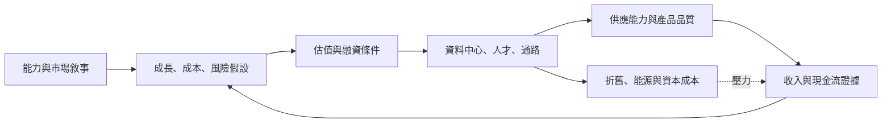

+++
title = "資本如何替 AI 未來定價"
date = "2026-09-07T00:28:04+08:00"
author = "TTL::0"
draft = false
isCJKLanguage = true
description = "敘事不會取消現金流，只會改寫成長、成功機率、成本與折現假設。區分創投尾部報酬與上市公司折現，並追蹤資本是否真的轉成產能、採用與扣除成本後的現金流。"
tags = [
    "分析論述", # term:AnalyticalEssay
    "AI 代理人", # term:AiAgent
    "折現現金流", # term:DiscountedCashFlow
    "校準", # term:Calibration
  ]
series = ["從能力宣稱到可驗證效用：AI 敘事的現實化鏈條"]
[ai_info]
    [ai_info.generation]
        model = "GPT 5.6 Sol"
        agent = "Codex VS Code extension 26.901.22334"
    [ai_info.refinement]
        model = "Claude Opus 5"
        agent = "Claude Code VSCode Extension 2.1.261"
+++

<!--more-->

## 導言

截至 2026 年 6 月的 Microsoft 年報同時呈現兩件事：Azure 等雲端需求成長，以及 AI 基礎設施和使用量對毛利率的壓力。公司也明示，雲端與 AI 投資在收入完全成熟前便需要大量資本支出。[Microsoft 2026 Form 10-K](https://www.sec.gov/Archives/edgar/data/789019/000119312526323660/msft-20260630.htm)

這不是「市場相信或不相信 AI」的二分題。真正該問的是敘事如何變成估值參數、資本支出與未來約束。

## 分析

上市公司的基本語言可用**折現現金流**（Discounted Cash Flow） <!-- term:DiscountedCashFlow -->表示：

> [!IMPORTANT]
> **折現現金流** <!-- term:DiscountedCashFlow --> (Discounted Cash Flow): 將未來現金流以資金成本折算為現值的估值方法。 <!-- anchor:DiscountedCashFlow -->


$$
V_0=\sum_{t=1}^{T}\frac{\mathbb E[FCF_t]}{(1+r)^t}
+\frac{TV_T}{(1+r)^T}.
$$

$FCF_t$ 是第 $t$ 期自由現金流，$r$ 是與風險一致的折現率，$TV_T$ 是終值。Damodaran 的教材強調現金流與折現率必須配對；成長敘事若提高收入，也須反映再投資、成本與風險。[NYU Valuation](https://pages.stern.nyu.edu/~adamodar/New_Home_Page/lectures/val.html)

早期創投更依賴離散退出情境。令退出值為 $X_j$、機率為 $p_j$、目標報酬率為 $k$，簡化現值是 $\sum_jp_jX_j/(1+k)^T$。少數巨大結果可支撐大部分期望值，但這不是標準選擇權；優先權、稀釋與後續融資仍會改變分配。

資本也會反過來改變被估值的公司。下圖解決「價格是否只是旁觀者」的問題。



關鍵中介是產能、利用率、價格、留存、折舊與自由現金流。失效點可能是資本未形成產能，產能未改善效用，或需求不足以吸收固定成本。高估值不是能力實驗；當期虧損也不是投資必然不合理。

### 可重現的機制隔離

接下來這段程式固定退出情境，只操弄成功機率與折現要求，顯示尾部假設的敏感度。

```python
def value(success_p, target_return, years=5):
    outcomes = [(0.75 - success_p, 0), (0.25, 300), (success_p, 2000)]
    expected = sum(p * x for p, x in outcomes)
    return round(expected / (1 + target_return) ** years, 2)

for p in (0.03, 0.10, 0.20):
    print(p, value(p, 0.50))
print("lower risk:", value(0.10, 0.30))
```

控制變因是退出金額與期限；操弄變因是尾部成功機率和目標報酬。觀察量是現值。它預期顯示估值對小概率尾部極敏感，但不模擬 term sheet，也不構成公司合理價格。

## 反思

反例是已有穩定合約、低再投資需求與可預測續約的成熟服務。此時 AI 敘事對估值的邊際作用可能很小，現金流證據主導。另一邊界是平台投資：同一資料中心可服務搜尋、雲端與 AI，不能把全部支出歸因單一產品。

不能從資本支出推出終端需求，也不能從股價上升推出社會價值。價格還受到利率、流動性與相對估值影響。反過來，過度投資可能留下便宜基礎設施；投資人報酬不佳與技術進步可以同時成立。

要讓這個主張可被推翻，驗證契約是這樣設計的：資料採公司正式申報的季度收入、資本支出、折舊、營運現金流與分部毛利，至少涵蓋十二季；前八季**校準**（Calibration） <!-- term:Calibration -->、後四季外推。情境模擬 seed 為 73。指標是預測誤差、投入後產能利用、增量毛利與自由現金流。控制變因包含利率、併購、匯率與會計年限變更。觀察量是資本是否依序轉成產能、採用與扣除成本後現金流。若只見投資而無利用或效用，正向敘事被反駁；若核心參數連續兩期越過預設壞情境，停止沿用原估值模型並重估。

> [!IMPORTANT]
> **校準** <!-- term:Calibration --> (Calibration): 模型輸出機率與實際正確率的一致程度。 <!-- anchor:Calibration -->


## 實務對比

錯誤分析看到高估值便說 AI 已創造等額價值。較好的分析把需求、價格、推論成本、競爭、資本需求與折現率列成情境，並標出哪個正式揭露能更新每項假設。

另一個錯誤是看到當期虧損便判定投資無理。較好的問題是：新增投入何時形成可售容量，該容量以何種利用率與價格轉成現金流，是否足以補償資本成本。這讓樂觀與悲觀都能被資料推翻。

## 結論

AI 敘事進入資本市場時，不是把現金流魔法般取消，而是改寫成長、成功機率、成本、風險與再投資假設。資本能讓部分預期自我實現，也先製造折舊與報酬門檻。可信估值必須同時追蹤資源轉換與現金流約束。