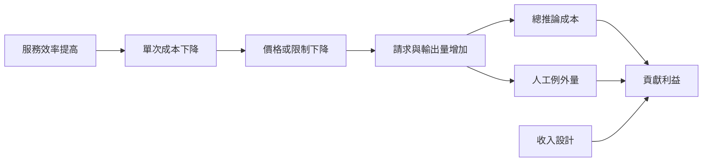

+++
title = "AI SaaS 的單位經濟：採用越多為何不必然更賺錢"
date = "2026-09-07T00:28:05+08:00"
author = "TTL::0"
draft = false
isCJKLanguage = true
description = "固定月費不會讓每次推論變免費。把推論、人工覆核與閒置容量放回每次交付，說明用量成長何時擴張貢獻利益、何時被反彈效應與尾部延遲吃掉。"
tags = [
    "分析論述", # term:AnalyticalEssay
    "AI 代理人", # term:AiAgent
    "貢獻利益", # term:ContributionMargin
    "實務對比", # term:PracticalContrastiveExamples
    "人工補償", # term:HumanCompensation
    "反彈效應", # term:ReboundEffect
    "自回歸", # term:Autoregressive
    "反思", # term:Reflection
  ]
series = ["從能力宣稱到可驗證效用：AI 敘事的現實化鏈條"]
[ai_info]
    [ai_info.generation]
        model = "GPT 5.6 Sol"
        agent = "Codex VS Code extension 26.901.22334"
    [ai_info.refinement]
        model = "Claude Opus 5"
        agent = "Claude Code VSCode Extension 2.1.261"
+++

<!--more-->

## 導言

固定月費容易讓 AI 產品看起來像傳統席次軟體：新增客戶提高收入，複製程式幾乎免費。然而每次生成仍消耗運算，長輸出占用更多時間與記憶體，失敗請求還可能觸發人工處理。Microsoft 2026 年報就把 AI 產品用量與基礎設施投資列為雲端毛利率壓力，同時指出效率改善抵銷部分成本。[Microsoft 2026 Form 10-K](https://www.sec.gov/Archives/edgar/data/789019/000119312526323660/msft-20260630.htm)

回過頭來看，真正要問的是：使用量增加時，哪條成本曲線決定**貢獻利益**（Contribution Margin） <!-- term:ContributionMargin -->擴張或收縮？

> [!IMPORTANT]
> **貢獻利益** <!-- term:ContributionMargin --> (Contribution Margin): 收入扣除隨使用量變動的成本後，可用以覆蓋固定支出的餘額。 <!-- anchor:ContributionMargin -->


## 分析

貢獻利益 <!-- term:ContributionMargin -->是收入扣除隨使用量變動的成本後，可覆蓋固定支出的餘額。對單一客戶可寫成

$$
CM=P-q(c_i+c_o\ell+c_rh)-c_f,
$$

$P$ 是期間收入，$q$ 是請求數，$c_i$ 是每次固定推論成本，$c_o\ell$ 是平均輸出長度 $\ell$ 帶來的生成成本，$c_rh$ 是需人工覆核的比率乘單次人力成本，$c_f$ 是客戶層固定服務成本。自建推論與第三方 API 只是成本位置不同，物理資源不會消失。

**自回歸**（Autoregressive） <!-- term:Autoregressive -->生成逐 token 執行，使排程與記憶體管理直接影響吞吐。Orca 以 iteration-level scheduling 改善批次利用；PagedAttention 則降低鍵值快取的記憶體浪費。兩者都顯示「每 token 成本」不是不變自然常數，而是模型、硬體、負載與服務軟體共同結果。[Orca](https://www.usenix.org/conference/osdi22/presentation/yu)、[PagedAttention](https://arxiv.org/abs/2309.06180)

> [!IMPORTANT]
> **自回歸** <!-- term:Autoregressive --> (Autoregressive): 逐步以先前輸出作為後續輸入條件的生成方式，使完成時間與輸出長度相關。 <!-- anchor:Autoregressive -->


這張因果圖區分單位成本與總支出。它避免把效率提升直接等同毛利提升。



失效點是**反彈效應**（Rebound Effect） <!-- term:ReboundEffect -->：單次成本下降刺激更多用量，總成本反而增加。另一個失效點是尾部延遲；容量為尖峰保留時，平均利用率下降，帳面上的便宜 GPU 不等於便宜請求。

> [!IMPORTANT]
> **反彈效應** <!-- term:ReboundEffect --> (Rebound Effect): 單位成本下降刺激用量上升，使總成本不降反增的現象。 <!-- anchor:ReboundEffect -->


### 可重現的機制隔離

接下來這段程式固定月費與錯誤率，操弄請求數。觀察量是單客戶貢獻利益 <!-- term:ContributionMargin -->與比率。

```python
PRICE = 30.0
FIXED = 4.0
COST_PER_REQUEST = 0.008
FLAG_RATE = 0.02
REVIEW_COST = 0.60

def margin(requests):
    variable = requests * (COST_PER_REQUEST + FLAG_RATE * REVIEW_COST)
    contribution = PRICE - FIXED - variable
    return round(contribution, 2), round(contribution / PRICE, 3)

for requests in (100, 1_000, 5_000):
    print(requests, margin(requests))
```

控制變因是價格、單次成本、旗標率與人力成本。預期固定月費下重度使用者壓縮利益。這不是現行 API 報價，也未納入共用容量；它只證明價格與成本口徑若不同步，成功採用可以惡化單位經濟。

## 反思

反例是 AI 功能提升留存或帶來用量計價收入，且效率進步快於用量與價格下降。此時用量越大，毛利可擴張。傳統影音、搜尋與儲存 SaaS 也有邊際成本，所以「AI 不是普通 SaaS」不是說其他軟體零成本，而是生成成本與互動量的連動更顯著。

不能用這個內部公式取代正式 GAAP 毛利。訓練、研發、推論與支援可能依公司會計政策落在不同科目。也不能引用單一 API 價格當永久成本；模型版本、批次折扣、快取命中與容量利用都會變。

要讓這個主張可被推翻，驗證契約是這樣設計的：資料以客戶×週為單位，至少十二週，按工作負載分層後以 70%建模、30%封存測試；seed 為 29。指標是每請求成本、每成功任務成本、P50/P95 延遲、覆核分鐘、客戶貢獻利益 <!-- term:ContributionMargin -->與留存。控制變因包含模型版本、區域、硬體、批次策略與合約價格。觀察量是用量增加一單位帶來的增量收入和增量成本。若效率改善後貢獻利益 <!-- term:ContributionMargin -->仍隨用量惡化，固定月費假設被反駁；若成本記錄遺失或重大品質指標下降，停止價格實驗。

## 實務對比

錯誤做法以年度經常性收入除以席次，宣稱具有軟體式高毛利。正確做法按客戶和工作負載扣除推論、第三方模型、容量閒置與人工例外，再比較輕度與重度群組。

錯誤優化只縮短輸出以省 token，卻忽略任務成功率下降造成重試。正確優化使用「每個成功任務成本」，同時追蹤品質、重試、延遲與人工接手。如此，成本改善不會由較差服務偽造。

## 結論

AI 可以採 SaaS 形式銷售，但形式不會消除每次推論與例外處理。要判斷規模是否改善經濟性，必須同時問價格如何隨用量變、服務效率如何變、**人工補償**（Human Compensation） <!-- term:HumanCompensation -->是否變，以及容量是否被利用。真正的護城河不是「軟體」標籤，而是每個成功結果的成本下降得比價格更快。

> [!IMPORTANT]
> **人工補償** <!-- term:HumanCompensation --> (Human Compensation): 以人力審核與例外處理填補模型不可靠之處，使系統整體達到可交付品質的做法。 <!-- anchor:HumanCompensation -->