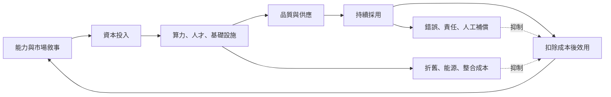

+++
title = "敘事的反身性何時閉合"
date = "2026-09-07T00:28:07+08:00"
author = "TTL::0"
draft = false
isCJKLanguage = true
description = "預期能透過資本改造現實，但只有四段轉換都留下證據才算閉合：資本形成產能、產能改善產品、產品形成留存、留存產生扣除成本與事故後的效用。"
tags = [
    "分析論述", # term:AnalyticalEssay
    "AI 代理人", # term:AiAgent
    "反身性", # term:Reflexivity
    "表演性預測", # term:PerformativePrediction
    "端到端效用", # term:EndToEndUtility
    "人工補償", # term:HumanCompensation
    "校準", # term:Calibration
  ]
series = ["從能力宣稱到可驗證效用：AI 敘事的現實化鏈條"]
[ai_info]
    [ai_info.generation]
        model = "GPT 5.6 Sol"
        agent = "Codex VS Code extension 26.901.22334"
    [ai_info.refinement]
        model = "Claude Opus 5"
        agent = "Claude Code VSCode Extension 2.1.261"
+++

<!--more-->

## 導言

2025 年 Alphabet 投入約 910 億美元資本支出，並表示 2026 年將顯著增加；約六成投向伺服器，四成投向資料中心與網路等長期資產。公司同時說明折舊與資料中心營運成本正在上升。[Alphabet 2025 Q4 earnings call](https://abc.xyz/investor/events/event-details/2026/2025-Q4-Earnings-Call-2026-Dr_C033hS6/default.aspx)

供應方對未來需求的信念已經改變今天的物理世界。回過頭來看，真正要問的是：這種**反身性**（Reflexivity） <!-- term:Reflexivity -->何時形成可驗證效用，何時只形成更多供應與承諾？

> [!IMPORTANT]
> **反身性** <!-- term:Reflexivity --> (Reflexivity): 描述未來的敘事改變參與者行動，行動再改變被描述的現實，形成互相決定的迴圈。 <!-- anchor:Reflexivity -->


## 分析

反身性 <!-- term:Reflexivity -->是描述未來的敘事改變參與者行動，行動再改變被描述的現實。令信念為 $b_t$、投資為 $i_t$、可用效用為 $u_t$、摩擦為 $f_t$，最小動態模型可寫成：

$$
i_t=\kappa b_t,\qquad
u_{t+1}=\rho u_t+g i_t-f_t,\qquad
b_{t+1}=\sigma(b_t+\lambda u_{t+1}-\mu f_t).
$$

$\kappa$ 是信念轉成資本的強度，$g$ 是資本轉成效用的效率，$\rho$ 是效用持續性，$\sigma$ 把信念限制在合理範圍。這組式子不是市場預測；它的用途是指定中介與失效點。

這張圖同時畫出增強與制衡迴圈。讀者應沿每條箭頭找可觀察證據。



正向鏈只有在資本形成可用產能、產能改善品質、品質帶來留存、留存產生扣除成本後效用時閉合。資料中心在建只證明供應方下注。利用率、價格、留存、生產力與事故率才檢查需求是否跟上。

反身性 <!-- term:Reflexivity -->也可發生在模型輸出本身。**表演性預測**（Performative Prediction） <!-- term:PerformativePrediction -->指預測影響決策，進而改變後續資料分佈。信用評分改變借款條件，推薦改變消費，生成內容改變未來訓練語料。[Perdomo 等人](https://proceedings.mlr.press/v119/perdomo20a.html) 此時重訓不只追蹤世界，也追蹤系統自己參與造成的世界。

> [!IMPORTANT]
> **表演性預測** <!-- term:PerformativePrediction --> (Performative Prediction): 模型輸出影響人類行動，進而改變後續資料分佈的回饋情形。 <!-- anchor:PerformativePrediction -->


### 可重現的機制隔離

接下來這段程式操弄資本轉效用效率與摩擦，控制初始狀態和更新規則。觀察量是信念與效用軌跡。

```python
def simulate(gain, friction, periods=8):
    belief, utility = 0.4, 0.2
    history = []
    for _ in range(periods):
        investment = belief
        utility = 0.6 * utility + gain * investment
        belief = max(0.0, min(1.0, 0.5 * belief + utility - friction))
        history.append((round(belief, 3), round(utility, 3)))
    return history

print("supported:", simulate(0.35, 0.05))
print("unsupported:", simulate(0.10, 0.28))
```

預期高轉換、低摩擦路徑增強，低轉換、高摩擦路徑衰退。係數稍變即可翻轉結果，因此程式不能預測產業規模；它證明「敘事必然自我實現」並非模型內建結論。

## 反思

反例是受固定公共預算與長期合約約束的基礎設施。短期市場敘事未必改變投資。另一個反例是供應過剩仍留下便宜算力：投資人可能虧損，後續使用者卻受益。技術進步與投資報酬不是同一命題。

反身性 <!-- term:Reflexivity -->最危險的誤用是不可證偽：成功算正向迴圈，失敗算負向迴圈。若事前沒有指定轉換率與時間窗，框架只是在事後命名。也不能把所有內容分佈變化歸因 AI；政策、競爭者與景氣同樣改變資料。

要讓這個主張可被推翻，驗證契約是這樣設計的：資料按季度蒐集資本支出、上線容量、利用率、單位推論成本、價格、留存、**端到端效用**（End-To-End Utility） <!-- term:EndToEndUtility -->、人工覆核與事故率，至少十二季；前八季**校準**（Calibration） <!-- term:Calibration -->、後四季檢驗。模擬 seed 為 67。指標是每段轉換率及其信賴區間。控制變因包含利率、能源價格、總體需求、硬體代際與大型合約。觀察量是正向收益能否覆蓋折舊、運營與失敗摩擦。若任一關鍵轉換連續兩期低於事前門檻，敘事閉合被反駁；若資料定義中途改變，停止序列比較並重建基線。

> [!IMPORTANT]
> **端到端效用** <!-- term:EndToEndUtility --> (End-To-End Utility): 扣除整合、人工與失誤成本後，一條完整流程實際交付給使用者的價值。 <!-- anchor:EndToEndUtility -->
> **校準** <!-- term:Calibration --> (Calibration): 模型輸出機率與實際正確率的一致程度。 <!-- anchor:Calibration -->


## 實務對比

錯誤做法把大量資本支出直接當需求證明。較好的做法逐段查驗：支出是否形成可售容量、容量是否被使用、使用是否留存、留存是否產生扣除成本後效用。

另一個錯誤把泡沫與技術進步視為互斥。較好的分析分開回答三題：基礎設施是否改善、使用者是否得到效用、投資價格是否合理。三者可以有不同答案。

## 結論

AI 敘事能參與生產現實，因為它協調資本、基礎設施與組織行動。但故事只有在四段轉換留下證據時成真：資本形成產能、產能改善產品、產品形成持續採用、採用產生扣除成本與事故後的效用。若任何一段只能靠更多承諾維持，反身迴圈尚未閉合。