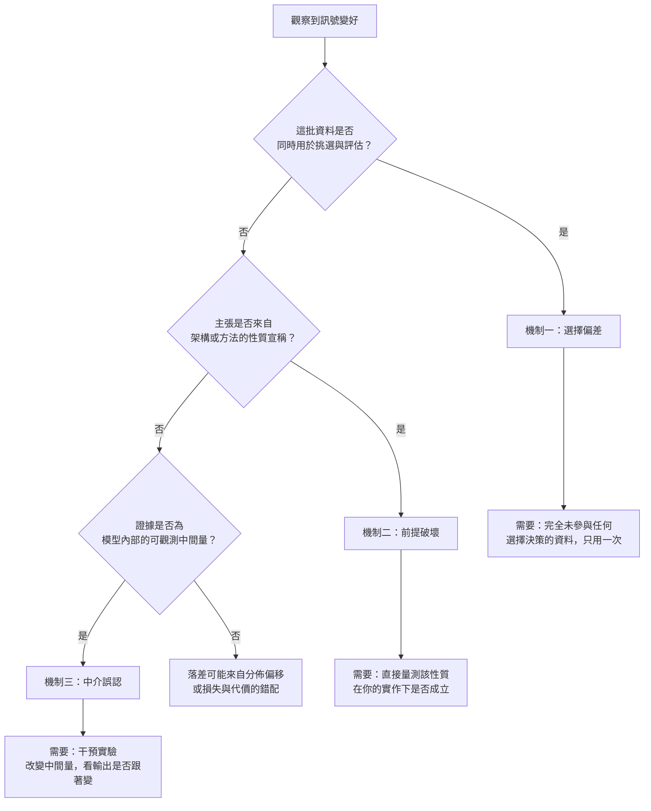

+++
title = "「指標變好」不是能力證據：代理落差的三種機制"
date = "2026-09-08T18:53:01+08:00"
author = "TTL::0"
draft = false
isCJKLanguage = true
description = "2017 年，一組研究者做了一件看起來多此一舉的事：他們拿同一份強化學習程式碼、同一個模擬環境、同一組超參數，只更換隨機種子，跑了十次。然後把這十條學習曲線隨機分成兩組，每組五條，各自畫出平均值與信賴區間。"
tags = [
    "分析論述", # term:AnalyticalEssay
    "AI 經濟與社會", # term:AiEconomics
    "選擇偏差", # term:SelectionBias
    "中介誤認", # term:MediatorMisreading
    "條件命題的前提破壞", # term:BrokenPremise
  ]
series = ["訓練訊號與能力證據：當指標變好，你到底知道了什麼"]
[ai_info]
    [ai_info.generation]
        model = "Claude Opus 5"
        agent = "Claude Code VSCode Extension 2.1.261"
    [ai_info.refinement]
        model = "Claude Opus 5"
        agent = "Claude Code VSCode Extension 2.1.263"
+++

<!--more-->

## 導言

2017 年，一組研究者做了一件看起來多此一舉的事：他們拿同一份強化學習程式碼、同一個模擬環境、同一組超參數，只更換隨機種子，跑了十次。然後把這十條學習曲線隨機分成兩組，每組五條，各自畫出平均值與信賴區間。

兩張圖看起來像兩個不同的演算法。一組穩定上升，另一組在中段崩塌後才回升；若把它們並排放進論文，任何審稿人都會相信這是「方法 A 勝過方法 B」的證據。實際上兩組之間唯一的差異是亂數。[Henderson 等人，《Deep Reinforcement Learning That Matters》](https://arxiv.org/abs/1709.06560)

這個事故值得注意的不是「隨機性會造成波動」——那是常識。值得注意的是**訊號本身完全正常**：程式沒有 bug，曲線沒有異常，指標確實在上升，每一個數字都誠實。錯的不是數字，是從數字跨到結論的那一步。

工程實務裡，這一步幾乎不會被明說出來。有人說「準確率從 0.82 升到 0.87」，聽的人自動接受「模型變強了」。中間被省略的是一個**推論**：這個在特定資料、特定切分、特定選擇程序下量到的數字，可以外推成部署環境中的行為。這篇要處理的問題是：那個推論在什麼條件下成立，又在哪些條件下會系統性地失敗。

## 分析

### 訊號是代理，不是本體

任何訓練期指標都在回答一個可計算的問題，而你真正關心的問題通常不可直接計算。這兩個問題之間的距離，是全部誤判的來源。

先把這件事寫清楚。你關心的是模型在**部署分佈**上的行為——它上線後會遇到的那些輸入，以及在那些輸入上犯錯的代價。這個量無法在訓練時計算，因為部署分佈的樣本還不存在。於是你選一個可以計算的替代品：在手上這批資料上的平均誤差。

這個替代品就是**代理**（Proxy）。代理與本體之間的差距，稱為**代理落差**（Proxy Gap）。落差不為零並不奇怪，奇怪的是它**有系統性方向**——在許多常見情境下，代理會穩定地朝著「看起來比實際更好」的方向偏。

> [!IMPORTANT]
> **代理**（Proxy）：一個可計算的量，被用來替代某個無法直接觀測、但真正關心的量。
> **代理落差**（Proxy Gap）：代理值與被代理量之間的差距。關鍵不在落差是否存在，而在它是否有系統性方向。

理解這一點後，「指標變好」這句話就可以被拆開了。它實際上包含三個獨立的斷言，而通常只有第一個被驗證過：

1. 代理值確實變好了（這個容易驗證，就是看數字）。
2. 代理落差沒有跟著變大（這個很少被檢查）。
3. 因此本體也變好了（這個是結論，不是觀察）。

第二個斷言是全篇的核心。訓練過程本身，經常就是把代理落差撐大的那個力量。

### 先把數字走一遍

這裡用一組具體數字說明「代理落差有方向」是什麼意思。場景刻意設計成極端：**所有候選模型都一樣好**。

假設你有 $k$ 個模型，每一個的真實準確率都恰好是 0.80，彼此之間沒有任何實質差異。你在一個 500 筆的驗證集上量它們。因為驗證集有限，每個模型量到的數字會在 0.80 附近隨機浮動——有的量到 0.78，有的量到 0.82。然後你做一件所有人都會做的事：**挑出驗證集上表現最好的那一個**。

下面這段程式模擬這個流程。它只用標準函式庫，可直接執行。

```python
import random, statistics

TRUE_ACC = 0.80          # 每個候選模型的真實準確率，全部相同
VAL_N    = 500           # 驗證集大小
TRIALS   = 2000

def observed(rng):
    """在 VAL_N 筆驗證資料上量到的準確率：真值 + 抽樣噪聲"""
    hits = sum(1 for _ in range(VAL_N) if rng.random() < TRUE_ACC)
    return hits / VAL_N

def best_of(k, rng):
    return max(observed(rng) for _ in range(k))

print(f"{'候選數 k':>8} {'挑出的最佳驗證準確率':>22} {'高估幅度':>12}")
for k in (1, 10, 100, 1000):
    rng = random.Random(0)
    vals = [best_of(k, rng) for _ in range(TRIALS)]
    m = statistics.fmean(vals)
    print(f"{k:>8} {m:>22.4f} {m - TRUE_ACC:>+12.4f}")
```

實際執行輸出如下：

```text
   候選數 k             挑出的最佳驗證準確率         高估幅度
       1                 0.8002      +0.0002
      10                 0.8271      +0.0271
     100                 0.8438      +0.0438
    1000                 0.8558      +0.0558
```

請注意這裡沒有任何一個模型比另一個好。真實準確率全部是 0.80，一個不多一個不少。但只要你從一千個候選裡挑出驗證集上最好的那個，你會讀到 0.8558——高估五點六個百分點，而且這個高估**每次都朝同一個方向**。$k=1$ 時偏差幾乎為零，這證實偏差不來自模擬的實作，而來自「挑選」這個動作本身。

這就是代理落差有方向的具體形態。你以為自己在測量模型，實際上你在測量「模型加上你的挑選程序」，而挑選程序會系統性地偏好那些**恰好被噪聲眷顧**的候選。候選越多，被眷顧的程度越深。

### 三種機制

上面的例子只是代理落差的其中一種產生方式。把工程實務中反覆出現的情境整理起來，可以得到三種機制。它們的觸發條件不同、症狀不同，需要的補救證據也不同——把它們混為一談，會導致用錯誤的手段修理正確診斷出的問題。

**機制一：**選擇偏差**（Selection Bias） <!-- term:SelectionBias -->。** 同一批資料同時扮演三個角色：擬合參數、挑選候選、證明結果。前兩個角色會消耗資料中的資訊，第三個角色卻假設資料還是「乾淨」的。上一節的數字就是這個機制的純粹形態。它的特徵是**候選集越大、偏差越深**，而偏差不隨模型品質改變。

> [!IMPORTANT]
> **選擇偏差** <!-- term:SelectionBias --> (Selection Bias): 從多個候選中挑出表現最好者時，該讀數同時包含真實能力與抽樣噪聲，使其系統性地優於真值的偏差。 <!-- anchor:SelectionBias -->


**機制二：**條件命題的前提破壞**（Broken Premise） <!-- term:BrokenPremise -->。** 架構或方法宣稱具備某個性質，而該性質確實可以被數學證明——但證明依賴一組前提，那些前提在實際實作中不成立。宣稱本身沒有錯，錯的是宣稱被當成無條件成立。這個機制的特徵是**理論與實作之間的落差**，而不是統計上的落差；換更多資料不會改善它。

> [!IMPORTANT]
> **條件命題的前提破壞** <!-- term:BrokenPremise --> (Broken Premise): 架構或演算法的數學性質是條件命題；當實作為了效率或有限輸入而違反其前提時，該性質在特定條件下完全失效，而非緩慢退化。 <!-- anchor:BrokenPremise -->


**機制三：**中介誤認**（Mediator Misreading） <!-- term:MediatorMisreading -->。** 模型內部有某個可觀測的中間量，它與輸出相關，於是被當成輸出的**原因**。但相關不等於因果，而且中間量與最終輸出之間通常還隔著數層變換。這個機制的特徵是**觀測本身是真的**，只有歸因是假的。

> [!IMPORTANT]
> **中介誤認** <!-- term:MediatorMisreading --> (Mediator Misreading): 把因果鏈上可觀察的中介變數當成成因本身，因而以觀察性讀數回答只有干預才能回答的問題。 <!-- anchor:MediatorMisreading -->


> [!IMPORTANT]
> **選擇偏差**（Selection Bias）：因為用同一批資料既挑選又評估，導致被挑中者的評估值系統性偏高。
> **條件命題**（Conditional Claim）：只在特定前提下成立的主張。當前提未被檢查，它會被誤讀為無條件事實。

三個機制各自需要不同的獨立證據。下圖把診斷路徑外化成流程，因為「該補哪一種證據」是本篇最實用的產出，而它涉及判斷順序與分支，用散文描述會失去可檢查性。



圖的分支順序不是任意的。選擇偏差 <!-- term:SelectionBias -->排在最前面，因為它最容易發生且最容易被忽略——任何做過超參數搜尋的流程都已經觸發它。前提破壞排第二，因為它需要你知道自己在依賴哪個宣稱，這比檢查資料流程更需要領域知識。中介誤認 <!-- term:MediatorMisreading -->排最後，因為它只在你開始看模型內部時才有機會發生。

最下方的 `M0` 分支是誠實的出口：三種機制不是窮盡的分類。分佈偏移與損失錯配也會造成落差，它們有各自的處理方式，不應被硬塞進上述三格。

### 每種機制的失效反例

分類要有用，就必須能指出它在什麼時候不適用。以下三個反例分別對應三種機制，說明「補上對應證據」也可能不夠。

**選擇偏差 <!-- term:SelectionBias -->的反例：候選集雖大但偏差可忽略。** 若候選模型之間的真實差異遠大於驗證集的抽樣噪聲，挑選就不再是在挑噪聲。承接前面的數字：若一個模型真實準確率是 0.95，其餘都是 0.80，那麼即使 $k=1000$，挑出的幾乎必然是那個真正更好的。這說明「做過模型選擇」不等於「結果無效」；需要比較的是**真實差異的尺度與噪聲的尺度**。

**前提破壞的反例：前提不成立，但影響量可忽略。** 一個架構的對稱性可能因為邊界處理而在數學上嚴格破壞，然而破壞只發生在影像最外圈的幾個像素。若任務的決策資訊集中在中央區域，這個嚴格的破壞在實務上沒有後果。這說明「前提被破壞」是必要診斷而非充分定罪，還需要量測破壞的幅度。

**中介誤認 <!-- term:MediatorMisreading -->的反例：中間量確實承載因果。** 若某個中間量與輸出之間的映射是可逆的，且沒有其他路徑繞過它，那麼觀察該中間量就確實是在觀察成因。這說明「不能只看內部觀測」的正確版本是「必須用干預驗證」，而不是「內部觀測毫無價值」。

三個反例共用一個形狀：機制的存在是**條件性的**，而條件本身可以被量測。這是本篇的分類與「凡是做過選擇就不能信」這類教條的分野。

## 反思

### 分類的邊界

三種機制是從實務中蒐集的可反駁樣本，不是從理論推導出的完備分類。至少有兩類落差不在其中。

第一類是**分佈偏移**。即使你的評估程序完全乾淨、架構前提全部成立、也沒有依賴任何內部觀測，部署環境的輸入分佈仍可能與訓練時不同。這種落差的成因在資料生成過程，不在推論程序，因此上面的三種補救動作都無法處理它。

第二類是**損失與代價的錯配**。你最佳化的是平均誤差，你在乎的是罕見但昂貴的錯誤。這兩者可以同時「變好」與「變壞」——降低平均誤差的模型可能在關鍵子群上更差。這種落差的根源在目標函數的定義，而不在任何測量程序。

把這兩類硬塞進三機制分類會造成誤診。診斷流程圖裡的 `M0` 分支存在的理由就是這個：一個分類法最重要的部分，常常是它明確拒絕解釋的區域。

### 補證據的成本不對稱

三種機制需要的獨立證據，取得成本差異很大，而這個差異會扭曲實務行為。

處理選擇偏差 <!-- term:SelectionBias -->只需要紀律：預先切出一批資料，凍結它，最後只用一次。成本幾乎是零，但需要在專案早期就決定，而那時通常還不知道最後要比較什麼。

處理前提破壞需要領域知識：你得知道自己在依賴哪個宣稱，並設計一個直接量測該性質的測試。成本中等，但門檻高——它要求你把「架構自帶的好處」明確寫成一個可被推翻的命題。

處理中介誤認 <!-- term:MediatorMisreading -->需要干預實驗：改變中間量，觀察輸出是否跟著改變。成本最高，因為它通常需要修改模型內部或重跑推論。這解釋了為什麼熱圖式的解釋在實務中如此流行——它便宜，而正確的替代方案昂貴。

成本不對稱本身不是問題，把成本當成正當性才是。「我們沒有做干預測試」是一個資源決策，可以接受；「熱圖顯示模型在看正確的區域」則是一個未經證成的因果主張，不能接受。兩者的差別只在於是否誠實陳述證據等級。

### 這個框架什麼時候不該用

若一個決策的錯誤代價很低且可快速回滾，把每個指標都拆成三個斷言是過度工程。內部工具的推薦排序、A/B 測試中可即時關閉的功能、探索階段的原型——這些場景下，指標變好就直接發布是合理的，因為部署本身就是最便宜的驗證。

這個框架的適用區間是**回滾成本高於驗證成本**的場合：模型進入不可觀測的下游流程、錯誤在數週後才顯現、或失敗的代價落在無法申訴的第三方身上。判斷標準不是模型多複雜，而是你多快能知道自己錯了。

### 實驗能證明什麼，不能證明什麼

實驗把所有候選模型的真實準確率設成完全相同的 $0.80$，所以挑出的最佳值與 $0.80$ 的差全部是抽樣噪聲。這是刻意的：它隔離出「挑選本身能製造多少高估」，而排除了「候選之間確有差異」這個混雜。代價是它不能回答實務上更常問的問題——當候選之間**真的**有差異時，挑出的最佳值有多少來自能力、多少來自噪聲。那個分解需要知道真實差異的分佈，而那正是未知的東西。

驗證集 500 筆與 2000 次重複是選定的。高估幅度隨驗證集變大而縮小、隨候選數變多而放大，兩者的方向是結構性的；表上的數字只在這組參數下成立。

候選被模擬成互相獨立。真實的候選模型高度相關——同一架構調不同學習率，得到的驗證分數不是獨立抽樣。相關會降低有效候選數，因此獨立假設**高估**了同樣 $k$ 之下的挑選增益。

第二段之後的區分是證據等級的說明，不是實驗。

## 實務對比

**錯誤做法**：團隊跑了兩百組超參數，挑出驗證集上最好的一組，報告 0.87 的準確率，並在文件裡寫「模型準確率 0.87」。

這個數字有三重問題。它是兩百次挑選的最大值，因此帶有前面量到的那種系統性高估。它沒有標註是哪一批資料上的數字，讀文件的人會預設它是部署行為。它是單一數字，因此無法區分「所有子群都是 0.87」與「多數子群 0.92、關鍵子群 0.61」。

**較可靠的做法**：把資料的三個角色分開，並在報告時保留角色標記。

```text
訓練集   → 估計參數
驗證集   → 挑選超參數（可反覆使用，代價是它的數字不能當結論）
測試集   → 凍結，在所有決策定案後只評估一次

報告格式：
  驗證集最佳 0.87（200 組候選中選出，此數字含選擇偏差，不作為能力宣稱）
  測試集     0.83（單次評估，n=5000）
  子群最低   0.61（子群 C，n=210）
```

關鍵不是多一個測試集，而是**每個數字都標註它能支持什麼**。上面的格式讓 0.87 與 0.83 之間的四個百分點差距變成可見的資訊，而不是被藏起來的偏差。子群那一行則讓平均值無法掩蓋分佈內部的不均。

**另一個錯誤做法**：測試集數字不如預期，於是回頭調整模型，再測一次。

這一步會讓測試集降級成驗證集。它現在參與了選擇決策，因此它的數字重新帶有選擇偏差 <!-- term:SelectionBias -->，而且這次的偏差沒有任何剩餘資料可以偵測。實務上這通常不可避免——真正的問題是它是否被記錄。

**較可靠的做法**：把測試集的使用次數當成一個要申報的量。

```text
測試集使用紀錄：
  2026-08-14  第 1 次  0.83  決策：發布 v1
  2026-09-02  第 2 次  0.86  決策：發布 v2
                             備註：v2 的架構調整參考了第 1 次的錯誤分析，
                                   因此 0.86 已非獨立估計，視為樂觀上界
```

這份紀錄不會讓偏差消失，但它讓偏差可見。可見的偏差可以被下游決策者納入考量；不可見的偏差只會變成半年後的意外。

## 結論

訓練期的每一個指標都在誠實地回答一個問題。誤判來自那個問題比你以為的窄。

要把訊號變成能力證據，需要回答三件事，而不是一件：代理值是否變好、代理落差是否也跟著變大、以及落差屬於哪一種機制。第一件事看數字就知道；第二件事需要一批未被任何決策污染的觀察；第三件事決定你該補哪一類證據——乾淨的資料、對性質本身的直接量測，或是一次干預實驗。

因此，一個可檢查的能力主張至少要明列三項：這個數字在哪批資料上產生、這批資料是否參與過任何選擇、以及哪一個尚未發生的觀察能夠推翻這個主張。缺少第三項時，你手上的不是能力證據，而是一份對訓練過程的描述。