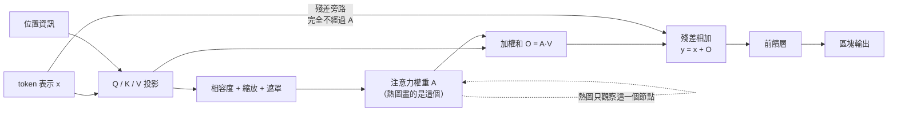

+++
title = "熱圖不是模型的理由：注意力權重與因果歸因的距離"
date = "2026-09-08T19:58:06+08:00"
author = "TTL::0"
draft = false
isCJKLanguage = true
description = "2018 年，一組研究者對常用的**顯著圖**（Saliency Map）方法做了一個看似無聊的測試。他們拿一個訓練好的分類器產生顯著圖，然後開始**把模型的權重逐層隨機化**——從最後一層開始，一層一層換成隨機值，直到整個模型變成噪聲。每換一層，就重新產生一次顯著圖。"
tags = [
    "分析論述", # term:AnalyticalEssay
    "機器學習", # term:MachineLearning
    "注意力機制", # term:AttentionMechanism
    "中介變數", # term:MediatingVariable
    "位置編碼", # term:PositionalEncoding
  ]
series = ["訓練訊號與能力證據：當指標變好，你到底知道了什麼"]
[ai_info]
    [ai_info.generation]
        model = "Claude Opus 5"
        agent = "Claude Code VSCode Extension 2.1.261"
    [ai_info.refinement]
        model = "Claude Opus 5"
        agent = "Claude Code VSCode Extension 2.1.263"
+++

<!--more-->

## 導言

2018 年，一組研究者對常用的**顯著圖**（Saliency Map）方法做了一個看似無聊的測試。他們拿一個訓練好的分類器產生顯著圖，然後開始**把模型的權重逐層隨機化**——從最後一層開始，一層一層換成隨機值，直到整個模型變成噪聲。每換一層，就重新產生一次顯著圖。

如果顯著圖真的在解釋這個模型，那麼當模型被摧毀後，圖也應該崩壞成無意義的雜訊。

有幾種廣泛使用的方法沒有崩壞。權重全部隨機化之後，它們產生的圖與原本那張在視覺上依然相似，依然清楚地勾勒出物體的輪廓。[Adebayo 等人，《Sanity Checks for Saliency Maps》](https://arxiv.org/abs/1810.03292)

原因是這些方法在數學上高度依賴輸入本身，對模型參數的依賴很弱。它們實際上在做的事接近邊緣偵測——而邊緣偵測不需要模型，也不解釋模型。

這個測試之所以重要，不在於它否定了某幾種方法，而在於它示範了一個判準：**一個解釋若在被解釋對象消失後依然存在，它解釋的就不是那個對象。** 這篇要用這個判準檢視另一種被廣泛當成解釋的東西——注意力權重。

## 分析

### 先把數字走一遍

先把**注意力機制**（Attention Mechanism） <!-- term:AttentionMechanism -->算一次，用三個 token、二維向量，全部手算。

> [!IMPORTANT]
> **注意力機制** <!-- term:AttentionMechanism --> (Attention Mechanism): Transformer 架構中用於計算輸入序列不同位置之間關聯權重的核心機制。 <!-- anchor:AttentionMechanism -->


給定查詢 $q$、三個鍵 $k_1,k_2,k_3$、三個值 $v_1,v_2,v_3$。設

$$
q=(1,0),\quad
k_1=(1,0),\ k_2=(0,1),\ k_3=(-1,0).
$$

第一步算相容度，也就是內積：$q\cdot k_1=1$、$q\cdot k_2=0$、$q\cdot k_3=-1$。

第二步經過 softmax 變成權重。$e^1\approx2.718$、$e^0=1$、$e^{-1}\approx0.368$，總和約 4.086，所以

$$
A\approx(0.665,\ 0.245,\ 0.090).
$$

三個數字非負且相加為 1。

第三步用這組權重混合值向量。設 $v_1=(4,0)$、$v_2=(0,4)$、$v_3=(0,0)$：

$$
O = 0.665\,v_1+0.245\,v_2+0.090\,v_3 = (2.66,\ 0.98).
$$

整個機制就是這三步：**相容度 → 競爭性正規化 → 加權混合**。

現在把最重要的性質指出來。$O$ 是三個值向量的加權和，它是一個**壓縮**。從 $(2.66, 0.98)$ 這個輸出，你無法還原出原本有三個什麼樣的向量。不同的輸入組合可以產生完全相同的輸出——這一點稍後會被算出來。

> [!IMPORTANT]
> **注意力權重**（Attention Weights）：softmax 之後的非負、和為 1 的係數，決定各位置的值向量以什麼比例被混合。它是一個中間量，不是模型的輸出。

### 為什麼要除以維度的平方根

在進入解釋性問題之前，先處理一個實作細節，因為它會影響熱圖看起來的樣子。

標準的注意力定義中，內積要先除以 $\sqrt{d_k}$：

$$
A=\operatorname{softmax}\!\left(\frac{QK^\top}{\sqrt{d_k}}\right).
$$

理由可以從高維內積的統計推出。若查詢與鍵的各分量獨立、均值零、變異數為 1，那麼內積 $q\cdot k=\sum_{i=1}^{d_k}q_ik_i$ 是 $d_k$ 個獨立項的和，變異數約為 $d_k$，標準差約為 $\sqrt{d_k}$。維度越高，內積的典型絕對值越大。

softmax 對輸入尺度極度敏感。當 logits 的尺度隨維度增長，分佈會變得極尖——幾乎所有權重集中在一個位置。下面的程式量測這件事。

```python
import random, math

def softmax(z):
    m = max(z); e = [math.exp(v - m) for v in z]; s = sum(e)
    return [v / s for v in e]

def entropy(p):
    return -sum(v * math.log(v + 1e-12) for v in p)

N_KEYS, TRIALS = 16, 400
print("鍵數 16，均勻分佈的熵上限 ln(16) = %.4f" % math.log(16))
for d in (8, 64, 512, 4096):
    rng = random.Random(5)
    un, sc = [], []
    for _ in range(TRIALS):
        q = [rng.gauss(0, 1) for _ in range(d)]
        logits = []
        for _ in range(N_KEYS):
            k = [rng.gauss(0, 1) for _ in range(d)]
            logits.append(sum(a * b for a, b in zip(q, k)))
        un.append(entropy(softmax(logits)))
        sc.append(entropy(softmax([v / math.sqrt(d) for v in logits])))
    print("d=%-6d 未縮放熵 %.4f   除以 sqrt(d) 後 %.4f"
          % (d, sum(un)/TRIALS, sum(sc)/TRIALS))
```

實際執行輸出：

```text
鍵數 16，均勻分佈的熵上限 ln(16) = 2.7726
d=8      未縮放熵 1.3112   除以 sqrt(d) 後 2.3560
d=64     未縮放熵 0.3986   除以 sqrt(d) 後 2.3464
d=512    未縮放熵 0.1252   除以 sqrt(d) 後 2.3633
d=4096   未縮放熵 0.0433   除以 sqrt(d) 後 2.3424
```

未縮放那一欄從 1.31 掉到 0.043。熵接近零意味著分佈幾乎全部押在單一位置上——即使這些鍵完全是隨機噪聲，彼此之間沒有任何實質差異。

縮放那一欄則在 2.34 到 2.36 之間穩定，與維度無關。

這個結果有一個直接的解釋性後果：**一張看起來「模型很專注」的熱圖，可能只是尺度的產物**。在未縮放或尺度失控的實作中，極尖的注意力分佈是幾何上的必然，不代表模型找到了關鍵位置。判斷熱圖之前，得先知道它的尺度是否受控。

### 中介變數與因果的距離

現在進入核心問題。注意力權重與輸出之間隔著什麼？

下圖把一個標準注意力區塊的資訊路徑畫出來。畫成圖而非散文，是因為關鍵在於**有幾條路通往輸出**，而這個數量決定了單看其中一條能得出什麼結論。



圖中有兩件事值得注意。

第一，$A$ 只影響 $O$ 這一條路。輸入 $x$ 透過殘差連接**完全繞過**注意力直達輸出。若 $\lVert O\rVert$ 相對 $\lVert x\rVert$ 很小，那麼即使 $A$ 大幅改變，區塊輸出的變化也有限。

第二，$O$ 之後還有前饋層與後續數十個區塊。$A$ 對最終預測的影響，是經過這一長串變換之後的殘留。

這使得注意力權重成為一個**中介變數**（Mediating Variable） <!-- term:MediatingVariable -->：它在因果鏈上，但它既不是起點也不是終點，而且它不是唯一的中介。

> [!IMPORTANT]
> **中介變數** <!-- term:MediatingVariable --> (Mediating Variable): 位於原因與結果之間、承載並使該段因果得以被觀察的可測量變數。 <!-- anchor:MediatingVariable -->


> [!IMPORTANT]
> **中介變數**（Mediating Variable）：位於原因與結果之間、可被觀測的量。它承載部分因果傳遞，但觀測它不等於觀測因果本身。

### 反駁一：權重可以不唯一

最直接的反駁是構造兩個差異極大的權重分佈，讓它們產生相同的輸出。

當值向量線性相依時，這很容易做到。取三個共線的值向量：

```python
V = [(0.0, 0.0), (1.0, 1.0), (2.0, 2.0)]      # v2 = (v1+v3)/2
def out(a): return tuple(sum(a[j]*V[j][c] for j in range(3)) for c in (0, 1))

a = [0.0, 1.0, 0.0]      # 「模型只看第 2 個 token」
b = [0.5, 0.0, 0.5]      # 「模型完全忽略第 2 個 token」
print("分佈 A =", a, "-> 輸出", out(a))
print("分佈 B =", b, "-> 輸出", out(b))
print("L1 距離 = %.1f" % sum(abs(x-y) for x, y in zip(a, b)))
```

實際執行輸出：

```text
分佈 A = [0.0, 1.0, 0.0] -> 輸出 (1.0, 1.0)
分佈 B = [0.5, 0.0, 0.5] -> 輸出 (1.0, 1.0)
L1 距離 = 2.0
```

L1 距離 2.0 是機率單體上的最大可能值——兩個分佈的支撐集完全不重疊。一張熱圖會說「模型只看第 2 個 token」，另一張會說「模型完全忽略第 2 個 token」。輸出一模一樣。

### 這個反駁的作用範圍

上面的構造依賴值向量共線。真實模型的值向量維度很高，共線是例外而非常態。這個反駁能推廣多遠？需要量測，而不是假設。

下面的程式在隨機（不刻意共線）的值向量上搜尋替代分佈：要求輸出的相對誤差小於 1%，找出 L1 距離最遠的那一個。

```python
for dim in (1, 2, 4, 8):
    # ... 在機率單體上隨機搜尋，保留輸出誤差 < 1% 且 L1 距離最遠者
    print("值向量維度 %d  平均最大 L1 距離 %.3f" % (dim, avg_dist))
```

實際執行輸出：

```text
值向量維度 1  平均最大 L1 距離 0.801
值向量維度 2  平均最大 L1 距離 0.039
值向量維度 4  平均最大 L1 距離 0.009
值向量維度 8  平均最大 L1 距離 0.004
```

非唯一性隨維度**急速消失**。值向量只有 1 維時可以找到相距 0.80 的替代分佈；到了 8 維，最遠只有 0.004，實質上唯一。

這是一個誠實的邊界，而且它推翻了一個過度簡化的說法。在真實 Transformer 中，單一頭的值向量維度通常是 64 或更高。**在那個維度下，給定 $V$，產生特定輸出的注意力分佈幾乎是唯一的。** 「權重不唯一所以不能解釋」這個論證，在高維情況下站不住腳。

那麼真實模型的問題在哪裡？在別的地方。

### 反駁二：權重高不等於影響大

更有力的反駁不是關於唯一性，而是關於**排名**。熱圖的實務用法是「哪個位置的權重最高，模型就是靠它做決定」。這個推論可以直接檢驗。

下面的程式建立一個含殘差分支與非線性讀出的最小結構，然後比較兩件事：注意力權重最高的位置，與留一法量到影響最大的位置。留一法的做法是把某個位置遮掉、重新正規化其餘權重，看最終輸出變了多少。

```python
def head(att):
    o = [sum(att[j]*V[j][c] for j in range(N)) for c in range(DV)]
    z = [resid[c] + o[c] for c in range(DV)]     # 殘差相加
    return sum(w[c]*math.tanh(z[c]) for c in range(DV))

base = head(a)
loo = []
for j in range(N):                                # 留一法
    m = [0.0 if i == j else a[i] for i in range(N)]
    s = sum(m); m = [v/s for v in m]
    loo.append(abs(head(m) - base))

agree = (a.index(max(a)) == loo.index(max(loo)))
```

在 2000 次隨機試驗、6 個位置、8 維值向量下的實際輸出：

```text
注意力最高權重的位置 == 留一法影響最大的位置：67.4%
（若注意力就是解釋，這個比例應該接近 100%）

一個不一致的例子：
  位置              0       1       2       3       4       5
  注意力權重    0.358   0.216   0.124   0.272   0.002   0.028
  留一法影響    0.172   0.372   0.026   0.060   0.000   0.012
  注意力指向位置 0，實際影響最大的是位置 1
```

67.4% 這個數字需要小心解讀，兩個方向都要說。

**它遠高於隨機。** 六個位置隨機猜中的機率是 16.7%。67.4% 意味著注意力權重確實攜帶關於影響力的資訊，不是噪聲。把熱圖說成「毫無意義」是錯的。

**它也遠低於 100%。** 每三次就有一次，你指著的那個 token 不是影響最大的那個。若這個熱圖被用來向使用者解釋「模型為什麼拒絕你的申請」，三分之一的解釋指錯了對象。

不一致的來源在那個例子裡看得很清楚。位置 0 的權重最高（0.358），但它的值向量恰好與其他位置的貢獻方向相近，移除它之後其餘位置補上了大部分；位置 1 的權重只有 0.216，但它的值向量在讀出方向上獨特，移除它造成的變化最大。**權重衡量的是混合比例，影響衡量的是移除後的差異，兩者不是同一個量。**

這與在真實 NLP 任務上的實測結論方向一致：注意力權重常與梯度式重要度不相關。[Jain 與 Wallace，《Attention is not Explanation》](https://aclanthology.org/N19-1357/)

## 反思

### 反方意見值得認真對待

上述批評有一個重要的反駁，而忽略它會讓結論過度膨脹。

「存在一個產生相同預測的替代權重分佈」這個事實，需要仔細界定。若那個替代分佈是**被訓練出來的**——也就是你另外優化一組注意力參數，使它既遠離原分佈又保持預測——那麼你得到的是一個**不同的模型**。這個新模型的存在，並不說明原模型實際使用的那組權重毫無意義。[Wiegreffe 與 Pinter，《Attention is not not Explanation》](https://aclanthology.org/D19-1002/)

這個區分很實際。「這個模型可能用別的方式達到同樣結果」與「這個模型實際上不是這樣運作的」，是兩個不同的主張。前者為真不蘊涵後者。

因此本篇的結論要收窄成一個可操作的形式：注意力權重是**關於這次前向計算的觀察性證據**，而觀察性證據不能單獨支撐因果歸因。要得到因果結論，需要干預——遮蔽、替換、或比較移除前後的輸出。這個要求對熱圖並不特殊，它對任何觀察性證據都成立。

### 順序不是注意力自己產生的

一個容易被忽略的性質：若移除位置資訊，對輸入位置施加任意排列，注意力的輸出會作相同的排列。裸注意力**無法區分相同 token 的先後**。

這意味著在讀熱圖時，你看到的「模型注意到了第 3 個詞」這件事，其中「第 3 個」這個概念是由**位置編碼**（Positional Encoding） <!-- term:PositionalEncoding -->提供的，不是注意力機制 <!-- term:AttentionMechanism -->本身的能力。若位置編碼 <!-- term:PositionalEncoding -->在長序列上的外推行為不佳，熱圖上的位置語義也會跟著不可靠。

> [!IMPORTANT]
> **位置編碼** <!-- term:PositionalEncoding --> (Positional Encoding): 為本身不含順序資訊的注意力模型補入序列位置的表示方法。 <!-- anchor:PositionalEncoding -->


把這件事說清楚有實務價值：當長文本的表現退化時，候選成因至少包括注意力的路由品質與位置表示的外推能力，而這兩者需要分別測試。

### 路徑短不等於不會遺忘

注意力常被描述為「讓任意兩個位置直接相連」。這個描述在計算圖的意義上正確，但它容易被讀成「因此不會遺忘」。

$O_i$ 是值向量的加權和，是一個有限維的壓縮。多個不同的輸入組合可以產生相近的 $O_i$，而後續層只看得到壓縮後的結果。計算圖上的一步可達，說的是**存在路徑**，不是**資訊無損通過**。

有限上下文則是更直接的限制。窗口外的內容根本沒有路徑；窗口內的內容也會因為位置偏差與競爭而被弱化。這使得「長上下文等於長期記憶」成為一個需要量測而非假設的主張——量法是固定模型與資料，只移動關鍵資訊的位置，畫出準確率對相對距離的曲線。

### 二次複雜度的常見誤讀

標準全注意力形成 $N\times N$ 的分數矩陣，核心運算對序列長度是二次的。這常被直接換算成「所以長序列一定慢」。

實際的執行時間還取決於前饋層的成本、批次大小、記憶體頻寬與硬體的算力密度。在中等長度下，前饋層往往才是主要成本，注意力的二次項尚未主導。$O(N^2)$ 是一個漸近陳述，它不能單獨推出任何特定長度下的比較結果——那需要實測。

### 實驗能證明什麼，不能證明什麼

第一個實驗用的是隨機高斯的查詢與鍵，那是**初始化**的狀態，不是訓練後的模型。訓練後的注意力離這個虛無模型很遠，所以那些熵值解釋的是 $1/\sqrt{d}$ 縮放為何存在，不是任何一層訓練後的熵。

第二個實驗的值向量是被構造成恰好共線的（$v_2=(v_1+v_3)/2$）。真實的值向量不會恰好共線，所以輸出完全相同這件事證明的是多對一映射存在，不是它在真實模型裡多常接近成立。

第四個實驗那個三分之二的一致率，來自一個三 token、單一 tanh、單一殘差相加的玩具頭。它不是任何真實模型的注意力與影響一致率——深度、頭數與非線性都會改變它。把它讀成「熱圖有三分之二可信」是把玩具的數字外推到真實系統。

第五到第七段程式是呈現方式與量測程序的示意，沒有被執行。

## 實務對比

**錯誤做法**：把熱圖中最高權重的 token 標成「模型的理由」，並展示給使用者。

```python
weights = model.get_attention(text)          # 取最後一層、平均所有頭
top = text_tokens[weights.argmax()]
show_user(f"模型主要依據「{top}」做出此判斷")
```

三個問題疊在一起。跨層與跨頭的平均會抹掉各層不同的功能。權重最高不等於影響最大——前面量到的一致率是 67.4%。而「依據」是一個因果主張，這段程式碼只有觀察。

**較可靠的做法**：用干預取代觀察，並讓解釋能夠失敗。

```python
def token_influence(model, text, target_class):
    """遮蔽每個 token，量目標類別機率的變化"""
    base = model(text).softmax(-1)[target_class]
    return {tok: (base - model(mask_token(text, i)).softmax(-1)[target_class]).item()
            for i, tok in enumerate(text_tokens)}

infl = token_influence(model, text, pred)
attn = model.get_attention(text)

# 一致性檢查：兩種方法指向同一個 token 嗎？
if argmax(infl) != argmax(attn):
    log("注意力與干預結果不一致，不對外呈現單一理由")
else:
    show_user(f"移除「{argmax(infl)}」會使信心下降 {infl[argmax(infl)]:.2f}")
```

差別在於呈現的內容本身變了。第二版說的是「移除這個 token 會讓信心下降 0.31」——這是一個可驗證的陳述，使用者可以自己去掉那個詞再問一次。第一版說的「模型主要依據這個」則無法被任何人檢查。

**另一個錯誤做法**：比較長文本模型時同時更換窗口、位置編碼 <!-- term:PositionalEncoding -->、資料與參數量，再把差異歸因於「注意力機制 <!-- term:AttentionMechanism -->更好」。

**較可靠的做法**：固定模型與資料，只操弄關鍵資訊的位置。

```python
# 把同一段關鍵資訊插入不同位置，其餘完全不變
for pos in range(0, context_len, 256):
    doc = build_document(filler, key_fact, insert_at=pos)
    acc[pos] = evaluate(model, doc, question_about(key_fact))

# 輸出一條「準確率 vs 相對距離」曲線，而不是一個平均值
```

這個設計把位置變成唯一的獨立變因。得到的曲線可以回答「路由在多遠的距離開始退化」，而這是一個關於這個模型的事實，不是關於注意力機制 <!-- term:AttentionMechanism -->的一般宣稱。

## 結論

一個解釋若在被解釋對象消失後依然成立，它解釋的就不是那個對象。這個判準適用於顯著圖，也適用於注意力熱圖。

注意力權重是可觀測的中介變數 <!-- term:MediatingVariable -->。它攜帶真實資訊——量測顯示它指向的位置有三分之二的機率確實是影響最大的那個，遠高於隨機。但它也隔著值投影、殘差旁路與後續數十層變換，因此那三分之二的另一面是：每三次就有一次指錯對象。權重衡量混合比例，影響衡量移除後的差異，兩者是不同的量。

因此，注意力權重可以回答「這次前向計算如何加權」，不能單獨回答「哪些輸入造成了輸出」。後者需要干預：遮蔽、替換、或比較移除前後的差異。這個要求不是對熱圖的特殊苛求，而是觀察性證據與因果主張之間一貫的距離。