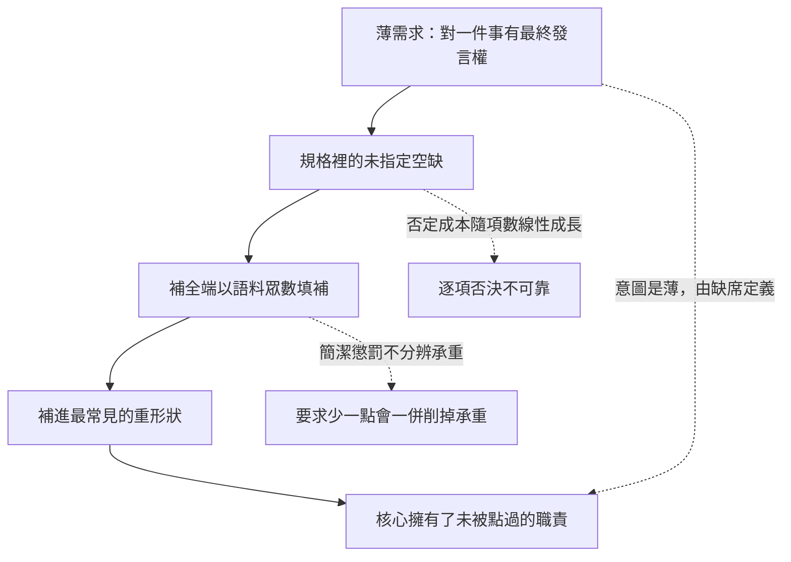

+++
title = "由沉默定義的需求：補全引擎為何系統性地把薄核補肥"
date = "2026-09-09T01:12:01+08:00"
author = "梅乾"
draft = false
isCJKLanguage = true
description = "三次委託拿回的都是平台而非薄核。本文論證這不是粗心而是結構：薄意圖由沒說出口的「不要」定義，而補全引擎讀不到沉默，只能在規格的空缺處填入語料眾數；並證明「補少一點」在形式上調錯了軸。"
tags = [
    "分析論述", # term:AnalyticalEssay
    "軟體工程與規格", # term:SoftwareEngineeringSpecifications
    "薄核", # term:ThinCore
    "過度生成", # term:OverGeneration
    "擁有權", # term:Ownership
    "眾數補全", # term:ModalCompletion
    "薄意圖", # term:ThinIntent
    "承重", # term:LoadBearing
  ]
series = ["封裝邊界的劃界權：當補全端會替你把界劃肥"]
[ai_info]
    [ai_info.generation]
        model = "Claude Opus 5"
        agent = "Claude Code VSCode Extension 2.1.261"
    [ai_info.refinement]
        model = "Kimi K3"
        agent = "GitHub Copilot Chat v0.66.0"
+++

<!--more-->

## 導言

三次委託，三次拿回同一種東西。

第一次要的是一段生命週期的保證——某個東西被登記、被認領，要嘛完成要嘛失效。拿回來的是一整套 job queue：排程、重試、退避、傳輸、投遞、死信。第二次要的是一塊 in-memory 暫存，過程用完即丟。拿回來的是一個持久化資料庫，外加耐久性契約與 payload 保證。第三次要的是一個狀態機，只管狀態怎麼轉。拿回來的東西附贈了 schema 版本控制，還咬死了資料遷移。

三次的形狀完全一樣：**要的是對某一件事有最終發言權的**薄核**（Thin Core） <!-- term:ThinCore -->，拿回來的是那件事在生態系裡通常長成的樣子。**

> [!IMPORTANT]
> **薄核** <!-- term:ThinCore --> (Thin Core): 對單一職責握有最終發言權、且克制擁有權的核心元件。薄不是規模小，而是擁有權的克制：核心只承載承重且歸屬於它的少數幾項行為。 <!-- anchor:ThinCore -->


值得注意的是這些多出來的東西沒有一項是錯的。job queue、持久化、schema 遷移在對的場景都對。問題在別處：**沒有人點過這些菜。** 它們不是需求，是預設補全。

這不是粗心，也不是模型不夠好。本文要論證的是一個可預測的失敗模式：**當邊界沒被講死時，生成端會用生態系裡最常見的形狀替你把它劃肥**，而這件事的成因在需求的形式本身——**薄意圖**（Thin Intent） <!-- term:ThinIntent -->是由「沒說出口的那些不要」定義的，而補全引擎讀不到沉默。

> [!IMPORTANT]
> **薄意圖** <!-- term:ThinIntent --> (Thin Intent): 由「沒說出口的那些不要」所定義的需求意圖。補全引擎讀不到沉默，只能讀到這種東西通常怎麼做，因此薄意圖在生成管線裡會被系統性補肥。 <!-- anchor:ThinIntent -->


## 分析

### 眾數補全：問題不在補得多，在補的是眾數

一個補全引擎的行為可以寫成一句話：在未指定的位置填入條件分佈的眾數。這句話沒有任何反常之處——它正是補全該做的事。

反常的是它與薄意圖 <!-- term:ThinIntent -->的關係。下面的程式把「狀態機」旁邊各周邊能力在語料裡的共現頻率固定，只改補全的門檻。

```python
import random
# 語料裡「狀態機」這個詞旁邊出現各周邊能力的頻率。
# 補全引擎取眾數：頻率高於門檻就補進來。
CORPUS = {
    "持久化":       0.86,
    "schema 版本":  0.71,
    "資料遷移":     0.64,
    "事件溯源":     0.38,
    "分散式鎖":     0.22,
}
def complete(threshold):
    return [f for f, p in CORPUS.items() if p >= threshold]

print("使用者的意圖：只要狀態轉移，周邊一項都不要\n")
for th in (0.9, 0.75, 0.6, 0.5, 0.3):
    got = complete(th)
    print(f"  補全門檻 {th:.2f} -> 補進 {len(got)} 項 {got}")
print()
# 使用者實際想要各周邊的機率（與語料頻率無關）
WANT = {"持久化": 0.12, "schema 版本": 0.05, "資料遷移": 0.04,
        "事件溯源": 0.02, "分散式鎖": 0.01}
got = complete(0.6)
hit = sum(WANT[f] for f in got)
print(f"門檻 0.6 補進的 {len(got)} 項，使用者真正想要的期望數：{hit:.2f} 項")
print(f"也就是 {len(got) - hit:.2f} 項是純粹的過度生成")
```

實際執行的輸出：

```text
使用者的意圖：只要狀態轉移，周邊一項都不要

  補全門檻 0.90 -> 補進 0 項 []
  補全門檻 0.75 -> 補進 1 項 ['持久化']
  補全門檻 0.60 -> 補進 3 項 ['持久化', 'schema 版本', '資料遷移']
  補全門檻 0.50 -> 補進 3 項 ['持久化', 'schema 版本', '資料遷移']
  補全門檻 0.30 -> 補進 4 項 ['持久化', 'schema 版本', '資料遷移', '事件溯源']

門檻 0.6 補進的 3 項，使用者真正想要的期望數：0.21 項
也就是 2.79 項是純粹的過度生成
```

門檻 $0.60$ 補進三項，而使用者真正想要的期望數是 $0.21$ 項。三項裡有 $2.79$ 項是純粹的**過度生成**（Over-Generation） <!-- term:OverGeneration -->。

> [!IMPORTANT]
> **過度生成** <!-- term:OverGeneration --> (Over-Generation): 生成端把一個薄需求自動補全成生態系裡最典型的重平台的現象。 <!-- anchor:OverGeneration -->


這個落差的來源要說清楚：**語料頻率與使用者意圖是兩個互不相關的分佈。** 語料頻率記錄的是「這種東西通常怎麼做」，使用者意圖記錄的是「這一次要什麼」。補全引擎只能取用前者，而第三次委託要的正是後者的罕見值。薄版本在語料裡是少數，肥版本才是統計上的預設完成。

### 由缺席定義的需求：否定的成本隨項數線性成長

有人會說：把設計意圖講清楚不就好了。這個回答假設「講清楚」的成本是固定的。它不是。

要一個狀態機時，沒有人說「不要持久化」「不要遷移」「不要事件溯源」——那些是隻字未提。而薄意圖 <!-- term:ThinIntent -->恰恰要靠這些未提的否定來界定：它是一個**由缺席定義**的需求。

```python
# 由缺席定義的需求：要守住薄，必須把每個「不要」逐項說出來。
# 而人一次能想起的否定項數有限。
def survives(k_features, recall_per_item):
    """k 項周邊都必須被明確否決，才守得住薄核"""
    p = recall_per_item ** k_features
    return p

print("每一項『不要』被想起的機率固定，薄核存活率隨周邊項數指數衰減：")
print(f"{'周邊項數':>8}{'記得率0.95':>12}{'記得率0.85':>12}{'記得率0.70':>12}")
for k in (1, 3, 5, 8, 12):
    row = "".join(f"{survives(k, r):>12.1%}" for r in (0.95, 0.85, 0.70))
    print(f"{k:>8}{row}")
print()
print("反方向：正面列舉「要什麼」的成本不隨周邊項數成長")
for k in (1, 3, 5, 8, 12):
    print(f"  周邊 {k:>2} 項 -> 需說出的否定 {k:>2} 句 / 需說出的肯定 1 句")
```

實際執行的輸出：

```text
每一項『不要』被想起的機率固定，薄核存活率隨周邊項數指數衰減：
    周邊項數     記得率0.95     記得率0.85     記得率0.70
       1       95.0%       85.0%       70.0%
       3       85.7%       61.4%       34.3%
       5       77.4%       44.4%       16.8%
       8       66.3%       27.2%        5.8%
      12       54.0%       14.2%        1.4%

反方向：正面列舉「要什麼」的成本不隨周邊項數成長
  周邊  1 項 -> 需說出的否定  1 句 / 需說出的肯定 1 句
  周邊  3 項 -> 需說出的否定  3 句 / 需說出的肯定 1 句
  周邊  5 項 -> 需說出的否定  5 句 / 需說出的肯定 1 句
  周邊  8 項 -> 需說出的否定  8 句 / 需說出的肯定 1 句
  周邊 12 項 -> 需說出的否定 12 句 / 需說出的肯定 1 句
```

每一項「不要」被想起的機率固定在 $0.85$ 時，周邊 12 項的薄核 <!-- term:ThinCore -->存活率是 $14.2\%$。即使每項記得率高到 $0.95$，12 項下也只剩 $54.0\%$。

第二段是這個實驗真正的用處。否定式的規格成本隨周邊項數線性成長，肯定式的不成長。**所以「講清楚」不是一個努力問題，而是一個表述形式問題**——用否定來界定薄核 <!-- term:ThinCore -->，把成本綁在一個會成長的量上；用肯定來列舉**承重**（Load-Bearing） <!-- term:LoadBearing -->集合，成本綁在一個不成長的量上。

> [!IMPORTANT]
> **承重** <!-- term:LoadBearing --> (Load-Bearing): 缺了它核心承諾就當場不成立的能力。與「碰得到」相對：後者與核心相鄰、可被想到且每項都有用，但缺席並不致命。 <!-- anchor:LoadBearing -->


### 為什麼剎不住：薄與殘是同一個旋鈕的兩端

第三個問題是：能不能要求補全引擎「補得少一點」。

這個要求在形式上等效於給每一項加一個固定的簡潔懲罰。下面的程式顯示這個旋鈕的問題。

```python
# 補全引擎的簡潔偏好 vs 語料頻率：要求「做少一點」能移動多少眾數？
CORPUS = {"持久化": 0.86, "schema 版本": 0.71, "資料遷移": 0.64,
          "事件溯源": 0.38, "分散式鎖": 0.22}

def complete(brevity_penalty, threshold=0.5):
    """簡潔偏好把每項的有效分數往下壓，但壓的是同一個常數"""
    return [f for f, p in CORPUS.items() if p - brevity_penalty >= threshold]

print("加上『請做得薄一點』這類指示，等效於一個固定的簡潔懲罰：")
for pen in (0.0, 0.10, 0.20, 0.30, 0.40):
    got = complete(pen)
    print(f"  懲罰 {pen:.2f} -> 仍補進 {len(got)} 項 {got}")
print()
need = max(CORPUS.values()) - 0.5
print(f"要把最高頻的一項也擠掉，懲罰必須大於 {need:.2f}")
print("而同樣強度的懲罰會一併擠掉承重的能力——薄與殘是同一個旋鈕的兩端")
```

實際執行的輸出：

```text
加上『請做得薄一點』這類指示，等效於一個固定的簡潔懲罰：
  懲罰 0.00 -> 仍補進 3 項 ['持久化', 'schema 版本', '資料遷移']
  懲罰 0.10 -> 仍補進 3 項 ['持久化', 'schema 版本', '資料遷移']
  懲罰 0.20 -> 仍補進 2 項 ['持久化', 'schema 版本']
  懲罰 0.30 -> 仍補進 1 項 ['持久化']
  懲罰 0.40 -> 仍補進 0 項 []

要把最高頻的一項也擠掉，懲罰必須大於 0.36
而同樣強度的懲罰會一併擠掉承重的能力——薄與殘是同一個旋鈕的兩端
```

懲罰 $0.10$ 完全無效，仍補進三項。要擠掉最高頻的那一項，懲罰必須大於 $0.36$。

而懲罰是一個**不分辨承重 <!-- term:LoadBearing -->與否的常數**。同樣 $0.40$ 的懲罰會一併擠掉那些本來承重 <!-- term:LoadBearing -->的能力，因為它作用在頻率上而不是作用在「這一次要不要」上。這就是「剎不住」的精確意思：可調的旋鈕是簡潔程度，而需要調的是**擁有權**（Ownership） <!-- term:Ownership -->歸屬，兩者不是同一個軸。

> [!IMPORTANT]
> **擁有權** <!-- term:Ownership --> (Ownership): 系統元件對資料、狀態或生命週期的絕對控制權。 <!-- anchor:Ownership -->


### 這件事不特屬於生成端

值得把這個機制與一個更早、與生成完全無關的案例並排，因為它說明引力的來源不是模型。

systemd 起於 2010 年，最初的範圍是取代 init。今天這個專案的元件清單包含日誌、裝置管理、網路設定、DNS 解析、時間同步、登入會話、容器、定時任務與開機載入。[systemd 專案元件](https://systemd.io/)

每一項的加入都有一個當時合理的理由：既然要管服務生命週期，就需要知道服務的日誌；既然要知道日誌，就需要一個日誌後端。這條鏈上沒有任何一步是荒謬的。

**所以慣例引力不是補全引擎的缺陷，它是「相鄰職責看起來總是該一起處理」這件事的後果。** 生成端做的只是把這個引力自動化並加速——它把原本需要數年才漂完的距離，在一次補全裡走完。

下圖把整條因果排出來。它要回答的閱讀問題是：漂移發生在哪一步，以及那一步為什麼攔不住。



圖上有三條虛線，它們是三個獨立的失效點。最上面那條是需求形式的問題，中間那條是規格成本的問題，最下面那條是控制軸的問題。三者都不能靠「更小心」解決，因為三者都不是疏忽。

## 反思

主張有一個明確的不適用區：**當慣例恰好等於這一次的實踐時，**眾數補全**（Modal Completion） <!-- term:ModalCompletion -->不但不出錯，還是最省的選擇。**

> [!IMPORTANT]
> **眾數補全** <!-- term:ModalCompletion --> (Modal Completion): 補全引擎在未指定的規格空缺處，填入訓練語料條件分佈中頻率最高（眾數）形狀的行為模式；它與薄意圖在形式上互不相關，因此不對齊是結構性的。 <!-- anchor:ModalCompletion -->


一個標準需求的全新專案——要的就是一套教科書式的持久化、一套標準的背景工作處理，沒有任何非典型約束——此時補進來的重形狀剛好就是要的東西。在這種場合強行求薄是過度工程：拆掉的正是本來就需要的。第一個實驗裡若把 `WANT` 的各項機率改成接近語料頻率，過度生成 <!-- term:OverGeneration -->量就趨近零。

判準因此不是「薄一定對」，而是回到那條缺席的意圖：**那些沒說出口的「不要」，是真的不要，還是其實要？** 如果核心的承諾真的需要那套持久化或那套投遞保證，它們就是承重 <!-- term:LoadBearing -->的，不該被薄化。

一個反例可以標出主張的另一側。假設有人成功地把每一項否定都寫進規格，核心確實出來得很薄——而它上線後不堪用，因為被否決掉的其中一項是真正承重 <!-- term:LoadBearing -->的。這是同一個失敗的鏡像：否定式規格既難完整，也難正確。這說明第二個實驗的結論不是「否定要寫得更全」，而是「否定式的表述形式本身該被換掉」。

第三個邊界關於引力的來源。上面把 systemd 與生成端並排，是為了說明引力先於生成技術而存在。但兩者有一個重要差別：systemd 的每一次擴張都經過人的討論與爭議，留下了可追溯的理由；補全端的擴張不留任何痕跡，它在輸出裡與被點過的部分長得一模一樣。**所以生成端真正新增的風險不是漂移的幅度，是漂移的不可見。**

最後是實驗的限制。三個實驗都把語料頻率、意圖機率與記憶機率壓成獨立的純量，而真實的共現是高度相關的——要了持久化通常也就要了遷移。相關性會使第一個實驗的過度生成 <!-- term:OverGeneration -->量被低估、第二個實驗的存活率被高估。它們共同證明「眾數補全 <!-- term:ModalCompletion -->與薄意圖 <!-- term:ThinIntent -->在形式上不對齊」這個結構，不估計任何真實工具的過度生成 <!-- term:OverGeneration -->率。第三個實驗把簡潔指示模型化成一個線性懲罰，這是最粗的一個簡化；真實的指示會改變條件分佈本身，但改變的方向仍然不分辨承重 <!-- term:LoadBearing -->與否。

## 實務對比

**委託一個元件。** 錯誤做法是描述它是什麼，例如「一個狀態機」。實測顯示這會在門檻 $0.60$ 下補進三項周邊，其中 $2.79$ 項是純過度生成 <!-- term:OverGeneration -->。正確做法是描述它對什麼有最終發言權，並附上承重 <!-- term:LoadBearing -->集合的正面清單。

**表達「不要那些周邊」。** 錯誤做法是逐項否決。實測顯示每項記得率 $0.85$ 時，12 項周邊的薄核 <!-- term:ThinCore -->存活率只有 $14.2\%$。正確做法是換成肯定式：列出承重 <!-- term:LoadBearing -->的那幾項，並宣告清單之外一律不進核心——成本從 $k$ 句降到 1 句加一條規則。

**要求生成端克制。** 錯誤做法是加上「請做得薄一點」。實測顯示懲罰 $0.10$ 完全無效，而足以擠掉最高頻項的 $0.36$ 以上懲罰會一併削掉承重 <!-- term:LoadBearing -->能力。正確做法是不調簡潔程度，改為指定擁有權 <!-- term:Ownership -->歸屬——哪些行為由核心裁決、哪些由呼叫者決定。

**檢視一個已經長肥的核心。** 錯誤做法是逐項問「這個功能有用嗎」，因為每一項單獨看都有用。systemd 的每一次擴張都有當時合理的理由。正確做法是逐項問「這一項是誰點的」，把沒有委託來源的那些標出來。

**判斷該不該求薄。** 錯誤做法是把薄當成教條。實測顯示當意圖機率接近語料頻率時，過度生成 <!-- term:OverGeneration -->量趨近零。正確做法是先問那些未說出口的否定是真的不要還是其實要；真的要的部分是承重 <!-- term:LoadBearing -->的，不該被薄化。

## 結論

god module 不是憑空出現，也不是粗心的結果。它從一個結構性的不對齊開始：**補全端能取用的是「這種東西通常怎麼做」，而薄意圖 <!-- term:ThinIntent -->說的是「這一次要什麼」，兩者是互不相關的分佈。**

本文的量測給出四個結果：

1. **眾數補全 <!-- term:ModalCompletion -->與薄意圖 <!-- term:ThinIntent -->的落差可以算出來。** 門檻 $0.60$ 補進三項周邊，使用者真正想要的期望數是 $0.21$ 項，其餘 $2.79$ 項是純過度生成 <!-- term:OverGeneration -->。
2. **否定式規格的成本隨周邊項數線性成長，肯定式的不成長。** 每項記得率 $0.85$ 時，12 項周邊的薄核 <!-- term:ThinCore -->存活率是 $14.2\%$；而正面列舉承重 <!-- term:LoadBearing -->集合永遠只需 1 句。
3. **要求「補得少一點」在形式上調錯了軸。** 懲罰 $0.10$ 無效，而足以擠掉最高頻項的 $0.36$ 以上懲罰不分辨承重 <!-- term:LoadBearing -->與否，會一併削掉需要的能力。
4. **引力先於生成技術存在，生成端新增的是不可見。** 一個歷經十餘年逐步吸納日誌、裝置、網路、DNS 與容器的專案，每一步都留下了可爭議的理由；補全端的擴張與被點過的部分在輸出裡毫無區別。

所以要判斷一個核心是否過度擁有，不必先評價它的每一項功能。問一個更便宜的問題就夠了：**這一項，是誰點的。**

答得出來的部分是需求。答不出來的部分是眾數——它之所以在那裡，只是因為在別人的專案裡它通常在那裡。