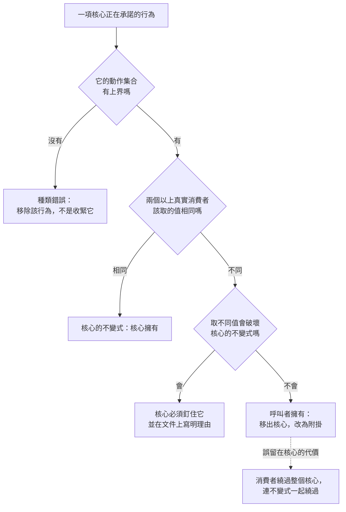

+++
title = "這項行為屬於誰：擁有權歸屬的變異測試"
date = "2026-09-09T01:29:08+08:00"
author = "梅乾"
draft = false
isCJKLanguage = true
description = "Log4j 的最終修法不是把行為做得更安全，而是判定那個行為本來就不該由日誌核心擁有。本文把兩個常見直覺合成一個可執行的變異測試，並辨出動作集合無上界的第三類——那類行為沒有正確的預設值，修法是移除而非移出。"
tags = [
    "分析論述", # term:AnalyticalEssay
    "軟體工程與規格", # term:SoftwareEngineeringSpecifications
    "擁有權", # term:Ownership
    "不變式", # term:Invariant
    "變異測試", # term:VariationTest
    "動作集合", # term:ActionSet
    "終局結果", # term:TerminalResult
    "冪等", # term:Idempotent
  ]
series = ["封裝邊界的劃界權：當補全端會替你把界劃肥"]
[ai_info]
    [ai_info.generation]
        model = "Claude Opus 5"
        agent = "Claude Code VSCode Extension 2.1.261"
    [ai_info.refinement]
        model = "Kimi K3"
        agent = "GitHub Copilot Chat v0.66.0"
+++

<!--more-->

## 導言

2021 年 12 月，一個記錄日誌的函式庫被發現可以讓攻擊者遠端執行程式碼。攻擊方式是把一個字串寫進任何會被記錄的欄位——使用者代理、表單輸入、主機名稱都可以。該函式庫會解讀訊息內容裡的查找語法，透過名稱服務向外連線並載入類別。CVSS 評為 10.0，是最高分。[CVE-2021-44228](https://nvd.nist.gov/vuln/detail/CVE-2021-44228)

值得注意的是修補的形狀。2.15 版限制了查找的目標，2.16 版**移除了訊息查找替換這個功能本身**，並把名稱服務查找預設關閉。[Apache Log4j 安全公告](https://logging.apache.org/log4j/2.x/security.html)

也就是說，最終的修法不是把那個行為做得更安全，而是判定**那個行為本來就不該由一個日誌核心擁有**。

沒有任何呼叫者委託過「請解讀我寫進日誌的內容並據以向外取物」。那項**擁有權**（Ownership） <!-- term:Ownership -->是核心自己長出來的，而它長出來的理由與前一種漂移完全相同：對一個記錄訊息的元件來說，「讓訊息裡可以插值」是一個看起來合理的相鄰職責。

> [!IMPORTANT]
> **擁有權** <!-- term:Ownership --> (Ownership): 系統元件對資料、狀態或生命週期的絕對控制權。 <!-- anchor:Ownership -->


這指出一件在前面的討論裡被當成已知的事：**判定一項行為該由核心擁有還是由呼叫者擁有，需要一個判準，而那個判準通常沒有被寫下來。** 本文要處理的正是這個判準的形式、它的可執行版本、以及誤歸屬的代價。

## 分析

### 兩個常見的直覺，以及它們的共同核心

實務中有兩個直覺常被用來判斷歸屬。

第一個是：**答案因業務而異的東西屬於使用者。** 「失敗幾次算失敗」在對帳流程與轉檔流程有不同答案，所以它不該由核心決定。

第二個是：**輸出是對系統的裁決者屬核心，輸出是業務決策者屬呼叫者。** 「這次認領是否互斥」是對系統狀態的裁決；「失敗後要不要通知客戶」是業務決策。

這兩個直覺其實是同一件事的兩種說法，而它們共同的核心可以寫成一句可檢查的判準：

> 一項行為屬於核心，若且唯若它的正確值由核心自己的**不變式**（Invariant） <!-- term:Invariant -->決定。它屬於呼叫者，若它的正確值在不同呼叫者間不同，且各個不同值都不破壞核心的任何不變式 <!-- term:Invariant -->。

> [!IMPORTANT]
> **不變式** <!-- term:Invariant --> (Invariant): 系統在任何合法狀態下都必須成立的斷言，是把評估規則寫成可執行檢查的基本單位。 <!-- anchor:Invariant -->


把它變成一個操作程序：列出兩個以上的真實消費者，逐項問每個消費者該取什麼值，再問取不同值會不會破壞核心的不變式 <!-- term:Invariant -->。這裡稱它為**變異測試**（Variation Test） <!-- term:VariationTest -->。

> [!IMPORTANT]
> **變異測試** <!-- term:VariationTest --> (Variation Test): 判定行為擁有權歸屬的操作程序：列出兩個以上真實消費者，逐項詢問各消費者對該行為的取值，再檢查不同取值是否破壞核心的不變式。 <!-- anchor:VariationTest -->


### 變異測試

下面的程式把一個持久生命週期核心的六項行為過一遍變異測試 <!-- term:VariationTest -->。

```python
# 變異測試：同一項行為，問三個真實消費者各自該取什麼值。
# 值因消費者而異、且各值都不違反核心不變式 -> 屬呼叫者。
CONSUMERS = ("結帳對帳", "影片轉檔", "寄送通知")
BEHAVIOURS = {
    # 行為: (各消費者該取的值, 取不同值是否違反核心不變式)
    "認領的互斥性":   (("必須互斥", "必須互斥", "必須互斥"), True),
    "終局結果的唯一性": (("唯一", "唯一", "唯一"), True),
    "租約長度":       (("30 秒", "20 分鐘", "5 秒"), False),
    "重試次數":       (("0 次，人工介入", "3 次", "10 次"), False),
    "退避策略":       (("不重試", "指數", "固定 1 秒"), False),
    "失敗後去向":     (("轉人工佇列", "丟棄", "死信保留 7 天"), False),
}
print(f"{'行為':<18}{'各消費者取值是否相同':>12}{'違反不變式':>12}{'歸屬':>8}")
for name, (vals, breaks) in BEHAVIOURS.items():
    same = len(set(vals)) == 1
    owner = "核心" if (same or breaks) else "呼叫者"
    print(f"{name:<18}{'相同' if same else '不同':>16}{'是' if breaks else '否':>13}{owner:>9}")
print()
core = [n for n, (v, b) in BEHAVIOURS.items() if len(set(v)) == 1 or b]
caller = [n for n in BEHAVIOURS if n not in core]
print(f"核心應擁有 {len(core)} 項：{core}")
print(f"呼叫者應擁有 {len(caller)} 項：{caller}")
```

實際執行的輸出：

```text
行為                  各消費者取值是否相同       違反不變式      歸屬
認領的互斥性                          相同            是       核心
終局結果的唯一性                        相同            是       核心
租約長度                            不同            否      呼叫者
重試次數                            不同            否      呼叫者
退避策略                            不同            否      呼叫者
失敗後去向                           不同            否      呼叫者

核心應擁有 2 項：['認領的互斥性', '終局結果的唯一性']
呼叫者應擁有 4 項：['租約長度', '重試次數', '退避策略', '失敗後去向']
```

六項裡只有兩項屬核心。這個比例本身就是一個結果：**一個持久生命週期核心真正必須裁決的，是認領互斥與終局唯一，其餘四項都是別人的決定。**

而那四項恰好是背景執行器最常烤進核心的東西。一個真實的重寫可以說明差別。改寫前，核心擁有重試次數、退避、死信政策與排程；改寫後，核心只掌管認領、租約、失效與**終局結果**（Terminal Result） <!-- term:TerminalResult -->，重試與退避的編排完全不做，交給呼叫者以**附掛**（Attachment） <!-- term:Attachment -->的方式自行決定；持久後端則移到核心之外，各自對同一份一致性測試自證行為。

> [!IMPORTANT]
> **終局結果** <!-- term:TerminalResult --> (Terminal Result): 系統執行完一系列狀態變更後的最終穩定一致狀態。 <!-- anchor:TerminalResult -->
> **附掛** <!-- term:Attachment --> (Attachment): 受治理的附掛：差集能力不由核心供應，而由呼叫者以受治理的形式自行決定並掛在核心之外的機制；核心不供應，也不阻擋。 <!-- anchor:Attachment -->


那次重寫做對的事，正是變異測試 <!-- term:VariationTest -->的第一欄：它認出「失敗幾次算失敗」在不同業務有不同答案，所以那個值不能由核心挑。

### 誤歸屬的代價：核心的權威失效

誤歸屬看起來像一個口味問題——核心挑了一個預設值，不同意的人自己覆寫就好。下面的程式說明為什麼不是。

```python
# 核心擁有了「值因消費者而異」的行為時，每個消費者只能接受錯值或繞過核心。
def bypass_rate(n_consumers, k_caller_owned, agree_prob=0.35):
    """核心為每項挑一個預設值；某消費者在某項上剛好同意的機率為 agree_prob。
    只要有一項不同意，該消費者就得繞過或對抗核心。"""
    return 1 - agree_prob ** k_caller_owned

print(f"{'核心誤擁有的項數':>16}{'單一消費者需繞過的機率':>24}")
for k in (0, 1, 2, 3, 4):
    print(f"{k:>16}{bypass_rate(0, k):>24.1%}")
print()
N = 40
print(f"在 {N} 個消費者下，預期需繞過核心的消費者數：")
for k in (1, 2, 3, 4):
    r = bypass_rate(0, k)
    print(f"  誤擁有 {k} 項 -> {N * r:>5.1f} 個消費者繞過（{r:.1%}）")
print()
print("繞過的後果不是各自客製，而是核心的權威失效：")
for k in (1, 3):
    r = bypass_rate(0, k)
    print(f"  誤擁有 {k} 項 -> 核心仍能裁決的消費者只剩 {N * (1-r):.1f} 個")
```

實際執行的輸出：

```text
        核心誤擁有的項數             單一消費者需繞過的機率
               0                    0.0%
               1                   65.0%
               2                   87.8%
               3                   95.7%
               4                   98.5%

在 40 個消費者下，預期需繞過核心的消費者數：
  誤擁有 1 項 ->  26.0 個消費者繞過（65.0%）
  誤擁有 2 項 ->  35.1 個消費者繞過（87.8%）
  誤擁有 3 項 ->  38.3 個消費者繞過（95.7%）
  誤擁有 4 項 ->  39.4 個消費者繞過（98.5%）

繞過的後果不是各自客製，而是核心的權威失效：
  誤擁有 1 項 -> 核心仍能裁決的消費者只剩 14.0 個
  誤擁有 3 項 -> 核心仍能裁決的消費者只剩 1.7 個
```

只誤擁有一項，40 個消費者裡就有 26 個需要繞過核心。誤擁有三項時只剩 1.7 個消費者還在核心的裁決之下。

這個結果把代價的性質改變了。繞過核心的消費者不只是「用了自己的重試邏輯」——它們同時也離開了核心對認領互斥與終局唯一的裁決，因為繞過的路徑通常繞過整個核心而不是繞過其中一項。**所以誤歸屬的代價不是不便，是核心失去它唯一真正該有的權威。** 一個把應用語義收進來的核心，最後連自己的不變式 <!-- term:Invariant -->都保不住。

### 第三類：動作集合無上界

上面兩類都是「值選錯了」。日誌函式庫的案例屬於第三類，而它的性質不同。

```python
# 第三類：核心擁有的行為，其動作集合的大小。
# 大小為 1 -> 不變式；大小等於消費者數 -> 誤歸屬；無上界 -> 種類錯誤。
import math
CASES = {
    "認領互斥（核心裁決）":        1,
    "租約長度（呼叫者決定）":      40,       # 每個消費者一個值
    "重試次數（呼叫者決定）":      40,
    "解釋日誌訊息內容並據以取物":  None,     # 值域是任意字串 -> 動作集合無上界
}
print(f"{'核心所承諾的行為':<28}{'動作集合大小':>14}{'性質':>12}")
for name, n in CASES.items():
    if n is None:
        size, kind = "無上界", "種類錯誤"
    elif n == 1:
        size, kind = "1", "不變式"
    else:
        size, kind = str(n), "誤歸屬"
    print(f"{name:<28}{size:>16}{kind:>13}")
print()
# 無上界的具體意義：一次呼叫能觸發的外部動作數隨輸入長度成長
print("『解釋內容並據以取物』時，單次呼叫可觸發的外部端點數：")
for chars in (8, 16, 32, 64):
    print(f"  訊息可容納 {chars:>3} 個字元的位址 -> 可指向的端點數量級 >= 2^{chars} ")
print()
print("前兩類的修法是把值移出核心；第三類的修法是把該行為整個移除。")
```

實際執行的輸出：

```text
核心所承諾的行為                            動作集合大小          性質
認領互斥（核心裁決）                                 1          不變式
租約長度（呼叫者決定）                               40          誤歸屬
重試次數（呼叫者決定）                               40          誤歸屬
解釋日誌訊息內容並據以取物                            無上界         種類錯誤

『解釋內容並據以取物』時，單次呼叫可觸發的外部端點數：
  訊息可容納   8 個字元的位址 -> 可指向的端點數量級 >= 2^8 
  訊息可容納  16 個字元的位址 -> 可指向的端點數量級 >= 2^16 
  訊息可容納  32 個字元的位址 -> 可指向的端點數量級 >= 2^32 
  訊息可容納  64 個字元的位址 -> 可指向的端點數量級 >= 2^64 

前兩類的修法是把值移出核心；第三類的修法是把該行為整個移除。
```

前兩類的**動作集合**（Action Set） <!-- term:ActionSet -->是有限的：一個值，或每個消費者一個值。第三類沒有上界——訊息內容是任意字串，而任意字串可以指向任意端點。

> [!IMPORTANT]
> **動作集合** <!-- term:ActionSet --> (Action Set): 一項行為可能採取之動作的集合。動作集合無上界的行為沒有正確的預設值，修法是從核心移除該行為本身，而非把它移給別人。 <!-- anchor:ActionSet -->


這解釋了修補為何是移除而不是收緊：**一個動作集合 <!-- term:ActionSet -->無上界的行為，沒有任何「正確的預設值」可以挑。** 變異測試 <!-- term:VariationTest -->在這一類上不會給出「屬呼叫者」的答案，它會給出「這一項不該存在」。

### 三類的判定順序

下圖把判定排成一條可執行的程序。它要回答的閱讀問題是：拿到一項行為時，該先問什麼。



第一個菱形必須先問，因為第二、三個菱形都預設值域是有限的。實務中順序常被顛倒——先討論預設值該設多少，而沒有先問這個行為到底有沒有正確值。

### 為什麼這個判準需要兩個消費者

變異測試 <!-- term:VariationTest -->的操作前提是「兩個以上真實消費者」。這個前提不是形式要求，它是判準能不能執行的條件。

只有一個消費者時，每一項行為的值都「相同」——因為只有一個答案。此時變異測試 <!-- term:VariationTest -->會把所有行為都判給核心，而那正是把核心焊死在單一消費者形狀上的做法。判準本身沒有錯，是它的輸入不足。

這使歸屬判定依賴於一個更前置的問題：那些真實消費者從哪裡來。那個問題有它自己的困難，本文不處理，但必須指出判準懸在它上面。

## 反思

判準的第一個邊界是「不變式 <!-- term:Invariant -->」這個詞本身。核心的不變式 <!-- term:Invariant -->不是自然事實，它是被宣告的。宣告得越寬，越多行為會落進「核心擁有」；宣告得越窄，核心越薄。所以變異測試 <!-- term:VariationTest -->不能決定核心該有多薄——它只能在不變式 <!-- term:Invariant -->已經宣告之後，檢查哪些行為與那份宣告一致。**把不變式 <!-- term:Invariant -->寫下來是判準的前置工作，而不是判準的產出。**

一個反例可以標出另一側邊界。假設某項行為的值在各消費者間不同，各值也都不破壞不變式 <!-- term:Invariant -->，而把它移出核心之後系統反而更糟——因為每個消費者都實作了一份有 bug 的版本，而核心那一份是對的。這種情形真實存在：正確實作困難、但需求確實因人而異的行為，例如**冪等**（Idempotent） <!-- term:Idempotent -->鍵的產生。此時較好的做法不是把它收回核心擁有，而是核心提供一個可替換的預設實作，並讓「可替換」在型別上成立。擁有權 <!-- term:Ownership -->與提供實作是兩件事，混為一談會讓這個反例看起來否證了判準。

> [!IMPORTANT]
> **冪等** <!-- term:Idempotent --> (Idempotent): 一個步驟可反覆執行而結果穩定的性質；對已是最新狀態的產物再跑一次，應為無變更。 <!-- anchor:Idempotent -->


第二個邊界關於「兩個以上真實消費者」的可得性。上一節指出判準懸在這個前提上，而這個前提在新元件的開發初期通常不成立。此時能做的不是假裝有消費者，而是明文記錄「本次歸屬判定的輸入只有一個消費者，因此所有歸屬結論的強度降級」。降級的具體意思是：這些歸屬要在第二個消費者出現時重跑一次。

第三個邊界關於第三類。動作集合 <!-- term:ActionSet -->是否有上界，判定起來不總是清楚。一個接受回呼函式的核心，其動作集合 <!-- term:ActionSet -->形式上也無上界——但那是呼叫者自己傳進來的函式，動作的授權來源是呼叫者。日誌案例的差別在於動作由**被記錄的資料**觸發，而資料不是授權來源。這個區分是關鍵，而它不在動作集合 <!-- term:ActionSet -->的大小裡，它在「誰決定了那個動作」。

最後是實驗的限制。第二個實驗把「消費者同意核心預設值」的機率設成 $0.35$ 且各項獨立，兩者都是簡化：真實的同意率隨行為而異，而各項也相關——同意排程預設的人多半也同意退避預設。相關性會使繞過率被高估。它證明「誤擁有少數幾項就足以讓多數消費者離開核心的裁決」這個結構，不估計任何真實元件的繞過率。第一個實驗的三個消費者取值是我指定的，它示範判準怎麼跑，不證明任何真實核心的歸屬結論。

## 實務對比

**決定一項行為該不該進核心。** 錯誤做法是問「核心提供這個方便嗎」。實測顯示六項行為裡只有兩項通過變異測試 <!-- term:VariationTest -->。正確做法是列出兩個以上真實消費者，逐項比對取值，再問取不同值會不會破壞不變式 <!-- term:Invariant -->。

**為一項因人而異的行為挑預設值。** 錯誤做法是挑一個「合理的」值並允許覆寫。實測顯示誤擁有一項時，40 個消費者裡有 26 個需要繞過核心，而繞過通常繞過整個核心。正確做法是把該項移出核心，以附掛 <!-- term:Attachment -->的方式讓呼叫者自行決定。

**處理一個被濫用的功能。** 錯誤做法是收緊它的允許範圍。日誌案例的最終修法是移除訊息查找替換本身，因為動作集合 <!-- term:ActionSet -->無上界的行為沒有正確的預設值。正確做法是先判定動作集合 <!-- term:ActionSet -->有沒有上界；沒有上界就移除，不要調參數。

**評估核心的權威。** 錯誤做法是看它提供多少能力。實測顯示誤擁有三項時，仍在核心裁決之下的消費者只剩 1.7 個。正確做法是量測有多少消費者實際走核心的路徑，而不是有多少消費者宣稱在用它。

**在只有一個消費者時做歸屬判定。** 錯誤做法是照常跑判準，因為所有值都「相同」而全部判給核心。正確做法是明文記錄輸入不足、把歸屬結論標為待重跑，並在第二個消費者出現時重做一次。

**區分擁有權 <!-- term:Ownership -->與提供實作。** 錯誤做法是因為「使用者自己寫會寫錯」而把行為收回核心擁有。正確做法是核心提供一個可替換的預設實作，並讓可替換性在型別上成立——擁有權 <!-- term:Ownership -->在呼叫者，實作可以來自核心。

## 結論

一項行為屬於核心還是屬於呼叫者，不是口味問題，它有一個可執行的判準：**正確值由核心的不變式 <!-- term:Invariant -->決定者屬核心；正確值因呼叫者而異、且各值都不破壞不變式 <!-- term:Invariant -->者屬呼叫者。**

本文的量測給出四個結果：

1. **一個持久生命週期核心真正必須裁決的項目很少。** 六項行為過變異測試 <!-- term:VariationTest -->，只有認領互斥與終局唯一屬核心，其餘四項都是呼叫者的決定。
2. **誤歸屬的代價不是不便，是權威失效。** 只誤擁有一項，40 個消費者裡就有 26 個需要繞過核心；誤擁有三項時只剩 1.7 個仍在核心裁決之下。
3. **存在第三類，它的修法不同。** 動作集合 <!-- term:ActionSet -->無上界的行為沒有正確的預設值，判準給出的答案是移除而非移出——這正是那次最高評分漏洞最終採取的修法。
4. **判準的輸入是兩個以上真實消費者。** 只有一個消費者時所有值都相同，判準會把一切判給核心，而那就是把核心焊死在單一形狀上。

所以在爭論一個預設值該設多少之前，有兩個問題必須先問：這個行為的動作集合 <!-- term:ActionSet -->有上界嗎，以及第二個消費者會不會給出不同的答案。

第一個問題答「沒有」時，該做的是移除。第二個問題答「會」時，該做的是移出。兩個問題都答完之後才輪到挑值——而到那時候，需要挑的項目通常比原本以為的少得多。