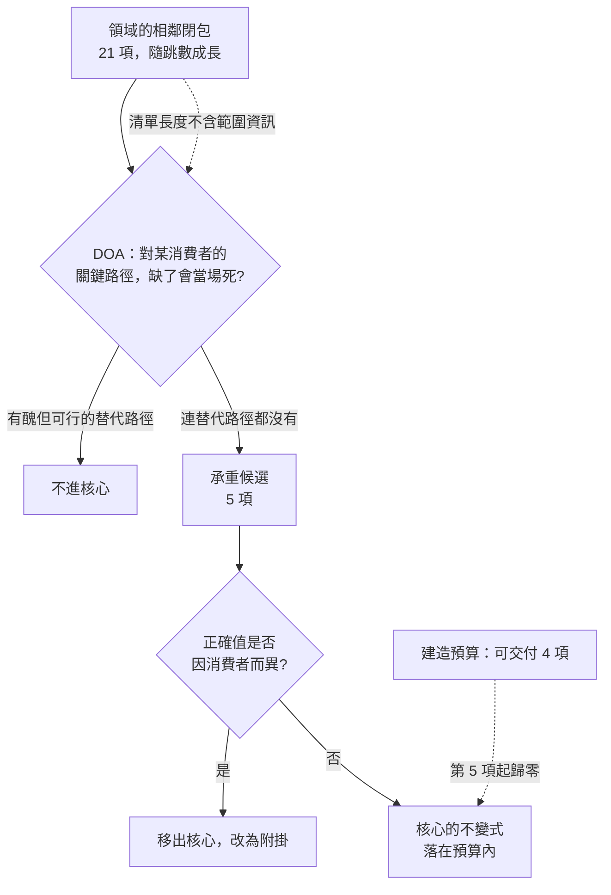

+++
title = "承重與碰得到：把膨脹的能力清單收斂成薄核"
date = "2026-09-09T01:47:05+08:00"
author = "梅乾"
draft = false
isCJKLanguage = true
description = "第一代 iPhone 沒有複製貼上卻沒有死，因為那項能力是碰得到的而非承重的。本文證明在固定預算下「全都做」不是保守而是斷崖式歸零，並給出把以相鄰性成長的候選清單收斂成承重集合的判定程序。"
tags = [
    "分析論述", # term:AnalyticalEssay
    "軟體工程與規格", # term:SoftwareEngineeringSpecifications
    "薄核", # term:ThinCore
    "承重", # term:LoadBearing
    "碰得到", # term:Reachable
    "不變式", # term:Invariant
    "篩選", # term:Screening
    "附掛", # term:Attachment
  ]
series = ["封裝邊界的劃界權：當補全端會替你把界劃肥"]
[ai_info]
    [ai_info.generation]
        model = "Claude Opus 5"
        agent = "Claude Code VSCode Extension 2.1.261"
    [ai_info.refinement]
        model = "Kimi K3"
        agent = "GitHub Copilot Chat v0.66.0"
+++

<!--more-->

## 導言

2007 年上市的第一代 iPhone 沒有複製貼上。它也沒有多媒體訊息、沒有第三方應用程式、沒有錄影、不支援 3G。複製貼上要等到兩年後的 iPhone OS 3.0 才出現，而且是當時發表的頭條功能之一。

當年最常見的批評正是這幾項缺席。一支手機不能複製一段文字，聽起來不像取捨，像沒做完。

而它沒有死。核心承諾——一個真正可用的行動瀏覽器、一支電話、一台隨身聽——在缺少複製貼上的情況下完整成立。**那項能力是碰得到（Reachable） <!-- term:Reachable -->的，不是承重（Load-Bearing） <!-- term:LoadBearing -->的。**

> [!IMPORTANT]
> **碰得到** <!-- term:Reachable --> (Reachable): 與核心相鄰、沿著相鄰性可以一路列舉出來的能力。碰得到的清單會自己成長且每一項都能講出理由，是薄核界定裡最難執行的一刀。 <!-- anchor:Reachable -->
> **承重** <!-- term:LoadBearing --> (Load-Bearing): 缺了它核心承諾就當場不成立的能力。與「碰得到」相對：後者與核心相鄰、可被想到且每項都有用，但缺席並不致命。 <!-- anchor:LoadBearing -->


這個區分聽起來簡單，實際上是**薄核**（Thin Core） <!-- term:ThinCore -->界定裡最難執行的一刀。難在於「碰得到 <!-- term:Reachable -->」的清單會自己長，而且每一項都真的有用。要一段生命週期的保證，就碰得到 <!-- term:Reachable -->排程；碰得到 <!-- term:Reachable -->排程，就碰得到 <!-- term:Reachable -->時區與行事曆；碰得到 <!-- term:Reachable -->重試，就碰得到 <!-- term:Reachable -->退避、死信與告警。列到第三層時清單已經有二十項，而每一項都能講出一個合理的理由。

> [!IMPORTANT]
> **薄核** <!-- term:ThinCore --> (Thin Core): 對單一職責握有最終發言權、且克制擁有權的核心元件。薄不是規模小，而是擁有權的克制：核心只承載承重且歸屬於它的少數幾項行為。 <!-- anchor:ThinCore -->


本文要處理的問題是：**當「碰得到 <!-- term:Reachable -->」的清單以相鄰性成長、而每一項都有用時，如何判定哪幾項承重 <!-- term:LoadBearing -->，以及為什麼「全都做」不是保守而是歸零。**

## 分析

### 全選等於沒選，而且是斷崖

先處理「先都列進來，以後再砍」這個直覺。它假設多選的代價是線性的——多做一項就多花一份力氣。

實際上不是。建造預算固定時，項數越多，每項能得到的越少，而每項有一個低於就不堪用的門檻。

```python
# 固定的建造預算切給 k 項能力，每項需達到可用門檻才算交付。
BUDGET, VIABLE_AT = 100.0, 22.0

print(f"總預算 {BUDGET:.0f}，單項可用門檻 {VIABLE_AT:.0f}")
print(f"{'選了幾項':>8}{'每項可得':>10}{'達門檻?':>9}{'實際交付項數':>13}")
for k in (1, 2, 4, 5, 8, 12):
    each = BUDGET / k
    ok = each >= VIABLE_AT
    print(f"{k:>8}{each:>10.1f}{'是' if ok else '否':>10}{k if ok else 0:>13}")
print()
kmax = int(BUDGET // VIABLE_AT)
print(f"能同時交付的最大項數是 {kmax}；選第 {kmax+1} 項起，實際交付項數歸零")
print("這就是「全選等於沒選」的精確意思：它不是比較差，是斷崖")
```

實際執行的輸出：

```text
總預算 100，單項可用門檻 22
    選了幾項      每項可得     達門檻?       實際交付項數
       1     100.0         是            1
       2      50.0         是            2
       4      25.0         是            4
       5      20.0         否            0
       8      12.5         否            0
      12       8.3         否            0

能同時交付的最大項數是 4；選第 5 項起，實際交付項數歸零
這就是「全選等於沒選」的精確意思：它不是比較差，是斷崖
```

選 4 項交付 4 項。選 5 項交付 0 項。

**這不是報酬遞減，是斷崖。** 差別很重要：報酬遞減的情況下，多選一項仍有正的邊際貢獻，所以「先都列進來」是可辯護的；斷崖的情況下，跨過門檻的那一項會讓前面全部歸零。

門檻的存在不是假設。一個只做了一半的重試機制比沒有重試更糟，因為呼叫者會誤以為有；一個不完整的持久化保證會讓資料在無人預期的地方遺失。這一類能力沒有「做了 60%」的狀態。

### 碰得到的清單以相鄰性成長，承重集合不成長

第二個問題是清單為什麼會膨脹。答案是它由相鄰性生成，而相鄰性是遞移的。

```python
# 「碰得到」是相鄰閉包：野心越大，跳數越多，清單超線性成長。
ADJ = {
    "生命週期":   ["排程", "重試", "持久化"],
    "排程":       ["時區", "行事曆", "優先權"],
    "重試":       ["退避", "死信", "告警"],
    "持久化":     ["schema", "遷移", "備份"],
    "死信":       ["人工介面", "重放"],
    "遷移":       ["版本相容", "回滾"],
    "告警":       ["通知路由", "值班表"],
    "備份":       ["異地", "保存期"],
}
def closure(seed, hops):
    seen, frontier = {seed}, [seed]
    for _ in range(hops):
        nxt = []
        for n in frontier:
            for m in ADJ.get(n, []):
                if m not in seen:
                    seen.add(m); nxt.append(m)
        frontier = nxt
    return seen

print("以「生命週期」為起點：")
print(f"{'跳數':>5}{'碰得到的能力數':>16}{'承重集合大小':>14}")
for h in (1, 2, 3):
    reach = closure("生命週期", h)
    print(f"{h:>5}{len(reach):>16}{2:>14}")
print()
print("承重集合不隨跳數成長，因為它由消費者的核心承諾決定，不由相鄰性決定")
print(f"跳數 3 時，碰得到 {len(closure('生命週期', 3))} 項，承重 2 項 -> "
      f"需被拒絕的比例 {1 - 2/len(closure('生命週期', 3)):.0%}")
```

實際執行的輸出：

```text
以「生命週期」為起點：
   跳數         碰得到的能力數        承重集合大小
    1               4             2
    2              13             2
    3              21             2

承重集合不隨跳數成長，因為它由消費者的核心承諾決定，不由相鄰性決定
跳數 3 時，碰得到 21 項，承重 2 項 -> 需被拒絕的比例 90%
```

三跳之內碰得到 <!-- term:Reachable --> 21 項，而承重 <!-- term:LoadBearing -->的只有 2 項。需要被拒絕的比例是 90%。

兩個量的成長方式不同是這個實驗的重點。**碰得到 <!-- term:Reachable -->的清單由圖的結構生成，承重 <!-- term:LoadBearing -->集合由消費者的核心承諾生成，兩者沒有共同的上界。** 因此清單長度不含任何關於範圍的資訊——它只反映這個領域有多密。

把這一段與上一段接起來：清單有 21 項，預算只能交付 4 項，斷崖在第 5 項。所以拒絕不是保守，是唯一能交付任何東西的路徑。

### 兩種問法的鑑別力差一個量級

第三個問題是怎麼拒絕。最自然的問法是「這個能力有用嗎」，而它的問題是幾乎不會有人答「沒用」。

DOA 測試換了問法：對一個真實消費者最關鍵的那條路徑，這個能力在第一版缺席、或用一個爛 hack 頂著，那個消費者的核心承諾會不會當場死掉。

```python
import random
# 21 項碰得到的能力，其中真正承重的只有少數。兩種問法的鑑別力。
N, TRUE_LOAD, SEED = 21, 3, 19

def run(question, seed=SEED):
    rng = random.Random(seed)
    sel = []
    for i in range(N):
        load = i < TRUE_LOAD
        if question == "有用嗎":
            keep = rng.random() < 0.92          # 抽象地問：幾乎全部通過
        else:
            keep = rng.random() < (0.90 if load else 0.12)   # DOA：對關鍵路徑問
        if keep:
            sel.append(i)
    tp = sum(1 for i in sel if i < TRUE_LOAD)
    return len(sel), tp, tp / max(len(sel), 1), tp / TRUE_LOAD

print(f"碰得到 {N} 項，真正承重 {TRUE_LOAD} 項\n")
for q in ("有用嗎", "DOA"):
    n, tp, prec, rec = run(q)
    print(f"問法「{q}」")
    print(f"  進核心 {n:>2} 項，其中承重 {tp} 項   精確率 {prec:>5.1%}   召回率 {rec:>5.1%}")
print()
print("兩種問法的召回率相近，精確率差一個量級——")
print("DOA 的價值不在多找到承重的，而在把碰得到但不承重的擋在外面")
```

實際執行的輸出：

```text
碰得到 21 項，真正承重 3 項

問法「有用嗎」
  進核心 20 項，其中承重 3 項   精確率 15.0%   召回率 100.0%
問法「DOA」
  進核心  5 項，其中承重 3 項   精確率 60.0%   召回率 100.0%

兩種問法的召回率相近，精確率差一個量級——
DOA 的價值不在多找到承重的，而在把碰得到但不承重的擋在外面
```

兩種問法的召回率都是 100%——承重 <!-- term:LoadBearing -->的三項都被找到了。精確率是 15.0% 對 60.0%。

這個結果指出 DOA 的作用不在哪裡。它不是一個「更會找到重要東西」的工具，重要的東西本來就找得到。它是一個**拒絕工具**：把碰得到 <!-- term:Reachable -->但不承重 <!-- term:LoadBearing -->的從 17 項擋成 2 項。

還要注意 DOA 選出的是 5 項，而上一節的斷崖在第 5 項。**單靠 DOA 還不夠**——它把清單從 21 收到 5，但 5 仍然踩在門檻上。收斂到可交付需要第二刀，而那一刀問的是不同的問題：這 5 項裡有幾項的正確值會因消費者而異，那些應該移出核心而不是刪掉。

### 「缺席」與「爛 hack 頂著」是同一個測試的兩種形式

DOA 的操作有一個細節值得展開：測試允許「用一個爛 hack 頂著」，不只是「完全缺席」。

這個放寬是必要的，因為完全缺席會讓太多東西看起來承重 <!-- term:LoadBearing -->。第一代 iPhone 沒有複製貼上，但使用者可以重新打字——那就是爛 hack。核心承諾沒有死，只是變醜。

反過來，若一項能力連爛 hack 都頂不住——沒有任何降級路徑，缺了它那條關鍵路徑就走不完——它才是承重 <!-- term:LoadBearing -->的。認領互斥屬於這一類：沒有互斥保證的話，任何降級方案都會讓同一件事被做兩次，而那正是核心承諾的內容。

所以 DOA 的判定要問兩層：缺席會死嗎，以及有沒有一條醜但可行的替代路徑。兩層都答「會死、沒有」的才進核心。

### 三個量的關係

下圖把三個量排在一起。它要回答的閱讀問題是：一張清單從 21 項走到可交付，中間經過哪幾道收斂。



圖上兩條虛線是這篇最容易被忽略的兩件事。上面那條說清單長度只反映領域密度，不反映該做多少。下面那條說預算是一道硬約束，而它與 DOA 是兩個獨立的收斂——DOA 判定該不該，預算判定做得完做不完。

### 把邊界寫下來，讓它可被引用

收斂的結果需要留在一個可被引用的地方，否則下一輪相鄰需求會重新把它打開。

一個成熟的做法是把「不做什麼」寫成產品文件的一部分，與「做什麼」同等顯眼。SQLite 的官方文件就有一頁專門說明它適合與不適合的場景，明確指出高併發寫入、需要細粒度存取控制、以及需要客戶端伺服器架構的情形應該用別的東西。[SQLite: 何時使用](https://www.sqlite.org/whentouse.html)

這一頁的功能不是行銷上的謙虛。它是把 DOA 的結論固定下來，讓後續每一次「能不能順便支援」的提議，都有一個可以被指出來的既有判定。

## 反思

DOA 測試的第一個邊界是它對消費者的依賴。整個測試問的是「這個消費者的核心承諾會不會死」，所以沒有消費者時它退化成想像，而想像永遠傾向全選。這個依賴不是本文能解決的，但必須指出測試懸在它上面。

第二個邊界是「核心承諾」本身也需要被界定。同一個消費者可以把承諾寫寬或寫窄，而寫寬會讓更多能力變成承重 <!-- term:LoadBearing -->。實務中這是 DOA 最容易被繞過的地方：把承諾從「保證這件事只被做一次」改寫成「提供一套可靠的背景處理」，21 項裡就有一半變成承重 <!-- term:LoadBearing -->。**所以 DOA 的可信度上限，等於核心承諾寫得有多具體。**

一個反例可以標出主張的另一側。有些東西本質上就是整合才有價值——某些一站式體驗，拆薄反而失去意義。此時整合本身就是核心承諾，而 DOA 會正確地把大量能力判為承重 <!-- term:LoadBearing -->。這說明薄不是教條：判準仍回到消費者的承諾，而承諾有時真的需要廣度。第一個實驗在這種情形下的意思會反過來——預算不足時該做的是縮小消費者範圍，不是縮小能力集合。

第三個邊界關於斷崖模型。第一個實驗假設每項能力有一個硬門檻，而有些能力確實可以「做一半」——一個只支援部分時區的行事曆仍然有用。對這一類能力，斷崖退化成報酬遞減，而「先都列進來」的代價確實變成線性的。判斷一項能力屬於哪一類，需要問它有沒有「做了 60%」的狀態；答案是有的那些，可以進第二批。

最後是實驗的限制。三個實驗的參數都是我指定的：預算 100、門檻 22、相鄰圖的形狀、兩種問法的通過機率。它們共同證明「清單長度不含範圍資訊」「全選是斷崖不是遞減」「DOA 的作用是拒絕而非發現」三個結構，不估計任何真實專案的項數或精確率。第三個實驗尤其粗——它把「問法」壓成一個通過機率，而真實的 DOA 判定會有爭議、會被業務壓力扭曲，那些都不在模型裡。

## 實務對比

**面對一張候選能力清單。** 錯誤做法是先全部列進第一版，之後再砍。實測顯示預算能交付 4 項時，選 5 項的實際交付是 0 項——這是斷崖不是遞減。正確做法是先用 DOA 收斂，再對照預算，超出預算的部分明文排入第二批。

**用清單長度判斷範圍。** 錯誤做法是把「碰得到 <!-- term:Reachable -->二十幾項」讀成「這個元件應該不小」。實測顯示三跳閉包 21 項而承重 <!-- term:LoadBearing --> 2 項，清單長度只反映領域密度。正確做法是拿承重 <!-- term:LoadBearing -->集合的大小當範圍指標，並記錄被拒絕的 90% 去了哪裡。

**篩選（Screening） <!-- term:Screening -->能力。** 錯誤做法是問「這個有用嗎」。實測顯示這個問法的精確率是 15.0%，20 項裡 17 項不承重 <!-- term:LoadBearing -->。正確做法是對一個真實消費者的關鍵路徑問 DOA，並允許「爛 hack 頂著」作為通過的替代路徑。

> [!IMPORTANT]
> **篩選** <!-- term:Screening --> (Screening): 在訊號機制失效時，由驗證方主動設計具分離特性的測試或契約以檢驗產物真實能力的機制。 <!-- anchor:Screening -->


**判定一項能力是否承重 <!-- term:LoadBearing -->。** 錯誤做法是只問缺席會不會死。第一代 iPhone 沒有複製貼上，使用者重新打字就好——那是醜但可行的替代路徑。正確做法是問兩層：缺席會死嗎，以及有沒有降級路徑；兩層都答「會死、沒有」才進核心。

**記錄收斂的結果。** 錯誤做法是把判定留在討論紀錄或某個人的記憶裡。正確做法是把「不做什麼」寫成產品文件與「做什麼」同等顯眼的一節，讓後續的提議有一個可以被指出來的既有判定。

**DOA 之後就開工。** 錯誤做法是把 DOA 選出的集合直接當成核心範圍。實測顯示 DOA 把 21 項收到 5 項，而斷崖在第 5 項。正確做法是接一道第二刀，問這 5 項裡有幾項的正確值因消費者而異——那些該移出核心，不是刪掉。

## 結論

「碰得到 <!-- term:Reachable -->」與「承重 <!-- term:LoadBearing -->」是兩個不同的量，而它們的成長方式不同：前者由領域的相鄰性生成，後者由消費者的核心承諾生成。

本文的量測給出四個結果：

1. **全選是斷崖，不是報酬遞減。** 預算能交付 4 項時，選 5 項的實際交付是 0 項。所以「先都列進來，以後再砍」的代價不是線性的。
2. **清單長度不含關於範圍的資訊。** 三跳閉包碰得到 <!-- term:Reachable --> 21 項而承重 <!-- term:LoadBearing --> 2 項，需被拒絕的比例是 90%。
3. **DOA 是拒絕工具，不是發現工具。** 兩種問法的召回率都是 100%，精確率是 15.0% 對 60.0%；差別全在擋掉不承重 <!-- term:LoadBearing -->的那 17 項。
4. **一刀不夠。** DOA 把 21 項收到 5 項，而斷崖在第 5 項；收斂到可交付需要第二刀，且那一刀問的是歸屬而非承重 <!-- term:LoadBearing -->。

所以在爭論一個元件該包含哪些能力之前，有兩個問題要先有答案：這個消費者的核心承諾具體是什麼，以及缺了這一項有沒有一條醜但可行的路。

第一個問題寫得越具體，第二個問題就越好答。而兩個問題都沒答就開始列清單時，清單會長到領域的邊界為止——那個長度與該做多少，沒有任何關係。