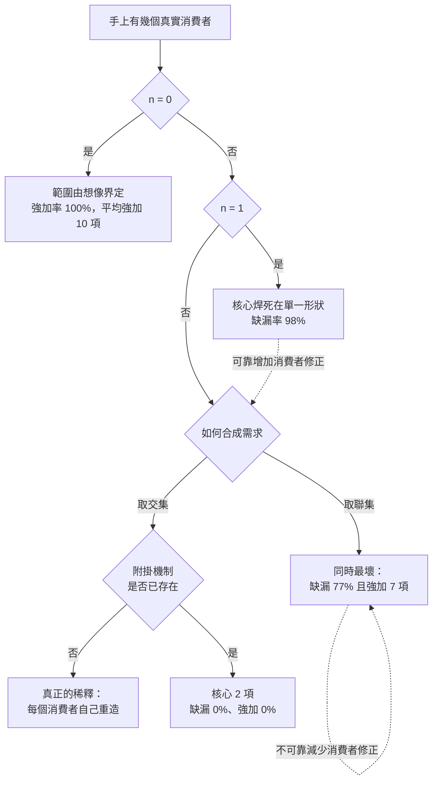

+++
title = "消費者三難：三條路的代價不對稱，而其中一條有出口"
date = "2026-09-09T02:04:02+08:00"
author = "梅乾"
draft = false
isCJKLanguage = true
description = "無消費者、單一消費者、多消費者三條路都通向失敗，但失敗的種類與代價並不對稱。本文打開消費者三難的黑箱，證明聯集同時吃下缺漏與強加兩種最壞情形，而交集加附掛是唯一有出口的路。"
tags = [
    "分析論述", # term:AnalyticalEssay
    "軟體工程與規格", # term:SoftwareEngineeringSpecifications
    "薄核", # term:ThinCore
    "消費者三難", # term:ConsumerTrilemma
    "不變式", # term:Invariant
    "附掛", # term:Attachment
    "承重", # term:LoadBearing
  ]
series = ["封裝邊界的劃界權：當補全端會替你把界劃肥"]
[ai_info]
    [ai_info.generation]
        model = "Claude Opus 5"
        agent = "Claude Code VSCode Extension 2.1.261"
    [ai_info.refinement]
        model = "Kimi K3"
        agent = "GitHub Copilot Chat v0.66.0"
+++

<!--more-->

## 導言

Google Wave 在 2009 年 5 月發表、9 月開放，2010 年 8 月 Google 宣布停止開發。它不缺工程能力，也不缺技術野心——它把電子郵件、即時通訊與協作文件併成一個新的溝通模型。

它缺的是一個具體的人，帶著一條具體的工作路徑，說「我現在做這件事很痛，你們的東西能不能讓它不痛」。當那個人不存在時，範圍只能由想像界定，而想像永遠傾向全選。

另一端也有失敗。OpenTelemetry 由 OpenTracing 與 OpenCensus 在 2019 年合併而來，參與者橫跨多家廠商與多種語言生態。[OpenTelemetry](https://opentelemetry.io/) 它不缺消費者——它的消費者太多，而每一個都帶著自己的需求進來。需求越多，介面越大；介面越大，「這個核心到底裁決什麼」就越難回答。

這兩個方向合起來，就是界定**薄核**（Thin Core） <!-- term:ThinCore -->時最難的一關。它常被寫成一個三難：

> [!IMPORTANT]
> **薄核** <!-- term:ThinCore --> (Thin Core): 對單一職責握有最終發言權、且克制擁有權的核心元件。薄不是規模小，而是擁有權的克制：核心只承載承重且歸屬於它的少數幾項行為。 <!-- anchor:ThinCore -->


```text
無消費者   → 訂不出契約 → 範圍由想像界定 → 全選
單一消費者 → 契約有了 → 但核心被焊死在那一個消費者的形狀上
多個消費者 → 需求被稀釋 → 核心肥成所有人的並集
```

三條路都通向失敗，而通常討論到這裡就停了——結論是「只有人的判斷能解」。這個結論是誠實的，但它讓三難成為一個未被打開的黑箱。

本文要處理的問題是：**三條路的失敗是同一種嗎，代價一樣大嗎，以及其中有沒有一條可以被改造成出口。**

## 分析

### 四種策略的產出並不對稱

先把三條路各自的產出算出來。加上第四個選項——取交集而非聯集——因為它是三難裡從未被單獨考慮的一格。

```python
# 三條路各自的產出：核心範圍與它對每個消費者的貼合度。
CONSUMERS = {           # 每個消費者需要的能力集合
    "A": {"認領", "終局", "租約", "優先權"},
    "B": {"認領", "終局", "重試", "退避"},
    "C": {"認領", "終局", "死信", "重放", "告警"},
}
ALL = set().union(*CONSUMERS.values())

def scope(strategy):
    if strategy == "無消費者":
        return set(ALL)                                    # 想像傾向全選
    if strategy == "單一消費者":
        return set(CONSUMERS["A"])                         # 焊死在 A 的形狀
    if strategy == "多消費者聯集":
        return set().union(*CONSUMERS.values())
    if strategy == "多消費者交集":
        s = set(ALL)
        for v in CONSUMERS.values():
            s &= v
        return s

print(f"三個消費者各自需要 {[len(v) for v in CONSUMERS.values()]} 項；全域共 {len(ALL)} 項\n")
print(f"{'策略':<14}{'核心項數':>9}{'含非承重':>10}{'缺漏總數':>10}")
for st in ("無消費者", "單一消費者", "多消費者聯集", "多消費者交集"):
    s = scope(st)
    # 非承重：對「所有」消費者都不是必需的項（此處以出現在<2個消費者為代理）
    rare = sum(1 for c in s if sum(c in v for v in CONSUMERS.values()) < 2)
    missing = sum(len(v - s) for v in CONSUMERS.values())
    print(f"{st:<14}{len(s):>9}{rare:>10}{missing:>10}")
```

實際執行的輸出：

```text
三個消費者各自需要 [4, 4, 5] 項；全域共 9 項

策略                 核心項數      含非承重      缺漏總數
無消費者                  9         7         0
單一消費者                 4         2         5
多消費者聯集                9         7         0
多消費者交集                2         0         7
```

第一個值得停下來的結果在第一列與第三列：**無消費者與多消費者聯集的產出完全相同。** 核心 9 項，含非**承重**（Load-Bearing） <!-- term:LoadBearing --> 7 項，缺漏 0。

> [!IMPORTANT]
> **承重** <!-- term:LoadBearing --> (Load-Bearing): 缺了它核心承諾就當場不成立的能力。與「碰得到」相對：後者與核心相鄰、可被想到且每項都有用，但缺席並不致命。 <!-- anchor:LoadBearing -->


也就是說，如果拿到很多消費者之後採取聯集，那些消費者提供的資訊在結果上等於零——範圍與完全沒有消費者時一樣。這解釋了為什麼「多找幾個消費者來問」不會自動改善範圍：改善來自於怎麼合成他們的需求，而不是來自於人數。

第二個結果是單一消費者那一列同時有兩個病：核心含 2 項非承重（A 的特殊需求被當成通用的） <!-- term:LoadBearing -->，且對其他消費者缺漏 5 項。它不是「比較貼合」，它是同時貼錯與蓋不到。

第三個結果是交集那一列：含非承重 <!-- term:LoadBearing --> 0 項，這是四個策略裡唯一的。代價是缺漏 7 項——但那 7 項的性質與單一消費者的缺漏不同，下一節處理。

### 兩種失敗要分開量

上一節把「缺漏」與「非承重 <!-- term:LoadBearing -->」放在同一張表，但它們對消費者造成的後果不同。缺漏是核心給不出你要的東西；強加是核心塞給你不要的東西。

```python
import random
# 新消費者陸續到達。四種策略下，兩種失敗各自發生多少。
POOL = ["認領", "終局", "租約", "優先權", "重試", "退避", "死信", "重放", "告警",
        "節流", "配額", "審計"]
UNIVERSAL = {"認領", "終局"}        # 每個消費者都需要
SEED = 23

def new_consumer(rng):
    extra = rng.sample([p for p in POOL if p not in UNIVERSAL], rng.randint(2, 4))
    return set(UNIVERSAL) | set(extra)

def evaluate(strategy, n=60, seed=SEED):
    rng = random.Random(seed)
    seen = [new_consumer(rng) for _ in range(3)]      # 設計時看得到的三個
    if strategy == "無消費者":      core, attach = set(POOL), False
    elif strategy == "單一消費者":  core, attach = set(seen[0]), False
    elif strategy == "聯集":        core, attach = set().union(*seen), False
    else:                           core, attach = set(UNIVERSAL), True
    short = forced = 0
    for _ in range(n):
        c = new_consumer(rng)
        if not attach and (c - core):   short += 1     # 核心給不出它要的
        if (core - c):                  forced += 1    # 核心強加它不要的
    return len(core), short / n, forced / n

print(f"{'策略':<14}{'核心項數':>9}{'缺漏率':>9}{'強加率':>9}{'平均強加項數':>14}")
for st in ("無消費者", "單一消費者", "聯集", "交集＋附掛"):
    k, sh, fo = evaluate(st)
    over = k - 2 if st != "交集＋附掛" else 0
    print(f"{st:<14}{k:>9}{sh:>9.0%}{fo:>9.0%}{over:>14}")
print()
print("三條路的失敗種類不同：單一消費者主要缺漏，無消費者與聯集主要強加。")
print("只有交集＋附掛同時避開兩者——代價是必須先有附掛機制存在。")
```

實際執行的輸出：

```text
策略                 核心項數      缺漏率      強加率        平均強加項數
無消費者                 12       0%     100%            10
單一消費者                 5      98%     100%             3
聯集                    9      77%     100%             7
交集＋附掛                 2       0%       0%             0

三條路的失敗種類不同：單一消費者主要缺漏，無消費者與聯集主要強加。
只有交集＋附掛同時避開兩者——代價是必須先有附掛機制存在。
```

聯集那一列最值得注意。它把三個看得到的消費者的需求全部收進來——核心 9 項——而後續消費者的缺漏率仍然是 77%，同時強加率 100%、平均強加 7 項。

**聯集策略同時吃下兩種失敗的最壞情形。** 它蓋不住未來的消費者，因為未來的需求不在那三個人的並集裡；它又強加最多的東西，因為那三個人的特殊需求全被當成通用的。這是三難裡代價最高的一格，而它恰好是最像盡責的那一格。

單一消費者的缺漏率 98%，但平均強加只有 3 項。它的病是狹窄，不是肥大。這個區分有實務意義：狹窄可以靠增加消費者修正，肥大不能靠減少消費者修正——因為已經進核心的東西會有人依賴。

### 出口在第三條路上，但需要一個前置機制

交集那一列的缺漏率是 0%，這個數字需要解釋，否則看起來像作弊。

它為 0 不是因為核心提供了所有東西，而是因為那一列假設了一個**附掛**（Attachment） <!-- term:Attachment -->機制的存在：核心只擁有交集（認領與終局），差集由呼叫者以受治理的附掛 <!-- term:Attachment -->形式自行補上。核心不供應，也不阻擋。

> [!IMPORTANT]
> **附掛** <!-- term:Attachment --> (Attachment): 受治理的附掛：差集能力不由核心供應，而由呼叫者以受治理的形式自行決定並掛在核心之外的機制；核心不供應，也不阻擋。 <!-- anchor:Attachment -->


所以三難的第三條路——多消費者導致稀釋——其實包含兩個不同的動作，而它們被混為一談：

- **取聯集**：把所有人的需求收進核心。這是稀釋，代價如上。
- **取交集＋附掛 <!-- term:Attachment -->**：把共同的部分收進核心，把差異推出核心。這不是稀釋。

第二個動作要成立，需要一件事先存在：一個讓差異可以被附掛 <!-- term:Attachment -->而不必進核心的機制。沒有那個機制時，取交集就只是核心太小、每個消費者都得自己重造一遍——那才是真正的稀釋。

**所以三難不是三個等價的壞選項，它是「兩個真的壞選項，加上一個取決於先決條件的選項」。** 而那個先決條件是可以工程化的：它是一套附掛 <!-- term:Attachment -->的契約形狀，不是一種判斷力。

### 三條路的判定

下圖把四種策略與它們的失敗種類排在一起。它要回答的閱讀問題是：拿到 n 個消費者時，該做什麼動作。



圖上兩條虛線是不對稱的具體形式。從單一消費者往下走是可修的——多找幾個消費者，再取交集。從聯集往回走是不可修的，因為已經進核心的能力會有人依賴，移除它是一次破壞性變更。

這給出一個操作上的排序：**寧可先狹窄再擴，不要先肥再減。** 兩者的錯誤方向相同，但可逆性差很多。

### 為什麼「只有人的判斷」這個結論下得太早

三難的常見收尾是：能從一堆嘗試裡抽出那個能把邊界拉對、又不稀釋成聯集的困難個案的，目前只有人的判斷。

上面的分析讓這句話可以講得更精確。需要人判斷的部分只有一件事：**哪些能力屬於交集。** 而三難的其他部分不需要判斷：

- n = 0 時該做的是先去找一個消費者，這不是判斷，是前置工作。
- n = 1 時該做的是明文記錄範圍結論待重跑，這是紀錄紀律。
- n ≥ 2 時該做的是取交集而非聯集，這是一個可以寫進流程的規則。
- 附掛 <!-- term:Attachment -->機制該不該存在，是一個架構決定，不是個案判斷。

剩下的那件事——判定交集——確實需要人，因為它要求理解「這兩個消費者說的是同一件事嗎」，而那是語義判斷。但它比原本的說法窄得多：不是整個劃界都靠人，是**交集的認定**靠人。

## 反思

第一個邊界是交集可能為空。三個消費者若沒有任何共同需求，交集策略給出一個空核心——這不是薄，是不存在。此時正確的結論是這三個消費者不屬於同一個元件的範圍，該做的是把他們拆成兩組再各自取交集。空交集是一個關於分組的訊號，不是關於核心的訊號。

第二個邊界是交集可能太小到不值得。交集只有一項時，把它做成一個元件的行政成本可能高於直接讓每個消費者自己寫。判準是那一項的正確實作有多難：認領互斥難寫且錯了很貴，所以值得；一個字串格式化不值得。**所以交集是必要條件，不是充分條件；充分條件還要加上「這一項自己寫容易寫錯」。**

一個反例可以標出主張的另一側。假設某元件採取聯集策略而它成功了——因為它的消費者確實同質，聯集與交集差別很小。這種情形真實存在，特別是在一個組織內部服務單一業務線的元件上。此時聯集的強加率雖然形式上是 100%，強加的項數卻很少，代價可以忽略。第二個實驗裡若把 `POOL` 縮小、把每個消費者的額外需求數降到 1，聯集與交集的差距就會收斂。

第三個邊界關於附掛 <!-- term:Attachment -->機制自身。上面把它當成一個可以工程化的先決條件，這是對的，但它不免費：一套附掛 <!-- term:Attachment -->契約要處理生命週期、錯誤傳遞、與核心**不變式**（Invariant） <!-- term:Invariant -->的互動，而它本身也會被慣例引力劃肥。把附掛 <!-- term:Attachment -->機制做成一個小型框架，就等於把剛推出核心的東西換個位置放回來。這個風險是真實的，本文不主張附掛 <!-- term:Attachment -->一定比核心擁有便宜——只主張它讓歸屬保持在呼叫者手上。

> [!IMPORTANT]
> **不變式** <!-- term:Invariant --> (Invariant): 系統在任何合法狀態下都必須成立的斷言，是把評估規則寫成可執行檢查的基本單位。 <!-- anchor:Invariant -->


最後是實驗的限制。兩個實驗都把「需求」抽象成集合成員，而真實需求有強度差異——同一項能力對 A 是承重 <!-- term:LoadBearing -->、對 B 只是方便，集合模型看不出來。這會使交集被低估：某些項對多數消費者承重 <!-- term:LoadBearing -->、對少數不承重 <!-- term:LoadBearing -->，形式上不在交集，實際上該進核心。第二個實驗的消費者生成是均勻隨機的，而真實消費者高度聚集，聚集會使聯集策略的缺漏率遠低於 77%。兩者共同證明「三條路的失敗種類不同、且聯集同時吃下兩種最壞」這個結構，不估計任何真實專案的比率。

## 實務對比

**手上沒有真實消費者。** 錯誤做法是先開始設計，邊做邊想像使用場景。實測顯示這條路的強加率 100%、平均強加 10 項，與拿到消費者後取聯集的結果相同。正確做法是把「找到一個帶著關鍵路徑的消費者」當成前置工作，在它完成前不進入範圍界定。

**手上有三個消費者。** 錯誤做法是把三個人的需求都收進核心，因為那看起來最盡責。實測顯示聯集策略的後續缺漏率仍是 77%，同時平均強加 7 項——它同時吃下兩種失敗的最壞情形。正確做法是取交集進核心，差集以附掛 <!-- term:Attachment -->形式留給呼叫者。

**手上只有一個消費者。** 錯誤做法是把它的形狀當成通用形狀。實測顯示這會讓核心含 2 項非承重 <!-- term:LoadBearing -->、對其他消費者缺漏 5 項。正確做法是照做，但明文記錄範圍結論待第二個消費者出現時重跑——狹窄是可修的錯誤方向。

**發現核心太肥想瘦身。** 錯誤做法是直接移除那些少數人才用的能力。已經進核心的能力會有人依賴，移除是破壞性變更。正確做法是承認方向不可逆，改為凍結核心、把新能力一律導向附掛 <!-- term:Attachment -->，讓核心的相對比重隨時間下降。

**交集算出來是空的。** 錯誤做法是硬找一個共同點來當核心。正確做法是把它讀成分組訊號：這幾個消費者不屬於同一個元件，先拆組再各自取交集。

**交集只有一項。** 錯誤做法是仍然把它做成一個獨立元件。正確做法是問那一項自己寫容不容易寫錯；容易寫錯且錯了很貴的才值得，否則讓每個消費者各自實作。

## 結論

**消費者三難**（Consumer Trilemma） <!-- term:ConsumerTrilemma -->的三條路不是三個等價的壞選項。它們的失敗種類不同，代價不同，可逆性也不同。

> [!IMPORTANT]
> **消費者三難** <!-- term:ConsumerTrilemma --> (Consumer Trilemma): 界定元件範圍時，無消費者則無契約、單一消費者則耦合、多消費者則稀釋成需求並集的三難困境。 <!-- anchor:ConsumerTrilemma -->


本文的量測給出四個結果：

1. **無消費者與多消費者取聯集的產出完全相同。** 核心 9 項、含非承重 <!-- term:LoadBearing --> 7 項、缺漏 0——消費者提供的資訊在聯集下等於零。
2. **聯集同時吃下兩種失敗的最壞情形。** 後續缺漏率 77%，強加率 100%，平均強加 7 項。而它恰好是最像盡責的那一格。
3. **狹窄可修，肥大不可修。** 單一消費者的缺漏率 98% 但平均強加只有 3 項；已進核心的能力會有人依賴，移除是破壞性變更。
4. **第三條路有出口，但它依賴一個前置機制。** 取交集加附掛 <!-- term:Attachment -->的缺漏率與強加率都是 0%，而這個 0% 來自附掛 <!-- term:Attachment -->機制的存在，不來自核心供應了一切。

所以三難不是「都無解，只能靠人」。需要人判斷的部分比原本的說法窄得多：**只有交集的認定需要語義判斷**，其餘四件事——先去找消費者、單一消費者時記錄待重跑、多消費者時取交集不取聯集、以及讓附掛 <!-- term:Attachment -->機制存在——都是可以寫進流程的規則。

而在那些規則之外，還有一條更便宜的原則：寧可先狹窄再擴，不要先肥再減。兩個方向都會錯，但只有一個方向錯了還救得回來。