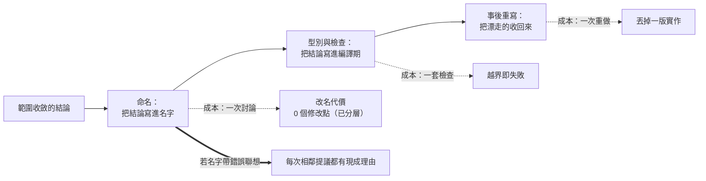

+++
title = "名字是最便宜的範圍防線：品牌與 API 為何必須分兩層"
date = "2026-09-09T02:21:06+08:00"
author = "梅乾"
draft = false
isCJKLanguage = true
description = "javax 到 jakarta 的遷移代價不來自商標爭議，而來自品牌名被放進了 API 識別字。本文量化品牌滲透深度如何決定改名成本，論證命名是三道範圍防線裡最便宜、且時機只有一次的一道。"
tags = [
    "分析論述", # term:AnalyticalEssay
    "軟體工程與規格", # term:SoftwareEngineeringSpecifications
    "薄核", # term:ThinCore
    "多語源", # term:PolyEtymology
    "封裝邊界", # term:EncapsulationBoundary
    "事後重寫", # term:PostHocRewrite
  ]
series = ["封裝邊界的劃界權：當補全端會替你把界劃肥"]
[ai_info]
    [ai_info.generation]
        model = "Claude Opus 5"
        agent = "Claude Code VSCode Extension 2.1.261"
    [ai_info.refinement]
        model = "Kimi K3"
        agent = "GitHub Copilot Chat v0.66.0"
+++

<!--more-->

## 導言

2017 年，Oracle 把 Java EE 捐給 Eclipse 基金會。技術上這是一次治理移交，程式碼沒有改。但商標沒有一起移交，於是新的專案不能繼續使用 `javax` 這個套件命名空間。

結果是整個生態系必須把每一行 `import javax.*` 改成 `import jakarta.*`。這不是一次語意變更，也不是 API 設計的改進——它是一次純粹的改名，而它的代價落在每一個引用點上。[Jakarta EE 套件命名空間變更](https://jakarta.ee/blogs/javax-jakartaee-namespace-ecosystem-progress/)

值得注意的是這個代價的來源。它不來自商標爭議本身，而來自一個更早的決定：**品牌名被放進了 API 的識別字裡。** 如果當初命名空間叫 `enterprise.persistence` 之類與品牌無關的東西，同一次治理移交只需要改文件與網站。

這件事與**封裝邊界**（Encapsulation Boundary） <!-- term:EncapsulationBoundary -->有關，因為名字對範圍有拉力。一個叫 `TaskQueue` 的元件，它的名字已經承諾了佇列——之後每一個「既然是佇列，那應該也要有優先權吧」的提議都有一個現成的理由。名字是規格的一部分，而它是規格裡最早被寫下、最少被審視的那一部分。

> [!IMPORTANT]
> **封裝邊界** <!-- term:EncapsulationBoundary --> (Encapsulation Boundary): 一個元件對某件事有最終發言權、又刻意不擁有周邊職責的那條劃分線。 <!-- anchor:EncapsulationBoundary -->


本文要處理的問題是：**名字如何影響範圍、改名的代價由什麼決定，以及為什麼命名是三道防線裡最便宜的一道。**

## 分析

### 改名的代價由品牌滲進 API 的深度決定

先把代價算出來。品牌名可以只出現在文件與網站，也可以一路滲到套件命名空間。

```python
# 品牌名滲進 API 的深度，決定一次改名要動多少呼叫點。
CALL_SITES = 42_000        # 生態系裡引用該元件的位置總數
CONFIG_KEYS = 1_800
FILE_NAMES  = 260

LEAK = {
    "只在文件與網站":       (0.00, 0.00, 0.00),
    "類別前綴":             (0.35, 0.00, 0.00),
    "類別前綴＋設定鍵":     (0.35, 1.00, 0.00),
    "套件命名空間":         (1.00, 1.00, 1.00),
}
print(f"呼叫點 {CALL_SITES:,}／設定鍵 {CONFIG_KEYS:,}／檔名 {FILE_NAMES:,}\n")
print(f"{'品牌滲進 API 的深度':<22}{'需改的呼叫點':>13}{'設定鍵':>9}{'檔名':>8}{'合計':>10}")
base = None
for name, (c, k, f) in LEAK.items():
    tot = CALL_SITES*c + CONFIG_KEYS*k + FILE_NAMES*f
    if base is None: base = max(tot, 1)
    print(f"{name:<22}{CALL_SITES*c:>13,.0f}{CONFIG_KEYS*k:>9,.0f}{FILE_NAMES*f:>8,.0f}{tot:>10,.0f}")
print()
deep = CALL_SITES + CONFIG_KEYS + FILE_NAMES
print(f"最深與最淺相差 {deep:,} 個修改點；而兩者的品牌價值完全相同")
print("所以「將就一個帶錯誤聯想的名字」買到的不是省事，是把改名權押掉")
```

實際執行的輸出：

```text
呼叫點 42,000／設定鍵 1,800／檔名 260

品牌滲進 API 的深度                 需改的呼叫點      設定鍵      檔名        合計
只在文件與網站                           0        0       0         0
類別前綴                         14,700        0       0    14,700
類別前綴＋設定鍵                     14,700    1,800       0    16,500
套件命名空間                       42,000    1,800     260    44,060

最深與最淺相差 44,060 個修改點；而兩者的品牌價值完全相同
所以「將就一個帶錯誤聯想的名字」買到的不是省事，是把改名權押掉
```

同一個品牌，同一次改名，代價從 0 個修改點到 44,060 個修改點。

這個範圍的重點不是數字大小，是**兩端的品牌價值完全相同**。品牌的作用是讓人記得、讓人找到、讓人分辨；這些作用不需要品牌出現在 `import` 語句裡。滲進 API 買不到任何額外的品牌價值，它只買到一個負債。

### 兩層的契約形狀

把分層寫成一個可執行的檢查，就能看出「改品牌不動一行 API」具體是什麼意思。

```python
# 品牌與 API 分兩層的契約形狀：改品牌不動任何呼叫點。
BRAND = {"display_name": "Kestrel", "site": "kestrel.example", "logo": "k.svg"}
API   = {"namespace": "durable.lifecycle", "entry": "claim", "config_prefix": "dl_"}

def rename_brand(brand, new_name):
    return {**brand, "display_name": new_name, "site": f"{new_name.lower()}.example"}

def call_sites_touched(old_api, new_api):
    return sum(1 for k in old_api if old_api[k] != new_api.get(k))

b2 = rename_brand(BRAND, "Vireo")
print("改品牌：")
print(f"  before {BRAND['display_name']} -> after {b2['display_name']}")
print(f"  API 需修改的欄位數：{call_sites_touched(API, API)}")
print()
# 反例：品牌滲進 namespace 時
BAD_API = {"namespace": "kestrel.lifecycle", "entry": "kestrel_claim",
           "config_prefix": "kestrel_"}
BAD_API2 = {k: v.replace("kestrel", "vireo") for k, v in BAD_API.items()}
print("品牌滲進 API 時，同一次改名：")
print(f"  API 需修改的欄位數：{call_sites_touched(BAD_API, BAD_API2)} / {len(BAD_API)}")
for k in BAD_API:
    print(f"    {k}: {BAD_API[k]} -> {BAD_API2[k]}")
```

實際執行的輸出：

```text
改品牌：
  before Kestrel -> after Vireo
  API 需修改的欄位數：0

品牌滲進 API 時，同一次改名：
  API 需修改的欄位數：3 / 3
    namespace: kestrel.lifecycle -> vireo.lifecycle
    entry: kestrel_claim -> vireo_claim
    config_prefix: kestrel_ -> vireo_
```

分層的那一組，改名後 API 需修改的欄位數是 0。未分層的那一組，三個欄位全部要動。

`durable.lifecycle` 這個命名空間值得注意：它用的是**工程語彙**，而品牌用的是領域外的詞。這個分工是刻意的——API 的識別字應該描述它做什麼，因為呼叫者需要從識別字判斷語義；品牌不該描述它做什麼，因為那會把範圍鎖進名字裡。

### 三條命名原則，以及它們各自防的東西

上面的分層解決了改名成本。名字對範圍的拉力是另一個問題，它由三條原則處理。

**第一條是領域繞過**：品牌名取自產品工程領域**以外**的域。理由與上面的分層是同一個的另一面——當品牌詞屬於工程領域時，它會被讀成語義承諾。`TaskQueue` 承諾了佇列，於是「佇列該有優先權」變成一個可以引用名字的論證。取自鳥類、地名或器物的名字沒有這個承諾，因為讀者不會從一隻鳥推論出優先權。

**第二條是生僻優先**：冷僻的詞沒有既定聯想，是乾淨的畫布。通用語的詞在讀者腦中已有含義，最容易撞義——而撞義的方向不受作者控制。

**第三條是多語源（Poly-Etymology） <!-- term:PolyEtymology -->**：一族元件若名字全來自同一語源，會讓它們看起來像同一個框架的子模組。下面的程式把這個效應算出來。

> [!IMPORTANT]
> **多語源** <!-- term:PolyEtymology --> (Poly-Etymology): 在產品家族命名中刻意使用不同的語源系統，以打破「同一世界觀」的錯覺，維持各產品的獨立辨識度。 <!-- anchor:PolyEtymology -->


```python
# 一族元件的名字要讀到第幾個字元才能彼此區分？
FAMILIES = {
    "同語源＋共同前綴": ["Corelib", "Corequeue", "Coreflow", "Corestore"],
    "同語源、無前綴":   ["Aegis", "Aether", "Aeon", "Aegle"],
    "多語源":           ["Kestrel", "Tanuki", "Zarafa", "Vireo"],
}
def distinguishing_len(names):
    """最短的 k，使所有名字的前 k 個字元互不相同"""
    for k in range(1, max(len(n) for n in names) + 1):
        if len({n[:k].lower() for n in names}) == len(names):
            return k
    return None

def common_prefix(names):
    lo = min(len(n) for n in names); p = 0
    for i in range(lo):
        if len({n[i].lower() for n in names}) == 1: p += 1
        else: break
    return p

print(f"{'命名策略':<18}{'共同前綴':>9}{'可辨識前綴':>11}{'需比對的字元':>13}")
for k, names in FAMILIES.items():
    cp, dl = common_prefix(names), distinguishing_len(names)
    print(f"{k:<18}{cp:>9}{dl:>11}{dl:>13}")
print()
print("共同前綴越長，讀者要讀越多字元才知道自己在看哪一個元件——")
print("而在讀到那個字元之前，他預設這幾個東西共用版本、生命週期與相依。")
```

實際執行的輸出：

```text
命名策略                   共同前綴      可辨識前綴       需比對的字元
同語源＋共同前綴                  4          5            5
同語源、無前綴                   2          4            4
多語源                       0          1            1

共同前綴越長，讀者要讀越多字元才知道自己在看哪一個元件——
而在讀到那個字元之前，他預設這幾個東西共用版本、生命週期與相依。
```

多語源 <!-- term:PolyEtymology -->的可辨識前綴是 1 個字元。共同前綴策略是 5 個。

這個差距的後果不在打字上。在讀到那第 5 個字元之前，讀者處在「這幾個是同一個東西的不同部分」這個預設裡，而那個預設會帶來三件錯誤的推論：它們共用版本、共用生命週期、共用相依。**一族刻意互不相依的**薄核**（Thin Core） <!-- term:ThinCore -->，最不需要的就是這個預設。**

> [!IMPORTANT]
> **薄核** <!-- term:ThinCore --> (Thin Core): 對單一職責握有最終發言權、且克制擁有權的核心元件。薄不是規模小，而是擁有權的克制：核心只承載承重且歸屬於它的少數幾項行為。 <!-- anchor:ThinCore -->


### 三道防線裡最便宜的一道

下圖把命名放進整組防線裡，說明它的位置。



三道防線的成本差距很大。命名的成本是一次討論；型別與檢查的成本是一套要維護的工具；重寫的成本是丟掉一版實作。

而命名的**時機**只有一次。名字一旦流出去，改名的代價就落在別人身上——即使品牌與 API 已分層，文件、教學、搜尋結果與人們的記憶仍然要遷移。所以命名是唯一一道「現在不做就沒有第二次機會、而現在做幾乎免費」的防線。

這也是為什麼「先取個暫用名，以後再說」是一個特別差的決定：它把一道免費的防線換成了一筆之後要付的遷移成本，而換來的只是省下今天的一次討論。

## 反思

第一個邊界是領域繞過的例外。當一個元件只服務單一工程領域的內部使用者、且永遠不會對外時，用領域詞命名可以降低學習成本——`RetryPolicy` 對只有這一種用途的內部模組是好名字。判準是它有沒有可能被第二個消費者使用；答案是沒有時，語義承諾不構成負債。

第二個邊界是生僻優先的代價。生僻詞難拼、難搜尋、難口耳相傳，這些成本是真實的。實務上的折衷是讓品牌生僻而 API 語彙工程化——第二個實驗的 `durable.lifecycle` 正是這個折衷：需要被搜尋與理解的是 API，需要被記住與分辨的是品牌，兩者的最佳形狀不同。

一個反例可以標出主張的另一側。假設一族元件確實應該被讀成同一個框架——它們共用版本、共同發布、彼此相依。此時同語源命名是誠實的，而多語源 <!-- term:PolyEtymology -->會讓讀者誤以為它們可以獨立採用。**所以多語源 <!-- term:PolyEtymology -->不是普遍的好，它是「這些元件確實互不相依」這個事實的表達。** 名字該反映結構，而不是反映對結構的期望；若結構是共用的，就該用共用的名字。

第三個邊界關於名字的拉力有多強。本文主張名字會為相鄰提議提供理由，但沒有量測那個理由有多重。實務中一個好的範圍文件可以壓過名字的暗示，而一個沒有範圍文件的元件則完全被名字定義。所以命名是防線之一，不是防線本身；把它當成唯一的範圍紀律，會在第一次認真的功能提議前失守。

最後是實驗的限制。第一個實驗的呼叫點與設定鍵數量是我指定的，各種滲透深度的比例也是；它證明「改名代價由滲透深度決定，而品牌價值不隨深度改變」這個結構，不估計任何真實生態系的遷移成本。第二個實驗量的是字串的可辨識前綴，這是一個真實可計算的量，但把它當成「子模組錯覺」的代理是一個推論——讀者的推論還受文件、發布形式與相依宣告影響，那些都不在字串裡。

## 實務對比

**決定套件命名空間。** 錯誤做法是用品牌名。實測顯示品牌滲到命名空間時，一次改名要動 44,060 個修改點，而只留在文件與網站時是 0。正確做法是命名空間用工程語彙描述它做什麼，品牌留在文件、網站與顯示名稱。

**為新元件取名。** 錯誤做法是取一個描述它做什麼的工程詞，因為那看起來最清楚。這會讓名字成為語義承諾，之後每個相鄰提議都能引用它。正確做法是品牌取自產品工程領域以外的域，讓「它做什麼」由 API 與範圍文件負責。

**為一族元件取名。** 錯誤做法是用共同前綴或同語源，因為那看起來有整體感。實測顯示共同前綴策略的可辨識前綴是 5 個字元，多語源 <!-- term:PolyEtymology -->是 1 個。正確做法是刻意讓名字來自不同語源——除非這些元件確實共用版本與相依，那時同語源才是誠實的。

**先用暫用名開工。** 錯誤做法是把命名推遲到「產品成形之後」。名字流出去之後，改名的代價落在文件、教學、搜尋結果與別人的記憶上。正確做法是在初期拍板，因為那時它幾乎免費；分層之後改品牌本來就不動 API，所以沒有藉口將就一個帶錯誤聯想的名字。

**處理一次被迫的改名。** 錯誤做法是把它當成商標或治理問題。Jakarta 的案例顯示代價的來源是更早的一個決定——品牌名被放進了 API 識別字。正確做法是趁這次改名把分層補上，讓下一次改名的代價回到 0。

**把命名當成範圍紀律。** 錯誤做法是取好名字就不寫範圍文件。正確做法是把名字當成三道防線裡最便宜的一道，而不是唯一一道；它降低提議的頻率，不阻止提議。

## 結論

名字是規格裡最早被寫下、最少被審視的那一部分，而它同時承擔兩個互相衝突的功能：讓人記住，以及暗示範圍。

本文的量測給出四個結果：

1. **改名的代價由品牌滲進 API 的深度決定，而品牌價值不隨深度改變。** 從 0 個修改點到 44,060 個修改點，兩端的品牌作用完全相同。
2. **分層之後改品牌不動一行 API。** 分層的那一組改名後需修改的 API 欄位是 0；未分層的三個欄位全動。
3. **同語源家族讓讀者要讀 5 個字元才分得出元件，多語源 <!-- term:PolyEtymology -->只要 1 個。** 在讀到那個字元之前，讀者預設它們共用版本、生命週期與相依。
4. **命名是三道防線裡唯一「現在幾乎免費、以後很貴」的一道。** 它的成本是一次討論，而時機只有一次。

所以在寫第一行程式之前，有兩件事值得花一次討論定下來：品牌名要離工程語彙多遠，以及命名空間要不要帶品牌。

第一個問題決定名字會不會替未來的每個相鄰提議提供理由。第二個問題決定日後那一次不得不改名時，帳單開給誰。