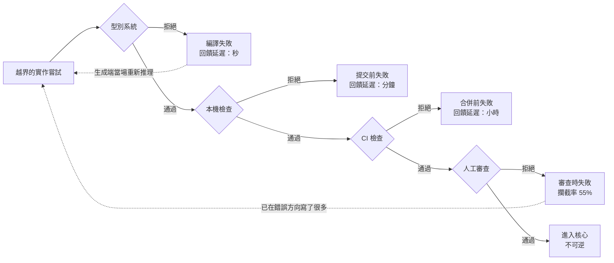

+++
title = "讓越界在編譯期失敗：把守界從記性換成機械"
date = "2026-09-09T02:39:03+08:00"
author = "梅乾"
draft = false
isCJKLanguage = true
description = "sun.* 的邊界在文件上寫了二十年，直到模組系統讓它第一次生效。本文量出人審與機械檢查的差距是複利級的，並用孤兒散文三分法給出「不長大」的可驗收目標：孤兒數為零，而非機械化率。"
tags = [
    "分析論述", # term:AnalyticalEssay
    "軟體工程與規格", # term:SoftwareEngineeringSpecifications
    "薄核", # term:ThinCore
    "孤兒散文", # term:OrphanProse
    "回饋延遲", # term:FeedbackDelay
    "負回饋", # term:NegativeFeedback
    "不變式", # term:Invariant
  ]
series = ["封裝邊界的劃界權：當補全端會替你把界劃肥"]
[ai_info]
    [ai_info.generation]
        model = "Claude Opus 5"
        agent = "Claude Code VSCode Extension 2.1.261"
    [ai_info.refinement]
        model = "Kimi K3"
        agent = "GitHub Copilot Chat v0.66.0"
+++

<!--more-->

## 導言

Java 平台有將近二十年在文件上寫著：`sun.*` 與其他內部套件是實作細節，不屬於公開 API，不要使用。這句話清楚、明確、寫在官方文件裡。

2017 年 Java 9 引進模組系統，把這條邊界從文件搬進執行環境——內部套件變成真正不可存取。結果是大量既有程式無法執行。後續版本繼續收緊：JDK 16 把非法的反射存取預設改為拒絕，JDK 17 強封裝了 JDK 內部。[JEP 396](https://openjdk.org/jeps/396)、[JEP 403](https://openjdk.org/jeps/403)

那次破壞不是模組系統造成的。它只是**讓一個從來沒有生效過的邊界第一次生效**，而生效的瞬間顯示出這條邊界二十年來被跨越了多少次。

這件事對**薄核**（Thin Core） <!-- term:ThinCore -->有直接的含義。一個薄核 <!-- term:ThinCore -->的邊界若只寫在文件上，它的實際狀態與 `sun.*` 相同：宣告了，沒有生效。而生成端每一次補全都是一次跨越嘗試，頻率比人類開發者高得多。

> [!IMPORTANT]
> **薄核** <!-- term:ThinCore --> (Thin Core): 對單一職責握有最終發言權、且克制擁有權的核心元件。薄不是規模小，而是擁有權的克制：核心只承載承重且歸屬於它的少數幾項行為。 <!-- anchor:ThinCore -->


本文要處理的問題是：**要讓「不長大」在有人試圖讓它長大時真的失敗，需要什麼；哪些規則做得到、哪些做不到；以及做不到的那些該怎麼處置。**

## 分析

### 三種守界方式的差距是複利的

先量三種守界方式的差距。它們的攔截率不同，而差距會累積。

```python
# 三種守界方式下，核心規模隨時間的走勢。
PER_YEAR, ACCEPT, START = 40, 0.30, 2      # 每年越界提議數、通過閘門後被接受的比例、核心起始項數
GATES = {"文件上寫著不要這樣做": 0.05,
         "code review 時有人記得": 0.55,
         "自動檢查，越界即失敗":  0.99}

print(f"每年越界提議 {PER_YEAR} 件，通過閘門者有 {ACCEPT:.0%} 最終被接受，核心起始 {START} 項\n")
print(f"{'守界方式':<24}{'攔截率':>7}{'每年新增':>9}{'第3年':>7}{'第5年':>7}")
for name, rate in GATES.items():
    per = PER_YEAR * (1 - rate) * ACCEPT
    print(f"{name:<24}{rate:>7.0%}{per:>9.1f}{START+per*3:>7.1f}{START+per*5:>7.1f}")
print()
# 多擁有的項數對應消費者繞過率（同一個歸屬判準）
print("第 5 年時，核心多擁有的項數與消費者繞過率：")
for name, rate in GATES.items():
    over = PER_YEAR * (1 - rate) * ACCEPT * 5
    bypass = 1 - 0.35 ** over
    print(f"  {name:<24}多擁有 {over:>5.1f} 項 -> 繞過率 {bypass:>6.2%}")
```

實際執行的輸出：

```text
每年越界提議 40 件，通過閘門者有 30% 最終被接受，核心起始 2 項

守界方式                        攔截率     每年新增    第3年    第5年
文件上寫著不要這樣做                   5%     11.4   36.2   59.0
code review 時有人記得           55%      5.4   18.2   29.0
自動檢查，越界即失敗                  99%      0.1    2.4    2.6

第 5 年時，核心多擁有的項數與消費者繞過率：
  文件上寫著不要這樣做              多擁有  57.0 項 -> 繞過率 100.00%
  code review 時有人記得       多擁有  27.0 項 -> 繞過率 100.00%
  自動檢查，越界即失敗              多擁有   0.6 項 -> 繞過率 46.74%
```

核心從 2 項起。第 5 年時，靠文件的那條路是 59.0 項，靠人審的是 29.0 項，靠自動檢查的是 2.6 項。

**靠人審不是「差一點」，是差一個量級。** 而 55% 這個攔截率並不苛刻——它假設有一半以上的越界提議會被當班的審查者認出來並擋下，這在實務上已經算勤勉。問題是剩下的 45% 每年都在累積，而累積是不可逆的：進了核心的能力會有人依賴。

最後一組數字接上另一件事。多擁有的項數會轉成消費者繞過核心的比率，而繞過的消費者同時離開核心對自己**不變式**（Invariant） <!-- term:Invariant -->的裁決。所以守界失效的終點不是核心變胖，是核心失去它唯一該有的權威。

> [!IMPORTANT]
> **不變式** <!-- term:Invariant --> (Invariant): 系統在任何合法狀態下都必須成立的斷言，是把評估規則寫成可執行檢查的基本單位。 <!-- anchor:Invariant -->


### 能咬的與不能咬的，界線在哪

「會咬」不等於「把所有文字都變成檢查」。治理陳述有兩種，它們的可機械化程度不同。

**結構型**的規則說的是可判定的性質：依賴邊界、命名圍籬、某種純度、公開型別的標註。這些可以寫成一個會失敗的檢查。

**判斷型**的規則說的是取捨：何時可以破例、風格偏好、什麼情況算例外。這些不能機械化，因為它們的正確答案依賴當時的脈絡。

關鍵不是少寫散文，而是**沒有孤兒散文（Orphan Prose） <!-- term:OrphanProse -->**——每一句治理陳述要嘛會咬，要嘛是焊在某個咬點旁的理由，要嘛明講「這條還不能執行」。三者之外的就是孤兒。

> [!IMPORTANT]
> **孤兒散文** <!-- term:OrphanProse --> (Orphan Prose): 寫在文件上卻沒有程式碼強制力對應的規範，極易隨時間腐敗而被忽視。 <!-- anchor:OrphanProse -->


```python
# 治理陳述的三分法：會咬 / 焊在咬點旁的理由 / 明講還不能執行。
# 三者之外的就是孤兒。
STATEMENTS = [
    ("核心不得依賴任何兄弟元件",       "structural", True),
    ("依賴邊界的理由：兄弟相依會使獨立演化失效", "rationale", True),
    ("命名空間不得含品牌名",           "structural", True),
    ("公開型別必須標註穩定性",         "structural", False),   # 該咬但還沒咬
    ("何時可以破例，由維護者判斷",     "judgment",   False),
    ("我們重視簡潔",                   "orphan",     False),
    ("風格上偏好明確而非精簡",         "judgment",   False),
    ("設定鍵應該一致",                 "orphan",     False),
]
kinds = {}
for text, kind, enforced in STATEMENTS:
    kinds.setdefault(kind, []).append((text, enforced))

print(f"{'類別':<12}{'條數':>5}{'已機械化':>9}{'處置':<28}")
RULE = {"structural": "應該會咬；未咬者為待補",
        "rationale":  "刻意保留，須與檢查焊在一起",
        "judgment":   "只能留散文或一道人審",
        "orphan":     "消滅"}
for kind in ("structural", "rationale", "judgment", "orphan"):
    items = kinds.get(kind, [])
    done = sum(1 for _, e in items if e)
    print(f"{kind:<12}{len(items):>5}{done:>9}   {RULE[kind]:<28}")
print()
struct = kinds.get("structural", [])
print(f"可機械化的上限是 structural 的 {len(struct)} 條，目前咬了 {sum(1 for _,e in struct if e)} 條")
print(f"孤兒 {len(kinds.get('orphan', []))} 條——它們既不咬，也不解釋任何咬點")
print("所以目標不是 100% 機械化，是 0 條孤兒")
```

實際執行的輸出：

```text
類別             條數     已機械化處置                          
structural      3        2   應該會咬；未咬者為待補                 
rationale       1        1   刻意保留，須與檢查焊在一起               
judgment        2        0   只能留散文或一道人審                  
orphan          2        0   消滅                          

可機械化的上限是 structural 的 3 條，目前咬了 2 條
孤兒 2 條——它們既不咬，也不解釋任何咬點
所以目標不是 100% 機械化，是 0 條孤兒
```

八條陳述裡，可機械化的上限是 3 條，目前咬了 2 條，孤兒 2 條。

這個分法的用處在於它給出一個**可以達成的目標**。「把治理全部自動化」是達不到的，因為判斷型規則存在；而「盡量自動化」不可驗收。「孤兒數為 0」可驗收，而且它同時保護了兩件事：不會有沒牙的規則，也不會為了有牙而刪掉必要的理由。

理由那一類特別值得強調：它是刻意保留、不可消滅的散文，並且要與檢查焊在一起——改檢查就改理由。這使治理既有牙齒又能演化；沒有理由的檢查在一年後會被當成無意義的阻礙而被刪掉。

### 為什麼型別是最好的咬點

同樣是自動檢查，觸發的時機差別很大。一條在 CI 才失敗的規則，與一條在編譯期就失敗的規則，攔截率相同而**回饋延遲**（Feedback Delay） <!-- term:FeedbackDelay -->不同。

> [!IMPORTANT]
> **回饋延遲** <!-- term:FeedbackDelay --> (Feedback Delay): 從某個動作或決策被執行，到系統產生可觀測結果並被決策者感知之間的時間差。 <!-- anchor:FeedbackDelay -->


延遲之所以重要，是因為生成端會對回饋反應。編譯錯誤是一個當場出現的觀察訊號：越界一次撞一次紅燈，被迫在範圍內重新推理。CI 失敗則發生在一批變更之後，此時生成端已經在錯誤的方向上寫了很多東西，退回的成本高得多。

一個更硬的手法是把藍圖鎖進型別本身——用可反映的方式宣告核心允許的形狀，讓任何越界的實作直接編譯報錯。這與 Rust 用一致性規則禁止「為外部型別實作外部特徵」是同一類做法：邊界不是文件上的約定，是型別系統拒絕接受的東西。

下圖把咬點按回饋延遲 <!-- term:FeedbackDelay -->排開。它要回答的閱讀問題是：同一條規則放在不同位置，代價差在哪。



圖上兩條虛線是同一個迴圈的兩種品質。最上面那條讓生成端在幾秒內知道自己越界，重新推理的成本是一次補全；最下面那條讓它在幾小時或幾天後才知道，而那時候要退回的是一整批變更。

### 未咬的結構型規則要留下記號

第二個實驗裡有一條 structural 規則還沒被機械化：公開型別必須標註穩定性。這一條的處置值得單獨說，因為它最容易變成孤兒。

它不能被當成判斷型——它是可判定的。它也不能被當成已生效——檢查還沒寫。所以正確的處置是第三類：明講「這條還不能執行」，並附上為什麼還不能，以及誰負責補。

這個記號有一個具體作用：它讓「治理覆蓋率」成為一個可讀的量。三分法之下，任何時候都能算出結構型規則裡有幾條已咬、幾條待補，而待補的那些有名字有理由。沒有這個記號時，未咬的結構型規則與判斷型規則混在一起，覆蓋率無法計算。

## 反思

第一個邊界是機械檢查自身的成本。一套會咬的治理是要維護的東西，而它也會被慣例引力劃肥——每一條「順便也檢查一下」的提議都有合理的理由。這使守界工具本身需要一個範圍紀律，而那個紀律的內容與它所保護的核心相同：只編碼此刻已經在主張的不變式 <!-- term:Invariant -->，其餘記錄延後。

一個反例可以標出主張的另一側。假設某專案的治理檢查覆蓋率極高、孤兒數為 0，而核心仍然長肥了——因為那些檢查檢的是舊的邊界。邊界移動時檢查沒有跟著移動，於是檢查變成了對過去某個狀態的守衛。這是「會咬」的失效模式：牙齒咬在錯的地方比沒有牙齒更難發現，因為儀表板上是綠的。所以檢查與邊界必須一起演化，而理由與檢查焊在一起的規定正是為了這個。

第二個邊界關於型別能表達什麼。把藍圖鎖進型別在表達力強的語言裡可行，在動態語言裡大部分做不到。此時能守住的是回饋延遲 <!-- term:FeedbackDelay -->較長的層——本機檢查與 CI——而攔截率不必然下降，下降的是生成端當場重新推理的能力。這是一個真實的差距，本文不主張它可以被完全補償。

第三個邊界關於 55% 這個假設。人工審查的攔截率隨團隊、變更大小與審查文化變化很大，而在一個特別注重邊界的小團隊裡它可以遠高於 55%。第一個實驗要說的不是「人審沒用」，而是「人審的攔截率是一個隨人變動的量，而機械檢查的不是」。前者需要持續投入才能維持，後者寫一次就固定。

最後是實驗的限制。第一個實驗把越界提議數、接受率與攔截率都設成常數且互相獨立，而真實情況下三者相關——越界提議變多時審查者會變嚴。這個**負回饋**（Negative Feedback） <!-- term:NegativeFeedback -->會使文件與人審那兩條路的成長被高估。第二個實驗的八條陳述與它們的分類是我指定的，它示範三分法怎麼算，不評估任何真實治理文件的孤兒率。

> [!IMPORTANT]
> **負回饋** <!-- term:NegativeFeedback --> (Negative Feedback): 系統偏離目標時產生反向修正壓力，使行為能夠收斂的回饋機制。 <!-- anchor:NegativeFeedback -->


## 實務對比

**宣告核心的邊界。** 錯誤做法是寫在文件上並相信它。Java 平台的內部套件在文件上被宣告為私有將近二十年，而模組系統生效的瞬間顯示這條邊界被跨越了多少次。正確做法是把結構型的邊界寫成會失敗的檢查，最好落在型別系統上。

**守住「不長大」。** 錯誤做法是靠 code review 時有人記得。實測顯示 55% 攔截率下核心第 5 年是 29.0 項，而自動檢查是 2.6 項。正確做法是把依賴邊界與命名圍籬機械化，把人審留給判斷型的例外。

**整理治理文件。** 錯誤做法是追求把所有規則自動化。實測顯示八條陳述裡可機械化的上限只有 3 條。正確做法是把目標定為孤兒數 0：每句話要嘛會咬、要嘛是焊在咬點旁的理由、要嘛明講還不能執行。

**處理一條該咬但還沒咬的規則。** 錯誤做法是先寫成散文，之後再說。它會與判斷型規則混在一起，使覆蓋率無法計算。正確做法是明確標為待補，附上為什麼還不能與誰負責。

**選擇檢查的位置。** 錯誤做法是統一放在 CI，因為那裡最好維護。正確做法是把攔截生成端的檢查往前放到編譯期——同樣的攔截率下，秒級回饋讓生成端當場重新推理，小時級回饋讓它先在錯誤方向上寫完一批。

**維護一套會咬的治理。** 錯誤做法是持續加檢查，因為每一條都合理。正確做法是對治理本身套用同一條範圍紀律：只編碼此刻已在主張的不變式 <!-- term:Invariant -->，並在邊界移動時同步移動檢查與理由。

## 結論

一個只寫在文件上的邊界，與一個沒有邊界，在觀察上不容易區分——直到有人讓它第一次生效。

本文的量測給出四個結果：

1. **三種守界方式的差距是複利的。** 核心從 2 項起，第 5 年時靠文件是 59.0 項、靠人審是 29.0 項、靠自動檢查是 2.6 項。
2. **靠人審不是差一點，是差一個量級。** 而 55% 的攔截率已經算勤勉；問題是漏過的部分每年累積，且不可逆。
3. **可機械化有上限，而目標不是機械化率。** 八條陳述裡結構型只有 3 條，判斷型不能咬；可驗收的目標是孤兒數為 0。
4. **同樣的攔截率下，回饋延遲 <!-- term:FeedbackDelay -->決定生成端能不能當場修正。** 編譯期失敗讓它重新推理一次補全，CI 失敗讓它先寫完一整批。

所以在寫下一條「核心不應該做這個」之前，先問三個問題：這條規則是可判定的嗎、它能不能落在型別上、以及它的理由寫在哪。

三個問題都有答案時，這條規則會在有人試圖越界時失敗。三個問題都沒答案時，它與 `sun.*` 那句話處在同一個狀態——宣告了，但從來沒有生效。