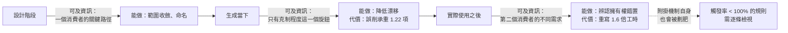

+++
title = "煞車踩在生成之後：事後重寫，以及治理自身的比例"
date = "2026-09-09T02:56:07+08:00"
author = "梅乾"
draft = false
isCJKLanguage = true
description = "一個自覺克制的設計仍把重試與退避烤進了核心，而修正發生在第二個消費者出現之後。本文證明當下克制與事後重寫付的是不同的東西，並處理治理的自我指涉：規則觸發率是治理失衡的可觀察訊號。"
tags = [
    "分析論述", # term:AnalyticalEssay
    "軟體工程與規格", # term:SoftwareEngineeringSpecifications
    "薄核", # term:ThinCore
    "事後重寫", # term:PostHocRewrite
    "擁有權", # term:Ownership
    "不變式", # term:Invariant
    "終局結果", # term:TerminalResult
    "附掛", # term:Attachment
  ]
series = ["封裝邊界的劃界權：當補全端會替你把界劃肥"]
[ai_info]
    [ai_info.generation]
        model = "Claude Opus 5"
        agent = "Claude Code VSCode Extension 2.1.261"
    [ai_info.refinement]
        model = "Kimi K3"
        agent = "GitHub Copilot Chat v0.66.0"
+++

<!--more-->

## 導言

有一個背景工作執行器，設計者很自覺。文件上寫著「我們刻意做得少」，也寫著「我們在比傳輸層高一層的地方抽象」。它確實比一般的訊息匯流排克制——不做交換機路由，不列龐大的傳輸清單。以任何標準看，它是一個有紀律的設計。

而它擁有了重試次數、退避、死信政策與排程。這些全烤進了核心。

重寫的產物是一個只掌管持久生命週期的東西：認領、租約、失效、**終局結果**（Terminal Result） <!-- term:TerminalResult -->，就這些。重試與退避的編排完全不做，那套語義被推出核心，交給呼叫者以受治理的**附掛**（Attachment） <!-- term:Attachment -->形式自行決定；持久後端則移到核心之外，各自對同一份一致性測試自證行為。

> [!IMPORTANT]
> **終局結果** <!-- term:TerminalResult --> (Terminal Result): 系統執行完一系列狀態變更後的最終穩定一致狀態。 <!-- anchor:TerminalResult -->
> **附掛** <!-- term:Attachment --> (Attachment): 受治理的附掛：差集能力不由核心供應，而由呼叫者以受治理的形式自行決定並掛在核心之外的機制；核心不供應，也不阻擋。 <!-- anchor:Attachment -->


值得注意的是這次修正發生的**時機**。它不在設計階段——設計階段的自覺程度已經很高，文件上就寫著要做得少。它也不在生成當下——當下沒有任何訊號顯示「重試次數是別人的決定」。它發生在核心跑起來、有人來接、並且第二個消費者提出不同的重試需求之後。

**煞車踩在生成之後，不在生成之中。** 本文要處理的問題是：為什麼是這個時機、**事後重寫**（Post-Hoc Rewrite） <!-- term:PostHocRewrite -->的成本與當下克制的成本如何比較，以及那套「受治理的附掛 <!-- term:Attachment -->」自身如何不變成下一個要維護的胖東西。

> [!IMPORTANT]
> **事後重寫** <!-- term:PostHocRewrite --> (Post-Hoc Rewrite): 因生成端無法即時煞車，改以事後重寫把已漂移長肥的核心收回薄形態的防線。 <!-- anchor:PostHocRewrite -->


## 分析

### 兩種煞車的成本形狀不同

當下克制與事後重寫 <!-- term:PostHocRewrite -->是兩個獨立的選項。它們的成本結構不同，而不同之處決定了該選哪一個。

當下克制的問題在前面已經出現過：可調的旋鈕是「克制程度」，而它不分辨**承重**（Load-Bearing） <!-- term:LoadBearing -->與否。下面的程式把兩種煞車放在同一個漂移率下比較。

> [!IMPORTANT]
> **承重** <!-- term:LoadBearing --> (Load-Bearing): 缺了它核心承諾就當場不成立的能力。與「碰得到」相對：後者與核心相鄰、可被想到且每項都有用，但缺席並不致命。 <!-- anchor:LoadBearing -->


```python
# 兩種煞車：生成當下攔截 vs 事後重寫。同一個漂移率下的成本。
DRIFT = 0.45          # 每次生成有 45% 機率把某項周邊吸進核心
ITEMS = 12            # 生成過程中經過的周邊項數
WRITE_COST = 1.0      # 寫一次的成本
REWRITE_COST = 1.6    # 看清之後重寫一次的成本（含丟掉的那一版）

def inline_brake(strength):
    """在生成當下要求克制：降低漂移率，但同時壓掉承重項"""
    drift = max(0.0, DRIFT - strength)
    load_lost = strength * 0.9          # 同一個旋鈕會削掉承重
    return ITEMS * drift, load_lost * ITEMS * 0.25

print("在生成當下踩煞車：")
print(f"{'克制強度':>8}{'漂入核心項數':>13}{'誤削承重項數':>13}")
for s in (0.0, 0.15, 0.30, 0.45):
    over, lost = inline_brake(s)
    print(f"{s:>8.2f}{over:>13.2f}{lost:>13.2f}")
print()
print("事後重寫：")
over0, _ = inline_brake(0.0)
print(f"  先讓它漂：漂入 {over0:.2f} 項，承重 0 項被誤削")
print(f"  總成本 = 寫一次 {WRITE_COST:.1f} + 重寫一次 {REWRITE_COST:.1f} = {WRITE_COST+REWRITE_COST:.1f}")
print(f"  克制強度 0.45 的成本 = 寫一次 {WRITE_COST:.1f}，但誤削承重 "
      f"{inline_brake(0.45)[1]:.2f} 項")
```

實際執行的輸出：

```text
在生成當下踩煞車：
    克制強度       漂入核心項數       誤削承重項數
    0.00         5.40         0.00
    0.15         3.60         0.41
    0.30         1.80         0.81
    0.45         0.00         1.22

事後重寫：
  先讓它漂：漂入 5.40 項，承重 0 項被誤削
  總成本 = 寫一次 1.0 + 重寫一次 1.6 = 2.6
  克制強度 0.45 的成本 = 寫一次 1.0，但誤削承重 1.22 項
```

克制強度調到 0.45 時漂入核心的項數是 0——看起來完美。代價是誤削 1.22 項承重 <!-- term:LoadBearing -->的能力。

兩種煞車的成本因此是兩種不同的東西。當下克制付的是**正確性**：削掉的承重 <!-- term:LoadBearing -->項會讓核心不堪用，而且不容易發現，因為缺席不會報錯。事後重寫 <!-- term:PostHocRewrite -->付的是**工時**：總成本 2.6 對 1.0，貴 1.6 倍，而承重 <!-- term:LoadBearing -->項一項都沒少。

這個比較解釋了時機的選擇。**在能分辨承重 <!-- term:LoadBearing -->與否之前，任何煞車都是盲的**；而分辨的資訊要等到核心被實際使用、第二個消費者提出不同需求之後才存在。所以重寫不是失敗的補救，它是資訊到齊的第一個時點。

### 重寫做對的那一刀

那次重寫的內容值得寫成對比，因為它顯示修正的動作不是「刪掉一些東西」。

```text
// 慣例驅動（改寫前）：核心擁有應用語義
core = durable-lifecycle
     + retry-policy + backoff + dead-letter + scheduling   // ← 呼叫者的業務決定，被核心吞掉

// 實踐驅動（改寫後）：核心只留權威，語義外推
core        = durable-lifecycle-only                       // ← 對「認領/失效/終局」有權威
obligations = user-attached governed patterns              // ← 重試/退避由呼叫者按自己的業務決定
backends    = independent, proven against one conformance  // ← 持久化在核外，不被核心擁有
```

三行對照裡有兩個不同的動作。第二行是**移出**：重試與退避仍然存在，只是**擁有權**（Ownership） <!-- term:Ownership -->換人。第三行也是移出，但方向不同——持久後端變成核心之外的多個實作，各自對同一份一致性測試自證。

> [!IMPORTANT]
> **擁有權** <!-- term:Ownership --> (Ownership): 系統元件對資料、狀態或生命週期的絕對控制權。 <!-- anchor:Ownership -->


沒有任何一行是**刪除**。這是重寫與「精簡」的差別：精簡減少功能總量，重寫只改變擁有權 <!-- term:Ownership -->的歸屬。改寫後的整體能力沒有變少，變的是誰在決定它們的值。

### 附掛機制不能變成下一個胖東西

上面第二行的「受治理的附掛 <!-- term:Attachment -->」是一個新機制，而新機制會被同一股引力劃肥。這是這篇最需要正視的自我指涉：**治理與附掛 <!-- term:Attachment -->自身也是產品，也會過度擁有。**

處理它的規則與處理核心的規則相同——只編碼此刻已經在主張的**不變式**（Invariant） <!-- term:Invariant -->，其餘記錄延後——但它有一個額外的、可量測的失效模式。

> [!IMPORTANT]
> **不變式** <!-- term:Invariant --> (Invariant): 系統在任何合法狀態下都必須成立的斷言，是把評估規則寫成可執行檢查的基本單位。 <!-- anchor:Invariant -->


```python
import random
# 治理自身的比例：規則越多，從未被觸發的比例越高，而那些規則無法被驗證。
CHANGES_PER_YEAR, SEED = 260, 29

def never_fired(n_rules, seed=SEED):
    rng = random.Random(seed)
    fired = set()
    for _ in range(CHANGES_PER_YEAR):
        # 一次變更平均觸及 2 條規則（與規則總數無關——變更的形狀是固定的）
        for _ in range(2):
            fired.add(rng.randrange(n_rules))
    return n_rules - len(fired)

print(f"每年 {CHANGES_PER_YEAR} 次核心變更，每次觸及約 2 條規則\n")
print(f"{'規則總數':>8}{'一年內觸發過':>13}{'從未觸發':>10}{'從未觸發比例':>14}")
for n in (8, 20, 60, 200, 500):
    nf = never_fired(n)
    print(f"{n:>8}{n-nf:>13}{nf:>10}{nf/n:>14.1%}")
print()
print("從未觸發的規則有兩種，而它們在觀察上無法區分：")
print("  (a) 保護一個真實但沒人嘗試越過的不變式")
print("  (b) 保護一個已經不存在的不變式")
print("規則數越多，處在這個不可區分狀態的比例越高——這就是比例失衡的代價")
```

實際執行的輸出：

```text
每年 260 次核心變更，每次觸及約 2 條規則

    規則總數       一年內觸發過      從未觸發        從未觸發比例
       8            8         0          0.0%
      20           20         0          0.0%
      60           60         0          0.0%
     200          184        16          8.0%
     500          320       180         36.0%

從未觸發的規則有兩種，而它們在觀察上無法區分：
  (a) 保護一個真實但沒人嘗試越過的不變式
  (b) 保護一個已經不存在的不變式
規則數越多，處在這個不可區分狀態的比例越高——這就是比例失衡的代價
```

規則 60 條以內時，一年內全部被觸發過。到 500 條時，36.0% 從未被觸發。

從未觸發的規則有一個特殊的問題：**它可能在保護一個已經不存在的不變式 <!-- term:Invariant -->，而這件事無法從它的狀態看出來。** 一條從未失敗的檢查與一條檢查對象已消失的檢查，在儀表板上都是綠色。

這給「治理必須比它治理的對象輕」一個可操作的形式。比例不是靠行數比來判斷，而是靠觸發率：**任何一年內從未觸發的規則，都要被逐條檢視它保護的不變式 <!-- term:Invariant -->還在不在。** 規則數少的時候這個檢視不需要做，因為觸發率是 100%；規則數大的時候它是必須的，而它的成本隨規則數成長。

### 三個時點，三種可及的資訊

下圖把三個煞車時點與各自能取得的資訊排在一起。它要回答的閱讀問題是：為什麼最有效的煞車在最晚的位置。



三個時點的可及資訊不同，所以能做的事不同。設計階段能做範圍收斂，因為那時有一個消費者的關鍵路徑；生成當下什麼都不能做，因為那時只有一個不分辨承重 <!-- term:LoadBearing -->的旋鈕；使用之後能做擁有權 <!-- term:Ownership -->修正，因為那時第二個消費者的需求才顯示出哪些值因人而異。

**這條時間軸解釋了為什麼「事前做得更好就不用重寫」是一個誤解。** 事前能做的事已經做了——那個執行器的文件上就寫著要做得少。缺的不是自覺，是資訊。

### 重寫的觸發條件

既然重寫依賴第二個消費者的出現，它就有一個可以事前寫下的觸發條件：**當第二個消費者對某一項提出不同的值時，重跑一次歸屬判定。**

這使重寫從「什麼時候覺得該重寫了」變成一個有訊號的動作。訊號是具體的：一個功能請求的形式是「能不能讓這一項可以設定」。那個請求的內容不重要，它的存在就是證據——有人需要一個與核心預設不同的值，所以那個值不屬於核心。

## 反思

第一個邊界是重寫的代價不總是 1.6 倍。核心已經有大量下游依賴時，重寫的代價包含遷移，而遷移的成本隨依賴數成長，可以遠超過重寫本身。此時能守的不是重寫，是凍結——停止在核心上新增，把新能力一律導向附掛 <!-- term:Attachment -->，讓核心的相對比重隨時間下降。第一個實驗的成本比只適用於依賴還少的階段。

一個反例可以標出主張的另一側。假設某核心一直只有一個消費者，第二個永遠不出現。此時重寫的觸發訊號永遠不會來，而核心的擁有權 <!-- term:Ownership -->錯置也永遠不會造成代價——因為沒有人被強加不想要的值。這說明擁有權 <!-- term:Ownership -->錯置的成本不是絕對的，它與消費者數量成長。單消費者的元件不需要這套紀律，而它也永遠無法驗證自己的邊界是對的。

第二個邊界關於「不刪除只移出」這條原則。移出需要一個接收方——附掛 <!-- term:Attachment -->機制、或呼叫者自己的程式碼。當接收方不存在時，移出實際上就是刪除，而使用者會失去一項本來可用的能力。所以那次重寫的可行性依賴附掛 <!-- term:Attachment -->機制先被建好；順序顛倒的重寫會被使用者正確地讀成功能退化。

第三個邊界關於觸發率這個判準。一條規則一年內沒觸發，可能是因為它保護的不變式 <!-- term:Invariant -->沒人挑戰——那是一條好規則。判準因此不是「刪掉未觸發的」，而是「檢視未觸發的」。這兩者的差別很大，而把前者當成後者會刪掉最重要的那幾條：真正的不變式 <!-- term:Invariant -->恰恰是沒人嘗試越過的。

最後是實驗的限制。第一個實驗的漂移率、克制強度與承重 <!-- term:LoadBearing -->誤削係數都是我指定的，而三者的關係尤其可疑——真實的「克制指示」不會線性地削掉承重 <!-- term:LoadBearing -->，它會以難以預測的方式改變輸出。實驗證明「當下克制付的是正確性、事後重寫 <!-- term:PostHocRewrite -->付的是工時」這個結構，不估計任何真實比值。第二個實驗把變更觸及的規則數固定為 2 且均勻隨機，而真實變更集中在少數熱點，集中會使從未觸發的比例遠高於 36.0%。

## 實務對比

**發現核心擁有了不該擁有的東西。** 錯誤做法是在下一次生成時加上更強的克制指示。實測顯示克制強度 0.45 雖然把漂入項數壓到 0，卻誤削 1.22 項承重 <!-- term:LoadBearing -->能力，而缺席不會報錯。正確做法是讓那一版完成，之後照**薄核**（Thin Core） <!-- term:ThinCore -->重寫。

> [!IMPORTANT]
> **薄核** <!-- term:ThinCore --> (Thin Core): 對單一職責握有最終發言權、且克制擁有權的核心元件。薄不是規模小，而是擁有權的克制：核心只承載承重且歸屬於它的少數幾項行為。 <!-- anchor:ThinCore -->


**評估重寫的成本。** 錯誤做法是把它當成失敗的補救而抗拒它。實測顯示總成本是 2.6 對 1.0，貴 1.6 倍，而承重 <!-- term:LoadBearing -->項一項都沒少。正確做法是把 1.6 倍當成取得資訊的價錢——那些資訊在生成當下不存在。

**執行一次重寫。** 錯誤做法是刪掉多餘的功能。正確做法是把它們移出：重試與退避仍然存在，只是擁有權 <!-- term:Ownership -->換到呼叫者；持久後端變成核心外的多個實作，各自對同一份一致性測試自證。整體能力不減少，變的是誰決定值。

**決定何時重寫。** 錯誤做法是等到「覺得核心太肥了」。正確做法是把觸發條件寫下來：第二個消費者對某一項提出不同的值時，重跑歸屬判定。功能請求的形式若是「能不能讓這一項可以設定」，那個請求本身就是證據。

**維護附掛 <!-- term:Attachment -->與治理機制。** 錯誤做法是持續加規則，因為每一條都合理。實測顯示 500 條規則時有 36.0% 一年內從未觸發，而從未觸發的規則無法區分「保護真實不變式 <!-- term:Invariant -->」與「保護已消失的不變式 <!-- term:Invariant -->」。正確做法是把觸發率當成比例指標，逐條檢視未觸發的那些。

**處理一條一年沒觸發的規則。** 錯誤做法是刪掉它，因為它顯然沒用。真正的不變式 <!-- term:Invariant -->恰恰是沒人嘗試越過的。正確做法是檢視它保護的不變式 <!-- term:Invariant -->還在不在——檢視，不是刪除。

**核心已有大量下游依賴時想重寫。** 錯誤做法是照常重寫，因為原則說該重寫。正確做法是改為凍結：停止在核心上新增，把新能力導向附掛 <!-- term:Attachment -->，讓核心的相對比重隨時間下降。

## 結論

薄核 <!-- term:ThinCore -->的煞車不在生成之中，因為那個時點沒有可用的資訊。它在生成之後——當第二個消費者顯示出哪些值因人而異的時候。

本文的量測給出四個結果：

1. **兩種煞車付的是不同的東西。** 當下克制把漂入項數壓到 0 的同時誤削 1.22 項承重 <!-- term:LoadBearing -->能力；事後重寫 <!-- term:PostHocRewrite -->的承重 <!-- term:LoadBearing -->損失是 0，代價是 1.6 倍工時。
2. **當下克制的代價不會報錯。** 被削掉的承重 <!-- term:LoadBearing -->能力以缺席的形式存在，而缺席不觸發任何檢查。
3. **重寫不是刪除，是移出。** 改寫後整體能力沒有減少，改變的是擁有權 <!-- term:Ownership -->歸屬與持久後端的位置。
4. **附掛 <!-- term:Attachment -->與治理機制自身會被同一股引力劃肥，而失衡有一個可觀察的訊號。** 規則 60 條以內時一年內全部觸發過；500 條時 36.0% 從未觸發，而從未觸發的規則無法被驗證。

所以「事前做得更好就不用重寫」是一個誤解。事前能做的事——範圍收斂、命名、把結構型邊界機械化——都該做，而它們解決的是不同的問題。

重寫解決的是那個只有時間能提供答案的問題：**這一項的值，第二個人會不會給出不一樣的答案。** 在那個人出現之前，任何關於擁有權 <!-- term:Ownership -->的判定都只是猜測；而在他出現之後，重寫就不再是選項，只是遲早。