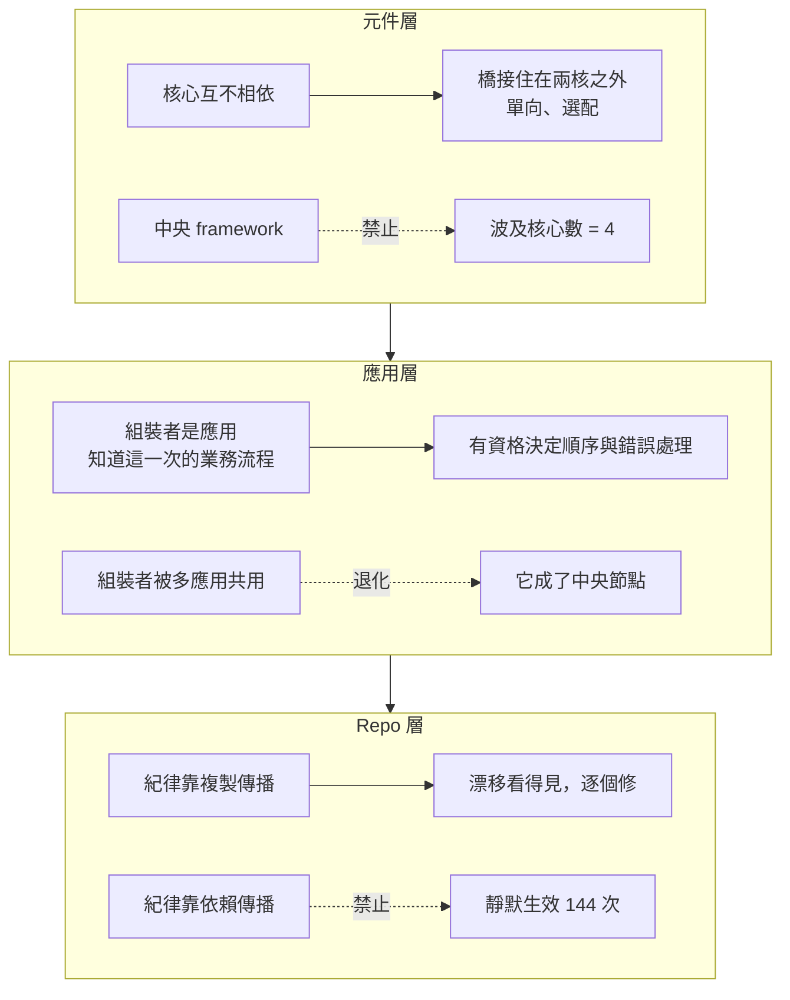

+++
title = "組合不等於耦合：一族薄核的兩張圖與跨 repo 的紀律傳播"
date = "2026-09-09T03:13:04+08:00"
author = "梅乾"
draft = false
isCJKLanguage = true
description = "left-pad 事件中沒有人看得出那個節點的波及範圍，因為大家看的是單層相依清單。本文分開量一族薄核的資料流圖與相依圖，證明箭頭數完全相同而波及範圍從零到全數，並討論跨 repo 的紀律傳播。"
tags = [
    "分析論述", # term:AnalyticalEssay
    "軟體工程與規格", # term:SoftwareEngineeringSpecifications
    "薄核", # term:ThinCore
    "參考實作", # term:ReferenceImplementation
    "波及範圍", # term:ImpactScope
  ]
series = ["封裝邊界的劃界權：當補全端會替你把界劃肥"]
[ai_info]
    [ai_info.generation]
        model = "Claude Opus 5"
        agent = "Claude Code VSCode Extension 2.1.261"
    [ai_info.refinement]
        model = "Kimi K3"
        agent = "GitHub Copilot Chat v0.66.0"
+++

<!--more-->

## 導言

2016 年 3 月，一個十一行的 npm 套件被作者從註冊中心移除。那十一行做的事是在字串左邊補空白。

移除之後，數千個建置失敗，包含 Babel 與 React 這一級的專案。它們沒有一個直接使用那個套件——它是相依樹深處的一個節點，被許多中間層各自拉進來。[npm 官方事後說明](https://blog.npmjs.org/post/141577284765/kik-left-pad-and-npm)

這個事件常被讀成「相依太多很危險」。更精確的讀法是：**沒有人看得出那個節點的波及範圍（Impact Scope） <!-- term:ImpactScope -->，因為大家看的是自己那一層的相依清單，而波及範圍 <!-- term:ImpactScope -->由整棵樹決定。**

> [!IMPORTANT]
> **波及範圍** <!-- term:ImpactScope --> (Impact Scope): 一個節點變更或失效時實際波及下游的範圍。它由整棵相依樹決定，而非單層相依清單；資料流圖的箭頭數不包含這項資訊。 <!-- anchor:ImpactScope -->


這件事對一族**薄核**（Thin Core） <!-- term:ThinCore -->有直接含義。若一族核心刻意做得薄，它們之間必然有大量資料在流動——組裝者要把值從一個核心搬到下一個。而「資料流很密」很容易被讀成「這些東西耦合很緊」，於是有人提出一個共用層來收攏它們。那個共用層一旦出現，波及範圍 <!-- term:ImpactScope -->就從零變成全部。

> [!IMPORTANT]
> **薄核** <!-- term:ThinCore --> (Thin Core): 對單一職責握有最終發言權、且克制擁有權的核心元件。薄不是規模小，而是擁有權的克制：核心只承載承重且歸屬於它的少數幾項行為。 <!-- anchor:ThinCore -->


本文要處理的問題是：**一族薄核 <!-- term:ThinCore -->之間的資料流與相依是兩張不同的圖，如何分開量；以及當這一族跨越多個 repo 時，紀律該怎麼傳播。**

## 分析

### 兩張圖：資料流固定，波及範圍差四倍

先把兩張圖分開量。四個核心之間的資料流固定為 6 條箭頭，只改相依結構。

```python
# 兩張圖：相依圖與資料流圖。箭頭數不代表耦合。
CORES = ["lifecycle", "ledger", "notify", "audit"]
DATAFLOW = [("lifecycle","ledger"), ("lifecycle","notify"), ("ledger","audit"),
            ("notify","audit"), ("lifecycle","audit"), ("ledger","notify")]

def deps(shape):
    if shape == "孤島＋組裝":     return []
    if shape == "橋接":           return [("bridge","lifecycle"), ("bridge","ledger")]
    if shape == "中央 framework": return ([(c, "framework") for c in CORES]
                                          + [("framework", c) for c in CORES])
    if shape == "直接相依":       return list(DATAFLOW)

def blast(edges, node):
    """改動 node 會波及哪些核心：沿反向相依邊傳遞"""
    rev = {}
    for a, b in edges:
        rev.setdefault(b, []).append(a)   # b 改變 -> a 受影響
    seen, stack = set(), [node]
    while stack:
        n = stack.pop()
        for m in rev.get(n, []):
            if m not in seen:
                seen.add(m); stack.append(m)
    return {c for c in seen if c in CORES}

print(f"四列的資料流箭頭數固定為 {len(DATAFLOW)} 條\n")
print(f"{'結構':<16}{'相依邊數':>9}{'最大波及核心數':>16}{'零波及的節點數':>16}")
for shape in ("孤島＋組裝", "橋接", "中央 framework", "直接相依"):
    e = deps(shape)
    nodes = sorted({n for edge in e for n in edge} | set(CORES))
    radii = {n: len(blast(e, n)) for n in nodes}
    print(f"{shape:<16}{len(e):>9}{max(radii.values()):>16}"
          f"{sum(1 for v in radii.values() if v == 0):>16}")
print()
print("資料流完全相同，最大波及核心數從 0 到 4——箭頭多不等於依賴多。")
print("中央 framework 的相依邊數看起來只比直接相依多兩條，波及範圍卻是全部。")
```

實際執行的輸出：

```text
四列的資料流箭頭數固定為 6 條

結構                   相依邊數         最大波及核心數         零波及的節點數
孤島＋組裝                   0               0               4
橋接                      2               0               5
中央 framework            8               4               0
直接相依                    6               3               1

資料流完全相同，最大波及核心數從 0 到 4——箭頭多不等於依賴多。
中央 framework 的相依邊數看起來只比直接相依多兩條，波及範圍卻是全部。
```

四列的資料流箭頭數完全相同。最大波及核心數從 0 到 4。

**所以資料流圖不含任何關於耦合的資訊。** 這一點值得強調，因為它與直覺相反：一族薄核 <!-- term:ThinCore -->的資料流圖看起來會比一個 god module 的更亂——god module 內部的呼叫不出現在任何架構圖上。看圖選架構會選錯方向。

第二列的橋接結構值得注意：它有 2 條相依邊，最大波及核心數仍是 0。原因是橋住在兩個核心之外，同時依賴兩者，而兩個核心都不依賴它。這是唯一合法的相依邊形狀——單向、選配、住在核外。

第三列與第四列的對照是這個實驗最有用的部分。中央 framework 的相依邊數是 8，只比直接相依的 6 多兩條，看起來像是「稍微多一點結構」。而它的最大波及核心數是 4，零波及節點數是 0——**每一個節點的變動都會波及某些核心，包含 framework 自己的每一次改動。**

### 為什麼中央 framework 是必須被明令禁止的形狀

上面的數字顯示中央 framework 的特殊之處：它是一個「依賴全部、或被全部依賴」的節點。

這種節點的問題不是相依數量，是它讓獨立演化在形式上不可能。任何核心要改一個介面，都要經過 framework；而 framework 的任何改動都到達所有核心。於是這一族的發布節奏被綁成一個。

**這正是薄核 <!-- term:ThinCore -->族刻意要避免的性質。** 把一族核心做薄的目的，是讓它們各自可以獨立採用、獨立發布、獨立退場。一個中央節點把這三件事一次取消，而它換來的好處——少寫一些轉換程式碼——與那三件事不成比例。

所以這條規則的形式不該是「盡量避免中央層」，而該是一條會咬的檢查：**每個核心的治理把「依賴任何兄弟核心」設成違憲，越界就編譯失敗。** 核心彼此正交不是被期望的美德，是被機械強制的性質。

### 組裝者在哪裡

如果核心互不相依，那 6 條資料流箭頭由誰執行？答案是一個核心之外的組裝者：它把值從一個孤島搬到下一個，並在每一跳做型別轉換。

這個位置有一個容易被忽略的性質：**組裝者是應用程式，不是基礎設施。** 它知道這一次的業務流程長什麼樣，所以它有資格決定順序、錯誤處理與重試——那些正是不屬於任何核心的東西。

把組裝者做成一個可重用的框架，就是把中央 framework 從後門請回來。判別方式很簡單：組裝者若開始被多個應用共用，它就不再是應用，而成了一個被全部依賴的節點。

### 跨 repo 時：共享的是紀律，不是程式碼

當這一族跨越多個 repo 時，同一個直覺要再用一次。每個 repo 需要相同的治理紀律——依賴邊界、命名圍籬、公開型別的標註——而傳播紀律有兩種方式。

```python
import random
# 跨 repo 傳播紀律：依賴傳播 vs 複製傳播。兩者各有代價。
N_REPOS, YEARS, CHANGES_PER_YEAR, SEED = 12, 3, 4, 31
RECOPY_PROB = 0.45          # 複製模式下，每年每個 repo 主動同步一次改進的機率

def simulate(mode, seed=SEED):
    rng = random.Random(seed)
    version = 0
    repos = [0] * N_REPOS
    silent = 0                # 未經該 repo 同意就生效的變更次數
    for _ in range(YEARS):
        for _ in range(CHANGES_PER_YEAR):
            version += 1
            if mode == "依賴傳播":
                repos = [version] * N_REPOS
                silent += N_REPOS
        if mode == "複製傳播":
            for i in range(N_REPOS):
                if rng.random() < RECOPY_PROB:
                    repos[i] = version
    behind = sum(1 for r in repos if r < version)
    return silent, behind, version

print(f"{N_REPOS} 個 repo，{YEARS} 年，每年 {CHANGES_PER_YEAR} 次紀律變更\n")
print(f"{'傳播方式':<12}{'靜默生效次數':>14}{'落後的 repo 數':>16}")
for mode in ("依賴傳播", "複製傳播"):
    silent, behind, ver = simulate(mode)
    print(f"{mode:<12}{silent:>14}{behind:>16}")
print()
print("依賴傳播的代價：改中央即靜默改所有人，共 144 次未經同意的生效")
print("複製傳播的代價：漂移——部分 repo 停在舊版紀律")
print("兩者不對稱之處：漂移看得見且可逐個修，靜默生效看不見")
```

實際執行的輸出：

```text
12 個 repo，3 年，每年 4 次紀律變更

傳播方式                靜默生效次數      落後的 repo 數
依賴傳播                   144               0
複製傳播                     0               7

依賴傳播的代價：改中央即靜默改所有人，共 144 次未經同意的生效
複製傳播的代價：漂移——部分 repo 停在舊版紀律
兩者不對稱之處：漂移看得見且可逐個修，靜默生效看不見
```

依賴傳播的落後 repo 數是 0——所有人永遠是最新的。代價是 144 次未經該 repo 同意就生效的變更。

複製傳播的靜默生效次數是 0，代價是 12 個 repo 裡有 7 個停在舊版紀律。

**兩者的代價不對稱，而不對稱之處在可見度。** 漂移是看得見的：查一下每個 repo 的治理檔版本就知道誰落後，而修正是逐個進行、每次都經過那個 repo 的同意。靜默生效看不見：中央檔改了一行，12 個 repo 的行為同時改變，而沒有任何一個 repo 的紀錄裡出現這次變更。

所以正確的做法是複製而非依賴：新成員從一個**參考實作**（Reference Implementation） <!-- term:ReferenceImplementation -->複製骨架長出來，出生後剪斷臍帶——不用子模組、不追蹤上游，改進靠人刻意重新複製。

> [!IMPORTANT]
> **參考實作** <!-- term:ReferenceImplementation --> (Reference Implementation): 提供架構樣板與基礎建設設定，供後續專案複製並依循的標準範例。 <!-- anchor:ReferenceImplementation -->


這條原則有一個反直覺的推論：**每一次想找一個中央的東西把一切收攏，紀律都要求把它推回邊緣。** 而那個衝動很強，因為收攏在當下總是看起來更整齊。

### 三個層次的同一條規則

下圖把同一條規則在三個尺度上的形式排在一起。它要回答的閱讀問題是：為什麼「不要中央節點」在元件、應用與 repo 三個層次都成立。



三個層次的失效形狀相同：一個被全部依賴的節點取消了獨立演化。三個層次的修法也相同：把共用的東西推到邊緣，讓每個單位各自持有。

## 反思

第一個邊界是複製傳播的漂移確實有代價。7 個 repo 停在舊版紀律不是零成本——若那條新紀律修的是一個安全問題，漂移就是曝險。此時正確的做法不是改用依賴傳播，而是把那一類變更與一般紀律改進分開處理：安全性修正走一次主動的、逐 repo 的推動，並記錄每個 repo 的確認。**區分點是這次變更需不需要每個 repo 知道；需要的話，靜默生效反而是缺陷而非便利。**

一個反例可以標出主張的另一側。假設一族元件確實應該共同發布——它們共用版本、一起測試、被當成一個整體採用。此時中央層是誠實的結構，而強行做成孤島會讓組裝的成本落在每個使用者身上，且沒有任何獨立採用的收益可以抵銷。判準是有沒有人真的只採用其中一個；答案是沒有時，孤島性是為一個不存在的需求付費。

第二個邊界關於橋接的數量。上面說橋接是唯一合法的相依邊形狀，但沒有說可以有幾條。橋的數量在核心數的平方階成長——四個核心最多六座橋——而每座橋都是要維護的東西。實務上這意味著孤島架構的成本隨核心數成長得比中央架構快，在核心數大到某個程度後，中央層的維護成本反而較低。這個交叉點本文沒有量，但它存在。

第三個邊界關於「組裝者是應用」這條判準。它在一個組織內部只有少數應用時清楚，在有數十個應用各自組裝同一族核心時就不清楚——那時「不要共用組裝者」等於要求每個應用重寫同樣的轉換程式碼。可行的折衷是共用轉換函式而不共用編排：轉換是純函式，共用它不產生中央節點；編排帶著業務決策，共用它就會。

最後是實驗的限制。第一個實驗的波及範圍 <!-- term:ImpactScope -->計算只看相依邊，而真實的耦合還來自共用的資料格式與隱含的行為假設——兩個形式上獨立的核心可以因為共用一個序列化格式而必須同步發布。這使孤島架構的實際波及範圍 <!-- term:ImpactScope -->高於 0。第二個實驗的重新複製機率 $0.45$ 是我指定的，它決定漂移的幅度；若那個機率接近 1，複製傳播就沒有漂移代價，而若接近 0，漂移會使紀律形同不存在。實驗證明「兩種傳播的代價在可見度上不對稱」這個結構，不估計任何組織的同步率。

## 實務對比

**看架構圖判斷耦合。** 錯誤做法是數箭頭。實測顯示資料流固定 6 條的四種結構，最大波及核心數從 0 到 4。正確做法是分開畫兩張圖，並以「改動任一節點會波及幾個核心」作為耦合指標。

**處理資料流很密的一族核心。** 錯誤做法是提出一個共用層來收攏它們。實測顯示中央 framework 的相依邊只多兩條，波及範圍 <!-- term:ImpactScope -->卻是全部，零波及節點數為 0。正確做法是保留孤島，把搬運與轉換交給核心之外的組裝者。

**建立核心之間的連接。** 錯誤做法是讓 A 直接依賴 B。正確做法是把連接做成住在兩核之外的橋：單向、選配、兩個核心都不依賴它——這是唯一能讓最大波及核心數保持 0 的形狀。

**強制孤島性。** 錯誤做法是寫在架構文件上並期待大家遵守。正確做法是讓每個核心的治理把「依賴任何兄弟核心」設成違憲，越界就編譯失敗；正交是被機械強制的性質，不是被期望的美德。

**在多個 repo 之間共享治理紀律。** 錯誤做法是讓所有 repo include 一份中央檔。實測顯示這會造成 144 次未經該 repo 同意就生效的變更，而那些變更不出現在任何 repo 的紀錄裡。正確做法是複製傳播：從參考實作 <!-- term:ReferenceImplementation -->長出骨架，出生後剪斷臍帶。

**處理一條必須讓所有 repo 立即知道的紀律變更。** 錯誤做法是為了它改用依賴傳播。正確做法是把這一類變更與一般紀律改進分開：走一次主動的逐 repo 推動，並記錄每個 repo 的確認——需要每個人知道的變更，靜默生效是缺陷而非便利。

**共用組裝邏輯。** 錯誤做法是把組裝者做成可重用的框架。它一旦被多個應用共用，就成了中央節點。正確做法是共用純轉換函式，不共用編排；轉換沒有業務決策，編排有。

## 結論

一族薄核 <!-- term:ThinCore -->之間有兩張圖，而它們幾乎沒有關係。資料流圖記錄值往哪裡搬，相依圖記錄改動往哪裡傳。

本文的量測給出四個結果：

1. **資料流圖不含關於耦合的資訊。** 四種結構的資料流箭頭數完全相同，最大波及核心數從 0 到 4。
2. **唯一能讓波及範圍 <!-- term:ImpactScope -->保持 0 的相依形狀是核外的橋。** 它有 2 條相依邊而最大波及核心數仍是 0，因為兩個核心都不依賴它。
3. **中央 framework 的相依邊只多兩條，波及範圍 <!-- term:ImpactScope -->卻是全部。** 零波及節點數為 0——包含它自己的每一次改動。
4. **兩種紀律傳播的代價在可見度上不對稱。** 依賴傳播 0 個 repo 落後但有 144 次靜默生效；複製傳播 0 次靜默生效但 7 個 repo 落後，而落後查得出來、可逐個修。

所以在提出一個共用層之前，有一個問題要先問：**改動它會波及幾個核心。**

答案不是 0 的時候，那個共用層買到的整齊，是用整族的獨立演化換的。而那個交易在當下永遠看起來划算——因為要放棄的東西，要到第一次需要單獨發布其中一個核心的時候才會被想起來。