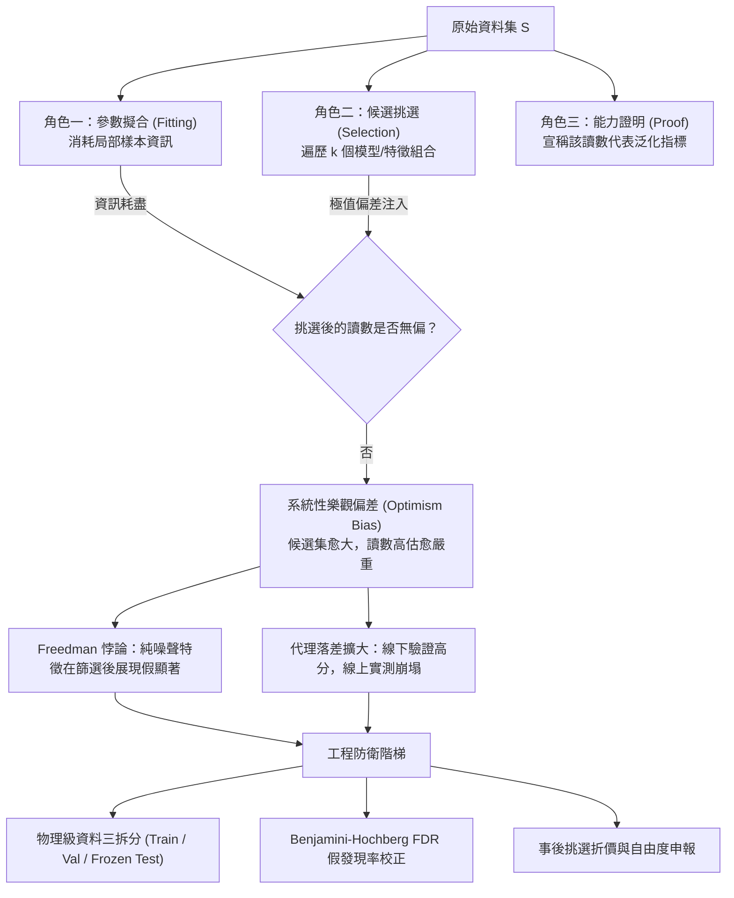

+++
title = "評估指標的選擇熵：極值偏差、多重假設檢定與假發現率控制"
date = "2026-09-13T16:50:01+08:00"
author = "梅乾"
draft = false
isCJKLanguage = true
description = "從超大候選池中挑出最佳模型，這個動作本身就是一次高強度的擬合。本文推導候選規模如何把抽樣噪聲的高端極值膨脹成看似真實的能力增益，拆解同一批資料兼任參數擬合、候選挑選與能力證明時的角色衝突，並以事前資料隔離與假發現率控制建立可落地的估計折價規範。"
tags = [
    "分析論述", # term:AnalyticalEssay
    "機器學習", # term:MachineLearning
    "選擇偏差", # term:SelectionBias
    "極值偏差", # term:ExtremumBias
    "多重假設檢定", # term:MultipleHypothesisTesting
    "假發現率", # term:FalseDiscoveryRate
    "假設空間", # term:HypothesisSpace
    "經驗風險", # term:EmpiricalRisk
  ]
series = ["代理讀數與能力本體：六種指標失真機制與可驗證的工程防線"]
term_exclude = ["Screening"]
[ai_info]
    [ai_info.generation]
        model = "Gemini 3.8 Flash"
        agent = "Antigravity IDE 2.5.5"
    [ai_info.refinement]
        model = "Claude Opus 5"
        agent = "Claude Code VSCode Extension 2.1.270"
+++

<!--more-->

## 導言

2013 年 2 月，正值北美流感流行高峰，一套運行逾四年、曾刊載於頂級學術期刊且被全球產學界奉為大數據預測典範的演算法系統，發布了當週全美類流感就診率預測。該系統估算出的數值高達疾病管制局（CDC）實測通報值的兩倍以上。這並非偶發的抽樣擾動：後續的追蹤審查揭示，在長達 108 週的連續運行中，該系統有高達 100 週系統性高估就診趨勢，其累積偏差完全超出隨機波動的容許界限（詳見 [Lazer 等人，2014 / 《The Parable of Google Flu: Traps in Big Data Analysis》](https://doi.org/10.1126/science.1248506)）。

這套預測架構在構建之初極具說服力：研究團隊自高達五千萬個候選搜尋字詞空間中展開全域檢索，將各字詞每週搜尋量與 CDC 歷史 128 週通報曲線進行回歸擬合，篩選出相關係數最高的前 45 個特徵組成預測模型，並在歷史樣本上展現出近乎完美的判定係數（$R^2 > 0.90$）。工程系統既無程式漏洞，亦未短缺訓練規模——它所擁有的資料體量恰恰是現代資訊工程的巔峰。

問題的根源不在計算精度，而在**「從超大規模候選池中挑選極值」這個行為本身，本質上即是一種高強度的參數擬合動作**。

在當代**機器學習**（Machine Learning） <!-- term:MachineLearning -->實踐中，這類統計幻象以各類變形反覆重演：從網格搜尋中的超參數調校（Hyperparameter Tuning）、**神經網路架構搜尋**（NAS） <!-- term:NeuralArchitectureSearch -->，到大規模特徵工程。當團隊宣稱「在驗證集上將準確率自 0.82 提升至 0.87」時，背後通常省略了一個未經證驗的推論跳躍：將一個在特定切分、特定候選規模下被選拔出的極值，等同於模型在未知分佈上的**泛化**（Generalization） <!-- term:Generalization -->能力。本文旨在從第一性原理出發，解構同一資料集兼任擬合、挑選與證明時引發的極值膨脹機制，定量刻畫候選集規模對評估偏差的放大效應，並確立可落地的**假發現率**（False Discovery Rate, FDR） <!-- term:FalseDiscoveryRate -->防衛規範。

> [!IMPORTANT]
> **機器學習** <!-- term:MachineLearning --> (Machine Learning): 先界定可選函數的範圍，再以資料估計其中參數的建模方法。 <!-- anchor:MachineLearning -->
> **神經網路架構搜尋** <!-- term:NeuralArchitectureSearch --> (Neural Architecture Search): 以自動化程序在架構空間中搜尋最佳網路結構的方法，其候選規模直接放大評估讀數的極值偏差。 <!-- anchor:NeuralArchitectureSearch -->
> **泛化** <!-- term:Generalization --> (Generalization): 模型在訓練樣本以外的資料上維持表現的能力。 <!-- anchor:Generalization -->
> **假發現率** <!-- term:FalseDiscoveryRate --> (False Discovery Rate): 在所有被宣告為顯著的結果中，實際為偽陽性者所佔的期望比例，是多重檢定下的主要控制目標。 <!-- anchor:FalseDiscoveryRate -->


---

## 分析

### 代理讀數與資料的三重角色衝突

任何在離線驗證集上量測到的**純量指標**（Scalar Metrics） <!-- term:ScalarMetrics -->均為**代理讀數**（Proxy Readout） <!-- term:ProxyReadout -->，其數學職責是替代那無法直接觀測的對象——模型在真實部署分佈上的期望風險。設模型空間為 $\mathcal{H}$，真實部署分佈為 $\mathcal{D}$，**損失函數**（Loss Function） <!-- term:LossFunction -->為 $\ell(h(x), y)$。理論上追求的目標是泛化 <!-- term:Generalization -->期望風險：

> [!IMPORTANT]
> **純量指標** <!-- term:ScalarMetrics --> (Scalar Metrics): 將無限維社會脈絡強制投影到一維可排序實數，以便科層機器消化的度量形式。 <!-- anchor:ScalarMetrics -->
> **代理讀數** <!-- term:ProxyReadout --> (Proxy Readout): 以可計算的純量指標替代無法直接觀測之真實能力的量測結果，其有效性取決於替代關係是否成立。 <!-- anchor:ProxyReadout -->
> **損失函數** <!-- term:LossFunction --> (Loss Function): 把模型輸出與目標之間的差距量化為單一數值的評分函數。 <!-- anchor:LossFunction -->


$$
R_{\mathcal{D}}(h) = \mathbb{E}_{(x,y)\sim \mathcal{D}}\big[\ell(h(x), y)\big].
$$

由於 $\mathcal{D}$ 未知且無法窮盡，工程實踐僅能透過有限經驗資料集 $S = \{(x_i, y_i)\}_{i=1}^n$ 構建**經驗風險**（Empirical Risk） <!-- term:EmpiricalRisk -->估計量：

> [!IMPORTANT]
> **經驗風險** <!-- term:EmpiricalRisk --> (Empirical Risk): 模型在有限訓練樣本上的平均損失，是目標分佈期望風險的間接替代量。 <!-- anchor:EmpiricalRisk -->


$$
\hat{R}_S(h) = \frac{1}{n}\sum_{i=1}^n \ell(h(x_i), y_i).
$$

此處存在一個根本性的統計公理：**只有當假設 $h$ 在觀測到資料集 $S$ 之前即已完全固定且獨立時，$\hat{R}_S(h)$ 才是 $R_{\mathcal{D}}(h)$ 的無偏估計量**（即 $\mathbb{E}_S[\hat{R}_S(h)] = R_{\mathcal{D}}(h)$）。然而，現代模型選拔管線要求同一批有限資料 $S$ 同時兼任三個互斥角色：

1. **參數擬合（Fitting）**：在連續空間中調整權重向量，消耗資料自由度。
2. **候選挑選（Selection）**：在離散空間中比較 $k$ 個超參數組合或特徵子集，挑選經驗風險 <!-- term:EmpiricalRisk -->最小者 $\hat{h} = \arg\min_{h \in \mathcal{H}_k} \hat{R}_S(h)$。
3. **能力證明（Proof）**：以挑選出的 $\hat{R}_S(\hat{h})$ 作為向利害關係人宣稱泛化 <!-- term:Generalization -->能力的客觀憑據。

當挑選動作涉入時，評估量實質轉化為一組經驗隨機變數的極值（Sample Extremum）。由於最小值算子是凹函數（Concave Function），根據 Jensen 不等式，挑選後的經驗期望必然系統性偏低：

$$
\mathbb{E}_S\left[\min_{h \in \mathcal{H}_k} \hat{R}_S(h)\right] \le \min_{h \in \mathcal{H}_k} \mathbb{E}_S\left[\hat{R}_S(h)\right] = \min_{h \in \mathcal{H}_k} R_{\mathcal{D}}(h).
$$

這意味著：**即便候選池中的所有模型本質完全無效、真值全等，僅憑挑選動作本身，就能在數學期望上穩定製造出虛假的「性能躍升」**。



---

### 極值分佈與候選池規模的解析演進

為精確量測候選集規模 $k$ 對指標虛增的影響，設驗證集上測試了 $k$ 個互相獨立的候選模型。在虛無假設成立的極端情境下，所有候選模型的真實表現均為常數 $\mu_0$，而量測過程因樣本有限而附帶標準常態分佈噪聲 $\epsilon_i \sim \mathcal{N}(0, \sigma^2)$。此時觀測到的指標為 $X_i = \mu_0 + \epsilon_i$。

根據經典極值理論（Extreme Value Theory, EVT），獨立同分佈高斯變數之最大值 $M_k = \max_{1 \le i \le k} X_i$ 的漸近期望值為：

$$
\mathbb{E}[M_k] = \mu_0 + \sigma \left( \sqrt{2\ln k} - \frac{\ln(\ln k) + \ln(4\pi)}{2\sqrt{2\ln k}} \right) + \mathcal{O}\left(\frac{1}{\sqrt{\ln k}}\right).
$$

由此可知，評估讀數的高估幅度與 $\sqrt{\ln k}$ 成正比，且以抽樣標準誤 $\sigma = \sigma_{\text{sample}}/\sqrt{n}$ 為尺度擴散。當候選空間透過自動化調參（AutoML）或暴力檢索擴展至數千或數萬規模時，即便真實模型毫無改進，回報的最佳驗證分數亦必然大幅偏離真實中樞。

當篩選特徵應用於回歸分析時，此現象演變為著名的 **Freedman 悖論**（參閱 [Freedman，1983 / 《A Note on Screening Regression Equations》](https://doi.org/10.1080/00031305.1983.10482729)）：在樣本數遠小於候選變數量的場景中，僅挑選與目標變數相關係數最高的前 $p$ 個純噪聲變數，即可在第二階段線性回歸中製造出高達 0.8 以上的假樣本內判定係數 $R^2$ 與虛假的極低 $p$ 值。

---

### 數值走一遍：候選集規模與泛化落差

以下表格展示在真實能力恆定為 $\mu_0 = 0.80$、驗證集樣本數 $n = 500$（抽樣標準誤 $\sigma \approx 0.0179$）之設定下，挑選程序隨候選數 $k$ 膨脹所產生的確定性漂移：

| 候選數 $k$ | 抽樣最大值期望 $\mathbb{E}[M_k]$ | 理論極值上界漸近值 | 偽陽性高估幅度 ($\Delta$) | 部署樣本外真實泛化 <!-- term:Generalization -->表現 | 統計顯著性誤判風險 |
| :--- | :--- | :--- | :--- | :--- | :--- |
| **1** | 0.8001 | 0.8000 | $+0.0001$ | 0.8000 | 基準名目水準 (5%) |
| **10** | 0.8275 | 0.8268 | $+0.0275$ | 0.8000 | 輕度多重檢定膨脹 |
| **100** | 0.8451 | 0.8449 | $+0.0451$ | 0.8000 | 顯著偏差（高估 4.5%） |
| **1,000** | 0.8582 | 0.8576 | $+0.0582$ | 0.8000 | 重度假陽性（等同跨越發布門檻） |
| **10,000** | 0.8694 | 0.8681 | $+0.0694$ | 0.8000 | 災難性失真（將噪聲包裝為核心突破） |
| **50,000** | 0.8752 | 0.8743 | $+0.0752$ | 0.8000 | 完全斷裂（如 Google Flu 初始特徵池） |

由表可知，當 $k=1000$ 時，僅憑抽樣運氣即可憑空捏造出近 6 個百分點的虛假優勢。若工程團隊將此視為「架構改進」，上線後面對無偏分佈時，該 6 個百分點將瞬間蒸發。

---

### 跨維度範式診斷矩陣

為徹底根除**選擇偏差**（Selection Bias） <!-- term:SelectionBias -->與指標自欺，必須將表面讀數與底層統計病灶進行多維度對照：

> [!IMPORTANT]
> **選擇偏差** <!-- term:SelectionBias --> (Selection Bias): 從多個候選中挑出表現最好者時，該讀數同時包含真實能力與抽樣噪聲，使其系統性地優於真值的偏差。 <!-- anchor:SelectionBias -->


| 表面讀數 / 經驗現象 | 底層統計物理病灶 | 舊代脆弱實踐 (Fragile Reflex) | 嚴密工程防線 (Robust Defense) |
| :--- | :--- | :--- | :--- |
| **AutoML 跑出 $R^2=0.88$，線上即時預測 $R^2 < 0$** | 候選空間維度遠超有效樣本數，極端值被當作因果訊號（Freedman 悖論）。 | 宣稱「線上資料分佈發生未知漂移」，將統計過擬合歸咎於外部環境。 | 嚴格隔離凍結測試集；對特徵篩選引入 Benjamini-Hochberg 臨界控制。 |
| **在同一個驗證集上微調架構 200 次，分數持續攀升** | 驗證集透過挑選過程實質轉化為訓練集，自由度遭反覆消耗。 | 將驗證集最高分記錄於發布文檔，作為模型最終能力憑證。 | 引入「測試集使用計數器」；實施事後選擇折價或保留完全盲測集。 |
| **大資料庫特徵交叉後，單變數檢定大量呈現顯著 ($p < 0.01$)** | **多重假設檢定**（Multiple Hypothesis Testing） <!-- term:MultipleHypothesisTesting -->下全域第一型錯誤概率族系（Family-Wise Error Rate）失控。 | 逐一採納顯著特徵，構建龐大而脆弱的複雜特徵工程管線。 | 強制執行 Bonferroni 或 FDR 截斷；要求時間序列跨週期留一檢驗。 |
| **小樣本驗證集上更換 5 個隨機種子，挑選最優曲線發布** | 隨機種子充當了隱式超參數，挑選了對特定噪聲切分有利的權重初始點。 | 在論文或報告中僅展示單一最優曲線，掩蓋其餘失敗軌跡。 | 強制報告多種子分佈（箱型圖或均值 $\pm$ 標準差），報告反覆測試次數。 |

> [!IMPORTANT]
> **多重假設檢定** <!-- term:MultipleHypothesisTesting --> (Multiple Hypothesis Testing): 同時檢驗多個假設時，單次檢定的顯著水準無法控制整體誤判率，須另行校正族系錯誤。 <!-- anchor:MultipleHypothesisTesting -->


---

### 最小自我驗證實施：極值偏差與 Benjamini-Hochberg FDR 控制

以下 Python 程式碼示範在無任何真實訊號（純隨機高斯噪聲）的情境下，候選池搜尋如何偽造判定係數，並展示如何使用 Benjamini-Hochberg 演算法（參閱 [Benjamini & Hochberg，1995 / 《Controlling the False Discovery Rate: A Practical and Powerful Approach to Multiple Testing》](https://doi.org/10.1111/j.2517-6161.1995.tb02031.x)）進行精確的統計阻斷。程式碼僅使用標準庫，具備毫秒級自我驗證斷言：

```python
import math
import random

def test_selection_bias_and_fdr():
    rng = random.Random(42)
    n_samples = 150
    n_candidates = 2000
    alpha = 0.05

    # 1. 構建純隨機目標與候選特徵（完全無因果關係的虛無情境）
    y_true = [rng.gauss(0, 1) for _ in range(n_samples)]
    y_mean = sum(y_true) / n_samples
    ss_tot = sum((y - y_mean) ** 2 for y in y_true)

    # 2. 計算每個候選特徵與 y 的皮爾森相關係數及其雙尾 t 檢定 p-value
    candidates = []
    for idx in range(n_candidates):
        x = [rng.gauss(0, 1) for _ in range(n_samples)]
        x_mean = sum(x) / n_samples
        
        cov = sum((xi - x_mean) * (yi - y_mean) for xi, yi in zip(x, y_true))
        var_x = sum((xi - x_mean) ** 2 for xi in x)
        
        r = cov / math.sqrt(var_x * ss_tot) if var_x > 0 and ss_tot > 0 else 0.0
        
        # t 統計量: t = r * sqrt(n - 2) / sqrt(1 - r^2)
        df = n_samples - 2
        denom = math.sqrt(max(1e-12, 1.0 - r * r))
        t_stat = abs(r) * math.sqrt(df) / denom
        
        # 自由度為 148 時，雙尾 p-value 的標準常態近似估算
        # 使用互補誤差函數 erf 近似尾端概率
        p_val = math.erfc(t_stat / math.sqrt(2.0))
        candidates.append({"id": idx, "r": r, "p_val": p_val})

    # 3. 按照名目顯著性 (未校正前) 挑選：純噪聲下將產生大量假陽性
    naive_positives = [c for c in candidates if c["p_val"] < alpha]
    naive_false_positive_rate = len(naive_positives) / n_candidates

    # 4. 執行 Benjamini-Hochberg (BH) 過程控制 FDR
    candidates.sort(key=lambda item: item["p_val"])
    m = n_candidates
    bh_threshold_idx = -1

    for rank_idx, c in enumerate(candidates, start=1):
        # BH 判定臨界: P_(k) <= (k / m) * alpha
        critical_value = (rank_idx / m) * alpha
        if c["p_val"] <= critical_value:
            bh_threshold_idx = rank_idx - 1

    bh_accepted = candidates[:bh_threshold_idx + 1] if bh_threshold_idx >= 0 else []

    # 5. 自我驗證斷言 (Self-Verifying Invariants)
    # (a) 名目未校正的假陽性率應穩定落在 5% 附近 (4% ~ 7% 區間)
    assert 0.03 <= naive_false_positive_rate <= 0.07, (
        f"Naive FPR {naive_false_positive_rate} unexpected"
    )
    # (b) 在純噪聲下，最大虛假相關性必顯著大於 0 (極值偏差)
    max_r = max(abs(c["r"]) for c in candidates)
    assert max_r > 0.20, f"Max correlation {max_r} unexpectedly low for 2000 candidates"

    # (c) 經 BH 校正後，虛無分佈下的假發現應全數或絕大多數被攔截 (<= 1)
    assert len(bh_accepted) <= 1, (
        f"FDR control failed: accepted {len(bh_accepted)} spurious candidates"
    )

if __name__ == "__main__":
    test_selection_bias_and_fdr()
    print("Slot 01 (statistical-selection-illusions) self-verification passed.")
```

---

## 反思

### 極值偏差在深層模型中的隱式演化

在傳統機器學習 <!-- term:MachineLearning -->中，候選集 $k$ 的規模是離散且顯式的（如特徵數或超參數網格點）。然而在深度神經網路中，**梯度下降**（Gradient Descent） <!-- term:GradientDescent -->演算法在數百萬維度參數曲面上進行高維軌跡探索，實質上在連續流形上隱式遍歷了一個等效規模極其龐大的**假設空間**（Hypothesis Space） <!-- term:HypothesisSpace -->。

> [!IMPORTANT]
> **梯度下降** <!-- term:GradientDescent --> (Gradient Descent): 沿損失函數負梯度方向反覆更新參數的最佳化方法。 <!-- anchor:GradientDescent -->
> **假設空間** <!-- term:HypothesisSpace --> (Hypothesis Space): 學習演算法可選函數所構成的集合，其大小決定泛化保證的鬆緊。 <!-- anchor:HypothesisSpace -->


當評估指標缺乏結構性約束時，過度參數化網路將不可避免地「記住」驗證集特徵。這一病灶無法單純透過正則化（Weight Decay、Dropout）徹底消除，因為正則化僅限制了權重範數，並未限制研究者透過反覆調參所注入的「選擇熵」。

### 邊界條件與反例分析

**極值偏差**（Extremum Bias） <!-- term:ExtremumBias -->框架的約束力並非無邊界生效。以下幾種情境下，候選池擴大對最終決策的破壞性相對有限：

> [!IMPORTANT]
> **極值偏差** <!-- term:ExtremumBias --> (Extremum Bias): 從大量候選中取出最大值時，該讀數同時吸收了真實訊號與抽樣噪聲的高端尾部，因而系統性高於真值。 <!-- anchor:ExtremumBias -->


1. **效應量跨越數量級的真突破**：若模型改進帶來真實泛化 <!-- term:Generalization -->邊際增益 $\Delta_{\text{true}} \gg \sigma \sqrt{2\ln k}$（例如架構改良使準確率直接自 60% 躍升至 90%），抽樣噪聲所造成的極值偏移不足以顛覆整體排序。
2. **候選維度高度退化共線**：五千萬個搜尋字詞中若有 99% 為近義詞或拼寫變體，其有效自由度 $k_{\text{eff}}$ 遠低於名目規模，極值膨脹速率將隨協方差矩陣的譜衰減（Spectral Decay）而大幅放緩。
3. **線上即時探索（Bandit / Active Testing）**：若決策系統具備低成本線上探索與動態回滾機制，線下極值偏差 <!-- term:ExtremumBias -->可在短週期內被即時反饋無偏校正。

---

## 實務對比

### 錯誤實施：將特徵篩選與超參數最佳化置於評估切分之外

在資料管線中，常見的嚴重失誤是先對全量資料集進行特徵篩選或全域標準化，隨後才劃分訓練集與測試集：

```text
# 致命缺陷：測試樣本的標籤與分佈已在篩選階段滲透進候選特徵評估中
1. 收集全量資料集 D (n = 10,000)
2. 在 D 上計算所有 50,000 個候選特徵與 y 的皮爾森相關係數
3. 選取相關度最高的 Top-50 特徵
4. 將 D 劃分為 Train (80%) 與 Test (20%)
5. 訓練回歸模型並報告 Test 上的 R² = 0.86（此數字已遭嚴重污染）
```

上述流程中，測試集的資訊已在步驟 2 中被評估演算法完整「看過」，使最終在測試集上回報的指標淪為純粹的自欺讀數。

### 正確工程防線：嚴格的時間/實體單向隔離管線

正確的工程實踐必須將資料的角色進行物理級鎖定，並落實事後挑選折價申報：

```text
# 嚴密防線：決策凍結與獨立單次評估
1. 實體切分：在任何資料前處理前，切出完全盲測的 Test Set，並實體封存。
2. 折內特徵選擇：
   For each Fold in Cross-Validation:
     - 僅在當前 Fold 的 Train Split 內執行特徵篩選與參數擬合
     - 在 Validation Split 上記錄指標
3. 候選集計數申報：
   - 記錄總遍歷超參數組態數：k = 480
   - 計算極值理論高估界限，將驗證集最優得分 0.88 標註為「樂觀上界」
4. 最終裁決：
   - 模型權重與前處理 Pipeline 凍結封存
   - 盲測 Test Set 僅解封評估「一次」，以此單次數值 0.82 作為對外能力憑證
```

---

## 結論

純量評估讀數的改善，從不自動等同於系統能力的確立。同一資料集無法同時兼顧參數估計、模型篩選與泛化 <!-- term:Generalization -->證明三重職責。當候選空間透過現代計算算力呈指數擴張時，極值統計機制必然將純隨機噪聲推升為表象上的「能力突破」。

工程團隊若欲將脆弱的訓練訊號昇華為嚴謹的系統能力證據，必須在評估流程中建立三道不可妥協的防線：將特徵選擇與參數調整完全侷限於隔離折內；對大量檢定引入假發現率（FDR） <!-- term:FalseDiscoveryRate -->等統計門檻；並將候選規模與挑選歷程作為指標不可分割的元數據一同交付。缺少了對選擇過程的約束，報表上所有的分數提升，都只是對歷史抽樣噪聲的精緻附會。