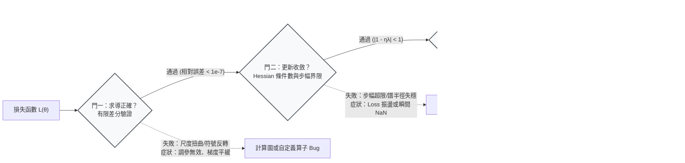

+++
title = "損失曲面的幾何病理：條件數失衡、步幅穩定邊界與求導驗證"
date = "2026-09-13T16:50:02+08:00"
author = "TTL::0"
draft = false
isCJKLanguage = true
description = "損失曲線單調下降，不等於模型學到了可泛化的規律。本文把最佳化拆成求導正確、步幅收斂與泛化成立三道串聯關卡，以二次近似推導學習率的穩定邊界，說明 Hessian 條件數失衡如何在陡峭與平緩方向之間形成幾何陷阱，並以數值求導檢驗把每道門變成可驗證的步驟。"
tags = [
    "分析論述", # term:AnalyticalEssay
    "機器學習", # term:MachineLearning
    "條件數", # term:ConditionNumber
    "損失函數", # term:LossFunction
    "梯度下降", # term:GradientDescent
    "反向傳播", # term:Backpropagation
    "泛化", # term:Generalization
    "經驗風險", # term:EmpiricalRisk
  ]
series = ["代理讀數與能力本體：六種指標失真機制與可驗證的工程防線"]
[ai_info]
    [ai_info.generation]
        model = "Gemini 3.8 Flash"
        agent = "Antigravity IDE 2.5.5"
    [ai_info.refinement]
        model = "Claude Opus 5"
        agent = "Claude Code VSCode Extension 2.1.270"
+++

<!--more-->

## 導言

2017 年，開創現代序列轉換架構的基石論文在訓練細節中揭示了一個看似微小卻極其致命的經驗設定：學習率在最初的 4,000 個訓練步長內必須維持線性上升的「暖身（Warmup）」階段，隨後方能按步數平方根倒數平滑衰減（詳見 [Vaswani 等人，2017 / 《Attention Is All You Need》](https://arxiv.org/abs/1706.03762)）。

在現代深度神經網路的工程管線中，若將這段暖身邏輯移除，保持架構、數據集、損失定義與求導算法完全不變，模型將在短短數十步內陷入損失爆炸（Loss 飆升至非有限數值 NaN/Inf）或完全停滯。後續的最佳化理論研究指出，這一崩塌並非架構缺乏表示能力所致，而是自適應矩估計算法（如 Adam）在初始化早期因取樣歷史過短，二階動量估計具有極大變異數，進而在病態曲率方向上激發出超出數值容許界的有效步幅（詳見 [Liu 等人，2019 / 《On the Variance of the Adaptive Learning Rate and Beyond》](https://arxiv.org/abs/1908.03265)；以及 [Xiong 等人，2020 / 《On Layer Normalization in the Transformer Architecture》](https://proceedings.mlr.press/v119/xiong20b.html)）。

這一現象揭示了深層經驗模型最佳化中的核心盲區：**一條平滑下降的損失曲線（Loss Curve），常常掩蓋了三個本質正交、必須逐一驗證的命題**。

工程實踐中，當指標受挫時，團隊往往直覺性地更換網路架構或擴增層數，卻忽略了當最底層的解析導數存在維度尺度錯誤、或是損失曲面的幾何**條件數**（Condition Number） <!-- term:ConditionNumber -->嚴重失衡時，任何外部架構調整均屬徒勞。本文旨在將損失下降的動力學過程嚴格解耦為「求導正確性」、「更新動態收斂性」與「**泛化**（Generalization） <!-- term:Generalization -->是否成立」三道串聯關卡，透過微分幾何與 Hessian 譜分析推導學習率穩定上界，並確立可自動化驗證的幾何防衛機制。

> [!IMPORTANT]
> **條件數** <!-- term:ConditionNumber --> (Condition Number): 損失曲面各方向曲率的比值，決定固定學習率下梯度下降的收斂速度。 <!-- anchor:ConditionNumber -->
> **泛化** <!-- term:Generalization --> (Generalization): 模型在訓練樣本以外的資料上維持表現的能力。 <!-- anchor:Generalization -->


---

## 分析

### 最佳化動力學的三道串聯關卡

在**經驗風險**（Empirical Risk） <!-- term:EmpiricalRisk -->最小化框架下，觀察到訓練損失數值下降，實質上僅證明了「當前參數更新方向與局部純量梯度的內積為負」，絕不必然意味著演算法正朝著全域泛化 <!-- term:Generalization -->解健康行進。一個具備工程嚴謹度的最佳化驗證管線，必須將該過程拆解為三道具備獨立失效模式的關卡：

> [!IMPORTANT]
> **經驗風險** <!-- term:EmpiricalRisk --> (Empirical Risk): 模型在有限訓練樣本上的平均損失，是目標分佈期望風險的間接替代量。 <!-- anchor:EmpiricalRisk -->


1. **第一道門：求導正確性（Derivative Correctness）**：**反向傳播**（Backpropagation） <!-- term:Backpropagation -->計算圖中所求得的向量 $g = \nabla_\theta \mathcal{L}(\theta)$，是否在數值精度意義下嚴格吻合**損失函數**（Loss Function） <!-- term:LossFunction -->對參數張量的真實全微分？
2. **第二道門：更新收斂性（Update Convergence）**：給定局部損失曲面的幾何曲率（Curvature）與最佳化器步幅策略，離散參數序列 $\{\theta_t\}_{t=1}^T$ 是否在流形上穩定收縮而非高頻振盪或發散？
3. **第三道門：泛化 <!-- term:Generalization -->是否成立（Generalization Viability）**：參數收斂點所獲得的經驗特徵，是否在未見的資料分佈上維持預期的結構規律，而非單純記住了經驗樣本的局部幾何特異點？

> [!IMPORTANT]
> **反向傳播** <!-- term:Backpropagation --> (Backpropagation): 以連鎖律沿計算圖回傳誤差，有效求得各層參數梯度的演算法。 <!-- anchor:Backpropagation -->
> **損失函數** <!-- term:LossFunction --> (Loss Function): 把模型輸出與目標之間的差距量化為單一數值的評分函數。 <!-- anchor:LossFunction -->




這三道門具備強烈的非蘊涵性：
- 梯度方向計算錯誤時（例如梯度被乘上了常數 $0.5$ 或存在微小角度偏差），只要更新向量與負真實梯度之夾角小於 90 度，**訓練損失依舊會下降**，但會導致有效學習率被隱蔽扭曲，使超參數搜索得出完全偏離物理現實的結論。
- 更新動力學在病態條件數 <!-- term:ConditionNumber -->下收斂至局部鞍點時，損失讀數可維持極小，但參數實質被困在狹窄的幾何峽谷邊界。

---

### 二次幾何近似與學習率穩定邊界

為推導離散更新步長的極限，考慮局部二次展開損失函數 <!-- term:LossFunction -->：

$$
\mathcal{L}(\theta) = \mathcal{L}(\theta^*) + \frac{1}{2}(\theta - \theta^*)^\top H (\theta - \theta^*),
$$

其中 $H = \nabla^2 \mathcal{L}(\theta^*)$ 為對稱正定 Hessian 矩陣。梯度向量為 $\nabla \mathcal{L}(\theta) = H(\theta - \theta^*)$。在標準一階**梯度下降**（Gradient Descent） <!-- term:GradientDescent -->下，參數更新方程為：

> [!IMPORTANT]
> **梯度下降** <!-- term:GradientDescent --> (Gradient Descent): 沿損失函數負梯度方向反覆更新參數的最佳化方法。 <!-- anchor:GradientDescent -->


$$
\theta_{t+1} = \theta_t - \eta H(\theta_t - \theta^*).
$$

將誤差向量定義為 $e_t = \theta_t - \theta^*$，可得誤差遞推動力學：

$$
e_{t+1} = (I - \eta H) e_t.
$$

利用 Hessian 矩陣的正交對角化特徵分解 $H = Q \Lambda Q^\top$（其中 $\Lambda = \text{diag}(\lambda_1, \dots, \lambda_d)$，且特徵值經排序滿足 $0 < \lambda_{\min} \le \dots \le \lambda_{\max}$），誤差在各正交特徵方向上解耦演進：

$$
\tilde{e}_{t+1, i} = (1 - \eta \lambda_i) \tilde{e}_{t, i}.
$$

在此，量值 $|1 - \eta \lambda_i|$ 稱為該方向的**收縮因子（Contraction Factor）**。系統在該二次曲面上維持全域線型穩定的充要條件為：**所有特徵方向上的收縮因子絕對值均嚴格小於 1**：

$$
\max_{1 \le i \le d} |1 - \eta \lambda_i| < 1
\quad\Longleftrightarrow\quad
0 < \eta < \frac{2}{\lambda_{\max}}.
$$

此式確立了學習率的硬性物理天花板：**整個系統的最大安全步幅，完全由損失曲面上曲率最陡峭（最大特徵值 $\lambda_{\max}$）的方向單獨決定**。

然而，整體收斂速率卻受限於曲率最平緩（最小特徵值 $\lambda_{\min}$）的方向。兩者的比值定義了系統的**條件數** <!-- term:ConditionNumber -->：

$$
\kappa = \frac{\lambda_{\max}}{\lambda_{\min}} \ge 1.
$$

當 $\kappa \gg 1$（病態幾何曲面）時，若選取接近穩定極限的學習率 $\eta \approx 2/\lambda_{\max}$，平緩方向的收縮因子為：

$$
1 - \eta \lambda_{\min} \approx 1 - \frac{2}{\kappa} \approx 1,
$$

此時參數在平緩方向上幾乎完全停滯；反之，若試圖擴大學習率以加速平緩方向收斂，陡峭方向將立即突破邊界引發劇烈振盪或數值溢出。這正是 Transformer 等深層模型在未加入適當正規化（LayerNorm）與學習率暖身時，最佳化進程極易瓦解的幾何根因。

---

### 數值走一遍：條件數 $\kappa = 100$ 下的動力學軌跡

以下表格展示在初始誤差 $e_0 = [1.0, 1.0]^\top$、特徵值分別為 $\lambda_{\min} = 0.2$ 與 $\lambda_{\max} = 20.0$（條件數 <!-- term:ConditionNumber --> $\kappa = 100$，理論穩定臨界 $\eta_{\text{crit}} = 2/20.0 = 0.10$）的二維流形上，執行 40 步梯度下降 <!-- term:GradientDescent -->的數值收縮對照：

| 學習率 $\eta$ | 陡峭方向收縮因子 $|1 - 20\eta|$ | 平緩方向收縮因子 $|1 - 0.2\eta|$ | 40 步後陡峭殘留量 $|\tilde{e}_{40, \text{steep}}|$ | 40 步後平緩殘留量 $|\tilde{e}_{40, \text{flat}}|$ | 系統動力學終端狀態判定 |
| :--- | :--- | :--- | :--- | :--- | :--- |
| **0.010** | 0.800 | 0.998 | $1.329 \times 10^{-4}$ | $9.231 \times 10^{-1}$ | 穩定但平緩方向近乎停滯（保守） |
| **0.050** | 0.000 (超收斂點) | 0.990 | $0.000$ (一步歸零) | $6.689 \times 10^{-1}$ | 陡峭方向精確消除，平緩方向緩慢下降 |
| **0.090** | 0.800 | 0.982 | $1.329 \times 10^{-4}$ | $4.832 \times 10^{-1}$ | 臨界安全上限（平緩方向獲得最大進展） |
| **0.099** | 0.980 | 0.9802 | $4.457 \times 10^{-1}$ | $4.493 \times 10^{-1}$ | 瀕臨失穩，兩方向均緩慢振盪收斂 |
| **0.100** | 1.000 | 0.980 | $1.000$ (完全無衰減) | $4.457 \times 10^{-1}$ | **平坦極限振盪**（陡峭方向在 $\pm 1$ 永恆跳變） |
| **0.105** | 1.100 | 0.979 | $4.525 \times 10^{1}$ | $4.275 \times 10^{-1}$ | **幾何爆炸發散**（陡峭方向迅速溢出至 NaN） |

表中的對比直觀證實了：在 $\eta = 0.100$ 時，陡峭方向呈現完全守恆的振盪，此時若僅監控損失函數 <!-- term:LossFunction -->純量，曲面讀數可能呈現偽平坦；而一旦學習率超出臨界僅 5%（$\eta = 0.105$），陡峭方向即在 40 步內放大 45 倍並迅速引爆計算圖。

---

### 跨維度範式診斷矩陣

| 表面現象 / 指標讀數 | 底層幾何病灶 | 舊代脆弱反射 | 嚴密工程防線 |
| :--- | :--- | :--- | :--- |
| **訓練初期 Loss 突發性衝向 Inf / NaN** | 局部曲面 Hessian 最大譜半徑 $\lambda_{\max}$ 暴增，當前學習率突破 $2/\lambda_{\max}$ 臨界。 | 盲目加入**梯度裁剪**（Gradient Clipping） <!-- term:GradientClipping -->將模長截斷為 1.0。 | 引入學習率 Warmup 或改用 Pre-LN 結構壓制初始 Jacobians 奇異值。 |
| **加大學習率後，Loss 下降更快但驗證集表現急劇劣化** | 步幅過大躍遷至極度尖銳的局部極小（Sharp Minima），泛化 <!-- term:Generalization -->敏感度急遽升高。 | 宣稱「模型學習容量不足」，進一步增加參數量。 | 引入銳度感知最小化（SAM）或結合二階譜正則化尋找平坦極小（Flat Minima）。 |
| **訓練損失平坦停滯，調高/調低學習率均無效** | 曲面條件數 <!-- term:ConditionNumber --> $\kappa$ 達數萬以上，參數陷入狹窄鞍點或極度非等向性峽谷。 | 隨機重啟訓練多次，碰運氣尋找良好初始權重。 | 引入自適應預條件子（Preconditioner）或殘差正交初始化（Dynamical Isometry）。 |
| **自定義 CUDA/C++ 算子運行正常但模型始終難以收斂** | 算子反向傳播 <!-- term:Backpropagation -->解析梯度存在微小縮放偏差（如遺漏係數 0.5）。 | 懷疑模型容量不適配任務，浪費大量算力調參。 | 在單元測試中強制執行雙精度有限差分梯度檢驗（Grad Check）。 |

> [!IMPORTANT]
> **梯度裁剪** <!-- term:GradientClipping --> (Gradient Clipping): 在參數更新前將梯度範數截斷至上限，用以抑制數值爆炸，但不改變損失曲面本身的病態幾何。 <!-- anchor:GradientClipping -->


---

### 最小自我驗證實施：Rust 數值微積分與曲面條件數檢驗

以下 Rust 實施以零外部相依形式，完整構建二維二次損失曲面、中央有限差分梯度檢驗（門一），以及條件數 <!-- term:ConditionNumber -->失衡時的學習率發散邊界檢驗（門二）。包含編譯期與執行期斷言驗證：

```rust
// 零外部依賴 Rust 最小自我驗證實施
// 驗證門一 (有限差分梯度) 與門二 (條件數穩定邊界)

fn quadratic_loss(w: &[f64; 2], a1: f64, a2: f64) -> f64 {
    0.5 * (a1 * w[0] * w[0] + a2 * w[1] * w[1])
}

fn analytic_gradient(w: &[f64; 2], a1: f64, a2: f64) -> [f64; 2] {
    [a1 * w[0], a2 * w[1]]
}

fn finite_difference_gradient(w: &[f64; 2], a1: f64, a2: f64, eps: f64) -> [f64; 2] {
    let mut grad = [0.0; 2];
    for i in 0..2 {
        let mut w_plus = *w;
        let mut w_minus = *w;
        w_plus[i] += eps;
        w_minus[i] -= eps;
        let loss_plus = quadratic_loss(&w_plus, a1, a2);
        let loss_minus = quadratic_loss(&w_minus, a1, a2);
        grad[i] = (loss_plus - loss_minus) / (2.0 * eps);
    }
    grad
}

fn simulate_gradient_descent(a1: f64, a2: f64, lr: f64, steps: usize) -> ([f64; 2], bool) {
    let mut w = [1.0, 1.0];
    for _ in 0..steps {
        let grad = analytic_gradient(&w, a1, a2);
        w[0] -= lr * grad[0];
        w[1] -= lr * grad[1];
        if !w[0].is_finite() || !w[1].is_finite() || w[1].abs() > 100.0 {
            return (w, false); // 判定為發散失穩 (|1 - eta*a2| > 1)
        }
    }
    (w, true)
}

fn main() {
    // 設定曲率: 平緩方向 a1 = 0.2, 陡峭方向 a2 = 20.0 (條件數 kappa = 100)
    let a1 = 0.2;
    let a2 = 20.0;
    let lambda_max = a2;
    let stable_lr_bound = 2.0 / lambda_max; // 理論穩定上界 = 0.100

    // ----------------------------------------------------
    // 門一驗證：中央有限差分精準度驗證 (相對誤差 < 1e-7)
    // ----------------------------------------------------
    let test_point = [0.75, -1.25];
    let eps = 1e-6;
    let analytic_g = analytic_gradient(&test_point, a1, a2);
    let numeric_g = finite_difference_gradient(&test_point, a1, a2, eps);

    for i in 0..2 {
        let rel_err = (analytic_g[i] - numeric_g[i]).abs() / numeric_g[i].abs();
        assert!(
            rel_err < 1e-7,
            "Gate 1 Failed: Analytic gradient relative error too high: {:.2e}",
            rel_err
        );
    }

    // ----------------------------------------------------
    // 門二驗證：條件數穩定邊界驗證
    // ----------------------------------------------------
    // 1. 安全學習率 lr = 0.09 (低於 0.10)：應穩定收斂
    let (w_safe, converged) = simulate_gradient_descent(a1, a2, 0.09, 50);
    assert!(converged, "Gate 2 Failed: Safe learning rate failed to converge");
    assert!(
        w_safe[1].abs() < 1e-4,
        "Gate 2 Failed: Steep direction residue unexpectedly high"
    );

    // 2. 超界學習率 lr = 0.11 (高於 0.10)：陡峭方向應必然發散
    let (_w_unstable, safe) = simulate_gradient_descent(a1, a2, 0.11, 50);
    assert!(
        !safe,
        "Gate 2 Failed: Unstable learning rate unexpectedly marked as converged"
    );

    println!("Slot 02 (loss-curvature-optimization-dynamics) Rust verification passed.");
}
```

---

## 反思

### 梯度裁剪與正規化結構的權衡本質

面對病態曲面引發的數值震盪，工程界發展出兩套主流因應方案，但二者的物理意涵存在本質差異：

1. **梯度裁剪**（Gradient Norm Clipping） <!-- term:GradientClipping -->：本質上是在事後階段將超出範數門檻的步幅向量強制投影回安全半徑內。它能有效防禦「非有限值引爆（NaN）」，但無法改善平緩方向收斂緩慢的問題。若系統長期處於需要裁剪的狀態，說明最佳化軌跡實質上在病態幾何懸崖邊緣反覆折返。
2. **網路架構的動力學等距性（Dynamical Isometry）**：透過正交初始化（Orthogonal Initialization）、殘差跳躍連接（Residual Connections）以及前置層正規化（Pre-LN），使全網路在初始化時的雅可比傳遞矩陣奇異值分佈維持在 1 附近。這種方案直接從物理層重塑了損失曲面，降低全局條件數 <!-- term:ConditionNumber --> $\kappa$，從源頭消除了對極端超參數調校的依賴。

### 邊界條件與反例分析

上述條件數 <!-- term:ConditionNumber -->推導奠基於局部二次近似模型。在高度非凸的深度學習曲面中，以下邊界條件需要特別釐清：

1. **隨機梯度噪聲（SGD Noise）的隱式正則化**：小批量隨機抽樣注入的協方差噪聲，能幫助參數逃離局部尖銳鞍點。在批次規模極小的情況下，即便學習率短暫超出確定性穩定邊界，隨機擾動亦可能阻斷共振效應。
2. **過度參數化帶來的流形平坦谷底**：現代超大模型在極小值鄰域內通常存在龐大的零曲率子空間（$\lambda \approx 0$）。在這些方向上，誤差無法收縮亦無從發散，系統展現出高度的容錯性，但此時參數的歐幾里得距離漂移將不再直接對應損失變化。

---

## 實務對比

### 錯誤實施：無視條件數的盲目網格搜尋與形式主義架構置換

當訓練損失在初始階段振盪或停滯時，常見的錯誤工程循環如下：

```text
1. 觀察到 Transformer 訓練在第 200 步 Loss 突然崩塌至 NaN。
2. 直覺判定：架構太深或 Attention 頭數過多導致模型容量不足。
3. 脆弱反應：
   - 將網路深度由 12 層隨意降為 8 層。
   - 加入暴力 Gradient Clipping (max_norm = 0.1)。
   - 在未對齊曲率的情況下，在 [1e-2, 1e-3, 1e-4] 間盲目網格搜尋學習率。
4. 結果：模型在小容量下勉強收斂，但最終在測試集上的困惑度（Perplexity）顯著劣於基準，且無法定位根本病灶。
```

### 正確工程防線：幾何特徵診斷與逐門驗證流程

具備高解析度的工程實踐，將最佳化調校視為精確的物理診斷：

```text
1. 門一求導驗證 (Pre-flight Grad Check)：
   - 對新增的自定義算子或損失函數，抽取固定單元執行雙精度中央有限差分比對。
   - 門檻約束：相對誤差必須嚴格小於 1e-6，若不滿足立即中止發布。
2. 幾何譜分析與動態監控 (Curvature Health Monitoring)：
   - 監控自適應最佳化器二階矩分母的直方圖分佈；
   - 若早期動量變異數過大，強制鎖定 Pre-LN 拓撲或導入 Cosine/Linear Warmup (長度不低於 2,000 ~ 5,000 步)。
3. 平坦度檢驗 (Flatness Verification)：
   - 訓練收斂後，在最優點鄰域沿特徵向量進行微小擾動，記錄損失曲面的二階 Hessian 譜分佈，確保模型位於寬闊低曲率盆地。
```

---

## 結論

損失函數 <!-- term:LossFunction -->數值的單調下降，從未證明學習過程的健康與能力的獲得。它是求導精度、曲面幾何特徵與離散步長策略交織作用的宏觀純量投影。當 Hessian 矩陣條件數 <!-- term:ConditionNumber -->嚴重失衡時，追求局部下降的步幅策略必然在陡峭邊界與平緩深淵之間陷入兩難。

若要破除指標持續改善的虛假安全感，工程系統必須將最佳化進程視為嚴格的動力學檢驗：在程式碼層落實單元級數值求導自檢，在網路架構上透過正規化約束消除病態條件數 <!-- term:ConditionNumber -->，並在參數演進中確立收縮因子的物理極限。唯有當求導正確、動力學收斂與流形平坦度皆在可檢驗的數學邊界之內成立時，訓練過程所釋放的訊號，才能真正轉化為支持系統能力成立的客觀證據。