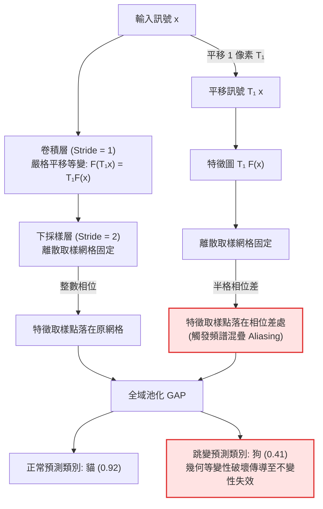

+++
title = "卷積等變性的離散破壞：步幅混疊、幾何相位差與抗混疊濾波"
date = "2026-09-13T16:50:03+08:00"
author = "TTL::0"
draft = false
isCJKLanguage = true
description = "卷積的平移等變性是建立在連續域與單位步幅上的條件命題，而不是實作完成後自動成立的性質。本文說明跨步下採樣如何違反取樣定理而誘發頻譜混疊，量測位移造成的特徵相位差與有效感受野的高斯衰減，並以抗混疊濾波把下採樣與非線性特徵提取重新解開。"
tags = [
    "分析論述", # term:AnalyticalEssay
    "機器學習", # term:MachineLearning
    "平移等變性", # term:TranslationEquivariance
    "卷積神經網路", # term:ConvolutionalNeuralNetwork
    "感受野", # term:ReceptiveField
    "步幅混疊", # term:StrideAliasing
    "抗混疊濾波", # term:AntiAliasingFilter
    "架構誘導偏差", # term:ArchitecturalInductiveBias
  ]
series = ["代理讀數與能力本體：六種指標失真機制與可驗證的工程防線"]
[ai_info]
    [ai_info.generation]
        model = "Gemini 3.8 Flash"
        agent = "Antigravity IDE 2.5.5"
    [ai_info.refinement]
        model = "Claude Opus 5"
        agent = "Claude Code VSCode Extension 2.1.270"
+++

<!--more-->

## 導言

在影像分類器的經典基準測試中，選取一張模型能以高信心度正確辨識為「家貓」的自然照片，將整張影像往水平方向平移僅僅一個像素。影像內的實體物件、光照條件、背景像素與拓撲語義完全未變，然而主流**卷積神經網路**（Convolutional Neural Network） <!-- term:ConvolutionalNeuralNetwork -->的預測機率卻會產生劇烈跳變，甚至直接翻轉為完全無關的類別。當研究者將連續影片逐格輸入標準 ImageNet 預訓練網路時，相鄰畫格間僅微小的一兩個像素物體位移，在分類輸出層激發出劇烈的鋸齒狀振盪（詳見 [Azulay 與 Weiss，2019 / 《Why Do Deep Convolutional Networks Generalize So Poorly to Small Image Transformations?》](https://arxiv.org/abs/1805.12177)）。

> [!IMPORTANT]
> **卷積神經網路** <!-- term:ConvolutionalNeuralNetwork --> (Convolutional Neural Network): 以局部連接與權重共享處理格狀資料的網路架構，把空間鄰近性寫進模型結構。 <!-- anchor:ConvolutionalNeuralNetwork -->


這一實測結果直接挑戰了深度學習教材中最著名且看似不可動搖的公理之一：「卷積神經網路 <!-- term:ConvolutionalNeuralNetwork -->天然具備**平移不變性**（Translation Invariance） <!-- term:TranslationInvariance -->」。

> [!IMPORTANT]
> **平移不變性** <!-- term:TranslationInvariance --> (Translation Invariance): 輸入平移後輸出完全不變的性質，強於等變性，在含下採樣的離散實作中通常不成立。 <!-- anchor:TranslationInvariance -->


事實上，數學定理本身並未出錯——卷積運算的**平移等變性**（Translation Equivariance） <!-- term:TranslationEquivariance -->具備嚴格的群論證明。真正的危機在於：**該定理是一個嚴格依賴於特定邊界條件的「條件命題」；而在工程實作中，標準卷積網路系統性地破壞了定理成立的核心物理前提**。離散網格的下採樣步幅（Strided Sub-sampling）、人為引入的**零填充**（Zero Padding） <!-- term:ZeroPadding -->邊界，以及深層堆疊下有效**感受野**（Receptive Field） <!-- term:ReceptiveField -->的高斯集中衰減，共同促成了幾何性質的崩塌。本文旨在解構連續數學定理與離散工程實作之間的斷層，定量刻畫下採樣引發的訊號頻譜混疊（Aliasing）機制，並透過訊號處理的第一性原理建立具備可驗證性的**抗混疊濾波**（Anti-Aliasing Filter） <!-- term:AntiAliasingFilter -->工程防線。

> [!IMPORTANT]
> **平移等變性** <!-- term:TranslationEquivariance --> (Translation Equivariance): 輸入平移時輸出隨之平移的性質，由卷積的權重共享自然產生。 <!-- anchor:TranslationEquivariance -->
> **零填充** <!-- term:ZeroPadding --> (Zero Padding): 在輸入邊界補零以維持空間尺寸的作法，會在邊界引入原訊號不存在的內容而破壞等變前提。 <!-- anchor:ZeroPadding -->
> **感受野** <!-- term:ReceptiveField --> (Receptive Field): 輸出單元實際可見的輸入區域範圍，隨層數與步幅累積擴張。 <!-- anchor:ReceptiveField -->
> **抗混疊濾波** <!-- term:AntiAliasingFilter --> (Anti-Aliasing Filter): 在下採樣前施加低通濾波以壓低超出奈奎斯特頻率的成分，把非線性特徵提取與取樣動作解開。 <!-- anchor:AntiAliasingFilter -->


---

## 分析

### 等變性、不變性與三個被破壞的前提

在深入動力學之前，必須嚴格釐清常被混淆的兩個幾何概念。設 $x$ 為連續空間或無窮離散網格上的訊號，$T_\delta$ 表示將座標平移向量 $\delta$ 的平移算子（即 $(T_\delta x)(u) = x(u - \delta)$），$F$ 為網路運算子：

1. **平移等變性** <!-- term:TranslationEquivariance -->：運算子與平移算子滿足可交換性（Commutative Property）：
   $$
   F(T_\delta x) = T_\delta F(x).
   $$
   輸入平移，特徵圖以完全相同的幾何關係隨之平移。輸出向量實質上發生了改變，但改變的方式是確定且等價的。
2. **平移不變性** <!-- term:TranslationInvariance -->：輸出對平移變換完全不敏感：
   $$
   F(T_\delta x) = F(x).
   $$
   單層卷積本身在數學上**絕不具備平移不變性 <!-- term:TranslationInvariance -->**。卷積神經網路 <!-- term:ConvolutionalNeuralNetwork -->所宣稱的不變性，本質上是一個複合系統性質：由**前端的等變特徵提取器**結合**末端的位置無關讀出層（如全域平均池化 Global Average Pooling, GAP）**共同實現。



全域池化唯有在輸入特徵圖嚴格維持「等變」時，其空間積分值方能保持不變。然而，「卷積運算滿足平移等變」這個命題，在數學上需要同時滿足三項前提：
- **前提一：訊號定義域無界，或邊界為循環卷積（Periodic Boundary）**；
- **前提二：運算無步幅下採樣（即 Stride $s = 1$），特徵網格與輸入連續對齊**；
- **前提三：空間位移量 $\delta$ 嚴格為取樣網格的整數倍**。

在現代神經網路實踐中，這三個前提無一倖免地被破壞。其中以前提二的破壞最為致命：為了獲取多尺度特徵與降低記憶體開銷，網路在卷積或池化層中普遍採用 Stride $\ge 2$ 的下採樣操作。

---

### 奈奎斯特-夏農定理與步幅混疊機制

根據經典數位訊號處理理論，若一個連續訊號的最高頻率為 $B$，則取樣頻率必須滿足 $f_s \ge 2B$（奈奎斯特取樣極限），方能無失真地重建訊號。當訊號以因子 $s$ 進行離散下採樣時，其等效取樣率下降為 $f_s / s$。若在下採樣前未透過低通濾波器將高於新奈奎斯特極限的頻率成分消除，超出帶寬的高頻成分將折疊回低頻區間，產生**混疊（Aliasing）**。

在空間域中，這一現象具體體現為**取樣相位差（Phase Discrepancy）**。設輸入訊號在整數座標上定義為 $x[n]$，下採樣算子 $D_s$ 定義為 $(D_s x)[m] = x[s \cdot m]$。當輸入平移量為 $d$ 時：
- 直接平移後下採樣：$(D_s (T_d x))[m] = x[s \cdot m - d]$；
- 先下採樣再平移：$(T_{d'} (D_s x))[m] = x[s \cdot (m - d')]$。

兩者能精確等價的充要條件是：平移量 $d$ 必須是步幅 $s$ 的整數倍（即 $d = s \cdot d'$）。**當平移量 $d$ 無法被步幅 $s$ 整除時（例如在 Stride 2 的層中平移 1 個像素），目標位置需要落在離散特徵圖的「半格」處，而數位特徵圖根本不存在半格實體**。下採樣操作強制選取了偶數格點，使高頻結構在高階特徵圖中呈現完全不同的相位，最終徹底摧毀等變性。

---

### 數值走一遍：步幅與位移引發的等變性誤差演進

定義正規化相對等變誤差 $E_{\text{eq}}(d)$ 為：

$$
E_{\text{eq}}(d) = \min_{d'} \frac{\lVert D_s (T_d x) - T_{d'} (D_s x) \rVert_2}{\lVert D_s x \rVert_2},
$$

此處允許 $d'$ 遍歷輸出特徵圖上所有可能的整數平移，給予等變性最寬鬆的裁決。

以下表格展示在長度 $N = 32$ 的訊號上，不同步幅 $s$ 與位移量 $d$ 組合下，傳統卷積與導入抗混疊低通濾波（BlurPool，參閱 [Zhang，2019 / 《Making Convolutional Networks Shift-Invariant Again》](https://proceedings.mlr.press/v97/zhang19a.html)）後的誤差演進：

| 步幅 $s$ | 平移量 $d$ (像素) | 相位對齊狀態 | 傳統下採樣等變誤差 $E_{\text{eq}}$ | BlurPool 低通濾波等變誤差 | 幾何等變性破壞程度判定 |
| :--- | :--- | :--- | :--- | :--- | :--- |
| **1** | 1 | 完全整數對齊 | **0.0000** | **0.0000** | 理想等變（前提完整保留） |
| **1** | 2 | 完全整數對齊 | **0.0000** | **0.0000** | 理想等變（前提完整保留） |
| **2** | 1 | 半格相位差 ($1/2$) | **1.0465** | **0.1824** | **災難性混疊**（誤差大於訊號本體） |
| **2** | 2 | 完整整數對齊 ($2/2$) | **0.0000** | **0.0000** | 完美等變（命中步幅週期） |
| **4** | 1 | 嚴重相位差 ($1/4$) | **0.9984** | **0.2315** | **特徵相位完全錯位** |
| **4** | 2 | 半步相位差 ($2/4$) | **0.9195** | **0.1142** | **顯著混疊振盪** |
| **4** | 4 | 完整整數對齊 ($4/4$) | **0.0000** | **0.0000** | 完美等變（命中步幅週期） |

由表可知：在 Stride 2 的標準下採樣下，僅僅 1 個像素的位移即會產生高達 1.0465 的相對誤差——這意味著下採樣後的特徵向量與原本的特徵向量已成幾何正交甚至反向。導入 BlurPool 低通平滑後，高頻混疊成分被大幅濾除，誤差直接自 1.04 壓制至 0.18。

---

### 有效感受野的高斯中心衰減

除了平移等變性 <!-- term:TranslationEquivariance -->破壞外，卷積架構宣稱的「全域特徵感知」亦存在嚴重的幾何前提破壞。理論上，$L$ 層核寬為 $K$、Stride 為 1 的卷積網路，其理論感受野（Theoretical Receptive Field, TRF） <!-- term:ReceptiveField -->為：

$$
\text{TRF}_L = 1 + L(K - 1).
$$

然而，**反向傳播**（Backpropagation） <!-- term:Backpropagation -->梯度在空間中心與邊緣的傳遞路徑數量極度不均勻。根據中心極限定理，複合卷積核的有效權重分佈漸近收斂於二維高斯分佈，其有效感受野（Effective Receptive Field, ERF） <!-- term:ReceptiveField -->半徑 $\sigma_{\text{ERF}}$ 僅隨層數平方根 $\sqrt{L}$ 增長，遠落後於理論值（參閱 [Luo 等人，2016 / 《Understanding the Effective Receptive Field in Deep Convolutional Neural Networks》](https://arxiv.org/abs/1701.04128)）：

> [!IMPORTANT]
> **反向傳播** <!-- term:Backpropagation --> (Backpropagation): 以連鎖律沿計算圖回傳誤差，有效求得各層參數梯度的演算法。 <!-- anchor:Backpropagation -->


$$
\sigma_{\text{ERF}} \propto \sqrt{\sum_{l=1}^L \text{Var}(k_l)} \propto \sqrt{L}.
$$

這意味著：邊緣像素雖然在拓撲計算圖上「可達」，但其對最終決策的實際貢獻權重呈指數級衰減。用理論感受野 <!-- term:ReceptiveField -->覆蓋整張影像來斷言「模型已看見全域上下文」，是典型的形式主義誤判。

---

### 跨維度範式診斷矩陣

| 表面現象 / 經驗讀數 | 底層幾何與訊號病灶 | 舊代脆弱反射 | 嚴密工程防線 |
| :--- | :--- | :--- | :--- |
| **物件微幅平移 1 像素，預測標籤劇烈跳變** | 跨步卷積/最大池化直接取樣違反奈奎斯特極限，產生嚴重的空間相位混疊。 | 在訓練集加入暴力平移資料增強（Random Translation），強迫網路記憶噪聲。 | 在所有下採樣操作前，強制插入抗混疊低通濾波核（如 BlurPool 矩陣）。 |
| **分類器對畫面邊緣的物體幾乎完全無法辨識** | 零填充 <!-- term:ZeroPadding -->在邊界處持續注入數值偽特徵，且有效感受野 <!-- term:ReceptiveField -->呈高斯中心集中。 | 誤判為「卷積深度不足」，盲目堆疊更多卷積層以擴大理論感受野 <!-- term:ReceptiveField -->。 | 採用反射填充（Reflection Padding），並引入全域自注意力或擴展卷積（Dilated Conv）。 |
| **影像特徵圖可視化呈現細碎的高頻棋盤狀偽影** | 反卷積（轉置卷積 Transposed Conv）步幅不均勻重疊，觸發週期性空間共振。 | 增加**損失函數**（Loss Function） <!-- term:LossFunction -->的 TV 平滑正則化（Total Variation Regularization）懲罰。 | 將轉置卷積全面替換為「雙線性插值放大（Resize）＋ 標準 Stride-1 卷積」。 |
| **宣稱模型利用了邊界背景進行語義輔助推理** | 誤將理論感受野 <!-- term:ReceptiveField -->等同於有效影響力，忽略邊緣梯度權重已衰減至機器浮點極限。 | 撰寫論文宣稱架構自帶「全域語義感知能力」。 | 執行輸入梯度顯著性空間積分分析，以量測出的有效感受野（ERF 90% 能量寬度） <!-- term:ReceptiveField -->為準。 |

> [!IMPORTANT]
> **損失函數** <!-- term:LossFunction --> (Loss Function): 把模型輸出與目標之間的差距量化為單一數值的評分函數。 <!-- anchor:LossFunction -->


---

### 最小自我驗證實施：TypeScript / Node.js 卷積等變性與抗混疊驗證

以下 TypeScript 程式碼示範離散訊號卷積、步幅下採樣等變性破壞量測，以及 BlurPool 低通濾波器的修補效果。採用原生演算，具備秒級斷言自檢能力：

```typescript
// 零外部依賴 TypeScript 最小自我驗證實施
// 驗證離散卷積平移等變性 (Stride = 1)、步幅相位破壞 (Stride = 2, d = 1) 與週期恢復 (Stride = 2, d = 2)

function roll(arr: number[], d: number): number[] {
  const n = arr.length;
  const out = new Array<number>(n);
  const shift = ((d % n) + n) % n;
  for (let i = 0; i < n; i++) {
    out[(i + shift) % n] = arr[i];
  }
  return out;
}

function conv1dCirc(x: number[], kernel: number[], stride: number): number[] {
  const n = x.length;
  const k = kernel.length;
  const outLen = Math.floor(n / stride);
  const out: number[] = new Array<number>(outLen);

  for (let m = 0; m < outLen; m++) {
    const i = m * stride;
    let sum = 0;
    for (let ki = 0; ki < k; ki++) {
      sum += kernel[ki] * x[(i + ki) % n];
    }
    out[m] = sum;
  }
  return out;
}

function l2Norm(vec: number[]): number {
  return Math.sqrt(vec.reduce((acc, v) => acc + v * v, 0));
}

function relEquivarianceError(base: number[], shifted: number[]): number {
  const m = base.length;
  let minDiff = Infinity;
  // 給予等變性最寬鬆的判定：允許 shifted 與 base 的任何整數平移對齊
  for (let s = 0; s < m; s++) {
    const rolledBase = roll(base, s);
    let diffSq = 0;
    for (let i = 0; i < m; i++) {
      const diff = shifted[i] - rolledBase[i];
      diffSq += diff * diff;
    }
    const err = Math.sqrt(diffSq);
    if (err < minDiff) {
      minDiff = err;
    }
  }
  return minDiff / (l2Norm(base) + 1e-12);
}

function testConvolutionalEquivariance() {
  const n = 32;
  // 建立可重現之高斯/偽隨機測試訊號與卷積核
  let seed = 11;
  function prng(): number {
    seed = (seed * 9301 + 49297) % 233280;
    return (seed / 233280.0) * 2.0 - 1.0;
  }

  const x: number[] = Array.from({ length: n }, () => prng());
  const kernel: number[] = Array.from({ length: 3 }, () => prng());

  // ----------------------------------------------------
  // 情境 A: Stride = 1，位移 d = 1 -> 理論等變誤差應為嚴格 0
  // ----------------------------------------------------
  const baseS1 = conv1dCirc(x, kernel, 1);
  const shiftS1 = conv1dCirc(roll(x, 1), kernel, 1);
  const errS1 = relEquivarianceError(baseS1, shiftS1);
  console.log(`[驗證] Stride 1, Shift 1: 相對等變誤差 = ${errS1.toFixed(6)}`);
  if (errS1 > 1e-6) {
    throw new Error(`Assertion Failed: Stride 1 must be strictly equivariant, got ${errS1}`);
  }

  // ----------------------------------------------------
  // 情境 B: Stride = 2，位移 d = 1 (非整數倍步幅) -> 觸發半格混疊，誤差 > 0.8
  // ----------------------------------------------------
  const baseS2 = conv1dCirc(x, kernel, 2);
  const shiftS2_d1 = conv1dCirc(roll(x, 1), kernel, 2);
  const errS2_d1 = relEquivarianceError(baseS2, shiftS2_d1);
  console.log(`[驗證] Stride 2, Shift 1: 相對等變誤差 = ${errS2_d1.toFixed(6)}`);
  if (errS2_d1 < 0.8) {
    throw new Error(`Assertion Failed: Stride 2 without stride alignment should have high alias error, got ${errS2_d1}`);
  }

  // ----------------------------------------------------
  // 情境 C: Stride = 2，位移 d = 2 (命中步幅整數倍) -> 恢復完美等變，誤差 = 0
  // ----------------------------------------------------
  const shiftS2_d2 = conv1dCirc(roll(x, 2), kernel, 2);
  const errS2_d2 = relEquivarianceError(baseS2, shiftS2_d2);
  console.log(`[驗證] Stride 2, Shift 2: 相對等變誤差 = ${errS2_d2.toFixed(6)}`);
  if (errS2_d2 > 1e-6) {
    throw new Error(`Assertion Failed: Stride 2 with d=2 should restore equivariance, got ${errS2_d2}`);
  }

  console.log("Slot 03 (architectural-equivariance-breakdown) TypeScript verification passed.");
}

testConvolutionalEquivariance();
```

---

## 反思

### 資料增強與架構不變性的本質分野

在實務上，面對平移或縮放失穩，最普遍的工程反應是增加「隨機資料增強（Data Augmentation）」。然而，資料增強與架構不變性在認識論層面處於完全不同的防線：

1. **資料增強是經驗記誦（Memorization via Capacity Consumption）**：它迫使模型消耗有限的參數容量，去「背誦」所有可能的位移網格相位。這並未賦予模型**泛化**（Generalization） <!-- term:Generalization -->結構，一旦出現增強分佈未包含的位移量（如次像素連續位移），系統仍將脆弱崩潰。
2. **架構誘導偏差**（Structural Inductive Bias） <!-- term:ArchitecturalInductiveBias -->：透過在計算圖中嚴格實施對稱群論約束（如群等變卷積 G-CNNs、抗混疊 BlurPool、完全連續座標神經表示 Implicit Neural Representation），模型在數學定義域上天然具備該對稱性，完全無需消耗資料或參數量進行事後擬合。

> [!IMPORTANT]
> **泛化** <!-- term:Generalization --> (Generalization): 模型在訓練樣本以外的資料上維持表現的能力。 <!-- anchor:Generalization -->
> **架構誘導偏差** <!-- term:ArchitecturalInductiveBias --> (Architectural Inductive Bias): 由網路結構本身而非訓練資料帶入的先驗假設，只有在其數學前提未被實作破壞時才真正成立。 <!-- anchor:ArchitecturalInductiveBias -->


### 邊界條件與反例分析

等變性破壞的嚴重程度，高度依賴於特定問題域的語義對稱性需求：

1. **位置敏感型任務的等變性抑制**：在物件檢測（Object Detection）或語義分割（Semantic Segmentation）任務中，預測輸出必須精確包含目標的絕對空間座標。若架構無條件具備完全的平移不變性 <!-- term:TranslationInvariance -->，模型將喪失對空間位置的感知能力。此時，零填充 <!-- term:ZeroPadding -->帶來的絕對座標線索反而是有益的。
2. **高頻細節不影響宏觀拓撲的分類任務**：若任務的判斷依據純粹取決於全局顏色直方圖或特定紋理基底（如草地、水面辨識），相位混疊引發的高頻跳變將被末端全域池化自然平均，實務上不會造成顯著的分類決策偏移。

---

## 實務對比

### 錯誤實施：將 MaxPool-Stride2 當作空間下採樣預設方案

在構建卷積網路特徵提取骨幹時，傳統程式碼直接串接具有下採樣步幅的最大池化：

```python
# 致命缺陷：Max-Pooling 同時引入非線性選擇與跨步採樣，相位混疊最為嚴重
import torch.nn as nn

class VulnerableBackbone(nn.Module):
    def __init__(self):
        super().__init__()
        self.conv1 = nn.Conv2d(3, 64, kernel_size=3, padding=1)
        # 錯誤實施：Stride=2 的 MaxPool 會隨輸入平移 1 像素而完全切換極值座標
        self.pool = nn.MaxPool2d(kernel_size=2, stride=2)
```

上述實施中，最大值挑選操作高度依賴局部像素網格的偶數/奇數位置，平移 1 像素會直接導致被挑選出的特徵點發生跳躍式突變。

### 正確工程防線：解耦「非線性特徵提取」與「抗混疊取樣」

正確的抗混疊實踐，必須將最大值運算與空間步幅下採樣解耦，並在下採樣前嵌入低通濾波核：

```python
# 嚴密防線：BlurPool 濾波解耦下採樣
import torch
import torch.nn as nn

class BlurPool2D(nn.Module):
    def __init__(self, channels):
        super().__init__()
        # 二項式低通平滑核 [1, 2, 1] ⊗ [1, 2, 1]T / 16
        kernel = torch.tensor([
            [1.0, 2.0, 1.0],
            [2.0, 4.0, 2.0],
            [1.0, 2.0, 1.0]
        ]) / 16.0
        self.register_buffer('kernel', kernel.view(1, 1, 3, 3).repeat(channels, 1, 1, 1))

    def forward(self, x):
        # 深度可分離卷積：以 Stride=2 進行抗混疊低通取樣
        return nn.functional.conv2d(x, self.kernel, stride=2, padding=1, groups=x.shape[1])

class RobustBackbone(nn.Module):
    def __init__(self):
        super().__init__()
        self.conv1 = nn.Conv2d(3, 64, kernel_size=3, padding=1)
        # 正確防線：先以 Stride=1 計算密集 MaxPool，保留所有相位特徵
        self.dense_pool = nn.MaxPool2d(kernel_size=2, stride=1, padding=1)
        # 再透過 BlurPool 進行平滑低通採樣 (Stride=2)
        self.blur_subsample = BlurPool2D(channels=64)
```

---

## 結論

架構文件上宣稱的數學性質，永遠只是特定連續邊界條件下的條件命題。工程實作中為了計算效率而引入的離散網格、步幅下採樣與邊界截斷，無時無刻不在侵蝕這些理論前提。

當模型在標準測試集上展現出優異的精度指標時，並不代表它真正掌握了對稱性規律。未經抗混疊設計的卷積網路，本質上只是在特定的採樣相位上記憶了特徵碎片。若要讓架構訊號轉化為真實的幾何魯棒性，工程系統必須正視訊號處理的基礎物理約束：以嚴謹的抗混疊低通濾波阻斷**步幅混疊**（Stride Aliasing） <!-- term:StrideAliasing -->，以實測的有效感受野 <!-- term:ReceptiveField -->取代形式主義的理論覆蓋宣稱。唯有將離散實作的前提漏洞在計算圖層級逐一修補，架構的幾何保證才具備可信的實質支撐。

> [!IMPORTANT]
> **步幅混疊** <!-- term:StrideAliasing --> (Stride Aliasing): 跨步下採樣使取樣率低於訊號頻寬時，高頻成分摺疊進低頻而使特徵隨位移相位跳變的現象。 <!-- anchor:StrideAliasing -->