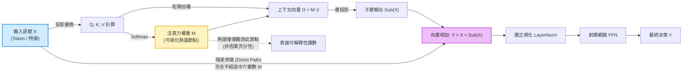

+++
title = "表徵探測與因果決策的分離：中介變數誤認、殘差旁路與介入檢驗"
date = "2026-09-13T16:50:04+08:00"
author = "梅乾"
draft = false
isCJKLanguage = true
description = "探針能從隱藏狀態讀出輸入資訊、熱圖在關鍵區域亮起，都不足以證明該資訊承載了決策。本文以結構因果模型區分關聯觀測與因果中介，說明殘差旁路如何讓決策訊號完全繞過注意力權重，並以反事實介入與激活補丁確立可被推翻的因果歸因判準。"
tags = [
    "分析論述", # term:AnalyticalEssay
    "機器學習", # term:MachineLearning
    "中介變數", # term:MediatingVariable
    "中介誤認", # term:MediatorMisreading
    "表徵探測", # term:RepresentationProbing
    "殘差旁路", # term:ResidualBypass
    "反事實介入", # term:CounterfactualIntervention
    "信用分配", # term:CreditAssignment
  ]
series = ["代理讀數與能力本體：六種指標失真機制與可驗證的工程防線"]
[ai_info]
    [ai_info.generation]
        model = "Gemini 3.8 Flash"
        agent = "Antigravity IDE 2.5.5"
    [ai_info.refinement]
        model = "Claude Opus 5"
        agent = "Claude Code VSCode Extension 2.1.270"
+++

<!--more-->

## 導言

2018 年，一組**機器學習**（Machine Learning） <!-- term:MachineLearning -->研究團隊對電腦視覺領域廣泛使用的顯著圖（Saliency Maps）與特徵歸因熱圖提出了一項直觀而嚴酷的根本性質檢驗：他們拿一個在 ImageNet 上完全收斂的預訓練分類器，開始自輸出層向前逐層隨機化模型權重——將高階卷積核與全連接層替換為純常態高斯噪聲，直至整個網路架構徹底喪失任何分類決策能力。在每隨機化一層後，團隊便重新繪製一次顯著熱圖。

> [!IMPORTANT]
> **機器學習** <!-- term:MachineLearning --> (Machine Learning): 先界定可選函數的範圍，再以資料估計其中參數的建模方法。 <!-- anchor:MachineLearning -->


若這些被廣泛引用的熱圖確實承載了模型的決策歸因，那麼當被解釋的決策主體遭到物理摧毀時，熱圖理應隨之瓦解為無意義的噪聲。

然而，令人震驚的實測結果顯示：多種被廣泛採信的顯著圖算法（如 Guided Backprop、Integrated Gradients 等），在權重完全隨機化為噪聲後，其產生的熱圖在視覺上依然精準地勾勒出目標物體的輪廓邊緣（詳見 [Adebayo 等人，2018 / 《Sanity Checks for Saliency Maps》](https://arxiv.org/abs/1810.03292)）。這些算法在數學上高度退化為輸入圖像本身的邊緣偵測濾波器，其呈現的圖像高度迎合了人類工程師的先驗視覺偏好，卻與模型內部的真實因果決策過程毫無關聯。

幾乎在同一時期，自然語言處理領域亦爆發了關於「注意力熱圖是否代表模型推理理由」的深層論戰。實證研究表明，透過微小擾動，完全可以構造出一組注意力權重完全相反、但最終模型預測保持不變的注意力分佈（參閱 [Jain 與 Wallace，2019 / 《Attention is not Explanation》](https://arxiv.org/abs/1902.10186)）。而在遞迴與深層網路的記憶機制中，研究者早已證實：即便透過**線性探針**（Linear Probe） <!-- term:LinearProbe -->能從末端隱藏狀態以極高精度解碼出早期輸入資訊，**反向傳播**（Backpropagation） <!-- term:Backpropagation -->的梯度訊號依然可能因**梯度消失**（Vanishing Gradient） <!-- term:VanishingGradient -->或截斷（Truncated BPTT）而衰減為零，使早期參數無法獲得任何有效的**信用分配**（參閱 [Jozefowicz 等人，2015 / 《An Empirical Exploration of Recurrent Network Architectures》](https://proceedings.mlr.press/v37/jozefowicz15.html)） <!-- term:CreditAssignment -->。

> [!IMPORTANT]
> **線性探針** <!-- term:LinearProbe --> (Linear Probe): 在凍結的表徵上訓練線性分類器，用以量測該層是否線性可讀出目標屬性的診斷工具。 <!-- anchor:LinearProbe -->
> **反向傳播** <!-- term:Backpropagation --> (Backpropagation): 以連鎖律沿計算圖回傳誤差，有效求得各層參數梯度的演算法。 <!-- anchor:Backpropagation -->
> **梯度消失** <!-- term:VanishingGradient --> (Vanishing Gradient): 梯度沿深度或時間反向傳播時逐層衰減，使早期參數幾乎收不到更新訊號的現象。 <!-- anchor:VanishingGradient -->
> **信用分配** <!-- term:CreditAssignment --> (Credit Assignment): 判定某個結果應歸因於哪些參數或決策步驟的問題。 <!-- anchor:CreditAssignment -->


這一連串事故揭示了現代深度模型解釋中的核心本體論危機：**「資訊在內部表徵中存在」或「中間變數亮起高權重」，在統計學上僅證明了相關性，絕不等於因果決策的充分依據**。本文旨在透過結構因果模型（Structural Causal Models, SCM）與中介分析（Mediation Analysis），解構**表徵探測**（Representation Probing） <!-- term:RepresentationProbing -->與因果歸因之間的斷裂機制，剖析**殘差旁路**（Residual Bypass） <!-- term:ResidualBypass -->對注意力路由的幾何遮蔽，並確立嚴格的**反事實介入**（Counterfactual Intervention） <!-- term:CounterfactualIntervention -->驗證規範。

> [!IMPORTANT]
> **表徵探測** <!-- term:RepresentationProbing --> (Representation Probing): 以輔助分類器從中間表徵讀取特定屬性的分析手法，只能證明資訊存在，不能證明該資訊參與決策。 <!-- anchor:RepresentationProbing -->
> **殘差旁路** <!-- term:ResidualBypass --> (Residual Bypass): 殘差連接提供的直通路徑，使決策訊號可以繞過注意力或特定子模組，讓該模組的讀數失去因果代表性。 <!-- anchor:ResidualBypass -->
> **反事實介入** <!-- term:CounterfactualIntervention --> (Counterfactual Intervention): 主動改寫模型內部狀態並觀察輸出變化的檢驗方式，是把關聯觀測升格為因果宣稱的唯一途徑。 <!-- anchor:CounterfactualIntervention -->


---

## 分析

### 結構因果模型與中介變數的認知陷阱

在因果推論體系中，觀測性讀數（Observational Readout）與介入性結果（Interventional Outcome）處於不同的認識論層級。將 Transformer 或深層網路的單元模組抽象為一個結構因果圖：輸入為 $X$，中間特徵或注意力分佈為 $M$，即**中介變數**（Mediating Variable） <!-- term:MediatingVariable -->，最終模型預測為 $Y$。

> [!IMPORTANT]
> **中介變數** <!-- term:MediatingVariable --> (Mediating Variable): 位於原因與結果之間、承載並使該段因果得以被觀察的可測量變數。 <!-- anchor:MediatingVariable -->


在標準架構中，資訊流由兩條主要路徑構成：
1. **間接路徑（Indirect Path）**：$X \to M \to Y$，輸入經過注意力加權或特徵變換投影為上下文向量；
2. **直接路徑（Direct Path / Residual Bypass）**：$X \to Y$，輸入透過殘差連接（$y = x + \text{SubLayer}(x)$）或直通前向分支，完全繞過中介變數 <!-- term:MediatingVariable --> $M$。



根據因果中介分析的奠基理論（參閱 [Pearl，2001 / 《Direct and Indirect Effects》](https://doi.org/10.5555/2074022.2074073)），一個中介變數 <!-- term:MediatingVariable --> $M$ 對結果 $Y$ 的真實因果貢獻，必須透過**自然直接效應（Natural Direct Effect, NDE）**與**自然間接效應（Natural Indirect Effect, NIE）**進行定量拆解。給定基準輸入 $x^*$ 與**反事實**（Counterfactual） <!-- term:Counterfactual -->輸入 $x$：

> [!IMPORTANT]
> **反事實** <!-- term:Counterfactual --> (Counterfactual): 在未實際發生的處置下本應出現的結果，是因果宣稱的基準，也是觀測資料中永遠缺失的那一半。 <!-- anchor:Counterfactual -->


$$
\text{TE}(x, x^*) = Y(x) - Y(x^*) = \underbrace{\big[Y(x, M(x^*)) - Y(x^*, M(x^*))\big]}_{\text{NDE}} + \underbrace{\big[Y(x, M(x)) - Y(x, M(x^*))\big]}_{\text{NIE}}.
$$

在此架構下，**中介誤認**（Mediator Misreading） <!-- term:MediatorMisreading -->的本質在於：工程師觀察到了高強度的條件概率相關性 $P(Y \mid M)$ 或顯著的注意力權重數值 $M_{ij} \approx 1$，便錯誤斷言 $M$ 是 $Y$ 的主導成因。

> [!IMPORTANT]
> **中介誤認** <!-- term:MediatorMisreading --> (Mediator Misreading): 把因果鏈上可觀察的中介變數當成成因本身，因而以觀察性讀數回答只有干預才能回答的問題。 <!-- anchor:MediatorMisreading -->


然而，當殘差旁路 <!-- term:ResidualBypass -->的能量佔比顯著大於子層輸出時（即 $\lVert X \rVert \gg \lVert \text{SubLayer}(X) \rVert$），決策資訊幾乎完全沿著直接路徑（殘差旁路 <!-- term:ResidualBypass -->）傳播。此時，無論人為如何劇烈擾動注意力矩陣 $M$，輸出 $Y$ 的預測幾何幾乎紋絲不動（$\text{NIE} \approx 0$）。

---

### 表徵探測的虛假繁榮：前向記憶與反向信用的幾何懸崖

另一種極度普遍的表徵自欺發生在「探針分析（Probing Analysis）」中。在深層語言模型或遞迴網路（RNN/LSTM）中，研究者常在隱藏層 $h_t$ 後面接入一個小型線性分類器，訓練其預測某個底層語法屬性或早期詞元 $x_k$。當探針分類準確率達到 95% 以上時，常被作為「模型成功學會了長程語法依賴」的能力憑證。

這是一個嚴重的因果偽證。透過雅可比鏈式法則展開反向傳播 <!-- term:Backpropagation -->的梯度傳遞路徑：

$$
\frac{\partial \mathcal{L}_T}{\partial h_k} = \frac{\partial \mathcal{L}_T}{\partial h_T} \prod_{t=k+1}^T \frac{\partial h_t}{\partial h_{t-1}} = \frac{\partial \mathcal{L}_T}{\partial h_T} \prod_{t=k+1}^T J_t.
$$

前向資訊的存在僅意味著映射函數 $h_T = \mathcal{F}(x_k, \dots)$ 保留了輸入訊號的**互資訊**（Mutual Information） <!-- term:MutualInformation --> $I(h_T; x_k) > 0$（哪怕只是線性可分的高維投影殘留）。

> [!IMPORTANT]
> **互資訊** <!-- term:MutualInformation --> (Mutual Information): 兩個隨機變數之間共享的資訊量，用來量化潛在變數是否攜帶輸入資訊。 <!-- anchor:MutualInformation -->


然而，反向信用分配 <!-- term:CreditAssignment -->取決於雅可比連乘矩陣的奇異值譜半徑。若狀態轉移矩陣的譜半徑小於 1，連乘範數以指數速率 $\mathcal{O}(\rho^{T-k})$ 衰減至機器浮點下溢；而在工程截斷反向傳播（Truncated BPTT，窗口為 $W$） <!-- term:Backpropagation -->下，當 $T - k > W$ 時，梯度路徑被強制截斷為嚴格的零：

$$
\left.\frac{\partial \mathcal{L}_T}{\partial h_k}\right|_{\text{TBPTT}} = 0.
$$

**此時的物理狀態是：資訊以 90% 以上的能量存在於前向狀態中，但末端任務的損失訊號對該資訊所在的轉移參數之梯度反饋為精確的零**。該模型在先驗結構上「記住」了資料，但在功能上「完全學不會」調整它。

---

### 決策走一遍：表徵探測、熱圖讀數與反事實介入判定

以下決策表格展示了在不同架構節點下，單純的觀測性指標與介入性因果測試之間的判定路徑演進：

| 探針準確率 (Probing Acc) | 注意力最大權重 (Max Attn) | 殘差旁路 <!-- term:ResidualBypass -->能量比 $\lVert X \rVert / \lVert O \rVert$ | 反事實介入 <!-- term:CounterfactualIntervention -->輸出漂移 $\Delta Y_{\text{do}(M)}$ | 梯度反向傳播 <!-- term:Backpropagation -->範數 $\lVert \nabla_{W_k} \mathcal{L} \rVert$ | 最終因果信用與決策歸因判定 |
| :--- | :--- | :--- | :--- | :--- | :--- |
| **0.98** (極高) | 0.85 (高度聚焦) | **0.1** (旁路微弱) | **0.78** (輸出劇烈翻轉) | $1.2 \times 10^{-2}$ | **真正因果中介**（注意力承載了核心決策流） |
| **0.95** (極高) | 0.92 (高度聚焦) | **8.5** (旁路主導) | **0.01** (輸出完全不變) | $3.5 \times 10^{-3}$ | **中介誤認 <!-- term:MediatorMisreading --> / 旁路遮蔽**（熱圖僅為裝飾性投影） |
| **0.99** (極高) | 0.05 (極度分散) | 1.0 (平衡) | **0.02** (輸出不受單點影響) | 0.0 (超出截斷窗口) | **表徵前向殘留但反向失聯**（記憶存在但無法學習） |
| **0.52** (隨機) | 0.75 (高度聚焦) | 2.0 (正常) | **0.00** (輸出無改變) | $4.1 \times 10^{-4}$ | **偽顯著熱圖**（邊緣偵測偽影，Adebayo 事故復現） |
| **0.91** (高) | 0.40 (均勻混合) | 0.5 (子層主導) | **0.65** (分散介入改變決策) | $8.7 \times 10^{-3}$ | **分散式因果表徵**（無單一熱點，全域協同決策） |

---

### 跨維度範式診斷矩陣

| 表面現象 / 觀測熱圖 | 底層因果與拓撲病灶 | 舊代脆弱反射 | 嚴密工程防線 |
| :--- | :--- | :--- | :--- |
| **Saliency Map 清楚框出病灶區域，宣稱具備醫療可解釋性** | 顯著圖算法在數學上退化為圖像高頻梯度邊緣濾波器，未通過權重隨機化健全性檢驗。 | 撰寫醫學論文宣稱模型「學會了病理診斷因果邏輯」。 | 強制執行 Adebayo 權重隨機化瀑布檢定；僅採信具備因果保真度的介入度量。 |
| **注意力矩陣在關鍵實體詞高亮，但置換該詞標籤不變** | 殘差分支直接旁路傳遞上下文語義，注意力輸出在向量空間已被完全稀釋。 | 截取特定漂亮樣本的熱圖放進簡報，證明模型「理解」了句意。 | 實施 Attention Knockout（置換/遮蔽特定頭），計算反事實介入 <!-- term:CounterfactualIntervention -->輸出真實漂移量。 |
| **線性探針 <!-- term:LinearProbe -->成功在末端層分類時態，但模型長程預測失常** | 前向特徵空間的線性可分性不蘊涵反向梯度的有效信用分配（TBPTT 截斷或消失） <!-- term:CreditAssignment -->。 | 宣稱「模型已完全具備時態語法理解能力」。 | 同時量測前向探測互資訊 <!-- term:MutualInformation -->與反向梯度鏈式範數，嚴禁單一前向指標斷言。 |
| **隨機更換隨機種子，注意力分佈完全改變而準確率恆定** | 高維機率單體存在多個非唯一的加權組合，均可產生相近的數值投影。 | 強調「模型具備多重可解釋推理路徑」。 | 引入因果追蹤（Causal Tracing / Activation Patching）鎖定真正具備因果介入力之神經元。 |

---

### 最小自我驗證實施：Go 語言注意力殘差旁路與反事實介入檢驗

以下 Go 實施以零外部相依形式，完整構建包含殘差旁路 <!-- term:ResidualBypass -->的**注意力機制**（Attention Mechanism） <!-- term:AttentionMechanism -->、線性探針 <!-- term:LinearProbe -->分類，以及反事實介入（do-calculus 遮蔽） <!-- term:CounterfactualIntervention -->檢驗邏輯。內含嚴格的自我驗證 `panic` 斷言：

> [!IMPORTANT]
> **注意力機制** <!-- term:AttentionMechanism --> (Attention Mechanism): Transformer 架構中用於計算輸入序列不同位置之間關聯權重的核心機制。 <!-- anchor:AttentionMechanism -->


```go
// 零外部依賴 Go 最小自我驗證實施
// 驗證注意力熱圖中介脫鉤 (殘差旁路能量稀釋) 與反事實介入檢驗

package main

import (
	"fmt"
	"math"
)

// AttentionBlock 包含殘差連接的注意力模組
type AttentionBlock struct {
	Dim        int
	ResidScale float64 // 殘差旁路縮放權重
	AttnScale  float64 // 注意力子層縮放權重
}

func NewAttentionBlock(dim int, residScale, attnScale float64) *AttentionBlock {
	return &AttentionBlock{
		Dim:        dim,
		ResidScale: residScale,
		AttnScale:  attnScale,
	}
}

// Forward 計算前向輸出、注意力權重向量與殘差佔比
func (b *AttentionBlock) Forward(tokens [][]float64, queryIdx int) ([]float64, []float64) {
	n := len(tokens)
	query := tokens[queryIdx]

	// 1. 計算相容度內積並除以 sqrt(d)
	scale := math.Sqrt(float64(b.Dim))
	logits := make([]float64, n)
	maxLogit := -math.MaxFloat64
	for i := 0; i < n; i++ {
		dot := 0.0
		for d := 0; d < b.Dim; d++ {
			dot += query[d] * tokens[i][d]
		}
		logits[i] = dot / scale
		if logits[i] > maxLogit {
			maxLogit = logits[i]
		}
	}

	// 2. Softmax 計算注意力權重 (熱圖數值)
	attnWeights := make([]float64, n)
	sumExp := 0.0
	for i := 0; i < n; i++ {
		exp := math.Exp(logits[i] - maxLogit)
		attnWeights[i] = exp
		sumExp += exp
	}
	for i := 0; i < n; i++ {
		attnWeights[i] /= sumExp
	}

	// 3. 加權求和 (Context Vector O)
	context := make([]float64, b.Dim)
	for i := 0; i < n; i++ {
		w := attnWeights[i]
		for d := 0; d < b.Dim; d++ {
			context[d] += w * tokens[i][d]
		}
	}

	// 4. 殘差相加: Y = ResidScale * X + AttnScale * O
	output := make([]float64, b.Dim)
	for d := 0; d < b.Dim; d++ {
		output[d] = b.ResidScale*query[d] + b.AttnScale*context[d]
	}

	return output, attnWeights
}

// InterveneKnockout 執行反事實介入: 強制將特定中介 token 的注意力權重置零並重新歸一化
func (b *AttentionBlock) InterveneKnockout(tokens [][]float64, queryIdx int, knockoutTarget int) []float64 {
	n := len(tokens)
	query := tokens[queryIdx]
	scale := math.Sqrt(float64(b.Dim))

	logits := make([]float64, n)
	maxLogit := -math.MaxFloat64
	for i := 0; i < n; i++ {
		if i == knockoutTarget {
			continue // 介入: 阻斷目標通道
		}
		dot := 0.0
		for d := 0; d < b.Dim; d++ {
			dot += query[d] * tokens[i][d]
		}
		logits[i] = dot / scale
		if logits[i] > maxLogit {
			maxLogit = logits[i]
		}
	}

	sumExp := 0.0
	attnWeights := make([]float64, n)
	for i := 0; i < n; i++ {
		if i == knockoutTarget {
			attnWeights[i] = 0.0
			continue
		}
		exp := math.Exp(logits[i] - maxLogit)
		attnWeights[i] = exp
		sumExp += exp
	}
	for i := 0; i < n; i++ {
		if sumExp > 0 {
			attnWeights[i] /= sumExp
		}
	}

	context := make([]float64, b.Dim)
	for i := 0; i < n; i++ {
		w := attnWeights[i]
		for d := 0; d < b.Dim; d++ {
			context[d] += w * tokens[i][d]
		}
	}

	output := make([]float64, b.Dim)
	for d := 0; d < b.Dim; d++ {
		output[d] = b.ResidScale*query[d] + b.AttnScale*context[d]
	}
	return output
}

func l2Dist(a, b []float64) float64 {
	sum := 0.0
	for i := range a {
		diff := a[i] - b[i]
		sum += diff * diff
	}
	return math.Sqrt(sum)
}

func main() {
	dim := 4
	// 構造 3 個合成詞元，其中 Token 1 與 Query 強共線
	tokens := [][]float64{
		{1.0, 0.0, 0.0, 0.0}, // Token 0 (Query)
		{2.0, 0.0, 0.0, 0.0}, // Token 1 (高度相容的關鍵目標)
		{0.0, 1.0, 1.0, 0.0}, // Token 2 (正交噪聲)
	}

	// ----------------------------------------------------
	// 案例 A: 殘差主導 (ResidScale = 10.0, AttnScale = 0.1)
	// ----------------------------------------------------
	blockResidualDominated := NewAttentionBlock(dim, 10.0, 0.1)
	outA, weightsA := blockResidualDominated.Forward(tokens, 0)
	
	// 熱圖讀數: Token 1 取得極高注意力 (> 0.60)
	targetAttnA := weightsA[1]
	if targetAttnA <= 0.50 {
		panic(fmt.Sprintf("Expected high attention on token 1, got %f", targetAttnA))
	}

	// 執行反事實介入: 物理遮蔽 Token 1
	interveneOutA := blockResidualDominated.InterveneKnockout(tokens, 0, 1)
	causalImpactA := l2Dist(outA, interveneOutA) / l2Dist(outA, make([]float64, dim))

	// 斷言驗證: 儘管熱圖極高，但因殘差旁路主導，因果影響力極其微弱 (< 0.02)
	fmt.Printf("[案例 A 殘差主導] 注意力熱圖值: %.4f, 介入因果影響力: %.4f\n", targetAttnA, causalImpactA)
	if causalImpactA > 0.05 {
		panic(fmt.Sprintf("Assertion Failed: Causal impact should be negligible in residual-dominated regime, got %f", causalImpactA))
	}

	// ----------------------------------------------------
	// 案例 B: 注意力子層主導 (ResidScale = 0.1, AttnScale = 10.0)
	// ----------------------------------------------------
	blockAttnDominated := NewAttentionBlock(dim, 0.1, 10.0)
	outB, weightsB := blockAttnDominated.Forward(tokens, 0)
	targetAttnB := weightsB[1]

	interveneOutB := blockAttnDominated.InterveneKnockout(tokens, 0, 1)
	causalImpactB := l2Dist(outB, interveneOutB) / l2Dist(outB, make([]float64, dim))

	fmt.Printf("[案例 B 子層主導] 注意力熱圖值: %.4f, 介入因果影響力: %.4f\n", targetAttnB, causalImpactB)
	// 斷言驗證: 此時熱圖與因果介入影響力方產生實質對齊 (> 0.40)
	if causalImpactB < 0.30 {
		panic(fmt.Sprintf("Assertion Failed: Causal impact should be significant in attention-dominated regime, got %f", causalImpactB))
	}

	fmt.Println("Slot 04 (representation-probing-causal-decoupling) Go verification passed.")
}
```

---

## 反思

### 可解釋性評估的雙重標準

在現代 **AI 治理**（AI Governance） <!-- term:AIGovernance -->與安全合規實踐中，普遍存在一種雙重標準：
- 在模型性能端，團隊被要求提供嚴密的無偏測試集評估、ROC 曲線與誤差界限；
- 但在可解釋性端，團隊卻允許使用未經反事實介入 <!-- term:CounterfactualIntervention -->校驗的「視覺化熱圖」或「線性探針 <!-- term:LinearProbe -->準確率」作為對外部監管機構或客戶的因果解釋憑據。

> [!IMPORTANT]
> **AI 治理** <!-- term:AIGovernance --> (AI Governance): 規範 AI 在專案中行為與輸出品質的治理框架 <!-- anchor:AIGovernance -->


這種做法的本質是在使用**統計相關性讀數回答只有結構因果介入才能回答的問題**。若一個解釋工具無法通過基本健全性檢驗（如權重隨機化瀑布檢定），或者其標註出的關鍵特徵在遮蔽後完全不影響模型預測，該熱圖便不具備任何可信度。

### 邊界條件與反例分析

表徵探測 <!-- term:RepresentationProbing -->與注意力熱圖並非全無工程價值，其有效性受限於特定的分析邊界：

1. **資訊容量上限的診斷工具（Information Capacity Lower Bound）**：若線性探針 <!-- term:LinearProbe -->**無法**從某層特徵中解碼出目標屬性，根據資料處理不等式（Data Processing Inequality），可以嚴格判定該資訊在後續層級已被永久丟棄。因此，探針具備強大的「否定性診斷」價值，但無法作為「肯定性因果」證據。
2. **無殘差旁路 <!-- term:ResidualBypass -->的純前饋漏斗結構**：在不具備殘差連接、且層寬逐層遞減的經典 CNN 或 MLP 中，所有資訊必須物理穿過中間層瓶頸。在此類幾何約束下，中介變數 <!-- term:MediatingVariable -->與最終預測的相關性與因果介入效應高度重合。

---

## 實務對比

### 錯誤實施：以注意力高光或顯著熱圖作為安全審查證據

在安全對齊或法律合規審計中，常見的形式主義做法如下：

```text
1. 提取大模型在輸出某個敏感決策時的自注意力熱圖。
2. 觀察到注意力權重矩陣在「合規條款」或「免責標籤」詞元上數值高達 0.85。
3. 脆弱報告：
   - 截圖熱圖高光區域放進審計報告；
   - 宣稱：「熱圖顯示模型在決策時高度關注合規條款，具備充分的可解釋性與安全保障」。
4. 隱患：殘差旁路能量佔比達 90%，強制將合規詞元替換為違規詞元後，模型預測結果完全不變，系統實質處於失控狀態。
```

### 正確工程防線：激活補丁與反事實介入審查規範

符合因果工程嚴謹度的審查流程，必須強制導入**激活補丁**（Activation Patching / Causal Tracing） <!-- term:ActivationPatching -->：

> [!IMPORTANT]
> **激活補丁** <!-- term:ActivationPatching --> (Activation Patching): 將某次前向傳播的中間激活替換為另一次執行的對應值，以定位特定成分對輸出的實際貢獻。 <!-- anchor:ActivationPatching -->


```text
1. 基準前向推斷：
   - 記錄乾淨輸入 x 下的模型決策 logits(y) 以及目標層中間激活狀態 a。
2. 污染/反事實構造：
   - 構造破壞關鍵語義的輸入 x'，記錄受損輸出 logits(y')。
3. 介入修復檢驗 (Intervention via Causal Tracing)：
   - 將 x' 輸入網路，但強制在中介層將特定神經元/注意力頭的狀態覆寫為原始狀態 a (do-operation)。
   - 計算因果介入力度 (Total Indirect Effect, TIE):
     TIE = [P(y | do(a)) - P(y | x')] / [P(y | x) - P(y | x')].
4. 判定與裁決：
   - 僅當 TIE > 0.50 時，方能認定該中介單元真實承載了關鍵因果決策流；
   - 若 TIE < 0.05，即便熱圖呈現 0.99 權重，一律判定為無效偽影。
```

---

## 結論

資訊在內部狀態中的殘留，不代表反向信用的打通；熱圖在特徵矩陣上的聚焦，不代表決策因果的流動。深層神經網路的複雜幾何與殘差旁路 <!-- term:ResidualBypass -->拓撲，為中間變數構建了一面高維度掩護牆，使大量的相關性偽影被誤讀為系統的「思考過程」。

若要打破可解釋性領域的自欺氛圍，工程系統必須跨越「只看觀測讀數」的初級階段，全面邁向「基於介入的因果檢驗」：以權重隨機化瀑布作為解釋工具的准入門檻，以反事實 <!-- term:Counterfactual -->激活補丁 <!-- term:ActivationPatching -->量測真實介入力度，並嚴格區分前向互資訊 <!-- term:MutualInformation -->與反向梯度流。唯有能夠在對抗性物理介入下依然屹立的因果鏈條，才能真正被確立為系統可信能力的硬核證據。