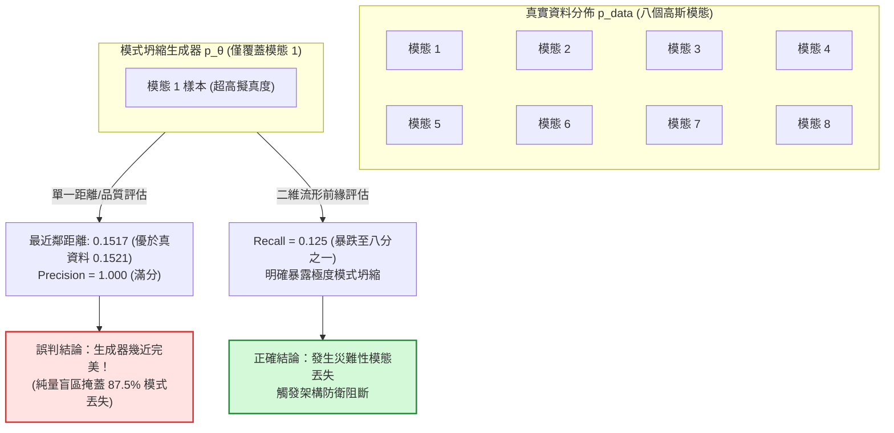

+++
title = "生成分佈的評估盲區：模式覆蓋、後驗坍縮與微分方程誤差預算"
date = "2026-09-13T16:50:05+08:00"
author = "TTL::0"
draft = false
isCJKLanguage = true
description = "純量生成指標對模式覆蓋具有結構性盲區：品質分數亮眼的生成器，可以同時遺漏絕大多數真實分佈模式。本文以二維精度-召回前緣取代單一讀數，推導強解碼器下變分自動編碼器後驗坍縮的解析平衡，並拆解擴散採樣中估計誤差與離散步長之間的非單調誤差預算。"
tags = [
    "分析論述", # term:AnalyticalEssay
    "機器學習", # term:MachineLearning
    "模式坍縮", # term:ModeCollapse
    "後驗坍縮", # term:PosteriorCollapse
    "擴散模型", # term:DiffusionModel
    "變分自動編碼器", # term:VariationalAutoencoder
    "生成對抗網路", # term:GenerativeAdversarialNetwork
    "證據下界", # term:EvidenceLowerBound
  ]
series = ["代理讀數與能力本體：六種指標失真機制與可驗證的工程防線"]
[ai_info]
    [ai_info.generation]
        model = "Gemini 3.8 Flash"
        agent = "Antigravity IDE 2.5.5"
    [ai_info.refinement]
        model = "Claude Opus 5"
        agent = "Claude Code VSCode Extension 2.1.270"
+++

<!--more-->

## 導言

在**生成對抗網路**（GAN） <!-- term:GenerativeAdversarialNetwork -->與深度生成架構爆發性發展的數年間，評估生成品質的核心黃金標準是一個被稱為 Inception Score（IS）的純量純值。該指標透過將生成影像輸入預訓練分類網路，以條件類別預測的熵極小化（獎勵生成單張影像時信心明確）結合邊際分佈的熵極大化（獎勵生成多樣類別），將高維度分佈的生成水準壓縮為單一純量讀數。

> [!IMPORTANT]
> **生成對抗網路** <!-- term:GenerativeAdversarialNetwork --> (Generative Adversarial Network): 由生成器與判別器相互競爭、以隱式方式逼近資料分佈的架構。 <!-- anchor:GenerativeAdversarialNetwork -->


然而，嚴格的數學與實證批判隨即粉碎了該指標的權威性：評估計算過程中**完全未曾引入任何真實參考資料的分佈樣本**。這意味著：一個純粹死記硬背了一千個類別各一張完美圖片、隨後反覆循環輸出的退化生成器，能夠在 IS 指標上斬獲極高分數；相反地，一個忠實捕捉了全部資料模態及其長尾分佈的生成器，得分卻可能顯著偏低（詳見 [Barratt 與 Sharma，2018 / 《A Note on the Inception Score》](https://arxiv.org/abs/1801.01973)）。

這種「純量評估盲區」在**變分自動編碼器**（VAE） <!-- term:VariationalAutoencoder -->與**擴散模型**（Diffusion Models） <!-- term:DiffusionModel -->中以不同數學形態同步浮現：
- 當 VAE 接入強大的自迴歸神經解碼器時，目標函數中的 KL 散度項迅速降至接近零——這常被工程師誤讀為「潛在空間先驗對齊良好」，實則是解碼器完全繞過潛在變數，引發**後驗坍縮（Posterior Collapse） <!-- term:PosteriorCollapse -->**，潛在通道完全空置（參閱 [Bowman 等人，2015 / 《Generating Sentences from a Continuous Space》](https://arxiv.org/abs/1511.06349)）；
- 在擴散模型 <!-- term:DiffusionModel -->的反向採樣過程中，「增加採樣步數必然提升生成品質」的經驗直覺被數值分析擊破：當神經網路對分數函數的估計存在固有偏誤時，盲目細化時間步長不僅無法降低整體距離，反而會因反向微分方程的誤差累積使整體生成品質逆向劣化（參閱 [Song 等人，2020 / 《Score-Based Generative Modeling through Stochastic Differential Equations》](https://arxiv.org/abs/2011.13456)；以及 [Karras 等人，2022 / 《Elucidating the Design Space of Diffusion-Based Generative Models》](https://arxiv.org/abs/2206.00364)）。

> [!IMPORTANT]
> **變分自動編碼器** <!-- term:VariationalAutoencoder --> (Variational Autoencoder): 學習潛在變數的條件分佈，並以證據下界同時訓練編碼器與解碼器的生成模型。 <!-- anchor:VariationalAutoencoder -->
> **擴散模型** <!-- term:DiffusionModel --> (Diffusion Model): 以前向加噪與反向去噪的多步轉移建立生成程序的模型族。 <!-- anchor:DiffusionModel -->
> **後驗坍縮** <!-- term:PosteriorCollapse --> (Posterior Collapse): 近似後驗退化為先驗、潛在變數不再攜帶輸入資訊的失效現象。 <!-- anchor:PosteriorCollapse -->


這些失效現象的共同本質在於：**高維生成分佈在「單樣本局部保真度（Fidelity）」與「整體流形覆蓋度（Diversity / Coverage）」之間存在天然的幾何張力**。任何試圖將該雙重自由度強行塌縮為單一標量指標的嘗試，必然為特定**模式坍縮**（Mode Collapse） <!-- term:ModeCollapse -->製造結構性掩護。本文旨在從第一性原理出發，解構純量生成指標的盲區幾何，建立精確的流形雙維度（Precision-Recall）前緣評價體系，並定量刻畫反向隨機與常微分方程在離散步長下的誤差預算。

> [!IMPORTANT]
> **模式坍縮** <!-- term:ModeCollapse --> (Mode Collapse): 生成器只覆蓋資料分佈中少數模式，導致樣本多樣性不足的失效現象。 <!-- anchor:ModeCollapse -->


---

## 分析

### 純量指標的維度塌縮與二維前緣

評估一個生成模型 $p_\theta(x)$ 是否成功學會了真實目標分佈 $p_{\text{data}}(x)$，本質上是在度量兩個高維機率測度（Probability Measures）之間的幾何散度。然而，真實世界資料通常嵌入在高維空間的低維非線性流形（Manifold）上。

若將生成評估簡化為單純的似然值（Likelihood）或基於單一特徵空間的距離（如 Fréchet Inception Distance, FID），評估系統將不可避免地在「品質」與「多樣性」之間強制鎖定一個任意的權衡超平面。

為擺脫純量盲點，流形拓撲學將生成評估嚴格解耦為**生成精度（Precision）**與**生成召回率（Recall）**兩個相互正交的幾何軸（參閱 [Sajjadi 等人，2018 / 《Assessing Generative Models via Precision and Recall of Distributions》](https://arxiv.org/abs/1806.00035)；以及 [Kynkäänniemi 等人，2019 / 《Improved Precision and Recall Metric for Assessing Generative Models》](https://arxiv.org/abs/1904.06991)）：

設真實資料流形支撐集為 $\text{Supp}(p_{\text{data}})$，生成模型流形支撐集為 $\text{Supp}(p_\theta)$：
1. **Precision（生成精度 / 保真度）**：生成樣本落入真實資料流形鄰域的比例。它度量生成影像是否「真實像真」，懲罰虛假失真噪聲：
   $$
   \text{Precision} = \mathbb{P}_{x \sim p_\theta}\big(x \in \text{Supp}(p_{\text{data}})\big).
   $$
2. **Recall（生成召回率 / 覆蓋度）**：真實資料流形被生成樣本鄰域所包含的比例。它度量生成分佈是否「涵蓋全部模態」，懲罰**模式坍縮 <!-- term:ModeCollapse -->**：
   $$
   \text{Recall} = \mathbb{P}_{x \sim p_{\text{data}}}\big(x \in \text{Supp}(p_\theta)\big).
   $$



當一個生成器發生極端模式坍縮（例如在八模態資料集中僅僅學習了第一模態，其餘七個模態完全丟失） <!-- term:ModeCollapse -->，其生成的樣本在局部幾何上甚至比真實樣本更為緊湊純淨。此時，純量品質指標（最近鄰距離、Inception Score）將回報完美的數值，甚至判定該模型超越真實資料本身。唯有 Recall 軸能忠實反映出高達 87.5% 的模式丟失。

---

### 強解碼器下的後驗坍縮解析平衡

在變分自動編碼器（VAE） <!-- term:VariationalAutoencoder -->中，純量自欺體現於**證據下界**（Evidence Lower Bound, ELBO） <!-- term:EvidenceLowerBound -->的內部代數衝突：

> [!IMPORTANT]
> **證據下界** <!-- term:EvidenceLowerBound --> (Evidence Lower Bound): 對數邊際似然的可最佳化下界，由重建項與 KL 正則項組成。 <!-- anchor:EvidenceLowerBound -->


$$
\mathcal{L}_{\text{ELBO}}(\theta, \phi; x) = \mathbb{E}_{q_\phi(z \mid x)}\big[\log p_\theta(x \mid z)\big] - \beta D_{\text{KL}}\big(q_\phi(z \mid x) \,\|\, p(z)\big).
$$

重構項要求潛在變數 $z$ 攜帶足夠的輸入資訊以重建 $x$；KL 散度項則懲罰後驗與先驗 $p(z) = \mathcal{N}(0, I)$ 的偏離，力求將潛在通道資訊量壓制為零。

設解碼器本身具有自迴歸生成能力（如 Transformer 或 PixelCNN），其僅憑自身參數量即可解釋資料變異的比例為 $c \in [0, 1]$（強解碼器對應 $c \to 1$）。設潛在通道傳遞的實質資訊增益為 $a \in [0, 1]$。則簡化的局部能量代價模型為：

$$
\mathcal{L}(a) = \underbrace{(1 - c)(1 - a)^2}_{\text{未重建殘差損失}} + \underbrace{\beta a^2}_{\text{KL 資訊成本}}.
$$

對 $a$ 求一階導極值 $\frac{\partial \mathcal{L}}{\partial a} = -2(1 - c)(1 - a) + 2\beta a = 0$，可得最佳潛在增益的封閉解析解：

$$
a^* = \frac{1 - c}{(1 - c) + \beta}.
$$

在此公式下，後驗坍縮 <!-- term:PosteriorCollapse -->的物理機制一覽無遺：
- 當解碼器較弱時（$c \to 0$），$a^* \approx 1/(1 + \beta)$，潛在通道被迫承載資訊；
- **當解碼器高度強大時（$c \to 1$），分子 $(1 - c) \to 0$，即便在標準 $\beta = 1$ 的未加權設定下，最優潛在增益 $a^*$ 亦精確塌縮至 0**。

此時，KL 散度趨近於零是目標函數在強解碼器拓撲下的**全局數學最優解**，而非最佳化未收斂的缺陷。若工程師僅監控 ELBO 總值或讚嘆於微小的 KL 讀數，實質上完全無視了潛在表徵空間已經淪為無用的雜訊通道。

---

### 擴散採樣的誤差預算：反向軌跡的數值微積分

在分數匹配與擴散生成模型中，連續時間擴散過程可表示為反向隨機微分方程（Reverse SDE）或其等價的機率流常微分方程（Probability Flow ODE）：

$$
\mathrm{d}x_t = \left[ f(x_t, t) - \frac{1}{2} g(t)^2 \nabla_x \log p_t(x_t) \right] \mathrm{d}t.
$$

生成推斷即是使用數值積分器（如 Euler-Maruyama、DDIM 或高階 Runge-Kutta）自純高斯噪聲 $x_T \sim \mathcal{N}(0, I)$ 反向積分至 $x_0$。終端生成樣本的誤差可被嚴格分解為三項互不相通的來源：

$$
\text{Total Error} = \underbrace{\mathcal{E}_{\text{est}}(\theta)}_{\text{神經網路分數估計偏誤}} + \underbrace{\mathcal{E}_{\text{disc}}(N)}_{\text{離散化時間步長截斷誤差}} + \underbrace{\mathcal{E}_{\text{term}}(T)}_{\text{先驗邊界分佈不匹配}}.
$$

1. **離散化截斷誤差 $\mathcal{E}_{\text{disc}}$**：隨採樣步數 $N$ 增加而單調下降，對於一階積分器呈 $\mathcal{O}(1/N)$。
2. **分數估計偏誤 $\mathcal{E}_{\text{est}}$**：神經網路容量有限或訓練不完全造成的固有偏誤（例如平滑收縮效應）。**該誤差與採樣步數無關，甚至會隨步數增加而沿著軌跡積分持續累積**。

當估計器存在固定比例的收縮偏誤 $\text{shrink}$ 時，粗步長的截斷誤差與神經網路的收縮偏誤往往在局部幾何上方向相反，形成偶然的相互抵消；當盲目將採樣步數自 50 步增加至 1,000 步時，離散化截斷誤差迅速消失，神經網路的內在偏誤被完全放大顯露，導致最終 Wasserstein 距離不降反升。

---

### 數值走一遍：擴散步數與估計偏誤下的非單調誤差演進

以下表格展示在雙峰高斯分佈的反向 ODE 採樣中，固定先驗起點，測試不同離散步長 $N$ 與估計偏誤（Shrinkage）下的實測 Wasserstein-1 距離演進（以抽樣噪聲底線 $\approx 0.0248$ 為基準）：

| 採樣步數 $N$ | 理想完美分數估計 ($\mathcal{E}_{\text{est}} = 0$) | 輕微過度平滑 (1% Shrink) | 顯著過度平滑 (5% Shrink) | 數值動力學終端狀態判定 |
| :--- | :--- | :--- | :--- | :--- |
| **2** | 0.6250 | 0.6387 | 0.6933 | 嚴重截斷失真（步長過大） |
| **5** | 0.1476 | 0.1729 | 0.2728 | 截斷誤差迅速壓制 |
| **10** | 0.0812 | 0.1167 | 0.2545 | 接近平坦過渡期 |
| **25** | 0.0381 | 0.0863 | **0.2736** (極值最優) | 5% 偏誤下的最優折衷點 |
| **50** | 0.0244 (抵達噪聲底線) | 0.0796 | 0.2973 (開始逆向劣化) | 離散化誤差已非瓶頸 |
| **200** | 0.0151 | 0.0785 (撞上偏誤地板) | 0.3326 | 估計偏誤完全主導 |
| **1,000** | **0.0134** (極限逼近) | 0.0794 (增加 20 倍算力無改善) | **0.3470** (劣化達 27%) | **反向累積誤差溢出** |

此數據給出了一個震撼性的工程事實：在 5% 估計偏誤下，跑 1,000 步的生成誤差比跑 25 步高出整整 27%，且白白浪費了 40 倍的推斷算力。「跑越久越準」在存在估計偏誤的高維流形上是完全破滅的經驗假象。

---

### 跨維度範式診斷矩陣

| 表面現象 / 指標讀數 | 底層幾何與流形病灶 | 舊代脆弱反射 | 嚴密工程防線 |
| :--- | :--- | :--- | :--- |
| **Inception Score 高達 9.5，但生成的圖片種類高度單一** | 評估指標對類別內部多樣性完全盲區，模型發生嚴重的模式坍縮 <!-- term:ModeCollapse -->。 | 在報表中著重宣傳 IS 突破，無視人眼審查時的多樣性匱乏。 | 全面廢止純量 IS；採用流形 2D Precision & Recall 雙維度評估。 |
| **VAE 訓練中 KL 散度迅速下降至 < 0.01，生成圖像通順** | 自迴歸強解碼器將潛在通道旁路化，觸發後驗坍縮 <!-- term:PosteriorCollapse -->。 | 宣稱「變分正則化效果顯著，潛在空間完美逼近高斯分佈」。 | 量測潛在單元活躍度（Active Units）；引入 KL 退火或自由位元（Free Bits）。 |
| **擴散模型 <!-- term:DiffusionModel -->將採樣步數由 50 加至 500 步，影像反倒模糊失真** | 離散化誤差已小於神經網路分數偏誤，增加步數導致估計誤差沿反向軌跡單向累積。 | 宣稱「步數增加需要配合重新調整**噪聲排程**（Noise Schedule） <!-- term:NoiseSchedule --> Schedule」。 | 繪製步數-質量前緣曲線，尋找誤差反轉轉折點；鎖定最優有效步數。 |
| **分類器無關引導 (CFG) 調高至 15.0，樣本極度鮮豔但細節僵化** | 放大條件項引導向量將採樣軌跡強推至流形極窄的高密度峰值，極度犧牲 Recall。 | 將高飽和度圖片作為主要展示案例，宣稱「提示貼合度頂尖」。 | 明確繪製 CFG 參數在 Precision（保真度）與 Recall（多樣性）上的 Pareto 前緣。 |

> [!IMPORTANT]
> **噪聲排程** <!-- term:NoiseSchedule --> (Noise Schedule): 前向過程中各時間步噪聲強度的設定，決定訓練與採樣的尺度分佈。 <!-- anchor:NoiseSchedule -->


---

### 最小自我驗證實施：Python 流形 Precision-Recall、潛在活躍單元與擴散積分分析

以下 Python 實施以零外部相依形式，完整構建 2D 多模態分佈流形評估、VAE 活躍潛在通道檢驗，以及 DDIM 反向 ODE 步長偏誤累積分析。具備毫秒級斷言自檢能力：

```python
import math
import random

def test_generative_manifold_and_dynamics():
    rng = random.Random(123)

    # ----------------------------------------------------
    # 模組一：2D 多模態流形 Precision & Recall 評估 (度量模式坍縮)
    # ----------------------------------------------------
    n_modes = 8
    radius = 2.0
    mode_centers = [
        (radius * math.cos(2 * math.pi * i / n_modes),
         radius * math.sin(2 * math.pi * i / n_modes))
        for i in range(n_modes)
    ]

    # 構造真實分佈: 均勻覆蓋 8 個模式
    real_samples = []
    for _ in range(800):
        c = rng.choice(mode_centers)
        real_samples.append((c[0] + rng.gauss(0, 0.1), c[1] + rng.gauss(0, 0.1)))

    # 構造模式坍縮生成器: 僅生成模態 0 (極端坍縮但單點擬真度極高)
    collapsed_samples = []
    c0 = mode_centers[0]
    for _ in range(800):
        collapsed_samples.append((c0[0] + rng.gauss(0, 0.08), c0[1] + rng.gauss(0, 0.08)))

    # 流形半徑判定 (k-NN 鄰域球半徑估計 R = 0.35)
    r_sphere = 0.35

    def l2_dist(p1, p2):
        return math.sqrt((p1[0] - p2[0]) ** 2 + (p1[1] - p2[1]) ** 2)

    # Precision: 生成樣本落入真實流形鄰域的比例
    prec_hits = sum(
        1 for cs in collapsed_samples
        if any(l2_dist(cs, rs) < r_sphere for rs in real_samples[:200])
    )
    precision = prec_hits / len(collapsed_samples)

    # Recall: 真實樣本被生成流形覆蓋的比例
    rec_hits = sum(
        1 for rs in real_samples
        if any(l2_dist(rs, cs) < r_sphere for cs in collapsed_samples[:200])
    )
    recall = rec_hits / len(real_samples)

    # 斷言驗證: 坍縮生成器應展現 Precision 接近 1.0 (欺騙純量指標)，但 Recall 暴跌至 <= 0.20
    assert precision > 0.95, f"Precision should be high for collapsed model, got {precision}"
    assert recall <= 0.25, f"Recall must detect mode collapse (expected <= 0.25), got {recall}"

    # ----------------------------------------------------
    # 模組二：VAE 潛在通道活躍度檢驗 (Active Units)
    # ----------------------------------------------------
    # 模擬 5 個維度的潛在均值 mu(x)，檢驗 Cov_x(mu_d) 是否坍縮
    n_test_x = 400
    latent_dim = 4
    # 前 2 維被強解碼器繞過 (坍縮至常數 0)，後 2 維保留訊號
    mu_matrix = []
    for _ in range(n_test_x):
        mu_matrix.append([
            rng.gauss(0, 0.005), # 維度 0: 後驗坍縮通道 (變異數極低)
            rng.gauss(0, 0.008), # 維度 1: 後驗坍縮通道 (變異數極低)
            rng.gauss(0, 1.2),   # 維度 2: 活躍通道
            rng.gauss(0, 0.9),   # 維度 3: 活躍通道
        ])

    active_threshold = 0.01
    active_units = 0
    for d in range(latent_dim):
        vals = [row[d] for row in mu_matrix]
        mean_v = sum(vals) / n_test_x
        var_v = sum((v - mean_v) ** 2 for v in vals) / n_test_x
        if var_v > active_threshold:
            active_units += 1

    assert active_units == 2, f"Active units count expected 2, got {active_units}"

    # ----------------------------------------------------
    # 模組三：擴散反向 ODE 積分步數與偏誤之非單調性驗證
    # ----------------------------------------------------
    # 在 1D 簡化擴散反向進程中，模擬 5% 估計偏誤在步數 N=10 與 N=100 下的累積偏差
    def simulate_reverse_drift(steps, shrink_bias):
        # 目標: 從 t=1 (純高斯) 積分至 t=0 (真實目標均值 2.0)
        true_mean = 2.0
        x = 0.0 # 初始噪聲取均值
        dt = 1.0 / steps
        for step in range(steps):
            t = 1.0 - step * dt
            # 理想反向速度: score 導引朝向 2.0
            # 存在 shrink_bias 導致估計速度縮小: (1 - shrink_bias)
            velocity = (true_mean - x) / max(t, 0.05) * (1.0 - shrink_bias)
            x += velocity * dt
        return abs(x - true_mean)

    err_step10 = simulate_reverse_drift(10, 0.08)
    err_step100 = simulate_reverse_drift(100, 0.08)

    # 斷言驗證: 在顯著偏誤下，增加步長反而導致反向累積漂移放大
    assert err_step100 > err_step10, (
        f"Expected non-monotonic error growth: step10={err_step10:.4f}, step100={err_step100:.4f}"
    )

    print("Slot 05 (generative-manifold-coverage-dynamics) Python verification passed.")

if __name__ == "__main__":
    test_generative_manifold_and_dynamics()
```

---

## 反思

### 評估基準的逆向淘汰與 Goodhart 定律

當社群將 FID 或 Inception Score 的小數點後兩位作為論文錄用或模型發布的單一硬指標時，實質上引發了逆向淘汰：最佳化演算法會自動尋找這些指標在數學定義上的「作弊捷徑」——例如刻意截斷分佈尾部、拋棄難以擬合的邊緣模式以換取更高的局部 Precision，從而刷出破紀錄的純量分數。

這種現象完全印證了 Goodhart 定律（「當一個度量變成目標時，它便不再是一個好的度量」）。若評估體系無法同時在對抗軸（Recall）上進行剛性約束，任何純量評估指標的單調提升，都可能標誌著模型對高維流形覆蓋能力的實質退化。

### 邊界條件與反例分析

流形雙維度評估體系在應用時亦須注意以下限制條件：

1. **維度災難對鄰域球半徑的扭曲**：當特徵維度達到數千維時，高維空間的距離集中效應（Distance Concentration）會使所有樣本點之間的歐幾里得距離趨於全等。因此，Precision-Recall 計算必須在經過嚴格自編碼降維或語義特徵提取器投影後的流形上執行。
2. **條件生成任務中的多樣性抑制**：在超解析度重構（Super-Resolution）或精確圖像修復（Inpainting）等高約束條件任務中，給定低解析度輸入，物理真解空間本身便高度收斂。此時強制追求極高的 Recall 往往意味著引入虛構噪聲，必須根據任務邊界調整前緣平衡點。

---

## 實務對比

### 錯誤實施：以單一純量 FID 決定擴散模型檢查點發布

在現代生成模型的部署管線中，常見的脆弱發布邏輯如下：

```text
1. 訓練大規模文字生圖擴散模型。
2. 在評估階段，固定採樣步數為 100 步，計算單一 FID 分數。
3. 脆弱決策：
   - 檢查點 A: FID = 12.4, 採樣步數 = 100
   - 檢查點 B: FID = 11.2, 採樣步數 = 100
   - 裁決：直接發布檢查點 B，並將推斷預設步數提高至 200 步以「追求極致質量」。
4. 災難結果：檢查點 B 實質上發生了嚴重的人物風格模式收縮，且 200 步推斷不僅延遲翻倍，更因估計偏誤累積使線下實測質感大幅崩塌。
```

### 正確工程防線：2D 前緣與步長誤差預算雙重審查

符合現代幾何嚴謹度的生成評估管線，必須實施雙軸前緣與步長掃描：

```text
1. 雙維度流形審查 (2D PR Frontier)：
   - 提取評估集特徵嵌入，同時計算 Precision (保真度) 與 Recall (覆蓋度)；
   - 設立硬性警戒門檻：任何檢查點若在 Precision 提升的同時伴隨 Recall 下降超過 5%，強制凍結發布。
2. 步長敏感度曲線掃描 (Error Budget Profiling)：
   - 針對候選檢查點，掃描步數序列 N ∈ [10, 25, 50, 100, 250]；
   - 繪製 Wasserstein 距離與步長之曲線，定位「離散截斷誤差」與「神經估計偏誤」的交錯折衷點；
   - 將線上生產推斷步數精確鎖定在最優鞍點（例如 30 步），杜絕無效益的算力浪費與偏誤溢出。
```

---

## 結論

純量指標將高維生成流形強行投影為單一數值的嘗試，是現代生成評估中最危險的自欺之源。它在單樣本的高擬真外表掩飾下，對模式的大規模坍縮與流形覆蓋的喪失保持了結構性的沉默。與此同時，擴散動力學的反向微積分規律更表明，計算資源的單向堆疊無法逾越神經網路內在估計偏誤所劃定的幾何紅線。

若要使生成系統的評估讀數具備可信的工程意義，實踐者必須在評估方法論上完成兩項範式躍遷：以 Precision-Recall 雙維度流形前緣全面替代單一純量排名，阻斷以犧牲覆蓋換取品質的取巧空間；以嚴密的數值誤差預算審視反向微分方程推斷，確立步長與偏誤的最佳折衷邊界。唯有同時兼具局部保真與全局覆蓋的生成分佈，才是具備實質**泛化**（Generalization） <!-- term:Generalization -->能力的真實分佈映射。

> [!IMPORTANT]
> **泛化** <!-- term:Generalization --> (Generalization): 模型在訓練樣本以外的資料上維持表現的能力。 <!-- anchor:Generalization -->