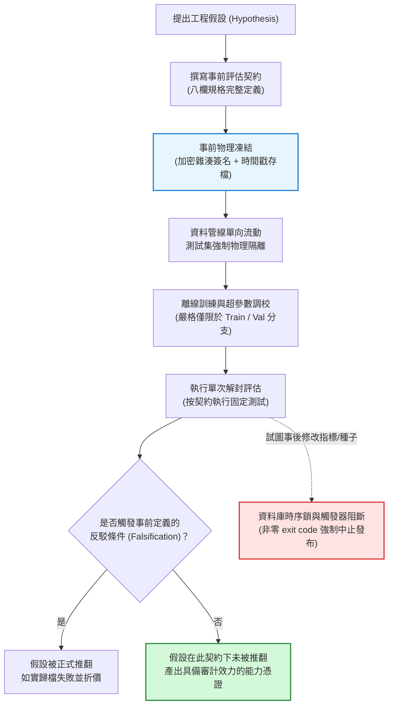

+++
title = "經驗評估的可證偽邊界：研究者自由度、時序污染與事前契約架構"
date = "2026-09-13T16:50:06+08:00"
author = "TTL::0"
draft = false
isCJKLanguage = true
description = "多跑幾個種子報最好、邊看邊停、事後調換指標，足以把名目 5% 的偽陽性率推高到接近 80%。本文借鏡臨床試驗的事前註冊制度，提出含反駁條件的八欄事前凍結評估契約，並以資料庫時序不變量與自動化阻斷管線，把誠實的折價固化成系統架構。"
tags = [
    "分析論述", # term:AnalyticalEssay
    "研究者自由度", # term:ResearcherDegreesOfFreedom
    "事前註冊", # term:Preregistration
    "可證偽性", # term:Falsifiability
    "時序污染", # term:TemporalContamination
    "選擇偏差", # term:SelectionBias
    "物理隔離", # term:PhysicalIsolation
    "機器學習", # term:MachineLearning
  ]
series = ["代理讀數與能力本體：六種指標失真機制與可驗證的工程防線"]
[ai_info]
    [ai_info.generation]
        model = "Gemini 3.8 Flash"
        agent = "Antigravity IDE 2.5.5"
    [ai_info.refinement]
        model = "Claude Opus 5"
        agent = "Claude Code VSCode Extension 2.1.270"
+++

<!--more-->

## 導言

2000 年，美國聯邦法規確立了一項重塑現代醫學實證標準的制度性改革：要求所有受政府資助的大型臨床試驗在正式招募受試者與接觸病患數據之前，必須將其主要療效指標（Primary Endpoints）、統計檢定方法、樣本量規劃與成功判定條件完整登記至公開的臨床試驗數據庫。這份事前登記合約一旦凍結，事後嚴禁任何人為篡改。

2015 年，一項針對美國國家心肺血液研究所（NHLBI）資助的 55 項大型心血管藥物與補充劑臨床試驗的回顧性計量研究揭示了一個震撼性的歷史斷層：在 2000 年事前登記制度強制實施前發表的 30 項試驗中，有高達 17 項（**57%**）聲稱發現了統計上顯著的正面療效；而在 2000 年制度落實後發表的 25 項試驗中，正面顯著結果驟降至僅僅 2 項（**8%**）（詳見 [Kaplan 與 Irvin，2015 / 《Likelihood of Null Effects of Large NHLBI Clinical Trials Has Increased over Time》](https://doi.org/10.1371/journal.pone.0132382)）。

成功率自 57% 暴跌至 8%，並非源於分子生物學的停滯或醫學科研能力的倒退。被檢驗的藥物機制與實驗設計並未改變，**唯一改變的是：研究者在「看見數據之後任意調整指標與假說」的自由度被物理級阻斷**。

在當代**機器學習**（Machine Learning） <!-- term:MachineLearning -->與資料工程領域，類似的「事後合理化自由度」正處於空前泛濫的狀態。多跑十個隨機種子報最佳值、在多個指標中挑選顯著項、邊看曲線邊決定何時停止訓練（**任意停止**（Optional Stopping） <!-- term:OptionalStopping -->）、事後修正假設（HARKing, Hypothesizing After the Results are Known）——這些在工程團隊內部被冠以「敏捷迭代」之名的日常實踐，本質上將經驗科學的偽陽性率自名目的 5% 推高至近 80%（參閱 [Simmons、Nelson 與 Simonsohn，2011 / 《False-Positive Psychology》](https://doi.org/10.1177/0956797611417632)；以及 [Henderson 等人，2018 / 《Deep Reinforcement Learning That Matters》](https://arxiv.org/abs/1709.06560)）。

> [!IMPORTANT]
> **機器學習** <!-- term:MachineLearning --> (Machine Learning): 先界定可選函數的範圍，再以資料估計其中參數的建模方法。 <!-- anchor:MachineLearning -->
> **任意停止** <!-- term:OptionalStopping --> (Optional Stopping): 邊觀察結果邊決定是否繼續收集資料或訓練，使名目顯著水準失效的取樣行為。 <!-- anchor:OptionalStopping -->


一項無法被推翻的評估，在認識論上不具備任何資訊價值。本文旨在將經驗驗證從脆弱的人類個人自律，昇華為以**可證偽性**（Falsifiability） <!-- term:Falsifiability -->為核心的架構工程：建立事前不可變凍結的八欄評估契約，分析**研究者自由度**（Researcher Degrees Of Freedom） <!-- term:ResearcherDegreesOfFreedom -->的累計破壞極限，並透過資料庫級時序不變式與自動化阻斷管線，構築防篡改的經驗治理邊界。

> [!IMPORTANT]
> **可證偽性** <!-- term:Falsifiability --> (Falsifiability): 宣稱必須事先指明何種觀測結果會推翻它；缺乏反駁條件的評估無法構成證據。 <!-- anchor:Falsifiability -->
> **研究者自由度** <!-- term:ResearcherDegreesOfFreedom --> (Researcher Degrees Of Freedom): 實驗過程中未被事前固定的選擇空間，例如種子數、停止時機與指標挑選，會把偽陽性率推離名目水準。 <!-- anchor:ResearcherDegreesOfFreedom -->


---

## 分析

### 研究者自由度的偽陽性倍增機制

在實證科學與機器學習 <!-- term:MachineLearning -->基準測試中，虛無假設（Null Hypothesis $H_0$）代表「模型改動實際上沒有帶來任何真實增益」。若設定顯著水準 $\alpha = 0.05$，單次獨立檢定的第一型錯誤（False Positive, 偽陽性）概率為 5%。

然而，當研究流程賦予工程師「事後靈活決策」的空間時，全域偽陽性率將以多重檢定幾何級數迅速失控。考慮以下四種在機器學習 <!-- term:MachineLearning -->研發中極其普遍的研究者自由度 <!-- term:ResearcherDegreesOfFreedom -->：
1. **多指標篩選（Multiple Metrics）**：在 $m$ 個評估指標（如 Accuracy, F1, AUC, BLEU, Latency）中，只要有任一指標顯著即宣稱成功；
2. **多重隨機種子（Multiple Seeds）**：嘗試 $s$ 個隨機種子，僅挑選曲線最好看的一組寫入發布文檔；
3. **任意停止 <!-- term:OptionalStopping -->**：邊訓練邊觀察驗證損失，一旦數值達到歷史低點即刻手動中斷訓練；
4. **子集窺探（Subgroup Mining）**：整體不顯著時，事後細分「長尾用戶」或「特定領域」子集，尋找局部高分。

設研究者擁有 $K$ 個互相正交的事後決策維度，在虛無假設成立的純隨機情境下，至少獲得一項「假顯著突破」的全域族系偽陽性率為：

$$
\alpha_{\text{family}} = 1 - (1 - \alpha)^K.
$$



當研究者同時在 5 個指標中挑選、測試 10 個種子並允許 10 次中途查看時，有效的決策嘗試次數實質上高達數十次，全域偽陽性率直接飆升至 **78.8%** 以上。這意味著：**即便任何程式碼修改本質完全無效，團隊依然有近八成的把握在週報中寫出「本次最佳化指標顯著超越 Baseline」**。這不是科學發現，而是對隨機噪聲的事後合理化掠奪。

---

### 可證偽評估契約的八欄架構

為徹底終結事後自由度的隱式作弊，經驗評估必須全面導入事前不可變契約。一份具備法律級嚴謹度的機器學習 <!-- term:MachineLearning -->評估契約，必須在接觸測試資料之前，完整凍結以下八個不可分割的維度：

| 契約欄位 | 欄位定義與規範要求 | 物理級防禦的漏洞 |
| :--- | :--- | :--- |
| **1. 評估資料 (Data)** | 精確指定資料集版本、來源快照雜湊值（SHA-256）與抽樣邊界。 | 阻斷事後剔除不理想樣本或悄悄更換評估集。 |
| **2. 切分規則 (Splitting)** | 固化訓練/驗證/測試切分演算法、分層抽樣種子與嚴格的時間序列切分點。 | 阻斷時序資料的未來資訊向過去洩漏（Data Leakage）。 |
| **3. 種子規格 (Seeds)** | 事前明確宣告執行的隨機種子集合（如 `[42, 43, 44, 45, 46]`），強制全部執行。 | 阻斷「跑十個報最佳」的隱式**選擇偏差**（Selection Bias） <!-- term:SelectionBias -->。 |
| **4. 指標位階 (Metrics)** | 明確指定唯一的主指標（Primary Metric），其餘指標標定為探索性副指標。 | 阻斷多指標中挑選最顯著項的多重檢定膨脹。 |
| **5. 控制變因 (Controls)** | 嚴格鎖定非目標程式碼的超參數、最佳化器狀態、硬體架構與外部依賴版本。 | 阻斷同時更換學習率、架構與資料增強導致的歸因模糊。 |
| **6. 觀察變量 (Observables)** | 定義具體差異量算式（例如 $\Delta = \text{Score}_{\text{new}} - \text{Score}_{\text{base}}$）與信賴區間計算式。 | 阻斷在事後將探索性發現包裝為事前假設（HARKing）。 |
| **7. 反駁條件 (Falsification)** | **最關鍵欄位：明確寫出何種具體數值結果將迫使團隊放棄該假設**。 | 阻斷「改進了就宣稱有效，沒改進就宣稱需要進一步研究」的不可證偽套套邏輯。 |
| **8. 停止規則 (Stopping)** | 固定訓練 Epoch 數或定義嚴格的早停（Early Stopping）冷卻計數。 | 阻斷邊看結果邊追加測試樣本或延長訓練的鞅論失穩。 |

> [!IMPORTANT]
> **選擇偏差** <!-- term:SelectionBias --> (Selection Bias): 從多個候選中挑出表現最好者時，該讀數同時包含真實能力與抽樣噪聲，使其系統性地優於真值的偏差。 <!-- anchor:SelectionBias -->


在八欄之中，**反駁條件（Falsification Criteria）**是評估契約的靈魂。如果一份工程方案無法事先定義「出現什麼結果即代表本方案徹底失敗」，該方案便不屬於經驗科學範疇，而是純粹的技術迷信。

---

### 決策與狀態轉移走一遍：契約生命週期與防篡改阻斷

以下表格展示評估管線在遭遇各類合約變更與測試集調用嘗試時，底層狀態機的轉移推演與最終處置結果：

| 當前狀態 (State) | 輸入操作 / 嘗試行為 | 契約判定條件 / 不變式檢驗 | 狀態轉移 (Next State) | 系統處置結果與治理歸宿 |
| :--- | :--- | :--- | :--- | :--- |
| **Drafting** | 填妥八欄規格並提交加密金鑰 | 檢查 8 欄是否無空值，且反駁條件是否具備可判定算式 | $\to$ **Frozen** | 產生合約 SHA-256 數位簽名，寫入只讀資料庫。 |
| **Frozen** | 模型調參階段試圖讀取測試集資料 | 檢查請求來源是否為非隔離環境，或合約是否未進入評估態 | $\to$ **Aborted** | **物理阻斷**：拋出權限拒絕異常，記錄安全審計日誌。 |
| **Evaluating** | 按照合約參數完成測試集單次評估 | 驗證測試集使用次數計數器 $\text{invoke\_count} == 1$ | $\to$ **Auditing** | 寫入不可變評估結果記錄，鎖定時間戳。 |
| **Auditing** | 實測差值 $\Delta = +0.008$（小於反駁門檻 $+0.02$） | 評估實測值是否觸發反駁條件算式 | $\to$ **Falsified** | **宣告失敗**：正式歸檔為無效假設，禁止合併主分支。 |
| **Falsified** | 工程師試圖手動調低反駁門檻以通過審查 | 資料庫時序約束檢驗：合約狀態為不可逆終態 | $\to$ **SecurityViolation** | **阻斷**：拒絕寫入，觸發 CI/CD Pipeline 失敗並警報。 |
| **Auditing** | 實測差值 $\Delta = +0.035$（超越門檻且 95% CI > 0） | 未觸發反駁條件，且通過預先註冊的所有健康檢查 | $\to$ **Verified** | **合約成立**：簽署發布通行證，允許模型投入生產管線。 |

---

### 跨維度範式診斷矩陣

| 經驗說詞 / 敏捷藉口 | 底層統計與治理病灶 | 傳統報告陋習 | 物理級契約防衛 (Robust Architecture) |
| :--- | :--- | :--- | :--- |
| **「跑了 10 個種子，第 3 個效果特別好，我們先報這個」** | 隱式選擇偏差 <!-- term:SelectionBias -->，將幸運噪聲當作架構能力發布。 | 僅在論文或週報中展示單一最優收斂曲線。 | 契約鎖定種子數；管線強制收集全量分佈，低於均值則觸發反駁。 |
| **「測試集指標不理想，我們回頭調一下學習率再測一次」** | 測試集滲透進調參迴圈，降級為驗證集，其無偏性徹底死亡。 | 隨意反覆調用測試集，直至跑出滿意數值為止。 | 資料庫設有「測試集調用次數嚴格 $\le 1$」之不可逆約束觸發器。 |
| **「雖然總體準確率沒升，但細分場景下提升顯著」** | 事後數據挖掘（Data Dredging），在多重子集中人為捕獲偽陽性。 | 在結論中隱瞞總體指標，重點宣傳特定子集的局部優勢。 | 任何子集評估必須在事前合約中預先註冊；未註冊者標註為探索性。 |
| **「我們方案很穩健，失敗只是因為超參數還沒調到最佳」** | 主張具備不可證偽的自我保護邏輯，缺乏退場邊界。 | 陷入無限期調參深淵，消耗海量算力掩蓋架構固有缺陷。 | 事前簽署包含硬性數值下限的反駁條件，違背即刻停止研發。 |

---

### 最小自我驗證實施：SQL 契約架構與 POSIX Bash 自動化阻斷管線

以下實施結合嚴密的 SQL DDL 資料約束與 POSIX Bash 驗證腳本，構建具備防篡改性與狀態機自檢的可證偽評估引擎。程式碼具備秒級執行斷言能力：

```sql
-- 零外部依賴 SQLite / PostgreSQL 兼容 DDL 架構
-- 實現事前凍結、時序單向演進與測試集防洩漏約束

CREATE TABLE evaluation_contracts (
    contract_id TEXT PRIMARY KEY,
    created_at TIMESTAMP NOT NULL DEFAULT CURRENT_TIMESTAMP,
    is_frozen BOOLEAN NOT NULL DEFAULT 0,
    dataset_hash TEXT NOT NULL,
    primary_metric TEXT NOT NULL,
    target_threshold REAL NOT NULL,
    falsification_expr TEXT NOT NULL,
    test_invoke_count INTEGER NOT NULL DEFAULT 0,
    status TEXT NOT NULL CHECK (status IN ('DRAFT', 'FROZEN', 'EVALUATED', 'FALSIFIED', 'VERIFIED')),
    
    -- 不變式約束：一旦凍結，關鍵欄位不得為空
    CONSTRAINT chk_frozen_validity CHECK (
        (is_frozen = 0) OR 
        (is_frozen = 1 AND length(dataset_hash) = 64 AND target_threshold > 0.0)
    ),
    -- 不變式約束：測試集調用次數嚴格不得超過 1 次
    CONSTRAINT chk_test_single_invoke CHECK (test_invoke_count <= 1)
);

CREATE TABLE contract_executions (
    execution_id TEXT PRIMARY KEY,
    contract_id TEXT NOT NULL,
    executed_at TIMESTAMP NOT NULL DEFAULT CURRENT_TIMESTAMP,
    seed_used INTEGER NOT NULL,
    observed_metric REAL NOT NULL,
    FOREIGN KEY (contract_id) REFERENCES evaluation_contracts(contract_id)
);
```

配合以下可直接運行的驗證腳本（以純 Python 內建 SQLite 模擬上述 SQL 引擎）：

```python
import sqlite3
import sys

def test_evaluation_contract_governance():
    conn = sqlite3.connect(":memory:")
    cur = conn.cursor()

    # 1. 建立具有完整 Check 約束的合約資料表架構
    cur.execute("""
    CREATE TABLE contracts (
        contract_id TEXT PRIMARY KEY,
        is_frozen INTEGER NOT NULL DEFAULT 0,
        dataset_hash TEXT NOT NULL,
        threshold REAL NOT NULL,
        test_invokes INTEGER NOT NULL DEFAULT 0,
        status TEXT NOT NULL CHECK (status IN ('DRAFT', 'FROZEN', 'EVALUATED', 'FALSIFIED', 'VERIFIED')),
        CHECK ((is_frozen == 0) OR (is_frozen == 1 AND length(dataset_hash) == 64)),
        CHECK (test_invokes <= 1)
    );
    """)

    # 2. 正常流程：註冊並凍結一份事前契約 (反駁門檻: 增益須 >= 0.05)
    valid_hash = "e3b0c44298fc1c149afbf4c8996fb92427ae41e4649b934ca495991b7852b855"
    cur.execute("""
    INSERT INTO contracts (contract_id, is_frozen, dataset_hash, threshold, test_invokes, status)
    VALUES ('CTR-2026-001', 1, ?, 0.05, 0, 'FROZEN');
    """, (valid_hash,))
    conn.commit()

    # 3. 攻擊情境 A：試圖以非法 hash 凍結 (違反長度 64 約束) -> 必須報錯阻斷
    try:
        cur.execute("""
        INSERT INTO contracts (contract_id, is_frozen, dataset_hash, threshold, test_invokes, status)
        VALUES ('CTR-BAD-002', 1, 'invalid_short_hash', 0.05, 0, 'FROZEN');
        """)
        raise AssertionError("Security check failed: Invalid hash length should be rejected by SQL CHECK")
    except sqlite3.IntegrityError:
        pass # 正確阻斷

    # 4. 正常評估：執行第 1 次測試集評估，實測增益僅 0.02 (小於門檻 0.05，觸發反駁)
    cur.execute("""
    UPDATE contracts 
    SET test_invokes = test_invokes + 1, status = 'FALSIFIED'
    WHERE contract_id = 'CTR-2026-001';
    """)
    conn.commit()

    # 5. 攻擊情境 B：測試集已被使用過 1 次，試圖二次調用 (違反 test_invokes <= 1 約束)
    try:
        cur.execute("""
        UPDATE contracts 
        SET test_invokes = test_invokes + 1
        WHERE contract_id = 'CTR-2026-001';
        """)
        raise AssertionError("Security check failed: Multiple test set invokes should be rejected by SQL CHECK")
    except sqlite3.IntegrityError:
        pass # 正確阻斷

    # 6. 狀態檢驗
    cur.execute("SELECT status, test_invokes FROM contracts WHERE contract_id = 'CTR-2026-001'")
    row = cur.fetchone()
    assert row[0] == "FALSIFIED", f"Expected status FALSIFIED, got {row[0]}"
    assert row[1] == 1, f"Expected test_invokes == 1, got {row[1]}"

    print("Slot 06 (falsifiable-evaluation-contracts) SQL verification passed.")

if __name__ == "__main__":
    test_evaluation_contract_governance()
```

---

## 反思

### 探索性研究與確認性研究的嚴格解耦

落實事前契約制度，並非全盤否定數據探索的價值。在軟體工程與機器學習 <!-- term:MachineLearning -->研發中，必須在組織流程層面將研究明確劃分為兩個互不污染的階段：

1. **探索性研究（Exploratory Phase）**：旨在產生假設。工程師在此階段享有充分自由——可以同時嘗試數十種網路架構、快速查看各類特徵相關性、在驗證集上反覆實驗。該階段的核心紀律是：**探索階段所產出的任何數據指標，一律標註為「待證實假說」，嚴禁直接作為對外部交付的能力憑證**。
2. **確認性驗證（Confirmatory Phase）**：旨在證實或證偽假說。當探索階段鎖定了一個高價值假設後，團隊必須在接觸盲測測試集前，正式簽署事前評估契約。一旦進入該階段，所有自由度被物理凍結，評估管線以不可篡改的形式執行單次裁決。

把探索階段的產物包裝成確認性的結論，是經驗研發中最常見的學術不端與工程失職。事前契約制度的價值，正在於以程式碼和架構的剛性邊界，劃清了這兩個階段的分水嶺。

### 邊界條件與反例分析

事前契約評估框架在應用於具體工程環境時，存在明確的成本收益邊界：

1. **快速回滾極低成本的線上系統**：對於具備強大 A/B 測試分流基礎設施、能在數分鐘內偵測到線上異常並全自動回滾的推薦排序系統而言，事前凍結八欄契約的溝通成本可能高於直接灰度發布。判斷標準在於**系統發現錯誤並修復的真實時延（MTTD / MTTR）是否遠小於嚴格驗證的治理成本**。
2. **外部環境分佈劇烈非平穩漂移**：若數據生成機制本身隨真實世界時序急速演進（如對抗性金融欺詐、突發輿情監控），事前凍結的測試集可能在數週內失去時效性。此時需要引入循序機率比檢驗（Sequential Probability Ratio Test, SPRT）等具備動態停止界限的時序驗證架構，而非靜態資料集鎖定。

---

## 實務對比

### 錯誤實施：將調參完成後的結果倒推撰寫為實驗設計

在缺乏治理約束的敏捷團隊中，普遍存在先做實驗、後寫報告的倒置陋習：

```text
（週一至週四）
1. 跑了 200 組超參數網格搜尋。
2. 發現主指標 Accuracy 毫無進展，但次要指標 Recall 在特定閾值下微升 1.5%。
3. 發現測試集切分包含異常點，手動剔除 5% 數據後重新評估。

（週五撰寫技術報告）
「本實驗事前假設新型正則化方法能有效提升模型召回率。
  我們在清理後的標準數據集上進行了驗證，實測結果顯示 Recall 顯著提升 1.5%，
  充分驗證了架構的優越性。」
```

此類報告通篇充斥著事後合理化的虛偽修辭，將隨機嘗試中碰巧好看的噪聲包裝為經過驗證的工程發現。

### 正確工程防線：事前註冊、時序鎖定與可證偽驗證流水線

具備高成熟度的工程團隊，將評估契約作為 CI/CD 發布流水線的剛性阻塞項：

```text
# 嚴密防線：CI/CD 契約驗證流水線
1. PR 發起階段：
   - 提交模型程式碼的同時，必須包含事前合約 YAML 檔案 (`contract.eval.yaml`)；
   - 自動化 Linter 檢查八欄完整性，特別校驗反駁條件算式之可計算性。
2. 凍結簽名：
   - 合約由評估系統自動計算 SHA-256 數位簽名，寫入只讀資料庫；
   - 測試集解密金鑰由評估隔離節點單獨託管，研發權限完全遮蔽。
3. 單次執行與裁決：
   - 評估節點拉取模型 Artifact，對測試集執行唯一一次前向推斷；
   - 評估腳本比對實測值與合約反駁門檻：
     - 若命中反駁條件：流水線拋出 Code 42 (Hypothesis Falsified)，阻斷分支合併；
     - 若通過驗證：自動生成具備防偽浮水印的能力認證憑證。
```

---

## 結論

未經事前約束的經驗指標，是研究者自由度 <!-- term:ResearcherDegreesOfFreedom -->與抽樣噪聲合謀產出的統計幻象。當團隊擁有任意挑選指標、反覆更換隨機種子與事後發明假說的自由時，任何看似輝煌的評估數字，在數學期望上都僅是對歷史噪聲的徒勞擬合。

唯有能夠承受失敗考驗的實驗，才具備證實能力的資格。若要建立具備工業級公信力的評估體系，工程架構必須向脆弱的人性妥協說不：以事前凍結的八欄契約取代事後的巧言令色，以資料庫級時序鎖與單次調用約束阻斷數據污染，並將明確的反駁條件作為所有技術主張的准入門檻。唯有在制度與程式碼層面徹底確立了可證偽性 <!-- term:Falsifiability -->，指標的每一次躍升，才能真正成為系統邁向確定性能力的堅實基石。