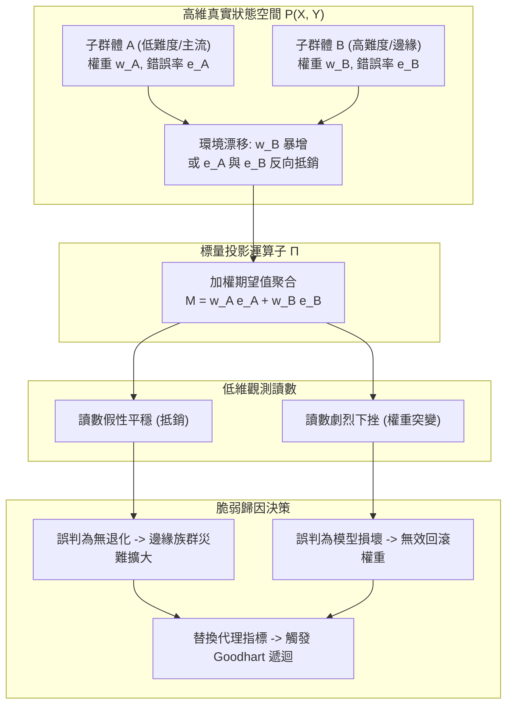

+++
title = "度量自欺與不可識別性邊界：標量讀數下的子群體坍縮與指標遞迴失效"
date = "2026-09-13T17:30:01+08:00"
author = "TTL::0"
draft = false
isCJKLanguage = true
description = "標量聚合度量是一個帶有非平凡核空間的降維投影：弱勢子群體坍縮時它偽裝平穩，分佈權重漂移時它又觸發假性退化告警。本文推導不可識別性的來源，拆解辛普森反轉與代理指標遞迴的 Goodhart 坍縮路徑，並建立分佈與能力解耦校驗、多維切片單調性防衛的工程防線。"
tags = [
    "分析論述", # term:AnalyticalEssay
    "機器學習", # term:MachineLearning
    "不可識別性", # term:Unidentifiability
    "標量聚合度量", # term:ScalarAggregateMetric
    "子群體", # term:Subgroup
    "辛普森悖論", # term:SimpsonSParadox
    "統計檢定力", # term:StatisticalPower
    "分佈漂移", # term:DistributionShift
  ]
series = ["能力失效歸因：模型評估盲區、幾何失真與因果邊界的工程重建"]
[ai_info]
    [ai_info.generation]
        model = "Gemini 3.8 Flash"
        agent = "Antigravity IDE 2.5.5"
    [ai_info.refinement]
        model = "Claude Opus 5"
        agent = "Claude Code VSCode Extension 2.1.270"
+++

<!--more-->

## 導言

在生產環境運行八個月的一套文件分類系統，週一的離線綜合評測準確率為 90.2%，週二晨間例行跑測卻驟降至 75.1%。值班團隊在事故處理頻道貼出兩張對比截圖，將事故定性為「模型能力退化」，並緊急發起回滾上週五權重版本的發布流程。然而，在回滾完成後，評測讀數依然停留在 75% 左右。進一步的比對揭示了一個荒謬的事實：模型權重二進位雜湊值完全一致，推論程式碼無任何異動；真正改變的是上游資料管道在週一晚間靜默調整了篩選閾值，導致評測集中原本僅佔 5% 的高難度長尾法律合約樣本激增至 48%。模型對該特定**子群體**（Subgroup） <!-- term:Subgroup -->的真實錯誤率在八個月內從未改變，但巨幅的分佈權重重組直接摧毀了宏觀標量讀數。

> [!IMPORTANT]
> **子群體** <!-- term:Subgroup --> (Subgroup): 依特徵切片劃分出的樣本子集合，是檢驗聚合讀數是否掩蓋局部失效的最小觀測單位。 <!-- anchor:Subgroup -->


與此同時，另一套聲稱具備「零退化治理」的模型監控管線，在連續十四個月內每週回報整體準確率穩定在 94% 以上。直到季度合規審計介入，才發現系統對特定邊緣族群的判斷錯誤率高達常規族群的四倍。團隊試圖透過技術改進來修補此類盲區：意識到「平均值容易掩蓋樣本翻轉」後，他們廢除了單一準確率，改用「逐樣本預測**翻轉率**（Flip Rate） <!-- term:FlipRate -->」作為發布閘門。然而不到半年，工程師們發現模型開始過度保守地錨定於既有輸出，即使顯而易見的錯誤修正也被翻轉率 <!-- term:FlipRate -->懲罰阻擋；為規避限制，團隊進一步引入加權翻轉懲罰，最終讓整個度量系統陷入多層代理指標相互拉扯、指標本身成為最佳化攻擊目標的遞迴泥淖。

> [!IMPORTANT]
> **翻轉率** <!-- term:FlipRate --> (Flip Rate): 兩個模型版本之間逐樣本預測改變的比例，用來捕捉平均值所掩蓋的個案不穩定。 <!-- anchor:FlipRate -->


這類事故的共通本質，在於軟體工程長期依賴的**「**標量聚合度量**（Scalar Aggregate Metric） <!-- term:ScalarAggregateMetric -->」**在面對高維經驗系統時存在根本性的**不可識別性**（Unidentifiability） <!-- term:Unidentifiability -->。當單一數字被賦予表徵複雜機制健康狀態的任務時，高維子流形的崩塌必然會被隱蔽於統計投影的核空間之內。

> [!IMPORTANT]
> **標量聚合度量** <!-- term:ScalarAggregateMetric --> (Scalar Aggregate Metric): 把高維行為壓縮成單一數字的評估量，其降維投影會把子群體差異與分佈權重變化一併吸收。 <!-- anchor:ScalarAggregateMetric -->
> **不可識別性** <!-- term:Unidentifiability --> (Unidentifiability): 模型或機制的真實狀態無法由觀測到的標量讀數唯一還原的性質，源於聚合投影具備非平凡核空間。 <!-- anchor:Unidentifiability -->


---

## 分析

從觀測值回推底層機制的困難，根源於聚合運算本質上是高維機率測度到實數軸的降維投影。設樣本空間為 $\mathcal{X} \times \mathcal{Y}$，真實資料生成分佈為 $P$，模型決策函數為 $f_\theta: \mathcal{X} \to \mathcal{Y}$。常見的聚合評估指標 $M(f_\theta, P)$ 可抽象為投影運算子：

$$\Pi: \mathcal{P}(\mathcal{X} \times \mathcal{Y}) \to \mathbb{R}, \quad M(f_\theta, P) = \mathbb{E}_{(x, y) \sim P}[\ell(f_\theta(x), y)]$$

由於測度空間 $\mathcal{P}$ 具備無限維自由度，投影算子 $\Pi$ 必然擁有非平凡的核空間（Kernel Space）$\ker(\Pi)$。這意味著存在無窮多個結構迥異的錯誤分佈變化 $\Delta P$，使得 $\Pi(P + \Delta P) = \Pi(P)$。



上圖揭示了聚合度量遮蔽真實病灶的傳導路徑：當子群體 <!-- term:Subgroup -->的錯誤率變化與權重分佈重組同時發生時，標量讀數既可能在底層惡化時維持平穩，也可能在模型能力未變時引發虛假告警。

經典的統計學機制精確解釋了這種反轉。當總體樣本被劃分為 $K$ 個互相獨立的子群體 <!-- term:Subgroup --> $\mathcal{S}_1, \dots, \mathcal{S}_K$ 時，全域指標變化量 $\Delta M$ 可分解為兩項：

$$\Delta M = \sum_{k=1}^K w_k \Delta M_k + \sum_{k=1}^K \Delta w_k M_k^{(0)}$$

第一項為各子群體 <!-- term:Subgroup -->內部模型能力的實質變化，第二項為群體權重轉移帶來的結構效應。若第二項的絕對值大於第一項且符號相反，就會引發著名的**辛普森悖論**（Simpson's Paradox） <!-- term:SimpsonSParadox -->。正如 [Bickel 等人，1975 / 《Sex Bias in Graduate Admissions: Data from Berkeley》](https://www.science.org/doi/10.1126/science.187.4175.398) 在實證研究所展示的，宏觀聚合數據上的顯著偏誤，往往是由子群體 <!-- term:Subgroup -->入學率與申請權重結構交織而成的統計假象；在**機器學習**（Machine Learning） <!-- term:MachineLearning -->評估中，此效應直接導致「每個分流族群的準確率皆提升，但總體準確率卻顯著下降」的荒謬情境。

> [!IMPORTANT]
> **辛普森悖論** <!-- term:SimpsonSParadox --> (Simpson's Paradox): 各子群體內部的優劣關係在合併計算後整體反轉的統計現象，成因是子群體權重改變而非能力改變。 <!-- anchor:SimpsonSParadox -->
> **機器學習** <!-- term:MachineLearning --> (Machine Learning): 先界定可選函數的範圍，再以資料估計其中參數的建模方法。 <!-- anchor:MachineLearning -->


為具體檢視數值如何在投影中自欺，下表展示了一個典型的雙群體**分佈漂移**（Distribution Shift） <!-- term:DistributionShift -->與翻轉抵銷的演進過程：

> [!IMPORTANT]
> **分佈漂移** <!-- term:DistributionShift --> (Distribution Shift): 部署資料的分佈偏離訓練分佈，使模型在參數不變下失去效用的現象。 <!-- anchor:DistributionShift -->


| 評估輪次 | 子群體 <!-- term:Subgroup --> A 樣本數 (權重 $w_A$) | 子群體 <!-- term:Subgroup --> A 錯誤率 | 子群體 <!-- term:Subgroup --> B 樣本數 (權重 $w_B$) | 子群體 <!-- term:Subgroup --> B 錯誤率 | 總體加權錯誤率 | 系統表象讀數判斷 | 底層物理真實狀態 |
| :--- | :--- | :--- | :--- | :--- | :--- | :--- | :--- |
| **基準狀態 $T_0$** | 900 ($90\%$) | $10.0\%$ | 100 ($10\%$) | $50.0\%$ | **$14.0\%$** | 基準線建立 | 正常運作 |
| **情境甲：抵銷自欺 $T_1$** | 900 ($90\%$) | $6.0\%$ ($\downarrow 4\%$) | 100 ($10\%$) | $86.0\%$ ($\uparrow 36\%$) | **$14.0\%$** | 「系統完全平穩，無異常」 | 子群體 <!-- term:Subgroup --> B 發生災難性功能崩潰，被 A 的改善完全遮蔽 |
| **情境乙：權重漂移 $T_2$** | 200 ($20\%$) | $8.0\%$ ($\downarrow 2\%$) | 800 ($80\%$) | $45.0\%$ ($\downarrow 5\%$) | **$37.6\%$** | 「模型重大退化，準確率暴跌」 | **辛普森逆轉**：兩群體實質能力皆進步，純因流量權重轉向高難度群體 |
| **情境丙：代理指標介入 $T_3$** | 強制引入逐樣本翻轉率 <!-- term:FlipRate -->閥門（Flip Rate $\le 2\%$） | $8.0\%$ (修復受阻) | 800 ($80\%$) | $49.0\%$ (修正被拒) | **$40.8\%$** | 「模型輸出穩定，達到發布標準」 | **Goodhart 鎖死**：模型為壓低翻轉率 <!-- term:FlipRate -->拒絕修正錯誤，整體表現進一步惡化 |

當團隊發現聚合指標失效後，工程直覺往往傾向於「換一個更好的單一指標」或「增加罰則閥門」。然而，根據 [Goodhart，1975 / 《Problems of Monetary Management: The U.K. Experience》](https://link.springer.com/chapter/10.1007/978-1-349-17295-5_4) 所提出的經典規律：「當一項統計度量被選定為控制目標時，它便立刻喪失了其原先所承載的資訊價值。」在機器學習 <!-- term:MachineLearning -->生命週期中，這體現為**代理指標的遞迴不可識別性 <!-- term:Unidentifiability -->**：

若真實系統價值為 $V(f_\theta)$，我們採用代理指標 $M_1$ 作為觀測量。由於 $M_1 \neq V$，最佳化過程會沿著 $\nabla_{\theta} M_1$ 推進，直到進入 $M_1$ 與 $V$ 背離的無效區間；此時團隊引入補丁指標 $M_2$（例如翻轉率 <!-- term:FlipRate -->懲罰），構造複合目標 $M_{\text{new}} = M_1 - \lambda M_2$。然而，$M_{\text{new}}$ 本身依然是降維產物，其核空間同樣孕育著全新的規避策略（例如以非關鍵特徵的隨機擾動沖銷罰則）。指標遞迴並未消除不可識別性 <!-- term:Unidentifiability -->，只是將盲區推移至更高階的導數空間。

下表橫向對比不同度量範式在底層病灶診斷上的本質差異：

| 評估維度 | 表面讀數與觀測現象 | 底層物理與架構病灶 | 舊代脆弱反射做法 | 新代嚴格工程防禦 |
| :--- | :--- | :--- | :--- | :--- |
| **宏觀讀數平穩** | 測試集總體準確率穩定在 $94\%$，監控無告警。 | 子流形幾何漂移，弱勢群體錯誤率被優勢群體改善抵銷。 | 信任單一儀表板，每週發布「無退化」報告。 | **多維切片單調性檢驗**：強制各子群體 <!-- term:Subgroup -->指標獨立審查，禁止跨群體加權代償。 |
| **突發效能下挫** | 離線評測一夜暴跌 $15\%$，無任何程式碼發布。 | 上游管道 schema 或篩選規則變更，造成測試樣本先驗分佈劇變。 | 盲目發起權重回滾，質疑訓練演算法穩定性。 | **分佈與能力解耦協議**：評估管道先行校驗特徵共變異數分佈，阻斷未經核驗的資料流入。 |
| **代理指標遞迴** | 引入翻轉率 <!-- term:FlipRate -->門檻後，翻轉率 <!-- term:FlipRate -->達標但真實用戶滿意度持續滑落。 | 代理目標與真實價值函數的正交分量被最佳化器過度壓榨。 | 持續疊加輔助懲罰項（加權翻轉、平滑項）。 | **可反駁契約與抽樣對照**：保留未參與最佳化的隨機金標準隔離組，定期對代理指標進行失效證偽。 |

---

## 反思

度量體系的脆弱性並非單純的工程瑕疵，而是反映了評估哲學的根本張力。在分散式與即時推論系統中，將所有維度完全展開進行無窮切片，在計算複雜度與**統計檢定力**（Statistical Power） <!-- term:StatisticalPower -->上面臨嚴格限制。

> [!IMPORTANT]
> **統計檢定力** <!-- term:StatisticalPower --> (Statistical Power): 在既定樣本量下偵測出真實差異的機率，決定一個切片的評估結論是否具備推論效力。 <!-- anchor:StatisticalPower -->


首先，**切片粒度與樣本方差的維度災難**構成了第一道邊界。若將輸入特徵維度 $d$ 離散化為多個組別，子群體 <!-- term:Subgroup -->數量將隨維度指數級增長 $\mathcal{O}(2^d)$。當切片劃分過細時，落入極端切片的樣本數量急速衰減至個位數，此時單一樣本的標籤噪音將導致切片錯誤率的經驗估計方差 $\sigma^2 \propto \frac{1}{N_{\text{slice}}}$ 劇烈膨脹。若將系統警報門檻綁定於超細粒度切片，必然引發海量的假陽性告警，導致工程團隊陷入「**警報疲勞**（Alert Fatigue） <!-- term:AlertFatigue -->」。

> [!IMPORTANT]
> **警報疲勞** <!-- term:AlertFatigue --> (Alert Fatigue): 過細切片或過低門檻造成大量假陽性告警，使團隊逐漸忽略真實訊號的失效狀態。 <!-- anchor:AlertFatigue -->


其次，**靜態基準集（Golden Dataset） <!-- term:GoldenDataset -->的自衰期**構成了第二道邊界。許多工程實踐試圖透過建立一份經過嚴格人工標註的「黃金基準集」來鎖定度量。然而，真實世界資料生成機制從非靜態平穩。當生產環境中的實體關係、語言模式與業務邏輯演進時，黃金基準集與線上實體分佈的巴氏距離（Bhattacharyya Distance）隨時間單調遞增。一個在兩年前基準集上評測得分維持 95% 的模型，在當前線上流量中可能已淪為隨機猜測。將不變的基準集視為唯一真相，本質上是用過去的空間界限代替了動態變化的現實。

> [!IMPORTANT]
> **靜態基準集** <!-- term:GoldenDataset --> (Golden Dataset): 一次標註後長期凍結的評測集，其與線上分佈的距離隨時間單調增加，終將失去代表性。 <!-- anchor:GoldenDataset -->


因此，防禦度量自欺的核心，不在於追求涵蓋所有可能性的「完備指標」，而在於建立能夠明確揭示**「何時不該信任聚合讀數」**的結構性防禦機制。

---

## 實務對比

為對抗聚合讀數所掩蓋的統計反轉，工程實施必須從弱型別的數值聚合，轉向具備嚴格**不變式**（Invariants） <!-- term:Invariant -->檢驗的型別化評估引擎。以下透過 Go 語言實作兩者對比：錯誤做法僅依賴標量平均值做決策，而正確做法實作了子群體 <!-- term:Subgroup -->切片單調性驗證與辛普森逆轉偵測。

> [!IMPORTANT]
> **不變式** <!-- term:Invariant --> (Invariant): 系統在任何合法狀態下都必須成立的斷言，是把評估規則寫成可執行檢查的基本單位。 <!-- anchor:Invariant -->


```go
package main

import (
	"fmt"
	"math"
)

// SliceMetric 封裝個別子群體的樣本數與錯誤統計
type SliceMetric struct {
	Name       string
	TotalCount int
	ErrorCount int
}

func (s SliceMetric) ErrorRate() float64 {
	if s.TotalCount == 0 {
		return 0.0
	}
	return float64(s.ErrorCount) / float64(s.TotalCount)
}

// 錯誤做法：僅計算總體加權標量，完全忽略子流形分佈變化與相互抵銷
func evaluateNaive(metrics []SliceMetric) float64 {
	totalSamples := 0
	totalErrors := 0
	for _, m := range metrics {
		totalSamples += m.TotalCount
		totalErrors += m.ErrorCount
	}
	if totalSamples == 0 {
		return 0.0
	}
	return float64(totalErrors) / float64(totalSamples)
}

// 正確做法：建立具備辛普森逆轉偵測與切片單調性約束的評估合約
type EvaluationContract struct {
	MaxAllowedSliceErrorRate float64
}

type EvaluationReport struct {
	AggregateErrorRate float64
	SimpsonReversal    bool
	ViolatedSlices     []string
}

func (c EvaluationContract) Verify(baseline, candidate []SliceMetric) (EvaluationReport, error) {
	if len(baseline) != len(candidate) {
		return EvaluationReport{}, fmt.Errorf("baseline and candidate slice topology mismatch")
	}

	var baseTotal, baseErrors, candTotal, candErrors int
	improvedOrStableSlices := 0
	var violated []string

	for i := range baseline {
		baseTotal += baseline[i].TotalCount
		baseErrors += baseline[i].ErrorCount
		candTotal += candidate[i].TotalCount
		candErrors += candidate[i].ErrorCount

		baseRate := baseline[i].ErrorRate()
		candRate := candidate[i].ErrorRate()

		// 檢查個別切片改善狀況
		if candRate <= baseRate {
			improvedOrStableSlices++
		}

		// 檢查絕對錯誤率閾值契約
		if candRate > c.MaxAllowedSliceErrorRate {
			violated = append(violated, candidate[i].Name)
		}
	}

	aggBaseRate := float64(baseErrors) / float64(baseTotal)
	aggCandRate := float64(candErrors) / float64(candTotal)

	// 辛普森悖論判定不變式：每個獨立切片實質改善或持平，但宏觀聚合指標卻呈現惡化
	simpsonDetected := (improvedOrStableSlices == len(baseline)) && (aggCandRate > aggBaseRate)

	return EvaluationReport{
		AggregateErrorRate: aggCandRate,
		SimpsonReversal:    simpsonDetected,
		ViolatedSlices:     violated,
	}, nil
}

func main() {
	// 基準評估集 (T0)：主流族群佔 90%，高難度邊緣族群佔 10%
	baseline := []SliceMetric{
		{Name: "General_Traffic", TotalCount: 900, ErrorCount: 90}, // 10.0%
		{Name: "Edge_Case_Legal", TotalCount: 100, ErrorCount: 50}, // 50.0%
	}

	// 候選版本在遭遇分佈巨變時的評估集 (T2)：流量結構向邊緣族群大幅傾斜
	candidate := []SliceMetric{
		{Name: "General_Traffic", TotalCount: 200, ErrorCount: 16},  // 8.0% (改善!)
		{Name: "Edge_Case_Legal", TotalCount: 800, ErrorCount: 360}, // 45.0% (改善!)
	}

	// 1. 執行脆弱的標量評估
	naiveBase := evaluateNaive(baseline)
	naiveCand := evaluateNaive(candidate)
	fmt.Printf("[Naive Evaluation] Baseline Err: %.3f, Candidate Err: %.3f\n", naiveBase, naiveCand)
	// 脆弱評估會宣告候選版本從 14.0% 暴跌至 37.6%，觸發無效的緊急回滾流程

	// 2. 執行嚴格的契約防禦評估
	contract := EvaluationContract{MaxAllowedSliceErrorRate: 0.50}
	report, err := contract.Verify(baseline, candidate)
	if err != nil {
		panic(err)
	}

	// 斷言驗證不變式
	if !report.SimpsonReversal {
		panic("Invariant Failure: Simpson reversal must be intercepted by verification contract")
	}
	if len(report.ViolatedSlices) != 0 {
		panic("Invariant Failure: Slices are within absolute error budget")
	}
	if math.Abs(report.AggregateErrorRate-0.376) > 1e-4 {
		panic("Invariant Failure: Aggregate error calculation drift")
	}

	fmt.Println("[Strict Evaluation] Verification Invariant Passed: Simpson's Paradox detected.")
	fmt.Printf("Status: All individual slices improved. Rejection of candidate aborted.\n")
}
```

該驗證程式碼可在不引入外部重量級依賴的情況下直接編譯運行。它將傳統「只看標量大小」的弱決策，升級為包含「拓撲一致性、切片單調性、反轉偵測」的嚴格型別化合約，直接杜絕因聚合投影遮蔽所產生的誤判操作。

---

## 結論

將高維經驗模型簡化為標量讀數，是軟體工程在度量治理上的核心認知陷阱。標量聚合度量 <!-- term:ScalarAggregateMetric -->本質上是一個擁有非平凡核空間的降維投影算子，它既能在弱勢子流形崩塌時偽裝平穩，也能在分佈權重漂移時觸發虛假的退化告警。試圖透過疊加代理指標來解決問題，必然會受制於 Goodhart 定律而引發指標遞迴自欺。

真正的工程防線必須建立在**「分佈結構與模型能力的解耦校驗」**以及**「多維子流形切片的單調性防衛」**之上。評估系統不應只給出一個冷冰冰的平均分數，而必須明確指明當前評估是在何種分佈假定下成立、在哪些子空間內具有統計檢定力 <!-- term:StatisticalPower -->，並在偵測到權重結構突變時主動拒絕做出不可識別的標量判定。