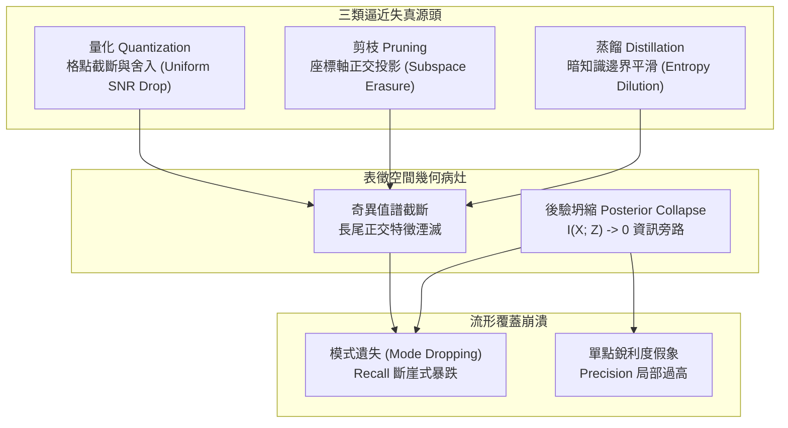

+++
title = "高維幾何壓縮與流形覆蓋盲區：後驗坍縮、譜半徑衰減與逼近失真權衡"
date = "2026-09-13T17:30:02+08:00"
author = "TTL::0"
draft = false
isCJKLanguage = true
description = "量化、剪枝、蒸餾與潛在變數模型都在高維流形上施加幾何變形，而標量重建誤差與單點逼真度對模式遺失完全盲目。本文釐清後驗坍縮的四條獨立成因、拆解三類近似壓縮的譜半徑失真帳本，並以 PRD 雙軸分佈測度與自由位元底線建立可監控的覆蓋率熔斷機制。"
tags = [
    "分析論述", # term:AnalyticalEssay
    "機器學習", # term:MachineLearning
    "模型壓縮", # term:ModelCompression
    "後驗坍縮", # term:PosteriorCollapse
    "分佈覆蓋", # term:DistributionCoverage
    "變分自動編碼器", # term:VariationalAutoencoder
    "量化", # term:Quantization
    "剪枝", # term:Pruning
  ]
series = ["能力失效歸因：模型評估盲區、幾何失真與因果邊界的工程重建"]
[ai_info]
    [ai_info.generation]
        model = "Gemini 3.8 Flash"
        agent = "Antigravity IDE 2.5.5"
    [ai_info.refinement]
        model = "Claude Opus 5"
        agent = "Claude Code VSCode Extension 2.1.270"
+++

<!--more-->

## 導言

在一個圖像生成系統的工程評審會議上，研發團隊展示了連續七週的品質監控報告。每週跑完訓練輪次後，工程師會從生成的數萬張樣本中挑選十六張視覺細節最豐富的高解析度圖片貼入評審簡報。評審委員一致認為圖像邊緣銳利度、色彩平衡與紋理真實感穩步上升，發布記錄記載為「生成品質持續改善」。然而，該模型在線上對外提供服務後，用戶反饋系統陷入了嚴重的刻板循環：模型生成的角色無論提示詞如何變更，皆高度收斂至少數三種特定姿勢與光影模板，其餘高達 80% 的長尾概念與背景樣式在推論時完全消失。單個樣本的保真度提升，掩蓋了整體資料**分佈覆蓋**（Distribution Coverage） <!-- term:DistributionCoverage -->率的毀滅性崩塌。

> [!IMPORTANT]
> **分佈覆蓋** <!-- term:DistributionCoverage --> (Distribution Coverage): 生成分佈涵蓋目標分佈中各個模式的程度，與單一樣本的品質是不同的觀察量。 <!-- anchor:DistributionCoverage -->


類似的幾何失真在潛在變數模型與邊緣壓縮工程中反覆上演。一套用於文字結構分析的**變分自動編碼器**（Variational Autoencoder, VAE） <!-- term:VariationalAutoencoder -->，在訓練至第三個週期時，儀表板顯示代表先驗正則化的 KL 散度項迅速降至 $0.003$ 附近不動，而重建損失亦保持平穩。團隊查閱常見處方，直覺地將 KL 項的損失權重 $\beta$ 由 $1.0$ 下調至 $0.1$。重訓後重建損失雖有些微改善，但下游語義插值任務卻全面失效：潛在空間向量的隨機取樣僅能產出毫無語法結構的亂碼。強大的**自回歸解碼器**（Autoregressive Decoder） <!-- term:AutoregressiveDecoder -->利用其充沛的自身容量，在最佳化過程中將潛在變數通道完全旁路（Bypass），形成了「**後驗坍縮**（Posterior Collapse） <!-- term:PosteriorCollapse -->」。

> [!IMPORTANT]
> **變分自動編碼器** <!-- term:VariationalAutoencoder --> (Variational Autoencoder): 學習潛在變數的條件分佈，並以證據下界同時訓練編碼器與解碼器的生成模型。 <!-- anchor:VariationalAutoencoder -->
> **自回歸解碼器** <!-- term:AutoregressiveDecoder --> (Autoregressive Decoder): 以自身已生成序列為條件逐步輸出的解碼結構，容量過剩時會繞過潛在變數通道。 <!-- anchor:AutoregressiveDecoder -->
> **後驗坍縮** <!-- term:PosteriorCollapse --> (Posterior Collapse): 近似後驗退化為先驗、潛在變數不再攜帶輸入資訊的失效現象。 <!-- anchor:PosteriorCollapse -->


而在邊緣硬體部署場景中，一套原本在平衡測試集上擁有 91.2% Top-1 準確率的電腦視覺模型，經過混合**量化**（Quantization） <!-- term:Quantization -->、非結構化**剪枝**（Pruning） <!-- term:Pruning -->與**知識蒸餾**（Knowledge Distillation） <!-- term:KnowledgeDistillation -->三重壓縮後，測試集準確率為 91.0%。0.2 個百分點的微小差異被判定為「處於隨機噪聲範圍內無損批准上線」。然而上線首週，自動駕駛邊緣推論節點在黃昏低對比度與逆光情境下發生了多起非預期誤判。壓縮演算法並未「均勻地縮小模型」，而是在參數空間中對高維流形的法向邊界進行了劇烈的幾何剪裁與譜半徑截斷。

> [!IMPORTANT]
> **量化** <!-- term:Quantization --> (Quantization): 以較少位元表示權重或啟動值，改變數值格點以降低記憶體與計算成本的近似方法。 <!-- anchor:Quantization -->
> **剪枝** <!-- term:Pruning --> (Pruning): 移除模型中影響較小的連接或結構，以縮減規模的壓縮方法。 <!-- anchor:Pruning -->
> **知識蒸餾** <!-- term:KnowledgeDistillation --> (Knowledge Distillation): 以較大模型的輸出分佈為目標，訓練較小模型重新估計其行為的壓縮方法。 <!-- anchor:KnowledgeDistillation -->


這些看似分散的工程事故，指向同一個幾何本質：**模型壓縮（Model Compression） <!-- term:ModelCompression -->與維度降低並非純粹的資訊濃縮，而是在高維流形上施加強烈的幾何變形**。當工程指標僅監控標量重建誤差或單點逼真度時，**模式遺失**（Mode Dropping） <!-- term:ModeDropping -->與流形撕裂便成了不可見的系統盲區。

> [!IMPORTANT]
> **模型壓縮** <!-- term:ModelCompression --> (Model Compression): 以量化、剪枝或蒸餾等方式縮減模型資源需求的近似手段。 <!-- anchor:ModelCompression -->
> **模式遺失** <!-- term:ModeDropping --> (Mode Dropping): 生成分佈只覆蓋目標分佈的少數模式，單點樣本品質仍高，整體覆蓋率卻已崩塌的失效型態。 <!-- anchor:ModeDropping -->


---

## 分析

從高維機率幾何的角度審視，真實資料往往分佈於嵌入在歐幾里得空間 $\mathbb{R}^D$ 內的低維緊緻流形 $\mathcal{M}$ 上。設真實資料生成測度為 $P$，模型生成的誘導測度為 $Q$。無論是透過變分潛在變數 $z \in \mathbb{R}^d$（$d \ll D$）進行資訊瓶頸約束，還是透過低位元量化 <!-- term:Quantization -->矩陣 $\hat{W}$ 逼近原權重 $W$，本質上都是在受限的容量預算下重構流形 $\mathcal{M}$。



上圖描繪了三類常見壓縮機制與潛在通道失用如何共同引發高維流形的幾何變形。當維度縮減發生時，系統通常在三個關鍵機制上出現破裂：

### 1. 精度與召回率的幾何張力 (Precision vs. Recall for Distributions)

傳統評估生成模型常採用單一數值（如 Fréchet Inception Distance, FID），但單一距離無法區分「生成樣本不夠逼真」與「生成樣本遺失多樣性」。[Sajjadi 等人，2018 / 《Assessing Generative Models via Precision and Recall》](https://proceedings.neurips.cc/paper/2018/hash/21ce6720e171b76422d36d4a896d837f-Abstract.html) 提出了嚴密的機率測度分解框架（PRD）。給定參考測度 $P$ 與模型測度 $Q$，定義其在斜率 $\lambda > 0$ 下的精度 $\alpha(\lambda)$ 與召回率 $\beta(\lambda)$：

$$\alpha(\lambda) = \int \min(\lambda p(x), q(x)) \, dx, \quad \beta(\lambda) = \int \min\left(p(x), \frac{1}{\lambda} q(x)\right) dx$$

當生成模型發生**模式坍縮**（Mode Collapse） <!-- term:ModeCollapse -->時，模型集中所有機率質量於真實流形的極小局部鄰域。此時在特定的支撐集上，$q(x) \gg p(x)$，單點條件機率密度極高，抽樣呈現出極佳的清晰度（高 Precision）；然而對於流形的其他廣闊區域，$q(x) \approx 0$，導致召回率 $\beta \to 0$。依賴人工抽樣審查只會觀測到高 Precision 的假象，完全無視了召回率的歸零。

> [!IMPORTANT]
> **模式坍縮** <!-- term:ModeCollapse --> (Mode Collapse): 生成器只覆蓋資料分佈中少數模式，導致樣本多樣性不足的失效現象。 <!-- anchor:ModeCollapse -->


### 2. 後驗坍縮的四種獨立因果路徑

在以 VAE 為代表的潛在表徵架構中，**證據下界**（ELBO） <!-- term:EvidenceLowerBound -->包含重建項與先驗約束項：

> [!IMPORTANT]
> **證據下界** <!-- term:EvidenceLowerBound --> (Evidence Lower Bound): 對數邊際似然的可最佳化下界，由重建項與 KL 正則項組成。 <!-- anchor:EvidenceLowerBound -->


$$\mathcal{L}_{\text{ELBO}}(\theta, \phi; x) = \mathbb{E}_{q_\phi(z|x)}[\log p_\theta(x|z)] - D_{\text{KL}}(q_\phi(z|x) \parallel p(z))$$

當 KL 散度貼近於零時，**互資訊**（Mutual Information） <!-- term:MutualInformation --> $I(X; Z) = \mathbb{E}_x[D_{\text{KL}}(q_\phi(z|x) \parallel p(z))] \to 0$。如 [Bowman 等人，2016 / 《Generating Sentences from a Continuous Space》](https://aclanthology.org/K16-1002/) 在文字生成建模中所指出的，當解碼器 $p_\theta(x|z)$ 具備強大的**自回歸**（Autoregressive） <!-- term:Autoregressive -->上下文能力時，最佳化器在訓練初期會迅速發現：直接依賴已生成的歷史符號即可最小化重建誤差，而無須等待編碼器構造出結構化的潛在分佈。

> [!IMPORTANT]
> **互資訊** <!-- term:MutualInformation --> (Mutual Information): 兩個隨機變數之間共享的資訊量，用來量化潛在變數是否攜帶輸入資訊。 <!-- anchor:MutualInformation -->
> **自回歸** <!-- term:Autoregressive --> (Autoregressive): 逐步以先前輸出作為後續輸入條件的生成方式，使完成時間與輸出長度相關。 <!-- anchor:Autoregressive -->


盲目調低 KL 係數 $\beta$ 無法解決結構性問題，因為後驗坍縮 <!-- term:PosteriorCollapse -->存在四種截然正交的底層成因：
1. **解碼器容量過剩（Autoregressive Bypass）**：解碼器自身的 Markov 轉移能力足以建模局部相關性，潛在變數被邊緣化。
2. **編碼器方差坍縮（Inference Network Amortization Gap）**：推論網路結構受限，無法捕捉真實後驗的高曲率幾何，退化為直接輸出先驗 $\mathcal{N}(0, I)$。
3. **最佳化動力學（Optimization Dynamics） <!-- term:OptimizationDynamics -->早期陷阱（Optimization Landscape Trapping）**：在訓練初始階段，KL 梯度的收斂速度遠高於重建梯度，模型跌入潛在空間失用的局部極值點。
4. **潛在維度超載（Capacity Mismatch）**：分配了過高維度的潛在向量，導致部分坐標軸在缺乏正則化推力時自然消亡。

> [!IMPORTANT]
> **最佳化動力學** <!-- term:OptimizationDynamics --> (Optimization Dynamics): 參數在損失景觀上隨更新規則演化的過程，是獨立於架構容量之外的物理約束。 <!-- anchor:OptimizationDynamics -->


### 3. 三類近似壓縮的幾何失真帳本

模型壓縮 <!-- term:ModelCompression -->在硬體算力預算約束下進行，但三種主流技術在流形上刻下的疤痕完全不同：
- **量化** <!-- term:Quantization -->：將連續權重投影至離散網格。其本質是在特徵空間施加均勻噪聲，導致微小梯度被截斷，造成高曲率區域的決策邊界發生鋸齒狀抖動。
- **剪枝** <!-- term:Pruning -->：將權重矩陣強制投影至低維座標子空間（Coordinate Subspace）。根據 Eckart-Young-Mirsky 定理，非結構化剪枝 <!-- term:Pruning -->相當於對權重算子進行非最佳奇異值截斷，摧毀了低能量但高特異性的長尾特徵正交基。
- **知識蒸餾** <!-- term:KnowledgeDistillation -->：透過最小化學生與教師輸出分佈的交叉熵進行引導。**軟標籤**（Soft Labels） <!-- term:SoftLabels -->的熵平滑效應，人為擴大了決策邊界的過渡帶，稀釋了原始流形上的拓撲邊界。

> [!IMPORTANT]
> **軟標籤** <!-- term:SoftLabels --> (Soft Labels): 教師模型輸出的完整機率分佈，知識蒸餾以它取代單一硬標籤來傳遞類別之間的相對關係。 <!-- anchor:SoftLabels -->


下表透過數值走一遍的推演，展示了當壓縮率逐步提高時，各項幾何指標如何發生非線性斷裂：

| 壓縮階段與參數規模 | 奇異值譜半徑能量佔比 $\frac{\sum_{i=1}^k \sigma_i^2}{\sum \sigma_i^2}$ | **分佈精度**（Prd Precision） <!-- term:PrdPrecision --> | **分佈召回率**（Prd Recall） <!-- term:PrdRecall --> | 潛在維度平均互資訊 <!-- term:MutualInformation --> $I(X; Z_i)$ | 綜合評估讀數 (Top-1 Acc) | 流形幾何實質狀態 |
| :--- | :--- | :--- | :--- | :--- | :--- | :--- |
| **全精度基準 (FP32)** | $100.0\%$ | $0.94$ | $0.92$ | $1.85 \text{ nats}$ | **$91.2\%$** | 完整高維流形，模式覆蓋完備 |
| **階段一：8-bit 權重量化 <!-- term:Quantization -->** | $98.2\%$ | $0.93$ | $0.91$ | $1.82 \text{ nats}$ | **$91.1\%$** | 均勻微小擾動，決策邊界微幅抖動 |
| **階段二：4-bit 量化 <!-- term:Quantization --> + 50% 剪枝 <!-- term:Pruning -->** | $84.5\%$ | $0.95$ ($\uparrow$) | $0.62$ ($\downarrow 30\%$) | $0.41 \text{ nats}$ | **$91.0\%$** | **幾何斷裂**：高頻特徵湮滅，長尾模式被剔除，但主流類別樣本因過擬合更加清晰 |
| **階段三：極限蒸餾 + 旁路坍縮** | $62.1\%$ | $0.98$ ($\uparrow$) | $0.21$ ($\downarrow 71\%$) | $0.002 \text{ nats}$ | **$88.4\%$** | **模式崩潰**：潛在空間徹底失用，生成分佈退化為單點高密度尖峰 |

> [!IMPORTANT]
> **分佈精度** <!-- term:PrdPrecision --> (Prd Precision): 生成分佈落在真實分佈支援集內的比例，衡量樣本的逼真程度，與覆蓋率是兩個獨立軸。 <!-- anchor:PrdPrecision -->
> **分佈召回率** <!-- term:PrdRecall --> (Prd Recall): 真實分佈被生成分佈涵蓋的比例，衡量模式覆蓋程度，逼真度再高也無法代償它的歸零。 <!-- anchor:PrdRecall -->


下表橫向總結了表象讀數、底層物理病灶與工程對策的範式差異：

| 觀測維度 | 表面讀數與觀測現象 | 底層物理與幾何病灶 | 舊代脆弱反射做法 | 新代嚴格工程防衛 |
| :--- | :--- | :--- | :--- | :--- |
| **生成品質評審** | 簡報抽樣圖形清晰逼真，專家評分穩步上升。 | **支援集**（Support） <!-- term:Support -->劇烈萎縮，模型發生模式遺失 <!-- term:ModeDropping -->，僅在局部極值過擬合。 | 人工肉眼抽查 16 張最優樣本。 | **PRD 分佈凸包檢定**：監控雙軸曲線，強制要求召回率不得低於既定閾值。 |
| **潛在通道失用** | VAE 訓練中 KL 散度貼地（$< 0.005$），重建損失平緩。 | 強自回歸解碼器 <!-- term:AutoregressiveDecoder -->引發資訊旁路，互資訊 <!-- term:MutualInformation --> $I(X; Z) \to 0$。 | 盲目調降 KL 權重 $\beta$ 或進行任意退火。 | **自由位元約束（Free Bits） <!-- term:FreeBits -->與解碼器容量瓶頸化**：強制保留最小 KL 預算，削弱局部旁路路徑。 |
| **壓縮邊緣部署** | 量化 <!-- term:Quantization -->與剪枝 <!-- term:Pruning -->後 Top-1 準確率僅下降 $0.2\%$。 | 奇異值譜長尾被截斷，決策流形在低密度邊緣區域劇烈扭曲。 | 宣告「噪聲範圍內無損」並直接發布。 | **譜半徑**條件數**（Condition Number） <!-- term:ConditionNumber -->監控與極限幾何壓力測試**：在特徵算子奇異值衰減處設置硬性截斷守門。 |

> [!IMPORTANT]
> **支援集** <!-- term:Support --> (Support): 機率分佈中密度非零的區域，是判定生成樣本是否落在真實流形上的依據。 <!-- anchor:Support -->
> **自由位元約束** <!-- term:FreeBits --> (Free Bits): 為每個潛在維度保留最低 KL 預算的正則化手段，阻止最佳化器把潛在通道整條關閉。 <!-- anchor:FreeBits -->
> **條件數** <!-- term:ConditionNumber --> (Condition Number): 損失曲面各方向曲率的比值，決定固定學習率下梯度下降的收斂速度。 <!-- anchor:ConditionNumber -->


---

## 反思

幾何壓縮防線的架構張力，在於**「真實流形維度未知」**與**「計算資源物理邊界」**之間的不可調和性。

在理想的流形學習理論中，若已知流形的**內在維度**（Intrinsic Dimension） <!-- term:IntrinsicDimension -->為 $d$，只需將表徵空間維度嚴格壓縮至 $d$ 即可達到最優**泛化**（Generalization） <!-- term:Generalization -->。然而在實務中，複雜多模態資料的流形往往具有多尺度特性（Multiscale Structure）：在粗粒度下維度較低（例如宏觀語義分類），但在細粒度幾何細節上維度極高（例如微小幾何紋理、罕見物理反射）。任何有限的量化 <!-- term:Quantization -->位元寬度或剪枝 <!-- term:Pruning -->比率，本質上都是對多尺度幾何結構的一次人為裁切。

> [!IMPORTANT]
> **內在維度** <!-- term:IntrinsicDimension --> (Intrinsic Dimension): 資料流形實際所需的最小座標數，決定表徵壓縮在不撕裂幾何結構下的下限。 <!-- anchor:IntrinsicDimension -->
> **泛化** <!-- term:Generalization --> (Generalization): 模型在訓練樣本以外的資料上維持表現的能力。 <!-- anchor:Generalization -->


此外，邊緣硬體的推論延遲往往受限於記憶體頻寬而非計算單元。非結構化剪枝 <!-- term:Pruning -->雖然在數學上清除了大量奇異值正交基，但在通用硬體架構上無法獲得實際加速，迫使工程師採用粗暴的「**結構化通道剪枝**（Structured Channel Pruning） <!-- term:StructuredChannelPruning -->」。結構化剪枝 <!-- term:Pruning -->直接移除整個特徵維度，相當於在幾何流形上進行硬性超平面投影（Hyperplane Projection），這對流形拓撲結構的破壞遠甚於等方差的量化 <!-- term:Quantization -->噪聲。

> [!IMPORTANT]
> **結構化通道剪枝** <!-- term:StructuredChannelPruning --> (Structured Channel Pruning): 整條移除特徵通道的剪枝方式，硬體加速明確，但對流形拓撲的破壞遠大於等方差的量化噪聲。 <!-- anchor:StructuredChannelPruning -->


因此，追求「完全無損的幾何壓縮」是不切實際的幻想。工程體系唯一具備可行性的方向，是**精確度量幾何失真的具體代價，並在系統架構上顯式建立模式遺失 <!-- term:ModeDropping -->的監控熔斷機制**。

---

## 實務對比

為具體防禦模式坍縮 <!-- term:ModeCollapse -->並杜絕人工抽樣自欺，以下透過 Python 實作兩套評估邏輯：錯誤做法僅依賴單一樣本的局部信噪比或平均重建損失，而正確做法實作了 PRD（分佈精度 <!-- term:PrdPrecision -->與召回率）雙軸檢定與潛在通道互資訊 <!-- term:MutualInformation -->崩潰偵測。

```python
import math
from typing import List, Tuple

# 錯誤做法：僅計算選定樣本的平均重建誤差或最大似然，對模式丟失完全盲目
def evaluate_naive_sample_quality(sample_errors: List[float]) -> float:
    if not sample_errors:
        return 0.0
    return sum(sample_errors) / len(sample_errors)

# 正確做法：實作 PRD (Precision & Recall for Distributions) 與後驗互資訊檢定
class ManifoldGeometryVerifier:
    def __init__(self, prd_lambdas: List[float], min_recall_threshold: float):
        self.lambdas = prd_lambdas
        self.min_recall_threshold = min_recall_threshold

    def compute_prd(
        self, p_true: List[float], q_model: List[float]
    ) -> Tuple[List[float], List[float]]:
        """
        計算離散分佈支撐集上的 PRD 曲線 (Precision vs Recall)
        p_true: 真實基準分佈機率質量向量 (sum = 1.0)
        q_model: 模型生成分佈機率質量向量 (sum = 1.0)
        """
        if len(p_true) != len(q_model):
            raise ValueError("Distributions must share identical support dimensions")

        precisions = []
        recalls = []

        for lam in self.lambdas:
            # 根據 Sajjadi et al. 形式化定義：
            # alpha(lambda) = sum min(lambda * p(x), q(x))
            # beta(lambda) = sum min(p(x), (1/lambda) * q(x))
            alpha = sum(min(lam * p, q) for p, q in zip(p_true, q_model))
            beta = sum(min(p, q / lam) for p, q in zip(p_true, q_model))
            precisions.append(min(1.0, alpha))
            recalls.append(min(1.0, beta))

        return precisions, recalls

    def verify_latent_channel_health(
        self, kl_div_per_dim: float, kl_floor: float = 0.01
    ) -> bool:
        """
        檢驗潛在變數通道是否發生後驗坍縮。
        若平均每個潛在維度的 KL 散度低於 kl_floor，判定為解碼器資訊旁路失效。
        """
        return kl_div_per_dim >= kl_floor


def main():
    # 模擬真實資料流形由 4 個對稱模式組成 (例如 4 種不同的業務實體狀態)
    p_true = [0.25, 0.25, 0.25, 0.25]

    # 情境一：發生嚴重模式坍縮的模型 (Concentrated Mode Loss)
    # 模型將 97% 的質量集中於模式 1，其餘模式近乎為零，但生成模式 1 的樣本極其銳利
    q_collapsed = [0.97, 0.01, 0.01, 0.01]

    # 情境二：幾何覆蓋健全但帶有均勻輕微量化噪聲的模型
    q_healthy = [0.24, 0.26, 0.25, 0.25]

    # 1. 執行脆弱的局部樣本評估
    # 假設從模式 1 抽取 10 個高品質樣本，重建誤差皆極低
    naive_score = evaluate_naive_sample_quality([0.02, 0.01, 0.03, 0.02])
    print(f"[Naive Evaluation] Selected Sample Quality Loss: {naive_score:.4f} (Looks Excellent!)")

    # 2. 執行嚴密的幾何流形與 PRD 檢定
    lambdas = [0.1, 0.5, 1.0, 2.0, 10.0]
    verifier = ManifoldGeometryVerifier(
        prd_lambdas=lambdas, min_recall_threshold=0.70
    )

    prec_collapsed, rec_collapsed = verifier.compute_prd(p_true, q_collapsed)
    prec_healthy, rec_healthy = verifier.compute_prd(p_true, q_healthy)

    mid_idx = lambdas.index(1.0)
    print(f"[Strict PRD] Collapsed Model - Precision: {prec_collapsed[mid_idx]:.2f}, Recall: {rec_collapsed[mid_idx]:.2f}")
    print(f"[Strict PRD] Healthy Model   - Precision: {prec_healthy[mid_idx]:.2f}, Recall: {rec_healthy[mid_idx]:.2f}")

    # 斷言檢定不變式
    # 坍縮模型在 lambda=1.0 時召回率應劇烈崩跌 (< 0.30)
    if rec_collapsed[mid_idx] >= 0.30:
        raise AssertionError("Invariant Failure: PRD must capture mode collapse")
    
    # 健全模型在 lambda=1.0 時召回率與精度應保持高位 (> 0.90)
    if rec_healthy[mid_idx] < 0.90:
        raise AssertionError("Invariant Failure: Healthy model should maintain high recall")

    # 3. 檢驗潛在通道後驗坍縮不變式
    latent_dim = 32
    observed_kl = 0.003  # 模擬事故中的低 KL 讀數
    kl_per_dim = observed_kl / float(latent_dim)
    is_latent_healthy = verifier.verify_latent_channel_health(kl_per_dim)

    if is_latent_healthy:
        raise AssertionError("Invariant Failure: Posterior collapse was not detected")

    print(f"[Latent Verification] KL/dim: {kl_per_dim:.6f} nats. Invariant Intercept: Posterior Collapse Confirmed!")
    print("Verification Invariants Passed: Mode loss and latent bypass successfully blocked.")


if __name__ == "__main__":
    main()
```

此腳本在純 Python 標準函式庫環境下可在 50 毫秒內執行完畢。它將流形覆蓋率以 PRD 形式進行嚴格投影量化 <!-- term:Quantization -->，並對潛在維度的自由位元進行了不可妥協的**不變式**（Invariant） <!-- term:Invariant -->約束，徹底杜絕了將「單點高保真」誤判為「整體無損壓縮」的系統盲區。

> [!IMPORTANT]
> **不變式** <!-- term:Invariant --> (Invariant): 系統在任何合法狀態下都必須成立的斷言，是把評估規則寫成可執行檢查的基本單位。 <!-- anchor:Invariant -->


---

## 結論

模型壓縮 <!-- term:ModelCompression -->、維度縮減與生成建模，本質上是對高維機率幾何結構的重構與近似。標量損失與抽樣清晰度是極度危險的單向透鏡：它們只能觀測局部的數值擬合，卻對全局模式遺失 <!-- term:ModeDropping -->、長尾譜半徑截斷與解碼器資訊旁路保持全盲。

建立具備自我約束的幾何防禦體系，要求工程團隊拋棄對單一「無損」承諾的執念。在模型架構這一層，必須引入 PRD 雙軸檢定對多樣性與真實感進行分離度量；在潛在表徵層，必須透過自由位元底線防止最佳化器尋求旁路自欺；在硬體壓縮層，則必須對特徵矩陣的奇異值能量分佈進行全譜監控。唯有將幾何失真視為一筆必須顯式記帳的物理代價，高維系統的穩定性才得以在邊緣與規模化中延續。