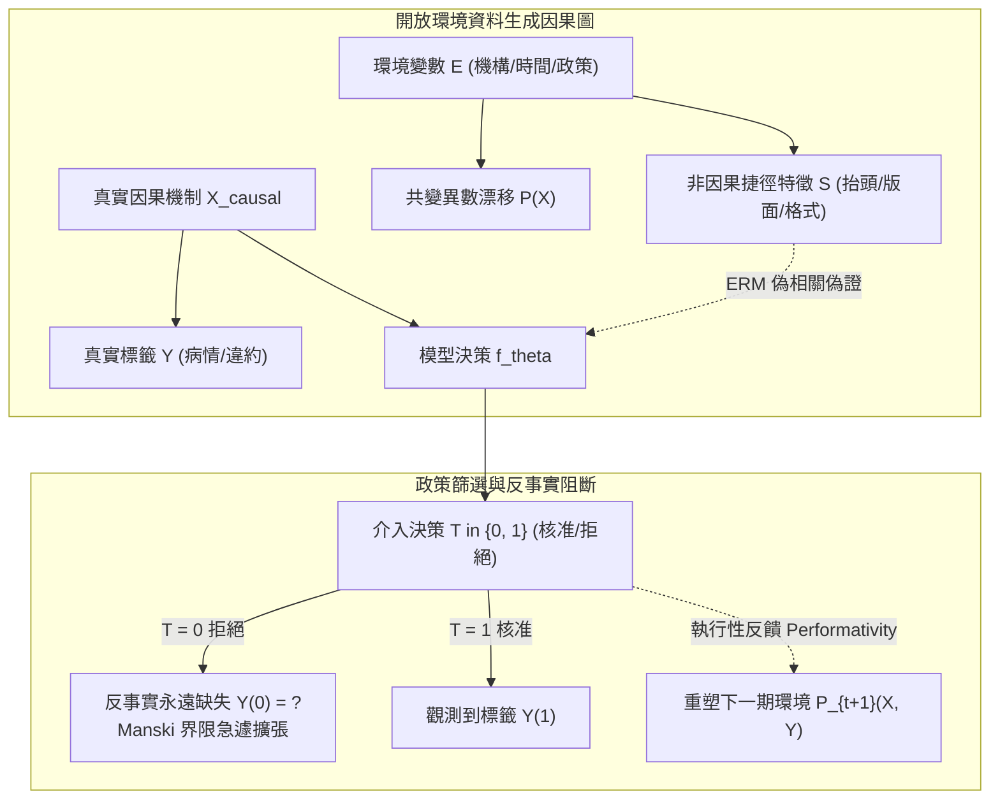

+++
title = "開放環境漂移、反事實缺失與因果不變性：捷徑歸納破滅與部分識別界限"
date = "2026-09-13T17:30:04+08:00"
author = "梅乾"
draft = false
isCJKLanguage = true
description = "經驗風險最小化只保證抓到關聯，不保證因果結構恆常。本文追蹤環境漂移的三條傳播路徑——非因果捷徑吸積、政策篩選造成的標籤缺失與執行性反饋迴路，並以跨環境不變性篩查與 Manski 部分識別界限，把反事實盲區的真實寬度顯式寫進評估指標。"
tags = [
    "分析論述", # term:AnalyticalEssay
    "機器學習", # term:MachineLearning
    "反事實", # term:Counterfactual
    "因果不變性", # term:CausalInvariance
    "部分識別", # term:PartialIdentification
    "偽相關", # term:SpuriousCorrelation
    "選擇偏差", # term:SelectionBias
    "經驗風險", # term:EmpiricalRisk
  ]
series = ["能力失效歸因：模型評估盲區、幾何失真與因果邊界的工程重建"]
term_exclude = ["Quantization", "Screening"]
[ai_info]
    [ai_info.generation]
        model = "Gemini 3.8 Flash"
        agent = "Antigravity IDE 2.5.5"
    [ai_info.refinement]
        model = "Claude Opus 5"
        agent = "Claude Code VSCode Extension 2.1.270"
+++

<!--more-->

## 導言

在某公共醫療機構部署的一套緊急分流文本分類模型，被設計用於根據病患初診卷宗自動判定分流優先順序。訓練資料來自甲機構連續三年的歷史電子病歷，團隊依常規將資料集進行隨機打散切分（Random Split），離線測試集上的準確率高達 97.4%。然而，當該模型被原封不動部署至相鄰城市的乙機構進行試點時，第一天的線上分流準確率直接雪崩至 54.1%，幾乎等同於隨機猜測。緊急事後分析揭示了一個荒誕的現象：甲機構習慣在緊急案件的文檔抬頭加蓋特定紅色掃描條碼，且使用的打字機邊框具有特殊的灰度壓痕。**經驗風險最小化**（ERM） <!-- term:EmpiricalRiskMinimization -->演算法在訓練中貪婪地鎖定了這些極高信噪比的非因果印刷特徵，完全無視了病患症狀的文本描述。當環境切換至無此特定排版慣例的乙機構時，**偽相關**（Spurious Correlation） <!-- term:SpuriousCorrelation -->性（Spurious Correlation）瞬間破裂。

> [!IMPORTANT]
> **經驗風險最小化** <!-- term:EmpiricalRiskMinimization --> (Empirical Risk Minimization): 以訓練樣本上的平均損失最小化代替真實風險最小化的學習原則，只保證擬合關聯，不保證因果結構恆常。 <!-- anchor:EmpiricalRiskMinimization -->
> **偽相關** <!-- term:SpuriousCorrelation --> (Spurious Correlation): 在訓練分佈中與標籤同時出現、但不具因果支撐的統計關聯。 <!-- anchor:SpuriousCorrelation -->


另一類更隱蔽的環境漂移發生於主動防禦系統中。一套用於即時風控反欺詐的預測模型，其模型權重與推論服務在生產環境連續凍結了八個月，期間未發生任何二進位位元變更或設定異動。然而，風控告警的精確率卻從最初的 0.71 單調滑落至 0.48。團隊最初懷疑遭遇了「**概念漂移**（Concept Drift） <!-- term:ConceptDrift -->」，但日誌審查發現詐騙集團在數個月內摸索出了模型攔截的交易金額整數區間與頻率特徵，並策略性地將攻擊行為分散至安全區間。模型的決策行為本身（拒絕或放行）實質重塑了下游環境中的資料生成分佈，形成了惡性的「**執行性預測反饋迴路**（Performative Feedback Loop） <!-- term:PerformativeFeedbackLoop -->」。

> [!IMPORTANT]
> **概念漂移** <!-- term:ConceptDrift --> (Concept Drift): 輸入與標籤之間的條件關係隨時間改變的現象，即使模型權重完全凍結，線上表現仍會持續退化。 <!-- anchor:ConceptDrift -->
> **執行性預測反饋迴路** <!-- term:PerformativeFeedbackLoop --> (Performative Feedback Loop): 模型的預測行為本身改寫了下游資料生成分佈，使後續資料不再獨立於模型決策。 <!-- anchor:PerformativeFeedbackLoop -->


與此同時，金融信貸風控團隊在評估放款違約模型時面臨著認識論上的結構死局。模型被要求預測申請人的違約機率，但訓練資料集中的真實標籤永遠只存在於「被核准放款」的歷史客群中；所有被系統拒絕的申請人，由於從未獲得貸款，其真實還款能力永遠處於未觀測狀態。團隊長期在被核准樣本上計算各類受試者操作特徵曲線（ROC-AUC），並將指標穩定視為模型健康的鐵證。然而，當業務部門嘗試放寬核准門檻以擴大營收時，實際違約率驟升至原先預期的兩倍以上。**「非干預觀測下的反事實（Counterfactual） <!-- term:Counterfactual -->缺失（Missing Counterfactuals）」**在統計評估中製造了一個巨大的無知掩體。

> [!IMPORTANT]
> **反事實** <!-- term:Counterfactual --> (Counterfactual): 在未實際發生的處置下本應出現的結果，是因果宣稱的基準，也是觀測資料中永遠缺失的那一半。 <!-- anchor:Counterfactual -->


這些事故揭示了**統計學習**（Statistical Learning） <!-- term:StatisticalLearning -->的邊界：**經驗風險最小化 <!-- term:EmpiricalRiskMinimization -->只負責尋找關聯，完全不保證因果結構的恆常性**。當系統在開放環境中運作時，捷徑特徵破裂、內生反饋擾動與反事實 <!-- term:Counterfactual -->盲區，將徹底擊潰基於靜態分佈的經驗估計。

> [!IMPORTANT]
> **統計學習** <!-- term:StatisticalLearning --> (Statistical Learning): 把學習寫成資料生成分佈、假設空間與選擇準則三者關係的理論框架。 <!-- anchor:StatisticalLearning -->


---

## 分析

將經驗模型的失效歸因於單純的「資料分佈改變」，往往掩蓋了問題的因果結構本質。設輸入空間為 $\mathcal{X}$，目標變數為 $\mathcal{Y}$，環境或機構上下文為 $e \in \mathcal{E}$。經驗風險最小化（ERM） <!-- term:EmpiricalRiskMinimization -->的目標是在單一觀測環境 $e_{\text{train}}$ 下尋求最優映射：

$$f_{\text{ERM}} = \arg\min_f \mathbb{E}_{(x, y) \sim P_{e_{\text{train}}}} [\ell(f(x), y)]$$

只要特徵集合 $X$ 中存在某個與 $Y$ 高度相關的統計捷徑 $S$（例如特定機構的抬頭戳記），且 $S$ 在 $e_{\text{train}}$ 下的**互資訊**（Mutual Information） <!-- term:MutualInformation -->高於真實因果特徵 $X_{\text{causal}}$，基於**梯度下降**（Gradient Descent） <!-- term:GradientDescent -->的最佳化器必然優先擬合 $S$。

> [!IMPORTANT]
> **互資訊** <!-- term:MutualInformation --> (Mutual Information): 兩個隨機變數之間共享的資訊量，用來量化潛在變數是否攜帶輸入資訊。 <!-- anchor:MutualInformation -->
> **梯度下降** <!-- term:GradientDescent --> (Gradient Descent): 沿損失函數負梯度方向反覆更新參數的最佳化方法。 <!-- anchor:GradientDescent -->




上圖描繪了環境變數、因果特徵、政策篩選與執行性反饋之間的動態傳導關係。為徹底解構環境漂移，必須將其劃分為三種物理機制：

### 1. 捷徑歸納與不變因果預測 (Invariant Causal Prediction)

根據 [Peters 等人，2016 / 《Causal approach to robust regression》](https://rss.onlinelibrary.wiley.com/doi/10.1111/rssb.12158) 所奠定的因果推論理論，一個具備跨環境**泛化**（Generalization） <!-- term:Generalization -->能力的預測模型，其依賴的特徵子集 $S^* \subseteq X$ 必須在所有潛在環境 $e \in \mathcal{E}$ 下滿足條件獨立性**不變式**（Invariant） <!-- term:Invariant -->：

> [!IMPORTANT]
> **泛化** <!-- term:Generalization --> (Generalization): 模型在訓練樣本以外的資料上維持表現的能力。 <!-- anchor:Generalization -->
> **不變式** <!-- term:Invariant --> (Invariant): 系統在任何合法狀態下都必須成立的斷言，是把評估規則寫成可執行檢查的基本單位。 <!-- anchor:Invariant -->


$$P(Y \mid X_{S^*}, E = e) = P(Y \mid X_{S^*}, E = e') \quad \forall e, e' \in \mathcal{E}$$

如果一個特徵子集包含受環境影響的偽相關 <!-- term:SpuriousCorrelation -->變數 $S$（例如 $S \leftarrow E$），則條件分佈 $P(Y \mid X)$ 必然隨環境漂移而震盪。ERM 的根本缺陷在於其對環境標籤 $E$ 採取了邊緣化盲目態度，主動將統計捷徑吸積為主要決策依據。

### 2. 執行性預測與內生反饋動態 (Performative Prediction)

在風控反欺詐等動態博弈場景中，資料生成分佈並非獨立於模型決策的外生變數。如 [Perdomo 等人，2020 / 《Performative Prediction》](https://proceedings.mlr.press/v119/perdomo20a.html) 所形式化的理論框架，模型參數 $\theta$ 會直接導引下游分佈的轉移：

$$P_{\text{data}} = \mathcal{D}(\theta)$$

當系統發布決策規則 $f_\theta$ 時，攻擊者會透過局部黑盒探測尋找決策邊界的最脆弱切平面，進而誘導出分佈轉移 $\mathcal{D}(\theta_t) \to \mathcal{D}(\theta_{t+1})$。這意味著「模型權重不變」恰恰是促成環境漂移的主動因果驅動力，系統本質上處於一個隱式的非平穩馬可夫決策過程中。

### 3. 反事實缺失與 Manski 非參數部分識別界限

當模型介入決策 $T \in \{0, 1\}$ 決定了標籤是否能被觀測時（例如 $T=1$ 表示核准放款，$T=0$ 表示拒絕），目標整體母體的真實期望風險為：

$$\mathbb{E}[Y] = \mathbb{E}[Y \mid T=1] P(T=1) + \mathbb{E}[Y \mid T=0] P(T=0)$$

在非干預觀測數據中，$P(T=1)$ 與 $\mathbb{E}[Y \mid T=1]$ 是可觀測的，但反事實 <!-- term:Counterfactual -->期望值 $\mathbb{E}[Y \mid T=0]$ 處於完全未觀測狀態。根據 [Manski，1990 / 《Nonparametric Bounds on Treatment Effects》](https://www.jstor.org/stable/2006627) 的開創性界限理論，在無任何未經證驗的強模型假設下，若 $Y \in [0, 1]$，則母體真實風險的非參數可識別區間為：

$$\mathbb{E}[Y] \in \left[ \mathbb{E}[Y \mid T=1] P(T=1), \quad \mathbb{E}[Y \mid T=1] P(T=1) + P(T=0) \right]$$

該區間的寬度精確等於被拒絕族群的機率質量 $P(T=0) = 1 - P(T=1)$。這意味著：**核准率越低（篩選越嚴格），未觀測的反事實 <!-- term:Counterfactual -->**不確定性（Uncertainty） <!-- term:Uncertainty -->**區間就越大**。在被篩選樣本上計算的任何驗證分數，本質上都是對真實母體風險的嚴重下界偏誤。

> [!IMPORTANT]
> **不確定性** <!-- term:Uncertainty --> (Uncertainty): 估計值因抽樣與執行變異而帶有的波動範圍，是判定分數差異是否顯著的前提。 <!-- anchor:Uncertainty -->


為展示政策篩選如何人為造成認知遮蔽，下表進行了邊界數值走一遍的推演：

| 篩選政策嚴格度 | 樣本核准率 $P(T=1)$ | 觀測群體違約率 $\mathbb{E}[Y \mid T=1]$ | 未觀測族群佔比 $P(T=0)$ | Manski 不確定性 <!-- term:Uncertainty -->區間下界 | Manski 不確定性 <!-- term:Uncertainty -->區間上界 | 區間總寬度 (盲區跨度) | 系統自欺決策後果 |
| :--- | :--- | :--- | :--- | :--- | :--- | :--- | :--- |
| **寬鬆政策** | $80.0\%$ | $12.0\%$ | $20.0\%$ | $9.6\%$ | $29.6\%$ | $20.0\%$ | 盲區較小，離線指標相對具備可信度 |
| **中度篩選** | $50.0\%$ | $8.0\%$ | $50.0\%$ | $4.0\%$ | $54.0\%$ | $50.0\%$ | 區間覆蓋超過半數，無法確認真實改善 |
| **極端收緊** | $10.0\%$ | **$2.0\%$** (表象極佳) | $90.0\%$ | $0.2\%$ | **$90.2\%$** | **$90.0\%$** | **全面盲目**：看似違約率僅 2%，實則真實風險可能高達 90% |
| **反例：暴力重訓** | 在核准樣本上強行最佳化 ERM，模型進一步利用篩選產物（自相關偽特徵）進行擬合，導致政策稍有調整即發生系統性爆雷。 |

下表橫向總結了面對環境動態與標籤缺失時的範式對抗：

| 評估維度 | 表面讀數與觀測現象 | 底層物理與因果病灶 | 舊代脆弱反射做法 | 新代嚴格工程防衛 |
| :--- | :--- | :--- | :--- | :--- |
| **跨機構泛化 <!-- term:Generalization -->破裂** | 機構 A 測試集準確率 97%，換到機構 B 驟降至 54%。 | ERM 擬合了機構特有的格式與浮水印捷徑（非因果依賴）。 | 將兩家機構資料混合後隨機切分重訓。 | **不變因果預測(ICP) <!-- term:InvariantCausalPrediction --> 檢驗**：在特徵選取中施加跨環境不變性條件約束，剔除虛假關聯。 |
| **凍結權重性能退化** | 模型八個月未改動任何位元，告警精確率從 0.71 降至 0.48。 | 執行性預測反饋（Performative Feedback）重塑了對手策略分佈。 | 責怪資料管道，嘗試高頻定期重訓以「追趕」資料。 | **動態博弈建模與探索性擾動（Epsilon-Greedy）**：顯式監控決策邊界曲率，保留隨機探索空間。 |
| **選擇性標籤缺失** | 僅在核准名單上計算 ROC-AUC，指標連續多年維持 0.88。 | 政策篩選導致反事實 <!-- term:Counterfactual -->未觀測，Manski 界限寬度高達 70%。 | 假定拒絕者分佈與核准者完全同構（MAR 假定）。 | **Manski 最壞界限通報與探索性小額試驗（Reject Inference）**：定期為邊界被拒樣本提供小額介入以獲取反事實 <!-- term:Counterfactual -->標籤。 |

> [!IMPORTANT]
> **不變因果預測** <!-- term:InvariantCausalPrediction --> (Invariant Causal Prediction): 以「條件分佈是否跨環境穩定」為篩選準則，挑出具因果支撐之特徵的推論方法。 <!-- anchor:InvariantCausalPrediction -->


---

## 反思

因果邊界治理的工程張力，在於**「高昂的干預實驗成本」**與**「統計偽相關 <!-- term:SpuriousCorrelation -->的誘人低代價」**之間的永恆衝突。

在真實工業場景中，獲取純淨的因果標籤往往需要付出直接的業務代價。在信貸領域，為了探測被拒絕群體的真實違約率，唯一的科學手段是進行隨機對照實驗（A/B Testing）或提供小額探索性額度，這意味著企業必須主動承擔已知的違約損失資金。在醫療領域，為了驗證演算法是否依賴無關版面特徵，往往需要花費數千小時的專家時間對病歷特徵進行因果遮蔽（Causal Masking）。

相比之下，單純從既有日誌中撈取關聯特徵進行 ERM 擬合，在算力與人力上的成本微乎其微。這種成本的不對稱性，使得工程團隊極易向「虛假的統計捷徑」妥協，並以單一環境下的離線指標做為免責護身符。

然而，當系統進入開放世界時，未被因果錨定的系統必然會向真實環境支付延遲且高昂的違約代價。工程架構的成熟度，正是體現在**「是否有勇氣在指標中顯式揭露反事實 <!-- term:Counterfactual -->盲區的大小」**，而非用偽假設將不確定性 <!-- term:Uncertainty -->包裝成確定性。

---

## 實務對比

為具體阻斷**選擇偏差**（Selection Bias） <!-- term:SelectionBias -->帶來的度量自欺，並顯式計算反事實 <!-- term:Counterfactual -->未觀測區間，以下透過 Node.js (JavaScript) 實作嚴謹的 Manski 非參數**部分識別**（Partial Identification） <!-- term:PartialIdentification -->界限計算器。錯誤做法僅依賴核准樣本做決策，而正確做法實作了全母體最壞邊界推演與盲區寬度不變式 <!-- term:Invariant -->檢驗。

> [!IMPORTANT]
> **選擇偏差** <!-- term:SelectionBias --> (Selection Bias): 從多個候選中挑出表現最好者時，該讀數同時包含真實能力與抽樣噪聲，使其系統性地優於真值的偏差。 <!-- anchor:SelectionBias -->
> **部分識別** <!-- term:PartialIdentification --> (Partial Identification): 在資料不足以唯一確定目標量時，改為推導其所有可能取值的界限，而非給出單點估計。 <!-- anchor:PartialIdentification -->


```javascript
const assert = require("assert");

/**
 * 錯誤做法：僅在政策篩選成功的樣本上計算指標，完全忽略未觀測的反事實族群
 * @param {Array<{approved: boolean, defaulted?: boolean}>} records
 * @returns {number}
 */
function evaluateNaiveObservedRisk(records) {
    let approvedCount = 0;
    let defaultCount = 0;
    for (const r of records) {
        if (r.approved) {
            approvedCount++;
            if (r.defaulted) {
                defaultCount++;
            }
        }
    }
    if (approvedCount === 0) return 0.0;
    return defaultCount / approvedCount;
}

/**
 * 正確做法：實作 Manski 非參數部分識別界限 (Manski Nonparametric Bounds)
 * 顯式量化未觀測反事實對母體真實風險的影響範圍
 */
class ManskiCausalBoundAuditor {
    constructor(maxAllowedBlindWidth = 0.50) {
        this.maxAllowedBlindWidth = maxAllowedBlindWidth;
    }

    /**
     * @param {Array<{id: number, approved: boolean, defaulted?: boolean}>} records
     */
    audit(records) {
        assert(records.length > 0, "Record set cannot be empty");
        const total = records.length;
        let approvedCount = 0;
        let observedDefaults = 0;

        for (const r of records) {
            if (r.approved) {
                approvedCount++;
                if (r.defaulted) {
                    observedDefaults++;
                }
            }
        }

        const pApproved = approvedCount / total;
        const pRejected = 1.0 - pApproved;
        const observedRisk = approvedCount > 0 ? observedDefaults / approvedCount : 0.0;

        // Manski 形式化界限推導：
        // E[Y] = E[Y | T=1] * P(T=1) + E[Y | T=0] * P(T=0)
        // 由於真實標籤 Y in [0, 1]，對未觀測群體 E[Y | T=0] 給定最寬鬆與最嚴格假設：
        const lowerBound = observedRisk * pApproved + 0.0 * pRejected;
        const upperBound = observedRisk * pApproved + 1.0 * pRejected;
        const blindWidth = upperBound - lowerBound;

        const isBlindRiskExcessive = blindWidth > this.maxAllowedBlindWidth;

        return {
            totalSamples: total,
            approvalRate: pApproved,
            observedRiskOnApproved: observedRisk,
            manskiLowerBound: lowerBound,
            manskiUpperBound: upperBound,
            blindWidth: blindWidth,
            isReliableForDecision: !isBlindRiskExcessive,
        };
    }
}

function main() {
    // 模擬 1000 位放款申請人
    // 業務部門實施嚴格篩選：僅核准前 30% 評分最高的申請人 (Approval Rate = 30%)
    const dataset = [];
    for (let i = 0; i < 1000; i++) {
        const approved = i < 300; // 300 人核准，700 人拒絕
        dataset.push({
            id: i,
            approved: approved,
            // 在被核准的優質客戶中，真實違約率僅有 10%
            defaulted: approved ? (i % 10 === 0) : undefined,
        });
    }

    // 1. 執行脆弱的局部觀測評估
    const naiveRisk = evaluateNaiveObservedRisk(dataset);
    console.log(`[Naive Evaluation] Observed Default Risk on Approved: ${(naiveRisk * 100).toFixed(1)}%`);
    // 脆弱做法會宣告「違約率僅 10%，模型極為穩健安全」，從而批准全面擴大業務

    // 2. 執行嚴格的 Manski 因果界限審計
    const auditor = new ManskiCausalBoundAuditor(0.50);
    const report = auditor.audit(dataset);

    console.log(`[Manski Causal Audit] Approval Rate: ${(report.approvalRate * 100).toFixed(1)}%`);
    console.log(`[Manski Causal Audit] True Risk Bounds: [${(report.manskiLowerBound * 100).toFixed(1)}%, ${(report.manskiUpperBound * 100).toFixed(1)}%]`);
    console.log(`[Manski Causal Audit] Counterfactual Blindness Width: ${(report.blindWidth * 100).toFixed(1)}%`);
    console.log(`[Manski Causal Audit] Is Decision Reliable: ${report.isReliableForDecision ? "YES" : "NO (Blocked!)"}`);

    // 斷言不變式檢驗
    assert.strictEqual(report.approvalRate, 0.30, "Approval rate calculation drift");
    assert(Math.abs(report.observedRiskOnApproved - 0.10) < 1e-5, "Observed risk calculation drift");
    assert(Math.abs(report.manskiLowerBound - 0.03) < 1e-5, "Lower bound must equal 0.10 * 0.30 = 0.03");
    assert(Math.abs(report.manskiUpperBound - 0.73) < 1e-5, "Upper bound must equal 0.03 + 0.70 = 0.73");
    assert(Math.abs(report.blindWidth - 0.70) < 1e-5, "Blind width must equal 1 - P(T=1) = 0.70");
    assert.strictEqual(report.isReliableForDecision, false, "Must flag decision as unreliable due to excessive blind width");

    console.log("All Node.js Manski Causal Bounds Invariants Successfully Passed.");
}

main();
```

這段程式碼可在標準 Node.js 環境下秒級執行完畢。它破除了傳統風控中「只看核准後樣本讀數」的盲點，強制將未觀測反事實 <!-- term:Counterfactual -->的不確定性 <!-- term:Uncertainty -->以精確的數值區間顯式暴露於決策管線中，從根本上防禦了盲目擴大決策帶來的系統性崩潰。

---

## 結論

將經驗風險最小化 <!-- term:EmpiricalRiskMinimization -->視為全知預測器，是**機器學習**（Machine Learning） <!-- term:MachineLearning -->系統在開放環境中最具破壞性的工程自欺。統計模型只能捕捉歷史資料中的共變異數，它既無法阻擋非因果印刷捷徑的吸積，也無法在缺乏介入實驗的前提下預知反事實 <!-- term:Counterfactual -->的真實結果；而在主動防禦情境中，靜態的模型權重反而會化為引導對手適應性變異的執行性催化劑。

> [!IMPORTANT]
> **機器學習** <!-- term:MachineLearning --> (Machine Learning): 先界定可選函數的範圍，再以資料估計其中參數的建模方法。 <!-- anchor:MachineLearning -->


構建具備真實抗逆力的工程架構，必須將**「因果不變性（Causal Invariance） <!-- term:CausalInvariance -->驗證」**與**「反事實 <!-- term:Counterfactual -->不確定性 <!-- term:Uncertainty -->界限」**制度化。工程團隊必須強制實施跨環境特徵不變性（ICP）篩查，主動剔除易碎的格式與版面特徵；在面臨政策篩選阻斷標籤時，必須使用 Manski 部分識別 <!-- term:PartialIdentification -->界限顯式披露未觀測盲區的真實寬度，並透過可控的小額隨機干預主動回收反事實 <!-- term:Counterfactual -->信號。唯有超越對純統計相關性的被動依賴，高維系統才能在動態演進的真實世界中確立其存在的邊界。

> [!IMPORTANT]
> **因果不變性** <!-- term:CausalInvariance --> (Causal Invariance): 特徵與標籤的條件分佈在跨環境時保持穩定的性質，是篩除非因果捷徑特徵的判準。 <!-- anchor:CausalInvariance -->
