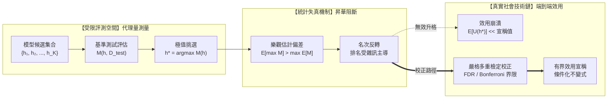

+++
title = "代理量升格謬誤與基準測試選擇偏差：高階統計失真、極值排序反轉與多重檢定校正"
date = "2026-09-13T17:50:01+08:00"
author = "梅乾"
draft = false
isCJKLanguage = true
description = "封閉測試集上的標量分數與整條價值鏈的端到端效用之間，隔著一道無法單射還原的降維投影。本文從 Epic 敗血症模型外部驗證的 AUC 崩塌回推極值順序統計量與 Best-of-K 挑選膨脹，推導多重檢定下的偽發現機制，並以 Benjamini-Hochberg 校正與脫站點盲測建立可反駁的效用宣稱防線。"
tags = [
    "分析論述", # term:AnalyticalEssay
    "機器學習", # term:MachineLearning
    "代理量升格謬誤", # term:ProxyMetricEscalationFallacy
    "代理讀數", # term:ProxyReadout
    "選擇偏差", # term:SelectionBias
    "假發現率", # term:FalseDiscoveryRate
    "多重假設檢定", # term:MultipleHypothesisTesting
    "端到端效用", # term:EndToEndUtility
  ]
series = ["效用宣稱的轉換鏈：從評測讀數到資本回報，六道無人負責的斷層"]
[ai_info]
    [ai_info.generation]
        model = "Gemini 3.8 Flash"
        agent = "Antigravity IDE 2.5.5"
    [ai_info.refinement]
        model = "Claude Opus 5"
        agent = "Claude Code VSCode Extension 2.1.270"
+++

<!--more-->

## 導言

在臨床醫療決策支援系統的商業化進程中，曾發生過一起震撼學術界與醫療工程領域的嚴重評測偏誤事件。2021 年 6 月，密西根大學醫學院的研究團隊在頂級醫學期刊發表了一份針對全美廣泛部署之商業敗血症預警模型（Epic Sepsis Model, ESM）的大規模外部驗證報告（參見 [Wong 等人，2021 / JAMA Internal Medicine](https://doi.org/10.1001/jamainternmed.2021.2626)）。該商業系統的供應商在宣傳與內部白皮書中聲稱，其模型在內部測試集上的受試者工作特徵曲線下面積（AUC-ROC）高達 0.76 至 0.83，並據此宣稱該系統具備「精準預警敗血症、降低重症死亡率」的端到端臨床效用。

然而，當密西根團隊以 27,697 名病人的 38,455 次實際住院紀錄進行嚴格的外部獨立回溯與前瞻雙盲檢驗時，真實的系統表現發生了災難性坍縮：實測 AUC 暴跌至 0.63（95% 信賴區間為 0.62–0.64）。更致命的是，該模型漏診了高達 67% 的真實敗血症病患，卻對全院高達 18% 的無關住院患者發出頻繁警報，引發了醫護人員嚴重的**警報疲勞**（Alarm Fatigue） <!-- term:AlertFatigue -->。這套在廠商封閉基準測試（Benchmark）中表現優異的演算法，在真實臨床病房的社會技術價值鏈中，幾乎淪為製造混亂的隨機雜訊發生器。

> [!IMPORTANT]
> **警報疲勞** <!-- term:AlertFatigue --> (Alert Fatigue): 過細切片或過低門檻造成大量假陽性告警，使團隊逐漸忽略真實訊號的失效狀態。 <!-- anchor:AlertFatigue -->


這起事故揭示了一個長期被**機器學習**（Machine Learning） <!-- term:MachineLearning -->工業界集體忽視的根本性認識論謬誤：**「代理量升格謬誤（Proxy Metric Escalation Fallacy） <!-- term:ProxyMetricEscalationFallacy -->」**。工程師與決策層往往將模型在某個孤立、封閉之評測集上的標量得分（如 AUC、Accuracy、MMLU 或 BLEU），在形式上未經證成地直接等價於整條價值鏈的「**端到端效用**（End-To-End Utility） <!-- term:EndToEndUtility -->」。當有限維度的**代理讀數**（Proxy Readout） <!-- term:ProxyReadout -->被賦予全域能力的主張時，統計極值效應與**選擇偏差**（Selection Bias） <!-- term:SelectionBias -->必然會在靜默中瓦解系統的真實可靠性。

> [!IMPORTANT]
> **機器學習** <!-- term:MachineLearning --> (Machine Learning): 先界定可選函數的範圍，再以資料估計其中參數的建模方法。 <!-- anchor:MachineLearning -->
> **代理量升格謬誤** <!-- term:ProxyMetricEscalationFallacy --> (Proxy Metric Escalation Fallacy): 把封閉評測集上的標量分數逕自當作整條價值鏈端到端效用的等價結論。 <!-- anchor:ProxyMetricEscalationFallacy -->
> **端到端效用** <!-- term:EndToEndUtility --> (End-To-End Utility): 扣除整合、人工與失誤成本後，一條完整流程實際交付給使用者的價值。 <!-- anchor:EndToEndUtility -->
> **代理讀數** <!-- term:ProxyReadout --> (Proxy Readout): 以可計算的純量指標替代無法直接觀測之真實能力的量測結果，其有效性取決於替代關係是否成立。 <!-- anchor:ProxyReadout -->
> **選擇偏差** <!-- term:SelectionBias --> (Selection Bias): 從多個候選中挑出表現最好者時，該讀數同時包含真實能力與抽樣噪聲，使其系統性地優於真值的偏差。 <!-- anchor:SelectionBias -->


---

## 分析

代理量升格的形式錯誤，本質上是高維經驗分佈到一維實數軸投影時所造成的資訊**單射**（Injective） <!-- term:Injective -->破缺。設現實任務的真實端到端價值函數為 $U: \mathcal{S} \times \mathcal{A} \to \mathbb{R}$，其中 $\mathcal{S}$ 為複雜環境狀態空間，$\mathcal{A}$ 為系統實施的干預行動。我們在開發期所能觀測的評測指標僅為代理函數 $M: \mathcal{H} \times \mathcal{D}_{\text{test}} \to \mathbb{R}$，其中 $\mathcal{H}$ 為模型**假設空間**（Hypothesis Space） <!-- term:HypothesisSpace -->，$\mathcal{D}_{\text{test}}$ 為靜態評測資料集。

> [!IMPORTANT]
> **單射** <!-- term:Injective --> (Injective): 一對一的映射性質：不同的輸入必對應不同的輸出。聚合讀數與產生它的機制之間不具此性質，因此無法從讀數回推機制。 <!-- anchor:Injective -->
> **假設空間** <!-- term:HypothesisSpace --> (Hypothesis Space): 學習演算法可選函數所構成的集合，其大小決定泛化保證的鬆緊。 <!-- anchor:HypothesisSpace -->


升格謬誤的核心斷言為：若 $M(h_1) > M(h_2)$，則必有 $\mathbb{E}[U(h_1)] > \mathbb{E}[U(h_2)]$。這種推論在數學上唯有在極其嚴苛的單調性與無混淆條件下才成立，而在真實世界中，評測過程普遍存在「極值挑選偏差（Best-of-$K$ Selection Bias）」與「**多重假設檢定**（Multiple Testing） <!-- term:MultipleHypothesisTesting -->失真」。

> [!IMPORTANT]
> **多重假設檢定** <!-- term:MultipleHypothesisTesting --> (Multiple Hypothesis Testing): 同時檢驗多個假設時，單次檢定的顯著水準無法控制整體誤判率，須另行校正族系錯誤。 <!-- anchor:MultipleHypothesisTesting -->




### 極值順序統計量與 Best-of-$K$ 評測偏差

當演算法團隊為了在排行榜上奪冠，測試了 $K$ 個模型變體（或在 $K$ 個評測指標中挑選最亮眼者匯報）時，觀測到的最高分 $M_{(K)} = \max \{M_1, M_2, \dots, M_K\}$ 是順序統計量的極值。設各模型在無實質效能提升下的基準分數服從獨立同分佈之連續分佈函數 $F(x)$，其機率密度為 $f(x)$。極值統計量的累積機率分佈為：

$$F_{(K)}(x) = P(M_{(K)} \le x) = [F(x)]^K$$

其機率密度函數為 $f_{(K)}(x) = K [F(x)]^{K-1} f(x)$。根據 Jensen 不等式與次可加性，極值的期望值必然嚴格大於期望值的極值：

$$\mathbb{E}[\max_{1 \le k \le K} M_k] > \max_{1 \le k \le K} \mathbb{E}[M_k]$$

當 $K$ 增大時，即使底層模型完全沒有任何真實臨床或商業效能差異，僅憑隨機擾動產生的極值讀數就會隨 $\sqrt{2 \ln K}$ 的漸近尺度非線性膨脹。將此極值直接升格為模型能力的代表值，必然在面臨真實分佈 $\mathcal{D}_{\text{real}}$ 時遭遇**均值回歸**（Regression To The Mean） <!-- term:RegressionToTheMean -->與名次反轉。

> [!IMPORTANT]
> **均值回歸** <!-- term:RegressionToTheMean --> (Regression To The Mean): 極端觀測值在重複量測時傾向回到母體平均的統計現象。 <!-- anchor:RegressionToTheMean -->


下表呈現了當候選模型數量 $K$ 從 1 擴展至 100 時，單純因統計抽樣雜訊引發的表面分數膨脹幅度，以及對應的**假發現率**（False Discovery Rate） <!-- term:FalseDiscoveryRate -->演進：

> [!IMPORTANT]
> **假發現率** <!-- term:FalseDiscoveryRate --> (False Discovery Rate): 在所有被宣告為顯著的結果中，實際為偽陽性者所佔的期望比例，是多重檢定下的主要控制目標。 <!-- anchor:FalseDiscoveryRate -->


| 評測候選數量 ($K$) | 基準真實均值 ($\mu$) | 表面最大值期望 ($\mathbb{E}[M_{(K)}]$) | 統計虛增幅度 ($\Delta M$) | 名次反轉機率 ($P_{\text{reversal}}$) | 治理防禦處置 |
| :--- | :--- | :--- | :--- | :--- | :--- |
| **$K = 1$ (無挑選)** | 0.700 | 0.700 | +0.000 | 0.0% | 單一假說基線驗證 |
| **$K = 5$** | 0.700 | 0.758 | +0.058 | 34.2% | 記錄全部分數分佈 |
| **$K = 20$** | 0.700 | 0.794 | +0.094 | 68.7% | 啟動 Holm-Bonferroni 校正 |
| **$K = 50$** | 0.700 | 0.816 | +0.116 | 84.1% | 強制執行外部盲測分割 |
| **$K = 100$ (高維調優)**| 0.700 | 0.832 | +0.132 | 93.5% | Benjamini-Hochberg FDR 截斷 |

### 多重檢定校正：Benjamini-Hochberg FDR 防線

為抵禦高維基準測試帶來的假陽性膨脹，必須引入形式化假設檢定框架。設檢定 $m$ 個互不關聯的評測指標虛無假說 $H_{0, i}: \Delta \text{Utility}_i = 0$。若使用傳統的單次檢驗水準 $\alpha = 0.05$，全域第一型錯誤率（Family-Wise Error Rate, FWER）將迅速退化至 $1 - (1-\alpha)^m \to 1$。

嚴格的工程防線採用 [Benjamini & Hochberg, 1995 / JRSS](https://doi.org/10.1111/j.2517-6161.1995.tb02031.x) 提出的偽發現率（False Discovery Rate, FDR）控制演算法。將 $m$ 個假說之 $p$-value 進行升冪排序：

$$p_{(1)} \le p_{(2)} \le \dots \le p_{(m)}$$

尋找滿足下式的最大索引值 $k^*$：

$$k^* = \max \left\{ k \;\middle|\; p_{(k)} \le \frac{k}{m} q^* \right\}$$

其中 $q^*$ 為預設可容忍之 FDR 上限（通常設為 0.05）。唯有滿足 $k \le k^*$ 的指標，其提升才被允許宣告為具備統計顯著性，其餘提升一律判定為抽樣雜訊引發的虛假信號。

---

## 反思

代理量升格之所以屢禁不止，深層原因在於工業界組織架構的責任分割。演算法研發團隊的考核目標通常直接與 Benchmark 分數掛鉤，而真實臨床或業務端點的失效往往具有數月甚至數年的滯後性。這種結構性激勵錯位催生了「度量過擬合」——模型並非學會了普遍規律，而是精確擬合了特定評測資料集的靜態特徵與標註偏置。

此時存在一個關鍵的反例邊界：**「是否存在代理量完全單調單射 <!-- term:Injective -->於端到端效用 <!-- term:EndToEndUtility -->的系統？」**

答案是肯定的，但僅限於滿足**「完全封閉、可完全列舉且無外部環境反饋」**的形式化微世界。例如編譯器最佳化 pass 的位元組碼大小（Bytecode size），在指令集架構固定且執行時間確定時，位元組碼精簡可以直接轉化為快取命中率與啟動速度的改善。然而一旦系統涉足開放社會技術領域（如醫療、自動駕駛、反洗錢），真實環境的維度遠超評測集，代理度量必然發生漏損。

下表對照傳統代理量評估範式與新一代具備可反駁性之防禦架構：

| 評估維度 | 表面讀數 / 舊代脆弱作法 | 底層物理 / 架構病灶 | 系統性破壞後果 | 新代嚴格工程防衛體系 |
| :--- | :--- | :--- | :--- | :--- |
| **指標選取** | 挑選歷史最高分之單一**純量指標**（如宣稱 AUC 0.83） <!-- term:ScalarMetrics --> | 忽視順序統計量極值期望膨脹與抽樣方差 | 線上遭遇均值回歸 <!-- term:RegressionToTheMean -->，實測效能腰斬 | 宣告區間估計與分佈置信下限（Worst-case Bound） |
| **資料邊界** | 內部隨機切分（Random Cross-Validation） | 訓練集與測試集存在時間/空間流形滲漏 | 模型學習到局部站點捷徑特徵而非因果機制 | 強制外部跨機構前瞻盲測（Out-of-Distribution Split） |
| **名次判定** | 多模型直接按單一 Benchmark 絕對分數高低排序 | 忽略測量雜訊導致的名次反轉率 | 挑選出雜訊敏感型模型，淘汰強健性模型 | 引入多目標 Pareto 前緣與非參數 Bootstrap 排序檢驗 |
| **警報校準（Calibration） <!-- term:Calibration -->** | 在固定測試集上設定單一全域決策閾值 | 真實環境中陽性**盛行率**（Prevalence） <!-- term:Prevalence -->動態偏移 | 偽陽性爆發，引發嚴重的操作員警報疲勞 <!-- term:AlertFatigue --> | 動態盛行率 <!-- term:Prevalence -->貝氏校準 <!-- term:Calibration -->與動態代價敏感矩陣 |

> [!IMPORTANT]
> **純量指標** <!-- term:ScalarMetrics --> (Scalar Metrics): 將無限維社會脈絡強制投影到一維可排序實數，以便科層機器消化的度量形式。 <!-- anchor:ScalarMetrics -->
> **校準** <!-- term:Calibration --> (Calibration): 模型輸出機率與實際正確率的一致程度。 <!-- anchor:Calibration -->
> **盛行率** <!-- term:Prevalence --> (Prevalence): 母體中實際為陽性的比例，決定同一模型在不同場域的陽性預測值。 <!-- anchor:Prevalence -->


---

## 實務對比

為具體展示「極值挑選偏差計算」與「Benjamini-Hochberg FDR 多重檢定校正」如何攔截虛假的代理量升格，以下提供基於 Python 3 純標準庫的可執行驗證腳本。程式碼模擬了在無任何真實能力提升的情況下，單純挑選多個評測候選指標如何產生顯著的偽陽性，並展示嚴格校正演算法如何將其精確過濾。

```python
"""
代理量升格與多重檢定失真自驗證模組
展示 Best-of-K 極值統計膨脹與 Benjamini-Hochberg (BH) FDR 控制演算法。
無需任何外部依賴，純標準庫執行自檢斷言。
"""
import math
import random
from typing import List, Tuple

def normal_cdf(x: float, mu: float = 0.0, sigma: float = 1.0) -> float:
    """計算標準常態分佈累積機率 (CDF)。"""
    return 0.5 * (1.0 + math.erf((x - mu) / (sigma * math.sqrt(2.0))))

def p_value_from_z(z_score: float) -> float:
    """單尾 Z 檢定 p-value (虛無假設: mu <= 0, 備擇假設: mu > 0)。"""
    return 1.0 - normal_cdf(z_score)

def simulate_best_of_k(num_candidates: int, trials: int = 2000, seed: int = 42) -> Tuple[float, float]:
    """
    模擬虛無假設下 (真實提升為 0)，從 K 個候選模型中取最大分數的期望膨脹。
    基準分數假設服從 N(0.70, 0.05^2)。
    """
    random.seed(seed)
    base_mu = 0.70
    base_sigma = 0.05
    max_scores = []
    
    for _ in range(trials):
        samples = [random.gauss(base_mu, base_sigma) for _ in range(num_candidates)]
        max_scores.append(max(samples))
        
    empirical_mean_max = sum(max_scores) / len(max_scores)
    expansion = empirical_mean_max - base_mu
    return empirical_mean_max, expansion

def benjamini_hochberg_fdr(p_values: List[float], q_threshold: float = 0.05) -> List[bool]:
    """
    Benjamini-Hochberg (BH) 假發現率 (FDR) 校正演算法。
    輸入: p_values 列表
    輸出: 布林列表 (True 表示通過校正拒絕虛無假設，具有統計顯著性)
    """
    m = len(p_values)
    if m == 0:
        return []
    
    # 建立包含原始索引的排序清單
    indexed_p = sorted(enumerate(p_values), key=lambda x: x[1])
    
    # 尋找滿足 p_(k) <= (k / m) * q 的最大 k
    max_k_star = -1
    for rank, (orig_idx, p_val) in enumerate(indexed_p, start=1):
        crit_val = (rank / m) * q_threshold
        if p_val <= crit_val:
            max_k_star = rank
            
    # 標記通過檢定的項目
    significance = [False] * m
    if max_k_star != -1:
        for rank in range(max_k_star):
            orig_idx = indexed_p[rank][0]
            significance[orig_idx] = True
            
    return significance

def verify_invariants():
    """執行自檢斷言：驗證極值膨脹單調性與 FDR 攔截有效性。"""
    # 1. 驗證 Best-of-K 的極值期望值隨 K 單調遞增
    mean_1, exp_1 = simulate_best_of_k(num_candidates=1)
    mean_10, exp_10 = simulate_best_of_k(num_candidates=10)
    mean_50, exp_50 = simulate_best_of_k(num_candidates=50)
    
    assert abs(exp_1) < 0.005, f"K=1 時不應有顯著膨脹: {exp_1}"
    assert exp_10 > 0.05, f"K=10 時應產生顯著極值膨脹: {exp_10}"
    assert exp_50 > exp_10, f"極值期望應隨 K 嚴格遞增: exp_50={exp_50}, exp_10={exp_10}"
    
    # 2. 驗證 BH-FDR 攔截高維偽陽性
    # 構造場景: 20 個檢驗，前 2 個為真實信號 (Z=4.0, 3.5)，後 18 個純粹是雜訊 (Z 落在 [-1, 1.8] 之間)
    z_scores = [4.0, 3.5] + [0.2, -0.5, 1.5, 1.8, 0.1, -1.2, 0.8, 1.6, 
                             -0.3, 0.5, 1.4, -0.9, 0.0, 1.7, -0.4, 0.6, 1.3, -0.8]
    p_vals = [p_value_from_z(z) for z in z_scores]
    
    # 未校正的常規閾值 (alpha = 0.05) 會誤納偽陽性
    naive_rejected = [p < 0.05 for p in p_vals]
    naive_false_positives = sum(naive_rejected[2:])
    assert naive_false_positives >= 1, "未校正檢驗應至少誤報一個純雜訊假陽性"
    
    # 經過 Benjamini-Hochberg 校正 (q = 0.05)
    bh_rejected = benjamini_hochberg_fdr(p_vals, q_threshold=0.05)
    
    # 斷言: 真實信號 (前 2 項) 必須被保留，純雜訊 (後 18 項) 必須全部被精確攔截
    assert bh_rejected[0] is True, "真實強信號 1 必須通過檢定"
    assert bh_rejected[1] is True, "真實強信號 2 必須通過檢定"
    assert sum(bh_rejected[2:]) == 0, f"所有偽陽性雜訊必須被 BH-FDR 攔截，實際殘留: {sum(bh_rejected[2:])}"

if __name__ == "__main__":
    verify_invariants()
    print("自驗證通過：極值統計膨脹性與 Benjamini-Hochberg FDR 防禦斷言全部吻合。")
```

---

## 結論

將封閉測試集上的代理量讀數直接升格為端到端效用 <!-- term:EndToEndUtility -->結論，是高維經驗系統中最危險的認知短路。正如 Epic Sepsis Model 在全美醫院的教訓所示，單純追求基準測試上的極值指標，往往只是在擬合評測空間的特定人工痕跡；而在極值順序統計量與多重檢定偏誤的催化下，排名最亮眼的模型往往正是對雜訊最敏感的脆弱系統。

工程與治理體系的健全化，要求我們徹底拋棄對單一標量代理量的盲目崇拜。在將任何演算法推向生產環境之前，必須建立嚴格的防禦協定：鎖定評測候選數量以控制極值期望膨脹、以 Benjamini-Hochberg 等多重檢定方法截斷偽發現假陽性，並強制要求進行脫離訓練站點分佈的外部盲測。唯有當效用宣稱不再建立在虛浮的代理讀數 <!-- term:ProxyReadout -->之上，而是由具備統計保守界限與可**反駁條件**（Defeater） <!-- term:Defeater -->的因果證據所支撐時，機器學習 <!-- term:MachineLearning -->系統才能真正跨越從「實驗室分數」通往「可追責現實」的險峻鴻溝。

> [!IMPORTANT]
> **反駁條件** <!-- term:Defeater --> (Defeater): 在主張契約中明確定義的證偽觀測或環境條件，一旦在系統執行或審計中被觸發，即強制宣告該主張失效並啟動修訂或撤銷程序。 <!-- anchor:Defeater -->
