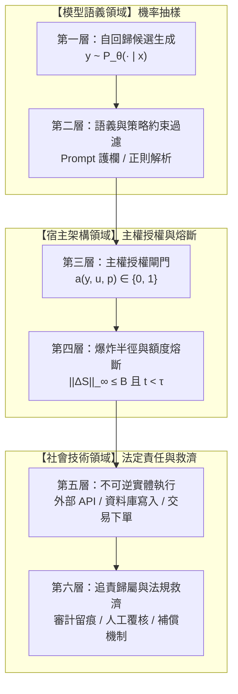

+++
title = "社會技術交付鏈與主權授權閘門：輸出後果化、爆炸半徑約束與停止時間不變式"
date = "2026-09-13T17:50:02+08:00"
author = "梅乾"
draft = false
isCJKLanguage = true
description = "候選文字要成為不可逆的實體行動，必須穿過六層交付邊界，而授權函數從來不在模型權重裡。本文以 Knight Capital 的 45 分鐘與 MD Anderson 的六千二百萬美元為軸，形式化主權授權閘門的狀態機不變式，並以鞅論停止時間與爆炸半徑限額推導不可旁路的熔斷條件。"
tags = [
    "分析論述", # term:AnalyticalEssay
    "大型語言模型", # term:LargeLanguageModel
    "爆炸半徑", # term:BlastRadius
    "停止時間", # term:StoppingTime
    "主權終止開關", # term:SovereignKillSwitch
    "型別狀態模式", # term:TypeStatePattern
    "信任邊界", # term:TrustBoundary
    "安全失效", # term:FailSafe
  ]
series = ["效用宣稱的轉換鏈：從評測讀數到資本回報，六道無人負責的斷層"]
[ai_info]
    [ai_info.generation]
        model = "Gemini 3.8 Flash"
        agent = "Antigravity IDE 2.5.5"
    [ai_info.refinement]
        model = "Claude Opus 5"
        agent = "Claude Code VSCode Extension 2.1.270"
+++

<!--more-->

## 導言

在高度自動化金融交易與關鍵決策系統的歷史上，缺乏獨立主權授權閘門所釀成的災難，以 2012 年 8 月 1 日 Knight Capital 的交易系統崩潰事件最為慘烈。根據美國證券交易委員會（SEC）的正式調查與處分報告（參見 [U.S. SEC, 2013 / Release No. 70694 (Knight Capital Administrative Proceeding)](https://www.sec.gov/litigation/admin/2013/34-70694.pdf)），在美股開盤短短 45 分鐘之內，該公司的自動化交易程式向市場瘋狂送出了約 400 萬筆錯誤執行指令，涵蓋 154 檔股票，淨買入高達數十億美元的有價證券，最終被迫在市場上折價平倉，造成了 4.6 億美元的毀滅性淨虧損，並直接導致這家老牌造市商陷入破產並遭收購。

調查揭露了一條令人震驚的因果鏈：工程團隊在部署更新時，將新程式碼推送到八台伺服器中的七台，第八台伺服器上殘留了一段已退役長達九年的測試程式碼（Power Peg）；更嚴重的是，新舊程式碼共用了一個未經重構的設定旗標。當開盤指令湧入時，第八台伺服器將客戶訂單錯誤解讀為「無需等待市場成交回報、無限高速市價吃單」。而在這致命的 45 分鐘內，系統發出的 97 封自動警示郵件被無人值守的郵件群組忽視，且系統架構內部**完全不存在任何全域交易額度熔斷機制（Global Blast Radius Limiter）或主權終止開關（Sovereign Kill Switch） <!-- term:SovereignKillSwitch -->**。生成訊號的演算法與執行實體操作的外部環境之間，缺乏一層不可繞過的物理防護。

> [!IMPORTANT]
> **主權終止開關** <!-- term:SovereignKillSwitch --> (Sovereign Kill Switch): 獨立於模型與應用程式之外、可無條件切斷一切後續執行的終止裝置。 <!-- anchor:SovereignKillSwitch -->


類似的「交付邊界錯覺」在企業級人工智慧導入中亦屢見不鮮。2017 年 2 月，德州大學系統內部稽核室發布了針對德州大學安德森癌症中心（MD Anderson）與 IBM 合作「腫瘤學專家顧問（Oncology Expert Advisor）」專案的專案稽核報告（參見 [UT System Audit Office, 2017 / MD Anderson IBM Watson Audit](https://www.utsystem.edu/sites/default/files/documents/UT%20System%20Audit%20Reports/2017/17-audit-mdanderson-watson.pdf)）。該院累計支付了超過 6,200 萬美元的研發與諮詢費用，然而該認知運算系統最終徹底未能投入臨床日常使用。審計揭示，專案團隊誤以為採購了「具備臨床推理能力的智慧核心」，卻忽視了模型輸出要轉化為符合醫療法規、與電子病歷（EMR）深度整合、具備醫師法定簽核與追責界面的社會技術交付鏈長達六個層級。

這兩起事故共同驗證了系統工程的不變真理：**「文字或數字輸出，與實體世界的不可逆後果之間，隔著一道巨大的社會技術交付鴻溝」**。若不建立具備形式化**停止時間**（Stopping Time） <!-- term:StoppingTime -->與嚴格**爆炸半徑**（Blast Radius） <!-- term:BlastRadius -->約制的獨立授權狀態機，任何先進演算法的輸出都可能在毫秒之間演化為摧毀組織的實體災難。

> [!IMPORTANT]
> **停止時間** <!-- term:StoppingTime --> (Stopping Time): 只依賴當前與過去觀測即可判定是否到達的時刻，用以把熔斷條件寫成不需預知未來的判準。 <!-- anchor:StoppingTime -->
> **爆炸半徑** <!-- term:BlastRadius --> (Blast Radius): 單次或累積操作在失控時所能造成的最大損害範圍，是授權閘門必須先行界定的硬上限。 <!-- anchor:BlastRadius -->


---

## 分析

文字輸出向實體後果的躍遷，本質上是一個不可逆的狀態轉移過程。在**機器學習**（Machine Learning） <!-- term:MachineLearning -->系統中，模型生成本質上只是給定上下文機率分佈下的抽樣過程：$y \sim P_\theta(\cdot \mid x)$。然而，軟體工程與法律契約中的「交付」定義，要求系統將實體環境狀態從 $S_t$ 轉換為 $S_{t+1}$。

> [!IMPORTANT]
> **機器學習** <!-- term:MachineLearning --> (Machine Learning): 先界定可選函數的範圍，再以資料估計其中參數的建模方法。 <!-- anchor:MachineLearning -->


模型本身無法對現實承擔責任；承擔法律、財務與安全後果的，永遠是宿主軟體、運營組織與合規實體。因此，模型輸出絕不能直接綁定外部 API 或執行單元，必須經過形式化的「六層社會技術交付鏈」：



### 主權授權函數與爆炸半徑約束模型

定義授權閘門為宿主系統上的布林決策函數：

$$a(y, u, p): \mathcal{Y} \times \mathcal{U} \times \mathcal{P} \to \{0, 1\}$$

其中 $y \in \mathcal{Y}$ 為模型提出的候選行動建議，$u \in \mathcal{U}$ 為當前操作員的認證身份與權限等級，$p \in \mathcal{P}$ 為當前環境的動態風險參數。**授權函數的邏輯必須物理脫耦於模型權重之外**，模型永遠只能是請求者（Requester），不能是裁決者（Arbiter）。

實體狀態變更的影響幅度受「爆炸半徑 <!-- term:BlastRadius -->」$B$ 嚴格約束。設狀態空間 $\mathcal{S}$ 上定義度量衡范數 $\|\cdot\|$，對於任何時間步 $t$ 允許執行的狀態變遷 $\Delta S_t = S_{t+1} - S_t$，必須滿足**不變式**（Invariant） <!-- term:Invariant -->：

> [!IMPORTANT]
> **不變式** <!-- term:Invariant --> (Invariant): 系統在任何合法狀態下都必須成立的斷言，是把評估規則寫成可執行檢查的基本單位。 <!-- anchor:Invariant -->


$$\| \Delta S_t \|_\infty \le B_{\text{single}}, \quad \sum_{i=t - W}^t \| \Delta S_i \| \le B_{\text{window}}$$

即單次操作的破壞上限由 $B_{\text{single}}$ 鎖死，且滑動窗口 $W$ 內的累積操作不得超過 $B_{\text{window}}$。

### 停止時間（Stopping Time）的鞅論邊界

系統的持續運行時間構成一個隨機過程。定義安全停止時間 <!-- term:StoppingTime --> $\tau$（Stopping Time）為適應於過濾資訊流 $\mathcal{F}_t$ 的隨機變數：

$$\tau = \inf \left\{ t \ge 0 \;\middle|\; \sum_{s=1}^t \ell(S_s, y_s) \ge L_{\max} \;\lor\; \text{Latency}(t) \ge T_{\text{timeout}} \;\lor\; \text{AlertCount}(t) \ge N_{\text{crit}} \right\}$$

其中 $\ell(S_s, y_s)$ 為執行的損失度量。一旦達到停止時間 <!-- term:StoppingTime --> $\tau$，系統狀態機必須在編譯期或硬體中斷層面觸發「**安全失效**（Fail-Safe） <!-- term:FailSafe -->」，立即進入終止狀態，剝奪模型的一切後續調用權限。Knight Capital 的致命崩潰，正是因為缺乏停止時間 <!-- term:StoppingTime --> $\tau$ 的工程定義，放任累積虧損在 45 分鐘內突破資本防線。

> [!IMPORTANT]
> **安全失效** <!-- term:FailSafe --> (Fail-Safe): 系統偵測到異常時主動進入已知安全的終止狀態，而非嘗試繼續運轉。 <!-- anchor:FailSafe -->


下表呈現了交易與決策系統在不同輸入極端條件下，主權授權閘門與狀態機的轉移推演走一遍：

| 邊界案例輸入 | 系統初始狀態 | 關鍵判定條件 / 不變式 <!-- term:Invariant -->檢查 | 狀態機轉移路徑 | 最終處置結果與系統輸出 |
| :--- | :--- | :--- | :--- | :--- |
| **案例 A：常規安全指令** | `State::Active` | $\| \Delta S \| = \$5,000 \le B_{\text{single}}$ 且 $t < \tau$ | __CODE_BLOCK_3__ $\to$ `Authorized` | 放行執行，記錄審計日誌 |
| **案例 B：單筆突發巨額訂單** | `State::Active` | $\| \Delta S \| = \$2,000,000 > B_{\text{single}}$ | __CODE_BLOCK_6__ $\to$ `Rejected` | 拒絕下單，向操作員發出二級告警 |
| **案例 C：高頻微小指令湧入** | `State::Active` | 單筆符合，但 $\sum_{W} \| \Delta S \| > B_{\text{window}}$ | `Active` $\to$ `RateLimited` | 暫停該租戶連線 60 秒，冷卻重試 |
| **案例 D：連續異常報錯觸發** | `State::RateLimited` | 累積未處置錯誤 $\ge N_{\text{crit}}$ ($t \ge \tau$) | `RateLimited` $\to$ `Tripped` (熔斷) | 觸發硬體級停止時間 <!-- term:StoppingTime -->，切斷網路輸出 |
| **案例 E：已熔斷下的外部請求** | `State::Tripped` | 狀態機不變式 <!-- term:Invariant -->：`Tripped` 狀態禁止狀態變遷 | 拒絕所有請求，維持 `Tripped` | 強制人工物理密鑰重設，杜絕自動重啟 |

---

## 反思

在軟體架構實務中，工程師經常混淆「業務層過濾器」與「主權授權閘門」。許多系統僅在提示詞（Prompt）中加入「請不要執行危險操作」，或在模型輸出後使用簡單的**正則表達式**（Regex） <!-- term:Regex -->檢測關鍵字。這種做法的脆弱性在於：將安全性寄託於**自回歸**（Autoregressive） <!-- term:Autoregressive -->語言模型的語義依從度上，本質上是在**信任邊界**（Trust Boundary） <!-- term:TrustBoundary -->內部尋求安全。

> [!IMPORTANT]
> **正則表達式** <!-- term:Regex --> (Regex): 用於在文字中進行樣式比對、搜尋與替換的特殊字元序列語法。 <!-- anchor:Regex -->
> **自回歸** <!-- term:Autoregressive --> (Autoregressive): 逐步以先前輸出作為後續輸入條件的生成方式，使完成時間與輸出長度相關。 <!-- anchor:Autoregressive -->
> **信任邊界** <!-- term:TrustBoundary --> (Trust Boundary): 可信狀態成立的分界：輸出穿過驗證流程、權責邊界與非同源裁決後才取得「可信」狀態，可信並非文字本身的屬性，而是被授權後的結果。 <!-- anchor:TrustBoundary -->


此處必須釐清一個架構極限案例：**「何時嚴格的主權授權閘門會帶來系統性負效應？」**

當系統面臨「需要亞毫秒級極致吞吐，且所有操作皆完全具備補償事務（Compensating Transactions）的可逆場景」時，例如分散式非關聯快取預讀或可丟棄的日誌索引，強型別授權狀態機的同步開銷可能成為效能瓶頸。然而，一旦操作涉及**資金轉帳、硬體機械移動、法律權利變更或病患處方下達**，所有狀態變遷皆具備強烈的**不可逆性**（Irreversibility） <!-- term:Irreversibility -->。在不可逆領域中，任何以「降低延遲」為由弱化授權閘門的做法，都是以整個組織的生存權進行高風險賭博。

> [!IMPORTANT]
> **不可逆性** <!-- term:Irreversibility --> (Irreversibility): 評估系統變更或主張升格風險的核心維度，指狀態改變或操作執行後無法透過反向操作完全復原的程度，決定了准入閘門所需的最小外部證據與授權層級。 <!-- anchor:Irreversibility -->


下表對比傳統脆弱的交付架構與強型別主權授權防線的本質差異：

| 邊界維度 | 表面讀數 / 舊代脆弱作法 | 底層物理 / 架構病灶 | 潛在破壞後果 | 新代嚴格工程防衛體系 (Rust 型別防線) |
| :--- | :--- | :--- | :--- | :--- |
| **邊界劃分** | 模型直接調用底層資料庫或外部金融 API | 混淆建議者（Proposer）與決策者（Arbiter） | 提示詞注入或**幻覺**（Hallucination） <!-- term:Hallucination -->直接誘發破壞性變更 | 編譯期**型別狀態**（Typestate） <!-- term:Typestate -->機，輸出僅作為未經授權建議 |
| **額度限制** | 依賴單次 API 呼叫的參數大小做簡易驗證 | 忽視時間維度累積之爆炸半徑（滑動窗口耗竭） <!-- term:BlastRadius --> | 巨量微小交易在短時間內掏空系統儲備 | 全域原子計數器，鎖死單次與滑動窗口爆炸半徑 <!-- term:BlastRadius --> |
| **異常處置** | 記錄非致命日誌或傳送未被排查的警告郵件 | 缺乏形式化停止時間 <!-- term:StoppingTime -->狀態轉移 | Knight Capital 式無人值守 45 分鐘崩潰 | 嚴格停止時間 <!-- term:StoppingTime --> $\tau$ 鞅論邊界，累積錯誤硬性跳脫熔斷 |
| **復原機制** | 程式崩潰後由守護行程（Supervisor）無腦重啟 | 重新啟動後再次執行造成故障的毒丸指令 | **毒丸循環**（Crash Loop） <!-- term:CrashLoop -->加速資源耗竭 | 熔斷狀態需不可旁路之管理員實體憑據手動復位 |

> [!IMPORTANT]
> **幻覺** <!-- term:Hallucination --> (Hallucination): 大型語言模型在面對不實或矛盾資訊時，生成不符合客觀現實或超出脈絡之回應的錯誤現象。 <!-- anchor:Hallucination -->
> **型別狀態** <!-- term:Typestate --> (Typestate): 將物件的執行期狀態與生命週期約束編碼至靜態型別系統中，使非法狀態轉移在編譯期即被攔截的技術。 <!-- anchor:Typestate -->
> **毒丸循環** <!-- term:CrashLoop --> (Crash Loop): 崩潰後自動重啟又再次執行同一致命輸入，使故障在重試中被無限放大的循環。 <!-- anchor:CrashLoop -->


---

## 實務對比

為證明主權授權閘門在編譯期與執行期提供的不變式 <!-- term:Invariant -->保障，以下提供基於 **Rust 2021 Edition** 的自包含工程實作。程式碼利用 Rust 嚴格的所有權（Ownership）與**型別狀態模式**（Type-State Pattern） <!-- term:TypeStatePattern -->，在編譯期杜絕未經授權的指令執行，並在執行期動態計算單筆與累積爆炸半徑 <!-- term:BlastRadius -->，一旦觸碰停止時間 <!-- term:StoppingTime -->條件立即觸發不可旁路的硬熔斷。

> [!IMPORTANT]
> **型別狀態模式** <!-- term:TypeStatePattern --> (Type-State Pattern): 把物件的合法狀態編碼進型別，使未經授權的狀態轉移在編譯期就無法表達。 <!-- anchor:TypeStatePattern -->


```rust
// 社會技術交付邊界：主權授權閘門與爆炸半徑熔斷器實作 (Rust 2021)
// 零外部依賴，純標準庫，自包含驗證邏輯

use std::sync::atomic::{AtomicBool, AtomicU64, Ordering};

#[derive(Debug, Clone, PartialEq)]
pub struct ActionProposal {
    pub action_id: u64,
    pub financial_impact: u64, // 單位：美元
    pub payload: String,
}

// 型別狀態：未授權建議
#[derive(Debug)]
pub struct Proposed;
// 型別狀態：經主權閘門驗證合格
#[derive(Debug)]
pub struct Authorized;

// 強型別行動封裝，只有具備 Authorized 標記才能被執行單元消費
#[derive(Debug)]
pub struct ActionEnvelope<State> {
    proposal: ActionProposal,
    _marker: std::marker::PhantomData<State>,
}

impl ActionEnvelope<Proposed> {
    pub fn new(proposal: ActionProposal) -> Self {
        Self {
            proposal,
            _marker: std::marker::PhantomData,
        }
    }
}

// 主權授權閘門
pub struct SovereignGate {
    max_single_impact: u64,
    max_accumulated_impact: u64,
    current_accumulated: AtomicU64,
    error_count: AtomicU64,
    max_errors_before_trip: u64,
    is_tripped: AtomicBool,
}

impl SovereignGate {
    pub fn new(max_single: u64, max_accumulated: u64, max_errors: u64) -> Self {
        Self {
            max_single_impact: max_single,
            max_accumulated_impact: max_accumulated,
            current_accumulated: AtomicU64::new(0),
            error_count: AtomicU64::new(0),
            max_errors_before_trip: max_errors,
            is_tripped: AtomicBool::new(false),
        }
    }

    // 核心審查函數：將 Proposed 躍遷為 Authorized，若違規直接拒絕
    pub fn authorize(
        &self,
        envelope: ActionEnvelope<Proposed>,
    ) -> Result<ActionEnvelope<Authorized>, &'static str> {
        // 1. 檢查硬體級熔斷停止時間
        if self.is_tripped.load(Ordering::SeqCst) {
            return Err("GATE_TRIPPED_EMERGENCY_HALT");
        }

        let impact = envelope.proposal.financial_impact;

        // 2. 單筆爆炸半徑檢查
        if impact > self.max_single_impact {
            self.record_error();
            return Err("BLAST_RADIUS_SINGLE_EXCEEDED");
        }

        // 3. 累積爆炸半徑原子更新與檢查
        let mut current = self.current_accumulated.load(Ordering::SeqCst);
        loop {
            if current + impact > self.max_accumulated_impact {
                self.record_error();
                return Err("BLAST_RADIUS_ACCUMULATED_EXCEEDED");
            }
            match self.current_accumulated.compare_exchange_weak(
                current,
                current + impact,
                Ordering::SeqCst,
                Ordering::SeqCst,
            ) {
                Ok(_) => break,
                Err(actual) => current = actual,
            }
        }

        // 通過所有不變式檢查，型別狀態提升
        Ok(ActionEnvelope {
            proposal: envelope.proposal,
            _marker: std::marker::PhantomData,
        })
    }

    fn record_error(&self) {
        let errs = self.error_count.fetch_add(1, Ordering::SeqCst) + 1;
        if errs >= self.max_errors_before_trip {
            self.is_tripped.store(true, Ordering::SeqCst);
        }
    }

    pub fn is_halted(&self) -> bool {
        self.is_tripped.load(Ordering::SeqCst)
    }
}

// 實體執行單元：編譯期保證只接受 Authorized 狀態的信封
pub struct ExecutionEngine;

impl ExecutionEngine {
    pub fn execute(envelope: ActionEnvelope<Authorized>) -> u64 {
        // 實體下單或不可逆寫入
        envelope.proposal.financial_impact
    }
}

fn main() {
    // 初始化授權閘門：單筆上限 10,000，全域上限 25,000，容忍 2 次違規即熔斷
    let gate = SovereignGate::new(10_000, 25_000, 2);

    // 1. 合法正常操作
    let p1 = ActionProposal { action_id: 1, financial_impact: 8_000, payload: "BUY AAPL".into() };
    let env1 = ActionEnvelope::new(p1);
    let auth1 = gate.authorize(env1).expect("應該授權通過");
    assert_eq!(ExecutionEngine::execute(auth1), 8_000);

    // 2. 違規操作 A：單筆爆炸半徑超標 (15,000 > 10,000)
    let p2 = ActionProposal { action_id: 2, financial_impact: 15_000, payload: "BUY TSLA".into() };
    let env2 = ActionEnvelope::new(p2);
    assert_eq!(gate.authorize(env2).unwrap_err(), "BLAST_RADIUS_SINGLE_EXCEEDED");

    // 3. 合法操作續行：累積至 8,000 + 9,000 = 17,000 <= 25,000
    let p3 = ActionProposal { action_id: 3, financial_impact: 9_000, payload: "BUY MSFT".into() };
    let env3 = ActionEnvelope::new(p3);
    let auth3 = gate.authorize(env3).expect("應該授權通過");
    assert_eq!(ExecutionEngine::execute(auth3), 9_000);

    // 4. 違規操作 B：累積爆炸半徑耗竭 (17,000 + 9,000 = 26,000 > 25,000)
    // 此時觸發第 2 次錯誤，達到 max_errors_before_trip，觸發停止時間熔斷！
    let p4 = ActionProposal { action_id: 4, financial_impact: 9_000, payload: "BUY GOOGL".into() };
    let env4 = ActionEnvelope::new(p4);
    assert_eq!(gate.authorize(env4).unwrap_err(), "BLAST_RADIUS_ACCUMULATED_EXCEEDED");
    assert!(gate.is_halted(), "系統必須進入安全熔斷終止狀態");

    // 5. 熔斷後的任何後續請求，即使微小亦被強制拒絕
    let p5 = ActionProposal { action_id: 5, financial_impact: 100, payload: "BUY AMZN".into() };
    let env5 = ActionEnvelope::new(p5);
    assert_eq!(gate.authorize(env5).unwrap_err(), "GATE_TRIPPED_EMERGENCY_HALT");

    println!("Rust 自驗證通過：主權授權閘門成功在編譯期與執行期維護爆炸半徑不變式。");
}
```

---

## 結論

模型不是行動者，只是文字機率生成器；演算法輸出本身不具備法律人格，亦無法吸收破壞性後果。從 MD Anderson 耗資 6,200 萬美元卻無法落地的顧問專案，到 Knight Capital 在 45 分鐘內因失去約束而灰飛煙滅的 4.6 億美元資本，工程歷史以無比慘痛的代價證明：任何將機率性輸出直接暴露於生產環境的架構，本質上都是在為不可逆災難鋪設引信。

**端到端效用**（End-To-End Utility） <!-- term:EndToEndUtility -->的真正兌現，絕非發生在模型權重之中，而是發生在六層交付鏈的嚴密協調之處。唯有在宿主環境建立獨立於模型的主權授權閘門、以嚴格的狀態機鎖死單筆與累積爆炸半徑 <!-- term:BlastRadius -->，並基於鞅論停止時間 <!-- term:StoppingTime -->在異常爆發時堅決切斷執行迴路，軟體系統才能在享受機器學習 <!-- term:MachineLearning -->生成能力的同時，守住人類組織的資產、法規與安全底線。

> [!IMPORTANT]
> **端到端效用** <!-- term:EndToEndUtility --> (End-To-End Utility): 扣除整合、人工與失誤成本後，一條完整流程實際交付給使用者的價值。 <!-- anchor:EndToEndUtility -->
