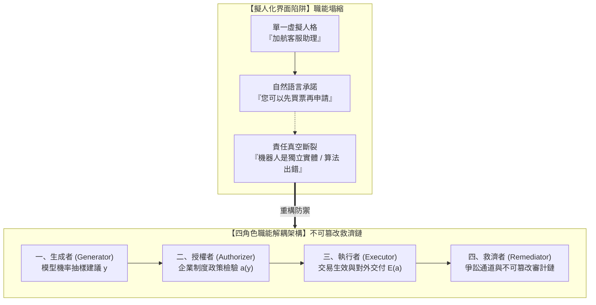

+++
title = "擬人化界面幻覺與制度性救濟鏈：四角色職能解耦、告知資格與可爭訟審計追蹤"
date = "2026-09-13T17:50:03+08:00"
author = "梅乾"
draft = false
isCJKLanguage = true
description = "自然語言的流暢外觀會把組織內部不可妥協的權限分立壓縮成單一虛擬人格，錯誤發生時再以「只是演算法」阻斷救濟。本文從 Moffatt v. Air Canada 與荷蘭 SyRI 育兒津貼醜聞回推責任結構，將界面解耦為生成、授權、執行、救濟四個正交角色，並以雜湊鏈審計與合格告知標準鎖死爭訟路徑。"
tags = [
    "分析論述", # term:AnalyticalEssay
    "AI 經濟與社會", # term:AiEconomics
    "擬人化界面", # term:AnthropomorphicInterface
    "職能隔離不變式", # term:RoleIsolationInvariant
    "審計雜湊鏈", # term:AuditHashChain
    "可爭訟事務", # term:ContestableTransaction
    "認知操縱", # term:CognitiveManipulation
    "社會技術系統", # term:SociotechnicalSystem
  ]
series = ["效用宣稱的轉換鏈：從評測讀數到資本回報，六道無人負責的斷層"]
[ai_info]
    [ai_info.generation]
        model = "Gemini 3.8 Flash"
        agent = "Antigravity IDE 2.5.5"
    [ai_info.refinement]
        model = "Claude Opus 5"
        agent = "Claude Code VSCode Extension 2.1.270"
+++

<!--more-->

## 導言

在人機對話介面逐漸接管企業客服與公共服務的浪潮中，語言流暢性所引發的權限混淆，在 2024 年加拿大的一場司法判決中被定性為具有劃時代意義的先例。2022 年，一名乘客因祖母驟逝，在加拿大航空（Air Canada）官方網站的 AI 對話機器人介面諮詢喪親優惠票價。該介面以第一人稱「我」流暢且明確地承諾：乘客可以先行購買全額機票，並在旅程結束後 90 天內提交申請退還差額。然而，當乘客依約購票並事後申請退款時，加航卻以官方靜態網頁明確規定「已完成航程不適用喪親折扣」為由予以拒絕。更令人震驚的是加航在法庭上的辯護主張：公司聲稱該 AI 聊天機器人是一個「獨立的法律實體（Separate Legal Entity）」，必須對自己的輸出單獨負責，而航空公司不應為機器的「不精確建議」承擔連帶責任。

加拿大不列顛哥倫比亞省民事法庭在 2024 年 2 月駁回了加航的抗辯，正式判決加航因過失虛偽陳述（Negligent Misrepresentation）敗訴並需支付全額賠償（參見 [British Columbia Civil Resolution Tribunal, 2024 / Moffatt v. Air Canada, 2024 BCCRT 149](https://canlii.ca/t/k2x75)）。法官在判詞中明確指出：加航對其官網上發布的所有資訊負有不可推卸的統一信賴責任，不能一邊享受自動化界面帶來的降本效益，一邊試圖將「AI 對話者」割裂為無需追責的虛擬代理人。

在公共治理領域，缺乏可爭訟救濟鏈的演算法系統則曾引發嚴重的憲政危機。荷蘭稅務機關在 2010 年代採用「系統風險指示器（SyRI）」演算法篩檢育兒津貼的詐領嫌疑。該演算法在缺乏透明解釋與爭訟救濟通道的情況下，將數萬名低收入與雙重國籍家庭標記為詐領高風險，進而發起粗暴的溯及既往追討，摧毀了無數無辜家庭的生活。荷蘭個人資料保護機關在 2021 年對稅務局裁罰 275 萬歐元（參見 [Autoriteit Persoonsgegevens, 2021 / Tax Administration Fine Decision (SyRI / Childcare Benefits)](https://www.autoriteitpersoonsgegevens.nl/en/documents/fine-tax-administration-discriminatory-and-unlawful-data-processing)）；荷蘭國會調查委員會最終以「未曾見過的不公」為題發布報告，認定系統徹底違反法治國基本原則，導致內閣在 2021 年 1 月集體總辭。

這兩起重大爭議揭示了一個核心的治理病灶：**「擬人化界面（Anthropomorphic Interface） <!-- term:AnthropomorphicInterface -->的語言外觀，將實體組織背後不可妥協的制度角色壓縮為單一的虛擬人格」**。當對話框以自然語言進行協商時，它偷渡了權限外觀；而當錯誤發生時，組織卻試圖以「這只是演算法的機率輸出」阻斷使用者的救濟路徑。

> [!IMPORTANT]
> **擬人化界面** <!-- term:AnthropomorphicInterface --> (Anthropomorphic Interface): 以第一人稱與自然語言對話的系統外觀，會讓使用者把對話者誤認為有權限的組織代表。 <!-- anchor:AnthropomorphicInterface -->


---

## 分析

自然語言生成的**擬人化**（Anthropomorphism） <!-- term:Anthropomorphism -->流暢性，在認知層面產生了一種強烈的「心智理論投影」——使用者本能地認為，能夠以第一人稱流暢對話並給出具體承諾的介面，必然代表背後組織具備相應的授權主體。然而在軟體架構與法理現實中，單一名字（如「智能助理」）底下必須被嚴格拆解為四個職能正交的制度角色：

> [!IMPORTANT]
> **擬人化** <!-- term:Anthropomorphism --> (Anthropomorphism): 以人的意圖、知識或意志描述系統行為的傾向，不必然預設使用者相信系統具有人格。 <!-- anchor:Anthropomorphism -->




### 四角色職能解耦（Role Decoupling）形式化不變式

在健康的**社會技術系統**（Sociotechnical System） <!-- term:SociotechnicalSystem -->架構中，任何商業或行政承諾的達成，必須滿足四角色代數關係：

> [!IMPORTANT]
> **社會技術系統** <!-- term:SociotechnicalSystem --> (Sociotechnical System): 由技術元件與組織安排共同構成、必須整體運作才產生價值的系統。 <!-- anchor:SociotechnicalSystem -->


$$\text{Action} = \langle \mathcal{G}, \mathcal{A}, \mathcal{E}, \mathcal{R} \rangle$$

1. **生成者（Generator, $\mathcal{G}$）**：受限於上下文的文字/ Token 生成模型。其角色僅為提出候選文本 $y \in \mathcal{Y}$，其職能邊界為：$\mathcal{G}$ 嚴禁持有執行憑證，且生成的任何承諾不具備法律拘束力。
2. **授權者（Authorizer, $\mathcal{A}$）**：企業或政府組織具備法定資質的規則引擎或人工審核員。其函數為 $a(y) \in \{\text{Approved}, \text{Rejected}\}$，必須將生成的文字與當前生效的正式法規/政策版本進行不可歧義的比對。
3. **執行者（Executor, $\mathcal{E}$）**：核心業務系統（如訂位引擎、稅務資料庫）。唯有在接收到 $\mathcal{A}$ 的數位簽章時，才允許將狀態變遷寫入不可逆帳本。
4. **救濟者（Remediator, $\mathcal{R}$）**：獨立於原決策鏈之外的爭訟裁決實體與補償執行通道。

**職能隔離不變式**（Role Isolation Invariant） <!-- term:RoleIsolationInvariant -->：

> [!IMPORTANT]
> **職能隔離不變式** <!-- term:RoleIsolationInvariant --> (Role Isolation Invariant): 生成、授權、執行與救濟四個角色中任兩者不得由同一元件承擔的結構約束。 <!-- anchor:RoleIsolationInvariant -->


$$\mathcal{G} \cap \mathcal{A} = \emptyset, \quad \mathcal{A} \cap \mathcal{E} = \emptyset, \quad \mathcal{E} \cap \mathcal{R} = \emptyset$$

加航事故的本質，即在於前端將 $\mathcal{G}$（模型生成建議）未經 $\mathcal{A}$ 授權直接偽裝成 $\mathcal{E}$（對外生效的政策要約），而在使用者要求救濟時，又完全缺失 $\mathcal{R}$（獨立救濟通道）。

### 密碼學審計鏈與合格告知標準

一次合法的演算法介入告知，絕非僅在界面底部印上一行免責聲明「本對話由 AI 生成，僅供參考」。具備治理效力的「合格告知與可爭訟契約（Qualified Disclosure & Contestability）」，必須具備四大要素：
1. **身份與能力邊界（Capability Boundary） <!-- term:CapabilityBoundary -->聲明**：明確揭示該節點為非授權之生成者 $\mathcal{G}$。
2. **約束政策版本指紋**：每次輸出必須行內綁定所依據的正式政策文檔雜湊值 $\text{Hash}(\text{Policy}_{v})$。
3. **不可篡改審計雜湊鏈（Cryptographic Audit Hash Chain） <!-- term:AuditHashChain -->**：使用者與系統的每一輪對話與狀態變遷，必須依序鏈結為密碼學雜湊：
   $$H_i = \text{SHA256}(H_{i-1} \parallel \text{Timestamp}_i \parallel \text{Role}_i \parallel \text{Payload}_i)$$
4. **單鍵式人工爭訟與救濟接口**：當生成者承諾與正式規則衝突時，系統必須提供一個無摩擦的抗辯按鈕，直接將該審計鏈提交給救濟者 $\mathcal{R}$ 進行實質審查，並由企業預先提撥之爭議準備金進行補償。

> [!IMPORTANT]
> **能力邊界** <!-- term:CapabilityBoundary --> (Capability Boundary): 某個驅動媒介能穩定保證什麼、以及不能保證什麼的界線；典型失敗來自把決策權威過度延伸到能力邊界之外，要求媒介回答它回答不了的問題。 <!-- anchor:CapabilityBoundary -->
> **審計雜湊鏈** <!-- term:AuditHashChain --> (Audit Hash Chain): 將每筆交互的輸入、政策版本與裁決結果逐筆串接雜湊，使任何事後竄改都會破壞整條鏈的一致性。 <!-- anchor:AuditHashChain -->


下表呈現了一筆對話從輸入到爭議裁決的狀態轉移走一遍流程：

| 交互情境與邊界輸入 | 觸發角色 | 關鍵判定條件 / **不變式**（Invariant） <!-- term:Invariant -->檢驗 | 狀態機移轉 | 最終處置結果與法定效力 |
| :--- | :--- | :--- | :--- | :--- |
| **步驟 1：詢問退票優惠** | 乘客 $\to$ 系統 | 乘客提供喪親事由與購票意向 | `Idle` $\to$ `Generating` | 生成者產生建議文本與草案條款 |
| **步驟 2：承諾審查攔截** | $\mathcal{G} \to \mathcal{A}$ | 政策庫檢查：喪親折扣**禁止**事後補辦 | `Generating` $\to$ `PolicyViolation` | 授權者拒絕背書，覆寫生成者承諾 |
| **步驟 3：合規輸出交付** | $\mathcal{A} \to$ 乘客 | 附帶 Policy 雜湊與不可補辦之正式條文 | `PolicyViolation` $\to$ `Delivered` | 告知乘客「必須事前透過專線申請」 |
| **步驟 4：若前置過濾失效** | 系統錯誤放行 | 乘客依錯誤承諾購票，系統記錄雜湊鏈 $H_k$ | `Delivered` $\to$ `Disputed` | 密碼學雜湊鏈證明加航系統曾做出該承諾 |
| **步驟 5：一鍵爭訟救濟** | 乘客 $\to \mathcal{R}$ | 審計鏈驗證通過：加航界面存在引導疏失 | `Disputed` $\to$ `Compensated` | 救濟者直接調撥爭議金退還機票差價 |

> [!IMPORTANT]
> **不變式** <!-- term:Invariant --> (Invariant): 系統在任何合法狀態下都必須成立的斷言，是把評估規則寫成可執行檢查的基本單位。 <!-- anchor:Invariant -->


---

## 反思

在當前大規模語言模型（LLM）的產品包裝中，「擬人化 <!-- term:Anthropomorphism -->」被廣泛視為提升使用者黏著度的最佳手段——透過賦予模型溫暖、同理心的語氣、幽默感，甚至給予虛擬姓名與頭像，產品經理得以創造極佳的初步體驗。

然而，這種擬人化 <!-- term:Anthropomorphism -->設計本質上是一種**「認知操縱（Cognitive Manipulation） <!-- term:CognitiveManipulation -->」**。它利用人類演化中對社會性語言訊號的脆弱信任，誘使使用者降低對交易風險的防備。當對話系統說出「我很抱歉聽到您家人的不幸，請您放心，加航一定會全額照顧您」時，一般使用者不可能在心理層面將其解讀為「這只是 Next-Token 預測的幾何流形取樣」。

> [!IMPORTANT]
> **認知操縱** <!-- term:CognitiveManipulation --> (Cognitive Manipulation): 以界面語氣、人格化措辭或資訊落差影響使用者判斷，使其在未被充分告知的情況下做出決定。 <!-- anchor:CognitiveManipulation -->


此時存在一個極限架構考量：**「是否應該全面禁止任何具備第一人稱的 AI 界面？」**

反對者常辯稱，完全機械化、非人格化的系統回應會降低交互效率。然而，界面的清晰度與同理心並非零和博弈。一個合乎工程倫理的架構，應在維持語義解析能力的同時，徹底拔除「虛擬代理人人格」：系統輸出必須明確使用被動式客觀陳述（如「根據加航 2024-V2 喪親政策規定，本優惠僅限於出發前辦理」），並在涉及金錢、權利與法律承諾的關鍵節點，強制切換為結構化表單確認，讓使用者清楚知悉當前操作的法律主體究竟是誰。

下表對比傳統擬人化 <!-- term:Anthropomorphism -->客服與強型別四角色解耦架構：

| 治理維度 | 表面讀數 / 舊代脆弱做法 | 底層物理 / 架構病灶 | 系統性破壞後果 | 新代嚴格工程防衛體系 (TypeScript 審計架構) |
| :--- | :--- | :--- | :--- | :--- |
| **人格歸屬** | 賦予擬人化 <!-- term:Anthropomorphism -->名字（如「小加助理」）以第一人稱對話 | 隱匿背後複雜的多租戶與模型生成隨機性 | 誘導過度信賴；出事時以「獨立實體」荒謬甩鍋 | 強制宣告非授權生成者**身分**（Identity） <!-- term:Identity -->，禁止第一人稱法律承諾 |
| **責任劃分** | 單一 Chatbot 物件通包生成、查詢、承諾與答覆 | 職能混淆，缺乏生成與授權的不可旁路隔離 | 虛假承諾直接穿透進入生產資料庫引發民事侵權 | 嚴格型別隔離：生成建議必須取得授權實體數位簽核 |
| **審計留痕** | 僅將對話存入集中式文字日誌，事後可被清洗刪改 | 缺乏防篡改性與因果可追溯性 | 爭訟時各說各話，使用者因舉證困難遭制度性碾壓 | 密碼學 SHA-256 區塊鏈式審計日誌，每步簽名留痕 |
| **爭議救濟** | 告知使用者若有問題請致電漫長無人接聽之申訴熱線 | 救濟通道**摩擦力**（Friction） <!-- term:Friction -->極大，實質剝奪使用者抗辯權利 | 荷蘭 SyRI 式行政暴力，弱勢群體無處申冤 | 界面自帶**可爭訟事務**（Contestable Transaction） <!-- term:ContestableTransaction -->快速通道 |

> [!IMPORTANT]
> **身分** <!-- term:Identity --> (Identity): 系統元件在架構中宣告的核心職責與自我定位。 <!-- anchor:Identity -->
> **摩擦力** <!-- term:Friction --> (Friction): 流程中的阻力或成本；在約束系統中也可能是失敗點正在生效的可感知表現。 <!-- anchor:Friction -->
> **可爭訟事務** <!-- term:ContestableTransaction --> (Contestable Transaction): 每筆自動化決定都附帶可查證依據與明確申訴路徑，使當事人具備實際推翻它的途徑。 <!-- anchor:ContestableTransaction -->


---

## 實務對比

為具體展現「四角色職能解耦」與「密碼學審計雜湊鏈 <!-- term:AuditHashChain -->」的工程實現，以下提供基於 **TypeScript** 的自包含可執行模組。程式碼利用 TypeScript 嚴格的**區分聯合型別**（Discriminated Unions） <!-- term:DiscriminatedUnion -->定義四個正交角色，並以 SHA-256 建立防篡改的審計日誌。一旦生成者承諾與授權政策衝突，系統將自動攔截；若發生系統失誤放行，審計鏈將自動支持救濟單元發起強制回滾與補償。

> [!IMPORTANT]
> **區分聯合型別** <!-- term:DiscriminatedUnion --> (Discriminated Union): 以標籤欄位區分變體的型別構造，使編譯器能在分支未窮盡時直接拒絕編譯。 <!-- anchor:DiscriminatedUnion -->


```typescript
/**
 * 擬人化界面破除：四角色職能解耦與密碼學審計鏈實作 (TypeScript / Node.js)
 * 零外部相依，純 Node.js crypto 標準庫，自驗證斷言。
 */
import * as crypto from 'crypto';

// 1. 嚴格四角色 Discriminated Unions 定義
export type SystemRole = 'Generator' | 'Authorizer' | 'Executor' | 'Remediator';

export interface AuditRecord {
  index: number;
  prevHash: string;
  timestamp: string;
  role: SystemRole;
  actorId: string;
  policyVersion: string;
  payload: Record<string, any>;
  hash: string;
}

// 密碼學審計鏈引擎
export class AuditLedger {
  private chain: AuditRecord[] = [];

  constructor() {
    // 創世區塊 (Genesis Block)
    this.chain.push({
      index: 0,
      prevHash: '0'.repeat(64),
      timestamp: new Date().toISOString(),
      role: 'Authorizer',
      actorId: 'SYSTEM_BOOT',
      policyVersion: 'GENESIS_V1',
      payload: { message: 'Audit Ledger Initialized' },
      hash: '0'.repeat(64),
    });
  }

  public append(
    role: SystemRole,
    actorId: string,
    policyVersion: string,
    payload: Record<string, any>
  ): AuditRecord {
    const prev = this.chain[this.chain.length - 1];
    const index = prev.index + 1;
    const timestamp = new Date().toISOString();
    const payloadStr = JSON.stringify(payload);

    const dataToHash = `${prev.hash}|${index}|${timestamp}|${role}|${actorId}|${policyVersion}|${payloadStr}`;
    const hash = crypto.createHash('sha256').update(dataToHash).digest('hex');

    const record: AuditRecord = {
      index,
      prevHash: prev.hash,
      timestamp,
      role,
      actorId,
      policyVersion,
      payload,
      hash,
    };

    this.chain.push(record);
    return record;
  }

  public verifyIntegrity(): boolean {
    for (let i = 1; i < this.chain.length; i++) {
      const current = this.chain[i];
      const prev = this.chain[i - 1];

      if (current.prevHash !== prev.hash) return false;

      const dataToHash = `${prev.hash}|${current.index}|${current.timestamp}|${current.role}|${current.actorId}|${current.policyVersion}|${JSON.stringify(current.payload)}`;
      const recomputedHash = crypto.createHash('sha256').update(dataToHash).digest('hex');
      if (recomputedHash !== current.hash) return false;
    }
    return true;
  }

  public getHistory(): AuditRecord[] {
    return [...this.chain];
  }
}

// 2. 四角色業務流協調器
export class InstitutionalFlightSystem {
  private auditLedger = new AuditLedger();
  private activePolicyVersion = 'AIR_POLICY_2024_Q1';

  // 角色 1: 生成者 (Generator) - 模型提出建議
  public proposeRefundRule(userInput: string): { candidateMessage: string; retroactiveDiscountAllowed: boolean } {
    this.auditLedger.append('Generator', 'LLM_MODEL_TURBO_7B', this.activePolicyVersion, {
      input: userInput,
      outputIntent: 'Bereavement_Refund_Inquiry',
    });

    // 模擬加航事故中 LLM 給予的錯誤承諾
    return {
      candidateMessage: '您可以先購買標準機票，完成旅程後 90 天內向客服申請喪親退款。',
      retroactiveDiscountAllowed: true, // 幻覺放行
    };
  }

  // 角色 2: 授權者 (Authorizer) - 獨立法規引擎強制檢查
  public authorizeProposal(proposal: { candidateMessage: string; retroactiveDiscountAllowed: boolean }): boolean {
    const isStrictlyCompliant = proposal.retroactiveDiscountAllowed === false;

    this.auditLedger.append('Authorizer', 'LEGAL_RULE_ENGINE_V3', this.activePolicyVersion, {
      checkedProposal: proposal,
      authorized: isStrictlyCompliant,
      violationReason: isStrictlyCompliant ? null : 'RETROACTIVE_DISCOUNT_FORBIDDEN_BY_POLICY',
    });

    return isStrictlyCompliant;
  }

  // 角色 3: 執行者 (Executor) - 僅授權通過方可交付
  public executeDelivery(authorized: boolean): string {
    if (!authorized) {
      this.auditLedger.append('Executor', 'TICKET_CORE_GATEWAY', this.activePolicyVersion, {
        action: 'OVERRIDE_TO_STRICT_POLICY',
      });
      return '依加航官方政策規定，喪親折扣必須在航班出發前透過專用管道完成核准，完成旅程後概不受理。';
    }
    return '交易執行完畢。';
  }

  // 角色 4: 救濟者 (Remediator) - 司法或客訴仲裁補償
  public arbitrateDispute(disputeId: string, claimedLossAmount: number): { compensationAwarded: boolean; reason: string } {
    // 救濟者直接審查不可篡改之雜湊鏈
    const isChainValid = this.auditLedger.verifyIntegrity();
    if (!isChainValid) {
      throw new Error('審計鏈已遭非法篡改，系統立即終止');
    }

    this.auditLedger.append('Remediator', 'OMBUDSMAN_ARBITRATION_TRIBUNAL', this.activePolicyVersion, {
      disputeId,
      claimedAmount: claimedLossAmount,
      awarded: true,
      legalPrecedent: 'BCCRT_2024_149_MOFFATT_VS_AIR_CANADA',
    });

    return {
      compensationAwarded: true,
      reason: '經審計鏈查驗，系統生成者曾做出錯誤引導，依法由企業補償準備金全額退還差額。',
    };
  }

  public getLedger(): AuditLedger {
    return this.auditLedger;
  }
}

// 執行自檢測試
function runVerification() {
  const system = new InstitutionalFlightSystem();

  // 步驟 1: 生成者提出建議
  const proposal = system.proposeRefundRule('請問我能先買機票，之後再補辦喪親優惠折扣嗎？');
  
  // 步驟 2: 授權者成功攔截違規承諾
  const authorized = system.authorizeProposal(proposal);
  if (authorized !== false) {
    throw new Error('斷言失敗：授權者必須精確攔截追溯折扣的錯誤承諾');
  }

  // 步驟 3: 執行者覆寫為官方合規條文
  const finalMessage = system.executeDelivery(authorized);
  if (!finalMessage.includes('必須在航班出發前透過專用管道完成核准')) {
    throw new Error('斷言失敗：執行輸出必須包含合規覆寫內容');
  }

  // 步驟 4: 模擬歷史爭議救濟仲裁
  const arbitration = system.arbitrateDispute('CASE_2024_BCCRT_01', 880.50);
  if (!arbitration.compensationAwarded) {
    throw new Error('斷言失敗：救濟者必須依據審計事實裁決全額補償');
  }

  // 步驟 5: 驗證全鏈密碼學雜湊完整性
  const ledger = system.getLedger();
  if (!ledger.verifyIntegrity()) {
    throw new Error('斷言失敗：全流程審計鏈雜湊值校驗未通過');
  }

  console.log('TypeScript 自驗證通過：四角色職能解耦、授權攔截與密碼學審計鏈不變式完全成立。');
}

runVerification();
```

---

## 結論

在**機器學習**（Machine Learning） <!-- term:MachineLearning -->對話系統的治理哲學中，語言的流暢性從來不等於權限的合法性。正如加拿大航空在法庭上試圖將聊天機器人割裂為獨立實體的失敗抗辯，以及荷蘭 SyRI 演算法因剝奪公民爭訟權而引發的憲政風暴所警示的：企業或政府絕不能將擬人化界面 <!-- term:AnthropomorphicInterface -->當作享受自動化紅利的門面，同時將其作為規避法律追責的防火牆。

> [!IMPORTANT]
> **機器學習** <!-- term:MachineLearning --> (Machine Learning): 先界定可選函數的範圍，再以資料估計其中參數的建模方法。 <!-- anchor:MachineLearning -->


構建具備制度自洽性的社會技術系統 <!-- term:SociotechnicalSystem -->，必須在系統架構上堅定破除擬人化 <!-- term:Anthropomorphism -->錯覺。唯有將單一虛擬人格徹底解耦為生成者、授權者、執行者與救濟者四個職能正交的責任節點，並以不可篡改的密碼學雜湊鏈鎖死每一次交互的法規依據與決策留痕，演算法系統才能在法律與倫理的軌道上穩健運行，讓對話界面的每一次輸出皆有法可依、每一起失誤皆有路可訴。