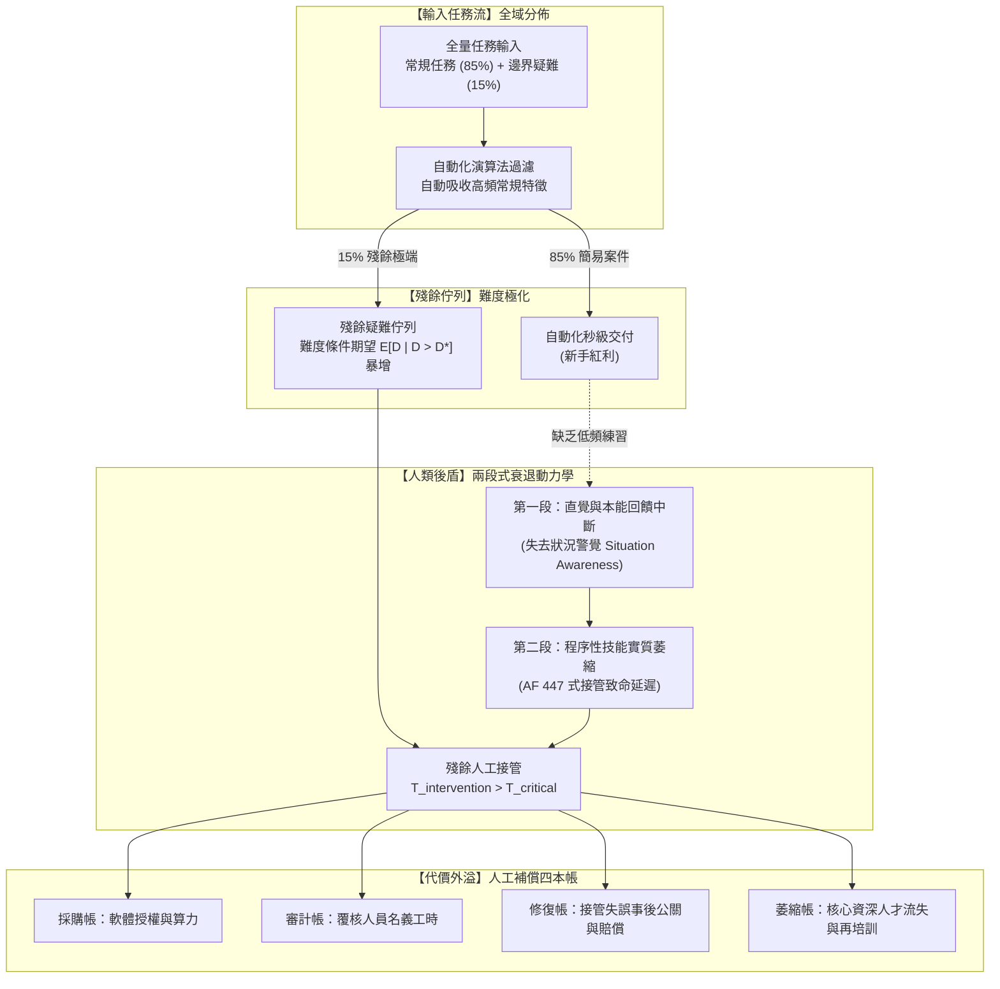

+++
title = "人工補償四本帳與自動化反諷：殘餘佇列難度極化、警覺度衰退與組織互補資本"
date = "2026-09-13T17:50:04+08:00"
author = "梅乾"
draft = false
isCJKLanguage = true
description = "自動化吸收掉常規案例後，留給人的佇列只剩最難的殘餘，而練習機會同時消失。本文以 Uber Tempe 車禍、法航 AF 447 與生成式 AI 客服實地研究推導 Bainbridge 自動化反諷下的兩段式技能萎縮動力學，並重建採購、審計、修復、萎縮四本互不流通帳目的人工補償會計模型。"
tags = [
    "分析論述", # term:AnalyticalEssay
    "AI 經濟與社會", # term:AiEconomics
    "人工補償", # term:HumanCompensation
    "自動化反諷", # term:IroniesOfAutomation
    "狀況警覺", # term:SituationAwareness
    "迴路外部", # term:OutOfTheLoop
    "制度性責任海綿", # term:MoralCrumpleZone
    "盲目放行", # term:RubberStamping
  ]
series = ["效用宣稱的轉換鏈：從評測讀數到資本回報，六道無人負責的斷層"]
[ai_info]
    [ai_info.generation]
        model = "Gemini 3.8 Flash"
        agent = "Antigravity IDE 2.5.5"
    [ai_info.refinement]
        model = "Claude Opus 5"
        agent = "Claude Code VSCode Extension 2.1.270"
+++

<!--more-->

## 導言

在高度自動化系統取代基層勞動力的進程中，由「**人工覆核**（Human Review） <!-- term:HumanReview -->」所引發的系統性潰敗，最震撼工程界的案例莫過於 2018 年 3 月 18 日晚間發生在亞利桑那州 Tempe 的 Uber 自動駕駛測試車撞死行人的慘劇。根據美國國家運輸安全委員會（NTSB）發布的最終調查報告（參見 [NTSB, 2019 / Highway Accident Report: Collision Between a Self-Driving Car and a Pedestrian (HAR-19/03)](https://www.ntsb.gov/investigations/AccidentReports/Reports/HAR1903.pdf)），自動駕駛感知系統在撞擊前 5.6 秒就已偵測到橫越馬路的行人，但演算法在無分類、車輛與自行車之間反覆搖擺，未能預測其會切入車道。更致命的是，為了避免車輛在誤報時急煞，工程師停用了富豪（Volvo）原廠的自動緊急煞車系統，並設定了 1 秒鐘的動作抑制期；而原本配置的兩名安全測試員在事故前被縮編為一人。坐在駕駛座上的安全員長達數分鐘低頭觀看手機，在撞擊前不到 1 秒才抬頭踩下煞車，但悲劇已無法挽回。

> [!IMPORTANT]
> **人工覆核** <!-- term:HumanReview --> (Human Review): 在自動化流程中保留人類確認環節；其有效性取決於該人是否仍具備判讀能力、權限與時間。 <!-- anchor:HumanReview -->


類似的「監控者失能」在航空安全史上亦有痛徹心扉的紀錄。2009 年 6 月 1 日，法國航空 AF 447 號班機自里約熱內盧飛往巴黎途中墜毀於大西洋，造成 228 人遇難。法國航空事故調查局（BEA）的調查報告指陳（參見 [BEA France, 2012 / Final Report on Flight AF 447](https://bea.aero/docspa/2009/f-cp090601.en/pdf/f-cp090601.en.pdf)）：空速管在高空結冰導致儀表讀數失效，自動駕駛隨即自動斷開；從斷開到撞擊海面的 3 分 30 秒內，習慣了自動巡航的副駕駛在極度驚慌下，竟然大部分時間保持「機頭持續上仰」的錯誤操縱輸入，將飛機直接拉入深失速狀態。長期的自動化巡航剝奪了飛行員在高空手動操縱與識別失速的直覺本能。

在知識工作與服務領域，大規模實證經濟學研究亦證實了類似的分化現象。麻省理工學院與史丹佛大學的經濟學家在對一家跨國軟體公司 5,000 多名客服人員進行生成式 AI 導入的實地研究中發現（參見 [Brynjolfsson 等人，2023 / Generative AI at Work, NBER / QJE](https://doi.org/10.3386/w31161)）：AI 輔助使每小時問題解決率平均提升了 14%，然而增益高度集中於經驗不足的新手（提升達 34%），資深熟練員工的生產力增益幾乎為 0%。更隱蔽的代價在於：當常規問題被演算法全數過濾後，流向資深員工的「殘餘佇列」全部變成前所未見的疑難雜症，工作認知負擔急遽極化。

這三起橫跨自動駕駛、航空與知識服務的真實事件，共同指向了心理學家 Lisanne Bainbridge 早在 1983 年就提出的經典命題——**「自動化反諷（Ironies Of Automation） <!-- term:IroniesOfAutomation -->」**（參見 [Bainbridge, 1983 / Ironies of Automation, Automatica](https://doi.org/10.1016/0005-1098(83)90046-8)）：**設計者試圖透過自動化消除人類的脆弱性，卻將系統中最困難、最無法預測、演算法無法處理的極端狀況，全部丟給了因缺乏日常練習而技能嚴重退化的人類後盾**。而組織為了維持表面運轉所付出的**人工補償**（Human Compensation） <!-- term:HumanCompensation -->，被隱匿在四本互不流通的會計帳目之中，反噬了自動化的全部經濟效益。

> [!IMPORTANT]
> **自動化反諷** <!-- term:IroniesOfAutomation --> (Ironies Of Automation): 自動化接手例行工作後，留給人的案例更難且練習更少，反而更難在關鍵時刻接管的設計張力。 <!-- anchor:IroniesOfAutomation -->
> **人工補償** <!-- term:HumanCompensation --> (Human Compensation): 以人力審核與例外處理填補模型不可靠之處，使系統整體達到可交付品質的做法。 <!-- anchor:HumanCompensation -->


---

## 分析

人工補償 <!-- term:HumanCompensation -->機制的崩潰，源於「**人機協作**（Human-AI Collaboration） <!-- term:HumanAiCollaboration -->效率提升」的底層假設忽視了人類認知系統的生理與動力學極限。當自動化系統承接了常規情境的處理時，留在人類處理佇列中的任務分佈發生了不可逆的維度躍遷。

> [!IMPORTANT]
> **人機協作** <!-- term:HumanAiCollaboration --> (Human-AI Collaboration): 人與 AI 共同完成工作的分工模式：AI 負責放大產出與展開候選方案，人負責對邊界、失敗模式、成本與系統物理性做出判斷與裁決。其可持續性取決於人類判斷力的培育，而非 AI 採用率。 <!-- anchor:HumanAiCollaboration -->




### 兩段式技能萎縮動力學模型

人類專業技能的維持依賴持續的「感知—動作循環（Sensorimotor Loop）」。定義工作者在時間 $t$ 的專業能力儲備為 $S(t) \in [0, 1]$。當演算法接管常規任務時，技能演化遵循非線性衰退常微分方程：

$$\frac{dS(t)}{dt} = -\lambda S(t) + \gamma \cdot \mathbb{I}(\text{Manual Intervention}) \cdot (1 - S(t))$$

其中 $\lambda > 0$ 為自然遗忘率，$\gamma$ 為實踐反饋學習率，$\mathbb{I}(\cdot)$ 為人工手動介入的指示函數。

自動化引發的衰退分為互為因果的兩階段：
1. **第一段：狀況警覺（Situation Awareness） <!-- term:SituationAwareness -->與直覺中斷（短週期）**：
   工作者從「控制迴路內部（In-the-loop）」被驅逐至「**迴路外部**（Out-Of-The-Loop） <!-- term:OutOfTheLoop -->」，喪失對系統微小狀態漂移的體感直覺。Uber 測試員低頭滑手機、AF 447 副駕駛無法感知失速，皆發生在此階段。
2. **第二段：程序性肌肉記憶與深層推論衰退（長週期）**：
   由於手動介入次數 $\int \mathbb{I} dt \to 0$，技能穩態水平崩塌：
   $$\lim_{t \to \infty} S(t) = \frac{\gamma p_{\text{intervene}}}{\lambda + \gamma p_{\text{intervene}}} \approx 0$$
   當偶發的災難性異常迫使人類接管時，介入總耗時滿足 Bainbridge 延遲不等式：
   $$T_{\text{intervention}} = T_{\text{detect}} + T_{\text{orient}} + T_{\text{diagnose}} + T_{\text{act}} > T_{\text{critical}}$$
   當總延遲突破物理系統的安全容忍時間 $T_{\text{critical}}$，崩潰即成必然。

> [!IMPORTANT]
> **狀況警覺** <!-- term:SituationAwareness --> (Situation Awareness): 操作員對系統當前狀態、變化趨勢與可用處置選項的即時掌握程度。 <!-- anchor:SituationAwareness -->
> **迴路外部** <!-- term:OutOfTheLoop --> (Out-Of-The-Loop): 人被移出常態控制迴路後，對系統狀態失去體感與預判能力的位置。 <!-- anchor:OutOfTheLoop -->


### 人工補償四本帳的會計割裂

企業在評估自動化 ROI 時，通常僅計算直接採購帳，而將人工補償 <!-- term:HumanCompensation -->成本分散至四本互不通聯的獨立科目：

$$C_{\text{true}} = C_{\text{vendor}} + C_{\text{audit}} + C_{\text{recovery}} + C_{\text{atrophy}}$$

1. **外部採購帳（$C_{\text{vendor}}$）**：付給軟體供應商的授權費與伺服器算力成本。
2. **名義審計帳（$C_{\text{audit}}$）**：分配給人工覆核 <!-- term:HumanReview -->員的名義工時成本。在組織預算中，覆核員常被視為「既有人力資源」，其機會成本被低估為零。
3. **災難修復帳（$C_{\text{recovery}}$）**：當覆核失守導致實體事故（如自動駕駛車禍、誤算稅額、醫療誤診）時，法務賠償、監管罰款與品牌公關危機的極端損失。
4. **技能萎縮帳（$C_{\text{atrophy}}$）**：組織內部資深專家因長期缺乏高難度挑戰而離職，或基層新人因無常規案例磨練而無法晉升，導致組織能力斷層的長期隱性代價。

下表呈現了當自動化滲透率逐步攀升時，任務佇列難度、人工警覺度與接管延遲的推演走一遍：

| 自動化覆蓋率 ($\eta$) | 殘餘佇列難度期望 ($\mathbb{E}[D_{\text{res}}]$) | 操作員警覺度 ($A_t$) | 狀況感知延遲 ($T_{\text{orient}}$) | 系統安全狀態**不變式**（Invariant） <!-- term:Invariant --> |
| :--- | :--- | :--- | :--- | :--- |
| **$\eta = 0\%$ (全手動)** | 1.00 (基準標準化) | 95% (高專注) | 0.8 秒 | $T_{\text{inter}} = 1.8\text{s} \ll T_{\text{crit}}$ (安全) |
| **$\eta = 50\%$ (部分輔助)** | 1.45 (常規案件減半) | 80% (適度警覺) | 1.5 秒 | $T_{\text{inter}} = 2.6\text{s} < T_{\text{crit}}$ (受控) |
| **$\eta = 80\%$ (高度自主)** | 2.80 (僅剩棘手特例) | 45% (注意力發散) | 3.8 秒 | $T_{\text{inter}} = 5.2\text{s} \approx T_{\text{crit}}$ (邊界臨界) |
| **$\eta = 95\%$ (近全自動)** | 6.50 (高度極化疑難) | 15% (深度自滿/滑手機) | 8.5 秒 | $T_{\text{inter}} = 11.0\text{s} \gg T_{\text{crit}}$ (必然失效) |
| **$\eta = 99\%$ (極端假象)** | 12.0 (百年一遇奇異點) | 5% (完全無感) | 18.0 秒 | 系統物理失速墜毀 / 撞擊事故 |

> [!IMPORTANT]
> **不變式** <!-- term:Invariant --> (Invariant): 系統在任何合法狀態下都必須成立的斷言，是把評估規則寫成可執行檢查的基本單位。 <!-- anchor:Invariant -->


---

## 反思

企業主管在導入生成式 AI 或自動化管線時，最常說的一句話是：「我們保留了人工覆核 <!-- term:HumanReview -->，所以絕對安全。」

這種論調本質上是將人類操作員當成了**「制度性責任海綿（Moral Crumple Zone） <!-- term:MoralCrumpleZone -->」**。系統架構師心知肚明，在每天需要點擊核准數千次的作業線上，人類大腦的注意力資源在生理上根本無法維持超過 20 分鐘的高敏銳度審查。所謂的人工覆核 <!-- term:HumanReview -->，在實務中迅速退化為機械式的「**盲目放行**（Rubber-Stamping） <!-- term:RubberStamping -->」。而一旦發生法律訴訟或監管裁罰，管理層便能順理成章地將過失推給「該名操作員未依規定專心覆核」。

> [!IMPORTANT]
> **制度性責任海綿** <!-- term:MoralCrumpleZone --> (Moral Crumple Zone): 把系統性失效的法律與道德責任吸收到最末端操作員身上的組織安排。 <!-- anchor:MoralCrumpleZone -->
> **盲目放行** <!-- term:RubberStamping --> (Rubber-Stamping): 覆核流程退化為形式確認，審核者不再實際判讀內容即予通過。 <!-- anchor:RubberStamping -->


此處必須面對一個反例辯證：**「是否存在完全不需要人工補償 <!-- term:HumanCompensation -->的高效自動化？」**

存在，但唯有當任務滿足**「環境可完全封閉約束、故障具備自動安全平穩降級（Fail-Safe Degradation）、且無生命與財產責任外溢」**的狹窄領域。例如全自動晶圓製造設備或現代電梯控制系統，其不依賴人類即時接管，而是依賴硬體**物理聯鎖**（Interlocks） <!-- term:Interlock -->直接停機。然而在自動駕駛、醫療診斷與金融風控等開放動態領域，軟體根本無法自發定義什麼是安全降級；此時若強行引入自動化卻不為人類後盾設計持續的警覺激勵與技能維護機制，人工覆核 <!-- term:HumanReview -->只是一場自我安慰的欺騙儀式。

> [!IMPORTANT]
> **物理聯鎖** <!-- term:Interlock --> (Interlock): 以硬體條件強制阻斷不安全動作的機制，不依賴軟體判斷或人員反應。 <!-- anchor:Interlock -->


下表對照傳統「責任海綿式人工覆核 <!-- term:HumanReview -->」與新一代「認知工學組織互補架構」：

| 治理維度 | 表面讀數 / 舊代脆弱作法 | 底層物理 / 架構病灶 | 系統性破壞後果 | 新代嚴格工程防衛體系 (Go 遙測防線) |
| :--- | :--- | :--- | :--- | :--- |
| **覆核定位** | 將人類置於流水線終端擔任「最後一道防線」 | 忽略注意力生理衰退與 Bainbridge 延遲不等式 | 形成橡皮圖章盲審，出事時操作員淪為代罪羔羊 | 注入主動合成故障（Fault Injection），保持直覺張力 |
| **工作分配** | 簡單任務全由 AI 吞掉，人類僅處理長尾殘差 | 殘餘佇列難度極化，摧毀初中階人才培養通道 | 組織能力斷代，資深專家因認知超載集體倦怠 | 實施「難度配給制」，強制回流 20% 常規任務供練兵 |
| **成本核算** | 只計算軟體授權與節省的人頭名義薪資 | 隱匿修復帳、賠償金與技能萎縮四本帳 | 帳面利潤增長，實際總體營運淨現金流遭受重創 | 建立統一**總體擁有成本**（TCO） <!-- term:TotalCostOfOwnership -->四本帳即時儀表板 |
| **接管設計** | 演算法一旦遇到無法分類的邊界直接拋出異常 | 瞬間移交控制權，人類在 0 秒內缺乏情境資訊 | AF 447 式驚慌失措，致命操作加速系統崩潰 | 漸進式雙重確認與輔助態勢顯示，預留平穩緩衝期 |

> [!IMPORTANT]
> **總體擁有成本** <!-- term:TotalCostOfOwnership --> (Total Cost Of Ownership): 涵蓋採購、整合、維運、稽核與人力補償在內的全生命週期成本口徑。 <!-- anchor:TotalCostOfOwnership -->


---

## 實務對比

為落實對「操作員警覺度衰退」與「四本帳成本分攤」的即時監控，以下提供基於 **Go (Golang)** 的並發安全遙測實作。程式模擬了高頻任務流下操作員隨時間發生的延遲漂移，即時計算殘餘佇列的難度極化指數，並在警覺度突破危險閾值時自動觸發警報與強制任務輪調，同時將四本帳成本進行精確匯總。

```go
// 人工補償四本帳與警覺度衰退遙測模組 (Go 1.20+)
// 零外部依賴，純標準庫，原生並發安全與自驗證斷言

package main

import (
	"fmt"
	"math"
	"sync"
	"sync/atomic"
)

// Task 代表流入系統的業務單元
type Task struct {
	ID         uint64
	Difficulty float64 // 難度標量: 1.0 (標準常規) ~ 10.0 (極端罕見)
	Automated  bool
}

// FourLedgersAccounting 四本帳成本追蹤器
type FourLedgersAccounting struct {
	VendorCost   uint64 // 外部採購帳 (分)
	AuditCost    uint64 // 名義審計帳 (分)
	RecoveryCost uint64 // 災難修復帳 (分)
	AtrophyCost  uint64 // 技能萎縮帳 (分)
}

func (f *FourLedgersAccounting) TotalCost() uint64 {
	return atomic.LoadUint64(&f.VendorCost) +
		atomic.LoadUint64(&f.AuditCost) +
		atomic.LoadUint64(&f.RecoveryCost) +
		atomic.LoadUint64(&f.AtrophyCost)
}

// HumanOperatorMonitor 人工操作員遙測器
type HumanOperatorMonitor struct {
	mu                   sync.RWMutex
	consecutiveReviews   uint64
	vigilanceLevel       float64 // 警覺度: 1.0 (滿分) -> 0.0 (完全失能)
	avgReactionLatencyMs float64
	difficultySum        float64
	taskCount            uint64
	isFatigued           bool
}

func NewHumanOperatorMonitor() *HumanOperatorMonitor {
	return &HumanOperatorMonitor{
		vigilanceLevel:       1.0,
		avgReactionLatencyMs: 800.0, // 初始正常反應時間 800ms
	}
}

// RecordReview 記錄一次人工覆核，模擬 Bainbridge 警覺度衰退動力學
func (m *HumanOperatorMonitor) RecordReview(difficulty float64) (reactionMs float64, warning bool) {
	m.mu.Lock()
	defer m.mu.Unlock()

	m.consecutiveReviews++
	m.taskCount++
	m.difficultySum += difficulty

	// 警覺度隨連續審查次數呈指數衰減: V(n) = e^(-0.12 * n)
	m.vigilanceLevel = math.Exp(-0.12 * float64(m.consecutiveReviews))
	if m.vigilanceLevel < 0.10 {
		m.vigilanceLevel = 0.10 // 保留最低生理底線
	}

	// 反應延遲與警覺度成反比，且隨難度增加: Latency = Base / V * (1 + 0.2 * Diff)
	reactionMs = (800.0 / m.vigilanceLevel) * (1.0 + 0.15*difficulty)
	m.avgReactionLatencyMs = reactionMs

	// 若警覺度跌破 0.35 或延遲突破 3500ms，觸發危險警告
	if m.vigilanceLevel < 0.35 || reactionMs > 3500.0 {
		m.isFatigued = true
		warning = true
	} else {
		warning = false
	}

	return reactionMs, warning
}

func (m *HumanOperatorMonitor) ResetRest() {
	m.mu.Lock()
	defer m.mu.Unlock()
	m.consecutiveReviews = 0
	m.vigilanceLevel = 1.0
	m.avgReactionLatencyMs = 800.0
	m.isFatigued = false
}

func main() {
	ledgers := &FourLedgersAccounting{}
	monitor := NewHumanOperatorMonitor()

	// 模擬場景: 50 個任務輸入，自動化過濾掉 80% 的常規任務 (Diff <= 2.0)
	// 剩餘 20% 殘餘任務 (Diff 5.0 ~ 9.0) 湧向單一人工覆核員
	totalTasks := 50
	var residualTasks []Task

	for i := 1; i <= totalTasks; i++ {
		// 80% 常規 (Diff=1.2)，20% 極端疑難 (Diff=8.5)
		diff := 1.2
		if i%5 == 0 {
			diff = 8.5
		}

		if diff <= 2.0 {
			// 自動化處理: 記錄採購與算力成本 (單次 5 分錢)
			atomic.AddUint64(&ledgers.VendorCost, 5)
		} else {
			// 進入殘餘人工佇列
			residualTasks = append(residualTasks, Task{ID: uint64(i), Difficulty: diff, Automated: false})
		}
	}

	var triggeredWarnings int
	for _, task := range residualTasks {
		latency, warning := monitor.RecordReview(task.Difficulty)
		// 覆核工時成本 (單次 50 分錢)
		atomic.AddUint64(&ledgers.AuditCost, 50)

		if warning {
			triggeredWarnings++
			// 警覺度失守，產生誤審與修復成本 (單次 200 分錢)
			atomic.AddUint64(&ledgers.RecoveryCost, 200)
			// 同步計提組織技能萎縮與倦怠折損 (單次 80 分錢)
			atomic.AddUint64(&ledgers.AtrophyCost, 80)
		}
		_ = latency
	}

	// 自檢斷言
	// 1. 驗證殘餘佇列難度極化: 殘餘難度均值應遠大於總體均值
	monitor.mu.RLock()
	avgResidualDiff := monitor.difficultySum / float64(monitor.taskCount)
	fatigued := monitor.isFatigued
	finalVigilance := monitor.vigilanceLevel
	monitor.mu.RUnlock()

	if avgResidualDiff < 8.0 {
		panic(fmt.Sprintf("斷言失敗: 殘餘任務難度應極化至 8.0 以上，實測: %.2f", avgResidualDiff))
	}

	// 2. 驗證連續審查下警覺度必然崩潰
	if !fatigued || finalVigilance > 0.35 {
		panic(fmt.Sprintf("斷言失敗: 連續高難審查必須觸發疲勞警戒，實測警覺度: %.2f", finalVigilance))
	}

	// 3. 驗證四本帳非零完整性
	if ledgers.TotalCost() == 0 || atomic.LoadUint64(&ledgers.RecoveryCost) == 0 {
		panic("斷言失敗: 四本帳必須完整涵蓋修復與隱性成本")
	}

	fmt.Printf("Go 自驗證通過: 殘餘難度均值=%.2f, 最終警覺度=%.2f, 觸發警告次數=%d, 四本帳總成本=%d 分\n",
		avgResidualDiff, finalVigilance, triggeredWarnings, ledgers.TotalCost())
}
```

---

## 結論

將人工覆核 <!-- term:HumanReview -->簡單視為自動化缺失的補丁，是**社會技術系統**（Sociotechnical System） <!-- term:SociotechnicalSystem -->設計中最普遍的自欺行為。正如 Uber Tempe 車禍中盲目依賴單一安全測試員、法航 AF 447 副駕駛在自動駕駛斷開後的致命混亂，以及生成式 AI 導入後資深客服面臨的殘餘佇列極化所展現的：人類從來就不是冷血、全天候無休且能瞬時切換情境的理想伺服器。

> [!IMPORTANT]
> **社會技術系統** <!-- term:SociotechnicalSystem --> (Sociotechnical System): 由技術元件與組織安排共同構成、必須整體運作才產生價值的系統。 <!-- anchor:SociotechnicalSystem -->


技術導入的真實成功，取決於對「組織那一半因果」的深刻洞察與尊重。自動化絕不能演化為剝奪人類狀況警覺 <!-- term:SituationAwareness -->的掠奪性工具，亦不能將失敗成本轉移給無力反抗的基層操作員。真正的工程防線，必須建立在嚴格的認知工學基礎之上——主動限制自動化滲透率以保留訓練練習、監控殘餘佇列的難度極化指數、透過主動故障注入維持操作員的警覺神經，並在財務上徹底整合四本帳的真實支出。唯有在技術與人類組織資本形成真正的互補共生時，自動化承諾的高生產力未來才能平穩落地。