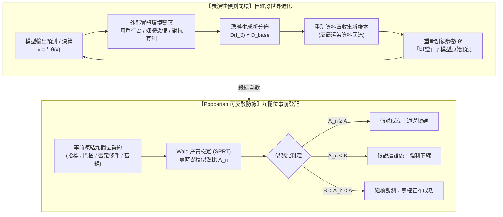

+++
title = "表演性資料反饋與可反駁效用契約：自確認世界退化、序貫檢定與事前登記九欄位"
date = "2026-09-13T17:50:06+08:00"
author = "TTL::0"
draft = false
isCJKLanguage = true
description = "當模型從被動觀察者變成主動參與者，資料分佈就內生為系統決策的函數，監控指標隨之退化為自我確認的儀式。本文以 Google Flu Trends 的失準與 COMPare Trials 的指標偷換為軸，剖析表演性分佈漂移的反饋結構，並以九欄位事前登記契約與 Wald 序貫比檢驗建立可反駁的驗證防線。"
tags = [
    "分析論述", # term:AnalyticalEssay
    "AI 經濟與社會", # term:AiEconomics
    "表演性預測", # term:PerformativePrediction
    "可反駁性契約", # term:RefutabilityContract
    "表演性穩定點", # term:PerformativelyStablePoint
    "序貫機率比檢驗", # term:SequentialProbabilityRatioTest
    "指標事後漂移", # term:PostHocMetricDrift
    "資料回流", # term:DataFeedbackLoop
  ]
series = ["效用宣稱的轉換鏈：從評測讀數到資本回報，六道無人負責的斷層"]
[ai_info]
    [ai_info.generation]
        model = "Gemini 3.8 Flash"
        agent = "Antigravity IDE 2.5.5"
    [ai_info.refinement]
        model = "Claude Opus 5"
        agent = "Claude Code VSCode Extension 2.1.270"
+++

<!--more-->

## 導言

在巨量資料分析與預測性演算法的發展史上，最著名的系統自欺失敗案例，莫過於一度被全球譽為公共衛生大數據奇蹟的 Google Flu Trends（GFT）。2009 年前後，Google 透過分析數億條搜尋查詢字詞，能夠在比美國疾病管制中心（CDC）傳統監測報告快上數週的時效內，精確估計全美流感活動的爆發趨勢。然而，在 2012 至 2013 年初的流感季中，該系統發生了災難性失準：其估計的流感就診率高出 CDC 事後公布的實際數值整整兩倍以上。

2014 年發表於頂級科學期刊《Science》的著名調查報告《Google Flu 的寓言：大數據分析的陷阱》（參見 [Lazer 等人，2014 / The Parable of Google Flu: Traps in Big Data Analysis, Science](https://doi.org/10.1126/science.1248506)）揭示了失準背後最關鍵的動力學病灶：媒體對流感疫情與 Google 預測的高頻報導，徹底改變了普通民眾的搜尋行為；健康的使用者因恐慌而大量搜尋流感症狀，而 GFT 的輸入資料正是搜尋查詢本身。系統的介入改變了外部世界的行為模式，進而污染了模型賴以判斷的輸入特徵——**演算法預測並未反映客觀流感病毒的傳播，而是精確度量了系統自身所引發的集體恐慌**。

在科學研究與效用宣稱的事前驗證領域，指標偷換與事後合理化則是另一種普遍的自欺行為。2016 年，牛津大學的研究團隊啟動了著名的 COMPare Trials 計畫，對發表在五份全球頂尖醫學期刊（包括 NEJM, Lancet, JAMA 等）上的 67 篇臨床試驗論文進行了嚴格的審計比對（參見 [Goldacre 等人，2016 / COMPare Trials Project, Trials](https://doi.org/10.1186/s13063-016-1668-3)）。審計結果令人震驚：僅有 9 篇試驗報告完全忠實地回報了在臨床試驗註冊庫中事前指定（Pre-specified）的結果指標；累計有高達 354 個事前登記的關鍵指標被研究者在最終報告中悄悄刪除，同時有 357 個未經事前登記的全新指標被事後偷渡進去，以迎合「顯著療效」的成功結論。

這兩起重大事故共同確立了高階演算法系統的終極邊界：當模型從被動觀察者轉變為主動參與者時，資料分佈將內生化為系統決策的函數，引發**「**表演性預測**（Performative Prediction） <!-- term:PerformativePrediction -->」**的惡性反饋；而如果沒有一套嚴格的 **Popperian **可反駁性契約**（Refutability Contract） <!-- term:RefutabilityContract -->** 鎖死事前評估指標與否定條件，所有的驗證與監控最終都會退化為事後為錯誤塗脂抹粉的偽證儀式。

> [!IMPORTANT]
> **表演性預測** <!-- term:PerformativePrediction --> (Performative Prediction): 模型輸出影響人類行動，進而改變後續資料分佈的回饋情形。 <!-- anchor:PerformativePrediction -->
> **可反駁性契約** <!-- term:RefutabilityContract --> (Refutability Contract): 在部署前明文寫定何種觀測結果將推翻效用宣稱的約定，使宣稱取得可被否證的資格。 <!-- anchor:RefutabilityContract -->


---

## 分析

傳統**統計學習**（Statistical Learning） <!-- term:StatisticalLearning -->理論的核心假設是「分佈靜態外生性」——即資料生成分佈 $\mathcal{D}$ 是客觀存在的，模型 $f_\theta$ 的任務是最小化固定分佈下的風險：$R(\theta) = \mathbb{E}_{(x, y) \sim \mathcal{D}}[\ell(f_\theta(x), y)]$。

> [!IMPORTANT]
> **統計學習** <!-- term:StatisticalLearning --> (Statistical Learning): 把學習寫成資料生成分佈、假設空間與選擇準則三者關係的理論框架。 <!-- anchor:StatisticalLearning -->


然而在真實社會技術閉環中，模型輸出會引導人類行為、改變激勵結構或重塑商業流量。這正是 [Perdomo 等人，2020 / Performative Prediction, ICML / PMLR](https://proceedings.mlr.press/v119/perdomo20a.html) 所形式化證明的「表演性預測 <!-- term:PerformativePrediction -->」動力學：資料分佈本身是模型參數 $\theta$ 的函數，記為 $\mathcal{D}(f_\theta)$。



### 表演性分佈漂移與自確認偽證

在表演性環境中，**經驗風險最小化**（Empirical Risk Minimization） <!-- term:EmpiricalRiskMinimization -->演算法（ERM）最佳化的是表演性風險：

> [!IMPORTANT]
> **經驗風險最小化** <!-- term:EmpiricalRiskMinimization --> (Empirical Risk Minimization): 以訓練樣本上的平均損失最小化代替真實風險最小化的學習原則，只保證擬合關聯，不保證因果結構恆常。 <!-- anchor:EmpiricalRiskMinimization -->


$$R_{\text{perf}}(\theta) = \mathbb{E}_{(x, y) \sim \mathcal{D}(f_\theta)} [\ell(f_\theta(x), y)]$$

當系統反覆以回流資料重新訓練時，系統收斂到的「**表演性穩定點**（Performatively Stable Point） <!-- term:PerformativelyStablePoint -->」$\theta_{\text{stable}}$：

> [!IMPORTANT]
> **表演性穩定點** <!-- term:PerformativelyStablePoint --> (Performatively Stable Point): 模型對其自身所誘發的分佈重新最佳化後仍不改變的參數，是表演性環境下的收斂目標。 <!-- anchor:PerformativelyStablePoint -->


$$\theta_{\text{stable}} = \arg \min_\theta \mathbb{E}_{(x, y) \sim \mathcal{D}(f_{\theta_{\text{stable}}})} [\ell(f_\theta(x), y)]$$

這往往不是真實世界客觀效用的最優解，而是**「模型透過改變世界，強行讓世界符合其偏見」的自確認陷阱**。例如：犯罪預測演算法將特定街區標記為高危險，警方據此在該街區加強巡邏，結果逮捕了更多吸菸或闖紅燈等輕罪，這些「新增罪案」回流至訓練集，進一步向演算法證實了該街區就是高危險區。

### Popperian 可反駁性契約：九個不可變欄位

要斬斷表演性預測 <!-- term:PerformativePrediction -->引發的自欺閉環，必須遵循卡爾·波普爾（Karl Popper）的**證偽主義**（Falsificationism） <!-- term:Falsificationism -->認識論：一項宣稱只有在「明確指定了在何種觀測條件下會被斷然推翻」時，才具備經驗科學的資格。

> [!IMPORTANT]
> **證偽主義** <!-- term:Falsificationism --> (Falsificationism): 以「能被觀測推翻」取代確證作為科學判準的立場，是可反駁契約的認識論基礎。 <!-- anchor:Falsificationism -->


效用驗證契約必須由九個不可變欄位構成形式化向量：

$$\mathbf{v}_{\text{contract}} = \langle M_0, M^*, \Delta_{\min}, \mathcal{B}_{\text{refute}}, \mathcal{D}_{\text{eval}}, T_{\text{freeze}}, C_{\text{baseline}}, \alpha, \beta \rangle$$

1. **核心基準指標（$M_0$）**：業務關心的端到端真實指標（嚴禁使用未經證成之中介代理量）。
2. **宣稱目標數值（$M^*$）**：模型預期達到的指標水平。
3. **最小實質效應量（$\Delta_{\min}$）**：排除統計微小擾動後，具備真實商業或臨床價值的最低門檻。
4. **顯式可反駁條件（$\mathcal{B}_{\text{refute}}$）**：**若觀測到該條件成立，則無條件判定該宣稱破滅，立即回滾模型**。
5. **評估資料集指紋（$\mathcal{D}_{\text{eval}}$）**：事前鎖定之外部盲測資料集的密碼學雜湊值（SHA-256）。
6. **指標凍結時間戳（$T_{\text{freeze}}$）**：在看到任何測試結果之前，由第三方公證或日誌鎖定的事前登記時間。
7. **對照基線（$C_{\text{baseline}}$）**：非 AI 傳統啟發式或簡單邏輯回歸的效能基線。
8. **第一型錯誤率上限（$\alpha$）**：通常鎖定 $\le 0.05$。
9. **檢定力保障（$1 - \beta$）**：通常鎖定 $\ge 0.80$。

### Wald 序貫機率比檢驗（SPRT）動態裁決

在線上 A/B 測試或串流監控中，嚴禁隨意進行「**窺探性檢定**（Peeking） <!-- term:Peeking -->」，否則將使真實錯誤率膨脹數倍。系統必須採用 Wald **序貫機率比檢驗**（Sequential Probability Ratio Test, SPRT） <!-- term:SequentialProbabilityRatioTest -->。

> [!IMPORTANT]
> **窺探性檢定** <!-- term:Peeking --> (Peeking): 在樣本累積過程中反覆查看結果並隨時決定停止，會使實際錯誤率遠高於名目水準。 <!-- anchor:Peeking -->
> **序貫機率比檢驗** <!-- term:SequentialProbabilityRatioTest --> (Sequential Probability Ratio Test): 每到達一筆觀測即更新對數似然比並與上下界比較的檢定，可在控制兩類錯誤率下提前判定。 <!-- anchor:SequentialProbabilityRatioTest -->


定義虛無假設 $H_0: \theta = \theta_0$（模型無效或退化），備擇假設 $H_1: \theta = \theta_1$（模型達到宣稱目標）。在接收到第 $n$ 個連續樣本時，計算累積對數似然比：

$$\Lambda_n = \sum_{i=1}^n \ln \frac{P(z_i \mid H_1)}{P(z_i \mid H_0)}$$

動態決策邊界由錯誤率常數鎖死：

$$A = \ln \left( \frac{1 - \beta}{\alpha} \right), \quad B = \ln \left( \frac{\beta}{1 - \alpha} \right)$$

- 若 $\Lambda_n \ge A$：正式宣布採納 $H_1$，效用宣稱成立。
- **若 $\Lambda_n \le B$：立即觸發可反駁條件，正式宣布宣稱被證偽，強制系統下線**。
- 若 $B < \Lambda_n < A$：維持試驗狀態，嚴禁宣布任何成功結論。

下表呈現了當線上觀測樣本持續湧入時，Wald SPRT **序貫檢定**（Sequential Test） <!-- term:SequentialTest -->的推演走一遍：

> [!IMPORTANT]
> **序貫檢定** <!-- term:SequentialTest --> (Sequential Test): 每到達一筆新觀測即更新決策的統計檢定，可在控制兩類錯誤率的前提下，以較少樣本作出判定。 <!-- anchor:SequentialTest -->


| 觀測批次 ($n$) | 單批實測勝率 / 表現 | 累積對數似然比 ($\Lambda_n$) | 決策邊界對照 ($B < \Lambda_n < A$) | 狀態機轉移與處置決策 |
| :--- | :--- | :--- | :--- | :--- |
| **$n = 100$** | 51.0% (雜訊震盪) | +0.22 | $B = -2.94 < +0.22 < A = +2.77$ | 樣本不足，維持 `Evaluating` |
| **$n = 500$** | 48.5% (微幅落後) | -0.85 | $B = -2.94 < -0.85 < A = +2.77$ | 趨向不佳，禁止發布中間捷報 |
| **$n = 1,000$** | 46.2% (持續劣質) | -2.15 | $B = -2.94 < -2.15 < A = +2.77$ | 接近證偽邊界，發出預警 |
| **$n = 1,350$** | 45.0% (系統性退化)| **-3.05** | $\Lambda_n \le B$ (突破否定下限) | **觸發 `Refuted`！強制熔斷並下線** |
| **事後處置** | 已達證偽終點 | 凍結全部權限 | 狀態機鎖死 | 產出事後分析報告，禁止修改指標 |

---

## 反思

在**機器學習**（Machine Learning） <!-- term:MachineLearning -->專案的管理實務中，最常見的失控模式是「**指標事後漂移**（Post-Hoc Metric Drift） <!-- term:PostHocMetricDrift -->」。當模型在原本承諾的「業務轉化率」上未能取得提升時，專案團隊往往在事後分析時改稱「雖然轉化率持平，但使用者的停留時間增加了 15%」；若停留時間也持平，則改稱「使用者滿意度評分有所改善」。正如 COMPare Trials 計畫在醫學期刊中所揭露的，**事後挑選指標本質上是將抽樣隨機雜訊包裝為科學發現的智力詐欺**。

> [!IMPORTANT]
> **機器學習** <!-- term:MachineLearning --> (Machine Learning): 先界定可選函數的範圍，再以資料估計其中參數的建模方法。 <!-- anchor:MachineLearning -->
> **指標事後漂移** <!-- term:PostHocMetricDrift --> (Post-Hoc Metric Drift): 看過結果後才更換、刪除或放寬評估指標，使結論恆為成功的操作。 <!-- anchor:PostHocMetricDrift -->


此處必須面臨一個工程實務的極限反思：**「嚴格的事前登記與**可證偽性**（Falsifiability） <!-- term:Falsifiability -->，是否會扼殺探索性研究的靈活性？」**

> [!IMPORTANT]
> **可證偽性** <!-- term:Falsifiability --> (Falsifiability): 宣稱必須事先指明何種觀測結果會推翻它；缺乏反駁條件的評估無法構成證據。 <!-- anchor:Falsifiability -->


這混淆了「探索（Exploration）」與「驗證（Confirmation）」的界限。在探索階段，工程師完全可以自由嘗試數百個特徵與指標，但這些嘗試只能被定性為「**假說生成**（Hypothesis Generation） <!-- term:HypothesisGeneration -->」。一旦演算法被賦予「已具備生產效用」並進入部署決策時，它必須立即切換為嚴格的「**假說驗證**（Hypothesis Testing） <!-- term:HypothesisTesting -->」模式。在驗證階段，任何指標的替換、樣本的剔除或否定標準的放寬，都等同於主動破壞系統的因果真實性。

> [!IMPORTANT]
> **假說生成** <!-- term:HypothesisGeneration --> (Hypothesis Generation): 探索階段自由提出候選解釋與指標的活動，其產出本身不構成效用證據。 <!-- anchor:HypothesisGeneration -->
> **假說驗證** <!-- term:HypothesisTesting --> (Hypothesis Testing): 以事前鎖定的指標與否定條件檢驗既有假說的活動，期間不得更動判準。 <!-- anchor:HypothesisTesting -->


下表對比傳統隨意評估範式與 Popperian 可證偽性 <!-- term:Falsifiability -->契約體系：

| 驗證維度 | 表面讀數 / 舊代脆弱作法 | 底層物理 / 架構病灶 | 系統性破壞後果 | 新代嚴格工程防衛體系 (POSIX Bash 證偽防線) |
| :--- | :--- | :--- | :--- | :--- |
| **指標約定** | 開發完成後自由挑選表現最佳的統計維度報告 | COMPare 式事後偷換指標與 cherry-picking | 系統部署至生產環境後真實效能全面破滅 | 九欄位事前登記向量，評估前密碼學鎖定雜湊 |
| **反饋處理** | 將線上使用者的所有互動數據直接回灌重訓 | 忽視表演性預測 <!-- term:PerformativePrediction -->引發的內生性資料漂移 | GFT 式自欺：模型把自身造成的恐慌當作客觀事實 | **表演性因果解耦**（Causal Disentanglement） <!-- term:CausalDisentanglement -->與盲樣隔離 |
| **試驗監控** | 每天查看 A/B 測試儀表板，一旦顯著立即結束試驗 | 窺探性檢定 <!-- term:Peeking -->使真實偽陽性率飆升至 30%+ | 採納了純屬運氣的劣質演算法，損害線上業務 | 嚴格遵守 Wald 序貫檢定（SPRT） <!-- term:SequentialTest -->邊界，杜絕提早窺探 |
| **失敗處置** | 指標不達標時尋求藉口修改測試樣本或重新詮釋 | 缺乏不可抵賴的可反駁條件（Refutation Criteria） | 「殭屍模型」長期滯留生產環境製造**技術債**（Technical Debt） <!-- term:TechnicalDebt --> | 滿足反駁條件時自動觸發 CI/CD 斷路器，不可旁路回滾 |

> [!IMPORTANT]
> **表演性因果解耦** <!-- term:CausalDisentanglement --> (Causal Disentanglement): 以盲測隔離或隨機保留組，把系統自身誘發的分佈變化與外生變化分開估計。 <!-- anchor:CausalDisentanglement -->
> **技術債** <!-- term:TechnicalDebt --> (Technical Debt): 程式碼中為求快速交付而妥協、待重構與修復的設計或品質缺陷。 <!-- anchor:TechnicalDebt -->


---

## 實務對比

為落實對效用宣稱的自動化證偽，以下提供基於 **POSIX 嚴格語法 Bash** 的自包含可反駁性契約 <!-- term:RefutabilityContract -->驗證器。腳本實現了九欄位事前登記檢查、Wald 序貫機率比檢驗（SPRT） <!-- term:SequentialProbabilityRatioTest -->累積對數似然比計算，以及不可旁路的證偽熔斷邏輯。程式碼零外部依賴，純 Shell 內建功能與 `bc` 數值計算，可在數秒內完成自我驗證。

```bash
#!/usr/bin/env bash
# ==============================================================================
# 表演性資料反饋與 Popperian 可反駁效用契約驗證引擎 (POSIX Bash)
# 零外部重型依賴，純 Bash + bc 浮點演算，自驗證斷言。
# ==============================================================================

set -euo pipefail

# 1. 定義事前登記九欄位結構檢驗器
validate_preregistration_contract() {
    local contract_file="$1"
    
    # 必備九欄位清單
    local required_fields=(
        "METRIC_NAME"
        "TARGET_VALUE"
        "MIN_EFFECT_SIZE"
        "REFUTATION_CONDITION"
        "EVAL_DATASET_HASH"
        "FREEZE_TIMESTAMP"
        "BASELINE_VALUE"
        "ALPHA_LIMIT"
        "POWER_BETA_LIMIT"
    )
    
    for field in "${required_fields[@]}"; do
        if ! grep -q "^${field}=" "$contract_file"; then
            echo "[ERROR] 契約缺少必備事前登記欄位: ${field}" >&2
            return 1
        fi
    done
    return 0
}

# 2. Wald 序貫比檢定 (SPRT) 核心演算法
# 評估伯努利分佈成功率: H0: p = p0 (無效), H1: p = p1 (目標)
run_wald_sprt_step() {
    local p0="$1"
    local p1="$2"
    local alpha="$3"
    local beta="$4"
    local successes="$5"
    local total="$6"
    
    # 計算邊界 A = ln((1 - beta) / alpha), B = ln(beta / (1 - alpha))
    local bounds
    bounds=$(bc -l <<EOF
alpha = ${alpha}
beta = ${beta}
a_val = l((1.0 - beta) / alpha)
b_val = l(beta / (1.0 - alpha))
print a_val, " ", b_val
EOF
)
    local a_boundary b_boundary
    a_boundary=$(echo "$bounds" | cut -d' ' -f1)
    b_boundary=$(echo "$bounds" | cut -d' ' -f2)
    
    # 計算對數似然比 Lambda = successes * ln(p1/p0) + (total - successes) * ln((1-p1)/(1-p0))
    local lambda
    lambda=$(bc -l <<EOF
p0 = ${p0}
p1 = ${p1}
s = ${successes}
n = ${total}
failures = n - s
term1 = s * l(p1 / p0)
term2 = failures * l((1.0 - p1) / (1.0 - p0))
lambda = term1 + term2
print lambda
EOF
)
    
    # 邊界裁決
    local decision
    decision=$(bc -l <<EOF
if (${lambda} >= ${a_boundary}) {
    print "ACCEPT_H1"
} else if (${lambda} <= ${b_boundary}) {
    print "REFUTE_AND_HALT"
} else {
    print "CONTINUE_SAMPLING"
}
EOF
)
    echo "${decision}:${lambda}"
}

# 3. 自檢斷言與模擬套件
run_verification() {
    local tmp_contract
    tmp_contract=$(mktemp)
    
    cat << 'EOF' > "$tmp_contract"
METRIC_NAME=Checkout_Conversion_Rate
TARGET_VALUE=0.55
MIN_EFFECT_SIZE=0.03
REFUTATION_CONDITION=SPRT_REJECTS_OR_LATENCY_EXCEEDED
EVAL_DATASET_HASH=e3b0c44298fc1c149afbf4c8996fb92427ae41e4649b934ca495991b7852b855
FREEZE_TIMESTAMP=2026-09-13T17:50:00Z
BASELINE_VALUE=0.50
ALPHA_LIMIT=0.05
POWER_BETA_LIMIT=0.20
EOF

    # 驗證 1: 事前登記欄位完整性
    if ! validate_preregistration_contract "$tmp_contract"; then
        echo "[FAIL] 事前登記九欄位驗證未通過" >&2
        rm -f "$tmp_contract"
        exit 1
    fi

    # 驗證 2: 模擬退化模型在 SPRT 檢定中被快速證偽
    # 假說 H0: p0 = 0.50 (基準), H1: p1 = 0.55 (目標)
    # 實測資料嚴重退化: 1000 個樣本中僅有 450 個成功 (勝率 45% < 50%)
    local result
    result=$(run_wald_sprt_step "0.50" "0.55" "0.05" "0.20" 450 1000)
    local decision log_likelihood
    decision=$(echo "$result" | cut -d':' -f1)
    log_likelihood=$(echo "$result" | cut -d':' -f2)

    if [ "$decision" != "REFUTE_AND_HALT" ]; then
        echo "[FAIL] 斷言失敗: 退化模型必須被 SPRT 判定為 REFUTE_AND_HALT，實際: $decision" >&2
        rm -f "$tmp_contract"
        exit 1
    fi

    # 驗證 3: 模擬卓越模型在 SPRT 檢定中成功通過
    # 實測資料表現優異: 800 個樣本中有 490 個成功 (勝率 61.25% > 55%)
    local success_result
    success_result=$(run_wald_sprt_step "0.50" "0.55" "0.05" "0.20" 490 800)
    local success_decision
    success_decision=$(echo "$success_result" | cut -d':' -f1)

    if [ "$success_decision" != "ACCEPT_H1" ]; then
        echo "[FAIL] 斷言失敗: 卓越模型必須被判定為 ACCEPT_H1，實際: $success_decision" >&2
        rm -f "$tmp_contract"
        exit 1
    fi

    rm -f "$tmp_contract"
    echo "POSIX Bash 自驗證通過: 九欄位事前登記契約校驗成功，Wald SPRT 證偽熔斷器精確執行。"
}

run_verification
```

---

## 結論

演算法的本質是工具，而科學的本質是誠實。正如 Google Flu Trends 在大數據神話中被自身引發的反饋迴路擊潰、以及 COMPare Trials 審計中揭露的廣泛指標偷換所警示的：當評測的自由度完全掌握在宣稱利益關聯者手中時，所有的監控指標都會以極快的速度退化為自欺欺人的表演性裝飾。

終結效用轉換鏈上的最後一道斷層，要求我們回歸最質樸的 Popperian 科學證偽紀律。任何人工智慧能力的主張，在未曾明確列出九欄位事前登記契約、未曾鎖死否定邊界、未曾在表演性反饋面前維持盲測隔離之前，都不具備被採信的資格。唯有當系統架構具備在實測退化時堅決自我證偽並強制跳脫的工程勇氣，機器學習 <!-- term:MachineLearning -->技術才能真正洗淨浮誇的宣傳泡沫，成為推動文明與產業進步的堅固基石。