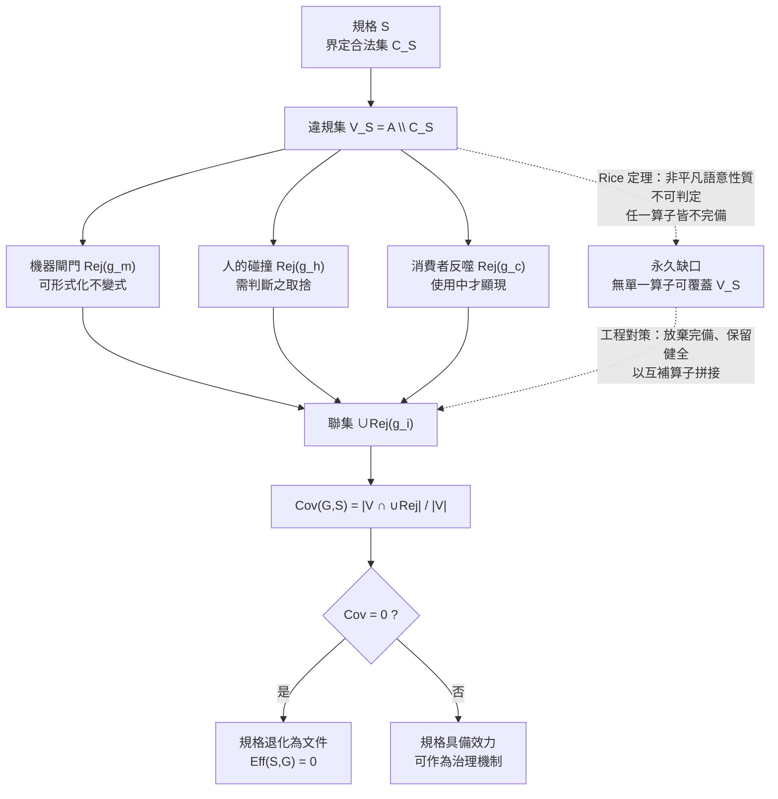

+++
title = "拒絕算子與約束覆蓋代數：規格效力的形式定義、不可判定性下的三算子互補，與缺席的零訊息量"
date = "2026-09-14T10:20:01+08:00"
author = "梅乾"
draft = false
isCJKLanguage = true
description = "一份規格的價值不等於文字完備性，而等於其誘導的拒絕能力對違規空間的覆蓋率。本文以集合論形式化拒絕算子與約束覆蓋率，基於萊斯定理證明單一檢查器無法完備，論證機器、人與消費者三類算子互補的必然性，並揭示流程稽核無法偵測檢查缺席的盲區。"
tags = [
    "分析論述", # term:AnalyticalEssay
    "規格效力", # term:SpecificationEfficacy
    "拒絕算子", # term:Rejector
    "型別狀態", # term:Typestate
    "不可判定性", # term:Undecidability
    "確定性邊界", # term:DeterministicTrustBoundary
    "約束覆蓋率", # term:ConstraintCoverage
    "場景綁定", # term:ScenarioBinding
  ]
series = ["可失敗性工程：從拒絕算子、成本位移到驗證獨立性與可證偽契約"]
[ai_info]
    [ai_info.generation]
        model = "Claude Opus 5"
        agent = "Claude Code VSCode Extension 2.1.270"
    [ai_info.refinement]
        model = "Gemini 3.8 Flash"
        agent = "Antigravity IDE 2.5.5"
+++

<!--more-->

## 導言

2024 年 12 月 19 日，SmartBear 將 Cucumber 移交給 Open Source Collective。隔天，Tricentis 宣布終止 SpecFlow。同月 31 日 SpecFlow 正式終止支援，隔日程式碼倉庫遭刪除、支援網站關閉。兩家彼此獨立的商業公司，在二十四小時內先後放掉同一個規格生態系的兩個旗艦實作——分別是 Java 與 .NET 生態的事實標準。

這件事之所以需要解釋，是因為所有現成的失敗理由都不成立。該生態系的規格格式沒有技術缺陷，它的三段式場景描述在宿主死亡後仍被各種輕量實作逐條沿用；它的採用率不低；它甚至沒有被更好的競品取代，社群後來是靠原作者的分叉專案自行接手維護。一個格式正確、採用廣泛、無替代品的技術，為什麼會被兩個獨立的商業判斷在同一週淘汰？

回推這個問題，會撞上一個比「規格很重要」精確得多的東西。實務社群事後提出的三個死因裡，只有一個撐得住檢驗：格式笨重撐不住，因為格式在宿主死亡後繼續存活；膠水層維護成本只撐得住一半，因為那層把自然語言句子綁定到函式呼叫的程式碼確實昂貴，但它保證的只是「每個句子都有實作」，不保證「句子描述了那個實作」——句子與綁定程式碼會各自漂移，而綁定檢查看不見這種漂移；真正撐得住的是第三個：協作前提從未成立，非技術人員從來沒有寫過、甚至沒有讀過那些場景，整套東西最終淪為開發與測試人員自己維護的一種測試用領域特定語言。

把三個說法疊在一起，浮現的不是三個獨立缺陷，而是一個共同結構：**這套技術原本設計了三個會壞掉的環節，而三個都不在了。** 於是本文要建立的判準是：一份規格的價值，不等於它的文字完備性，而等於它所誘導的拒絕能力對違規空間的覆蓋。這個判準必須被寫成可計算的形式，否則它只是另一句聽起來對的話。

---

## 分析

### 規格效力的形式定義：從文字性質移到集合覆蓋

設產物空間為 $A$（所有可能被提交的程式碼、設定、文件、變更）。一份規格 $S$ 在語意上界定了合法產物集 $C_S \subseteq A$，其補集 $V_S = A \setminus C_S$ 即**違規集**（Violation Set） <!-- term:ViolationSet -->。

> [!IMPORTANT]
> **違規集** <!-- term:ViolationSet --> (Violation Set): 在產物空間中不滿足規格語意所界定之合法集合的非法產物補集。 <!-- anchor:ViolationSet -->


規格文字本身不具備任何執行力：$S$ 是 $C_S$ 的一個描述，而描述不改變 $A$ 中任何元素的命運。真正改變命運的是**拒絕算子**（Rejector） <!-- term:Rejector -->——一個可判定的映射

> [!IMPORTANT]
> **拒絕算子** <!-- term:Rejector --> (Rejector): 將產物空間映射為接受或拒絕二元判定的一種形式化映射或工程閘門，其拒絕判定所對應之輸入原像構成拒絕集。 <!-- anchor:Rejector -->


$$g: A \to \{\top, \bot\}, \qquad \mathrm{Rej}(g) = g^{-1}(\bot)$$

它的工程實體可以是會擋下建置的檢查、會當面反駁你的人，或會壞掉的下游。給定一族實際部署的算子 $G = \{g_1, \dots, g_n\}$，定義兩個性質：

- **健全性**（Soundness） <!-- term:Soundness -->：$\mathrm{Rej}(g) \subseteq V_S$。算子不誤殺合法產物。
- **約束覆蓋率**（Constraint Coverage） <!-- term:ConstraintCoverage -->：$\displaystyle \mathrm{Cov}(G, S) = \frac{\left| V_S \cap \bigcup_{i} \mathrm{Rej}(g_i) \right|}{|V_S|}$。

> [!IMPORTANT]
> **健全性** <!-- term:Soundness --> (Soundness): 拒絕算子絕不誤判合法產物的性質，即算子之拒絕集必為違規集之子集。 <!-- anchor:Soundness -->
> **約束覆蓋率** <!-- term:ConstraintCoverage --> (Constraint Coverage): 部署之拒絕算子族所拒絕的違規產物集合，佔全體違規產物集合的比例，為衡量規格實際效力的形式底座。 <!-- anchor:ConstraintCoverage -->


**規格效力**（Specification Efficacy） <!-- term:SpecificationEfficacy -->於是被定義為 $\mathrm{Eff}(S, G) = \mathrm{Cov}(G, S)$，而非 $S$ 的字數、章節數或精確度。這個定義立刻給出一條退化定理：

> [!IMPORTANT]
> **規格效力** <!-- term:SpecificationEfficacy --> (Specification Efficacy): 一份規格透過其實際部署之拒絕算子對違規產物空間產生的實質約束能力，形式上等價於約束覆蓋率。 <!-- anchor:SpecificationEfficacy -->


$$\bigcup_i \mathrm{Rej}(g_i) = \varnothing \;\Longrightarrow\; \forall S, \; \mathrm{Eff}(S, G) = 0$$

也就是說，**文字完備性與效力在形式上正交**。一份寫得極其詳盡的規格，只要沒有任何算子會因它而拒絕任何東西，它對系統行為的約束力就是零——不是「比較弱」，是恰好為零。

這個判準並非外部評論者強加的標準。該生態系的官方定位本身就寫著：團隊產出的文件與自動化測試可以想成「不錯的副作用」，真正的目標是有價值、能運作的軟體。工具的作者把自己的產物降級為副作用，而後續十幾年裡，使用它的組織持續在計算那個副作用的覆蓋率。

值得指出的是，這個「描述與拒絕分離」的結構是形式方法的原初洞見，而非新發現。[Hoare，1969 / 《An Axiomatic Basis for Computer Programming》](https://doi.org/10.1145/363235.363259) 把程式的正確性寫成三元組 $\{P\}\, C \,\{Q\}$，其力量正在於它使「不滿足 $Q$」成為一個可被推導出的拒絕事件；同樣地，[Wright 與 Felleisen，1994 / 《A Syntactic Approach to Type Soundness》](https://doi.org/10.1006/inco.1994.1093) 把型別健全性 <!-- term:Soundness -->拆成 progress 與 preservation 兩個可證命題，使型別系統成為一個有嚴格 soundness 保證的拒絕算子 <!-- term:Rejector -->。相對地，[IETF，RFC 2119](https://datatracker.ietf.org/doc/html/rfc2119) 標準化了規範性語彙 MUST / SHOULD / MAY——它讓規格文字的義務層級變得精確，卻不自帶任何拒絕算子 <!-- term:Rejector -->。RFC 2119 的存在本身就是「文字精確度 $\neq$ 效力」的工程佐證：把 SHOULD 改成 MUST 不會讓任何建置失敗，除非有人另外實作了那道閘門。

這裡需要就地釐清一個貫穿全文的前提：**確定性邊界（Deterministic Trust Boundary） <!-- term:DeterministicTrustBoundary --> vs 統計執行層**。確定性邊界 <!-- term:DeterministicTrustBoundary -->是指那些對同一輸入永遠給出同一判定、且判定結果具有拒絕力的機制——編譯器、型別檢查、測試執行環境、契約斷言、資料庫約束。統計執行層則是指以機率分佈產生輸出、不保證對同一輸入給出同一結果、且預設不產生拒絕的機制。兩者不可互換：把一個統計執行層放在原本由確定性邊界 <!-- term:DeterministicTrustBoundary -->把守的位置，覆蓋率不是下降，而是該位置的 $\mathrm{Rej}$ 直接歸為空集。

> [!IMPORTANT]
> **確定性邊界** <!-- term:DeterministicTrustBoundary --> (Deterministic Trust Boundary): 在系統設計中，劃分確定性執行層（如腳本、CI）與統計推論層（如大語言模型）的介面契約，以確保關鍵操作的 100% 正確性。 <!-- anchor:DeterministicTrustBoundary -->


**因果機制**：拒絕算子 <!-- term:Rejector -->是唯一能改變產物命運的物件，規格文字只能改變人對產物的描述。當所有算子的拒絕集為空，產物空間上沒有任何點被排除，規格與空規格在外延上等價。

**邊界條件**：此判準不適用於刻意不承擔約束的產物。入門文件、設計理由的紀錄、給未來讀者的說明，都不讓任何東西壞掉而仍然有價值。判準在此劃界而非失效——這類產物的正確定位就是文件，投入應按文件計算。判準禁止的只有一件事：把不裝拒絕算子 <!-- term:Rejector -->的東西當成治理機制。

**反例**：那個退場事件本身。一套形式完備、語法嚴格、社群龐大的規格技術，在三類拒絕算子 <!-- term:Rejector -->全部缺席後，撐了大約十六年然後被商業判斷淘汰。它不是敗給更好的東西，是敗給「自己沒有效力」這件事終於被算清楚。

### 為何必須是三類算子：不可判定性給出的下界

上一節定義了覆蓋率，但沒有回答一個更基本的問題：為什麼不能只裝一個夠強的檢查器？

答案來自可計算性的硬限制。[Rice，1953 / 《Classes of Recursively Enumerable Sets and Their Decision Problems》](https://doi.org/10.1090/S0002-9947-1953-0053041-6) 證明：程式的任何非平凡語意性質都不可判定。這意味著對於任何涉及程式行為（而非語法形狀）的規格條款，不存在一個既健全又完備的判定程序。工程上唯一的出路是放棄完備性、保留健全性 <!-- term:Soundness -->——每個實際可部署的算子都只能覆蓋 $V_S$ 的一個真子集。

於是覆蓋成為一個集合拼接問題，而三類算子的差異正是它們能拼到的子集不同：

| 拒絕算子 <!-- term:Rejector -->類別 | 覆蓋的違規子集 | 判定性質 | 成本結構 |
| :--- | :--- | :--- | :--- |
| 機器閘門 | 可形式化的**不變式**（Invariant） <!-- term:Invariant -->違規（型別、契約、資料約束、可判定的語法與結構性質） | 確定性、可重複、不需閱讀 | 裝一次，之後每次變更複利生效 |
| 人的碰撞 | 需要判斷的取捨違規（抽象層級是否恰當、這東西該不該存在、是不是第四份幾乎一樣的實作） | 非確定性、不可重複 | 每次都要重新支付注意力，不隨規模擴展 |
| 消費者反噬 | 只有真實使用才顯現的違規（沒想到的使用方式、真實負載下的行為、下游實際依賴的性質） | 事後、非同步 | 維護成本為零，但無法自行選擇它是否存在 |

> [!IMPORTANT]
> **不變式** <!-- term:Invariant --> (Invariant): 系統在任何合法狀態下都必須成立的斷言，是把評估規則寫成可執行檢查的基本單位。 <!-- anchor:Invariant -->


三者不可互相替代，因為它們的覆蓋子集在集合上不相交於全部：機器覆蓋不了需要判斷的取捨（Rice 定理），人覆蓋不了自己沒想到的使用方式（認知邊界），消費者覆蓋不了不可見的性質（可維護性、耦合、多數安全性質都不在使用者視野內）。任何一類缺席，該範圍就沒有任何東西在守。

下圖把這個覆蓋結構畫出來，並標出**不可判定性**（Undecidability） <!-- term:Undecidability -->造成的永久缺口：

> [!IMPORTANT]
> **不可判定性** <!-- term:Undecidability --> (Undecidability): 依據萊斯定理，任何程式的非平凡語意性質皆無法由通用演算法在有限時間內做出健全且完備的判定。 <!-- anchor:Undecidability -->




回到那個退場事件，三類算子的實際狀態是：協作前提失敗使「人的碰撞」從未真正建立；綁定檢查只驗到句子有無實作，使「機器閘門」弱化為形狀層級，擋得住結構性疏漏、擋不住語意漂移；而測試自動化的產物不會被任何下游消費，「消費者反噬」從一開始就不在場。覆蓋率不是零，但長期停在一個無法抵銷維護成本的低位。商業公司比社群更早算清這筆帳，所以是它們先退場。

**因果機制**：不可判定性 <!-- term:Undecidability -->強制每個算子放棄完備性，因此覆蓋只能靠互補拼接；互補算子的覆蓋子集由它們各自能接觸的資訊決定，而三類算子接觸的資訊種類不同。

**邊界條件**：在封閉、可完全列舉、且無外部使用者的微世界裡，單一算子可以達到完全覆蓋。編譯器最佳化 pass 的位元組碼大小、純函數的輸入輸出表、有限狀態協定的可達性分析，都屬於這一類——那裡機器閘門就是全部。

**反例**：把架構判斷交給可形式化的閘門。「這個抽象是否恰當」不是一個可判定性質，為它設計的任何自動檢查都只能檢到語法代理（檔案長度、圈複雜度、依賴數），而代理與被指涉物之間沒有蘊涵關係。結果是閘門全綠而抽象持續劣化，且綠燈本身還提供了「已經檢查過」的錯誤保證。

### 缺席與移除：兩種零覆蓋的可觀測性落差

$\mathrm{Rej}(g) = \varnothing$ 有兩個來源，而它們的可偵測性相差極遠。

**移除**是一個事件。它在版本歷史上留下一筆 diff、在會議上被討論、可能有人反對。用資訊論的語言說，移除產生了一個可觀測符號，其自訊息量 $-\log_2 P(\text{移除})$ 為正。

**缺席**不是事件，而是某件事一直沒有發生。文件上寫著非技術人員應該參與，實務上從未發生，而沒有人把這個落差記錄成失敗——因為沒有發生的事不進入任何紀錄。缺席的自訊息量為零：它不產生任何可被觀測的符號。

這條落差直接否決了一個廣泛採用的偵測手段：**流程稽核無法偵測缺席**。稽核檢查的是流程有沒有被執行，而缺席的拒絕算子 <!-- term:Rejector -->通常伴隨著被完整執行的流程——文件產出了、審查召開了、簽核完成了，而沒有任何一步會因產物違規而拒絕它。

可行的偵測手段必須是主動的：**對已知合法的產物注入變異，觀察是否有任何算子拒絕它**。存活的變異體就是該類違規沒有任何檢查在守的直接證據。這個方法把「缺席」從不可觀測的零訊息狀態，轉換成一個可觀測的存活計數，因而使它進得了稽核。變異式測試的基本思路可上溯至 [DeMillo、Lipton 與 Sayward，1978 / 《Hints on Test Data Selection: Help for the Practicing Programmer》](https://doi.org/10.1109/C-M.1978.218136)，其原始目的是評估測試集的敏銳度；此處把同一個算子套到「檢查器族」而非「測試集」上，用途從測試品質評估轉為拒絕能力的缺口定位。

下表以具體的邊界輸入案例走一遍判定與狀態轉移，說明同一份驗收條件在不同算子配置下的最終處置：

| 邊界輸入案例 | 關鍵判定條件 / 不變式 <!-- term:Invariant --> | 狀態轉移 | 最終處置結果 |
| :--- | :--- | :--- | :--- |
| 驗收條件「金額欄位不得為負」，已實作為資料庫 `CHECK (amount >= 0)` | 機器閘門可判定；$\mathrm{Rej} \neq \varnothing$ | `draft` → `gated(machine)` → `deployed` | 違規提交在寫入時被拒，覆蓋成立 |
| 驗收條件「金額欄位不得為負」，只寫在規格文件裡 | 無算子實例化；$\mathrm{Rej} = \varnothing$ | `draft` → `draft`（無轉移） | 文字存在、效力為零；變異注入時負值變異體全部存活 |
| 驗收條件「重試語意必須**冪等**（Idempotent） <!-- term:Idempotent -->」，已寫成整合測試 | 機器閘門健全但不完備（只覆蓋被列舉的重試路徑） | `draft` → `gated(machine)` → `deployed`（覆蓋率 < 1） | 已列舉路徑被守住；未列舉路徑需人的碰撞補位 |
| 驗收條件「此抽象層級與既有模組一致」 | 非平凡語意性質，Rice 定理下不可判定 | `draft` → `gated(human)` → `deployed`（每次重付注意力） | 只能由人的碰撞覆蓋；若無人閱讀則退回 $\mathrm{Rej} = \varnothing$ |
| 驗收條件「使用者能在三步內完成結帳」 | 只有真實使用才顯現 | `draft` → `gated(consumer)` → `deployed`（事後回饋） | 由消費者反噬覆蓋；若產物無下游則該條永久無人看守 |
| 全套驗收條件已歸檔、流程稽核通過、無任何閘門 | 流程執行完整但 $\bigcup \mathrm{Rej} = \varnothing$ | `audited` → `deployed`（稽核全綠） | 稽核無法偵測；唯有變異注入能暴露零覆蓋 |

> [!IMPORTANT]
> **冪等** <!-- term:Idempotent --> (Idempotent): 一個步驟可反覆執行而結果穩定的性質；對已是最新狀態的產物再跑一次，應為無變更。 <!-- anchor:Idempotent -->


下表則把同一組現象橫向拆成四個維度，以避免「表面讀數」被誤當成「底層狀態」：

| 表面讀數 / 現象 | 底層架構病灶 | 舊代脆弱做法 | 新代嚴格工程防線 |
| :--- | :--- | :--- | :--- |
| 規格文件字數與章節數持續增長 | 文字完備性與 $\mathrm{Cov}(G,S)$ 正交，增長不改變覆蓋 | 以文件完整度作為治理成熟度指標 | 每條驗收條件強制標注其拒絕算子 <!-- term:Rejector -->實體；無算子者歸類為文件而非治理 |
| 驗收條件覆蓋率報表 100% | 覆蓋率統計的是「條件有無被記錄」，不是「違規有無被拒絕」 | 統計已撰寫**條件數**（Condition Number） <!-- term:ConditionNumber -->／總需求數 | 統計 $|V_S \cap \bigcup \mathrm{Rej}|/|V_S|$ 的代理：變異體被殺率 |
| **場景綁定**（Scenario Binding） <!-- term:ScenarioBinding -->全部通過、無斷鏈 | 綁定只驗到「句子有實作」，不驗「句子描述了該實作」 | 以綁定完整性作為規格與實作一致的證據 | 對綁定層注入語意變異（改實作不改句子），要求變異體被殺 |
| 流程稽核零缺失 | 缺席的自訊息量為零，稽核觀測不到未發生的事 | 以流程執行紀錄推論檢查存在 | 主動變異注入；以存活變異體清單作為缺口定位的唯一憑證 |
| 靜態分析與格式檢查全綠 | 語法代理與語意性質之間無蘊涵關係（Rice 定理） | 以綠燈推論架構健康 | 明確區分確定性邊界 <!-- term:DeterministicTrustBoundary -->所守的可判定子集，與必須由人的碰撞覆蓋的判斷子集 |

> [!IMPORTANT]
> **條件數** <!-- term:ConditionNumber --> (Condition Number): 損失曲面各方向曲率的比值，決定固定學習率下梯度下降的收斂速度。 <!-- anchor:ConditionNumber -->
> **場景綁定** <!-- term:ScenarioBinding --> (Scenario Binding): 將自然語言場景步驟對應到可執行函式或測試程式碼的連接機制。 <!-- anchor:ScenarioBinding -->


以下 Rust 程式把上述代數做成可執行的最小模型。它用 typestate 讓「未附拒絕算子 <!-- term:Rejector -->的規格」在型別層就沒有 `deploy` 方法，再以完全列舉的產物宇宙計算覆蓋率，並用變異注入偵測缺席：

```rust
use std::collections::BTreeSet;
use std::marker::PhantomData;

/// 產物宇宙中的一個具體產物（此處以整數編碼，使違規集可完全列舉）。
type Artifact = u32;
const UNIVERSE: std::ops::Range<Artifact> = 0..64;

/// 規格 S 所允許的產物集合 C_S。違規集 V = UNIVERSE \ C_S。
fn satisfies_spec(a: Artifact) -> bool {
    a % 4 == 0 && a < 40 && a != 12
}

/// 拒絕算子 g：A -> {accept, reject}。Rej(g) 必須是 V 的子集（soundness）。
struct Rejector {
    name: &'static str,
    rejects: fn(Artifact) -> bool,
}

/// 機器閘門：覆蓋可形式化的不變式違規。
const MACHINE: Rejector = Rejector { name: "machine-gate", rejects: |a| a % 4 != 0 };
/// 人的碰撞：覆蓋需要判斷的取捨違規（超出預算尺度）。
const HUMAN: Rejector = Rejector { name: "human-collision", rejects: |a| a >= 40 };
/// 消費者反噬：覆蓋只有真實使用才顯現的違規。
const CONSUMER: Rejector = Rejector { name: "consumer-backlash", rejects: |a| a == 12 };

// ---- typestate：未附拒絕算子的規格在型別層就不存在 deploy ----
struct Ungated;
struct Gated;

struct Spec<S> {
    text: &'static str,
    gates: Vec<Rejector>,
    _state: PhantomData<S>,
}

impl Spec<Ungated> {
    fn draft(text: &'static str) -> Spec<Ungated> {
        Spec { text, gates: Vec::new(), _state: PhantomData }
    }
    /// 唯一的狀態轉移：附上至少一個拒絕算子後才進入 Gated。
    fn with_gates(self, gates: Vec<Rejector>) -> Spec<Gated> {
        assert!(!gates.is_empty(), "Gated 狀態不允許空拒絕算子族");
        Spec { text: self.text, gates, _state: PhantomData }
    }
}

impl Spec<Gated> {
    /// deploy 只實作在 Gated 上：Spec<Ungated> 呼叫它是編譯期錯誤。
    fn deploy(&self) -> &'static str { self.text }

    /// Rej(G) = 被算子族中任一算子拒絕的產物集合。
    fn rejection_set(&self) -> BTreeSet<Artifact> {
        UNIVERSE.filter(|&a| self.gates.iter().any(|g| (g.rejects)(a))).collect()
    }

    /// 約束覆蓋率 Cov(G,S) = |V ∩ Rej(G)| / |V|。
    fn coverage(&self) -> f64 {
        let violations: BTreeSet<Artifact> = UNIVERSE.filter(|&a| !satisfies_spec(a)).collect();
        let rej = self.rejection_set();
        let covered = violations.iter().filter(|a| rej.contains(a)).count();
        covered as f64 / violations.len() as f64
    }

    /// soundness：Rej(G) ⊆ V，不得誤殺合法產物。
    fn is_sound(&self) -> bool {
        self.rejection_set().iter().all(|&a| !satisfies_spec(a))
    }
}

/// 變異注入：對合法產物施加變異算子，檢查是否有算子會拒絕它。
/// 存活的變異體 = 該類違規沒有任何檢查在守，即「缺席」。
fn surviving_mutants(spec: &Spec<Gated>) -> Vec<Artifact> {
    let seeds: Vec<Artifact> = UNIVERSE.filter(|&a| satisfies_spec(a)).collect();
    let mutators: Vec<fn(Artifact) -> Artifact> = vec![|a| a + 1, |a| a + 40, |_| 12];
    let mut survivors = Vec::new();
    for s in seeds {
        for m in &mutators {
            let mutant = m(s);
            if mutant >= 64 { continue; }
            if satisfies_spec(mutant) { continue; }          // 不是違規，不算變異體
            if !spec.gates.iter().any(|g| (g.rejects)(mutant)) {
                survivors.push(mutant);
            }
        }
    }
    survivors.sort_unstable();
    survivors.dedup();
    survivors
}

fn main() {
    let full = Spec::draft("驗收條件全集").with_gates(vec![MACHINE, HUMAN, CONSUMER]);

    // 1. soundness：不誤殺。
    assert!(full.is_sound(), "拒絕集溢出違規集，算子不 sound");

    // 2. 三算子齊備時覆蓋率為 1；任一缺席即出現無人看守的違規子集。
    assert!((full.coverage() - 1.0).abs() < 1e-12, "三算子齊備應完全覆蓋違規集");

    let combos: Vec<(&str, Vec<Rejector>)> = vec![
        ("僅機器", vec![MACHINE]),
        ("僅人", vec![HUMAN]),
        ("僅消費者", vec![CONSUMER]),
        ("機器+人", vec![MACHINE, HUMAN]),
        ("機器+消費者", vec![MACHINE, CONSUMER]),
        ("人+消費者", vec![HUMAN, CONSUMER]),
    ];
    for (label, gates) in combos {
        let partial = Spec::draft("驗收條件子集").with_gates(gates);
        let cov = partial.coverage();
        let names: Vec<&str> = partial.gates.iter().map(|g| g.name).collect();
        assert!(cov < 1.0, "{} 不應達到完全覆蓋，實得 {}", label, cov);
        println!("{:<8} {:<44} 覆蓋率 = {:.4}", label, names.join("+"), cov);
    }

    // 3. 變異注入偵測缺席：全算子零存活，機器單算子有存活。
    assert!(surviving_mutants(&full).is_empty(), "全算子族不應有存活變異體");
    let machine_only = Spec::draft("只裝形狀檢查").with_gates(vec![MACHINE]);
    let survivors = surviving_mutants(&machine_only);
    assert!(!survivors.is_empty(), "只裝機器閘門時必有存活變異體，變異注入才能偵測缺席");
    println!("只裝機器閘門時的存活變異體 = {:?}", survivors);

    // 4. 文字完整度與效力正交：同一份文字，空算子族連建構都不被允許。
    let prev = std::panic::take_hook();
    std::panic::set_hook(Box::new(|_| {}));          // 只抑制預期內的斷言噪音
    let empty_attempt = std::panic::catch_unwind(|| {
        Spec::draft("寫得極完整的規格").with_gates(Vec::new())
    });
    std::panic::set_hook(prev);
    assert!(empty_attempt.is_err(), "空算子族必須被拒絕建構");

    // 5. 未附閘門的草稿在型別層就沒有 deploy：
    //    let d = Spec::draft("草稿"); d.deploy();
    //    ^ 編譯期錯誤 E0599：no method named `deploy` found for struct `Spec<Ungated>`
    println!("已部署：{}", full.deploy());
    println!("自驗證通過：soundness、覆蓋互補性、變異存活偵測與型別閘門斷言全部成立。");
}
```

執行結果印出六種算子配置的覆蓋率：僅機器 0.8727、僅人 0.4364、僅消費者 0.0182、機器加人 0.9818、機器加消費者 0.8909、人加消費者 0.4545——**沒有任何真子集達到 1.0**，這是互補性的直接驗證。只裝機器閘門時的存活變異體為 `[12, 40, 44, 48, 56, 60]`，恰好是需要人的碰撞與消費者反噬才能覆蓋的那些違規。而把第 5 點的註解解開後，`rustc` 給出的是 `error[E0599]: no method named 'deploy' found for struct 'Spec<Ungated>'`，並附註 `the method was found for 'Spec<Gated>'`——「未裝閘門不得部署」這條治理規則被降到型別層，成為一個不需要任何人記得去執行的確定性邊界 <!-- term:DeterministicTrustBoundary -->。

> [!IMPORTANT]
> **約束性規格** <!-- term:Spec --> (Spec): 以結構化或機器可讀格式定義的系統或 API 合約規範。 <!-- anchor:Spec -->


**因果機制**：缺席不產生可觀測符號，因此任何基於觀測紀錄的稽核在原理上無法偵測它；主動變異注入人為製造出可觀測事件（存活與否），把零訊息狀態轉換為正訊息狀態。

**邊界條件**：變異注入的偵測力受限於變異算子族的表達力。若某類語意缺陷無法由所選變異算子生成，該類缺陷的檢查缺席仍然偵測不到——這把問題從「檢查是否缺席」推到「變異族是否充分」，但後者至少是一個可以被明確討論與擴充的工程對象，而不是一個結構上不可觀測的空白。

**反例**：以程式碼覆蓋率替代變異存活率。行覆蓋率量的是「測試執行到了哪些行」，它可以在測試完全沒有斷言的情況下達到 100%——執行過不等於會拒絕。這正是零覆蓋被綠燈掩蓋的最常見形態。

---

## 反思

三類算子全部缺席的技術為何仍能存活十六年？答案是它並非全無效力，而是效力來自一個被低估的弱檢查。場景綁定 <!-- term:ScenarioBinding -->雖然只驗到句子有無實作，那仍然是一個會斷的環節——它擋不住語意漂移，但擋得住結構性疏漏。用本文的語言說，$\mathrm{Rej}(g_{\text{binding}}) \neq \varnothing$，只是這個集合遠小於 $V_S$。弱檢查不是零檢查，而弱檢查所支撐的價值，最終不足以抵銷膠水層的維護成本——這正是商業判斷會先於社群判斷出現的原因：維護方直接承擔成本，而收益分散在使用方。

真正歸零的是協作那一環，而它歸零的方式值得單獨記住：**它從未被移除，只是從未被建立。** 這個形態在治理系統裡極其常見，而且它有一個令人不安的自我保護性質——因為缺席不產生訊號，所以組織愈是依賴紀錄與稽核來管理風險，就愈看不見它。一個把所有決策都留下文件的組織，不會因此更容易發現「這裡從來沒有任何東西在守」。

還有一類價值是本文的判準無法涵蓋的：用來想清楚問題的草稿。刻意暫定的規格是變異階段的正當產物，它的作用是幫助作者釐清自己在說什麼，而這個作用在文件寫完的那一刻就已經完成，與後續是否有人檢查無關。判準在此不失效，但需要補一個時間維度：這類產物的價值發生在撰寫過程中，而不在產物本身。危險因此不在它的存在，而在它被誤認為已完成的契約——一份想清楚問題用的草稿被歸檔、被引用、被當成行為的真相來源，於是一個 $\mathrm{Rej} = \varnothing$ 的物件取得了治理地位。

最後一個值得認真對待的觀察是成本結構的變化。當年那層膠水之所以致命，是因為把自然語言句子映射到程式碼呼叫需要大量人工，而這道成本正好是今天的工具最擅長壓低的。這不構成「應該把那套技術裝回來」的主張，但它確實指出一件事：**當年拆掉檢查的理由是成本，而那個成本結構已經改變，因此該重新計算。** 拆除的決策當時可能是對的，這不蘊涵它現在仍然是對的。

---

## 實務對比

**其一：驗收條件的處置**

錯誤的作法是把驗收條件寫進規格後即視為完成，理由是「它已經被記錄下來了」。結果是文件增加一段文字，而 $\mathrm{Cov}(G,S)$ 一動也沒動。

正確的作法是寫完後立刻分流，且只有兩個去處：能被機器判定的送去做閘門，不能的登記為人的注意力預算並指名承擔者。沒有第三個去處。未被分流的驗收條件不是「待辦」，它在形式上就只是更多的文字。

**其二：零覆蓋的偵測方式**

錯誤的作法是依賴流程稽核確認拒絕算子 <!-- term:Rejector -->存在。稽核檢查的是流程有沒有被執行，而缺席的算子通常伴隨著被完整執行的流程；稽核的觀測空間裡沒有「未發生的事」這個符號。

正確的作法是定期對每一份規格做變異注入，並以存活變異體清單作為唯一憑證。若一時無法自動化，退而求其次的最小版本是對每一份產物直接追問三個問題：誰能讓我錯、這條驗收條件能否被機器判定、這一欄是否只有在場的人寫得出來。三個問題分別對應三類算子，而且都無法用流程紀錄回答。

**其三：治理規則的落點**

錯誤的作法是把「未經審查不得部署」寫成一條需要人記得遵守的規約。規約的拒絕集取決於執行者當下的注意力，因此它在忙碌時自動歸零，且歸零不留痕跡。

正確的作法是把規則降到確定性邊界 <!-- term:DeterministicTrustBoundary -->上——用**型別狀態**（Typestate） <!-- term:Typestate -->、資料庫約束、流水線閘門把「未附拒絕算子 <!-- term:Rejector -->的產物無法進入下一狀態」變成一個不可繞過的結構事實。判準很直接：如果違反這條規則的路徑仍然編譯得過、部署得了，那它就不是治理，是提醒。

> [!IMPORTANT]
> **型別狀態** <!-- term:Typestate --> (Typestate): 將物件的執行期狀態與生命週期約束編碼至靜態型別系統中，使非法狀態轉移在編譯期即被攔截的技術。 <!-- anchor:Typestate -->


---

## 結論

規格的品質判準必須從文字性質移到集合覆蓋：**一份規格的效力，等於它所誘導的拒絕集對違規集 <!-- term:ViolationSet -->的覆蓋率；文字完備性與這個量正交。**

由此得到三個可遷移的判斷。第一，不可判定性 <!-- term:Undecidability -->使任何單一檢查器都不可能完備，因此機器閘門、人的碰撞與消費者反噬在形式上不可互相替代——它們覆蓋的是違規空間中彼此不相交的部分，任一缺席即留下無人看守的子集。第二，零覆蓋有「移除」與「缺席」兩個來源，前者是留下紀錄的事件，後者的自訊息量為零；因此流程稽核在原理上偵測不到缺席，唯一可行的手段是主動變異注入，把未發生的事轉換成可觀測的存活計數。第三，治理規則若只存在於需要人記得的規約層，它的拒絕集會隨注意力波動而歸零；把規則降到型別、約束與閘門這些確定性邊界 <!-- term:DeterministicTrustBoundary -->上，才使它成為不可繞過的結構事實。

一份產物值得投入多少，取決於它能讓什麼壞掉。答不出這個問題時，正確的動作不是把規格寫得更完整，而是誠實地把它重新歸類為文件——或者，去裝一個會壞給你看的東西。