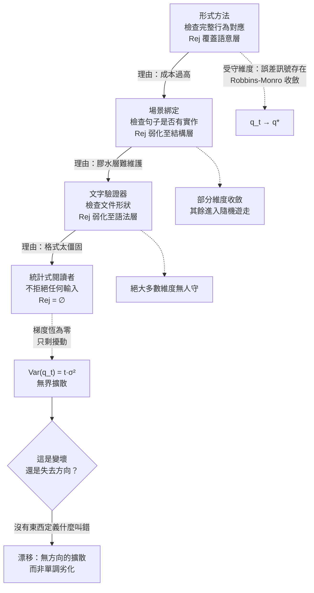

+++
title = "負回饋崩塌與品質漂移：摩擦的感知不對稱、檢查強度階梯，與梯度歸零後的方差發散"
date = "2026-09-14T10:55:02+08:00"
author = "梅乾"
draft = false
isCJKLanguage = true
description = "檢查機制的成本即時可歸因，收益分散且反事實，使拆除檢查在局部最佳化下成為必然。本文將品質演化建模為隨機逼近過程，證明移除負回饋的後果不是單調劣化，而是誤差梯度歸零後方差線性發散的無向漂移，並提供摩擦是否為有效失效點的操作型判別式。"
tags = [
    "分析論述", # term:AnalyticalEssay
    "負回饋", # term:NegativeFeedback
    "隨機逼近", # term:StochasticApproximation
    "品質漂移", # term:QualityDrift
    "反事實", # term:Counterfactual
    "摩擦判別", # term:FrictionDiscriminator
    "檢查強度階梯", # term:InspectionIntensityLadder
    "場景綁定", # term:ScenarioBinding
  ]
series = ["可失敗性工程：從拒絕算子、成本位移到驗證獨立性與可證偽契約"]
term_exclude = ["Screening"]
[ai_info]
    [ai_info.generation]
        model = "Claude Opus 5"
        agent = "Claude Code VSCode Extension 2.1.270"
    [ai_info.refinement]
        model = "Gemini 3.8 Flash"
        agent = "Antigravity IDE 2.5.5"
+++

<!--more-->

## 導言

1985 年至 1987 年間，一台名為 Therac-25 的醫療線性加速器在北美至少六次對病患釋出遠超處方劑量的輻射，造成死亡與重傷。[Leveson 與 Turner，1993 / 《An Investigation of the Therac-25 Accidents》](https://doi.org/10.1109/MC.1993.274940) 的調查報告裡，有一個細節比任何單一程式錯誤都值得記住。

Therac-25 的前代機種 Therac-6 與 Therac-20 配備硬體互鎖：當機器的實際狀態與設定不一致時，一組實體電路會直接切斷射束。到了 Therac-25，這些硬體互鎖被移除，安全職責整個交給軟體承擔。移除的理由不是有人想讓機器變危險——理由是硬體互鎖昂貴、機械式、且在前代機種上「從來沒有真的擋下過什麼」。它看起來是一筆可以省下的成本。

事實上它確實擋下過東西。前代機種的軟體裡存在同樣的競爭條件，只是每一次觸發都被那組電路悄悄吃掉，從未顯現為事故，因此也從未進入任何人的觀測紀錄。互鎖的收益全部以「沒有發生的事故」的形式存在，而沒有發生的事故不進入成本效益分析。

同一份報告記錄了第二層失效：Therac-25 在操作時頻繁顯示 `MALFUNCTION 54` 之類的簡碼訊息，而這些訊息在日常運作中出現得如此頻繁、內容如此缺乏資訊，以至於操作員學會了直接按鍵越過它們。一個永遠在響、而且響了也說不清為什麼的警告，在資訊上等於不存在。

把兩層失效放在一起，浮現的不是「有人疏忽」，而是一個方向穩定的過程：**拒絕機制的成本即時可歸因，收益分散且反事實（Counterfactual） <!-- term:Counterfactual -->；因此在任何以可觀測量為基礎的決策下，拆除它永遠是局部最優解。** 本文要處理的問題是：當這個過程走完，系統會變成什麼樣子？直覺的答案是「品質下降」。這個答案是錯的，而它錯的方式決定了正確的對策。

> [!IMPORTANT]
> **反事實** <!-- term:Counterfactual --> (Counterfactual): 在未實際發生的處置下本應出現的結果，是因果宣稱的基準，也是觀測資料中永遠缺失的那一半。 <!-- anchor:Counterfactual -->


---

## 分析

### 摩擦的感知不對稱：為何拆除永遠是局部最優

先把決策寫成可算的形式。設一道檢查在觀測期內被執行 $n$ 次，每次的即時成本為 $c$（等待、返工、來回討論），其攔截率為 $\beta$，被攔下的每個缺陷若流出的代價為 $D$。

決策者能觀測到的效用是

$$U_{\text{perceived}} = -c \cdot n$$

而真實效用是

$$U_{\text{true}} = -c \cdot n + \beta \cdot n \cdot D$$

兩者的差 $\beta n D$ 是**反事實** <!-- term:Counterfactual -->項：它由「因為被擋下所以沒有發生的事」構成，而沒有發生的事不產生任何觀測紀錄。於是無論 $\beta$ 與 $D$ 多大，$U_{\text{perceived}}$ 恆為負。一個完全理性、完全誠實、完全依據可得資料行事的決策者，會系統性地得出「應該拆掉這道檢查」的結論。

這就是 Therac-25 的硬體互鎖被移除的完整機制，不需要任何人失職。它也解釋了一個語言現象：**你只在檢查擋住你的那一刻感覺到它，然後把那一刻記成成本。** 一道永遠不會擋住你的檢查，你不會稱它為摩擦；一道擋住你的檢查，你不會稱它為保護。命名本身就已經完成了偏誤。

由此得到一條可操作的判別式。摩擦 $\phi$ 分成兩類：

$$\mathrm{IsGate}(\phi) \iff \mathrm{Rej}(\phi) \neq \varnothing$$

其中 $\mathrm{Rej}(\phi)$ 是「因為這道摩擦而被拒絕的產物集合」。等待編譯、環境設定、工具鏈安裝也是摩擦，但它們的拒絕集為空——它們不因產物違規而拒絕任何東西，它們只是慢。判別的問法很直接：**這道摩擦擋掉的是什麼？** 若答案是「沒有東西，它只是慢」，那它是純成本，該最佳化；若答案指向某類會被攔下的錯誤，那麼在移除之前必須先安排替代的拒絕機制。

**因果機制**：可觀測量與真實效用之間存在一個結構性缺口，缺口的內容恰好是被攔截事件的反事實 <!-- term:Counterfactual -->收益；決策依賴可觀測量，因此決策偏向移除。

**邊界條件**：當攔截事件本身被記錄且可歸因時，缺口關閉。持續累積「這道閘門本月擋下了哪些提交、各屬哪類缺陷」的系統，把 $\beta n D$ 從反事實 <!-- term:Counterfactual -->轉成可觀測，此時拆除決策會恢復理性。這也說明為何閘門的日誌不是行政負擔，而是它自身存續的唯一辯護材料。

**反例**：以「本季度這道檢查沒有擋下任何東西」作為移除依據。攔截數為零有兩個互斥成因——上游確實不再產生該類缺陷，或該類缺陷仍在產生但檢查已經失效（規則過期、被繞過、被靜音）。兩者在觀測上完全相同，而後者正是移除最危險的時刻。Therac-20 的互鎖攔截數在紀錄上同樣是零。

### 檢查強度階梯：逐級下拆與漂移總質量

把數十年的規格與驗證技術排成一列，會看到一個方向穩定的下降過程。每一級都比前一級便宜，也每一級都少檢查一樣東西，而每一次下降當時被接受的理由都屬於同一類：某種形式的成本太高、太僵固、太難維護。



前三級的性質相同：檢查強度下降，但保留下來的那部分仍然會失敗，因此仍然產生改進壓力。第四級是質變——它不是把檢查變弱，而是把「檢查」這個環節整個換成一個不會拒絕的東西。

要看清這個質變的後果，需要把品質演化寫成一個隨機過程。設系統的品質狀態為向量 $q_t \in \mathbb{R}^d$，每個分量對應一類會壞掉的性質。若第 $i$ 類性質有**拒絕算子**（Rejector） <!-- term:Rejector -->在守，則每次違規會產生誤差訊號，演化服從 [Robbins 與 Monro，1951 / 《A Stochastic Approximation Method》](https://doi.org/10.1214/aoms/1177729586) 的**隨機逼近**（Stochastic Approximation） <!-- term:StochasticApproximation -->格式：

> [!IMPORTANT]
> **拒絕算子** <!-- term:Rejector --> (Rejector): 將產物空間映射為接受或拒絕二元判定的一種形式化映射或工程閘門，其拒絕判定所對應之輸入原像構成拒絕集。 <!-- anchor:Rejector -->
> **隨機逼近** <!-- term:StochasticApproximation --> (Stochastic Approximation): 在帶有隨機噪聲的觀測與誤差訊號下，逐步迭代逼近極值點或根的隨機過程演算法架構。 <!-- anchor:StochasticApproximation -->


$$q_{t+1}^{(i)} = q_t^{(i)} - \eta_t \left( \nabla L_i(q_t^{(i)}) + \xi_t \right), \qquad \eta_t = \frac{a}{t}$$

其中步長條件 $\sum_t \eta_t = \infty$ 與 $\sum_t \eta_t^2 < \infty$ 同時成立，故 $q_t^{(i)} \to q^{*(i)}$ 幾乎必然收斂。收斂的動力完全來自 $\nabla L_i$——也就是「寫得不夠好時會發生不好的事」這個事實。

若第 $i$ 類性質沒有任何拒絕算子 <!-- term:Rejector -->，則 $\nabla L_i \equiv 0$，演化退化為

$$q_{t+1}^{(i)} = q_t^{(i)} + \xi_t, \qquad \mathrm{Var}(q_t^{(i)}) = t\sigma^2$$

這是純隨機遊走：方差對步數線性成長，期望位移 $\mathbb{E}\|q_t - q_0\| \sim \sigma\sqrt{2t/\pi}$。

這個結果的重點不在數值，而在**它不是劣化**。隨機遊走沒有方向，$\mathbb{E}[q_t] = q_0$——系統不會朝「更壞」移動，它朝所有方向無界擴散。用工程語言說：沒有失敗就沒有梯度，寫作品質不再被任何力量推著往精確走，但也不被推著往粗糙走。**它只是失去了方向。** 一個沒有任何東西定義「什麼叫錯」的系統，按定義就不會出錯——這不是安全，這是漂移。

下面這段 Python 把整個階梯做成可執行的模型。它用固定種子鎖定隨機性，對每一級階梯計算受守維度的均方誤差與無人守維度的漂移，並驗證自由遊走的方差線性律：

```python
"""檢查強度階梯的漂移動力學：負回饋覆蓋率決定收斂或方差線性發散。

僅用標準函式庫。所有隨機性以固定種子鎖定，結果可重現。
"""
import math
import random
import statistics

DIM = 8            # 品質狀態的維度（可視為八類會壞掉的性質）
STEPS = 4000       # 演化步數
RUNS = 300         # 蒙地卡羅重複次數
SIGMA = 1.0        # 每步擾動的標準差
TARGET = [0.0] * DIM


def evolve(covered_dims: int, steps: int, rng: random.Random) -> list[float]:
    """演化一條品質軌跡。

    前 covered_dims 個維度有拒絕算子在守：誤差訊號存在，適用 Robbins-Monro
    步長 eta_t = a / t，滿足 sum eta_t = inf 且 sum eta_t^2 < inf，故收斂。
    其餘維度沒有任何拒絕算子：梯度恆為零，只剩擾動，成為純隨機遊走。
    """
    q = [rng.gauss(0.0, 3.0) for _ in range(DIM)]
    for t in range(1, steps + 1):
        eta = 1.0 / t
        for i in range(DIM):
            xi = rng.gauss(0.0, SIGMA)
            if i < covered_dims:
                grad = q[i] - TARGET[i]          # 誤差訊號：拒絕事件提供方向
                q[i] -= eta * (grad + xi)
            else:
                q[i] += eta * xi                 # 無梯度：步長仍在，方向不存在
    return q


def terminal_variance(covered_dims: int, steps: int, runs: int, seed: int) -> tuple[float, float]:
    """回傳 (受守維度的平均平方誤差, 無人守維度的平均平方偏移)。"""
    rng = random.Random(seed)
    guarded, unguarded = [], []
    for _ in range(runs):
        q = evolve(covered_dims, steps, rng)
        for i in range(DIM):
            (guarded if i < covered_dims else unguarded).append(q[i] ** 2)
    g = statistics.fmean(guarded) if guarded else 0.0
    u = statistics.fmean(unguarded) if unguarded else 0.0
    return g, u


def perceived_vs_true_utility(cost_per_run: float, block_rate: float,
                              defect_cost: float, runs: int) -> tuple[float, float]:
    """摩擦的感知不對稱。

    感知效用只含即時且可歸因的成本；被擋下而沒有發生的缺陷是反事實，
    不進入任何人的觀測，因此不出現在感知效用裡。
    """
    perceived = -cost_per_run * runs
    true_utility = -cost_per_run * runs + block_rate * runs * defect_cost
    return perceived, true_utility


def is_failure_point(rejection_set_size: int) -> bool:
    """摩擦判別式：這道摩擦擋掉的是什麼？擋不掉任何東西的就是純成本。"""
    return rejection_set_size > 0


def main() -> None:
    # 1. 全覆蓋（形式方法級）：所有維度都有誤差訊號，全部收斂。
    g_full, u_full = terminal_variance(DIM, STEPS, RUNS, seed=20260914)
    assert g_full < 0.05, f"全覆蓋下受守維度應收斂，實得均方誤差 {g_full}"
    assert u_full == 0.0, "全覆蓋下不應存在無人守維度"

    # 2. 零覆蓋（寬容閱讀者級）：沒有任何維度收斂，全部漂移。
    g_none, u_none = terminal_variance(0, STEPS, RUNS, seed=20260914)
    assert g_none == 0.0, "零覆蓋下不應存在受守維度"
    assert u_none > 1.0, f"零覆蓋下應出現顯著漂移，實得均方偏移 {u_none}"

    # 3. 階梯：覆蓋維度逐級減少時，受守部分照樣收斂，無人守部分持續漂移。
    print(f"{'階梯級別':<22}{'覆蓋維度':>8}{'受守均方誤差':>14}{'單維漂移':>12}{'漂移總質量':>12}")
    ladder = [("形式方法（檢查完整行為對應）", 8),
              ("場景綁定（檢查句子有無實作）", 4),
              ("文字驗證器（檢查文件形狀）", 1),
              ("統計式閱讀者（不檢查）", 0)]
    prev_mass = -1.0
    for label, k in ladder:
        g, u = terminal_variance(k, STEPS, RUNS, seed=20260914)
        mass = u * (DIM - k)                     # 漂移總質量 = 單維漂移 × 無人守維度數
        print(f"{label:<18}{k:>8}{g:>14.4f}{u:>12.4f}{mass:>12.2f}")
        if k < DIM:
            assert u > 0.5, f"{label}：無人守維度必須出現漂移，實得 {u}"
        if k > 0:
            assert g < 0.05, f"{label}：受守維度應收斂，實得 {g}"
        # 階梯下降不使單一性質漂得更快，而是使更多性質沒有任何東西在守。
        assert mass > prev_mass, f"{label}：漂移總質量應隨覆蓋下降而單調增加"
        prev_mass = mass

    # 4. 方差對步數線性成長：無回饋下漂移不是劣化，是無界擴散。
    #    以 eta_t = 1/t 的步長，累積方差 ~ sigma^2 * sum 1/t^2 收斂；
    #    改用固定步長時方差對 t 線性成長，這是未經節流的編輯序列的真實形狀。
    def free_walk_variance(steps: int, runs: int, seed: int) -> float:
        rng = random.Random(seed)
        finals = []
        for _ in range(runs):
            x = 0.0
            for _ in range(steps):
                x += rng.gauss(0.0, SIGMA)
            finals.append(x)
        return statistics.pvariance(finals)

    v1 = free_walk_variance(500, 600, seed=7)
    v2 = free_walk_variance(1000, 600, seed=7)
    v4 = free_walk_variance(2000, 600, seed=7)
    for steps, v in ((500, v1), (1000, v2), (2000, v4)):
        ratio = v / (steps * SIGMA ** 2)
        assert 0.8 < ratio < 1.25, f"步數 {steps} 的方差/理論值比值應接近 1，實得 {ratio:.3f}"
    print(f"\n自由遊走方差：t=500 → {v1:.1f}，t=1000 → {v2:.1f}，t=2000 → {v4:.1f}"
          f"（理論值 t·σ² = 500 / 1000 / 2000）")

    # 5. 摩擦的感知不對稱：感知效用恆負，真實效用可正。
    perceived, true_u = perceived_vs_true_utility(
        cost_per_run=0.4, block_rate=0.03, defect_cost=25.0, runs=1000)
    assert perceived < 0, "即時成本使感知效用恆為負"
    assert true_u > 0, "被擋下的缺陷使真實效用為正，但該項不可觀測"
    print(f"感知效用 = {perceived:.1f}（只看得到成本）；真實效用 = {true_u:.1f}（含反事實收益）")

    # 6. 摩擦判別式：拒絕集為空的摩擦是純成本，應最佳化而非保留。
    assert is_failure_point(rejection_set_size=12) is True
    assert is_failure_point(rejection_set_size=0) is False, "不擋任何東西的摩擦不是失效點"

    print("\n自驗證通過：收斂性、漂移發散、方差線性律、感知不對稱與摩擦判別式斷言全部成立。")


if __name__ == "__main__":
    main()
```

執行結果給出一個容易被忽略的事實：**階梯下降並不使單一性質漂得更快，它使更多性質沒有任何東西在守。** 四級的單維漂移量幾乎相同（約 11），變的是無人守維度的數量，於是漂移總質量從 0 升到 44、76、87。這對診斷有直接含義：當某個系統「大部分地方還好，只是偶爾出奇怪的問題」時，不該去問品質是否下降，該去問還有幾類性質仍有東西在守。

下表以具體的數值邊界走一遍這條動力學：

| 初始邊界輸入 | 中間敏感度 | 理論極限 | 經驗輸出（本模型實測） |
| :--- | :--- | :--- | :--- |
| 覆蓋 8/8 維，$\eta_t = 1/t$ | $\sum \eta_t^2 < \infty$ 使擾動被壓制 | $q_t \to q^*$ 幾乎必然收斂 | 受守均方誤差 0.0003，漂移總質量 0 |
| 覆蓋 4/8 維 | 受守維度不受無人守維度影響 | 受守收斂，其餘 $\mathrm{Var} \propto t$ | 受守 0.0003；單維漂移 11.0；總質量 44.0 |
| 覆蓋 1/8 維 | 覆蓋率下降不改變單維漂移速率 | 漂移質量 $\propto (d-k)$ | 受守 0.0002；單維漂移 10.9；總質量 76.5 |
| 覆蓋 0/8 維 | 梯度恆為零，$\mathbb{E}[q_t] = q_0$ | 無方向擴散，非單調劣化 | 單維漂移 10.9；總質量 87.0 |
| 自由遊走 $t = 500$ | 每步獨立擾動累加 | $\mathrm{Var} = t\sigma^2 = 500$ | 實測 473.9（比值 0.95） |
| 自由遊走 $t = 2000$ | 方差對 $t$ 線性，不飽和 | $\mathrm{Var} = 2000$ | 實測 1879.8（比值 0.94） |
| 檢查執行 1000 次、成本 0.4、攔截率 3%、缺陷代價 25 | 反事實 <!-- term:Counterfactual -->項 $\beta n D = 750$ 不可觀測 | $U_{\text{perceived}} < 0 < U_{\text{true}}$ | 感知 $-400.0$；真實 $+350.0$ |

### 寬容的閱讀者：從弱檢查到零資訊

第四級值得單獨處理，因為它的性質與前三級不同。

歷史上所有規格技術的閱讀者都是嚴格的：編譯器、剖析器、測試執行環境，或一個會當面反駁你的人。嚴格的操作型定義就是「它會壞給你看」。統計式閱讀者的容忍度接近無限——模糊不會回報錯誤，只會回報一個看起來合理的猜測。

用資訊論可以把這個差異量化。設產物的正確性為隨機變數 $R \in \{0, 1\}$，檢查器的輸出為 $G$。檢查器所提供的資訊量是**互資訊**（Mutual Information） <!-- term:MutualInformation -->

> [!IMPORTANT]
> **互資訊** <!-- term:MutualInformation --> (Mutual Information): 兩個隨機變數之間共享的資訊量，用來量化潛在變數是否攜帶輸入資訊。 <!-- anchor:MutualInformation -->


$$I(G; R) = H(R) - H(R \mid G)$$

依 [Shannon，1948 / 《A Mathematical Theory of Communication》](https://doi.org/10.1002/j.1538-7305.1948.tb01338.x) 的定義，當 $G$ 對所有輸入皆輸出「接受」時，$H(R \mid G) = H(R)$，故 $I(G; R) = 0$。這不是「資訊很少」，是恰好為零：把這樣一個物件放在檢查位置上，等價於把該位置留空。

這裡需要就地釐清一個常被混用的區分：**確定性邊界（Deterministic Trust Boundary） <!-- term:DeterministicTrustBoundary --> vs 統計執行層**。確定性邊界 <!-- term:DeterministicTrustBoundary -->是指那些對同一輸入永遠給出同一判定、且判定具有拒絕力的機制——編譯器、型別檢查、測試執行環境、契約斷言、資料庫約束。統計執行層則是指以機率分佈產生輸出、不保證對同一輸入給出同一結果、且預設不產生拒絕的機制。階梯的第四級不是在確定性邊界 <!-- term:DeterministicTrustBoundary -->上換了一個較寬鬆的參數，而是把該位置的機制換成另一個種類。

> [!IMPORTANT]
> **確定性邊界** <!-- term:DeterministicTrustBoundary --> (Deterministic Trust Boundary): 在系統設計中，劃分確定性執行層（如腳本、CI）與統計推論層（如大語言模型）的介面契約，以確保關鍵操作的 100% 正確性。 <!-- anchor:DeterministicTrustBoundary -->


這個質變在失敗形狀上也看得見。嚴格的閱讀者在規格有誤時拒絕運作，錯誤停在原地；寬容的閱讀者仍然產出結果，而且是**細微地錯**的結果——它通過語法、通過形狀檢查、通過閱讀時的直覺，只在行為上偏離。設錯誤從產生到被偵測的延遲為 $\tau$，而在 $\tau$ 期間依賴該產物的下游單元數為 $N(\tau)$，則修復成本約與 $N(\tau)$ 成正比。停止運作意味著 $\tau \approx 0$，是最便宜的失敗；細微地錯意味著 $\tau$ 由下一次獨立觀測決定，可能是數月，成本因此高出數個量級。

Therac-25 的第二層失效正是這個形狀。頻繁而無資訊的 `MALFUNCTION` 簡碼把一個原本嚴格的閱讀者（機器拒絕運作）退化成一個實質上寬容的閱讀者（機器抱怨但可被按鍵越過），於是 $I(G; R)$ 在操作員那一端歸零。**一個永遠在響的警報，與一個從不響的警報，攜帶同樣多的資訊。**

**因果機制**：品質改進需要**負回饋**（Negative Feedback） <!-- term:NegativeFeedback -->。任何一種技藝的進步，都來自「寫得不夠好時會發生不好的事」；移除該後果，技藝停止演化，狀態進入無方向擴散。

> [!IMPORTANT]
> **負回饋** <!-- term:NegativeFeedback --> (Negative Feedback): 系統偏離目標時產生反向修正壓力，使行為能夠收斂的回饋機制。 <!-- anchor:NegativeFeedback -->


**邊界條件**：這只適用於需要精確度的內容。對於本來就無需精確的溝通——腦力激盪、初步構想、探索性草稿——寬容的閱讀者是純粹的增益，因為此階段的目標本來就是產生變異而非收斂。

**反例**：把探索階段的順利經驗外推到交付階段。同一個寬容閱讀者在變異階段是助力、在收斂階段是災難，而它在兩個階段的外觀完全相同——這使得「工具在這裡很好用」成為一個無法區分兩種情境的觀察。

### 變異與選擇：漂移的另一個名字

上一節的結論還可以從演化動力學再推一層，因為「無方向擴散」在那裡有更清楚的名字。

任何收斂系統都需要兩個算子：**變異**提供候選，**選擇**提供方向。意圖起源於某顆腦袋，沒有任何由下而上的力量產生它——這是變異那一弧。但只有與消費者的接觸，才決定那份意圖裡哪些部分撐得過接觸——這是選擇那一弧。

組織之所以感覺不到後者，是因為它只敘述生成那一弧。「我們決定做某件事」會被記錄下來，而失敗的意圖不會留下文件。倖存者偏誤使整件事看起來像意圖從上面下來然後被實作了，選擇這一環在敘事中整個消失。

用本文的形式說：移除拒絕算子 <!-- term:Rejector -->等於移除選擇算子，剩下的是純變異。而只有變異沒有選擇的系統，其狀態演化正是 $\nabla L \equiv 0$ 的隨機遊走。**「它不會出錯，因為沒有東西定義什麼叫錯」與「$\mathbb{E}[q_t] = q_0$ 而 $\mathrm{Var}(q_t) = t\sigma^2$」是同一句話的兩種寫法。**

**因果機制**：選擇算子把高維候選空間投影到可行子空間，該投影是系統獲得方向的唯一來源；移除它，狀態在候選空間中自由擴散。

**邊界條件**：消費者只篩選他們看得見的東西。可維護性、耦合、長期修改成本、多數安全性質都不在他們的視野內。因此自然的選擇壓力覆蓋可見面，人工安裝的拒絕算子 <!-- term:Rejector -->覆蓋不可見面，兩者互補而非重疊——這也是為何「有真實使用者」不足以取代內部檢查。

**反例**：一個產物做出來之後沒人抱怨，也永遠不會知道原本可以更好。這一側不是「比較安全」，而是無方向。缺乏抱怨與缺乏缺陷在觀測上相同，但在因果上一個是選擇壓力生效、另一個是選擇壓力缺席。

下表把本文涉及的五組現象拆成四個維度，避免表面讀數被誤當成底層狀態：

| 表面讀數 / 現象 | 底層動力學病灶 | 舊代脆弱做法 | 新代嚴格工程防線 |
| :--- | :--- | :--- | :--- |
| 某道檢查「從來沒擋下過什麼」 | 攔截收益是反事實 <!-- term:Counterfactual -->，不進入任何紀錄 | 以攔截數為零作為移除依據 | 閘門強制輸出攔截日誌（擋下什麼、屬哪類缺陷），把反事實 <!-- term:Counterfactual -->轉為可觀測 |
| 流程變順了、交付變快了 | 變快可能來自拒絕集縮小而非效率提升 | 以週期時間單獨宣稱改善 | 同時報告週期時間與拒絕事件數；兩者同時下降時視為覆蓋流失而非效率提升 |
| 警報頻繁但大多無意義 | $I(G;R) \to 0$，嚴格閱讀者退化為寬容閱讀者 | 調高警報門檻以「減少噪音」 | 先量化每類警報的互資訊 <!-- term:MutualInformation -->；零資訊警報應移除而非靜音，並補上真正會拒絕的閘門 |
| 系統「大致還好，只是偶爾出怪問題」 | 漂移總質量升高：更多性質已無人看守 | 針對個別怪問題逐一修補 | 盤點仍有拒絕算子 <!-- term:Rejector -->在守的性質清單；未在清單上的性質視為處於自由擴散 |
| 沒有人抱怨這個產物 | 選擇算子缺席與選擇壓力通過在觀測上相同 | 以無投訴推論品質良好 | 主動建立會回嘴的下游（灰度流量、真實負載、對照組），使選擇算子實際存在 |

---

## 反思

一個自然的處方是提醒大家保持警覺、加強審查文化、教育使用者不要過度信任。從前述機制看，這類處方的效力有限，而理由是結構性的：它要求人持續為一個罕見事件付出注意力，而注意力的配置對「感知到的風險」敏感。當一個系統平常都是對的，感知風險必然下降，於是警覺要求與注意力的運作方式直接衝突。Therac-25 的操作員不是不夠謹慎——他們是在一個每天響數十次而每次都無事發生的訊號面前，做出了任何人都會做的注意力重分配。

有效的介入不是要求人更努力，而是改變訊號本身：讓不可靠的地方重新變得會拒絕。這可以是強制標記不確定區段、要求揭露嘗試次數，也可以是讓某類產出在缺乏獨立驗證時無法通過流程。三者的共通點是把判斷從「人記得去做」移到「不做就過不去」。

**摩擦判別**（Friction Discriminator） <!-- term:FrictionDiscriminator -->式本身也有一個容易被誤用的邊界值得講清楚。判別式問的是「這道摩擦擋掉的是什麼」，而不是「這道摩擦是否讓人不舒服」。實務上最常見的誤用是把兩個問題的答案混在一起：一道確實在擋東西的檢查，因為它同時也很慢、很囉唆、訊息很差，於是整體被歸類為純成本而移除。正確的拆解是把「它擋什麼」與「它擋得多難受」分開處理——前者決定它能否被移除，後者決定它該怎麼被改良。移除檢查與最佳化流程是兩種操作，混為一談是多數退化的起點。

> [!IMPORTANT]
> **摩擦判別** <!-- term:FrictionDiscriminator --> (Friction Discriminator): 以拒絕集是否為空，區分流程阻礙是純粹耗時成本或具備攔截違規產物之有效失效點的操作型準則。 <!-- anchor:FrictionDiscriminator -->


最後值得問的是階梯還會不會繼續往下。從結構上看不會，因為第四級已經是零：$I(G;R) = 0$ 沒有更低的值。但另一個方向的移動值得注意——**檢查可以被重新裝回去，而且現在比過去便宜。** 當年那層把自然語言句子映射到程式碼呼叫的膠水之所以致命，是因為它需要大量人工，而這正是今天的工具最擅長壓低的成本。這個觀察本身不構成主張，它只指出一件事：階梯每一級下降的理由都是成本，而那些成本結構已經改變，因此每一級的拆除決策都值得重新計算。[Dijkstra，1972 / 《The Humble Programmer》](https://doi.org/10.1145/355604.361591) 的核心主張——工程紀律的重點是讓自己有能力在錯誤變貴之前發現它——在成本結構改變後，指向的具體做法可以與四十年前不同，但方向沒有變。

---

## 實務對比

**其一：面對摩擦的反應**

錯誤的作法是把所有摩擦一律視為待最佳化的成本。這個作法之所以頑固，是因為它在感知效用上永遠是對的：摩擦的成本可歸因，收益不可觀測。

正確的作法是先問這道摩擦擋掉的是什麼。若答案是「沒有東西，它只是慢」，最佳化它；若答案指向某類會被攔下的錯誤，則在移除之前必須先安排替代的拒絕機制，並把替代機制的覆蓋範圍與原機制逐條比對。沒有替代品時，正確的動作是改良它的體驗，而不是拆掉它。

**其二：警報與訊號的處置**

錯誤的作法是在警報太吵時調高門檻或直接靜音。靜音把一個低資訊訊號變成零資訊訊號，而零資訊訊號與不存在的訊號在效果上完全相同——同時它還保留了「我們有監控」的錯覺。

正確的作法是先量化每一類警報的互資訊 <!-- term:MutualInformation -->：這類警報響起時，產物有問題的機率比不響時高多少？比值接近 1 的警報應該被移除（它不是保護，是噪音來源），並且必須同時補上一個真正會拒絕的閘門來承接它名義上守著的那類風險。移除零資訊警報而不補閘門，是把噪音問題換成覆蓋問題。

**其三：改善宣稱的報告方式**

錯誤的作法是單獨報告週期時間、交付頻率或流程順暢度的改善。這些量在拒絕集縮小時必然改善，因此它們無法區分「更有效率」與「拆掉了更多檢查」。

正確的作法是每次報告效率改善時，同時報告拒絕事件數與仍有算子在守的性質清單。兩者同時下降是覆蓋流失的訊號，不是效率提升的證據；只有在拒絕事件數持平或上升的情況下，週期時間的下降才構成真實的效率改善。

---

## 結論

移除負回饋 <!-- term:NegativeFeedback -->的後果不是品質下降，而是方向消失。

由此得到三個可遷移的判斷。第一，拒絕機制的成本即時可歸因、收益分散且反事實 <!-- term:Counterfactual -->，因此在任何以可觀測量為基礎的決策下，拆除它永遠是局部最優解——對抗的方式不是呼籲警覺，而是強制閘門輸出攔截日誌，把反事實 <!-- term:Counterfactual -->收益轉換成可觀測量。第二，**檢查強度階梯**（Inspection Intensity Ladder） <!-- term:InspectionIntensityLadder -->的每一級下降並不使單一性質漂得更快，而是使更多性質沒有任何東西在守；診斷一個系統時該問的不是「品質是否下降」，而是「還有幾類性質仍有拒絕算子 <!-- term:Rejector -->」。第三，階梯的最後一級是質變而非量變：一個永不拒絕的閱讀者提供的互資訊 <!-- term:MutualInformation -->恰好為零，把它放在檢查位置上等價於把該位置留空，而此時系統的狀態演化是 $\mathbb{E}[q_t] = q_0$、$\mathrm{Var}(q_t) = t\sigma^2$ 的無方向擴散。

> [!IMPORTANT]
> **檢查強度階梯** <!-- term:InspectionIntensityLadder --> (Inspection Intensity Ladder): 驗證機制因感知成本即時而收益反事實，在組織追求降低摩擦中被逐級弱化、下拆之演進路徑。 <!-- anchor:InspectionIntensityLadder -->


找不到誰能讓你錯的時候，系統並沒有變得比較安全。它只是不再有任何東西定義什麼叫錯。