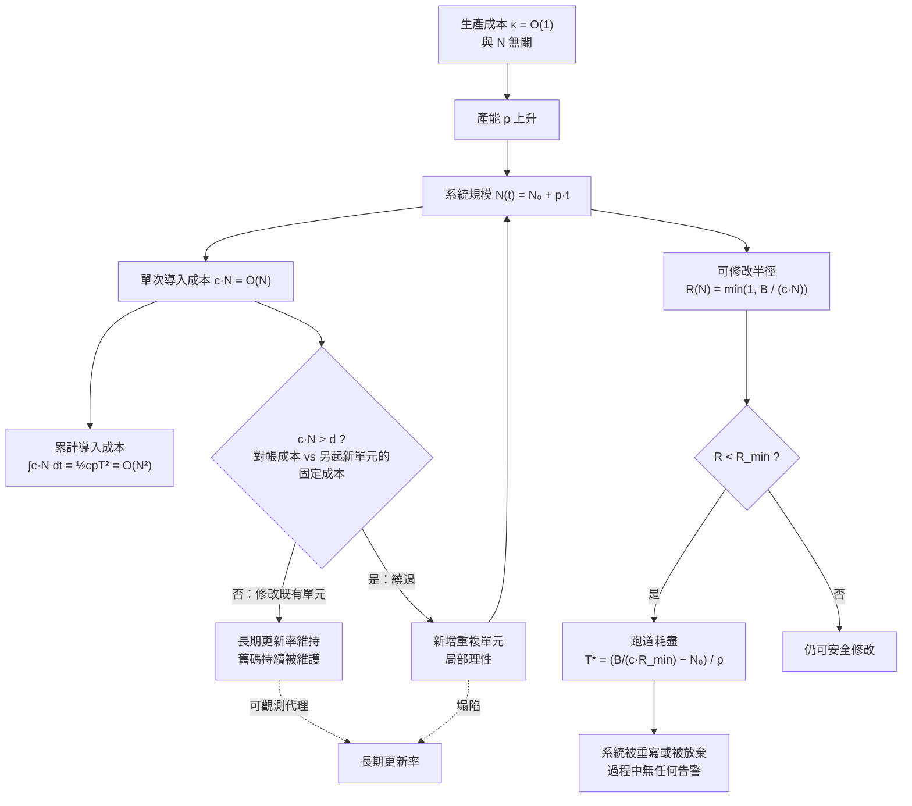

+++
title = "導入成本的二次律與可修改半徑：線性生產撞上規模正比的對帳，以及跑道如何在無告警下耗盡"
date = "2026-09-14T11:30:03+08:00"
author = "梅乾"
draft = false
isCJKLanguage = true
description = "生產成本屬於偶然複雜度，導入成本屬於本質複雜度。本文推導 O(1) 線性生產撞上與系統規模正比的 O(N) 對帳時所引發的 O(N^2) 累計成本爬升，形式化定義有限注意力下的可修改半徑，並揭示繞過既有程式碼的局部理性如何加速技術跑道耗盡。"
tags = [
    "分析論述", # term:AnalyticalEssay
    "導入成本", # term:IntegrationCost
    "可修改半徑", # term:ModifiabilityRadius
    "生產成本", # term:ProductionCost
    "長期更新率", # term:LongTermUpdateRate
    "不變式", # term:Invariant
    "回饋迴路", # term:FeedbackLoop
    "變更帳本", # term:ChangeLedger
  ]
series = ["可失敗性工程：從拒絕算子、成本位移到驗證獨立性與可證偽契約"]
[ai_info]
    [ai_info.generation]
        model = "Claude Opus 5"
        agent = "Claude Code VSCode Extension 2.1.270"
    [ai_info.refinement]
        model = "Gemini 3.8 Flash"
        agent = "Antigravity IDE 2.5.5"
+++

<!--more-->

## 導言

一組被廣泛轉述的工程遙測讀數是這樣的：合併的變更請求增加約九成八，審查所耗時間增加約九成一，而組織層級的交付指標持平。同一時期另一組程式碼層量測補上了另一半——「動到十二個月以上未被觸碰的程式碼」的變更佔比，從百分之一點七降到百分之零點四六。

這些數字本身無法獨立查證，因此本文不以它們作為論據；它們在這裡的角色是**問題的起點**，不是結論的支撐。值得保留的是它們所描述的症狀形狀，因為那個形狀本身就要求解釋：產出量幾乎翻倍，這是可以拿去開會的成果；審查時間也幾乎翻倍，這筆帳沒有人在記；而真正衡量組織能力的那個指標，一動也不動。與此同時，系統吸收自身產出的能力在下降。

問題因此不是「效率有沒有提升」。問題是：**生產成本（Production Cost） <!-- term:ProductionCost -->下降時，為什麼交付能力不會等比例上升？** 以及一個更尖銳的追問——如果系統只改自己最近寫的部分，它還剩多少可以安全修改的範圍？

> [!IMPORTANT]
> **生產成本** <!-- term:ProductionCost --> (Production Cost): 將單一功能或模組在隔離環境下單獨實作出來的成本，複雜度通常與全系統規模無關。 <!-- anchor:ProductionCost -->


本文要證明的是，這兩個問題的答案完全可以從成本的規模依賴性推導出來，不需要任何關於工具品質的假設，也不需要任何「模型讀自己的產出再放大」這類**回饋迴路**（Feedback Loop） <!-- term:FeedbackLoop -->。線性的生產撞上與規模成正比的對帳，二次曲線就已經足夠致命。

> [!IMPORTANT]
> **回饋迴路** <!-- term:FeedbackLoop --> (Feedback Loop): 用於持續觀測治理機制運營效能的閉環系統，通常包含規則遵守率、規則有效性與治理摩擦成本三個觀測層次，藉以驅動治理規則的動態調整。 <!-- anchor:FeedbackLoop -->


---

## 分析

### 兩條曲線的形狀不同：$O(1)$ 生產與 $O(N)$ 導入

要解釋「產出翻倍而交付持平」，必須先區分兩種成本。

**生產成本** <!-- term:ProductionCost -->是把一個單位做出來的成本。它與系統目前的規模無關——寫一個函式的難度不隨程式碼庫大小改變。以複雜度記號表示，它是 $O(1)$。

**導入成本**（Integration Cost） <!-- term:IntegrationCost -->是讓這個單位與系統既有部分相容的成本。它包含命名是否衝突、抽象層級是否一致、是否重複了既有能力、是否破壞了別處的假設。這個成本與系統規模成正比，因為新單位必須與既有的 $N$ 個東西對帳。它是 $O(N)$。

> [!IMPORTANT]
> **導入成本** <!-- term:IntegrationCost --> (Integration Cost): 讓新增產物與既有系統的命名、抽象、行為及假設相容所需的成本。 <!-- anchor:IntegrationCost -->


對帳為何是 $O(N)$ 而非常數，是一個結構問題而非態度問題。[Parnas，1972 / 《On the Criteria to Be Used in Decomposing Systems into Modules》](https://doi.org/10.1145/361598.361623) 指出模組化的價值在於把「一個決策改變時需要一併檢視的範圍」封裝起來——也就是說，模組化的全部意義，就是把對帳範圍從全系統壓縮到一個介面。當這個封裝有效時，導入成本 <!-- term:IntegrationCost -->的係數很小；當封裝被穿透（共享可變狀態、隱式契約、跨模組的時序假設），係數回升，而 $O(N)$ 的形狀始終不變。

於是總成本的形狀出現了。設 $t$ 時刻的系統規模為 $N(t) = N_0 + p t$，其中 $p$ 是產能。每次變更的導入成本 <!-- term:IntegrationCost -->為 $c \cdot N(t)$，則到 $T$ 為止的累計導入成本 <!-- term:IntegrationCost -->是

$$C_{\text{int}}(T) = \int_0^T c \cdot N(t)\, \mathrm{d}t = c N_0 T + \tfrac{1}{2} c p T^2 = O(N^2)$$

而累計生產成本 <!-- term:ProductionCost -->只是 $C_{\text{prod}}(T) = \kappa T = O(N)$。**兩條曲線對規模的依賴性不同，而規模由便宜的那一條驅動。** 這就是全部的機制：生產便宜 $\Rightarrow$ $p$ 上升 $\Rightarrow$ $N$ 更快增長 $\Rightarrow$ 每次導入更貴 $\Rightarrow$ 累計成本以二次律爬升。

這條規律不是新發現。[Lehman，1980 / 《Programs, Life Cycles, and Laws of Software Evolution》](https://doi.org/10.1109/PROC.1980.11805) 的第二定律已經指出，持續演化的系統其複雜度單調增加，除非投入專門的工作對抗它。真正改變的不是規律，而是時間常數：過去熵的注入速率受限於人的打字速度，那是一個硬性的、與人力成正比的節流閥；移除節流閥之後，同一條定律的 $p$ 提高數個量級。規律沒變，可用的反應時間變了——這足以構成一個新的工程問題，即使不是一個新的工程原理。

[Brooks，1987 / 《No Silver Bullet: Essence and Accidents of Software Engineering》](https://doi.org/10.1109/MC.1987.1663532) 給了這件事第二個角度。他把軟體的困難拆成本質（essence，源自概念結構本身的複雜性）與偶然（accident，源自表述與工具的困難），並主張任何只攻擊偶然的技術都無法帶來數量級的整體改善。用本文的語言重述：**生產成本 <!-- term:ProductionCost -->屬於偶然複雜度，導入成本 <!-- term:IntegrationCost -->屬於本質複雜度。** 一個只降低生產成本 <!-- term:ProductionCost -->的工具，把 $\kappa$ 壓到很小卻不動 $c$，於是總成本中被壓縮的那一項在大 $N$ 時本來就不是主導項。產出翻倍而交付持平，是這條分解的直接推論。

**因果機制**：兩種成本對系統規模的依賴性不同，而規模由便宜的那一種驅動；因此壓低生產成本 <!-- term:ProductionCost -->會同時放大導入成本 <!-- term:IntegrationCost -->的累計積分。

**邊界條件**：這不適用於導入成本 <!-- term:IntegrationCost -->本來就接近零的工作。樣板程式碼、機械翻譯、格式轉換這類產物的失敗模式很淺，編譯器與測試就攔得住，$c \approx 0$，因此生產成本 <!-- term:ProductionCost -->下降是真實的淨賺。匯率依工作類別而定，不是齊一的——把某一類工作的順利經驗外推到另一類，是這條規律最常見的誤用方式。

**反例**：以「重複程式碼比例上升但單位測試覆蓋率維持」作為健康證據。重複本身就是導入成本 <!-- term:IntegrationCost -->被繞過的化石：每一段重複都代表一次「不去動舊的、在旁邊新增」的決策。覆蓋率不會下降，因為新增的那份也被測試覆蓋了——兩個指標同時漂亮，而可修改範圍正在收縮。

### 可修改半徑：跑道的定義與撞牆時間

若成本是二次成長，直覺的擔憂是它會無限膨脹。但真實系統有上限，因此實際的形狀更接近一條會飽和的曲線，而飽和點是「沒有人（也沒有工具）還能安全修改這個系統」。

把這個上限寫成可算的量。設單次變更可支配的注意力與脈絡預算為 $B$（常數，由人的工作記憶或工具的脈絡窗口決定），定義**可修改半徑**（Modifiability Radius） <!-- term:ModifiabilityRadius -->

> [!IMPORTANT]
> **可修改半徑** <!-- term:ModifiabilityRadius --> (Modifiability Radius): 在有限注意力與脈絡預算下，單次變更所能安全觸及與對帳的既有系統單元比例。 <!-- anchor:ModifiabilityRadius -->


$$R(N) = \min\left(1, \frac{B}{c \cdot N}\right)$$

它表示「單次變更可以安全觸及的既有單元比例」。當 $N$ 小時 $R = 1$：任何一處都動得了。當 $N$ 超過 $B/c$ 後 $R$ 開始下降，且下降速率與 $1/N$ 成正比。

跑道耗盡的時點定義為 $R(N) < R_{\min}$ 首次成立的時刻：

$$T^* = \frac{1}{p}\left( \frac{B}{c \, R_{\min}} - N_0 \right)$$

這個式子有一個容易被忽略的性質：**$T^*$ 對產能 $p$ 是反比敏感的。** 產能翻倍不是讓跑道少一點，是讓跑道時間直接減半。這改變了該盯的變數——不是成長率，是剩餘跑道；而**長期更新率**（動到舊程式碼的變更佔比） <!-- term:LongTermUpdateRate -->正是 $R$ 的經驗代理，它的塌陷就是跑道消耗速度的量測。

> [!IMPORTANT]
> **長期更新率** <!-- term:LongTermUpdateRate --> (Long-Term Update Rate): 變更中觸及長時間未被修改之既有程式碼的比例，用來觀察系統可修改範圍。 <!-- anchor:LongTermUpdateRate -->


下圖把成本物理、繞過決策與跑道耗盡串成一條因果鏈：



圖中 `DEC` 那個分支是整條鏈裡最重要的一環，因為它把個體的理性行為與系統的塌陷連起來。當導入成本 <!-- term:IntegrationCost --> $c \cdot N$ 超過「另起一個新單元」的固定成本 $d$ 時，**理性的反應不是付出它，而是繞過它**——不去動舊的部分，只在旁邊新增。這個決策在每一次發生時都是對的：對當事人而言，繞過確實更便宜、更快、風險更低。而它的全域後果是 $N$ 增長得更快、$R$ 收縮得更快、下一次的繞過門檻更容易被跨過。這才是真正的正回饋迴路 <!-- term:FeedbackLoop -->，而它完全不需要任何「模型讀取自己的產出」的機制參與。

以下用關聯模型把上述物理寫成可查詢、可被資料庫約束強制的形式。SQL 在這裡不是裝飾：導入成本 <!-- term:IntegrationCost -->的規模依賴、繞過決策的門檻、可修改半徑 <!-- term:ModifiabilityRadius -->的單調性，全部是可以寫成**不變式**（Invariant） <!-- term:Invariant -->並由引擎強制的性質。

> [!IMPORTANT]
> **不變式** <!-- term:Invariant --> (Invariant): 系統在任何合法狀態下都必須成立的斷言，是把評估規則寫成可執行檢查的基本單位。 <!-- anchor:Invariant -->


```sql
-- 導入成本的二次律與可修改半徑：以關聯模型把成本物理寫成可查詢的不變式。
-- 執行：sqlite3 :memory: < this.sql    （任一不變式不成立即由 CHECK 約束中止）

PRAGMA foreign_keys = ON;

-- 模型參數。c = 單次導入的對帳單價；B = 可用注意力/脈絡預算；R_min = 可安全修改的下限。
CREATE TABLE params (key TEXT PRIMARY KEY, val REAL NOT NULL CHECK (val > 0));
INSERT INTO params (key, val) VALUES
  ('c',       0.01),     -- 每個既有單元的對帳成本
  ('B',       1.0),      -- 單次變更可支配的注意力預算
  ('R_min',   0.05),     -- 可修改半徑低於此值即視為跑道耗盡
  ('d',       4.0),      -- 繞過（另起新單元）的固定成本
  ('N0',      100.0);    -- 起始系統規模

-- 兩條產能情境：每 tick 新增 p 個單元。p 翻倍用來檢驗撞牆時間的敏感度。
CREATE TABLE scenarios (p REAL PRIMARY KEY CHECK (p > 0), label TEXT NOT NULL);
INSERT INTO scenarios VALUES (6.0, '基準產能'), (12.0, '產能翻倍');


-- 變更帳本：以參照完整性與觸發器把成本物理寫成不可繞過的狀態不變式。
CREATE TABLE units (unit_id INTEGER PRIMARY KEY, created_tick INTEGER NOT NULL CHECK (created_tick > 0));
CREATE TABLE changes (
    change_id        INTEGER PRIMARY KEY,
    tick             INTEGER NOT NULL CHECK (tick > 0),
    kind             TEXT    NOT NULL CHECK (kind IN ('create', 'modify')),
    unit_id          INTEGER NOT NULL REFERENCES units(unit_id),
    integration_cost REAL    NOT NULL CHECK (integration_cost >= 0)
);

-- 不變式一：修改必須指向既有單元。繞過行為在帳上與修改行為不可混為一談。
CREATE TRIGGER modify_must_target_existing_unit
BEFORE INSERT ON changes FOR EACH ROW WHEN NEW.kind = 'modify'
BEGIN
    SELECT CASE WHEN NOT EXISTS (SELECT 1 FROM units WHERE unit_id = NEW.unit_id)
        THEN RAISE(ABORT, '不變式違反：modify 必須指向既有單元') END;
END;

-- 不變式二：修改的導入成本必須與當前系統規模成正比，不得以固定值登帳。
CREATE TRIGGER integration_cost_must_scale_with_size
BEFORE INSERT ON changes FOR EACH ROW WHEN NEW.kind = 'modify'
BEGIN
    SELECT CASE WHEN ABS(NEW.integration_cost
                         - (SELECT val FROM params WHERE key = 'c') * (SELECT COUNT(*) FROM units)) > 1e-9
        THEN RAISE(ABORT, '不變式違反：導入成本必須與當前系統規模 N 成正比') END;
END;

INSERT INTO units (unit_id, created_tick) VALUES (1, 1), (2, 1), (3, 2), (4, 2), (5, 3);
INSERT INTO changes (tick, kind, unit_id, integration_cost) VALUES
    (4, 'create', 5, 0.0),      -- 新增：導入成本此處以 0 計，成本落在後續每次對帳
    (5, 'modify', 3, 0.05),     -- 修改：0.01 * 5 個既有單元 = 0.05，符合不變式二
    (6, 'modify', 1, 0.05);
-- 下列兩行任一解除註解都會中止腳本，錯誤訊息即不變式名稱：
--   INSERT INTO changes (tick, kind, unit_id, integration_cost) VALUES (7, 'modify', 99, 0.05);
--     Runtime error: 不變式違反：modify 必須指向既有單元
--   INSERT INTO changes (tick, kind, unit_id, integration_cost) VALUES (7, 'modify', 1, 0.01);
--     Runtime error: 不變式違反：導入成本必須與當前系統規模 N 成正比

-- 規模軌跡。單元數 N(t) = N0 + p*t，生產成本 O(1) 與規模無關。
CREATE TABLE trajectory AS
WITH RECURSIVE t(p, tick, n_units) AS (
    SELECT s.p, 1, (SELECT val FROM params WHERE key = 'N0') FROM scenarios s
  UNION ALL
    SELECT p, tick + 1, n_units + p FROM t WHERE tick < 400
)
SELECT p, tick, n_units FROM t;

-- 每 tick 的導入成本 O(N)、累計導入成本（對 t 的離散積分）、可修改半徑 R = min(1, B/(cN))。
CREATE VIEW cost_curve AS
SELECT
    tr.p,
    tr.tick,
    tr.n_units,
    (SELECT val FROM params WHERE key = 'c') * tr.n_units                         AS integration_cost,
    1.0                                                                           AS production_cost,
    MIN(1.0, (SELECT val FROM params WHERE key = 'B')
             / ((SELECT val FROM params WHERE key = 'c') * tr.n_units))           AS modifiable_radius,
    -- 繞過決策：當對帳成本超過另起新單元的固定成本，理性選擇是不動舊碼。
    CASE WHEN (SELECT val FROM params WHERE key = 'c') * tr.n_units
              > (SELECT val FROM params WHERE key = 'd')
         THEN 'create' ELSE 'modify' END                                          AS rational_action
FROM trajectory tr;

CREATE VIEW cumulative_cost AS
SELECT p, tick,
       (SELECT SUM(integration_cost) FROM cost_curve c2
         WHERE c2.p = c1.p AND c2.tick <= c1.tick) AS cum_integration,
       (SELECT SUM(production_cost) FROM cost_curve c3
         WHERE c3.p = c1.p AND c3.tick <= c1.tick) AS cum_production
FROM cost_curve c1;

-- 長期更新率：滾動窗口內「動到既有單元」的變更佔比。
CREATE VIEW long_term_update_rate AS
SELECT p,
       (tick / 50) * 50 AS window_start,
       AVG(CASE WHEN rational_action = 'modify' THEN 1.0 ELSE 0.0 END) AS ltu_rate
FROM cost_curve
GROUP BY p, tick / 50;

-- 跑道耗盡時點：可修改半徑首次跌破 R_min 的 tick。
CREATE VIEW runway AS
SELECT p, MIN(tick) AS exhaustion_tick
FROM cost_curve
WHERE modifiable_radius < (SELECT val FROM params WHERE key = 'R_min')
GROUP BY p;

-- ---- 不變式：任一條不成立，CHECK (ok = 1) 立即中止整個腳本 ----
CREATE TABLE assertions (
    name   TEXT PRIMARY KEY,
    ok     INTEGER NOT NULL CHECK (ok = 1),
    detail TEXT
);

-- 1. 導入成本對規模嚴格遞增，生產成本恆定：兩條曲線的形狀不同。
INSERT INTO assertions
SELECT 'integration_grows_production_flat',
       CASE WHEN MAX(integration_cost) > MIN(integration_cost) * 10
             AND MAX(production_cost) = MIN(production_cost) THEN 1 ELSE 0 END,
       'integration ' || ROUND(MIN(integration_cost), 4) || ' -> ' || ROUND(MAX(integration_cost), 4)
FROM cost_curve WHERE p = 6.0;

-- 2. 累計導入成本是二次的：tick 加倍時累計值約成四倍（線性者只成兩倍）。
INSERT INTO assertions
SELECT 'cumulative_integration_is_quadratic',
       CASE WHEN ratio BETWEEN 3.4 AND 4.2 THEN 1 ELSE 0 END,
       'cum(400)/cum(200) = ' || ROUND(ratio, 3)
FROM (SELECT (SELECT cum_integration FROM cumulative_cost WHERE p = 6.0 AND tick = 400)
           / (SELECT cum_integration FROM cumulative_cost WHERE p = 6.0 AND tick = 200) AS ratio);

-- 3. 累計生產成本是線性的：同一檢驗下比值約為 2。
INSERT INTO assertions
SELECT 'cumulative_production_is_linear',
       CASE WHEN ratio BETWEEN 1.9 AND 2.1 THEN 1 ELSE 0 END,
       'cum(400)/cum(200) = ' || ROUND(ratio, 3)
FROM (SELECT (SELECT cum_production FROM cumulative_cost WHERE p = 6.0 AND tick = 400)
           / (SELECT cum_production FROM cumulative_cost WHERE p = 6.0 AND tick = 200) AS ratio);

-- 4. 可修改半徑單調不增：跑道只會被消耗，不會自行恢復。
INSERT INTO assertions
SELECT 'radius_monotonically_shrinks',
       CASE WHEN COUNT(*) = 0 THEN 1 ELSE 0 END,
       'violating ticks = ' || COUNT(*)
FROM cost_curve a
JOIN cost_curve b ON b.p = a.p AND b.tick = a.tick + 1
WHERE b.modifiable_radius > a.modifiable_radius + 1e-12;

-- 5. 撞牆時間對產能近似反比：產能翻倍使耗盡時點約減半。
INSERT INTO assertions
SELECT 'runway_inversely_sensitive_to_throughput',
       CASE WHEN ratio BETWEEN 1.8 AND 2.2 THEN 1 ELSE 0 END,
       'T*(p=6)/T*(p=12) = ' || ROUND(ratio, 3)
FROM (SELECT CAST((SELECT exhaustion_tick FROM runway WHERE p = 6.0) AS REAL)
           / (SELECT exhaustion_tick FROM runway WHERE p = 12.0) AS ratio);

-- 6. 繞過行為：越過臨界規模後，長期更新率塌到近零——舊碼不是被維護，是被放棄。
INSERT INTO assertions
SELECT 'long_term_update_rate_collapses',
       CASE WHEN early > 0.9 AND late < 0.05 THEN 1 ELSE 0 END,
       'early=' || ROUND(early, 4) || ' late=' || ROUND(late, 4)
FROM (SELECT (SELECT ltu_rate FROM long_term_update_rate WHERE p = 6.0 AND window_start = 0)   AS early,
             (SELECT ltu_rate FROM long_term_update_rate WHERE p = 6.0 AND window_start = 350) AS late);

-- ---- 報表 ----
SELECT '--- 成本曲線抽樣（p = 6） ---';
SELECT tick, ROUND(n_units, 0) AS n, ROUND(production_cost, 3) AS 生產,
       ROUND(integration_cost, 3) AS 導入, ROUND(modifiable_radius, 4) AS 可修改半徑, rational_action AS 理性動作
FROM cost_curve WHERE p = 6.0 AND tick IN (1, 50, 100, 150, 200, 300, 400);

SELECT '--- 長期更新率（p = 6，每 50 tick 一窗） ---';
SELECT window_start, ROUND(ltu_rate, 4) AS ltu_rate FROM long_term_update_rate WHERE p = 6.0;

SELECT '--- 跑道耗盡時點 ---';
SELECT s.label, r.p, r.exhaustion_tick FROM runway r JOIN scenarios s ON s.p = r.p;

SELECT '--- 不變式 ---';
SELECT name, detail FROM assertions ORDER BY name;
SELECT '全部不變式通過（任一不成立會由 CHECK (ok = 1) 中止腳本）。';
```

執行結果印出的成本曲線抽樣是這樣的：tick 1 時 $N = 100$、生產成本 <!-- term:ProductionCost --> 1.0、導入成本 <!-- term:IntegrationCost --> 1.0、可修改半徑 <!-- term:ModifiabilityRadius --> 1.0，理性動作是「修改」；tick 100 時 $N = 694$、生產成本 <!-- term:ProductionCost -->仍是 1.0、導入成本 <!-- term:IntegrationCost -->已達 6.94、可修改半徑 <!-- term:ModifiabilityRadius -->降到 0.1441，理性動作已翻轉為「繞過」；tick 400 時 $N = 2494$、導入成本 <!-- term:IntegrationCost --> 24.94、可修改半徑 <!-- term:ModifiabilityRadius --> 0.0401。**生產成本 <!-- term:ProductionCost -->從頭到尾沒有變過，導入成本 <!-- term:IntegrationCost -->漲了將近二十五倍。**

長期更新率 <!-- term:LongTermUpdateRate -->的塌陷同樣清楚：第一個 50-tick 窗口是 1.0（所有變更都在動舊碼），第二個窗口降到 0.04，第三個窗口起恆為 0。這不是舊程式碼變得不需要維護，是舊程式碼不再被觸碰——用帳面語言說，它不是被維護，是被放棄。

跑道耗盡時點的對比則驗證了反比敏感度：基準產能（$p = 6$）在 tick 318 耗盡，產能翻倍（$p = 12$）在 tick 160 耗盡，比值 1.988。六個不變式 <!-- term:Invariant -->全部通過，其中最關鍵的兩條是「累計導入成本 <!-- term:IntegrationCost -->二次律」（$\text{cum}(400)/\text{cum}(200) = 3.722$，接近四倍）與「累計生產成本 <!-- term:ProductionCost -->線性律」（同一檢驗下為 2.000，恰為兩倍）——同一組資料上，兩條曲線的階數用同一個比值檢定分離開來。

帳本層的兩個觸發器則把成本物理降成不可繞過的狀態不變式 <!-- term:Invariant -->。解除註解後實測的中止訊息分別是 `不變式 <!-- term:Invariant -->違反：modify 必須指向既有單元` 與 `不變式 <!-- term:Invariant -->違反：導入成本 <!-- term:IntegrationCost -->必須與當前系統規模 N 成正比`。第二條特別值得注意：它禁止的是「把導入成本 <!-- term:IntegrationCost -->以固定值登帳」這個記帳習慣，而這正是讓 $O(N)$ 在報表上看起來像 $O(1)$ 的最常見手法。

下表以具體數值走一遍整條因果鏈，從邊界輸入到理論極限到實測輸出：

| 初始邊界輸入 | 中間敏感度 | 理論極限 | 經驗輸出（本模型實測） |
| :--- | :--- | :--- | :--- |
| $N_0 = 100$，$c = 0.01$，$p = 6$，tick 1 | $c N = 1.0$ 未超過繞過門檻 $d = 4.0$ | $R = \min(1, B/cN) = 1.0$ | 導入 1.000；半徑 1.0000；動作 `modify` |
| 同上，tick 50 | $N = 394$，$cN = 3.94$，逼近門檻 | 門檻交叉發生於 $N = 400$ | 導入 3.940；半徑 0.2538；動作 `modify` |
| 同上，tick 100 | $N = 694$，$cN = 6.94 > d$ | 繞過成為理性選擇 | 導入 6.940；半徑 0.1441；動作 `create` |
| 同上，tick 200 | 導入成本 <!-- term:IntegrationCost -->已達生產成本 <!-- term:ProductionCost -->的 12.9 倍 | 累計導入 $\propto T^2$ | 導入 12.940；半徑 0.0773；動作 `create` |
| 同上，tick 400 | 生產成本 <!-- term:ProductionCost -->恆為 1.0，未曾變動 | $C_{\text{int}}/C_{\text{prod}} \to \infty$ | 導入 24.940；半徑 0.0401 |
| 累計比值檢定 $T = 400$ vs $T = 200$ | 二次項 $\tfrac12 c p T^2$ 主導 | 導入比值 $\to 4$，生產比值 $= 2$ | 導入 3.722；生產 2.000 |
| $R_{\min} = 0.05$，$p = 6$ vs $p = 12$ | $T^* = (B/(cR_{\min}) - N_0)/p$ | 產能翻倍使 $T^*$ 減半 | 318 vs 160，比值 1.988 |
| 長期更新率 <!-- term:LongTermUpdateRate -->窗口 0 vs 窗口 350 | 門檻交叉後 `modify` 佔比歸零 | LTU $\to 0$ 為繞過的直接量測 | 1.0000 → 0.0000 |

下表則把成本層的五組現象拆成四個維度：

| 表面讀數 / 現象 | 底層成本物理病灶 | 舊代脆弱做法 | 新代嚴格工程防線 |
| :--- | :--- | :--- | :--- |
| 合併變更數與產出行數大幅上升 | 產出量在生產成本 <!-- term:ProductionCost -->下降時必然上升，與吸收能力無關 | 以產出量單獨宣稱效率提升 | 產出量與吸收量成對報告；吸收量取審查耗時、動到舊碼的變更佔比、重複區塊數 |
| 審查時間同步翻倍 | $O(N)$ 的對帳成本落在審查端，且不隨規模擴展 | 加派審查人力以承接 | 承認審查產能不隨規模擴展；把可判定部分下推為提交前閘門 |
| 長期更新率 <!-- term:LongTermUpdateRate -->逐季下滑 | 繞過門檻已被跨過，舊碼被放棄而非被維護 | 解讀為「舊碼穩定、不需改動」 | 以 LTU 作為可修改半徑 <!-- term:ModifiabilityRadius -->的代理量並設下限告警；下滑即跑道消耗訊號 |
| 重複區塊數上升但覆蓋率不降 | 重複是繞過行為的化石，新增部分也被測試覆蓋 | 以覆蓋率推論健康 | 同時追蹤重複率與 LTU；兩者反向移動即為繞過正在發生 |
| 專案「突然」變得無法修改 | $R(N)$ 連續下降但無任何閾值告警 | 等待事故出現才啟動重構 | 把 $R$ 或其代理寫成可查詢的視圖並設 $R_{\min}$ 閾值，使跑道耗盡成為可預測的日期而非意外 |

**因果機制**：可修改半徑 <!-- term:ModifiabilityRadius -->由固定的注意力預算除以與規模成正比的對帳成本決定；規模單調增長，因此半徑單調收縮，且收縮速率與產能成正比。

**邊界條件**：$B$ 並非完全固定。更好的模組邊界、更強的型別隔離、更嚴格的依賴方向都能有效提高 $B$ 或降低 $c$，從而把 $T^*$ 往後推。這正是「投入專門工作對抗複雜度」的操作性含義——它不改變定律的階數，但改變係數，而係數在有限時窗內決定一切。

**反例**：以增加脈絡窗口或人力來對抗半徑收縮。$B$ 的提升是線性的、一次性的，而 $cN$ 的增長是持續的；用一個常數項去抵銷一個線性項，只是把 $T^*$ 平移，不改變它終將到達。真正改變階數的動作只有一種：降低 $c$，也就是讓新單元不必與 $N$ 個既有東西對帳——這是模組邊界與依賴方向的工作，不是預算的工作。

---

## 反思

一個自然的反應是：既然成本落在審查，那就加強審查。這條路走不通，而且理由是結構性的。審查是人力密集的，它的產能受限於可用的注意力，而注意力正是整個系統裡最稀缺的投入。**用一個不隨規模擴展的機制，去承接一個隨規模擴展的成本，只會讓瓶頸更早到達。**

更麻煩的是時序。審查發生在成本已經被推給讀者之後——被審查的人正是那個承接成本的人。在那個時點做的任何事，都是讀者在替寫作者收拾。若要真正降低 $c$，內部化必須發生在提交之前：發起端不能只帶著變更來，要帶著「讓人不必逐行閱讀就能驗證它」的那個東西一起來。

第二個值得澄清的是「二次成長」這個說法本身的邊界。真實系統不會讓 $C_{\text{int}}$ 無限膨脹，因為在到達那之前 $R$ 就已經跌破可操作下限，系統被重寫或被放棄。因此二次律的實際作用不是描述成本的最終值，而是描述**跑道被消耗的速率**。這個修正很重要，因為它把該盯的變數從「成長率」換成「剩餘跑道」，而後者是可以被設閾值、可以被告警、可以被排進計畫的。

第三點是關於「這是否只是舊觀察換個場合」的合理質疑。軟體工程長期就知道複雜度會單調增加，也長期就知道重構是必要的。差異在於一個被移除的上限：過去 $p$ 受限於人的打字速度，是一個與人力成正比的硬節流閥；移除之後，$T^*$ 的分母提高數個量級，而 $B$、$c$、$R_{\min}$ 全部沒有等比例改善。規律沒變，可用的反應時間變了。一條你有十年時間應對的定律，與一條你有十個月時間應對的定律，在工程決策上不是同一回事。

最後值得指出一個容易被誤讀的地方：本文完全沒有主張「產出增加是壞事」。產出增加在 $c$ 夠低時就是純粹的收益。真正的主張是**產出量與吸收量必須成對出現在同一張報表上**——單獨的產出量在生產成本 <!-- term:ProductionCost -->下降時必然上升，因此它無法區分「更有效率」與「更會製造待處理的東西」。一份只報告產出的效率宣稱，在形式上就不構成證據。

---

## 實務對比

**其一：效率宣稱的計算方式**

錯誤的作法是以產出量宣稱效率提升——變更請求數、行數、完成的工作項數。這些量在生產成本 <!-- term:ProductionCost -->下降時必然上升，因此它們無法區分兩種完全不同的狀態。

正確的作法是同時報告產出量與吸收量，並要求兩者的比值而非其中一項。吸收量的候選包括審查所耗時間、動到舊程式碼的變更佔比、重複區塊數量。當產出上升而吸收持平或下降時，正確的解讀是導入成本 <!-- term:IntegrationCost -->正在被繞過，不是效率正在提升。

**其二：可修改半徑 <!-- term:ModifiabilityRadius -->的監測**

錯誤的作法是等到「系統變得很難改」這個感受出現後才啟動重構。半徑是連續下降的，而感受是離散觸發的，兩者之間有很長的延遲；等感受出現時，$R$ 通常已經遠低於可安全操作的區間。

正確的作法是把半徑的代理量寫成一個可查詢的視圖並設下限閾值：動到 N 個月以上未被觸碰之程式碼的變更佔比、跨模組變更的平均觸及範圍、單次變更需要同步修改的檔案數。設下限、設告警，讓跑道耗盡成為一個可以被預測的日期，而不是一個被撞上的牆。

**其三：導入成本 <!-- term:IntegrationCost -->的記帳方式**

錯誤的作法是把導入成本 <!-- term:IntegrationCost -->以固定值估計，或乾脆不記——「這次變更大概兩小時」「審查算半小時」。固定值記帳讓 $O(N)$ 在報表上看起來像 $O(1)$，於是二次律在帳面上完全不可見。

正確的作法是把導入成本 <!-- term:IntegrationCost -->記為與當前規模相關的量，並讓記帳規則本身成為不可繞過的約束。一筆修改既有單元的變更，其導入成本 <!-- term:IntegrationCost -->必須隨系統規模同步縮放；當有人試圖以固定值登帳時，帳本應該直接拒絕該筆紀錄，而不是接受後在報表上被平均掉。

---

## 結論

生產成本 <!-- term:ProductionCost -->的下降不會自動轉換為系統能力的提升，因為兩者之間隔著一條與規模成正比的導入成本 <!-- term:IntegrationCost -->。

由此得到三個可遷移的判斷。第一，線性生產撞上線性對帳產生二次累計成本，這個結論不需要任何回饋迴路 <!-- term:FeedbackLoop -->就成立；評估任何提升產出的工具時，必須同時估計它對系統規模的影響，因為被壓低的那一項在大 $N$ 時本來就不是主導項。第二，當導入成本 <!-- term:IntegrationCost -->超過另起新單元的固定成本，繞過成為每一次都正確的局部理性選擇，而它的全域後果是規模加速增長、半徑加速收縮；長期更新率 <!-- term:LongTermUpdateRate -->的塌陷不是「舊碼穩定」的證據，是繞過正在發生的直接量測。第三，撞牆時間對產能是反比敏感的——產能翻倍使跑道時間減半；因此該盯的變數不是成長率而是剩餘跑道，而剩餘跑道可以被寫成視圖、設閾值、排進計畫。

一個系統在耗盡跑道之前不會發出任何告警，因為半徑的收縮是連續的、無事件的、且每一步都由完全正確的局部決策構成。要看見它，唯一的方法是主動把它量出來。