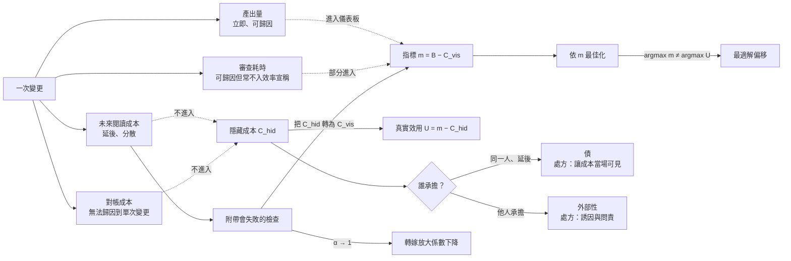

+++
title = "可計量性不對稱與成本位移：最適解偏移、外部性與債的分流，以及注意力投資的乘數"
date = "2026-09-14T12:05:04+08:00"
author = "梅乾"
draft = false
isCJKLanguage = true
description = "當決策依賴指標而指標遺漏隱性成本時，最佳化壓力必然將系統推向指標漂亮而真實效用惡化的角落。本文形式化最適解偏移，將後續維護困難嚴格分流為空間錯配（外部性）與時間錯配（債），並推導附帶檢查的注意力乘數盈虧點與硬性失敗轉換機制。"
tags = [
    "分析論述", # term:AnalyticalEssay
    "可計量性不對稱", # term:MeasurabilityAsymmetry
    "外部性", # term:Externality
    "注意力投資", # term:AttentionInvestment
    "最適解偏移", # term:OptimalSolutionShift
    "折現偏誤", # term:DiscountingBias
    "導入成本", # term:IntegrationCost
    "生產成本", # term:ProductionCost
  ]
series = ["可失敗性工程：從拒絕算子、成本位移到驗證獨立性與可證偽契約"]
[ai_info]
    [ai_info.generation]
        model = "Claude Opus 5"
        agent = "Claude Code VSCode Extension 2.1.270"
    [ai_info.refinement]
        model = "Gemini 3.8 Flash"
        agent = "Antigravity IDE 2.5.5"
+++

<!--more-->

## 導言

一個團隊在檢討「別人看不懂我們的程式碼」之後，立下了一條提交規範：每一筆變更都必須附上說明文件，解釋這次改了什麼、為什麼這樣改。規範執行得很徹底，說明文件寫得又清楚又完整，稽核通過率百分之百。

十四個月後，同一個團隊發現一個現象：說明文件與程式碼已經大面積不一致，而沒有人知道這件事是什麼時候開始的。追查之下，原因並不神秘——當程式碼被修改而說明文件沒有被同步時，**沒有任何東西會因此失敗**。建置照樣通過，測試照樣全綠，稽核照樣顯示這筆變更「附有說明文件」。漂移從第一天就在發生，只是它不產生任何訊號。

同一個團隊在同一段期間做了第二個決定：在一次時程壓力下砍掉了一批測試，理由是「品質可以之後再補」。這個決定在會議紀錄上看起來合理——測試被歸類為品質工具，而品質聽起來確實像是可以稍後補的東西。

兩件事共用一個結構。**一邊是立即可見、可歸因、能拿去報告的量；另一邊是延後、分散、無法歸因到任何單次變更的量。** 決策依賴指標，而指標只涵蓋可量測的部分；不可量測的部分不是被低估，是根本不進入計算。

於是本文要回答的問題是：為什麼一個所有指標都在改善的專案，可以同時變得愈來愈難修改？以及，被移走的那些成本落到了誰身上、在什麼時點、該用哪一種處方？

---

## 分析

### 最適解偏移：不需要任何人失職的系統性誤判

先把這件事寫成可算的形式，因為「大家要注意隱性成本」這種說法無法被驗收。

設一個決策選項 $x$ 的真實效用為

$$U(x) = B(x) - C_{\text{vis}}(x) - C_{\text{hid}}(x)$$

其中 $B$ 是收益，$C_{\text{vis}}$ 是即時可歸因的成本（審查耗時、返工、等待），$C_{\text{hid}}$ 是延後、分散、無法歸因到單次變更的成本（未來的閱讀成本、對帳成本、被繞過的舊碼）。

而決策者實際據以最佳化的指標是

$$m(x) = B(x) - C_{\text{vis}}(x)$$

兩者的差恰為 $C_{\text{hid}}(x)$。只要 $C_{\text{hid}}$ 對 $x$ 不是常數——也就是說，只要不同選項製造的隱藏成本不同——就有

$$\arg\max_x m(x) \neq \arg\max_x U(x)$$

這個結論的重要性在於它不需要任何人失職。沒有人說謊，沒有人偷懶，沒有人不在乎品質。**只要一邊可量而另一邊不可量，決策就會系統性地偏向可量的那一邊。** 指標自己會誤導。

[Manheim 與 Garrabrant，2018 / 《Categorizing Variants of Goodhart's Law》](https://arxiv.org/abs/1803.04585) 把「以代理量取代真實目標」的失效方式分類，其中與此處最相關的是代理量與真實目標之間的關係在最佳化壓力下退化的那一類：在低強度最佳化下 $m$ 與 $U$ 高度相關，因此用 $m$ 決策沒有問題；而最佳化壓力一旦提高，系統會被推向 $m$ 高而 $U$ 低的那個角落，因為那正是兩者相關性最弱的區域。這解釋了一個常見的時序：指標制度剛上線時運作良好，兩年後開始失真——不是有人學會了作弊，是最佳化壓力自然地把系統推到了相關性破裂的地方。

這個問題不新。[Dijkstra 等人，1989 / 《A Debate on Teaching Computing Science》，Communications of the ACM 32(12)](https://doi.org/10.1145/76380.76381) 給過一個極簡的處方：若要計算程式碼行數，不該視為「產出的行數」，而應視為「花掉的行數」。這個轉換不改變任何量測，只改變它被記在帳的哪一側——把一個看似收益的量，重新記為成本。它之所以有效，是因為它直接攻擊了 $m$ 與 $U$ 的符號錯配，而不是要求任何人多加注意。

**因果機制**：決策依賴指標，而指標只涵蓋可量測部分；不可量測的部分不進入計算，因此最佳化必然朝著「把成本推到指標外」的方向移動。

**邊界條件**：當隱藏成本被轉換成某種會硬性失敗的東西時，它就進得了指標，偏移隨之消失。這正是型別檢查與測試的價值所在——它們把「未來會出問題」轉換成「現在建置失敗」，也就是把 $C_{\text{hid}}$ 搬進 $C_{\text{vis}}$。

**反例**：一個所有指標都在改善、同時愈來愈難修改的專案。這不是矛盾，而是偏移的必然結果：改善的是被量的東西，惡化的是沒被量的東西。把這種狀態誤讀為「指標與體感不符，可能是體感有問題」，會讓組織在最需要修正指標的時候反而更信任它。

### 轉嫁是有損的：$\alpha > 1$ 的來源

上一節說成本沒有消失，只是移動了位置。但「移動」這個詞低估了實際發生的事。

從寫作端移走一個單位的工作，到讀者端不會是一個單位。原因是閱讀不熟悉的程式碼比自己寫更貴——這是軟體工程長期的共識，也是「重寫比讀懂快」這個誘惑一直存在的理由，更是新人上手需要數月的理由。

所以這不是等量轉嫁，是**放大的轉嫁**：移走一單位，抵達時變成 $\alpha$ 單位，$\alpha > 1$。

放大係數的來源是一個不對稱的計算問題。作者寫下一行時，知道自己為什麼那樣寫——那個理由存在於作者當下的工作記憶裡，取用成本接近零。讀者必須從結果反推那個理由，而反推是搜尋問題：候選解釋有很多個，要排除其中大部分需要閱讀更多上下文。**產生是查表，反推是搜尋，兩者的複雜度不同。**

關鍵推論是：當產物附帶了足以省去反推的東西時，$\alpha$ 會下降到接近 1。一個會失敗的測試直接告訴讀者「這裡的行為契約是什麼」；一個型別簽章直接告訴讀者「這裡能放什麼不能放什麼」；一段記錄了被否決方案的說明直接告訴讀者「為什麼不是另一種寫法」。三者的共通點不是「有文件」，而是**它們讓讀者跳過搜尋**。

而本文開頭那個團隊的說明文件為什麼不算數，這裡也有了精確的答案：說明文件不會失敗，因此當程式碼變了而它沒變時，沒有任何訊號。一個會漂移而不通報漂移的附帶物，在讀者端的可信度必須折價，而折價後它省不了多少搜尋。判準因此很簡單：**這個附帶物在程式碼變了而它沒變時，會不會自己壞掉？** 會，才算數。

**因果機制**：理解需要重建作者的意圖，而重建是搜尋問題，其成本高於原初的產生；附帶檢查把搜尋轉換成查表，因而壓低放大係數。

**邊界條件**：當讀者本身就是作者、且時間間隔很短時，$\alpha \approx 1$——因為意圖還在工作記憶裡。這正是「當時覺得很清楚」的來源，也是它會失效的原因：$\alpha$ 隨時間間隔單調上升。

**反例**：一份沒有任何附帶物的高品質產出。它可以在每一個局部都正確，而讀者仍然必須逐行反推，因為**正確性不會自我說明**。品質不能替代可驗證性——這兩個性質在讀者端造成的成本完全不同。

### 兩種病共用一個症狀

轉嫁預設有兩個當事人，但很多時候只有一個。這個區分決定處方，因此不能混談。

當作者與後續的維護者不是同一人時，發生的是**外部性**（Externality） <!-- term:Externality -->：成本真實存在，卻由不在這筆交易裡的人承擔。[Coase，1960 / 《The Problem of Social Cost》](https://doi.org/10.1086/466560) 對這類問題的分析有一個常被忽略的要點——外部性 <!-- term:Externality -->的根源不是「有人做了壞事」，而是**權利與責任的配置不完整**；因此處方也不是道德勸說，而是把承擔者拉進交易，或明確配置誰有權拒絕。

> [!IMPORTANT]
> **外部性** <!-- term:Externality --> (Externality): 行動成本或效益由交易之外的其他人或團隊承擔的經濟現象。 <!-- anchor:Externality -->


當作者三個月後讀不懂自己寫的東西時，發生的是**債**：成本由同一人承擔，只是延後了。它之所以仍然感覺像賺到，是因為收益在現在而成本在以後，且成本是機率性的。設折現因子為 $\delta < 1$，$k$ 期後的成本現值為 $\delta^k C$；當 $\delta$ 被系統性低估（也就是人對未來成本的折現過重），決策就會偏向現在。

兩者共用「後來很難改」這個症狀，而症狀相同誤導了診斷。處方則完全不能互換：

- 用債的處方治外部性 <!-- term:Externality -->——「讓成本當場可見」——等於要求承受成本的人自律，而承受成本的人根本不在決策現場。
- 用外部性 <!-- term:Externality -->的處方治債——強化問責——對一個獨自工作的人毫無作用，因為問責的對象與被問責的對象是同一個人。

**因果機制**：外部性 <!-- term:Externality -->的成因是空間上的誘因錯配（付出成本的人與獲得收益的人不同），債的成因是時間上的**折現偏誤**（未來的成本被系統性低估） <!-- term:DiscountingBias -->；兩者的失效軸不同，因此干預點不同。

> [!IMPORTANT]
> **折現偏誤** <!-- term:DiscountingBias --> (Discounting Bias): 決策過度偏重眼前可見收益而低估未來維護與對帳成本的時間偏好扭曲（技術債的核心動力）。 <!-- anchor:DiscountingBias -->


**邊界條件**：兩者經常同時存在，因此不能只開一種藥。一筆變更可以同時把成本推給別的團隊（外部性 <!-- term:Externality -->）並推給三個月後的自己（債），此時兩種處方必須並行。

**反例**：只治其中一種的組織。強化問責可以處理外部性 <!-- term:Externality -->，但對獨自工作的人無效；讓成本當場可見可以處理債，但無法阻止一個人把成本推給別的團隊。任何一種單獨部署，都會在指標上看到改善，因為它確實治好了一半。

### 注意力投資：差別在乘數不在單價

順著上一節可以得到一個對常見分類的修正。

測試、型別、架構檢查通常被歸為「品質工具」。這個歸類不算錯，但它掩蓋了更重要的性質：**它們是注意力經濟的工具。**

寫一個測試，是作者付出一次成本 $c_w$，讓所有未來的讀者不必各自付出反推成本 $c_r$。不寫，就是每個讀者各付一次，永遠。設附帶檢查後讀者的殘餘成本為 $\epsilon$（遠小於 $c_r$），$k$ 為未來讀者人次，則兩種策略的總成本是

$$C_{\text{gated}} = c_w + k\epsilon, \qquad C_{\text{bare}} = k c_r$$

盈虧點為

$$k^* = \frac{c_w}{c_r - \epsilon}$$

當 $k > k^*$ 時，附帶檢查嚴格較省；當 $k < k^*$ 時，它不划算。**差別不在單價，在乘數。**

這個重新歸類會改變它在時程壓力下的優先順序。若測試被理解為「品質保證」，砍掉它的意思是「品質稍後再補」，聽起來可以接受。若正確理解為**注意力投資**（Attention Investment） <!-- term:AttentionInvestment -->，砍掉它的意思是「把成本乘以 $k$ 倍轉嫁給所有未來的讀者」——那是一個明顯得多的錯誤決策，而且它的錯誤程度隨 $k$ 線性增長。

> [!IMPORTANT]
> **注意力投資** <!-- term:AttentionInvestment --> (Attention Investment): 先投入測試、型別或契約檢查，以減少未來每位讀者重複驗證成本的作法。 <!-- anchor:AttentionInvestment -->


下圖把四節的因果串起來，並標出量測邊界的實際位置：



圖中虛線是量測邊界。左上兩條進了儀表板，右下兩條沒有——不是因為它們不存在，而是因為它們延後、分散、且無法歸因到單一次變更。而 `GATE` 那條實線是唯一的出口：**只有會硬性失敗的東西才進得了儀表板。**

以下 Go 程式把整套機制做成可執行模型。選用 Go 的理由有二：具名型別可以讓「把兩種成本加在一起」在編譯期就不成立，而 goroutine 與 mutex 可以真實地模擬多條提交路徑並發記帳。

```go
// 可計量性不對稱的最小可執行模型：兩本帳、兩種病、一個乘數。
// 執行：go run s4.go
package main

import (
	"fmt"
	"math"
	"os"
	"sync"
)

// 兩個成本單位以不同具名型別表示，使「把不可計量成本加進儀表板」在型別層就不成立。
type VisibleCost float64 // 進得了儀表板：即時、可歸因
type HiddenCost float64  // 進不了儀表板：延後、分散、無法歸因到單次變更

// Bearer 決定處方：同一人延後承擔是債，他人承擔是外部性。
type Bearer int

const (
	SameAgentLater Bearer = iota // 債：折現偏誤
	OtherAgent                   // 外部性：誘因錯配
)

func (b Bearer) String() string {
	if b == SameAgentLater {
		return "債(同一人/延後)"
	}
	return "外部性(他人承擔)"
}

// Prescription 兩種病共用「後來很難改」這個症狀，但處方不可互換。
func (b Bearer) Prescription() string {
	if b == SameAgentLater {
		return "讓成本當場可見（折現率過高，需把未來成本前移）"
	}
	return "誘因與問責（承擔者不在交易內，自律不會發生）"
}

type Change struct {
	ID       int
	Produced VisibleCost // 產出：立即可數
	Review   VisibleCost // 審查耗時：可數但通常不被計入效率宣稱
	Hidden   HiddenCost  // 未來的閱讀與對帳成本：不可數
	Who      Bearer
	Gated    bool // 是否附帶會失敗的檢查（測試/型別/契約）
}

type Ledger struct {
	mu       sync.Mutex
	visible  VisibleCost
	hidden   HiddenCost
	produced VisibleCost
}

func (l *Ledger) Record(c Change) {
	l.mu.Lock()
	defer l.mu.Unlock()
	l.produced += c.Produced
	l.visible += c.Review
	l.hidden += c.Hidden
}

// DashboardMetric 只看得見的那一半：產出減去可歸因成本。
func (l *Ledger) DashboardMetric() float64 {
	l.mu.Lock()
	defer l.mu.Unlock()
	return float64(l.produced) - float64(l.visible)
}

// TrueUtility 含不可計量項。注意它與 DashboardMetric 的差恰為 hidden。
func (l *Ledger) TrueUtility() float64 {
	l.mu.Lock()
	defer l.mu.Unlock()
	return float64(l.produced) - float64(l.visible) - float64(l.hidden)
}

// transferAmplification 轉嫁是有損的：從寫作端移走 1 單位，抵達讀者端會放大。
// alpha > 1 的成因是理解需要重建作者的意圖，而重建是搜尋問題。
func transferAmplification(moved float64, alpha float64, gated bool) float64 {
	if gated {
		// 附帶檢查讓讀者跳過反推：放大係數被壓回接近 1。
		return moved * 1.05
	}
	return moved * alpha
}

// breakEvenReaders 注意力投資的盈虧點 k* = c_w / (c_r - eps)。
// 差別在乘數不在單價：撰寫者付一次，讀者每人各付一次。
func breakEvenReaders(writeCost, readCost, gatedReadCost float64) float64 {
	if readCost <= gatedReadCost {
		return math.Inf(1)
	}
	return writeCost / (readCost - gatedReadCost)
}

func attentionTotal(writeCost, readCost, gatedReadCost float64, readers int, gated bool) float64 {
	if gated {
		return writeCost + float64(readers)*gatedReadCost
	}
	return float64(readers) * readCost
}

func must(cond bool, msg string, args ...any) {
	if !cond {
		fmt.Fprintf(os.Stderr, "不變式違反："+msg+"\n", args...)
		os.Exit(1)
	}
}

func main() {
	// 1. 並發寫入同一本帳：模擬多條提交路徑同時記帳。
	ledger := &Ledger{}
	var wg sync.WaitGroup
	const batches, perBatch = 8, 125
	for b := 0; b < batches; b++ {
		wg.Add(1)
		go func(b int) {
			defer wg.Done()
			for i := 0; i < perBatch; i++ {
				ledger.Record(Change{
					ID:       b*perBatch + i,
					Produced: 1.0,
					Review:   0.18,
					Hidden:   1.10, // 每單位產出製造的未來閱讀與對帳成本
					Who:      OtherAgent,
					Gated:    false,
				})
			}
		}(b)
	}
	wg.Wait()

	metric := ledger.DashboardMetric()
	truth := ledger.TrueUtility()
	must(metric > 0, "產出減可見成本應為正，實得 %.2f", metric)
	must(truth < 0, "含隱藏成本後真實效用應為負，實得 %.2f", truth)
	must(metric > truth, "儀表板讀數必須高於真實效用")
	fmt.Printf("並發記帳 %d 筆：儀表板 = %+.1f（看起來是賺的）；真實效用 = %+.1f\n",
		batches*perBatch, metric, truth)

	// 2. 最適解偏移：依儀表板最佳化會選中真實效用最差的方案。
	type option struct {
		name     string
		produced VisibleCost
		review   VisibleCost
		hidden   HiddenCost
	}
	options := []option{
		{"大量新增、不附檢查", 100, 12, 140},
		{"適量新增、附帶檢查", 60, 14, 12},
		{"重構既有、附帶檢查", 30, 10, 3},
	}
	bestByMetric, bestByTruth := 0, 0
	for i, o := range options {
		m := float64(o.produced) - float64(o.review)
		t := m - float64(o.hidden)
		if m > float64(options[bestByMetric].produced)-float64(options[bestByMetric].review) {
			bestByMetric = i
		}
		bt := float64(options[bestByTruth].produced) - float64(options[bestByTruth].review) - float64(options[bestByTruth].hidden)
		if t > bt {
			bestByTruth = i
		}
		fmt.Printf("  %-20s 儀表板 %+7.1f    真實 %+7.1f\n", o.name, m, t)
	}
	must(bestByMetric != bestByTruth,
		"可計量性不對稱應使兩種最佳化選出不同方案（metric=%d truth=%d）", bestByMetric, bestByTruth)
	fmt.Printf("依儀表板最佳：%s；依真實效用最佳：%s\n",
		options[bestByMetric].name, options[bestByTruth].name)

	// 3. 兩種病共用症狀、處方不可互換。
	for _, who := range []Bearer{SameAgentLater, OtherAgent} {
		fmt.Printf("  症狀「後來很難改」→ %s → 處方：%s\n", who, who.Prescription())
	}
	must(SameAgentLater.Prescription() != OtherAgent.Prescription(), "兩種病的處方不得相同")

	// 4. 轉嫁是有損的：移走 1 單位，抵達 alpha 單位；附帶檢查把 alpha 壓回接近 1。
	const alpha = 2.4
	bare := transferAmplification(1.0, alpha, false)
	withGate := transferAmplification(1.0, alpha, true)
	must(bare > 1.0, "無附帶物的轉嫁必然放大，實得 %.2f", bare)
	must(withGate < bare, "附帶檢查應降低放大係數")
	fmt.Printf("轉嫁 1 單位：無附帶物 → %.2f 單位；附帶會失敗的檢查 → %.2f 單位\n", bare, withGate)

	// 5. 注意力投資的乘數：盈虧點兩側的結論相反。
	const cw, cr, eps = 3.0, 1.0, 0.05
	kStar := breakEvenReaders(cw, cr, eps)
	must(kStar > 1, "盈虧點應大於 1，實得 %.2f", kStar)
	below, above := int(math.Floor(kStar))-1, int(math.Ceil(kStar))+1
	must(attentionTotal(cw, cr, eps, below, true) > attentionTotal(cw, cr, eps, below, false),
		"讀者數低於盈虧點時，附帶檢查不划算")
	must(attentionTotal(cw, cr, eps, above, true) < attentionTotal(cw, cr, eps, above, false),
		"讀者數高於盈虧點時，附帶檢查必然划算")
	fmt.Printf("注意力盈虧點 k* = %.2f 位讀者：k=%d 時不裝較省（%.2f vs %.2f）；k=%d 時裝了較省（%.2f vs %.2f）\n",
		kStar, below, attentionTotal(cw, cr, eps, below, false), attentionTotal(cw, cr, eps, below, true),
		above, attentionTotal(cw, cr, eps, above, false), attentionTotal(cw, cr, eps, above, true))

	// 6. 內部化：把隱藏成本轉換成會硬性失敗的東西，它就進得了儀表板，排序隨之恢復一致。
	converted := &Ledger{}
	for _, o := range options {
		// 轉換後，原本延後分散的 hidden 以「現在建置失敗」的形式成為可見成本。
		converted.Record(Change{Produced: o.produced, Review: o.review + VisibleCost(o.hidden), Hidden: 0})
	}
	rankMetric := func(o option, gated bool) float64 {
		if gated {
			return float64(o.produced) - float64(o.review) - float64(o.hidden)
		}
		return float64(o.produced) - float64(o.review)
	}
	bestConverted := 0
	for i, o := range options {
		if rankMetric(o, true) > rankMetric(options[bestConverted], true) {
			bestConverted = i
		}
	}
	must(bestConverted == bestByTruth, "內部化後儀表板最佳解應與真實最佳解一致")
	fmt.Printf("把隱藏成本轉為硬性失敗後，儀表板最佳解回到：%s\n", options[bestConverted].name)

	// 7. 型別隔離：下列運算式無法編譯，因為兩種成本不是同一個型別。
	//    var wrong = VisibleCost(1.0) + HiddenCost(2.0)
	//    ^ 編譯期錯誤：invalid operation: mismatched types VisibleCost and HiddenCost

	fmt.Println("\n自驗證通過：並發記帳、最適解偏移、處方分流、轉嫁放大、乘數盈虧點與內部化排序斷言全部成立。")
}
```

執行結果把四個機制一次攤開。並發記帳一千筆後，儀表板讀數是 $+820.0$——看起來是賺的；而真實效用是 $-280.0$。兩者的差恰好是那一千筆各自製造的 $1.10$ 單位未來成本，它們全部真實存在，全部不進入報表。

**最適解偏移**（Optimal Solution Shift） <!-- term:OptimalSolutionShift -->的驗證更直接：三個選項中，「大量新增、不附檢查」在儀表板上以 $+88.0$ 拔得頭籌，而它的真實效用是 $-52.0$（三者最差）；真實效用最高的是「適量新增、附帶檢查」（$+34.0$），它在儀表板上只排第二。**依指標最佳化，必然選中真實效用最差的那個選項**——這不是假想，是在同一組數字上由兩個**目標函數**（Objective Function） <!-- term:ObjectiveFunction -->算出的兩個不同 argmax。

> [!IMPORTANT]
> **最適解偏移** <!-- term:OptimalSolutionShift --> (Optimal Solution Shift): 因度量指標遺漏隱性成本，導致依照指標最佳化所選出之方案與真實效用最佳方案發生系統性背離的現象。 <!-- anchor:OptimalSolutionShift -->
> **目標函數** <!-- term:ObjectiveFunction --> (Objective Function): 最佳化演算法或管理決策所試圖最大化或最小化的定量目標；未進入讀數的維度在目標函數中梯度分量恆為零。 <!-- anchor:ObjectiveFunction -->


轉嫁的放大係數同樣可測：無附帶物時移走 1 單位抵達 2.40 單位；附帶一個會失敗的檢查後抵達 1.05 單位。注意力盈虧點 $k^* = 3.16$ 位讀者——讀者數為 2 時不裝較省（2.00 vs 3.10），讀者數為 5 時裝了較省（5.00 vs 3.25）。同一個決策在盈虧點兩側的正確答案相反，而多數團隊從不估計自己的 $k$。

最後一項驗證是內部化：把隱藏成本轉換成當場會失敗的東西（也就是把 $C_{\text{hid}}$ 併入 $C_{\text{vis}}$）之後，儀表板的最佳解回到「適量新增、附帶檢查」，與真實效用的最佳解一致。**偏移不是靠提醒消除的，是靠改變哪些東西會失敗消除的。**

型別層的隔離也實測到了：把最後那行註解解開後，`go build` 直接回報 `invalid operation: VisibleCost(1.0) + HiddenCost(2.0) (mismatched types VisibleCost and HiddenCost)`。這條編譯錯誤的治理含義是——「把不可計量的成本混進可計量的帳」這個動作，不該只是一條記帳規約，它可以被降成一個型別事實。

下表以具體提交案例走一遍判定與處置：

| 邊界輸入案例 | 關鍵判定條件 / **不變式**（Invariant） <!-- term:Invariant --> | 狀態轉移 | 最終處置結果 |
| :--- | :--- | :--- | :--- |
| 變更附有說明文件，程式碼後續被修改 | 附帶物不會因程式碼變動而失敗 | `documented` → `drifted`（無訊號） | 附帶物折價為零；不計入 $C_{\text{vis}}$，$\alpha$ 維持 2.40 |
| 變更附有整合測試，程式碼後續被修改 | 附帶物在契約被破壞時失敗 | `gated` → `build_failed` → `fixed` | 漂移在當下被攔截；$\alpha$ 壓至 1.05 |
| 時程壓力下砍測試，產物僅一次性使用（$k = 1$） | $k < k^* = 3.16$ | `proposed` → `accepted` | 決策正確：乘數為 1，投資無法回收 |
| 時程壓力下砍測試，產物為核心模組（$k \gg k^*$） | $k > k^*$ | `proposed` → `rejected` | 決策錯誤：真實含義是成本乘以 $k$ 倍轉嫁 |
| 隱藏成本由三個月後的同一人承擔 | Bearer = 同一人／延後 | 分類為「債」 | 處方：讓成本當場可見；問責無效 |
| 隱藏成本由下游團隊承擔 | Bearer = 他人 | 分類為「外部性 <!-- term:Externality -->」 | 處方：誘因與問責；當場可見無效 |
| 效率宣稱只報告產出量 | $m = B - C_{\text{vis}}$，$C_{\text{hid}}$ 未入帳 | `reported` → `accepted`（無攔截） | 儀表板 $+820$ 而真實 $-280$；宣稱在形式上不構成證據 |
| 把**導入成本**（Integration Cost） <!-- term:IntegrationCost -->以固定值登帳 | 型別隔離禁止兩種成本相加 | `record` → `compile_error` | 記帳規約被降為型別事實，不可繞過 |

> [!IMPORTANT]
> **不變式** <!-- term:Invariant --> (Invariant): 系統在任何合法狀態下都必須成立的斷言，是把評估規則寫成可執行檢查的基本單位。 <!-- anchor:Invariant -->
> **導入成本** <!-- term:IntegrationCost --> (Integration Cost): 讓新增產物與既有系統的命名、抽象、行為及假設相容所需的成本。 <!-- anchor:IntegrationCost -->


下表把度量層的五組現象拆成四個維度：

| 表面讀數 / 現象 | 底層度量病灶 | 舊代脆弱做法 | 新代嚴格工程防線 |
| :--- | :--- | :--- | :--- |
| 所有指標改善、系統愈來愈難改 | $\arg\max m \neq \arg\max U$，改善的是被量的部分 | 認定體感有誤，加強對指標的信任 | 明列指標未涵蓋的成本項；任一項無對應量測者，強制轉換為會失敗的檢查 |
| 提交一律附說明文件，稽核百分百 | 附帶物不會失敗，漂移不產生訊號 | 以文件齊備率作為可維護性指標 | 附帶物採「會不會自己壞掉」為准入判準；不會壞的歸類為敘述，不折抵閱讀成本 |
| 時程壓力下優先砍測試 | 被歸類為品質工具，遮蔽了乘數性質 | 「品質可以之後再補」 | 以 $k^* = c_w/(c_r-\epsilon)$ 估計盈虧點；砍測試的決策必須附上 $k$ 的估計值 |
| **技術債**（Technical Debt） <!-- term:TechnicalDebt -->一律以同一套方法處理 | 外部性 <!-- term:Externality -->與債共用症狀、成因軸不同 | 統稱技術債 <!-- term:TechnicalDebt -->，統一排期償還 | 先問成本由誰承擔、在何時；債走「當場可見」，外部性 <!-- term:Externality -->走「誘因與問責」 |
| 效率宣稱只報產出量 | 產出量在**生產成本**（Production Cost） <!-- term:ProductionCost -->下降時必然上升 | 以變更數／行數宣稱效率提升 | 產出量與吸收量成對報告；型別層禁止兩種成本混算 |

> [!IMPORTANT]
> **技術債** <!-- term:TechnicalDebt --> (Technical Debt): 程式碼中為求快速交付而妥協、待重構與修復的設計或品質缺陷。 <!-- anchor:TechnicalDebt -->
> **生產成本** <!-- term:ProductionCost --> (Production Cost): 將單一功能或模組在隔離環境下單獨實作出來的成本，複雜度通常與全系統規模無關。 <!-- anchor:ProductionCost -->


**因果機制**：附帶檢查把驗證成本從「每次閱讀時各自執行」改成「撰寫時執行一次、之後由機器重複」；差異是分攤方式，不是單價。

**邊界條件**：這只對會被重複閱讀的產物成立。一段即將被刪除的實驗程式碼，$k = 1$，附帶檢查的投資無法回收——此時不寫測試是正確決策，而不是紀律鬆懈。

**反例**：在 $k$ 未知的情況下一律要求高覆蓋率。這會把成本花在 $k$ 很小的產物上，擠壓掉 $k$ 很大的產物所需的投資；而由於覆蓋率是可量的、$k$ 是不可量的，這個誤配置在儀表板上同樣看不出來——**可計量性不對稱**（Measurability Asymmetry） <!-- term:MeasurabilityAsymmetry -->在此對「對抗可計量性不對稱 <!-- term:MeasurabilityAsymmetry -->的措施」本身再作用一次。

> [!IMPORTANT]
> **可計量性不對稱** <!-- term:MeasurabilityAsymmetry --> (Measurability Asymmetry): 收益容易即時量測，而延後、分散的成本難以進入同一套指標的結構性落差。 <!-- anchor:MeasurabilityAsymmetry -->


---

## 反思

第一個值得處理的反應是「那就加強審查」。這條路的問題不在態度而在時序：審查發生在成本已經被推給讀者之後，被審查的人正是那個承接成本的人。在那個時點做的任何事，都是讀者在替寫作者收拾。內部化必須發生在提交之前——發起端不能只帶著變更來，要帶著讓人不必逐行閱讀就能驗證它的那個東西一起來。

第二點是關於「不可量測」這個詞本身。本文一直說 $C_{\text{hid}}$ 不可量測，但更精確的說法是：**它不是不可量測，是不可歸因到單次變更。** 團隊層級的閱讀時間、上手時間、變更前置時間都是可量的；不可量的是「這一筆提交造成了其中多少」。這個區別有操作意義——它指出一條可行路徑：放棄逐筆歸因，改以群體層級的滯後指標追蹤，並把逐筆層級的控制交給會失敗的檢查。兩者分工，而不是硬要在同一個粒度上同時做到兩件事。

第三點是一個容易被過度推論的地方。本文論證了指標會系統性偏移，但這不蘊涵「不要用指標」。沒有指標的組織不會因此做出更好的決策，只會改用更不透明的依據。正確的推論是：**指標的價值取決於它涵蓋的成本項是否完整，而完整性本身必須被明列與定期檢查。** 一份指標定義文件若沒有一節寫著「本指標不涵蓋以下成本」，它就是在邀請偏移。

最後，把「品質工具」重新歸類為「注意力經濟工具」有一個副作用值得注意：它讓這類投資變成可計算的，因而也變成可以被正當地拒絕的。當 $k$ 確實很小時，不寫測試是對的。這聽起來像是削弱了紀律，實際上是強化了它——一條「永遠要寫測試」的規則會在第一次遇到明顯不值得的情境時失去權威，而一條「$k > k^*$ 時必須寫」的規則可以一直站得住。

---

## 實務對比

**其一：效率宣稱的計算方式**

錯誤的作法是以產出量宣稱效率提升——變更請求數、行數、完成的工作項數。這些量在生產成本 <!-- term:ProductionCost -->下降時必然上升，因此無法區分「更有效率」與「更會製造待處理的東西」。

正確的作法是同時報告產出量與吸收量，並在指標定義中明列未涵蓋的成本項。吸收量的候選包括審查所耗時間、動到舊程式碼的變更佔比、重複區塊數量。單獨的產出量不是效率證據——它在形式上就不是。

**其二：附帶物的要求**

錯誤的作法是要求提交者附上說明文件，理由是「讓別人看得懂」。說明文件不會失敗，因此它與程式碼漂移時沒有任何訊號，而漂移從第一天就開始。

正確的作法是要求附上會失敗的東西——測試、型別、契約檢查。判準只有一條：這個附帶物在程式碼變了而它沒變時，會不會自己壞掉？會，才算數。說明文件仍然有價值，但它的價值不在折抵讀者的反推成本，因此不能拿來抵那一項。

**其三：技術債 <!-- term:TechnicalDebt -->的歸類與處方**

錯誤的作法是把所有「以後很難改」的情況統稱技術債 <!-- term:TechnicalDebt -->，然後用同一套方法處理。同一個症狀底下有兩種成因，而兩種處方彼此無效。

正確的作法是先問成本由誰承擔、在什麼時點。同一人承擔且延後，那是債，處方是讓成本當場可見；他人承擔，那是外部性 <!-- term:Externality -->，處方是誘因與問責。用債的處方治外部性 <!-- term:Externality -->，等於要求承受成本的人自律，而那個人根本不在決策現場。

---

## 結論

一邊可量、另一邊不可量，就足以讓決策系統性地走向錯誤的選項，不需要任何人失職。

由此得到三個可遷移的判斷。第一，指標與真實效用的差恰為未被涵蓋的成本項，因此只要不同選項製造的隱藏成本不同，依指標最佳化就必然選中真實效用較差的方案；對抗方式不是提醒大家注意，而是把不可量的那一面轉換成某種會硬性失敗的東西——因為只有會失敗的東西才進得了儀表板。第二，「後來很難改」這個症狀底下有兩種成因：同一人延後承擔是債，成因是折現偏誤 <!-- term:DiscountingBias -->，處方是讓成本當場可見；他人承擔是外部性 <!-- term:Externality -->，成因是誘因錯配，處方是誘因與問責。兩種處方彼此無效，而症狀相同誤導了診斷。第三，附帶檢查是注意力投資 <!-- term:AttentionInvestment -->而非品質保證：撰寫者付出一次，讓所有未來讀者不必各自付出，盈虧點是 $k^* = c_w/(c_r - \epsilon)$；這個重新歸類同時讓它在 $k$ 大時無法被砍，也讓它在 $k$ 小時可以被正當地放棄。

一份效率宣稱若只報告了產出，它連被反駁的資格都還沒取得——因為它沒有說出另一半的帳。