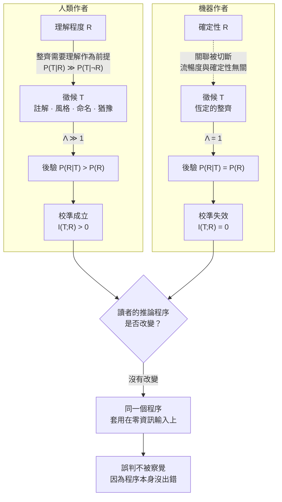

+++
title = "可區分性崩潰：徵候的似然比塌縮、互資訊歸零，與注意力配置的系統性錯置"
date = "2026-09-14T12:40:05+08:00"
author = "TTL::0"
draft = false
isCJKLanguage = true
description = "當機器生成使表面整齊度與底層確定性脫鉤時，讀者依賴的徵候似然比趨近於 1、互資訊歸零。本文以貝氏模型證明表面品質上升反而會誘發檢查密度下降，在特定區間使期望損失不降反升，並闡明訊號機制失效後，產物層只剩主動篩選作為唯一工程防線。"
tags = [
    "分析論述", # term:AnalyticalEssay
    "可區分性", # term:Distinguishability
    "徵候", # term:ReliabilityTell
    "互資訊", # term:MutualInformation
    "似然比", # term:LikelihoodRatio
    "檸檬市場", # term:MarketForLemons
    "篩選", # term:Screening
    "驗證覆蓋", # term:VerificationCoverage
  ]
series = ["可失敗性工程：從拒絕算子、成本位移到驗證獨立性與可證偽契約"]
[ai_info]
    [ai_info.generation]
        model = "Claude Opus 5"
        agent = "Claude Code VSCode Extension 2.1.270"
    [ai_info.refinement]
        model = "Gemini 3.8 Flash"
        agent = "Antigravity IDE 2.5.5"
+++

<!--more-->

## 導言

一個團隊導入了自動生成提交說明的工具。導入的理由無可挑剔：人寫的提交說明品質參差，有人寫「fix」，有人寫三行流水帳，而工具生成的說明完整、專業、格式一致，還會自動摘要變更範圍。導入後，提交說明的品質指標全面上升。

大約半年後，一位資深維護者在追查一個難以重現的問題時提出了一個觀察：他再也無法從提交歷史裡看出哪些變更是作者有把握的、哪些是勉強湊出來的。過去他會注意到某些提交說明寫得特別短、語氣特別猶豫、或附了一句「這裡我不太確定，先這樣」——那些句子從來不是為了溝通而寫的，它們是作者狀態的洩漏。而現在每一筆提交說明都一樣完整、一樣專業、一樣不帶猶豫。

這個觀察的關鍵不在於工具寫得不好。工具寫得比人好。關鍵在於：**過去用來估計可靠度的那個訊號，現在攜帶的資訊是零。**

同一個結構在更早、更嚴肅的場合被記錄過。[Goddard、Roudsari 與 Wyatt，2012 / 《Automation Bias: A Systematic Review of Frequency, Effect Mediators, and Mitigators》](https://doi.org/10.1136/amiajnl-2011-000089) 系統性回顧了臨床決策支援系統的使用研究，得到一個一致的樣態：整體績效通常提升，**但使用者未能辨識該系統新引入的錯誤類別**。改善是真的，新錯誤也是真的，而後者不進入使用者的注意範圍。

把兩件事放在一起，需要解釋的不是「工具會出錯」——那是常識。需要解釋的是：**做這件事的人，為什麼連事後都感覺不到自己的判斷已經失去依據？**

---

## 分析

### 徵候作為代理指標：它的有效性建立在什麼前提上

人判斷一份產物是否可信，靠的很少是逐行驗證。真正在用的是**徵候**（Reliability Tell） <!-- term:ReliabilityTell -->——那些洩漏製作過程狀態的痕跡。

> [!IMPORTANT]
> **徵候** <!-- term:ReliabilityTell --> (Reliability Tell): 洩漏產物製作過程狀態、供讀者間接估計可靠度的外觀或行為痕跡。 <!-- anchor:ReliabilityTell -->


人寫的東西帶著徵候 <!-- term:ReliabilityTell -->：猶豫留下的註解、風格突然改變、一個彆扭到只可能是遷就某個限制的命名、一段明顯抄自別處而未消化的區塊、一個標記著待辦的缺口。這些都不是內容，是關於內容如何被產生的旁證。

讀者長期以來就是靠這些估計可靠度，而且估得不錯。用貝氏語言寫，讀者持有先驗 $P(R)$（產物可靠的機率），觀察到徵候 <!-- term:ReliabilityTell --> $T$ 後更新為

$$\frac{P(R \mid T)}{P(\lnot R \mid T)} = \frac{P(R)}{P(\lnot R)} \cdot \Lambda, \qquad \Lambda = \frac{P(T \mid R)}{P(T \mid \lnot R)}$$

這套推論有效的**唯一前提**是 $\Lambda \neq 1$。而在人類作者的世界裡，$\Lambda$ 顯著大於 1，理由是一個關於人的物理限制：**整齊需要理解作為前提。** 一個沒有真正搞懂的人，很難寫出命名一致、風格統一、沒有猶豫痕跡的東西——不是因為他不想，是因為做不到。

機器產出打斷了這個關聯。流暢度變成常數，與底下的確定性無關：模型很有把握時的輸出，和模型在極低機率區域勉強填出來的輸出，表面上完全一樣——同樣整齊的命名、同樣一致的風格、同樣沒有猶豫的痕跡。於是 $P(T \mid R) = P(T \mid \lnot R)$，$\Lambda = 1$，後驗恰好等於先驗。

用 [Shannon，1948 / 《A Mathematical Theory of Communication》](https://doi.org/10.1002/j.1538-7305.1948.tb01338.x) 的語言說得更精確：徵候 <!-- term:ReliabilityTell -->提供的資訊量是**互資訊**（Mutual Information） <!-- term:MutualInformation -->

> [!IMPORTANT]
> **互資訊** <!-- term:MutualInformation --> (Mutual Information): 兩個隨機變數之間共享的資訊量，用來量化潛在變數是否攜帶輸入資訊。 <!-- anchor:MutualInformation -->


$$I(T; R) = H(R) - H(R \mid T)$$

而 $\Lambda = 1$ 蘊涵 $H(R \mid T) = H(R)$，故 $I(T; R) = 0$。**這不是「資訊變少」，是恰好為零。** 讀者的估計程序完全沒有改變，改變的是它所依賴的輸入不再攜帶任何資訊。

下圖把兩條推論鏈並排，並標出斷點的確切位置：



一個常被引用的觀察是：資深開發者在使用輔助工具後，實際完成任務的速度慢於他們自己的事前預測，而且事後仍然維持原判斷。這類讀數本身無法在此獨立查證，因此本文不以它作為論據；但值得指出的是，上述機制對它給出了一個**可檢驗的結構性預測**，而且方向反直覺：**校準（Calibration） <!-- term:Calibration -->得愈好的人，關聯斷裂時的損失愈大。**

> [!IMPORTANT]
> **校準** <!-- term:Calibration --> (Calibration): 模型輸出機率與實際正確率的一致程度。 <!-- anchor:Calibration -->


理由很直接。校準 <!-- term:Calibration -->良好者長期依賴一組 $\Lambda$ 較大的徵候 <!-- term:ReliabilityTell -->，而新手本來就沒有可靠的直覺、假設的 $\Lambda$ 接近 1。當真實的 $\Lambda$ 塌到 1，前者的後驗偏離真值更遠。這不是「專家比較容易被騙」的心理學說法，而是貝氏更新的算術後果——假設的**似然比**（Likelihood Ratio） <!-- term:LikelihoodRatio -->與真實似然比 <!-- term:LikelihoodRatio -->的落差越大，後驗誤差越大。

> [!IMPORTANT]
> **似然比** <!-- term:LikelihoodRatio --> (Likelihood Ratio): 在特定假設成立與不成立下觀測到同一徵候的條件機率之比，決定貝氏後驗更新的幅度。 <!-- anchor:LikelihoodRatio -->


**因果機制**：徵候 <!-- term:ReliabilityTell -->作為代理指標的有效性，建立在「整齊需要理解」這條人類作者的物理限制上；移除該限制，代理指標與被指涉物之間的關聯消失，互資訊 <!-- term:MutualInformation -->歸零。

**邊界條件**：這只影響需要**估計**可靠度的場合。若產物會立刻被獨立驗證——編譯、測試、正式流量——則不需要徵候 <!-- term:ReliabilityTell -->，因為有真正的檢查在。換句話說，**可區分性**（Distinguishability） <!-- term:Distinguishability -->只在**驗證覆蓋**（Verification Coverage） <!-- term:VerificationCoverage -->的缺口處才重要。

> [!IMPORTANT]
> **可區分性** <!-- term:Distinguishability --> (Distinguishability): 觀察者能否依可見訊號辨別不同品質、狀態或來源之產物的性質。 <!-- anchor:Distinguishability -->
> **驗證覆蓋** <!-- term:VerificationCoverage --> (Verification Coverage): 產物中已有獨立、可重複檢查機制保護的範圍與程度。 <!-- anchor:VerificationCoverage -->


**反例**：一份完全由工具撰寫的提交說明。它讀起來比人寫的更完整、更專業、更符合規範，而它承載的可靠度資訊是零。形式改善與資訊喪失同時發生，且前者掩蓋後者——這是本文開頭那個團隊的完整處境。

### 這是檸檬市場，不是品質問題

上述結構在經濟學裡有現成的模型。[Akerlof，1970 / 《The Market for "Lemons": Quality Uncertainty and the Market Mechanism》](https://doi.org/10.2307/1879431) 分析二手車市場時指出，市場失靈的原因不是車子壞，而是**買家分不出來**。分不出來時，理性的定價是按期望值；於是好貨得不到溢價、退出市場，平均品質下降，買家進一步降低出價——一個自我強化的下墜。

這個模型最重要的性質是：**它不需要任何人失職。** 沒有人說謊，沒有人偷懶，光是資訊不對稱本身就足以讓市場崩壞。

套到手上的問題：讀者面對的困境不是機器產出品質差，而是好的產出與壞的產出在表面上不可區分。因此「提升平均品質」不是解方——它甚至讓情況更糟，理由見下一節。

但這裡有一個與古典模型的關鍵差異，它決定了哪些處方可用。古典不對稱假設「知情的一方確實知道」：賣車的人知道車況，只是不說。這裡不完全如此——供應方不掌握逐項的可靠度，模型沒有可靠的自我評估被暴露出來。

這個差異有直接的實務後果。資訊不對稱的兩種標準解法是**訊號**與**篩選**（Screening） <!-- term:Screening -->：

> [!IMPORTANT]
> **篩選** <!-- term:Screening --> (Screening): 在訊號機制失效時，由驗證方主動設計具分離特性的測試或契約以檢驗產物真實能力的機制。 <!-- anchor:Screening -->


- **訊號**（[Spence，1973 / 《Job Market Signaling》](https://doi.org/10.2307/1882010)）：由知情方付出昂貴且難偽造的代價來揭露自己的類型。有效的訊號必須滿足一個條件——**它對誠實者較便宜、對偽裝者較貴**，否則所有類型都會發出相同訊號，訊號隨即失去分離能力。
- **篩選**（[Rothschild 與 Stiglitz，1976 / 《Equilibrium in Competitive Insurance Markets》](https://doi.org/10.2307/1885326)） <!-- term:Screening -->：由不知情方設計一個測試或菜單，讓不同類型的對象自己選出不同選項，從而暴露類型。

若沒有人知情，訊號就無從揭露，**產物層只剩篩選 <!-- term:Screening -->可用**。這不是修辭上的悲觀，它是一個對處方清單的硬性刪減。

**因果機制**：可區分性 <!-- term:Distinguishability -->的喪失使理性行為者只能按整體期望值反應，因此無法給予高品質額外的信任，也無法對低品質施加額外的檢查。

**邊界條件**：當存在一個確實知情、且揭露成本對誠實者較低的當事人時，訊號恢復可用。本文最後一節會指出這樣的一層確實存在。

**反例**：誤把這個問題當成品質問題來治。投入資源提升平均品質，可區分性 <!-- term:Distinguishability -->不會恢復——$\Lambda$ 仍然是 1。更糟的是，它會拉高信任，而這正是下一節的主題。

### 模型變好會讓情況變糟

這是本文最反直覺的一項，但它從前兩節直接推出，而且可以算。

設讀者按感知風險配置檢查密度：$d = 1 - q$，其中 $q$ 是感知到的平均品質。這是理性的——注意力稀缺，把它花在看起來風險低的地方是浪費。[Parasuraman 與 Riley，1997 / 《Humans and Automation: Use, Misuse, Disuse, Abuse》](https://doi.org/10.1518/001872097778543886) 把這類行為解釋為注意力資源的配置問題，而非道德或紀律問題：**有限注意力在感知到低風險時的重分配，本身就是正確反應——只是資訊不完整。**

關鍵在於，信任由**平均品質**驅動，而風險由**尾端品質**決定。若尾端嚴重錯誤率 $r$ 不隨平均品質等比例下降——寫成 $r(q) = r_0 (1-q)^\gamma$，$\gamma < 1$ 表示尾端下降得比平均慢——則期望損失

$$\mathcal{L}(q) = r_0 (1-q)^\gamma \cdot \left[1 - (1-q)\,e\right] \cdot L$$

在某個區間內**隨 $q$ 上升而上升**：$r$ 的下降被檢查密度的下降抵銷有餘。

還有第二個量，它的行為更乾淨。每一個漏網錯誤的平均代價與偵測密度成反比——被抓到的機率下降得越快，漏網者潛伏得越久、下游依賴得越深。這個量是**全程單調上升**的：

$$\text{per-escape cost} \propto \frac{1}{(1-q)\,e}$$

於是可以把整件事講得很精確：**錯誤的期望值可以下降，同時單次錯誤的成本上升——因為被抓到的機率下降得更快。**

以下 Python 把上述所有量寫成封閉形式，沒有任何隨機性，每個斷言都可重現：

```python
"""可區分性崩潰：徵候的似然比、互資訊歸零，與檢查密度的錯誤配置。

僅用標準函式庫。所有量皆為封閉形式計算，無隨機性。
"""
import math

L2 = lambda x: math.log2(x) if x > 0 else 0.0


def entropy(p: float) -> float:
    """二元熵 H(p)。"""
    return -(p * L2(p) + (1 - p) * L2(1 - p))


def posterior(prior: float, lr: float) -> float:
    """以似然比 lr 更新先驗。lr = P(訊號|可靠) / P(訊號|不可靠)。"""
    odds = (prior / (1 - prior)) * lr
    return odds / (1 + odds)


def mutual_information(prior: float, p_tell_given_ok: float, p_tell_given_bad: float) -> float:
    """I(徵候; 可靠度)。徵候是二元觀察，可靠度是二元隱變數。"""
    p_tell = prior * p_tell_given_ok + (1 - prior) * p_tell_given_bad
    h_r = entropy(prior)
    post_tell = posterior_two(prior, p_tell_given_ok, p_tell_given_bad, seen=True)
    post_no = posterior_two(prior, p_tell_given_ok, p_tell_given_bad, seen=False)
    h_r_given_tell = p_tell * entropy(post_tell) + (1 - p_tell) * entropy(post_no)
    return h_r - h_r_given_tell


def posterior_two(prior: float, p_ok: float, p_bad: float, seen: bool) -> float:
    a = prior * (p_ok if seen else 1 - p_ok)
    b = (1 - prior) * (p_bad if seen else 1 - p_bad)
    return a / (a + b) if a + b > 0 else prior


def expected_loss(avg_quality: float, tail_rate0: float, gamma: float,
                  detect_eff: float, loss_unit: float) -> tuple[float, float]:
    """信任由平均品質驅動、風險由尾端品質決定時的期望損失。

    檢查密度 d = 1 - avg_quality（讀者按感知風險配置注意力）。
    尾端嚴重錯誤率 r = tail_rate0 * (1 - avg_quality)^gamma，gamma < 1 表示
    尾端下降得比平均慢。回傳 (期望總損失, 每個漏網錯誤的平均代價)。
    """
    d = 1.0 - avg_quality
    r = tail_rate0 * (d ** gamma)
    caught = d * detect_eff
    escape_rate = r * (1.0 - caught)
    per_escape = loss_unit / max(caught, 1e-9)      # 偵測密度越低，漏網者潛伏越久
    return escape_rate * loss_unit, per_escape


def screening_vs_signaling(screen_setup: float, screen_per_use: float,
                           signal_per_use: float, uses: int) -> tuple[float, float]:
    """篩選是一次性投資、重複使用；訊號每次都要重新支付。"""
    return screen_setup + uses * screen_per_use, uses * signal_per_use


def main() -> None:
    prior = 0.70          # 對一份產物可靠的先驗

    # 1. 人類作者：整齊需要理解作為前提，似然比顯著大於 1，徵候攜帶資訊。
    human_lr = 0.92 / 0.28
    post_human = posterior(prior, human_lr)
    mi_human = mutual_information(prior, 0.92, 0.28)
    assert post_human > prior + 0.1, f"人類作者的整齊應顯著提高後驗，實得 {post_human:.4f}"
    assert mi_human > 0.1, f"人類作者的徵候應攜帶可觀資訊，實得 {mi_human:.4f} bit"

    # 2. 機器作者：流暢度與底下的確定性無關，似然比恰為 1。
    machine_lr = 0.97 / 0.97
    post_machine = posterior(prior, machine_lr)
    mi_machine = mutual_information(prior, 0.97, 0.97)
    assert abs(post_machine - prior) < 1e-12, "似然比為 1 時後驗必須等於先驗"
    assert abs(mi_machine) < 1e-12, f"互資訊必須恰為零，實得 {mi_machine}"
    print(f"徵候的資訊量：人類作者 Λ={human_lr:.2f}，後驗 {prior:.2f}→{post_human:.4f}，"
          f"I={mi_human:.4f} bit")
    print(f"              機器作者 Λ={machine_lr:.2f}，後驗 {prior:.2f}→{post_machine:.4f}，"
          f"I={mi_machine:.4f} bit")

    # 3. 校準得越好的人損失越大：假設的似然比與真實似然比差距越大，判斷偏差越大。
    true_lr = 1.0
    senior_assumed, novice_assumed = 3.29, 1.15
    err_senior = abs(posterior(prior, senior_assumed) - posterior(prior, true_lr))
    err_novice = abs(posterior(prior, novice_assumed) - posterior(prior, true_lr))
    assert err_senior > err_novice, "依賴徵候越深的人，關聯斷裂時的判斷偏差應越大"
    print(f"關聯斷裂後的判斷偏差：資深者 {err_senior:.4f} > 新手 {err_novice:.4f}")

    # 4. 平均品質上升使期望損失在某區間反而上升（信任 ↑ → 檢查密度 ↓）。
    print(f"\n{'平均品質 q':>10}{'檢查密度 d':>12}{'尾端率 r':>12}"
          f"{'期望總損失':>14}{'每漏網代價':>14}")
    rows = []
    for q in (0.70, 0.80, 0.90, 0.95, 0.99):
        total, per = expected_loss(q, tail_rate0=0.10, gamma=0.20,
                                   detect_eff=0.95, loss_unit=100.0)
        d = 1 - q
        r = 0.10 * (d ** 0.20)
        rows.append((q, total, per))
        print(f"{q:>10.2f}{d:>12.2f}{r:>12.4f}{total:>14.4f}{per:>14.1f}")

    loss_70 = rows[0][1]
    loss_90 = rows[2][1]
    loss_99 = rows[4][1]
    assert loss_90 > loss_70, (
        f"平均品質由 0.70 升至 0.90 時期望損失應上升，實得 {loss_70:.4f} → {loss_90:.4f}")
    assert loss_99 < loss_90, "品質極高時期望損失最終仍會下降，非單調並非單調上升"
    # 每個漏網錯誤的代價則單調上升：被抓到的機率下降得比錯誤率更快。
    per_values = [r[2] for r in rows]
    assert all(b > a for a, b in zip(per_values, per_values[1:])), \
        f"每漏網錯誤的代價應隨品質單調上升，實得 {per_values}"
    print("期望總損失在 q∈[0.70, 0.90] 區間隨品質上升而上升；每漏網錯誤的代價則全程單調上升。")

    # 5. 訊號 vs 篩選：一次性投資 vs 每次重新支付。
    for uses in (3, 50):
        s_cost, sig_cost = screening_vs_signaling(
            screen_setup=40.0, screen_per_use=0.2, signal_per_use=1.5, uses=uses)
        cheaper = "篩選" if s_cost < sig_cost else "訊號"
        print(f"使用 {uses:>3} 次：篩選 {s_cost:>6.1f}，訊號 {sig_cost:>6.1f} → {cheaper}較省")
    s3, g3 = screening_vs_signaling(40.0, 0.2, 1.5, 3)
    s50, g50 = screening_vs_signaling(40.0, 0.2, 1.5, 50)
    assert s3 > g3, "次數少時訊號較省"
    assert s50 < g50, "次數多時篩選較省：一次性投資、重複使用"

    print("\n自驗證通過：似然比、互資訊歸零、校準損失、期望損失非單調與篩選經濟性斷言全部成立。")


if __name__ == "__main__":
    main()
```

執行結果把每一步都釘住了。人類作者的似然比 <!-- term:LikelihoodRatio --> $\Lambda = 3.29$，後驗從 0.70 升到 0.8846，互資訊 <!-- term:MutualInformation --> 0.3062 bit；機器作者的 $\Lambda = 1.00$，後驗 0.7000（與先驗完全相同），互資訊 <!-- term:MutualInformation --> 0.0000 bit。關聯斷裂後的判斷偏差，資深者是 0.1847、新手是 0.0285——**校準 <!-- term:Calibration -->得越好的人，偏差大了六倍以上**，這是算術而非心理學。

期望損失的非單調性也如預測出現：平均品質從 0.70 升到 0.80，期望總損失從 5.6199 上升到 5.8707；升到 0.90 是 5.7102，仍高於起點；要到 0.95、0.99 才分別降到 5.2319 與 3.9433。也就是說，**存在一整段「模型變好而系統更危險」的區間**，而多數實務系統恰好落在這個區間裡。與此同時，每個漏網錯誤的平均代價從 350.9 一路升到 10526.3——全程單調，沒有任何一段例外。

訊號與篩選 <!-- term:Screening -->的經濟性對比同樣清楚：使用 3 次時訊號較省（4.5 vs 40.6），使用 50 次時篩選 <!-- term:Screening -->較省（50.0 vs 75.0）。篩選 <!-- term:Screening -->是一次性投資、重複使用，訊號則每次都要重新支付；在注意力稀缺的前提下，兩者的長期效益不對等。

下表以具體數值走一遍這條因果鏈：

| 初始邊界輸入 | 中間敏感度 | 理論極限 | 經驗輸出（本模型實測） |
| :--- | :--- | :--- | :--- |
| 人類作者，$P(T\mid R)=0.92$、$P(T\mid\lnot R)=0.28$ | $\Lambda = 3.29$ | 後驗嚴格大於先驗 | $0.70 \to 0.8846$，$I = 0.3062$ bit |
| 機器作者，$P(T\mid R)=P(T\mid\lnot R)=0.97$ | $\Lambda = 1.00$ | $H(R\mid T) = H(R)$ | $0.70 \to 0.7000$，$I = 0.0000$ bit |
| 資深者假設 $\Lambda=3.29$，真實 $\Lambda=1$ | 假設與真實的落差最大 | 後驗誤差隨落差單調上升 | 判斷偏差 0.1847 |
| 新手假設 $\Lambda=1.15$，真實 $\Lambda=1$ | 落差小 | 同上 | 判斷偏差 0.0285 |
| $q = 0.70$，$\gamma = 0.20$，$e = 0.95$ | $d = 0.30$，$r = 0.0786$ | 檢查密度高，攔截多 | 期望損失 5.6199；每漏網代價 350.9 |
| $q = 0.80$ | $d = 0.20$，$r = 0.0725$ | $r$ 的下降被 $d$ 的下降抵銷有餘 | 期望損失 5.8707（**高於 $q=0.70$**） |
| $q = 0.90$ | $d = 0.10$，$r = 0.0631$ | 仍在非單調區間內 | 期望損失 5.7102；每漏網代價 1052.6 |
| $q = 0.99$ | $d = 0.01$，$r = 0.0398$ | $r$ 終於主導 | 期望損失 3.9433；每漏網代價 10526.3 |
| 篩選 <!-- term:Screening -->建置 40.0、每次 0.2；訊號每次 1.5 | 使用 3 次 | 一次性成本未攤提 | 篩選 <!-- term:Screening --> 40.6 > 訊號 4.5 |
| 同上，使用 50 次 | 一次性成本已攤提 | 篩選 <!-- term:Screening -->成本趨近線性下界 | 篩選 <!-- term:Screening --> 50.0 < 訊號 75.0 |

下表把信任層的五組現象拆成四個維度：

| 表面讀數 / 現象 | 底層資訊經濟病灶 | 舊代脆弱做法 | 新代嚴格工程防線 |
| :--- | :--- | :--- | :--- |
| 提交說明品質指標全面上升 | 人類作者僅剩的徵候 <!-- term:ReliabilityTell -->被自動化補平，$I(T;R) \to 0$ | 以說明完整度衡量溝通品質 | 保留一個模型不在場就寫不出來的強制欄位；其餘自動生成無妨 |
| 產物寫得整齊、命名一致 | $\Lambda = 1$，整齊不再以理解為前提 | 依表面品質分配信任「少看幾眼」 | 依驗證覆蓋 <!-- term:VerificationCoverage -->分配信任：被獨立檢查覆蓋的可少看，未覆蓋的無論多整齊都要看 |
| 工具升級後整體績效上升 | 信任由平均品質驅動、風險由尾端決定 | 「工具變好了所以可以放心」 | 分開追蹤平均品質與尾端嚴重錯誤率；後者不下降時，檢查密度不得下調 |
| 使用者滿意度高、投訴少 | 使用者未能辨識系統新引入的錯誤類別 | 以無投訴推論可靠 | 針對「該系統特有的錯誤類別」設計專屬抽檢，而非依賴通用審查 |
| 要求「大家提高警覺」 | 注意力配置對感知風險敏感，罕見事件無法靠意志覆蓋 | 教育訓練與文化宣導 | 改變訊號本身：強制標記不確定區段、缺乏獨立驗證者不得通過流程 |

**因果機制**：信任與檢查密度成反比，而信任由平均品質驅動、風險由尾端品質決定；兩者**脫鉤**（Desynchronization） <!-- term:Desynchronization -->時，完全理性的注意力配置會系統性地配置錯誤。

> [!IMPORTANT]
> **脫鉤** <!-- term:Desynchronization --> (Desynchronization): 中介索引檔與真實檔案系統狀態不再一致的現象，是雙重狀態同步最典型的故障表現。 <!-- anchor:Desynchronization -->


**邊界條件**：當失效會立即且明顯地顯現時，這個效應消失——人不會對一個當場爆炸的系統產生自滿。因此危險程度與「失效顯現的延遲」成正比，而不與「失效的嚴重性」成正比。

**反例**：把注意力投在看起來風險較低的地方。這在完整資訊下是正確反應，只是資訊不完整；因此責備使用者不夠謹慎，等於要求他們在沒有訊號的情況下猜對該看哪裡。

### 人對人那一層仍然可用，但正在被抹平

前面說產物層只剩篩選 <!-- term:Screening -->可用。但不對稱其實有兩層，而第二層的性質完全不同。

發起端確實知道一些事。他看過被丟掉的版本、知道試了幾次才過、知道自己哪一段其實沒看懂、知道哪個決定是妥協而非設計。**這些資訊真實存在於一個人的腦中。**

在這一層，古典的不對稱假設成立，因此訊號是可用的。而它幾乎零成本——一句「這段我試了很多次，那個分支我不確定」就是完整的揭露。用 Spence 的條件檢驗：這句話對誠實者極便宜（只要說出來），對偽裝者則貴——因為要偽造一份具體到只有在場者說得出來的不確定清單，成本不低於誠實產生它。

問題是現行的工作流正在系統性地抹掉它。提交訊息由工具生成，變更說明由工具生成，全部回歸到同一種流暢。**人類作者僅剩的徵候 <!-- term:ReliabilityTell -->，被自動化補平了。** 本文開頭那個團隊的處境，精確地說不是「工具寫得不好」，而是「一個原本 $\Lambda > 1$ 的通道被改成了 $\Lambda = 1$ 的通道，而改動的理由是通道的外觀不夠整齊」。

**因果機制**：徵候 <!-- term:ReliabilityTell -->的產生需要一個不追求整齊的環節，而自動化的預設目標正是整齊；因此自動化在提升形式品質的同時，必然抹平形式中攜帶的狀態資訊。

**邊界條件**：這只在有人真的擁有該資訊時成立。若整個變更由工具端到端產生而人只按了核可，那麼發起端也不知情，這一層退回產物層的狀態——此時要求填寫不確定清單只會產生儀式化的空欄位。

**反例**：把徵候 <!-- term:ReliabilityTell -->變成一個要填的欄位。徵候 <!-- term:ReliabilityTell -->之所以可信，正是因為它難以偽造——猶豫的痕跡指示猶豫，是因為不猶豫的人不會留下它。一旦它成為表單上的必填格，它就與內容脫鉤 <!-- term:Desynchronization -->並迅速退化。可行的方向不是要求人補上徵候 <!-- term:ReliabilityTell -->，而是要求人補上**代價**：一個會失敗的測試、一個具體到只有在場者寫得出來的否決理由，都是難以偽造的，因為偽造它們的成本不低於誠實產生它們。

---

## 反思

一個常見的處方是提醒人們保持警覺、加強審查文化、教育使用者不要過度信任。從前述機制看，這類處方的效力有限：注意力配置對感知風險敏感，而當一個系統平常都是對的，「保持警覺」要求的是持續為一個罕見事件付出注意力——這與注意力的運作方式直接衝突。有效的介入不是要求人更努力，而是改變訊號本身，讓不可靠的地方重新變得看得出來。

第二點需要澄清的是本文與「工具品質」的關係。本文完全沒有主張工具品質不重要，也沒有主張品質提升沒有價值。主張是更窄的一件事：**品質提升與可區分性 <!-- term:Distinguishability -->是兩個正交的維度，而後者是信任分配的前提。** 一個高品質但不可區分的產物生態，與一個中等品質但可區分的生態相比，後者的期望損失可以更低——因為在後者裡，檢查密度會被配置到正確的地方。

第三點是關於篩選 <!-- term:Screening -->的一個被低估的性質。前面說產物層只剩篩選 <!-- term:Screening -->可用，這聽起來悲觀，但篩選 <!-- term:Screening -->是一次性投資、重複使用的：設計一道能擋下某類缺陷的檢查很貴，但它之後對每一次變更都生效，而且不消耗注意力。相對地，訊號是每次都要重新支付的——即使人對人那一層的訊號恢復，它仍然需要每次提交都被誠實地寫一次。在注意力稀缺的前提下，**可篩選 <!-- term:Screening -->的部分應盡量往篩選 <!-- term:Screening -->推，訊號留給真正無法形式化的判斷。** 這不是次佳的妥協，而是兩者成本結構不同的直接推論。

最後值得指出一個令人不適的自指：本文主張「表面品質不再是可靠度的證據」，而本文自己也是一份表面上高度整齊的產物。這個觀察不構成反駁，但它指向唯一一致的立場——本文的任何主張都不該因為它讀起來連貫而被接受，該被接受的理由只有兩個：其中的推導可以被重做，其中的程式碼可以被執行。兩者都不依賴讀者對作者的信任。

---

## 實務對比

**其一：信任的分配方式**

錯誤的作法是依產物表面品質分配信任——寫得整齊、命名一致、結構清楚就少看幾眼。這正是被切斷的那條關聯，因此它已經不是資訊；依它分配信任，等同於依一枚公正硬幣的結果分配注意力。

正確的作法是依**驗證覆蓋** <!-- term:VerificationCoverage -->分配信任：被獨立檢查覆蓋的部分可以少看，沒有被覆蓋的部分無論寫得多好都要看。判準從產物的外觀移到產物之外的檢查——這個轉移的好處是它可查證，因為「這一段有沒有被測試覆蓋」有一個明確答案，而「這一段看起來可不可靠」沒有。

**其二：品質提升後的檢查密度調整**

錯誤的作法是在工具升級、品質指標改善後下調檢查密度。這在感知上完全合理，而它正是把系統推入「期望損失隨品質上升」那個區間的動作。

正確的作法是分開追蹤平均品質與尾端嚴重錯誤率，並規定檢查密度只能依後者調整。當尾端率沒有同步下降時，平均品質的改善不構成下調檢查的理由——因為信任由平均驅動，而損失由尾端決定。

**其三：提交說明的產生方式**

錯誤的作法是完全自動生成提交說明以節省時間。它會產出比人寫的更整齊的文字，同時把發起端僅有的可靠度資訊抹平，而且抹平的過程不會產生任何訊號。

正確的作法是保留一個強制的人工欄位，內容限定為模型不在場就寫不出來的東西：試了幾次、哪一段不確定、哪個決定是妥協。其餘部分自動生成無妨。判準是 Spence 的分離條件——這個欄位對誠實者要便宜、對偽裝者要貴；答得出來的人幾乎不花力氣，答不出來的人偽造成本很高。

---

## 結論

判斷可靠度所依賴的訊號，已經與可靠度本身脫鉤 <!-- term:Desynchronization -->。這不是品質問題，而是可區分性 <!-- term:Distinguishability -->問題，因此提升品質無法解決它。

由此得到三個可遷移的判斷。第一，可區分性 <!-- term:Distinguishability -->的喪失不需要任何人失職就會造成系統性誤判——似然比 <!-- term:LikelihoodRatio -->塌到 1 時互資訊 <!-- term:MutualInformation -->恰為零，讀者的推論程序完全正常卻不再產生任何更新；而校準 <!-- term:Calibration -->得越好的人損失越大，因為他們假設的似然比 <!-- term:LikelihoodRatio -->與真實值落差最大。第二，平均品質上升會使殘留錯誤更貴：信任由平均品質驅動、風險由尾端品質決定，兩者脫鉤 <!-- term:Desynchronization -->時檢查密度會下降得比錯誤率更快，存在一整段「工具變好而系統更危險」的區間，而每個漏網錯誤的代價則全程單調上升。第三，當供應方也不掌握逐項可靠度時，訊號在產物層無從揭露，只剩篩選 <!-- term:Screening -->可用；篩選 <!-- term:Screening -->是一次性投資、重複使用，訊號是每次重新支付——因此可形式化的部分應盡量往篩選 <!-- term:Screening -->推，訊號留給人對人那一層真正無法形式化的判斷。

一份產物寫得多好，已經不再告訴你它有多可靠。唯一還能告訴你這件事的，是它之外有什麼在檢查它。