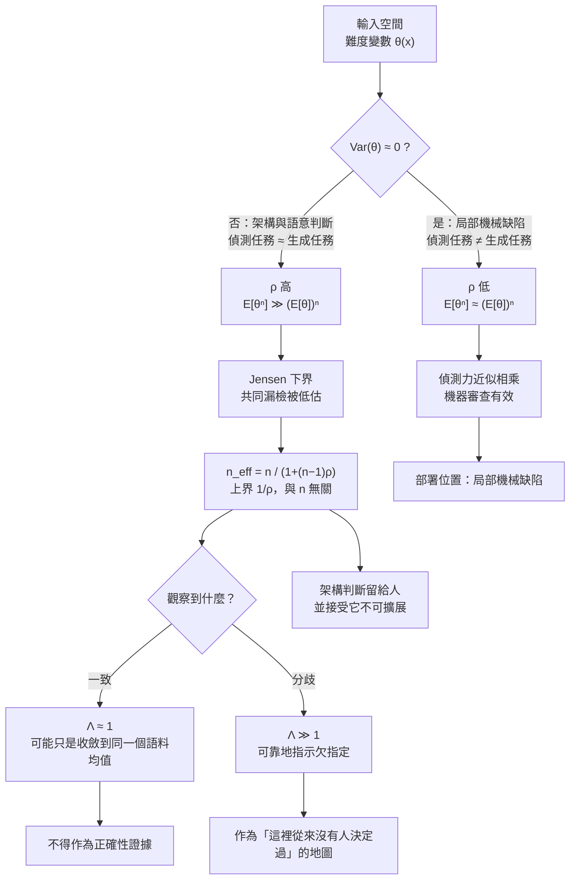

+++
title = "驗證器相關性與獨立性幻覺：Jensen 下界、有效偵測器數，與「一致無資訊、分歧有資訊」的單邊效力"
date = "2026-09-14T13:15:06+08:00"
author = "梅乾"
draft = false
isCJKLanguage = true
description = "多重審查與多模型交叉驗證通常假定失效相互獨立，但在非均勻輸入難度下，Jensen 不等式證明共同漏檢機率必然高於獨立假設估計。本文推導有效偵測器數的衰減極限，建立一致無資訊、分歧有資訊的單邊效力判準，並給出機器審查在架構與實作間的最佳佈署位置。"
tags = [
    "分析論述", # term:AnalyticalEssay
    "大型語言模型", # term:LargeLanguageModel
    "相關失效", # term:CorrelatedFailure
    "多版本程式設計", # term:MultiversionProgramming
    "有效偵測器數", # term:EffectiveNumberOfDetectors
    "單邊效力", # term:OneSidedEfficacy
    "確定性邊界", # term:DeterministicTrustBoundary
    "不變式", # term:Invariant
  ]
series = ["可失敗性工程：從拒絕算子、成本位移到驗證獨立性與可證偽契約"]
[ai_info]
    [ai_info.generation]
        model = "Claude Opus 5"
        agent = "Claude Code VSCode Extension 2.1.270"
    [ai_info.refinement]
        model = "Gemini 3.8 Flash"
        agent = "Antigravity IDE 2.5.5"
+++

<!--more-->

## 導言

1986 年，一項在可靠度工程領域留下長期影響的實驗被發表出來。[Knight 與 Leveson，1986 / 《An Experimental Evaluation of the Assumption of Independence in Multiversion Programming》](https://doi.org/10.1109/TSE.1986.6312924) 讓多組互不通訊的開發者，依據同一份規格各自獨立實作同一個程式，然後以大量測試案例同時執行所有版本，統計它們的失效行為。

實驗要檢驗的是當時**多版本程式設計**（Multiversion Programming） <!-- term:MultiversionProgramming -->的基本前提：若 $n$ 個版本由互不相干的團隊獨立開發，則它們的失效應當統計獨立，因此同時失效的機率是 $p^n$，隨 $n$ 指數下降。這個前提支撐了整套設計多樣性的成本效益論證——多花 $n$ 倍的開發成本，換取 $p^n$ 的殘餘風險。

> [!IMPORTANT]
> **多版本程式設計** <!-- term:MultiversionProgramming --> (Multiversion Programming): 依據同一規格由不同團隊獨立實作多個版本以期透過多樣性降低共同失效機率的容錯架構。 <!-- anchor:MultiversionProgramming -->


結果是：**共同失效的頻率顯著高於獨立假設的預測。** 不同團隊寫的程式，會在同樣的地方一起錯。而且錯的地方不是隨機分佈的——它們集中在規格中那些困難的、容易被誤解的、邊界條件微妙的輸入上。

這個結果打掉的不是某個實作，而是那個前提本身：**多個版本不等於多倍的偵測力。** 四十年後，同一個前提正以新的形式被重新採信——「讓另一個模型來審查」「用三個模型交叉比對」「多數決就可信」。本文要處理的問題是：這個前提在什麼條件下成立、在什麼條件下崩潰、崩潰時我們低估了多少，以及還剩下什麼可用。

---

## 分析

### 難度變數：共同失效的機率下界

Knight 與 Leveson 的實驗結果需要一個機制解釋，而該解釋在同一時期被形式化。[Eckhardt 與 Lee，1985 / 《A Theoretical Basis for the Analysis of Multiversion Software Subject to Coincident Errors》](https://doi.org/10.1109/TSE.1985.231895) 提出的模型只需要一個假設：**輸入空間上存在「難度」的差異。**

設輸入 $x$ 從某個分佈中抽取，定義輸入 $x$ 上的條件漏檢機率為

$$\theta(x) = P(\mathrm{Miss} \mid x)$$

若 $\theta$ 對所有輸入都相同（也就是難度均勻），則 $n$ 個獨立開發的驗證器同時漏檢的機率確實是 $\theta^n$。但真實的輸入空間不是這樣：有些情形所有人都能處理，有些情形所有人都容易搞錯。此時 $\theta(x)$ 是一個隨機變數，而在輸入分佈下的總體共同漏檢率為

$$P(\mathrm{CoincidentMiss}_n) = \mathbb{E}[\theta^n]$$

而工程上通常拿來估計的是「先取平均漏檢率、再取 $n$ 次方」：$(\mathbb{E}[\theta])^n$。兩者的大小關係由 Jensen 不等式決定——$t \mapsto t^n$ 在 $[0,1]$ 上對 $n \ge 2$ 是凸函數，故

$$\mathbb{E}[\theta^n] \;\ge\; (\mathbb{E}[\theta])^n$$

且當 $\mathrm{Var}(\theta) > 0$ 時不等式嚴格成立。

這個式子值得停下來看清楚，因為它說的事情比「相關性會降低效果」強得多：**只要輸入空間的難度不均勻，獨立假設就必然低估共同失效機率，而且低估幅度隨 $n$ 放大。** 這不是一個經驗發現，是一條算術上的必然。多加審查者不但沒有帶來 $p^n$ 的下降，還讓你對殘餘風險的估計錯得更離譜。

[Littlewood 與 Miller，1989 / 《Conceptual Modeling of Coincident Failures in Multiversion Software》](https://doi.org/10.1109/32.58771) 把模型再推一步：若不同版本採用**不同的方法論**（不同語言、不同演算法族、不同的驗證典範），則各自的難度函數 $\theta_A(x)$、$\theta_B(x)$ 不再是同一個，此時共同失效機率可以低於同方法論的情形——**但仍然不會低於完全獨立的下界。** 方法論多樣性有價值，而它的價值是「把相關性往下壓」，不是「把相關性消除」。

套到手上的問題：同一個訓練分佈產生的審查者，其難度函數與作者的難度函數高度重合——作者覺得難的地方，審查者也覺得難。更換不同來源的模型有幫助，但幫助有限，因為語料重疊使先驗仍然相關。而這個可用的去相關量還在縮小，因為模型愈來愈會讀到彼此的產出。

這裡需要就地釐清一個貫穿本文的前提：**確定性邊界（Deterministic Trust Boundary） <!-- term:DeterministicTrustBoundary --> vs 統計執行層**。確定性邊界 <!-- term:DeterministicTrustBoundary -->是指那些對同一輸入永遠給出同一判定、且判定具有拒絕力的機制——編譯器、型別檢查、測試執行環境、契約斷言、資料庫約束。統計執行層則是指以機率分佈產生輸出、不保證對同一輸入給出同一結果、且預設不產生拒絕的機制。這個區分在本文中承擔一個具體任務：**確定性邊界 <!-- term:DeterministicTrustBoundary -->與統計執行層的難度函數來源不同**，因此把一個型別檢查器與一個統計審查者配成一對，其去相關量遠大於把兩個統計審查者配成一對——即使後者來自不同廠商。

> [!IMPORTANT]
> **確定性邊界** <!-- term:DeterministicTrustBoundary --> (Deterministic Trust Boundary): 在系統設計中，劃分確定性執行層（如腳本、CI）與統計推論層（如大語言模型）的介面契約，以確保關鍵操作的 100% 正確性。 <!-- anchor:DeterministicTrustBoundary -->


**因果機制**：偵測力依賴失效的獨立性，而獨立性由難度函數的差異提供；難度函數相同時，$\mathbb{E}[\theta^n]$ 被分佈的尾端主導，與 $(\mathbb{E}\theta)^n$ 的差距隨 $n$ 擴大。

**邊界條件**：當難度分佈高度集中（$\mathrm{Var}(\theta) \approx 0$）時，Jensen 不等式趨近等號，獨立假設幾乎成立。局部且機械的缺陷——資源洩漏、邊界差一、漏掉的錯誤處理——正屬於這一類：偵測任務與生成任務不同，難度對輸入的依賴很弱。

**反例**：把機器審查用在架構判斷上。「這個抽象是否恰當」「這東西該不該存在」「這是不是第四份幾乎一樣的實作」——正是難度分佈最分散、相關性最高的區域，也正是審查最不可能發現的區域。而它同時是人最花時間的部分，因此看起來最值得自動化——這個「最值得」與「最無效」的重合，是整件事最危險的地方。

### 有效偵測器數：$n$ 個審查者實際等於幾個

Jensen 不等式給出了下界，但工程上還需要一個可以直接放進決策的量。在等相關近似下（任兩個驗證器的失效相關係數皆為 $\rho$），$n$ 個驗證器的有效數目是

$$n_{\text{eff}} = \frac{n}{1 + (n-1)\rho}$$

這個式子有兩個性質特別值得記住：

1. $\rho = 0$ 時 $n_{\text{eff}} = n$，獨立假設成立。
2. $n \to \infty$ 時 $n_{\text{eff}} \to 1/\rho$——**存在一個與 $n$ 無關的硬上界。** $\rho = 0.3$ 時，無論加多少審查者，**有效偵測器數**（Effective Number of Detectors） <!-- term:EffectiveNumberOfDetectors -->都不會超過 3.33。

> [!IMPORTANT]
> **有效偵測器數** <!-- term:EffectiveNumberOfDetectors --> (Effective Number of Detectors): 考慮審查者之間的失效相關性後，多個驗證器等效於完全獨立驗證器的真實折算數量。 <!-- anchor:EffectiveNumberOfDetectors -->


第二條把「多加幾個模型交叉比對」這個直覺徹底改寫：它不是報酬遞減，是有天花板。當 $\rho$ 較高時，天花板低到讓增加審查者這個動作本身失去意義。

下圖把整條因果鏈畫出來，並標出兩個分岔點：



圖中右下那兩條分岔是本文最有操作價值的部分。多個驗證器**一致**時，在高 $\rho$ 下這件事幾乎必然發生，無論作者是對是錯——因此「一致」的**似然比**（Likelihood Ratio） <!-- term:LikelihoodRatio -->接近 1，不提供任何更新。而多個驗證器**分歧**時，情況相反：分歧要求它們的難度函數在該輸入上確實不同，而這通常意味著該輸入本身是欠指定的——規格沒說清楚、決策從未被做出、不同的合理讀法導向不同的答案。

> [!IMPORTANT]
> **似然比** <!-- term:LikelihoodRatio --> (Likelihood Ratio): 在特定假設成立與不成立下觀測到同一徵候的條件機率之比，決定貝氏後驗更新的幅度。 <!-- anchor:LikelihoodRatio -->


於是得到一條**單邊效力**（One-Sided Efficacy） <!-- term:OneSidedEfficacy -->判準：**分歧可靠地指示欠指定，一致不指示任何事。** 分歧圖是一張有用的地圖，它標出的不是誰對，而是「這裡從來沒有人決定過」。

> [!IMPORTANT]
> **單邊效力** <!-- term:OneSidedEfficacy --> (One-Sided Efficacy): 在高相關性審查中，多個審查者的一致結論不攜帶資訊，而分歧結論高度指示規格欠指定的非對稱性判準。 <!-- anchor:OneSidedEfficacy -->


以下 TypeScript 程式把兩件事同時做掉：執行層計算 Jensen 下界、低估倍數與有效偵測器數 <!-- term:EffectiveNumberOfDetectors -->；型別層則讓「把同一來源的兩個驗證器宣告為獨立」在編譯期就不成立。

```typescript
/**
 * 驗證器相關性與獨立性幻覺。
 * 型別層：禁止把同一語料來源的兩個驗證器宣告為獨立。
 * 執行層：以難度變數模型計算共同失效機率，對比獨立假設下的估計。
 * 執行：node s6.ts        型別檢查：tsc --strict --noEmit s6.ts
 */

// ---- 型別層：來源以判別聯集標定，獨立性必須由不同來源證成 ----
type Corpus = "web-corpus" | "code-corpus" | "human-reviewer" | "symbolic-engine";

type Verifier<C extends Corpus> = {
  readonly id: string;
  readonly corpus: C;
  readonly missRate: number; // 單獨作用時的漏檢率
};

/** 獨立性憑證：只能由兩個來源不同的驗證器產生。 */
type IndependencePair<A extends Corpus, B extends Corpus> = {
  readonly left: Verifier<A>;
  readonly right: Verifier<B>;
  readonly justification: string;
};

/**
 * B 被限制為 Exclude<Corpus, A>：傳入同來源的兩個驗證器是型別錯誤，
 * 而不是一個可以在程式碼審查中被忽略的約定。
 */
function assumeIndependent<A extends Corpus, B extends Exclude<Corpus, A>>(
  left: Verifier<A>,
  right: Verifier<B>,
  justification: string,
): IndependencePair<A, B> {
  return { left, right, justification };
}

// ---- 執行層：Eckhardt-Lee 難度變數模型 ----

/** 輸入空間上的「難度」分佈：theta = 單一驗證器在該類輸入上漏檢的機率。 */
type DifficultyProfile = ReadonlyArray<{ readonly theta: number; readonly weight: number }>;

function expectation(profile: DifficultyProfile, f: (t: number) => number): number {
  const total = profile.reduce((s, p) => s + p.weight, 0);
  return profile.reduce((s, p) => s + (p.weight / total) * f(p.theta), 0);
}

/** 真實的共同漏檢率：E[theta^n]，對難度分佈取期望後才做 n 次方。 */
function jointMissRate(profile: DifficultyProfile, n: number): number {
  return expectation(profile, (t) => Math.pow(t, n));
}

/** 獨立假設下的估計：(E[theta])^n，先取期望再做 n 次方。 */
function independentAssumption(profile: DifficultyProfile, n: number): number {
  return Math.pow(expectation(profile, (t) => t), n);
}

/** 等相關近似下的有效偵測器數。rho = 0 時等於 n；rho = 1 時恆為 1。 */
function effectiveVerifiers(n: number, rho: number): number {
  return n / (1 + (n - 1) * rho);
}

/** 一致 / 分歧的單邊效力：回傳兩種觀察各自的似然比。 */
function agreementLikelihoodRatios(rho: number, baseAccuracy: number, underspecRate: number) {
  // 高相關下，兩個驗證器在「作者對」與「作者錯」時都傾向一致 —— 一致無資訊。
  const agreeGivenCorrect = baseAccuracy + (1 - baseAccuracy) * rho;
  const agreeGivenWrong = baseAccuracy * rho + (1 - baseAccuracy) * rho + (1 - rho) * 0.5;
  // 分歧則主要由「這裡從來沒有人決定過」驅動。
  const disagreeGivenUnderspec = underspecRate;
  const disagreeGivenSpecified = (1 - rho) * (1 - baseAccuracy);
  return {
    agreement: agreeGivenCorrect / agreeGivenWrong,
    disagreement: disagreeGivenUnderspec / Math.max(disagreeGivenSpecified, 1e-9),
  };
}

function assert(cond: boolean, msg: string): void {
  if (!cond) {
    console.error("不變式違反：" + msg);
    process.exit(1);
  }
}

// ---- 情境一：架構判斷。偵測任務與生成任務高度相關，難度分佈極度分散。 ----
const architectural: DifficultyProfile = [
  { theta: 0.05, weight: 0.55 }, // 容易的情形，幾乎都抓得到
  { theta: 0.55, weight: 0.30 },
  { theta: 0.95, weight: 0.15 }, // 「所有人一起錯」的那一類輸入
];

// ---- 情境二：局部機械缺陷。偵測與生成是不同任務，難度分佈集中。 ----
const mechanical: DifficultyProfile = [
  { theta: 0.19, weight: 0.50 },
  { theta: 0.20, weight: 0.35 },
  { theta: 0.21, weight: 0.15 },
];

function main(): void {
  // 1. Jensen 不等式：E[theta^n] >= (E[theta])^n，等號僅在 theta 退化為常數時成立。
  for (const n of [2, 3, 5]) {
    const real = jointMissRate(architectural, n);
    const naive = independentAssumption(architectural, n);
    assert(real > naive, `n=${n} 時真實共同漏檢率必須嚴格大於獨立假設估計`);
  }

  console.log("情境一：架構判斷（偵測與生成高度相關）");
  console.log(
    `${"審查者數 n".padEnd(12)}${"真實共同漏檢".padStart(16)}${"獨立假設估計".padStart(16)}${"低估倍數".padStart(12)}`,
  );
  let prevFactor = 0;
  for (const n of [1, 2, 3, 5, 8]) {
    const real = jointMissRate(architectural, n);
    const naive = independentAssumption(architectural, n);
    const factor = real / naive;
    console.log(
      `${String(n).padEnd(12)}${real.toFixed(6).padStart(16)}${naive.toFixed(6).padStart(16)}${factor.toFixed(2).padStart(12)}`,
    );
    if (n > 1) assert(factor > prevFactor, `低估倍數應隨 n 遞增（n=${n}）`);
    prevFactor = n === 1 ? factor : Math.max(prevFactor, factor);
  }

  // 2. 集中難度分佈（機械缺陷）下，獨立假設幾乎成立。
  const mechReal = jointMissRate(mechanical, 5);
  const mechNaive = independentAssumption(mechanical, 5);
  assert(mechReal / mechNaive < 1.05, "難度分佈集中時，獨立假設的低估幅度應很小");
  console.log(
    `\n情境二：局部機械缺陷 n=5 → 真實 ${mechReal.toExponential(3)}，` +
      `獨立假設 ${mechNaive.toExponential(3)}，低估倍數 ${(mechReal / mechNaive).toFixed(3)}`,
  );

  // 3. 有效偵測器數：相關係數把 n 個審查者壓縮成 n_eff 個。
  console.log(`\n${"rho".padEnd(8)}${"n=2".padStart(10)}${"n=5".padStart(10)}${"n=10".padStart(10)}${"n→∞ 上界".padStart(12)}`);
  for (const rho of [0.0, 0.1, 0.3, 0.6, 0.9]) {
    const bound = rho > 0 ? 1 / rho : Infinity;
    console.log(
      `${rho.toFixed(1).padEnd(8)}${effectiveVerifiers(2, rho).toFixed(2).padStart(10)}` +
        `${effectiveVerifiers(5, rho).toFixed(2).padStart(10)}${effectiveVerifiers(10, rho).toFixed(2).padStart(10)}` +
        `${(rho > 0 ? bound.toFixed(2) : "∞").padStart(12)}`,
    );
    if (rho > 0) {
      assert(effectiveVerifiers(10, rho) < 10, `rho=${rho} 時有效偵測器數必須小於 n`);
      assert(effectiveVerifiers(1000, rho) < bound + 1e-6, `rho=${rho} 時 n_eff 不得超過 1/rho 上界`);
    }
  }
  assert(Math.abs(effectiveVerifiers(5, 0) - 5) < 1e-12, "rho=0 時 n_eff 應等於 n");

  // 4. 單邊效力：一致無資訊，分歧有資訊。
  const lr = agreementLikelihoodRatios(0.85, 0.8, 0.6);
  assert(Math.abs(lr.agreement - 1) < 0.25, `高相關下「一致」的似然比應接近 1，實得 ${lr.agreement.toFixed(3)}`);
  assert(lr.disagreement > 5, `「分歧」的似然比應顯著大於 1，實得 ${lr.disagreement.toFixed(3)}`);
  console.log(
    `\n單邊效力（rho=0.85）：一致的似然比 ${lr.agreement.toFixed(3)}（接近 1，無資訊）；` +
      `分歧的似然比 ${lr.disagreement.toFixed(2)}（指示欠指定）`,
  );

  // 5. 型別層：獨立性宣告必須由不同來源證成。
  const webModel: Verifier<"web-corpus"> = { id: "reviewer-A", corpus: "web-corpus", missRate: 0.3 };
  const codeModel: Verifier<"code-corpus"> = { id: "reviewer-B", corpus: "code-corpus", missRate: 0.3 };
  const symbolic: Verifier<"symbolic-engine"> = { id: "type-checker", corpus: "symbolic-engine", missRate: 0.4 };

  const pair1 = assumeIndependent(webModel, symbolic, "符號引擎不依賴語料統計，盲區來源不同");
  const pair2 = assumeIndependent(webModel, codeModel, "語料部分重疊，獨立性僅為部分成立");
  // 注意：「兩端來源必須不同」這條不變式不需要執行期檢查——型別系統已經證清它。
  // 寫成 pair1.left.corpus !== pair1.right.corpus 反而會被 tsc 以
  //   TS2367: This comparison appears to be unintentional because the types
  //           '"web-corpus"' and '"symbolic-engine"' have no overlap
  // 指出該比較恆為真。不變式被移到型別層之後，執行期的防衛程式碼就成了多餘。
  assert(pair1.justification.length > 0 && pair2.justification.length > 0, "獨立性宣告必須附理由");
  console.log(`\n已證成的獨立性配對：${pair1.left.id} × ${pair1.right.id}；${pair2.left.id} × ${pair2.right.id}`);

  // 下一行無法通過型別檢查，因為兩端來源相同：
  //   const bad = assumeIndependent(webModel, { id: "reviewer-C", corpus: "web-corpus", missRate: 0.3 }, "同語料");
  //   ^ TS2322: Type '"web-corpus"' is not assignable to type
  //             '"code-corpus" | "human-reviewer" | "symbolic-engine"'

  console.log("\n自驗證通過：Jensen 下界、低估倍數遞增、n_eff 上界、單邊效力與獨立性型別約束斷言全部成立。");
}

main();
```

執行結果把低估的規模量了出來。在架構判斷的難度分佈下（有一成五的輸入是「所有人一起錯」的那一類），$n = 2$ 時真實共同漏檢率是 0.2275 而獨立假設估計 0.1122，低估 2.03 倍；$n = 5$ 時是 0.1312 對 0.0042，低估 31 倍；$n = 8$ 時是 0.1020 對 0.000159，**低估 643 倍**。注意真實漏檢率的下降有多慢——從 $n=1$ 的 0.335 到 $n=8$ 的 0.102，加了七個審查者只把漏檢率壓到不到三分之一，而獨立假設預測的是壓到兩千分之一。

對照組同樣清楚：在難度分佈集中的機械缺陷情境下，$n = 5$ 時真實值 $2.971 \times 10^{-4}$、獨立假設 $2.930 \times 10^{-4}$，低估倍數只有 1.014。**同一套數學，在兩種問題上給出完全相反的工程建議**——這正是「機器審查有沒有用」這個問題沒有統一答案的原因。

有效偵測器數 <!-- term:EffectiveNumberOfDetectors -->的表格則把天花板顯示出來：$\rho = 0.3$ 時，$n$ 從 2 增到 10，$n_{\text{eff}}$ 只從 1.54 爬到 2.70，而 $n \to \infty$ 的上界是 3.33；$\rho = 0.9$ 時，十個審查者的有效數目是 1.10，上界 1.11。加審查者這個動作在高相關區域幾乎不做功。

單邊效力 <!-- term:OneSidedEfficacy -->也如推導：在 $\rho = 0.85$ 下，「一致」的似然比 <!-- term:LikelihoodRatio -->是 1.049（實質上不提供更新），「分歧」的似然比 <!-- term:LikelihoodRatio -->是 20.00。

型別層的部分同樣實測過。`tsc --strict --noEmit` 對正確版本零錯誤；把註解中那行解開後，編譯器回報 `error TS2322: Type '"web-corpus"' is not assignable to type '"code-corpus" | "human-reviewer" | "symbolic-engine"'`。還有一個細節值得指出：原本寫在執行期的「兩端來源必須不同」斷言，被 `tsc` 以 `TS2367` 標記為恆為真的比較——**不變式（Invariant） <!-- term:Invariant -->一旦被移到型別層，執行期的防衛程式碼就成了多餘。** 這正是把獨立性宣告做成型別約束而非文件規約的理由。

> [!IMPORTANT]
> **不變式** <!-- term:Invariant --> (Invariant): 系統在任何合法狀態下都必須成立的斷言，是把評估規則寫成可執行檢查的基本單位。 <!-- anchor:Invariant -->


下表以具體的審查配置走一遍判定與處置：

| 邊界輸入案例 | 關鍵判定條件 / 不變式 <!-- term:Invariant --> | 狀態轉移 | 最終處置結果 |
| :--- | :--- | :--- | :--- |
| 兩個同語料模型互審架構決策 | 來源相同，$\rho$ 高 | `proposed` → `type_error`（獨立性無法證成） | 拒絕宣告為獨立；$n_{\text{eff}} \approx 1.05$，等於沒加審查者 |
| 一個統計審查者 + 一個型別檢查器 | 來源跨越確定性邊界 <!-- term:DeterministicTrustBoundary -->與統計執行層 | `proposed` → `certified` | 獨立性部分成立；去相關量最大 |
| 三個不同廠商模型交叉比對且結果一致 | 一致的似然比 <!-- term:LikelihoodRatio --> $\approx 1$ | `agreed` → `no_update` | 不得作為正確性證據；後驗等於先驗 |
| 同上但結果分歧 | 分歧的似然比 <!-- term:LikelihoodRatio --> $= 20.0$ | `disagreed` → `flagged_underspecified` | 標記為「這裡從未被決定」，送人決策 |
| 機器審查用於資源洩漏偵測（$\mathrm{Var}(\theta)\approx 0$） | 低估倍數 1.014 | `proposed` → `deployed` | 偵測力近似相乘，部署正確 |
| 機器審查用於「這個抽象是否恰當」 | 低估倍數 31（$n=5$） | `proposed` → `rejected` | 相關性最高、偵測力最低；留給人 |
| 以 $n = 8$ 個同源審查者宣稱殘餘風險 $1.6\times10^{-4}$ | 真實值 0.102 | `claimed` → `refuted` | 風險宣稱低估 643 倍 |
| $\rho = 0.3$，追加審查者至 $n = 50$ | $n_{\text{eff}}$ 上界 $1/\rho = 3.33$ | `scaled` → `capped` | 追加無效；應改為降低 $\rho$ 而非提高 $n$ |

下表把驗證層的五組現象拆成四個維度：

| 表面讀數 / 現象 | 底層統計病灶 | 舊代脆弱做法 | 新代嚴格工程防線 |
| :--- | :--- | :--- | :--- |
| 多個模型的審查結論一致 | 高 $\rho$ 下一致幾乎必然發生，似然比 <!-- term:LikelihoodRatio --> $\approx 1$ | 以多數決或一致性作為正確性證據 | 只採用單邊效力 <!-- term:OneSidedEfficacy -->：分歧觸發人工決策，一致不改變任何判斷 |
| 增加審查者後殘餘風險估計大幅下降 | 估計用 $(\mathbb{E}\theta)^n$，真值是 $\mathbb{E}[\theta^n]$ | 以 $p^n$ 宣稱風險 | 以 $\mathbb{E}[\theta^n]$ 或 $n_{\text{eff}}$ 估計；明列難度分佈假設 |
| 換用不同廠商的模型 | 語料重疊使難度函數仍然相關 | 視為獨立來源 | 要求獨立性證據指向不同的機制族（確定性邊界 <!-- term:DeterministicTrustBoundary --> vs 統計執行層），而非不同的廠商名 |
| 機器審查在某類缺陷上效果很好 | 該類缺陷的 $\mathrm{Var}(\theta)$ 小，與生成任務不同 | 外推到所有審查場景 | 按缺陷類別分別評估 $\rho$；部署位置隨 $\rho$ 決定，不隨「人花多少時間」決定 |
| 審查覆蓋率報表全綠 | 覆蓋率量的是審查有無執行，不是偵測力 | 以審查執行率推論風險已受控 | 報表改列各缺陷類別的 $n_{\text{eff}}$ 與獨立性證據；無證據者記為 $n_{\text{eff}} = 1$ |

**因果機制**：有效偵測器數 <!-- term:EffectiveNumberOfDetectors -->由相關係數決定並存在 $1/\rho$ 的硬上界；增加驗證器數量只沿著一條快速飽和的曲線移動，而降低 $\rho$ 才改變曲線本身。

**邊界條件**：$\rho$ 並非不可降。跨越機制族的組合——符號引擎與統計模型、型別系統與測試、形式驗證與人工審查——其難度函數來源不同，$\rho$ 顯著較低。這是方法論多樣性的真正價值，也是它的極限：它把 $\rho$ 往下壓，但壓不到零。

**反例**：以「我們用了三家不同廠商的模型」作為獨立性證據。廠商不同不蘊涵語料不同，語料重疊即難度函數重疊；把商業來源當成統計獨立性的代理，是把一個行政事實誤認為一個機率事實。

---

## 反思

第一個值得澄清的是本文與「機器審查無用」之間的距離。本文的結論不是無用，而是**有用的區域與直覺相反**。在難度分佈集中的地方——局部、機械、可列舉的缺陷類別——機器審查的效果是真實的，而且相乘效應接近理論值。在難度分佈分散的地方——架構、抽象層級、這東西該不該存在——效果趨近於零。麻煩在於後者正是人最花時間的部分，因此它在任何以「節省人力」為目標的自動化評估中都排名最前。**最值得自動化與最無法自動化，在這裡是同一個區域。**

第二點是關於「加審查者」這個動作的性質。從 $n_{\text{eff}} \to 1/\rho$ 可以看出，提高 $n$ 與降低 $\rho$ 不是同一類操作：前者沿著一條飽和曲線移動，後者改變曲線本身。這給出一個很具體的資源配置建議——與其部署第四個同源審查者，不如把同樣的成本投在一個機制族不同的檢查上，即使那個檢查單獨看起來較弱。一個 $\theta$ 較高但 $\rho$ 較低的驗證器，其邊際貢獻可以遠大於一個 $\theta$ 較低但 $\rho$ 接近 1 的驗證器。

第三點是一個容易被忽略的時間維度。可用的去相關量正在縮小，因為統計執行層的訓練材料愈來愈包含彼此的產出。這意味著 $\rho$ 是一個會隨時間上升的參數，而任何基於當前 $\rho$ 的風險估計都有保鮮期。實務上的含義是：獨立性證據必須註明取得時點，並定期重新檢驗——一個兩年前成立的「這兩個來源盲區不同」的判斷，今天可能已經不成立。

最後值得指出，本文的形式結果比通常被引用的版本更強。常見的說法是「相關性會削弱多重驗證的效果」，而 Jensen 不等式說的是：**只要難度不均勻，獨立假設就必然低估，而且低估幅度隨 $n$ 放大。** 也就是說，在你最需要準確估計殘餘風險的高 $n$ 場景裡，估計的誤差最大。這個性質使得「加了很多審查所以應該很安全」成為一個結構上最不可靠的推論。

---

## 實務對比

**其一：機器審查的部署位置**

錯誤的作法是讓模型審查架構決策，因為那是人最花時間的部分，看起來最值得自動化。那也正是與生成任務難度函數最重合、偵測力最低的區域。

正確的作法是按缺陷類別分別評估難度分佈的分散程度，把機器審查配置在 $\mathrm{Var}(\theta)$ 小的地方——資源洩漏、邊界差一、漏掉的錯誤處理、契約違反。架構判斷留給人，並誠實接受它不可擴展；不可擴展不是需要被解決的問題，而是需要被納入計畫的約束。

**其二：多重驗證結果的解讀**

錯誤的作法是把多個驗證器的一致視為正確的證據。在高相關下一致幾乎必然發生，無論作者是對是錯——它們可能只是收斂到同一個語料均值，而收斂的填充物與收斂的正解在表面上完全相同。

正確的作法是只採用單邊效力 <!-- term:OneSidedEfficacy -->：**分歧可靠地指示欠指定，一致不指示任何事。** 分歧應觸發一次人的決策（規格在此沒說清楚，需要有人拍板），一致則不改變任何既有判斷。把分歧清單當成「待決策地圖」使用，是多重驗證在高相關下唯一仍然有效的用法。

**其三：獨立性宣告的證成方式**

錯誤的作法是以廠商不同、模型不同、提示不同作為獨立性的依據，然後用 $p^n$ 估計殘餘風險。這會在最需要準確的高 $n$ 場景裡產生最大的估計誤差。

正確的作法是要求每一組獨立性宣告附上機制層級的理由——兩者的難度函數為何不同、是否跨越了確定性邊界 <!-- term:DeterministicTrustBoundary -->與統計執行層、證據取得的時點是什麼——並把這條約束降到型別或流水線層，讓無法證成的宣告在提交時就被拒絕，而不是在事故後才被檢討。

---

## 結論

多個審查者不等於多倍的偵測力，而低估的幅度在你最需要準確估計的時候最大。

由此得到三個可遷移的判斷。第一，只要輸入空間的難度不均勻，獨立假設就必然低估共同失效機率——這是 Jensen 不等式的直接後果，不是經驗觀察；而低估倍數隨審查者數量放大，本文模型在 $n = 8$ 時測得 643 倍。第二，有效偵測器數 <!-- term:EffectiveNumberOfDetectors --> $n_{\text{eff}} = n/(1+(n-1)\rho)$ 存在與 $n$ 無關的硬上界 $1/\rho$；因此提高審查者數量沿著飽和曲線移動，只有降低相關係數才改變曲線本身——而降低相關係數的可行手段是跨越機制族，不是更換廠商。第三，在高相關下「一致」的似然比 <!-- term:LikelihoodRatio -->接近 1、「分歧」的似然比 <!-- term:LikelihoodRatio -->顯著大於 1，因此多重驗證的正確用法是單邊的：分歧當作「這裡從來沒有人決定過」的地圖，一致不作為任何證據。

判斷一個審查的價值時，該問的不是「有沒有審查」，而是「這個審查者會在哪些地方跟作者一起錯」。