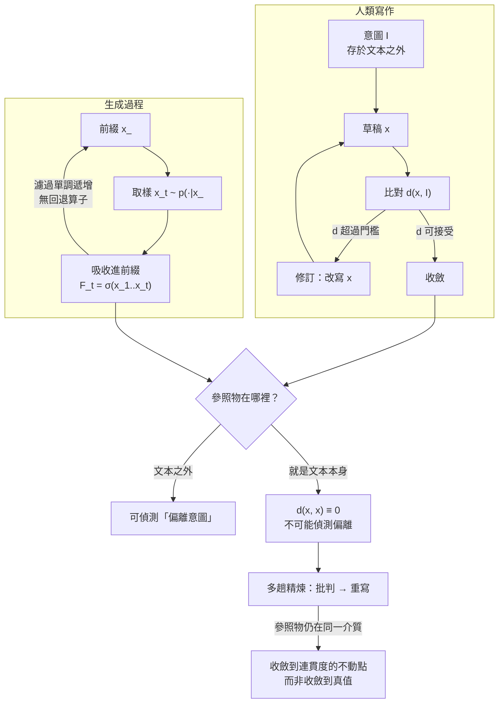

+++
title = "局部似真與承諾不可逆：鏈式分解下的全域約束缺席、濾過單調性，與精煉的連貫不動點"
date = "2026-09-14T13:50:07+08:00"
author = "梅乾"
draft = false
isCJKLanguage = true
description = "自回歸生成的鏈式分解保證局部條件機率，但跨位置的全域約束在原理上從未進入目標函數。本文以濾過單調性證明離散取樣後的承諾具備時間不可逆性，枚舉貪婪局部最優違反全域校驗的反例，並以不動點定理證明多輪精煉收斂於內部連貫度而非外部事實真值。"
tags = [
    "分析論述", # term:AnalyticalEssay
    "大型語言模型", # term:LargeLanguageModel
    "局部似真", # term:LocalPlausibility
    "自回歸分解", # term:AutoregressiveDecomposition
    "承諾不可逆", # term:CommitmentIrreversibility
    "連貫不動點", # term:CoherentFixedPoint
    "濾過單調性", # term:FiltrationMonotonicity
    "均值回歸", # term:RegressionToTheMean
  ]
series = ["可失敗性工程：從拒絕算子、成本位移到驗證獨立性與可證偽契約"]
[ai_info]
    [ai_info.generation]
        model = "Claude Opus 5"
        agent = "Claude Code VSCode Extension 2.1.270"
    [ai_info.refinement]
        model = "Gemini 3.8 Flash"
        agent = "Antigravity IDE 2.5.5"
+++

<!--more-->

## 導言

一個支付串接模組的重試邏輯出了問題：在特定的逾時情境下，同一筆扣款被送出兩次。

追查的結果沒有任何一行程式碼是「錯的」。重試實作得相當標準——指數退避、抖動、最大重試次數、逾時後重送，每一項都符合業界慣例，也通過了審查。真正的問題在別的地方：這個上游供應商的**冪等**（Idempotent） <!-- term:Idempotent -->鍵語意與慣例不同，它的冪等 <!-- term:Idempotent -->視窗只覆蓋同一個連線階段，跨階段重送會被視為新請求。這一點寫在供應商文件的一個角落，不在任何範例程式碼裡，也不在任何公開語料的常見模式裡。

> [!IMPORTANT]
> **冪等** <!-- term:Idempotent --> (Idempotent): 一個步驟可反覆執行而結果穩定的性質；對已是最新狀態的產物再跑一次，應為無變更。 <!-- anchor:Idempotent -->


再往前追一步，事情更清楚。這個模組的第一段實作是從一句話開始的：「先假設上游的建立扣款端點是冪等 <!-- term:Idempotent -->的。」這句話當時是合理的——多數支付端點確實如此。而它一旦被寫下，後面的每一段實作都以它為前提展開：重試策略、錯誤處理、對帳邏輯、測試案例。**當那個假設被發現是錯的時，問題已經不是改一行，而是整條路徑從第三步之後就沒有任何一種寫法能同時滿足真實約束。**

這個案例要問的不是「為什麼會弄錯一個事實」——單一事實錯誤很平常。要問的是兩件更結構性的事：

第一，為什麼填充出來的東西恰好是慣例，而且慣例恰好通過審查？

第二，為什麼一個早期的承諾，可以讓後續所有努力都無法挽回？

---

## 分析

### 局部似真不是自洽，而且性質更差一級

先釐清一個經常被寬容使用的說法：生成的產出「自洽但不一定為真」。這個說法太寬容了。

邏輯一致是一個**全域**性質：一組命題中沒有任何兩個互相矛盾。而**自回歸**（Autoregressive） <!-- term:Autoregressive -->生成是**局部**的：序列機率依鏈式法則分解為

> [!IMPORTANT]
> **自回歸** <!-- term:Autoregressive --> (Autoregressive): 逐步以先前輸出作為後續輸入條件的生成方式，使完成時間與輸出長度相關。 <!-- anchor:Autoregressive -->


$$p(x_{1:T}) = p(x_1) \prod_{t=2}^{T} p(x_t \mid x_{<t})$$

這個分解本身是機率論的恆等式，沒有任何問題。問題出在**目標函數只作用在每一個條件項上**。設全域約束為 $\Phi: \mathcal{X}^T \to \{\text{true}, \text{false}\}$——例如「這個系統獨有的非慣例分支必須在早期被處理」「重試路徑必須與上游的冪等 <!-- term:Idempotent -->視窗相容」——則 $\Phi$ 是一個跨越多個位置的謂詞，它**不是任何單一 $p(x_t \mid x_{<t})$ 的函數**，因此在原理上無法被局部目標表示。模型沒有「一致性檢查」這個操作可以執行，不是因為它被省略了，而是因為它不在分解的語法裡。

因此拿到的不是自洽，是**局部似真**（Local Plausibility） <!-- term:LocalPlausibility -->：每一個看的點都像真的，而整體是否成立從未被計算過。

> [!IMPORTANT]
> **局部似真** <!-- term:LocalPlausibility --> (Local Plausibility): 每個局部接續看似合理，但全域一致性與外部真實性未被保證的生成性質。 <!-- anchor:LocalPlausibility -->


這裡需要就地釐清一組常被混用的概念：**自洽 ≠ 正確 ≠ 可信**。自洽是內部無矛盾；正確是與外部事實相符；可信是有理由相信它正確。三者互不蘊涵——一份內部完全一致的文件可以整體為假，一份局部正確的產物可以無人有理由信任它。而局部似真 <!-- term:LocalPlausibility -->比這三者中的任何一個都弱：**它既不保證真，也不保證內部一致，只在你剛好看的那個點上提供兩者的外觀。**

這個區分有實際後果。一個「一致但為假」的系統至少是可推導的——你可以從中導出結論、發現矛盾、進而反證它。局部似真 <!-- term:LocalPlausibility -->兩樣都沒有。

它讀起來像連貫，還有一個更難處理的理由：**人的連貫偵測也是局部的**。我們順著讀、在視窗裡檢查、感覺順暢就通過。生產者與檢查者用同一個尺度失效。

**因果機制**：目標函數的作用範圍是單步條件機率，全域約束從未進入目標；而全域約束按定義跨越多個位置，因此不可能被單步條件表示。

**邊界條件**：當約束可以寫成單一轉移的函數時（例如「不得在某個狀態後緊接某個符號」），它落在目標函數的視野內，局部最佳化就保得住它。這劃出一條清楚的界線：**局部目標保得住局部性質，保不住跨位置性質。**

**反例**：形式驗證工具在生成產物上的偵測率低於預期。它們抓得到能被該語言表達的矛盾，而局部似真 <!-- term:LocalPlausibility -->的破口散佈在所有檢查器粒度覆蓋不到的地方——不是矛盾太深，是矛盾根本不以矛盾的形式出現。那個重試模組沒有任何內部矛盾，它與一個它從未接觸過的外部事實不相容。

### 不連續在承諾，不在計算

若要精確定位問題，需要避開一個常見的誤解。

前向傳遞本身是連續的。稠密向量、對整個脈絡進行的注意力運算——模型在產生每個符號之前，確實計算了某種涵蓋全域的東西。它不是盲目接龍。

不連續發生在兩個地方。第一是**介面**：連續的分布被取樣成一個離散符號。第二是**承諾**：那個符號被吸收進前綴，不可撤回。

第二個才是致命的，而它可以用測度論精確描述。生成過程產生一個遞增的濾過（filtration）

$$\mathcal{F}_1 \subseteq \mathcal{F}_2 \subseteq \cdots \subseteq \mathcal{F}_T, \qquad \mathcal{F}_t = \sigma(x_1, \dots, x_t)$$

每一步的輸出對 $\mathcal{F}_t$ 可測，而濾過**單調遞增**——資訊只增不減，沒有任何算子可以把 $x_k$ 從 $\mathcal{F}_t$（$t > k$）裡移除。錯誤不會被修正，只會被當成前提繼續條件化。

這個結構性質在序列模型的訓練與推論落差上有直接對應。[Ranzato 等人，2016 / 《Sequence Level Training with Recurrent Neural Networks》](https://arxiv.org/abs/1511.06732) 指出，訓練時模型條件於真實前綴，推論時條件於自己產生的前綴，於是誤差沿序列累積且無法回退；[Bengio 等人，2015 / 《Scheduled Sampling for Sequence Prediction with Recurrent Neural Networks》](https://arxiv.org/abs/1506.03099) 針對同一問題提出在訓練中逐步以自產符號取代真實符號的作法。兩者處理的都是**承諾的後果**，而不是單步預測的準確度——這正說明了問題的定位。

下圖把人類寫作與生成過程的兩種迴圈並排：



左側的迴圈之所以能夠收斂，是因為存在一個**位於文本之外**的參照點。人腦子裡有一個不在紙上的東西，可以拿紙上的東西去對它。

右側沒有那個外部參照點。**前綴就是它的意圖。** 因此它不可能偵測到「偏離意圖」——沒有東西可以被偏離。它說過的話就是它想說的話，每一個接續按定義都忠於意圖。

那個支付模組的失效在此有了精確的定位：「先假設上游是冪等 <!-- term:Idempotent -->的」這句話一旦進入前綴，就從一個待驗證的假設變成了一個不再被質疑的條件。後續每一段實作都忠於它，而忠於一個錯誤的前提正是問題所在。

**因果機制**：修訂需要一個獨立於產物的參照物，而該過程的參照物就是產物本身；$d(x, x) \equiv 0$ 使偏離偵測在原理上不可能。

**邊界條件**：多趟工作流——草稿、批判、重寫——部分地把修訂裝了回去。但裝回去的是**動作**，不是**條件**：批判者與作者來自同一個分布，且被修訂所朝向的「意圖」仍然存放在同一種介質裡。**同介質的參照點會跟著漂。**

**反例**：以增加修訂輪次作為品質保證。下一節會用可執行的方式證明，這個動作提升的是連貫度，而且它對不合敘事方向的內容有明確的負向選擇。

### 精煉收斂到連貫的不動點，不是真值

把上一節的邊界條件寫成可算的形式，會得到一個比直覺更強的結論。

設精煉算子 $R$ 對產物做座標上升：逐位置嘗試替換，保留使連貫度最高的版本。連貫度在此就是局部接續機率的對數和——這正是精煉實際在做的事，因為「讀起來更順、銜接更好、術語更一致」的操作型定義就是提高局部接續的機率。

反覆施用 $R$ 會收斂到它的不動點 $x^* = R(x^*)$。而不動點的定義裡**完全沒有 $\Phi$**。於是可以預測一件事：從一份「滿足全域約束但較不連貫」的草稿出發，精煉會把它改成「更連貫但不滿足約束」的版本。

這不是思想實驗。以下 Python 用顯式轉移矩陣與完全列舉把整件事做出來，沒有任何隨機性：

```python
"""局部似真與承諾不可逆：鏈式分解下的全域約束缺席，及精煉的連貫不動點。

顯式轉移矩陣、完全列舉，無隨機性。僅用標準函式庫。
"""
from itertools import product

ALPHABET = (0, 1, 2, 3)   # 3 代表「系統獨有的非慣例分支」，在語料中罕見
LENGTH = 6

# 起始分佈與轉移矩陣：慣例接續（0/1/2）機率高，非慣例分支（3）機率低。
START = {0: 0.40, 1: 0.30, 2: 0.24, 3: 0.06}
TRANS = {
    0: {0: 0.34, 1: 0.33, 2: 0.28, 3: 0.05},
    1: {0: 0.30, 1: 0.35, 2: 0.30, 3: 0.05},
    2: {0: 0.32, 1: 0.31, 2: 0.32, 3: 0.05},
    3: {0: 0.40, 1: 0.30, 2: 0.25, 3: 0.05},
}


def seq_prob(x: tuple[int, ...]) -> float:
    """鏈式法則 p(x_1:T) = p(x_1) * Π p(x_t | x_<t)。它是恆等式，不是目標函數。"""
    p = START[x[0]]
    for prev, cur in zip(x, x[1:]):
        p *= TRANS[prev][cur]
    return p


def satisfies_global(x: tuple[int, ...]) -> bool:
    """全域約束 Φ：系統獨有的非慣例分支必須在前三個位置被處理過，且總和為偶數。

    這類約束的共同性質是「跨越多個位置」——它不是任何單一接續的性質，
    因此不可能被任何只條件於 x_<t 的局部目標所表示。
    """
    return (3 in x[:3]) and (sum(x) % 2 == 0)


def greedy_decode(length: int = LENGTH) -> tuple[int, ...]:
    """每一步取當前條件機率最大者，並立即把它吸收進前綴。"""
    first = max(START, key=lambda t: START[t])
    out = [first]
    for _ in range(length - 1):
        nxt = max(TRANS[out[-1]], key=lambda t: TRANS[out[-1]][t])
        out.append(nxt)
    return tuple(out)


def prefix_admits_completion(prefix: tuple[int, ...], length: int = LENGTH) -> bool:
    """承諾之後，Φ 是否還可能被滿足？濾過單調遞增，前綴不可撤回。"""
    remaining = length - len(prefix)
    for tail in product(ALPHABET, repeat=remaining):
        if satisfies_global(prefix + tail):
            return True
    return False


def coherence(x: tuple[int, ...]) -> float:
    """連貫度：完全等同於局部接續機率的對數和。它與 Φ 無關。"""
    import math
    return math.log(seq_prob(x))


def refine_once(x: tuple[int, ...]) -> tuple[int, ...]:
    """一輪精煉：逐位置換成使連貫度最高的符號（座標上升）。

    這正是多趟工作流做的事——批判、重寫、再批判。注意它從未查詢 Φ：
    可供比對的參照物就是產物本身，因此它只能朝「更連貫」移動。
    """
    best = x
    for i in range(len(x)):
        for t in ALPHABET:
            cand = best[:i] + (t,) + best[i + 1:]
            if coherence(cand) > coherence(best):
                best = cand
    return best


def main() -> None:
    all_seqs = list(product(ALPHABET, repeat=LENGTH))
    feasible = [s for s in all_seqs if satisfies_global(s)]
    assert feasible, "約束必須是可滿足的，否則反例無意義"

    # 1. 局部最優不是全域可行：貪婪解每一步都取最大機率，卻違反 Φ。
    g = greedy_decode()
    assert not satisfies_global(g), f"貪婪解不應滿足全域約束，實得 {g}"
    print(f"貪婪解 = {g}，鏈式機率 = {seq_prob(g):.3e}，滿足 Φ = {satisfies_global(g)}")

    # 2. 可行解確實存在，只是機率較低：問題不在無解，在目標函數沒有包含 Φ。
    best_feasible = max(feasible, key=seq_prob)
    print(f"最佳可行解 = {best_feasible}，鏈式機率 = {seq_prob(best_feasible):.3e}")
    assert seq_prob(best_feasible) < seq_prob(g), "可行解的鏈式機率低於貪婪解，正是問題所在"
    ratio = seq_prob(g) / seq_prob(best_feasible)
    print(f"貪婪解的機率是最佳可行解的 {ratio:.1f} 倍——最佳化局部接續必然選中不可行的那個")

    # 3. 承諾不可逆：存在一個步數 k，越過它之後 Φ 永遠不可能被滿足。
    death_step = None
    for k in range(1, LENGTH + 1):
        prefix = g[:k]
        if not prefix_admits_completion(prefix):
            death_step = k
            break
    assert death_step is not None, "貪婪前綴必須在某一步之後使 Φ 不可滿足"
    print(f"承諾致死步數 k = {death_step}：前綴 {g[:death_step]} 之後，"
          f"任何接續都無法滿足 Φ（濾過 F_k 單調遞增，無回退算子）")
    assert prefix_admits_completion(g[:death_step - 1]), "致死步的前一步應仍可挽救"

    # 4. 精煉是連貫度的座標上升，收斂到不動點。
    #    從一份「滿足 Φ 但較不連貫」的草稿出發，精煉會把它改成「更連貫但不滿足 Φ」。
    x = best_feasible
    trace = [(0, coherence(x), satisfies_global(x))]
    for it in range(1, 9):
        nxt = refine_once(x)
        trace.append((it, coherence(nxt), satisfies_global(nxt)))
        if nxt == x:
            break
        x = nxt
    print(f"\n{'精煉輪次':>8}{'連貫度 log p':>16}{'滿足 Φ':>10}")
    for it, c, ok in trace:
        print(f"{it:>8}{c:>16.4f}{str(ok):>10}")
    coherences = [c for _, c, _ in trace]
    assert all(b >= a - 1e-12 for a, b in zip(coherences, coherences[1:])), "連貫度不得下降"
    assert coherences[-1] > coherences[0], "精煉必須提升連貫度，否則不成其為精煉"
    assert trace[0][2] is True, "起始草稿應滿足全域約束"
    assert trace[-1][2] is False, "精煉後的不動點不再滿足全域約束"
    assert refine_once(x) == x, "精煉應收斂到不動點"
    print(f"精煉起點 {best_feasible}（滿足 Φ）→ 不動點 {x}（不滿足 Φ）："
          f"連貫度自 {coherences[0]:.4f} 升至 {coherences[-1]:.4f}，而真值由真轉假。")

    # 5. 欠指定處的填充是向語料均值回歸：非慣例分支的機率恆為最低。
    for state in ALPHABET:
        fill = max(TRANS[state], key=lambda t: TRANS[state][t])
        assert fill != 3, f"自 {state} 出發的最高機率接續不應是非慣例分支"
    tail_mass = sum(TRANS[s][3] for s in ALPHABET) / len(ALPHABET)
    head_mass = max(sum(TRANS[s][t] for s in ALPHABET) / len(ALPHABET) for t in (0, 1, 2))
    assert tail_mass < head_mass / 4, "系統獨有的約束按定義落在分佈尾端"
    print(f"填充物的方向：慣例分支平均權重 {head_mass:.3f}，非慣例分支 {tail_mass:.3f}"
          f"（比值 {head_mass / tail_mass:.1f}）")

    # 6a. 邊界條件：可由單步條件表示的約束，局部最佳化就保得住。
    def satisfies_local(x: tuple[int, ...]) -> bool:
        """「不得在 0 之後緊接非慣例分支」——它是單一轉移的函數，落在目標函數的視野內。"""
        return all(not (a == 0 and b == 3) for a, b in zip(x, x[1:]))

    assert satisfies_local(g), "可由單步條件表示的約束，貪婪解應自然滿足"
    assert not satisfies_global(g), "跨位置的約束則否"
    print(f"\n邊界條件：單步可表示的約束 → 貪婪解滿足（{satisfies_local(g)}）；"
          f"跨位置約束 → 貪婪解違反（{satisfies_global(g)}）")

    # 6b. 產出越長越分散，全域約束就是越多個條件的合取，滿足機率隨條件數下降。
    def conj_mass(num_clauses: int) -> float:
        def ok(x: tuple[int, ...]) -> bool:
            return all((x[2 * i] + x[2 * i + 1]) % 2 == 0 for i in range(num_clauses))
        return sum(seq_prob(s) for s in all_seqs if ok(s))

    masses = [conj_mass(j) for j in (1, 2, 3)]
    assert all(b < a for a, b in zip(masses, masses[1:])), f"合取條件數增加時機率質量應下降，實得 {masses}"
    print("跨位置條件數 j = 1, 2, 3 的可行機率質量："
          + "、".join(f"{m:.4f}" for m in masses)
          + " —— 短而封閉的產出比長而分散的產出安全")

    print("\n自驗證通過：局部最優違反全域約束、承諾致死步、精煉不動點、均值回歸與長度敏感度斷言全部成立。")


if __name__ == "__main__":
    main()
```

執行結果把四件事同時釘死。

**局部最優違反全域約束**：貪婪解 $(0,0,0,0,0,0)$ 的鏈式機率是 $1.817 \times 10^{-3}$，不滿足 $\Phi$；而最佳可行解 $(3,0,0,1,1,1)$ 的機率只有 $3.299 \times 10^{-4}$。**貪婪解的機率是最佳可行解的 5.5 倍**——也就是說，最佳化局部接續不是「偶然」選中不可行解，而是**必然**選中它，因為不可行解在目標函數上確實更優。問題從來不在模型算錯，在於它算的不是那個東西。

**承諾致死步**：沿著貪婪路徑走，在第 3 步之後，前綴 $(0,0,0)$ 已經使 $\Phi$ 永遠不可滿足——剩下三個位置無論怎麼填都無法讓「非慣例分支出現在前三個位置」成立。而第 2 步的前綴仍然可以挽救。這就是那個支付模組的處境：不是後面寫得不好，是第三步之後已經沒有任何寫法是對的。濾過單調遞增，沒有回退算子。

**精煉的不動點**：從滿足 $\Phi$ 的草稿 $(3,0,0,1,1,1)$ 出發，一輪精煉後連貫度從 $-8.0168$ 升到 $-6.2532$，而 $\Phi$ 由真轉假；三輪後收斂到不動點 $(0,1,1,1,1,1)$，連貫度 $-6.2242$。**那個唯一承載真實約束的符號，正是在第一輪精煉中被消除的**——因為它是序列裡最不連貫的部分。精煉對不合慣例的內容有系統性的負向選擇，而一個查證得來的、與敘事方向不合的事實，在表面上正是不連貫的。

**填充物的方向**：慣例分支的平均權重 0.340，非慣例分支 0.050，比值 6.8。這就是欠指定處被填滿時的方向——向語料**均值回歸**（Regression To The Mean） <!-- term:RegressionToTheMean -->。而一個系統真正的約束，那些奇怪的、重要的、使它不同於其他系統的部分，按定義就是低權重的。

> [!IMPORTANT]
> **均值回歸** <!-- term:RegressionToTheMean --> (Regression To The Mean): 極端觀測值在重複量測時傾向回到母體平均的統計現象。 <!-- anchor:RegressionToTheMean -->


值得補一個實證上的旁證：[Holtzman 等人，2020 / 《The Curious Case of Neural Text Degeneration》](https://arxiv.org/abs/1904.09751) 指出最大化機率的解碼會產生退化輸出，而真實人類文本並不落在模型的高機率區域。換句話說，**高機率與「像真的人會寫的東西」之間本來就存在系統性落差**，而這個落差的方向正是往慣例集中。

邊界條件也被驗證了：可由單步條件表示的約束（「不得在 0 之後緊接非慣例分支」），貪婪解自然滿足；跨位置約束則違反。而跨位置**條件數**（Condition Number） <!-- term:ConditionNumber --> $j = 1, 2, 3$ 的可行機率質量分別是 0.5426、0.2933、0.1586——**越長、越分散的產出，其全域約束就是越多個條件的合取，滿足機率隨條件數 <!-- term:ConditionNumber -->幾何下降。** 短而封閉的產出比長而分散的產出安全，這一點有數字。

> [!IMPORTANT]
> **條件數** <!-- term:ConditionNumber --> (Condition Number): 損失曲面各方向曲率的比值，決定固定學習率下梯度下降的收斂速度。 <!-- anchor:ConditionNumber -->


下表以具體的邊界輸入走一遍判定與狀態轉移：

| 邊界輸入案例 | 關鍵判定條件 / **不變式**（Invariant） <!-- term:Invariant --> | 狀態轉移 | 最終處置結果 |
| :--- | :--- | :--- | :--- |
| 約束「不得在狀態 0 後緊接非慣例分支」 | 單一轉移的函數，落在目標視野內 | `decode` → `satisfied` | 局部最佳化即保得住，無需外部檢查 |
| 約束「非慣例分支須在前三個位置出現」 | 跨越多個位置，不可由單步條件表示 | `decode` → `violated` | 貪婪解違反；且違反時機率反而更高（5.5 倍） |
| 前綴 $(0,0)$ 已承諾 | 仍存在滿足 $\Phi$ 的接續 | $\mathcal{F}_2$ → 可挽救 | 此時介入仍有效 |
| 前綴 $(0,0,0)$ 已承諾 | 無任何接續可滿足 $\Phi$ | $\mathcal{F}_3$ → 不可挽救 | 後續所有努力皆無效；須重啟而非修補 |
| 草稿 $(3,0,0,1,1,1)$ 滿足 $\Phi$，連貫度 $-8.02$ | 精煉算子只查詢連貫度 | `draft` → `refined` | 一輪後 $\Phi$ 轉假，連貫度升至 $-6.25$ |
| 反覆精煉至收斂 | $x^* = R(x^*)$，不動點定義中無 $\Phi$ | `refined` → `fixed_point` | 收斂於 $(0,1,1,1,1,1)$，連貫度 $-6.22$，$\Phi$ 為假 |
| 欠指定的上游冪等 <!-- term:Idempotent -->語意 | 真實約束在語料中屬低權重 | `underspecified` → `filled_with_convention` | 填入慣例重試；通過審查；在特定逾時下重複扣款 |
| 全域約束為 3 個跨位置條件的合取 | 可行質量 $0.5426 \to 0.2933 \to 0.1586$ | `longer_output` → `lower_feasibility` | 產出越長越分散，滿足機率幾何下降 |

> [!IMPORTANT]
> **不變式** <!-- term:Invariant --> (Invariant): 系統在任何合法狀態下都必須成立的斷言，是把評估規則寫成可執行檢查的基本單位。 <!-- anchor:Invariant -->


下表把生成層的五組現象拆成四個維度：

| 表面讀數 / 現象 | 底層生成機制病灶 | 舊代脆弱做法 | 新代嚴格工程防線 |
| :--- | :--- | :--- | :--- |
| 產物讀起來完全連貫、無矛盾 | 局部似真 <!-- term:LocalPlausibility -->：全域一致性從未進入目標 | 以「讀起來沒問題」作為一致性證據 | 把跨位置約束外化為可執行檢查；連貫度不折抵任何一項 |
| 填充出的實作符合最佳實踐 | 向語料均值回歸 <!-- term:RegressionToTheMean -->；系統獨有約束落在尾端 | 以「符合慣例」作為正確性證據 | 強制標記欠指定處；要求填寫「若此處猜錯，會在何時以何種方式顯現」 |
| 多輪精煉後文字更順、術語更一致 | 精煉是連貫度的座標上升，不動點不含 $\Phi$ | 以修訂輪次作為品質保證 | 高度連貫視為需要外部檢定的訊號，而非品質證據 |
| 早期假設寫下後全篇一致展開 | 濾過單調遞增，前綴即意圖，$d(x,x)\equiv 0$ | 事後審查整份產物 | 對「被當成前提的假設」單獨清點並前置驗證；致死步之後應重啟而非修補 |
| 產物越長、涵蓋越廣、看起來越完整 | 全域約束是多條件合取，可行質量幾何下降 | 追求一次產出完整方案 | 切成短而封閉的單元，各自可獨立驗證；長產出須附跨單元約束的顯式檢查 |

**因果機制**：精煉算子只查詢連貫度，因此其不動點是連貫度的局部極大值；真值不在該算子的定義域內，故不受任何保證。

**邊界條件**：若精煉過程中引入一個**外部參照**——一次真實查證、一個會失敗的測試、一位掌握非慣例約束的人——則 $R$ 的定義改變，不動點也隨之改變。關鍵不在「多做幾輪」，在「這一輪有沒有接觸到產物以外的東西」。

**反例**：批判者與作者來自同一分布的多趟工作流。它在形式上有批判步驟，而批判所依據的仍然是連貫度，因此它只是把座標上升做得更徹底——收斂更快，收斂到的地方不變。

---

## 反思

第一個值得處理的是「精煉為什麼感覺有效」。它確實有效，只是有效的維度被誤認了。精煉真實地提升了可讀性、術語一致性、論證銜接——這些都是有價值的改善。問題在於這些改善與真值正交，而人傾向把「讀起來更好」解讀為「更可靠」。本文的模型給了這個誤解一個精確的名字：**連貫度與真值是兩條獨立的軸，而精煉只沿其中一條移動。** 一組互相支持的錯誤命題，精煉之後會變成一組更互相支持的錯誤命題。

第二點是承諾的工程含義。既然存在「致死步」，那麼最有價值的介入點就不是產物完成後的審查，而是**前綴中被當成前提的那些句子**。那個支付模組真正該被攔下的地方，是「先假設上游是冪等 <!-- term:Idempotent -->的」這句話被寫下的那一刻——它當時是一個假設，而它在下一步就變成了一個條件。實務上可操作的作法是把「本次產出所依賴的外部事實」單獨清點並前置驗證，而不是等整份產物寫完再從頭讀一遍。讀一遍不會發現它，因為它與全篇完全一致。

第三點是關於「填充物是慣例」這件事最難看的一層：**慣例正好是審查在找的東西。** 填充物看起來像良好實踐，它通過審查不是因為僥倖，而是因為它被最佳化的性質，恰好就是審查所檢查的性質。審查者的期望也**校準**（Calibration） <!-- term:Calibration -->於同一批常見模式，因此生產端與檢查端在同一個方向上一起偏。這使得「加強審查」在這一類缺陷上的邊際效益極低——不是審查不認真，是審查的判準與生成的目標函數重合。

> [!IMPORTANT]
> **校準** <!-- term:Calibration --> (Calibration): 模型輸出機率與實際正確率的一致程度。 <!-- anchor:Calibration -->


第四點是本文自身的邊界。本文論證了生成機制的形式極限，但沒有論證「因此不該使用它」。在慣例即正解的領域——絕大多數的介面行為、樣板結構、標準協定實作——向均值回歸 <!-- term:RegressionToTheMean -->就是正解，此時局部似真 <!-- term:LocalPlausibility -->與真實幾乎重合。落差只在系統擁有非慣例約束的地方打開，而那些地方恰好是系統之所以是這個系統的原因。**判斷該不該信任一段填充物，等於判斷這裡的正解是不是慣例。**

---

## 實務對比

**其一：欠指定處的處置**

錯誤的作法是讓產物看起來完整，因為完整的產物比帶著缺口的產物更容易通過審查。缺口被慣例填滿，而慣例正是審查在找的東西——於是缺口不但沒有被標示，還被填成了看起來最可信的樣子。

正確的作法是強制標記未決之處，並使標記本身難以偽造。一個可用的形式是要求填寫「若此處猜錯，會在何時以何種方式顯現」——答得出來的人幾乎不花力氣，答不出來的欄位就是真正的風險所在。這個問法的好處是它不要求任何人承認自己不確定，只要求描述一個可觀察的後果。

**其二：被當成前提的假設**

錯誤的作法是在產物完成後整份審查。早期承諾與後續內容完全一致，因此通讀不會產生任何違和感——一致性正是問題的症狀，不是健康的證據。

正確的作法是把「本次產出所依賴的外部事實」抽出來單獨清點，並在展開實作之前逐條驗證：上游的實際行為（而非文件上的行為）、法規的實際要求、既有系統的真實契約。清點的產物應該是一份可以被獨立查核的清單，而不是散落在正文裡的假設句。

**其三：多模型交叉比對的解讀**

錯誤的作法是把多個模型的一致視為正確的證據。它們可能只是收斂到同一個語料均值，而收斂的填充物與收斂的正解在表面上完全相同。

正確的作法是只採用**單邊效力**（One-Sided Efficacy） <!-- term:OneSidedEfficacy -->：**分歧可靠地指示欠指定，一致不指示任何事。** 分歧圖是一張有用的地圖，它標出的不是誰對，而是這裡從來沒有人決定過——而「從來沒有人決定過」正是需要人去決定的地方。

> [!IMPORTANT]
> **單邊效力** <!-- term:OneSidedEfficacy --> (One-Sided Efficacy): 在高相關性審查中，多個審查者的一致結論不攜帶資訊，而分歧結論高度指示規格欠指定的非對稱性判準。 <!-- anchor:OneSidedEfficacy -->


---

## 結論

生成過程產出的不是自洽，是局部似真 <!-- term:LocalPlausibility -->——每個看的點都像真的，而整體是否成立從未被計算。

由此得到三個可遷移的判斷。第一，跨位置的全域約束不是任何單步條件機率的函數，因此在原理上不可能被局部目標表示；本文的模型中，違反約束的貪婪解其機率是最佳可行解的 5.5 倍——最佳化局部接續不是偶然選中不可行解，是必然選中它。第二，**承諾不可逆**（Commitment Irreversibility） <!-- term:CommitmentIrreversibility -->：濾過單調遞增而無回退算子，因此存在一個「致死步」，越過之後任何接續都無法滿足約束；最有價值的介入點是前綴中被當成前提的那些句子，而不是產物完成後的通讀。第三，精煉是連貫度的座標上升，其不動點的定義中不含真值；本文的模型顯示，從一份滿足約束的草稿出發，第一輪精煉就消除了唯一承載真實約束的那個符號——因為它正是序列裡最不連貫的部分。

> [!IMPORTANT]
> **承諾不可逆** <!-- term:CommitmentIrreversibility --> (Commitment Irreversibility): 生成過程中離散取樣的符號被納入前綴濾過後即不可撤回，早期微小錯誤將致使後續全域約束永久違反。 <!-- anchor:CommitmentIrreversibility -->


一份產物讀起來越連貫，越不構成它為真的證據；真實只從產物之外進來，而精煉從不去那裡。