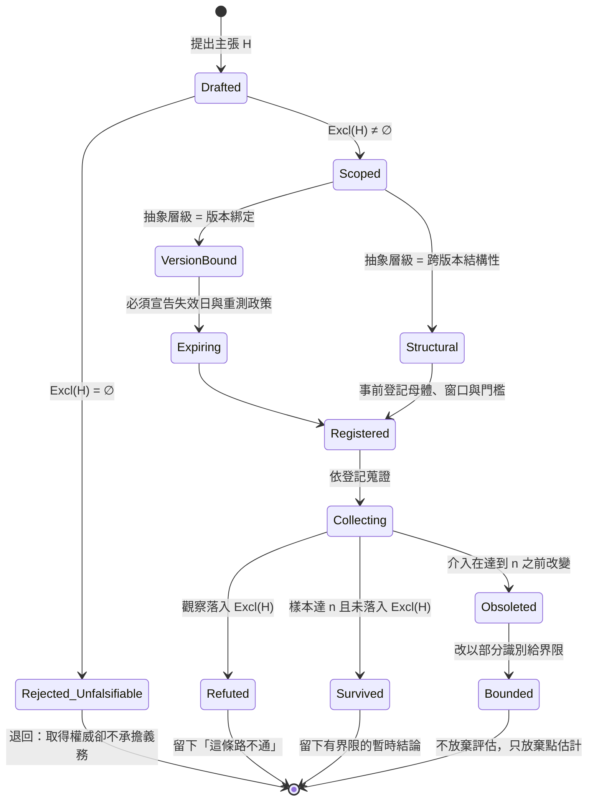

+++
title = "非定常下的可證偽契約：排除觀察集為空的主張、母體層證偽、部分識別界限與真實的外部入口"
date = "2026-09-14T14:25:08+08:00"
author = "梅乾"
draft = false
isCJKLanguage = true
description = "排除觀察集為空的主張能吸收一切反例，取得經驗描述的權威卻不承擔被推翻的義務。本文證明缺乏決定論因果不蘊涵不可證偽，非定常環境的本質後果是假說被淘汰而非被反駁；進而透過母體層檢定、部分識別界限與資料處理不等式，建立嚴格的六欄位可反駁性契約。"
tags = [
    "分析論述", # term:AnalyticalEssay
    "可證偽性", # term:Falsifiability
    "非定常", # term:Nonstationarity
    "自我封閉", # term:SelfSealingClaim
    "事前登記", # term:PreRegistration
    "部分識別", # term:PartialIdentification
    "排除觀察集", # term:ExcludedObservationSet
  ]
series = ["可失敗性工程：從拒絕算子、成本位移到驗證獨立性與可證偽契約"]
[ai_info]
    [ai_info.generation]
        model = "Claude Opus 5"
        agent = "Claude Code VSCode Extension 2.1.270"
    [ai_info.refinement]
        model = "Gemini 3.8 Flash"
        agent = "Antigravity IDE 2.5.5"
+++

<!--more-->

## 導言

一份技術分析的草稿裡出現了這樣一句話：這個領域缺乏產出層的對照研究，而且因為介入本身不斷改變，短期內也不會有。

這句話有幾個好性質。它承認侷限，語氣謙遜；它給出了理由，不是空口斷言；它與該草稿其餘部分的論證方向一致，讀起來毫無違和。它也通過了多輪精煉與作者自己的審視。

它是錯的。實際去查之後，該領域有針對資深開發者的對照試驗，有跨組織的交付穩定性資料，有大規模的程式碼層指標——而且多數結論並不站在樂觀敘事那一側。

值得追問的不是「為什麼會弄錯一個事實」。單一事實錯誤很平常，而且通常會被某個環節攔下。值得追問的是：**這句話為什麼沒有被任何環節攔下？**

答案在它的結構裡，而且可以寫得很精確。它不預測任何可觀測事件——「短期內不會有」沒有兌現日，「缺乏」沒有界定門檻。因此沒有任何觀察能夠推翻它。更糟的是它的第二層效果：**一句宣稱證據不存在的話，同時取消了尋找證據的動機。** 錯誤因此自我維持。

而這句話裡確實包含一個值得認真對待的成分：介入本身在改變。這一點是真的，而它正是本文要處理的核心難題——**當被研究的東西在研究期間持續變化時，還能不能做出可被推翻的宣稱？**

---

## 分析

### 排除觀察集為空：一個主張如何取得權威而不承擔義務

先把**可證偽性**（Falsifiability） <!-- term:Falsifiability -->寫成集合語言，因為「要可證偽」這種說法無法被驗收。

> [!IMPORTANT]
> **可證偽性** <!-- term:Falsifiability --> (Falsifiability): 宣稱必須事先指明何種觀測結果會推翻它；缺乏反駁條件的評估無法構成證據。 <!-- anchor:Falsifiability -->


設觀察空間為 $\Omega$（所有可能被觀測到的結果）。一個主張 $H$ 的**排除觀察集**（Excluded Observation Set） <!-- term:ExcludedObservationSet -->定義為

> [!IMPORTANT]
> **排除觀察集** <!-- term:ExcludedObservationSet --> (Excluded Observation Set): 給定假說下，邏輯上蘊涵該假說為假的所有可能觀察結果集合；其非空為可證偽性之充要條件。 <!-- anchor:ExcludedObservationSet -->


$$\mathrm{Excl}(H) = \{\, o \in \Omega \;:\; o \Rightarrow \lnot H \,\}$$

也就是「哪些觀察結果一旦出現，就推翻這個主張」。於是可證偽性 <!-- term:Falsifiability -->有了操作型定義：

$$H \text{ 可證偽} \iff \mathrm{Excl}(H) \neq \varnothing$$

那句錯誤斷言的問題現在可以精確表述：$\mathrm{Excl}(H) = \varnothing$。「短期內不會有」沒有給出任何一個能推翻它的觀察——任何一項被舉出的研究都可以被回應為「那項不夠嚴謹」「樣本不足」「介入已經改變」。

這正是**自我封閉**（Self-Sealing Claim） <!-- term:SelfSealingClaim -->的結構：每一個反例都能被一個輔助假說吸收，而吸收不需要修改主張本身。形式上，主張從 $H$ 變成 $H \wedge A_1 \wedge A_2 \wedge \cdots$，而輔助假說的供給無限。[Popper，1963 / 《Conjectures and Refutations》](https://doi.org/10.4324/9780203538074) 的核心判準正是針對這個結構：一個理論的科學地位不在於它能解釋多少，而在於它禁止什麼；能吸收一切觀察的理論，其經驗內容為零。

> [!IMPORTANT]
> **自我封閉** <!-- term:SelfSealingClaim --> (Self-Sealing Claim): 能吸收反例而不修改自身主張，因而逃避外部反駁的論證結構。 <!-- anchor:SelfSealingClaim -->


$\mathrm{Excl}(H) = \varnothing$ 的主張不會被任何檢查攔下——不是因為檢查失職，是因為**沒有東西可以檢查**。它以經驗描述的語氣出現，卻具備不可證偽的結構，因此它取得了經驗描述的權威而不承擔經驗描述的義務。

**因果機制**：可證偽性 <!-- term:Falsifiability -->與可檢查性等價；一個主張只有在它排除了某些可能觀察時，才可能被觀察推翻。排除集為空時，任何檢查程序的輸入都是空的。

**邊界條件**：某些主張本來就不必可證偽——定義、約定、價值宣示都是。問題不在不可證偽本身，而在於把不可證偽的句子當成經驗描述來使用。一句「我們把逾時上限定義為三秒」不需要排除任何觀察，因為它不描述世界，它規定世界。

**反例**：那句話自己。它把一個關於「研究難度」的真實觀察，膨脹成一個關於「證據不存在」的斷言，而膨脹的部分正好是不可證偽的那一半。這是最常見的形態——**真實的謹慎被擴寫成虛假的全稱**。

### 缺乏決定論因果不蘊涵不可證偽

處理完結構問題，接著要處理那句話裡值得認真對待的那一半。

第一層論證是這樣的：單一生成過程沒有因果帳可查，因此任何負面結果都有逃生口——提示寫得不好、換個工具就好、加上某種技巧就對了。每次失敗都被一個輔助假說吸收，而這裡的逃生口數量無限。

這一層是對的，但它推不出「不可證偽」。**「這枚硬幣是公正的」對任何單次擲出都沒有因果解釋，擲一千次照樣可以證偽。** 整個實證醫學也是這樣運作的：沒有人聲稱能解釋某一位病患為何好轉，而療效仍然可以被推翻。

缺乏決定論因果所蘊涵的，不是不可證偽，而是一個具體得多的結論：**證偽必須在母體層做，不能在個例層做。** 而母體層的證偽需要的東西是可以算出來的——樣本數。

對一個比例型主張（虛無假設 $p_0$，對立假設 $p_1$），在雙尾顯著水準 $\alpha$ 與檢定力 $1-\beta$ 下所需樣本數為

$$n \;=\; \frac{\left( z_{\alpha/2}\sqrt{p_0(1-p_0)} + z_{\beta}\sqrt{p_1(1-p_1)} \right)^2}{(p_1 - p_0)^2}$$

這個式子把「能不能證偽」從一個哲學問題變成一個預算問題：要偵測 0.50 到 0.55 的偏離，需要多少樣本？答案是一個具體的數字，而不是「這很難說」。

### 非定常才是真正的障礙——但障礙不是禁令

真正的障礙在別的地方，而且它是實質的：**介入在研究期間會改變。**

醫學試驗裡那顆藥三年都是同一顆。這裡不是。當被研究的處置本身在蒐證期間持續變化時，不同時點的觀測不能直接視為來自同一母體。這在**機器學習**（Machine Learning） <!-- term:MachineLearning -->的部署語境裡有成熟的處理框架：[Gama 等人，2014 / 《A Survey on Concept Drift Adaptation》](https://doi.org/10.1145/2523813) 系統性整理了 $P_t(y \mid x) \neq P_{t+\Delta}(y \mid x)$ 的偵測與適應方法，而其中最重要的一點是：**漂移的存在使「同一母體」這個前提需要被檢驗，而不是被假設。**

> [!IMPORTANT]
> **機器學習** <!-- term:MachineLearning --> (Machine Learning): 先界定可選函數的範圍，再以資料估計其中參數的建模方法。 <!-- anchor:MachineLearning -->


**非定常**（Nonstationarity） <!-- term:Nonstationarity -->的後果有一個容易被忽略的形態，值得單獨命名：**主張常常不是被反駁，而是被淘汰。**

> [!IMPORTANT]
> **非定常** <!-- term:Nonstationarity --> (Nonstationarity): 資料分布、介入方式或系統性質隨時間改變，使不同時點結果不可直接視為同一母體的狀態。 <!-- anchor:Nonstationarity -->


兩者的差別是資訊上的。反駁留下一條「這條路不通」——它是一筆可以累積、可以被後人引用、可以縮小搜尋空間的知識。淘汰什麼都不留：問題不是得到了否定的答案，是問題本身在得到答案之前就不再適用。一個領域若持續發生淘汰而少有反駁，它的知識存量不會增長，即使投入的研究量很大。

但障礙不是禁令，這一點必須講清楚，否則就回到了開頭那句話的錯誤。至少有三條出路：

**第一，提高主張的抽象層級。** 愈綁定特定版本的主張，愈容易被淘汰速度洗掉；而跨版本的結構性主張——例如「產出速率與系統健康**脫鉤**（Desynchronization） <!-- term:Desynchronization -->」「附帶會失敗之檢查的變更其回滾率較低」——不隨版本更替而失效，因此可測，而且已經被測了。這條出路的操作含義是：在寫下主張時就必須宣告它的抽象層級，並讓版本綁定的主張自帶失效日。

> [!IMPORTANT]
> **脫鉤** <!-- term:Desynchronization --> (Desynchronization): 中介索引檔與真實檔案系統狀態不再一致的現象，是雙重狀態同步最典型的故障表現。 <!-- anchor:Desynchronization -->


**第二，**事前登記**（Pre-Registration） <!-- term:PreRegistration -->。** [Nosek 等人，2018 / 《The Preregistration Revolution》](https://doi.org/10.1073/pnas.1708274114) 的核心論證是：把假設、量測與分析計畫在看到資料之前固定下來，可以把「事後找一個站得住的解釋」這條退路關掉。在非定常 <!-- term:Nonstationarity -->的環境裡它還有第二個作用——事前登記 <!-- term:PreRegistration -->的窗口定義使「漂移是否發生在窗口內」成為一個可查核的事實，而不是一個事後的辯詞。

> [!IMPORTANT]
> **事前登記** <!-- term:PreRegistration --> (Pre-Registration): 在觀測或實驗執行前預先凍結假設、度量指標與反駁門檻，防止事後調整假說以符合資料的科學契約。 <!-- anchor:PreRegistration -->


**第三，**部分識別**（Partial Identification） <!-- term:PartialIdentification -->。** [Manski，1990 / 《Nonparametric Bounds on Treatment Effects》](https://www.jstor.org/stable/2006627) 指出，當資料不足以點識別一個參數時，正確的反應不是放棄評估，而是給出**界限**：在不追加任何無法驗證的假設下，參數必然落在某個區間內。這條路徑直接反駁了「介入在變所以無法評估」——無法點識別不蘊涵無法設界，而一個界限同樣可以排除觀察，因此同樣可證偽。

> [!IMPORTANT]
> **部分識別** <!-- term:PartialIdentification --> (Partial Identification): 在資料不足以唯一確定目標量時，改為推導其所有可能取值的界限，而非給出單點估計。 <!-- anchor:PartialIdentification -->


下圖把主張從提出到裁決的完整路徑畫出來：



圖中 `Obsoleted → Bounded` 那條轉移是整張圖最重要的一條：**被淘汰不等於無話可說。** 放棄的是點估計，不是評估本身。

以下 POSIX shell 腳本把上述判準做成一個可執行的契約驗證器。它檢查六個欄位、攔截自我封閉 <!-- term:SelfSealingClaim -->句式、計算母體層所需樣本數、在漂移下裁決「可反駁」或「已淘汰」，並在無法點識別時給出界限。退出碼本身就是診斷。

```bash
#!/bin/sh
# 六欄位可反駁性契約驗證器（POSIX sh + awk，無外部相依）。
# 用途：在主張進入決策之前，攔下「不排除任何觀察」的句子。
# 執行：sh s8.sh        任一自檢失敗即以非零退出碼中止。

set -u
WORK=$(mktemp -d) || exit 90
trap 'rm -rf "$WORK"' EXIT

REQUIRED_FIELDS='CLAIM ABSTRACTION_LEVEL EXCLUDED_OBSERVATIONS POPULATION_WINDOW REFUTATION_THRESHOLD OBSOLESCENCE_POLICY'

# 自我封閉句式：這些措辭取得經驗描述的權威，卻不排除任何觀察。
SELF_SEALING='短期內不會有|尚無相關研究|無法評估|目前沒有證據|因故|基於某些原因|不夠嚴謹|樣本不足'

field_value() {
    # $1 = 檔案, $2 = 欄位名
    sed -n "s/^$2:[[:space:]]*//p" "$1" | head -n 1
}

# 退出碼即診斷：1 缺欄位 / 2 排除集為空 / 3 自我封閉 / 4 門檻不可量測
# 5 母體與窗口未界定 / 6 版本綁定卻無淘汰處置
validate_contract() {
    file=$1
    for f in $REQUIRED_FIELDS; do
        if ! grep -q "^$f:" "$file"; then
            printf '缺少欄位 %s\n' "$f" >&2
            return 1
        fi
        v=$(field_value "$file" "$f")
        if [ -z "$v" ]; then
            printf '欄位 %s 為空\n' "$f" >&2
            return 1
        fi
    done

    excl=$(field_value "$file" EXCLUDED_OBSERVATIONS)
    case "$excl" in
        none|NONE|無|-)
            printf '排除觀察集為空：此主張不可證偽\n' >&2
            return 2 ;;
    esac

    if printf '%s' "$(cat "$file")" | grep -Eq "$SELF_SEALING"; then
        printf '偵測到自我封閉句式：反例可被吸收而不修改主張\n' >&2
        return 3
    fi

    thr=$(field_value "$file" REFUTATION_THRESHOLD)
    # 門檻必須同時具備比較運算子與數值，且應為區間而非點估計。
    if ! printf '%s' "$thr" | grep -Eq '(<=|>=|<|>|∈)'; then
        printf '反駁門檻缺少比較運算子：%s\n' "$thr" >&2
        return 4
    fi
    if ! printf '%s' "$thr" | grep -Eq '[0-9]'; then
        printf '反駁門檻缺少數值：%s\n' "$thr" >&2
        return 4
    fi

    pw=$(field_value "$file" POPULATION_WINDOW)
    if ! printf '%s' "$pw" | grep -Eq 'n[[:space:]]*=[[:space:]]*[0-9]+'; then
        printf '母體未界定樣本數：%s\n' "$pw" >&2
        return 5
    fi
    if ! printf '%s' "$pw" | grep -Eq '[0-9]{4}-[0-9]{2}-[0-9]{2}'; then
        printf '量測窗口未界定起訖日期：%s\n' "$pw" >&2
        return 5
    fi

    lvl=$(field_value "$file" ABSTRACTION_LEVEL)
    pol=$(field_value "$file" OBSOLESCENCE_POLICY)
    if [ "$lvl" = "version-bound" ]; then
        if ! printf '%s' "$pol" | grep -Eq 'expire|重測|失效日'; then
            printf '版本綁定主張必須宣告淘汰處置：%s\n' "$pol" >&2
            return 6
        fi
    fi
    return 0
}

# ---- 母體層檢定力：缺乏決定論因果不蘊涵不可證偽 ----
required_n() {
    # $1 = 對立假設下的比例, $2 = 虛無假設比例, $3 = 檢定力
    awk -v p1="$1" -v p0="$2" -v power="$3" 'BEGIN {
        za = 1.959964                     # 雙尾 alpha = 0.05
        zb = (power == 0.8) ? 0.841621 : 1.281552
        num = za * sqrt(p0 * (1 - p0)) + zb * sqrt(p1 * (1 - p1))
        n = (num * num) / ((p1 - p0) * (p1 - p0))
        printf "%d", int(n) + 1
    }'
}

# ---- 非定常：介入在蒐證完成前改變，主張被淘汰而非被反駁 ----
verdict_under_drift() {
    # $1 = 所需樣本數, $2 = 漂移發生前可得樣本數
    awk -v need="$1" -v avail="$2" 'BEGIN {
        if (avail >= need) print "refutable";          # 留下「這條路不通」
        else print "obsoleted";                        # 什麼都不留
    }'
}

# ---- 部分識別：無法點識別時給界限，而非放棄 ----
manski_bounds() {
    # $1 = 已觀測子群的結果均值, $2 = 已觀測比例（其餘結果未知，落在 [0,1]）
    awk -v m="$1" -v q="$2" 'BEGIN {
        lo = m * q + 0 * (1 - q)
        hi = m * q + 1 * (1 - q)
        printf "[%.4f, %.4f]", lo, hi
    }'
}

# ================= 自檢 =================
fail=0
expect_code() {
    # $1 = 檔案, $2 = 期望退出碼, $3 = 說明
    validate_contract "$1" 2>"$WORK/err"
    got=$?
    if [ "$got" -ne "$2" ]; then
        printf 'FAIL  %s：期望退出碼 %s，實得 %s\n' "$3" "$2" "$got" >&2
        fail=1
    else
        printf 'PASS  退出碼 %s  %s' "$got" "$3"
        if [ "$got" -ne 0 ]; then printf '  ← %s\n' "$(cat "$WORK/err")"; else printf '\n'; fi
    fi
}

cat > "$WORK/good.contract" <<'EOF'
CLAIM: 在既有服務的變更流程中，附帶會失敗之檢查的提交，其上線後回滾率低於未附帶者
ABSTRACTION_LEVEL: cross-version-structural
EXCLUDED_OBSERVATIONS: 兩組回滾率差異的 95% 信賴區間完全落在 0 的兩側之外且方向相反，即推翻本主張
POPULATION_WINDOW: 同一組織全部服務之提交，n = 4200，2026-01-01 至 2026-06-30
REFUTATION_THRESHOLD: 差異比值 ∈ [0.95, 1.05] 視為無效果；>= 1.05 視為反向
OBSOLESCENCE_POLICY: 若流程工具鏈於窗口內更換，本主張標記為 obsoleted 並重測，不得沿用結論
EOF

cat > "$WORK/no_excl.contract" <<'EOF'
CLAIM: 新流程改善了整體品質
ABSTRACTION_LEVEL: cross-version-structural
EXCLUDED_OBSERVATIONS: none
POPULATION_WINDOW: 全部團隊，n = 300，2026-02-01 至 2026-05-01
REFUTATION_THRESHOLD: 改善幅度 >= 5%
OBSOLESCENCE_POLICY: 重測
EOF

cat > "$WORK/sealing.contract" <<'EOF'
CLAIM: 此領域缺乏產出層的對照研究，而且因為介入本身不斷改變，短期內不會有
ABSTRACTION_LEVEL: cross-version-structural
EXCLUDED_OBSERVATIONS: 若出現高品質對照研究則修正
POPULATION_WINDOW: 公開文獻，n = 50，2024-01-01 至 2026-09-01
REFUTATION_THRESHOLD: 對照研究數 >= 3
OBSOLESCENCE_POLICY: 重測
EOF

cat > "$WORK/vague.contract" <<'EOF'
CLAIM: 附帶檢查的提交品質較好
ABSTRACTION_LEVEL: cross-version-structural
EXCLUDED_OBSERVATIONS: 回滾率無顯著差異即推翻
POPULATION_WINDOW: 全部提交，n = 4200，2026-01-01 至 2026-06-30
REFUTATION_THRESHOLD: 明顯較好
OBSOLESCENCE_POLICY: 重測
EOF

cat > "$WORK/versioned.contract" <<'EOF'
CLAIM: 目前這一版工具在本專案的重構任務上通過率高於前一版
ABSTRACTION_LEVEL: version-bound
EXCLUDED_OBSERVATIONS: 通過率差異的信賴區間涵蓋 0 即推翻
POPULATION_WINDOW: 重構任務，n = 180，2026-07-01 至 2026-08-31
REFUTATION_THRESHOLD: 通過率差 <= 0.02 視為無差異
OBSOLESCENCE_POLICY: 沿用結論
EOF

printf '契約驗證（退出碼即診斷）\n'
expect_code "$WORK/good.contract"      0 '完整契約'
expect_code "$WORK/no_excl.contract"   2 '排除觀察集為空'
expect_code "$WORK/sealing.contract"   3 '自我封閉句式'
expect_code "$WORK/vague.contract"     4 '門檻不可量測'
expect_code "$WORK/versioned.contract" 6 '版本綁定卻沿用結論'

printf '\n母體層檢定力（缺乏決定論因果 ≠ 不可證偽）\n'
n80=$(required_n 0.55 0.50 0.8)
n90=$(required_n 0.55 0.50 0.9)
printf '  偵測 0.50 → 0.55 的偏離：80%% 檢定力需 n = %s；90%% 檢定力需 n = %s\n' "$n80" "$n90"
[ "$n80" -gt 700 ] && [ "$n80" -lt 900 ] || { printf 'FAIL  n(80%%) 落在預期區間外：%s\n' "$n80" >&2; fail=1; }
[ "$n90" -gt "$n80" ] || { printf 'FAIL  更高檢定力應需要更大樣本\n' >&2; fail=1; }

printf '\n非定常下的裁決（反駁留下資訊，淘汰什麼都不留）\n'
for avail in 1200 400; do
    v=$(verdict_under_drift "$n80" "$avail")
    printf '  所需 n = %s，漂移前可得 %s → %s\n' "$n80" "$avail" "$v"
done
[ "$(verdict_under_drift "$n80" 1200)" = refutable ] || { printf 'FAIL  樣本充足時應可反駁\n' >&2; fail=1; }
[ "$(verdict_under_drift "$n80" 400)"  = obsoleted ] || { printf 'FAIL  樣本不足時應判為淘汰\n' >&2; fail=1; }

printf '\n部分識別界限（無法點識別時給界限，而非宣稱無法評估）\n'
b=$(manski_bounds 0.62 0.70)
printf '  已觀測子群均值 0.62、觀測比例 0.70 → 母體均值界限 %s\n' "$b"
printf '%s' "$b" | grep -q '^\[0.4340, 0.7340\]$' || { printf 'FAIL  界限計算不符預期：%s\n' "$b" >&2; fail=1; }

if [ "$fail" -ne 0 ]; then
    printf '\n自驗證失敗。\n' >&2
    exit 1
fi
printf '\n自驗證通過：六欄位攔截、退出碼診斷、母體層檢定力、非定常裁決與部分識別界限斷言全部成立。\n'
```

執行結果把五類失效各自對應到一個退出碼。完整契約通過（退出碼 0）；排除觀察集 <!-- term:ExcludedObservationSet -->寫成 `none` 的契約被以退出碼 2 攔下，診斷是「此主張不可證偽」；**那句原始的錯誤斷言被逐字放進契約後，以退出碼 3 被攔下**，診斷是「反例可被吸收而不修改主張」；門檻寫成「明顯較好」的契約以退出碼 4 被攔下，因為它缺少比較運算子；而一個版本綁定卻宣告「沿用結論」的契約以退出碼 6 被攔下，因為它沒有淘汰處置。

母體層檢定力的計算給出具體數字：要偵測 0.50 到 0.55 的偏離，80% 檢定力需要 $n = 783$，90% 檢定力需要 $n = 1047$。**「這很難證偽」在此變成「這需要 783 個樣本」**——一個可以被排進預算、可以被討論值不值得的數字。

非定常 <!-- term:Nonstationarity -->的裁決同樣可算：所需 $n = 783$，若漂移前可得 1200 個樣本則判為 `refutable`（可反駁，結果會留下資訊）；若只有 400 個則判為 `obsoleted`（已淘汰，什麼都不留）。而部分識別 <!-- term:PartialIdentification -->的界限給出了淘汰之後仍然可說的話：已觀測子群均值 0.62、觀測比例 0.70 時，母體均值必然落在 $[0.4340, 0.7340]$——這個區間不追加任何無法驗證的假設，而且它本身排除了觀察（任何落在區間外的真值都推翻它），因此**它是可證偽的**。

下表以具體的主張走一遍判定與處置：

| 邊界輸入案例 | 關鍵判定條件 / **不變式**（Invariant） <!-- term:Invariant --> | 狀態轉移 | 最終處置結果 |
| :--- | :--- | :--- | :--- |
| 「此領域缺乏對照研究，短期內也不會有」 | 含自我封閉 <!-- term:SelfSealingClaim -->句式；無兌現日、無門檻 | `Drafted` → `Rejected_Unfalsifiable` | 退出碼 3；不得作為經驗描述使用 |
| 「新流程改善了整體品質」，排除集 `none` | $\mathrm{Excl}(H) = \varnothing$ | `Drafted` → `Rejected_Unfalsifiable` | 退出碼 2；須補寫「什麼觀察會推翻它」 |
| 「附帶檢查的提交品質較好」，門檻「明顯較好」 | 門檻缺比較運算子與數值 | `Scoped` → `Rejected` | 退出碼 4；門檻須為可量測的區間 |
| 「本版工具通過率高於前版」，抽象層級 = 版本綁定，政策「沿用結論」 | 版本綁定必須宣告失效日或重測 | `VersionBound` → `Rejected` | 退出碼 6；版本綁定主張不得無限期沿用 |
| 完整契約：跨版本結構性、界限式門檻、n 與窗口齊備 | 六欄位齊全且門檻可量測 | `Drafted` → `Registered` | 退出碼 0；進入蒐證 |
| 偵測 0.50 → 0.55，要求 80% 檢定力 | $n = \left(z_{\alpha/2}\sqrt{p_0 q_0} + z_\beta\sqrt{p_1 q_1}\right)^2/(p_1-p_0)^2$ | `Registered` → `Collecting` | $n = 783$；預算問題而非哲學問題 |
| 漂移前可得 1200 個樣本 | $1200 \ge 783$ | `Collecting` → `Refuted` 或 `Survived` | 留下「這條路通/不通」 |
| 漂移前只有 400 個樣本 | $400 < 783$ | `Collecting` → `Obsoleted` | 改走部分識別 <!-- term:PartialIdentification -->，不放棄評估 |
| 已觀測子群均值 0.62、觀測比例 0.70 | 未觀測部分落在 $[0,1]$ | `Obsoleted` → `Bounded` | 界限 $[0.4340, 0.7340]$；仍然可證偽 |

> [!IMPORTANT]
> **不變式** <!-- term:Invariant --> (Invariant): 系統在任何合法狀態下都必須成立的斷言，是把評估規則寫成可執行檢查的基本單位。 <!-- anchor:Invariant -->


下表把契約層的五組現象拆成四個維度：

| 表面讀數 / 現象 | 底層認識論病灶 | 舊代脆弱做法 | 新代嚴格工程防線 |
| :--- | :--- | :--- | :--- |
| 主張語氣謙遜、承認侷限、給了理由 | 謙遜的措辭掩蓋了 $\mathrm{Excl}(H) = \varnothing$ | 以語氣謹慎推論陳述可靠 | 對每句經驗描述要求排除觀察集 <!-- term:ExcludedObservationSet -->；為空者退回 |
| 「這個領域無法做對照研究」 | 把「難」膨脹為「不可能」，並取消尋找動機 | 接受並停止查證 | 改寫為「已執行的檢索與其邊界」：查了哪些來源、用了哪些檢索詞、得到什麼、哪裡沒查 |
| 每個反例都被解釋掉 | 輔助假說供給無限，經驗內容為零 | 逐一回應反例 | 事前登記 <!-- term:PreRegistration -->假設與分析計畫，關掉事後找解釋的退路 |
| 「介入一直在變，所以無法評估」 | 混淆「無法點識別」與「無法設界」 | 放棄**量化**（Quantization） <!-- term:Quantization -->，改以敘事判斷 | 部分識別 <!-- term:PartialIdentification -->給界限；界限同樣排除觀察，同樣可證偽 |
| 研究投入很大但知識沒有累積 | 持續發生淘汰而少有反駁，資訊增量為零 | 加碼投入同一層級的版本綁定研究 | 主張抽象層級升格為跨版本結構性；版本綁定者自帶失效日 |

> [!IMPORTANT]
> **量化** <!-- term:Quantization --> (Quantization): 以較少位元表示權重或啟動值，改變數值格點以降低記憶體與計算成本的近似方法。 <!-- anchor:Quantization -->


**因果機制**：可證偽性 <!-- term:Falsifiability -->依賴主張的抽象層級——愈綁定特定版本的主張，愈容易在達到所需樣本數之前被淘汰速度洗掉；而淘汰的資訊增量為零。

**邊界條件**：這一整套只影響**經驗主張**。機制論證的正當用法不是預測，而是**佈署判準**：一個說「這條路徑上沒有任何東西會拒絕」的論證，就算沒有產出資料也可以行動，因為它直接指出該去那裡裝一個。把機制論證與經驗主張混用，會在兩個方向上都出錯。

**反例**：把障礙誇大成禁令。那句原始斷言正是這樣——它從「非定常 <!-- term:Nonstationarity -->使評估困難」這個真實觀察，跳到「證據不存在且不會存在」這個不可證偽的全稱，而跳躍的部分就是本文攔截的對象。

---

## 反思

第一個值得處理的是「信任該依據什麼分配」。如果表面品質不再攜帶製作過程的資訊，那麼可分配信任的依據只剩一種：**產物之外有什麼在檢查它。** 被獨立檢查覆蓋的部分可以少看，沒有被覆蓋的部分無論寫得多好都要看。這個判準的好處是它可查證——「這一段有沒有被測試覆蓋」有明確答案，而「這一段看起來可不可靠」沒有。

第二點更根本：**真實從哪裡進入一份產物？** 答案是從系統沒有撰寫的東西的接觸面——正式流量、真實使用者、實體量測、對手、一個會回嘴的既有系統。而這裡有一個資訊論上的硬限制值得指出：若把「現實」視為隨機變數 $Y$，產物視為 $X$，則任何僅依賴 $X$ 的後處理 $g(X)$ 都滿足資料處理不等式

$$I(g(X); Y) \le I(X; Y)$$

也就是說，**任何不接觸外部的加工都不可能增加產物中關於現實的資訊量**——它只可能持平或減少。潤飾、重組、精煉、互審、重新表述，全部落在這條不等式的左邊。

這給了「撰寫」與「核可」之間的差別一個精確的表述。當一個人真正撰寫時，他把自己腦中關於現實的資訊注入 $X$，$I(X;Y)$ 上升；當他只是核可時，$X$ 已經產生，核可是 $X$ 的函數，注入量為零。**一份產物裡含有多少現實，等於其中有多少是人真的寫下的，而不是人核可的。** 這是把撰寫換成核可的工作流最深的代價：它不改變產物的形狀，只改變產物裡有多少東西曾經接觸過現實。

第三點是一個令人不適的自指。本文提出了一個檢驗：一個框架能吸收多少反例而不修改自身？這個檢驗適用於本文。本文的各節互相支持、每個新觀察都能被納入而無需放棄任何前提——這正是需要警惕的形狀，而不是正確的證據。從內部無法分辨兩者，因為局部檢查看不到全域問題。唯一的出路是外部的、可能失敗的檢定：本文的每一條數值主張都來自一段可以被重新執行的程式碼，每一個文獻指涉都指向一個可以被點開的識別碼。**這兩者都不依賴讀者對作者的信任，而這正是重點。**

最後，開頭那句話為什麼能被發現？不是因為有人想得更透徹，而是因為**有人去查了**。這是整篇文章最不優雅也最重要的結論：連貫可以自我生產，真實不能。

---

## 實務對比

**其一：對自身證據狀態的宣稱**

錯誤的作法是寫下「此領域尚無相關研究」或「短期內不會有」。這類句子聽起來謹慎，實際上不排除任何觀察，因此不可證偽；而且它取消了尋找的動機，使錯誤自我維持。

正確的作法是寫下**已執行的檢索與其邊界**：查了哪些來源、用了哪些檢索詞、得到什麼、還有哪裡沒查。前者是姿態，後者是可被推翻的紀錄——任何人只要找到一項你沒查到的研究，就推翻了它。這正是它有價值的原因。

**其二：非定常 <!-- term:Nonstationarity -->環境下的評估**

錯誤的作法是因為「介入一直在變」而放棄量化 <!-- term:Quantization -->評估，改以敘事判斷。這在形式上等於把不可證偽性 <!-- term:Falsifiability -->當成一種謙遜。

正確的作法分三步：把主張的抽象層級升格到跨版本結構性（並讓版本綁定的主張自帶失效日）、事前登記 <!-- term:PreRegistration -->母體定義與量測窗口（使「漂移是否發生在窗口內」成為可查核的事實）、在樣本不足以點識別時給出界限而非放棄。界限同樣排除觀察，因此同樣是一個可以被推翻的宣稱。

**其三：信任的分配依據**

錯誤的作法是依產物的表面品質分配信任——寫得整齊、論證連貫、術語一致就少看幾眼。連貫可以自我生產，因此它不是關於真實的資訊。

正確的作法是依**驗證覆蓋**（Verification Coverage） <!-- term:VerificationCoverage -->分配信任，並把「這一段的現實從哪裡來」當成可稽核的欄位：哪些部分被獨立檢查覆蓋、哪些部分由人真正撰寫並帶著外部查證、哪些部分只是被核可。第三類無論寫得多好都要看，因為依資料處理不等式，核可不曾為它注入任何關於現實的資訊。

> [!IMPORTANT]
> **驗證覆蓋** <!-- term:VerificationCoverage --> (Verification Coverage): 產物中已有獨立、可重複檢查機制保護的範圍與程度。 <!-- anchor:VerificationCoverage -->


---

## 結論

一個不排除任何觀察的主張，取得了經驗描述的權威而不承擔經驗描述的義務——而它不會被任何檢查攔下，因為沒有東西可以檢查。

由此得到三個可遷移的判斷。第一，可證偽性 <!-- term:Falsifiability -->有操作型定義：排除觀察集 <!-- term:ExcludedObservationSet -->非空。撰寫時最該自我盤查的，正是那些聽起來謙遜、給了理由、卻不預測任何可觀測事件的句子；而它們最壞的效果不是講錯，是讓人不去找。第二，缺乏決定論因果不蘊涵不可證偽，它只蘊涵證偽要在母體層做——而母體層的證偽是一個樣本數問題，本文的模型算出偵測 0.50 到 0.55 的偏離需要 783 個樣本；真正的障礙是非定常 <!-- term:Nonstationarity -->，其後果是主張被淘汰而非被反駁，而淘汰的資訊增量為零。第三，障礙不是禁令：提高主張的抽象層級、事前登記 <!-- term:PreRegistration -->量測窗口、以部分識別 <!-- term:PartialIdentification -->給出界限，三者都能在介入持續改變的情況下產生可被推翻的宣稱——放棄的是點估計，不是評估本身。

而最後一條是資訊論給的：任何不接觸外部的加工都不會增加產物中關於現實的資訊量。因此判斷一份產物含有多少現實，等於判斷其中有多少是人真的寫下的，而不是人核可的。