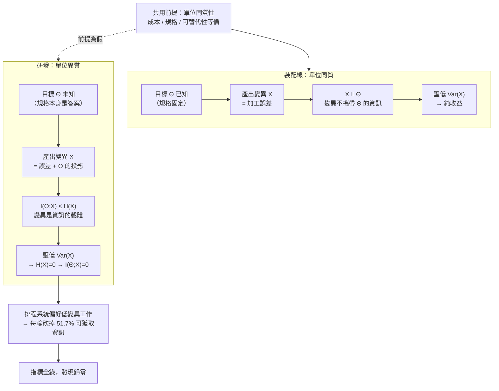

+++
title = "單位同質性：四條管理槓桿共用的那一個未檢前提，與變異為零時的資訊上界"
date = "2026-09-14T09:40:01+08:00"
author = "梅乾"
draft = false
isCJKLanguage = true
description = "探討研發團隊指標全綠但交付週期反常拉長的根本成因，形式化證明四條製造業管理槓桿共用「單位同質且可重複」假設，並推導變異為零時資訊增益為零的理論極限。"
tags = [
    "分析論述", # term:AnalyticalEssay
    "研發流程", # term:RDProcess
    "可重複性前提", # term:RepeatabilityPremise
    "充分統計量", # term:SufficientStatistic
    "資訊增益", # term:InformationGain
    "度量設計", # term:MetricDesign
    "單位同質性", # term:UnitHomogeneity
  ]
series = ["進不了控制迴路的量：研發治理中的可重複性前提、流動守恆與文字效力"]
[ai_info]
    [ai_info.generation]
        model = "Claude Opus 5"
        agent = "Claude Code VSCode Extension 2.1.270"
    [ai_info.refinement]
        model = "Gemini 3.8 Flash"
        agent = "Antigravity IDE 2.5.5"
+++

<!--more-->

## 導言

有一種團隊的儀表板全部是綠的。每個人的行事曆被排到九成五以上，沒有人閒著；每一份交付物都通過規範檢查，沒有例外；每週的完成項目數穩定成長；流程文件統一、命名統一、產出格式統一。四個管理動作全部到位，而交付週期在同一段期間裡持續拉長。

這個組合難以解釋，因為它不是「做錯了某件事」的形狀。它是「做對了四件事，然後結果是反的」的形狀。從這個結果回推，最省力的假設是這四個動作裡有一個被執行錯了——但逐一檢查會發現四個動作各自都執行得很標準。標準到可以寫進教科書，因為它們本來就寫在教科書裡。

回推再往下一層，會撞上一件更值得注意的事：**這四個動作不是四條獨立的建議，它們共用同一個前提**。把人排滿之所以正確、壓低變異之所以正確、計數產出之所以正確、標準化產品之所以正確，全部建立在同一個關於「工作單位」的假設上。那個假設在裝配線上為真，而它在設計未曾存在的東西時為假。

這個前提從來沒有被寫在任何一份管理文件裡。原因不是有人刻意隱藏，而是在它成立的那個環境裡，它太明顯以至於不需要被說出來。當這套做法被搬到另一個環境時，被搬走的是四條可執行的動作，留在原地的是那個沒有被說出口的條件。

本文要做的事是把那個條件挖出來、寫成可檢查的形式，並證明一件更強的結果：**當工作單位的變異被壓到零時，這批工作能夠提供的**資訊增益**（Information Gain） <!-- term:InformationGain -->恰好是零，不是很少，是恰好為零。** 這使得「壓低變異」在研發情境下不是一個效果打折的做法，而是一個把產出價值直接歸零的做法。

> [!IMPORTANT]
> **資訊增益** <!-- term:InformationGain --> (Information Gain): 系統在觀測到新資料或實驗結果後，不確定性（熵）減少的程度；變異為零意味著無法從中取得任何資訊增益。 <!-- anchor:InformationGain -->


---

## 分析

### 四條槓桿的共同前提，以及它失效時的符號反轉

先把四個動作與它們各自的正當性理由攤開，因為正當性理由才是真正被搬運的東西。

裝配線的管理邏輯有一個明確的起點：每一個從產線下來的單位應該長得一模一樣。這個起點推導出四條後果。第一，既然每個單位的加工時間可預測，閒置的產能就是純粹的浪費，因此把工站排滿是美德。第二，既然每個單位都該一樣，任何偏差都是缺陷，因此壓低變異是品質工程的核心。第三，既然單位彼此可互換，數清楚做了幾個就完整描述了產出，因此計數是有效的績效度量。第四，既然單位規格固定，標準化產品本身就是降低成本的手段。

四條全部從同一個起點出發。這個起點值得一個名字：**單位同質性**（Unit Homogeneity） <!-- term:UnitHomogeneity -->——同一批工作中的每一個單位在成本、規格與可替代性上彼此等價。

> [!IMPORTANT]
> **單位同質性** <!-- term:UnitHomogeneity --> (Unit Homogeneity): 各工作單位在複雜度、資訊量與所需心智投入上實質相同的性質；缺乏此性質時，直接平均與加總將產生推論謬誤。 <!-- anchor:UnitHomogeneity -->


研發的工作單位不滿足這個條件，而且不滿足的理由是結構性的：可重複的部分早就被自動化吸收了。當一段工作變得完全可預測時，它會被寫成腳本、樣板或遷移工具，於是它離開了需要人做判斷的那一類。**留在人手上的，按定義是尚未被重複過的那些。** 這個**篩選**（Screening） <!-- term:Screening -->機制持續運作，因此研發工作的異質性不會隨時間收斂，反而會隨自動化程度上升而加深。

> [!IMPORTANT]
> **篩選** <!-- term:Screening --> (Screening): 在訊號機制失效時，由驗證方主動設計具分離特性的測試或契約以檢驗產物真實能力的機制。 <!-- anchor:Screening -->


這一區分不是新的。經濟學上對「例行任務」與「非例行任務」的區分有明確的實證刻畫：[Autor、Levy 與 Murnane，2003 / 《The Skill Content of Recent Technological Change》](https://doi.org/10.1162/003355303322552801) 指出可被明確規則描述的任務會被機器吸收，而需要在規則之外做判斷的任務留給人。管理邏輯的原始出處同樣寫得很清楚：[Taylor，1911 / 《The Principles of Scientific Management》](https://www.gutenberg.org/ebooks/6435) 的整套方法建立在「同一件事被重複做很多次，因此存在一個可被事先決定的最佳方法」之上。

前提失效之後，四條槓桿不是效果打折，而是符號反轉。下表把四者並置，第三欄是前提失效的具體形式。

| 管理槓桿 | 在同質單位下為何正確 | 前提失效的具體形式 | 失效後的實際效果 |
| :--- | :--- | :--- | :--- |
| 把產能排滿 | 加工時間可預測，閒置即浪費 | 工作耗時本身是隨機變數 | 沒有餘裕吸收變異，等待時間非線性上升 |
| 壓低變異 | 偏差即缺陷 | 變異是產出所攜帶的資訊本身 | 系統性地淘汰掉帶新資訊的工作 |
| 以完成件數計量 | 單位可互換，計數是**充分統計量**（Sufficient Statistic） <!-- term:SufficientStatistic --> | 單位價值分佈重尾 | 計數幾乎不攜帶總價值的資訊 |
| 標準化產品 | 規格固定，重複生產同一物 | 每次產出的規格本身就是問題的答案 | 只能標準化流程，標準化產出等於禁止解答 |

> [!IMPORTANT]
> **充分統計量** <!-- term:SufficientStatistic --> (Sufficient Statistic): 在統計推論中，能夠完整包含樣本中關於未知參數所有資訊的統計量；當單位異質時，計數不再構成產出的充分統計量。 <!-- anchor:SufficientStatistic -->


四條在第二欄全部成立，在第四欄全部反向。而第二條特別難被察覺，因為它偽裝成品質。接下來兩節分別處理第三條與第二條，因為它們各有一個可以被算出來的結果。

**因果機制**：四條槓桿共用單位同質性 <!-- term:UnitHomogeneity -->這一個前提；前提是連言的合取項，因此它一旦為假，四條的正當性同時失去支撐，而非逐條退化。

**邊界條件**：研發活動內部並非全部異質。樣板套用、格式轉換、版本遷移、既有模式的機械複製，這些單位確實可互換。對這一半工作，四條槓桿全部成立且應該被使用。問題不在使用這些槓桿，在於**不分辨施用對象**。

**反例**：一個團隊把「壓低交付週期變異」列為季度目標，並據此優先處理估時最穩定的工作項。三個月後估時準確度顯著改善，而該期間沒有任何一個困難問題被解決——所有困難問題都因為估時不穩而被排到後面。目標達成，目標所代表的東西沒有。

### 計數何時是充分統計量：一個可以被算出來的判準

「以完成件數衡量產出」這條槓桿有一個精確的統計學名字，而它給出一個可檢查的判準。

設一批工作包含 $n$ 個單位，第 $i$ 個單位的價值為隨機變數 $V_i$，總價值為 $T=\sum_{i=1}^{n} V_i$。問題是：知道 $n$ 之後，關於 $T$ 還剩下多少**不確定性**（Uncertainty） <!-- term:Uncertainty -->？

> [!IMPORTANT]
> **不確定性** <!-- term:Uncertainty --> (Uncertainty): 估計值因抽樣與執行變異而帶有的波動範圍，是判定分數差異是否顯著的前提。 <!-- anchor:Uncertainty -->


形式化的答案由充分統計量 <!-- term:SufficientStatistic -->給出。若統計量 $n$ 對 $T$ 是**充分統計量** <!-- term:SufficientStatistic -->，則在給定 $n$ 的條件下 $T$ 的條件分佈退化，$n$ 已窮盡樣本中關於 $T$ 的全部資訊。這個概念的原始定義來自 [Fisher，1922 / 《On the Mathematical Foundations of Theoretical Statistics》](https://doi.org/10.1098/rsta.1922.0009)。實務上可直接用一個比值檢查：

$$
R \;=\; \frac{\mathbb{E}\big[\operatorname{Var}(T \mid n)\big]}{\operatorname{Var}(T)}
$$

$R=0$ 代表件數完全決定總價值，計數是有效的度量；$R\to 1$ 代表件數幾乎不攜帶總價值的資訊，計數是一個空的讀數。這個比值可以被實際量出來，而不需要任何理論爭論。

下面這段程式對兩種母體各跑四千個批次：同質母體中每個單位價值恆為 1，異質母體中單位價值服從尾部指數 1.3 的帕累托分佈。第二部分量測「單位熵」，用來檢驗下一節的主張；第三部分量測「系統性偏好低變異工作」要付出的資訊代價。全部只用 Python 標準函式庫。

```python
"""單位同質性決定『計數』是否為充分統計量；變異為零時可獲取的資訊量恰為零。"""
import math, random

random.seed(20260914)

def entropy_bits(samples, lo, hi, buckets=16):
    """在【固定共用尺度】上離散化後的經驗熵 H = -Σ p log2 p。
    尺度必須共用，否則熵會變成尺度不變量，量不出離散程度的差異。"""
    counts = [0] * buckets
    for v in samples:
        idx = int((min(max(v, lo), hi) - lo) / (hi - lo) * buckets)
        counts[min(idx, buckets - 1)] += 1
    n = len(samples)
    return -sum((c / n) * math.log2(c / n) for c in counts if c) + 0.0

def variance(xs):
    m = sum(xs) / len(xs)
    return sum((x - m) ** 2 for x in xs) / len(xs)

homogeneous = lambda: 1.0
def heavy_tailed():                       # 逆變換法產生 Pareto(alpha=1.3)，僅用標準庫
    return (1.0 - random.random()) ** (-1.0 / 1.3)

TRIALS, NMAX = 4000, 40

def conditional_variance_ratio(draw):
    """給定件數 n，總價值仍殘留多少變異：Var(Σv | n) / Var(Σv)。
    比值為 0 代表件數完全決定總價值，即計數是充分統計量。"""
    totals, by_n = [], {}
    for _ in range(TRIALS):
        n = random.randint(1, NMAX)
        s = sum(draw() for _ in range(n))
        totals.append(s)
        by_n.setdefault(n, []).append(s)
    within = sum(len(v) * variance(v) for v in by_n.values()) / len(totals)
    return within / variance(totals)

r_hom = conditional_variance_ratio(homogeneous)
r_het = conditional_variance_ratio(heavy_tailed)

# 熵在共用的對數尺度 [0, 8) bits 上量測：log2(1.0)=0，重尾樣本則散佈於多個桶
lg = lambda xs: [math.log2(x) for x in xs]
h_hom = entropy_bits(lg([homogeneous() for _ in range(4000)]), 0.0, 8.0)
h_het = entropy_bits(lg([heavy_tailed() for _ in range(4000)]), 0.0, 8.0)

# 「系統性偏好低變異的工作」要付出的資訊代價：12 類工作，離散度遞增，共用尺度量熵
classes = [[1.0 + 0.03 * k * (random.random() - 0.5) for _ in range(4000)] for k in range(12)]
classes.sort(key=variance)
H = [entropy_bits(c, 0.85, 1.15) for c in classes]
h_all, h_low = sum(H) / 12, sum(H[:4]) / 4

print(f"同質母體  Var(Sum|n)/Var(Sum) = {r_hom:.6f}   單位熵 = {h_hom:.4f} bits")
print(f"異質母體  Var(Sum|n)/Var(Sum) = {r_het:.6f}   單位熵 = {h_het:.4f} bits")
print(f"12 類工作逐類熵 (bits) = {[round(h, 2) for h in H]}")
print(f"全部 12 類平均 = {h_all:.4f} bits；只取變異最低 4 類平均 = {h_low:.4f} bits"
      f"  (保留 {h_low / h_all * 100:.1f}%)")

assert r_hom < 1e-9,  "同質母體下件數必須完全決定總價值"
assert r_het > 0.30,  "異質母體下件數不得被當成充分統計量"
assert h_hom == 0.0,  "零變異母體的熵必須恰為 0"
assert h_het > 1.0,   "重尾母體必須攜帶可觀資訊量"
assert h_low < 0.60 * h_all, "偏好低變異工作必然折損可獲取的資訊量"
print("OK: 五項不變式全部通過")
```

實際執行的輸出如下：

```text
同質母體  Var(Sum|n)/Var(Sum) = 0.000000   單位熵 = 0.0000 bits
異質母體  Var(Sum|n)/Var(Sum) = 0.980413   單位熵 = 2.5589 bits
12 類工作逐類熵 (bits) = [0.0, 1.0, 1.96, 2.48, 2.82, 3.0, 3.32, 3.56, 3.77, 3.91, 4.0, 3.96]
全部 12 類平均 = 2.8137 bits；只取變異最低 4 類平均 = 1.3597 bits  (保留 48.3%)
OK: 五項不變式全部通過
```

第一行與第二行構成整篇論證的**量化**（Quantization） <!-- term:Quantization -->骨幹。同質母體的比值是 $0.000000$，件數完全決定總價值；異質母體的比值是 $0.980413$，也就是說在知道件數之後，總價值的不確定性 <!-- term:Uncertainty -->只被消去了約百分之二。**在後者的情境下報告「本週完成十二項」，傳遞的資訊量接近於零。**

> [!IMPORTANT]
> **量化** <!-- term:Quantization --> (Quantization): 以較少位元表示權重或啟動值，改變數值格點以降低記憶體與計算成本的近似方法。 <!-- anchor:Quantization -->


這不是一個關於度量粗糙的抱怨，而是一個關於度量定義域的結論：計數作為度量只在同質母體上有定義，在異質母體上它沒有被定義成任何有意義的量。

**因果機制**：$T$ 對 $n$ 的依賴強度由單位價值的分佈形狀決定。分佈退化為單點時 $\operatorname{Var}(T\mid n)=0$；分佈重尾時總和被少數極端值支配，而件數對哪些單位是極端值完全不提供資訊。

**邊界條件**：異質性必須是價值層面的，而不只是耗時層面的。一批耗時差異很大但價值相同的工作，計數仍然是有效度量。判別方式是問：這批工作裡最有價值的一項，價值是中位數的幾倍。倍數在個位數內，計數還能用。

**反例**：一個以「每週合併的變更筆數」作為團隊產出指標的組織。這個指標對筆數敏感、對每筆的影響範圍不敏感，因此把一個變更拆成五筆提交會讓指標上升五倍。指標的操縱不需要任何欺瞞意圖，只需要對指標的定義域不設防。

### 變異為零即資訊增益為零

第二條槓桿——壓低變異——需要一個比前一節更強的結果，因為它不只是度量失效，而是把產出本身消滅。

研發活動的產出不是物件，是**關於某個問題的知識**。在資訊論的框架裡，獲得知識等於降低不確定性 <!-- term:Uncertainty -->。設某個設計問題的先驗不確定性 <!-- term:Uncertainty -->為 $H(\Theta)$，執行一批工作後的後驗不確定性 <!-- term:Uncertainty -->為 $H(\Theta\mid X)$，這批工作提供的資訊增益 <!-- term:InformationGain -->為**互資訊**（Mutual Information） <!-- term:MutualInformation -->

> [!IMPORTANT]
> **互資訊** <!-- term:MutualInformation --> (Mutual Information): 兩個隨機變數之間共享的資訊量，用來量化潛在變數是否攜帶輸入資訊。 <!-- anchor:MutualInformation -->


$$
I(\Theta; X) \;=\; H(\Theta) - H(\Theta \mid X) \;\le\; H(X)
$$

不等式右端是關鍵。$H(X)$ 是產出本身的熵，它給出資訊增益 <!-- term:InformationGain -->的上界——**一批工作能告訴你的東西，不可能多過這批工作本身的不確定性 <!-- term:Uncertainty -->。** 這個上界是**資訊理論**（Information Theory） <!-- term:InformationTheory -->的基本結果，其框架建立於 [Shannon，1948 / 《A Mathematical Theory of Communication》](https://doi.org/10.1002/j.1538-7305.1948.tb01338.x)。

> [!IMPORTANT]
> **資訊理論** <!-- term:InformationTheory --> (Information Theory): 研究訊號傳輸、資訊量化、熵與通道容量的應用數學分支，用以分析系統在不確定性下的觀測與編碼邊界。 <!-- anchor:InformationTheory -->


現在把「壓低變異」代入。變異壓到零意味著 $X$ 退化為常數，於是 $H(X)=0$，於是

$$
\operatorname{Var}(X)=0 \;\Longrightarrow\; H(X)=0 \;\Longrightarrow\; I(\Theta;X)=0
$$

上面的輸出第一行給出這條推論鏈的經驗對應：同質母體的單位熵是 $0.0000$ bits，異質母體是 $2.5589$ bits。前者不是「資訊量比較少」，是恰好為零。**一個產出完全沒有變異的研發過程，數學上不可能發現任何事。**

這條結果解釋了裝配線與研發之間最違反直覺的那一個差異。在裝配線上，$X$ 的變異是加工誤差，它與 $\Theta$ 無關，因此壓低它是純粹的收益。在研發裡，$X$ 的變異有一部分正是 $\Theta$ 的不確定性 <!-- term:Uncertainty -->透過工作投射出來的像；壓低這一部分，等於在觀測之前先把要觀測的東西抹平。

更麻煩的是，組織通常無法區分這兩種變異，於是一視同仁地壓低。上面輸出的第三與第四行量化 <!-- term:Quantization -->了這個動作的代價：十二類工作按離散度排序後，只保留離散度最低的四類，平均熵從 $2.8137$ bits 降到 $1.3597$ bits，**保留了百分之四十八點三**。一個把「交付可預測性」當成首要目標的排程規則，其副作用是每一輪都砍掉一半以上可獲取的資訊量，而這個副作用不會出現在任何一張儀表板上。

下圖把兩種業態的因果方向並排，說明同一個動作為何導向相反的結果。



圖的左半與右半共用同一個輸入節點，而輸出節點相反。這正是本文開頭那個難以解釋的組合的來源：管理動作沒有變，被管理的對象的統計性質變了。

**因果機制**：資料處理不等式給出 $I(\Theta;X)\le H(X)$；產出退化為常數時右端為零，因此左端被夾為零。這是恆等關係，不是經驗規律，沒有例外情況可言。

**邊界條件**：此結論只適用於「產出承載未知答案」的工作。當答案已知而只是需要被執行時，產出的變異確實只是誤差，壓低它是對的。判別方式是問：這批工作完成之後，我們會知道一件現在不知道的事嗎。不會，那就是執行，壓低變異正確。

**反例**：一個把「**程式碼審查**（Code Review） <!-- term:CodeReview -->意見數量的標準差」列入品質指標的團隊。審查者為了讓自己的指標穩定，會把意見數收斂到一個固定區間，於是最該被大量指出問題的那些變更，和最乾淨的那些變更，收到的意見數量一樣多。審查這個動作的資訊產出被指標直接抹平。

> [!IMPORTANT]
> **程式碼審查** <!-- term:CodeReview --> (Code Review): 由團隊成員或自動化工具對新提交的原始碼進行品質、風格與邏輯檢查的審查程序。 <!-- anchor:CodeReview -->


### 分辨施用對象：判準的形式與它的真實成本

前三節導向一個處方，而這個處方比「不要用工廠槓桿」精確得多，也更難執行。

處方是：**對每一批工作先判定它落在同質側還是異質側，再決定施用哪一套槓桿。** 判準可以寫成一個三問的決策程序，而三問各自對應前面的一個形式結果。

| 邊界輸入案例 | 關鍵判定條件 | 判定結果 | 應施用的槓桿 |
| :--- | :--- | :--- | :--- |
| 把三十個模組的日誌格式統一 | 最有價值的一項 / 中位數 ≈ 1；完成後不會知道新的事 | 同質 | 排滿產能、壓低變異、計數產出 |
| 把既有 API 遷移到新版簽名 | 倍數 ≈ 1.5；答案已知，只需執行 | 同質 | 同上；額外可標準化產出格式 |
| 決定新子系統的錯誤處理策略 | 倍數不可估；完成後才知道哪個策略可行 | 異質 | 保留餘裕、保護變異、以資訊增益 <!-- term:InformationGain -->計量 |
| 排除一個只在生產環境重現的問題 | 倍數可達兩位數；耗時分佈重尾 | 異質 | 同上；嚴禁以件數計量 |
| 為新功能補上遺漏的單元測試 | 倍數 ≈ 2；部分答案已知 | 混合 | 拆分後分別施用，不得整批套同一套 |

表中最後一列是最常被跳過的一列。**混合批次不能套用平均**，因為兩套槓桿的方向相反，取平均得到的是兩邊都不成立的第三種做法。

下表把幾種表面現象與其底層病灶並置，用意是讓誤診在診斷階段就被攔下。

| 表面讀數 / 現象 | 底層統計性質病灶 | 舊代脆弱做法 | 新代嚴格工程防線 |
| :--- | :--- | :--- | :--- |
| 指標全綠而交付週期持續拉長 | 四槓桿共用的同質性前提為假，符號同時反轉 | 逐條檢查各動作的執行品質 | 先判定工作單位是否可互換，再決定施用哪一套槓桿 |
| 估時準確度改善而困難問題未解 | 排程偏好低變異工作，每輪砍掉逾半資訊量 | 把離散度指標設為全域目標 | 離散度指標只在已分類為同質的子集上計算 |
| 週報的完成件數穩定成長 | 異質母體下 $\operatorname{Var}(T\mid n)/\operatorname{Var}(T)=0.98$ | 以件數彙總並跨團隊比較 | 先量該比值；過高即把件數降級為內部流動觀測量 |
| 產出符合規範而無新發現 | $\operatorname{Var}(X)=0 \Rightarrow H(X)=0 \Rightarrow I(\Theta;X)=0$ | 無差別壓低所有變異 | 區分誤差變異與承載答案的變異，只壓前者 |
| 預估工時欄位一半真實一半虛構 | 同質與異質工作共用同一個欄位，無標記 | 要求提升預估準確度 | 分流後給兩類工作不同的承諾形式，不共用欄位 |


判準本身不難執行，難的是它的組織成本。三個問題都需要有人在排程之前做出判斷，而做出判斷的人必須承擔判斷錯誤的後果。相對地，「把所有人排滿」不需要任何判斷，也因此不需要任何人承擔後果。**判準的成本不在於它的複雜度，在於它把一個原本無人負責的決定變成有人負責的決定。**

**因果機制**：兩套槓桿的最佳動作方向相反，因此在混合批次上取任何折衷都同時偏離兩個最佳解。這是分段定義函數上取平均的一般性質，與具體參數無關。

**邊界條件**：當混合批次中某一側佔絕對多數時，整批套用該側的槓桿造成的損失可能低於分類的成本。這是一個可以被算的取捨，而不是一個原則問題。

**反例**：一個把所有工作項都要求填寫「預估工時」的流程。同質側的工作預估準確，異質側的預估是編造的，而兩者在系統裡以同一個欄位呈現。下游的容量規劃因此建立在一半真實、一半虛構的數字上，而沒有任何欄位標記出哪一半是哪一半。

---

## 反思

四條槓桿之所以能夠整套被搬運而不被檢查，關鍵在於它們進入組織的形式。它們不是以「我們決定採用某套管理方法」的形式進來的——那樣會有一個決策點，決策點會留下紀錄，紀錄會被質疑。它們是以「把人排滿是常識」「變異當然要壓低」的形式進來的，而常識沒有檢查點。

這一點值得停留，因為它決定了修正的難度。一個明確採用的方法論可以被明確地重新評估；一個作為常識存在的直覺無法被重新評估，因為沒有人記得它是在哪一刻被採用的。**無意識的搬運比明確的錯誤採用更難修正，理由不是它更深，而是它沒有把手。**

第二件值得記下的事是關於那個「留下來的都是不可重複的」機制。它意味著異質性的比例會隨著自動化能力的提升而單調上升。當一批工作的可重複部分被工具吸收之後，剩下的那些單位在價值上更加分散，因此計數這個度量的失效程度會加深，而不是維持不變。這推出一個不太舒服的結論：**一個組織的自動化程度愈高，它既有的產出度量就愈不可用。** 度量的更新速度通常遠慢於工具的更新速度，於是兩者的落差會持續擴大。

第三件事是關於本文那個資訊論的結果可能被誤讀的方向。$\operatorname{Var}(X)=0 \Rightarrow I(\Theta;X)=0$ 這條推論不蘊涵「變異愈大愈好」。互資訊 <!-- term:MutualInformation -->的上界是 $H(X)$，而上界能否被接近取決於 $X$ 與 $\Theta$ 的耦合程度。純粹的雜訊有很高的熵而與 $\Theta$ 無關，因此互資訊 <!-- term:MutualInformation -->仍然是零。真正的主張只有一句：**變異是資訊的必要條件，不是充分條件。** 壓低它必然歸零，保留它不保證獲得。

最後一個觀察與時間有關。本文的判準要求在排程之前做出同質或異質的判定，而這個判定的可靠性隨著對問題領域的熟悉度上升。一個剛接手陌生領域的團隊會系統性地把異質工作誤判為同質——因為它還不知道哪裡會出意外。這意味著判準在最需要它的時候最不準，而這個性質沒有辦法靠更好的表單解決。能做的只有把誤判的代價壓低：**讓判定可以被推翻，並且讓推翻的成本低於堅持的成本。**

---

## 實務對比

**其一：混合批次的排程處理**

錯誤的作法是把一個 sprint 裡的所有工作項放進同一個容量模型，用同一套估時規則、同一個完成率目標管理。理由通常是「統一比較公平」，而統一的實際效果是把異質側的工作套上同質側的槓桿。

正確的作法是在進入容量模型之前先分流，並讓兩側使用不同的承諾形式。同質側承諾件數與日期，異質側承諾投入的時間盒與要回答的問題。判準是：這一批裡有沒有任何一項，其完成之後我們會知道一件現在不知道的事。有，它就不能和其他項共用同一個承諾形式。

**其二：品質指標的定義域**

錯誤的作法是把「交付週期變異」「估時準確度」「審查意見數標準差」這類離散度指標直接列為改善目標。這些指標在同質工作上是有效的品質訊號，而把它們設為全域目標等於命令系統優先執行同質工作。

正確的作法是讓離散度指標只在已分類為同質的那一個子集上計算與追蹤，並在異質子集上改用「回答了哪些先前未知的問題」作為產出敘述。判準是：這個指標如果被完美達成，系統會變成什麼樣子。答案若是「只剩下不需要判斷的工作」，這個指標就不該是全域目標。

**其三：產出報告的單位**

錯誤的作法是以完成件數作為對外報告的產出單位，因為它容易彙總、容易畫成折線圖、容易跨團隊比較。而在異質母體上，件數與總價值之間殘留的不確定性 <!-- term:Uncertainty -->接近百分之百，這條折線圖描述的東西沒有被定義。

正確的作法是先量一次那個比值：取最近數十個批次，計算件數已知時總價值仍殘留的變異比例。比值高於某個門檻時，把件數降級為內部的流動觀測量，對外報告改以具體的問題與其解答狀態呈現。判準很直接：**如果把件數換成一個隨機數字，接收報告的人會不會做出不同的決定。** 不會，那份報告從來就沒有在傳遞資訊。

---

## 結論

四條管理槓桿共用一個從未被寫下的前提，而那個前提是關於工作單位的統計性質：成本、規格與可替代性彼此等價。

由此得到三個可遷移的判斷。第一，前提是合取的，因此它失效時四條槓桿同時反向而非逐條退化；這解釋了為什麼一個四個動作全部標準執行的組織可以得到全部相反的結果，也解釋了為什麼逐條檢查動作本身永遠找不出問題。第二，計數作為產出度量只在同質母體上有定義，而「件數已知時總價值殘留多少變異」這個比值可以被實際量出來，因此「這個指標還能不能用」是一個經驗問題而不是一個立場問題。第三，產出變異為零時資訊增益 <!-- term:InformationGain -->恰為零，這使得無差別地壓低變異不是一個保守的選擇，而是一個把發現能力歸零的選擇；變異是資訊的必要條件而非充分條件，因此保護它不保證有收穫，抹平它保證沒有。

真正該問的問題不是「要不要用工廠的做法」，而是「這一批工作的單位彼此可互換嗎」。這個問題有答案，答案可以被量，而且量它的成本遠低於在錯誤的前提上持續執行一整年。