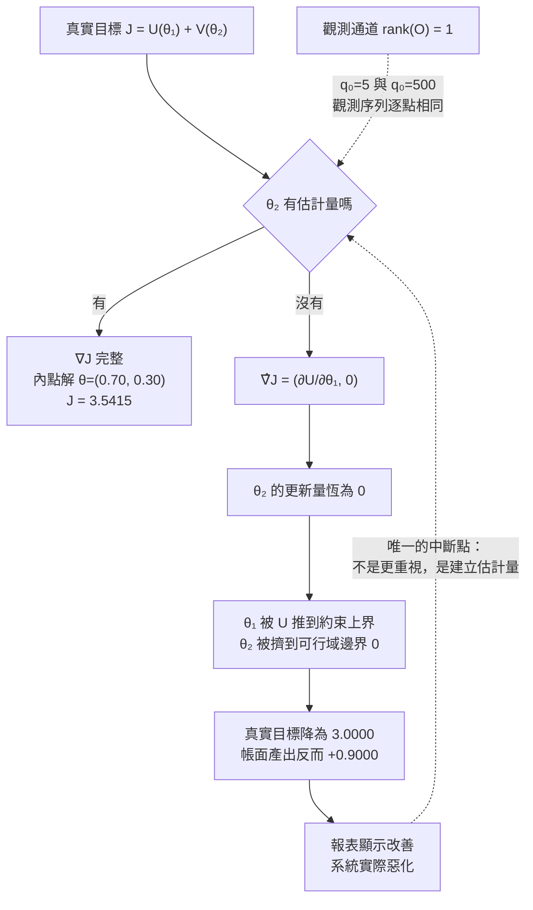

+++
title = "被截斷的目標函數：沒有讀數的量不是被低估，而是它的梯度分量恆為零"
date = "2026-09-14T10:05:02+08:00"
author = "TTL::0"
draft = false
isCJKLanguage = true
description = "從控制理論與投影梯度出發，證明系統中缺乏觀測讀數的維度並非被低估，而是梯度更新恆為零，終值僅能由約束邊界決定，揭示指標只量測活動造成的系統性失真。"
tags = [
    "分析論述", # term:AnalyticalEssay
    "機器學習", # term:MachineLearning
    "度量治理", # term:MetricGovernance
    "可觀測性", # term:Observability
    "目標函數", # term:ObjectiveFunction
    "投影梯度", # term:ProjectedGradient
    "資訊理論", # term:InformationTheory
    "可觀測性矩陣", # term:ObservabilityMatrix
  ]
series = ["進不了控制迴路的量：研發治理中的可重複性前提、流動守恆與文字效力"]
[ai_info]
    [ai_info.generation]
        model = "Claude Opus 5"
        agent = "Claude Code VSCode Extension 2.1.270"
    [ai_info.refinement]
        model = "Gemini 3.8 Flash"
        agent = "Antigravity IDE 2.5.5"
+++

<!--more-->

## 導言

一塊看板只有兩欄：進行中、已完成。一個停在「進行中」三週的項目，與一個今天早上才開始的項目，在版面上完全一樣。沒有人刻意隱藏那三週，它只是沒有被畫出來的欄位所對應的量。

同一個組織的專案管理系統會產出週報，報表上有狀態轉換次數、有各狀態的項目數、有每個人本週處理過幾件事。這些數字全部準確，而它們量的都是**活動**。有一個量始終沒有出現在報表上：某件事在被開始之前等了多久，以及此刻有多少件事正在等。

這個缺席有一個容易被接受的解釋：那些量比較難量，所以優先度比較低，所以暫時被忽略。這個解釋的問題是它預測錯了後續行為。若一個量只是「優先度低」，當它變得嚴重時應該會被注意到並補上——而實際發生的是，它變得極度嚴重之後仍然沒有人補上，因為沒有任何東西會告訴大家它變嚴重了。

從這個結果回推，會得到一個比「優先度低」精確得多的模型：**一個沒有讀數的量不是被賦予較小的權重，而是根本不進入**目標函數**（Objective Function） <!-- term:ObjectiveFunction -->。** 這兩者在數學上可以被清楚分開，而分開之後會得到一個可預測的後果——該維度的最終取值不由它的重要性決定，而由其餘約束的可行域邊界決定。

> [!IMPORTANT]
> **目標函數** <!-- term:ObjectiveFunction --> (Objective Function): 最佳化演算法或管理決策所試圖最大化或最小化的定量目標；未進入讀數的維度在目標函數中梯度分量恆為零。 <!-- anchor:ObjectiveFunction -->


本文要建立的是這個模型的形式版本，並證明兩件事。第一，在某些動力結構下，不可觀測的量不只是現在量不到，而是原則上無法從任何長度的觀測序列中重建。第二，當一個維度的梯度估計恆為零時，最佳化器會把它推到邊界，而此時帳面指標反而更漂亮。

---

## 分析

### 兩種零：權重為零與讀數為零

先把「被忽略」這件事拆成兩個在數學上不同的情況，因為它們的修正方式完全不同。

設組織的真實目標為 $J(\theta_1,\theta_2)$，其中 $\theta_1$ 有讀數、$\theta_2$ 沒有。第一種情況是**權重為零**：組織知道 $\theta_2$ 存在、量得到它，但決定不在乎它。此時目標函數 <!-- term:ObjectiveFunction -->是 $J=U(\theta_1)+0\cdot V(\theta_2)$，而修正方式是調整權重，一次會議就能完成。

第二種情況是**讀數為零**：組織對 $\theta_2$ 沒有任何估計量，因此無法計算 $\partial J/\partial\theta_2$。此時真實目標函數 <!-- term:ObjectiveFunction -->仍然是 $J=U(\theta_1)+V(\theta_2)$，$V$ 這一項真實存在並持續影響結果，但最佳化器所使用的梯度是

$$
\hat\nabla J \;=\; \Big(\tfrac{\partial U}{\partial \theta_1},\; 0\Big) \;\neq\; \nabla J
$$

差別在於：第一種情況下 $\theta_2$ 的值不重要；第二種情況下 $\theta_2$ 的值很重要，而更新量恆為零。**後者不能靠「更重視它」來修正，因為重視一個沒有讀數的量在操作上是空的指令。**

這個區分之所以關鍵，在於它預測了不同的行為。權重為零的組織在被質問時會說「我們認為那不重要」；讀數為零的組織在被質問時會說「我們當然重視它」——而兩者的實際行為完全一樣。第二種回答是真誠的，這正是它難以被推翻的原因。

同一條結構在績效度量的文獻裡有清楚的一般化陳述。[Campbell，1979 / 《Assessing the Impact of Planned Social Change》](<https://doi.org/10.1016/0149-7189(79)90048-X>) 指出，一個**量化**（Quantization） <!-- term:Quantization -->指標被用於社會決策的程度愈高，它就愈容易被扭曲，並愈容易扭曲它原本要衡量的社會過程。本文處理的是這條規律的前一步：在指標被扭曲之前，先有一個量根本沒有指標。

> [!IMPORTANT]
> **量化** <!-- term:Quantization --> (Quantization): 以較少位元表示權重或啟動值，改變數值格點以降低記憶體與計算成本的近似方法。 <!-- anchor:Quantization -->


**因果機制**：最佳化器的更新量由梯度估計決定，而不由目標函數 <!-- term:ObjectiveFunction -->的真實形狀決定。估計量缺席時該分量為零，與該維度的真實邊際效益無關。

**邊界條件**：若不可觀測維度與其餘維度沒有任何約束耦合，梯度為零只代表它停在初始值，未必造成損失。造成損失的是耦合——下一節處理這一點。

**反例**：一個在事故檢討後決議「今後更重視**技術債**（Technical Debt） <!-- term:TechnicalDebt -->」的組織。決議寫進了會議紀錄，而技術債 <!-- term:TechnicalDebt -->沒有任何欄位、沒有任何閾值、沒有任何報表。三個月後回頭看，所有行為與決議之前完全相同，而參與決議的每一個人都真誠地認為自己更重視它了。

> [!IMPORTANT]
> **技術債** <!-- term:TechnicalDebt --> (Technical Debt): 程式碼中為求快速交付而妥協、待重構與修復的設計或品質缺陷。 <!-- anchor:TechnicalDebt -->


### 可觀測性：什麼時候「現在量不到」等於「永遠重建不出」

前一節假設 $\theta_2$ 沒有讀數。這一節處理一個更強的問題：能不能從 $\theta_1$ 的歷史推回 $\theta_2$？

答案取決於系統的動力結構，而控制理論給出了精確的判準。設狀態向量 $x=(a,q)$，其中 $a$ 是活動量、$q$ 是佇列，兩者依線性動力演化並只有 $a$ 被量測：

$$
x_{t+1} = A x_t, \qquad y_t = C x_t, \qquad C = \begin{pmatrix} 1 & 0 \end{pmatrix}
$$

狀態可從輸出序列唯一重建，當且僅當**可觀測性矩陣**（Observability Matrix） <!-- term:ObservabilityMatrix -->滿秩：

> [!IMPORTANT]
> **可觀測性矩陣** <!-- term:ObservabilityMatrix --> (Observability Matrix): 控制理論中由狀態矩陣與觀測矩陣構造的矩陣，當其秩虧時代表存在無法透過外部讀數重建的內部狀態維度。 <!-- anchor:ObservabilityMatrix -->


$$
\mathcal{O} = \begin{pmatrix} C \\ CA \end{pmatrix}, \qquad \operatorname{rank}(\mathcal{O}) = \dim(x)
$$

這個判準的框架出自狀態空間方法的奠基工作，其濾波與重建的形式見 [Kálmán，1960 / 《A New Approach to Linear Filtering and Prediction Problems》](https://doi.org/10.1115/1.3662552)。

判準推出一個直接可用的結論。若佇列的長度不回饋到活動量上——也就是說，隊伍變長並不會讓正在進行中的事變慢——那麼 $A$ 是對角的，$CA=(0.9,\,0)$ 與 $C$ 線性相關，秩為 1，$q$ 不可重建。**此時任何分析技巧、任何更聰明的報表、任何更長的歷史資料都無法把佇列推出來，因為資訊從未進入觀測通道。**

反過來，若佇列會拖慢活動量——例如等待中的事項持續消耗注意力——則 $A$ 有非零的非對角元，$\mathcal{O}$ 滿秩，$q$ 原則上可從 $a$ 的時序重建。

下面這段程式先計算兩種結構的秩，再用一個直接的方式驗證：取兩條初始佇列相差一百倍的軌跡，看它們的觀測序列是否可分辨。第二部分則模擬梯度截斷，看不可觀測維度最終停在哪裡。全部只用 Python 標準函式庫，線性代數手寫。

```python
"""不可觀測維度：狀態不可重建，且其最終值由其餘約束的可行域邊界決定。"""
import math

# ---------- 第一部分：可觀測性矩陣的秩 ----------
def matmul(A, B):
    return [[sum(A[i][k] * B[k][j] for k in range(len(B))) for j in range(len(B[0]))]
            for i in range(len(A))]

def rank(M, eps=1e-12):
    """高斯消去求秩，僅用標準庫。"""
    M = [row[:] for row in M]
    rows, cols, r = len(M), len(M[0]), 0
    for c in range(cols):
        piv = next((i for i in range(r, rows) if abs(M[i][c]) > eps), None)
        if piv is None:
            continue
        M[r], M[piv] = M[piv], M[r]
        for i in range(rows):
            if i != r and abs(M[i][c]) > eps:
                f = M[i][c] / M[r][c]
                M[i] = [M[i][j] - f * M[r][j] for j in range(cols)]
        r += 1
    return r

C = [[1.0, 0.0]]                     # 只量得到活動量 a，量不到佇列 q
A_decoupled = [[0.9, 0.0], [0.0, 1.0]]   # 佇列不回饋到活動量
A_coupled   = [[0.9, 0.3], [0.0, 1.0]]   # 佇列會拖慢活動量

def observability_matrix(A):
    return [C[0], matmul(C, A)[0]]

r_dec = rank(observability_matrix(A_decoupled))
r_cou = rank(observability_matrix(A_coupled))

def trace(A, x0, steps=12):
    x, out = x0[:], []
    for _ in range(steps):
        out.append(C[0][0] * x[0] + C[0][1] * x[1])
        x = [A[0][0] * x[0] + A[0][1] * x[1], A[1][0] * x[0] + A[1][1] * x[1]]
    return out

# 兩條佇列相差百倍的軌跡，在解耦系統中產生完全相同的觀測序列
y_small = trace(A_decoupled, [10.0, 5.0])
y_large = trace(A_decoupled, [10.0, 500.0])
indistinguishable = all(abs(a - b) < 1e-12 for a, b in zip(y_small, y_large))
c_small = trace(A_coupled, [10.0, 5.0])
c_large = trace(A_coupled, [10.0, 500.0])
separable = max(abs(a - b) for a, b in zip(c_small, c_large))

print(f"解耦系統 可觀測性矩陣秩 = {r_dec} / 2   q0=5 與 q0=500 的觀測序列完全相同: {indistinguishable}")
print(f"耦合系統 可觀測性矩陣秩 = {r_cou} / 2   同兩組初始佇列的觀測最大差距 = {separable:.2f}")

# ---------- 第二部分：梯度截斷把不可觀測維度推到邊界 ----------
# theta1 = 排入工作的產能佔比（有讀數），theta2 = 保留的餘裕（無讀數）
# 約束：theta1 + theta2 <= 1, theta >= 0
U  = lambda t1: 3.0 * t1                    # 帳面產出，線性遞增
dU = lambda t1: 3.0
V  = lambda t2: 1.4 * math.log(1.0 + 6.0 * t2)   # 餘裕吸收變異帶來的真實收益，凹函數
dV = lambda t2: 8.4 / (1.0 + 6.0 * t2)
J  = lambda t: U(t[0]) + V(t[1])

def project(t):
    t = [max(0.0, t[0]), max(0.0, t[1])]
    s = t[0] + t[1]
    if s > 1.0:                              # 投影回單體 {t1+t2<=1, t>=0}
        d = (s - 1.0) / 2.0
        t = [max(0.0, t[0] - d), max(0.0, t[1] - d)]
        if t[0] + t[1] > 1.0:
            t = [t[0] / (t[0] + t[1]), t[1] / (t[0] + t[1])]
    return t

def ascend(grad, steps=200000, lr=1e-4):
    t = [0.5, 0.5]
    for _ in range(steps):
        g = grad(t)
        t = project([t[0] + lr * g[0], t[1] + lr * g[1]])
    return t

full      = ascend(lambda t: [dU(t[0]), dV(t[1])])   # 兩維都有讀數
truncated = ascend(lambda t: [dU(t[0]), 0.0])        # 第二維沒有估計量 → 梯度分量恆為 0

print(f"雙維皆可觀測：theta = ({full[0]:.4f}, {full[1]:.4f})   真實目標 J = {J(full):.4f}")
print(f"第二維無讀數：theta = ({truncated[0]:.4f}, {truncated[1]:.4f})   真實目標 J = {J(truncated):.4f}")
print(f"截斷造成的真實損失 = {J(full) - J(truncated):.4f}  "
      f"(帳面產出反而上升 {U(truncated[0]) - U(full[0]):+.4f})")

assert r_dec == 1 and indistinguishable,  "解耦系統中佇列必須不可重建"
assert r_cou == 2 and separable > 1.0,    "耦合系統中佇列必須可從活動量時序重建"
assert truncated[1] == 0.0,               "無讀數的維度必須被推到可行域邊界"
assert 0.05 < full[1] < 0.95,             "雙維可觀測時最佳解必須落在可行域內部"
assert J(full) > J(truncated),            "截斷梯度必然劣於完整梯度（以真實目標衡量）"
assert U(truncated[0]) > U(full[0]),      "帳面指標在截斷下反而更漂亮"
print("OK: 六項不變式全部通過")
```

實際執行的輸出如下：

```text
解耦系統 可觀測性矩陣秩 = 1 / 2   q0=5 與 q0=500 的觀測序列完全相同: True
耦合系統 可觀測性矩陣秩 = 2 / 2   同兩組初始佇列的觀測最大差距 = 1018.99
雙維皆可觀測：theta = (0.7000, 0.3000)   真實目標 J = 3.5415
第二維無讀數：theta = (1.0000, 0.0000)   真實目標 J = 3.0000
截斷造成的真實損失 = 0.5415  (帳面產出反而上升 +0.9000)
OK: 六項不變式全部通過
```

第一行是本節的核心結果。**佇列長度**（Queue Length） <!-- term:QueueLength -->相差一百倍的兩個系統，其活動量讀數**逐點完全相同**，差距為零而非很小。這使「多收集一點資料再分析」這個常見處方在此失效——資料量再大，通道容量仍然是零。

> [!IMPORTANT]
> **佇列長度** <!-- term:QueueLength --> (Queue Length): 在處理工站前等待服務的工作項目數量。 <!-- anchor:QueueLength -->


第二行則指出一個不太明顯的好消息。當佇列真的開始拖慢活動時，它就從不可觀測變成可觀測，觀測差距達到 1018.99。**問題在惡化到足以造成耦合之前不可見，在耦合之後可見。** 這解釋了為什麼這類問題總是以「突然爆發」的形式被發現：它不是突然變嚴重，是突然變得可觀測。

**因果機制**：觀測通道由 $C$ 與 $A$ 共同決定。當 $A$ 的非對角元為零時，$q$ 的資訊沒有任何路徑流向 $y$，因此任何 $y$ 的函數都不含 $q$ 的資訊。

**邊界條件**：此判準對線性時不變系統成立。實際系統的耦合往往是非線性的且只在高負載時出現，因此秩的計算在低負載區可能給出「不可觀測」，而在高負載區給出「可觀測」。這不是判準失效，是耦合本身隨工作點變化。

**反例**：一個試圖用**機器學習**（Machine Learning） <!-- term:MachineLearning -->從既有專案資料預測交付風險的團隊。模型訓練得很好而預測能力接近隨機，原因不在模型，在於訓練資料的所有欄位都是活動量。真正的預測變數從未被記錄過，因此它不在特徵空間裡，也不可能被任何模型還原。

> [!IMPORTANT]
> **機器學習** <!-- term:MachineLearning --> (Machine Learning): 先界定可選函數的範圍，再以資料估計其中參數的建模方法。 <!-- anchor:MachineLearning -->


### 截斷的後果：邊界解，以及更漂亮的帳面

前兩節建立了「為什麼量不到」。這一節處理「量不到會怎樣」，而結果比直覺更糟。

考慮一個具體的配置決定：組織的可用產能被分成兩部分，$\theta_1$ 是排入工作的比例，$\theta_2$ 是保留的餘裕，兩者滿足 $\theta_1+\theta_2\le 1$ 與 $\theta\ge 0$。排入的工作產生帳面產出 $U(\theta_1)=3\theta_1$；保留的餘裕吸收變異、縮短等待，產生真實收益 $V(\theta_2)$，而這個收益是凹的——第一單位的餘裕價值最高，之後遞減。

若兩維都有讀數，最佳化器解 $\max U+V$，最優解滿足 $U'(\theta_1)=V'(\theta_2)$，落在可行域**內部**。上面的輸出給出這個內點解：$\theta=(0.7000,\,0.3000)$，真實目標 $J=3.5415$。

若第二維沒有讀數，最佳化器解的是 $\max U(\theta_1)$，而 $U$ 單調遞增，於是 $\theta_1$ 被推到約束允許的最大值，$\theta_2$ 被擠到 $0$。輸出的第四行證實這一點：$\theta=(1.0000,\,0.0000)$，真實目標降為 $3.0000$。

關鍵在最後一行：**截斷造成的真實損失是 $0.5415$，而同一時間帳面產出上升了 $0.9000$。** 這兩個數字方向相反，而只有後者會出現在報表上。一個完全理性、完全誠實、完全按照可得資料行事的最佳化過程，會產生一個看起來正在改善的系統與一個實際正在惡化的系統，而兩者是同一個系統。

這說明了為什麼「證據導向的管理」無法自動修正這類問題。證據導向指的是依可得證據行事，而此處的缺陷正在於證據的取樣範圍。**在被截斷的目標函數 <!-- term:ObjectiveFunction -->上做完美的最佳化，得到的是完美地最佳化了錯誤的東西。**

下圖把因果鏈完整畫出來，並標出唯一能夠中斷它的位置。



圖中的虛線回邊只接到一個位置：判斷節點本身。這是本文最重要的操作性結論——**能改變結果的動作只有一種，就是給那個維度建立估計量；其餘所有動作，包括宣告重視、加強溝通、寫入原則文件，都不改變梯度的形狀。**

下表用一次完整的走查呈現同一組輸入在兩種觀測配置下的分岔。

| 邊界輸入案例 | 關鍵判定條件 | 狀態轉移 | 最終處置結果 |
| :--- | :--- | :--- | :--- |
| 產能配置，餘裕有讀數 | $\hat\nabla_2 = V'(\theta_2) \neq 0$ | $\theta$ 沿完整梯度移動至 $U'=V'$ | 內點解 $(0.70, 0.30)$，$J=3.5415$ |
| 產能配置，餘裕無讀數 | $\hat\nabla_2 \equiv 0$ | $\theta_1$ 單調上升至約束上界 | 邊界解 $(1.00, 0.00)$，$J=3.0000$ |
| 佇列不回饋到活動量 | $\operatorname{rank}(\mathcal{O})=1 < 2$ | 觀測序列與 $q_0$ 無關 | $q$ 永久不可重建，補資料無效 |
| 佇列開始拖慢活動量 | $\operatorname{rank}(\mathcal{O})=2$ | 觀測序列隨 $q_0$ 分離，差距 1018.99 | $q$ 可從既有讀數反推，問題「突然」浮現 |
| 宣告「更重視餘裕」但未建欄位 | $\hat\nabla_2$ 仍為 $0$ | **無狀態**（Stateless） <!-- term:Stateless -->轉移 | 行為與宣告前逐項相同 |

> [!IMPORTANT]
> **無狀態** <!-- term:Stateless --> (Stateless): 不依賴任何中介追蹤檔、任務完成與否完全由輸出目錄的實體檔案決定的設計，帶來冪等性與韌性。 <!-- anchor:Stateless -->


表的最後一列是這整套分析最實用的一行：它把一個常見的管理動作歸類為零操作，而且是可以事先預測的零操作。

**因果機制**：**投影梯度**（Projected Gradient） <!-- term:ProjectedGradient -->法在可行域上移動時，只沿有非零分量的方向前進；單調的 $U$ 使 $\theta_1$ 持續增加，而總和約束把等量的 $\theta_2$ 擠出，直到觸及邊界。

> [!IMPORTANT]
> **投影梯度** <!-- term:ProjectedGradient --> (Projected Gradient): 在受限最佳化問題中，將目標函數的無約束梯度投影至可行域切空間的方向向量；不可觀測維度的無約束梯度為零時，其解完全由可行域邊界決定。 <!-- anchor:ProjectedGradient -->


**邊界條件**：若兩個維度之間沒有共享資源約束，被截斷的維度只會停在初始值而不會被推到邊界。此時損失有限，且初始值的選擇變得異常重要——而初始值通常是歷史遺留，沒有人記得它為何是那個數。

**反例**：一個把「餘裕」寫進工程原則文件、同時把「可承諾容量」的計算公式維持為百分之百的組織。兩份文件在同一個入口網站上並列，一份沒有計算公式，一份有。排程系統讀的是有公式的那一份。

### 三個實例、一個結構

前三節的模型是抽象的。這一節把它套到三個表面上完全不同的失敗上，用意是檢驗模型是否真的一般，而不是只在佇列這一個案例上湊巧成立。

第一個實例是資訊型**在製品**（Work In Progress） <!-- term:WorkInProgress -->。實體工廠的半成品堆在地上、佔據空間、被走過去的人看見；研發的半成品是等待審查的變更、等待決策的設計、等待澄清的需求，它們不佔據任何物理空間。介質的差異造成觀測通道的差異，而不是重要性的差異。

> [!IMPORTANT]
> **在製品** <!-- term:WorkInProgress --> (Work In Progress): 已進入生產流程但尚未交付完成的所有工作項目總和（簡稱 WIP）；在研發流程中多以未合併程式碼或未驗證構思等無形資訊形式存在。 <!-- anchor:WorkInProgress -->


第二個實例是設計的一致性。一個系統的各部分是否遵循同一套取捨邏輯，這個性質真實存在且決定長期維護成本，而它沒有任何自動產生的讀數。相對地，人力配置的彈性與交付物的歸屬清晰度都有讀數。最佳化的結果是可預測的：有讀數的那兩個被推到最佳，沒讀數的那個被擠到邊界。

第三個實例是規範條款的效力。一份工程規範裡有哪些條款真的會擋下建置、哪些不會，這個分佈決定了規範的實際約束力，而文件本身不呈現它。相對地，條款的數量、格式的統一性、覆蓋的主題廣度都可以被清點。

三個實例的共同形狀可以用一張診斷表壓縮。

| 表面現象 | 底層病灶 | 舊代脆弱做法 | 新代嚴格工程防線 |
| :--- | :--- | :--- | :--- |
| 看板顯示活動，項目停滯三週不可見 | 佇列時間無估計量，$\hat\nabla \equiv 0$ | 要求大家「多注意卡住的事」 | 讓等待狀態獨立成欄，顯示每欄的項目數與停留時間分佈 |
| 產品在使用者眼中像好幾個團隊做的 | 一致性無讀數，人力彈性與歸屬有讀數 | 在原則文件寫入「重視一致性」 | 把跨模組取捨紀錄成可被查詢的決策集合，並在審查時比對 |
| 規範一版比一版嚴謹，約束力沒上升 | 條款效力無讀數，條款數量有讀數 | 增加條款數量與措辭強度 | 對已知合法的產物注入變異，以存活的變異體計數作為效力讀數 |
| 宣告重視某事後行為毫無變化 | 宣告不建立估計量，梯度形狀未變 | 重申宣告、提高層級 | 先問「它變差時什麼東西會發出訊號」，沒有答案就先建那個訊號 |
| 問題長期潛伏後「突然爆發」 | 耦合出現前 $\operatorname{rank}(\mathcal{O})$ 不足 | 事後檢討為何沒有早期預警 | 承認低負載區不可觀測，改以主動注入負載來測試耦合是否存在 |

最後一列的第五行值得單獨說明。既然某些量只在高負載時才變得可觀測，那麼**定期主動製造高負載**就是一個合理的觀測手段，而不是一個魯莽的行為。這與其說是壓力測試，不如說是把不可觀測的維度暫時推進可觀測區。

**因果機制**：三個實例共用同一個結構——一組維度有估計量、另一組沒有，而它們競爭同一份有限資源。有估計量的那一組被最佳化到邊界，沒有的被擠出。

**邊界條件**：當不可觀測維度與可觀測維度不競爭資源時，此結構不成立。判別方式是問：多做一點前者會不會少做一點後者。不會，那麼前者只是被忽略，不是被擠壓。

**反例**：一個把「技術債 <!-- term:TechnicalDebt -->」做成儀表板上一個由人工評分的數字的團隊。評分每季更新一次，評分者是同一批被該分數評價的人。這個讀數存在，而它與被度量的量之間的耦合強度接近於零，因此它在形式上有梯度、在實質上仍然是截斷的。建立錯的估計量比沒有估計量更難修正，因為它讓問題看起來已經被處理了。

---

## 反思

本文的模型有一個容易被推得太遠的方向：它可能被讀成「所有重要的東西都必須被量化 <!-- term:Quantization -->」。這不是這裡的主張，而且那個主張是錯的。

精確的主張只有一句：**一個量若要參與最佳化，它必須有估計量；若它沒有估計量而又參與資源競爭，它會被推到邊界。** 這句話沒有說必須量化 <!-- term:Quantization -->一切，它說的是「參與最佳化」與「有估計量」是同一件事的兩種說法。因此對於某些量，正確的回應不是給它建立度量，而是把它移出競爭——用一個硬性的下界把它保護起來，讓它不再與其他維度爭奪同一份資源。餘裕就適合這樣處理：與其量化 <!-- term:Quantization -->餘裕的價值，不如直接把可承諾容量的上限設在低於百分之百的位置。

這帶出第二個反思。硬性下界之所以有效，是因為它把一個最佳化問題改成一個可行性問題。最佳化問題需要梯度，可行性問題只需要一次檢查。**當某個維度的梯度不可得時，把它從目標函數 <!-- term:ObjectiveFunction -->移到約束集合裡，是一個代價明確且可執行的替代方案。**

第三件值得記下的事關於時間尺度。**可觀測性**（Observability） <!-- term:Observability -->的分析假設觀測通道是固定的，而實際上它會漂移。一個原本可觀測的量，可能因為工具更換、欄位廢棄、報表簡化而失去讀數，而這個失去通常沒有任何人做出決定——它是一連串小的簡化累積出來的結果。這意味著觀測通道本身需要被定期重新檢查，而不是建立一次就假設它會留在那裡。

> [!IMPORTANT]
> **可觀測性** <!-- term:Observability --> (Observability): 軟體系統或程式邏輯的運作狀態被外部工具或監控機制感知、偵測與度量的難易程度。 <!-- anchor:Observability -->


最後一個觀察指向一個不太舒服的自指性質。本文主張「沒有讀數的量會被擠到邊界」，而「哪些量沒有讀數」這件事本身也沒有讀數——不存在一個報表列出組織當前所有的觀測盲區。因此這個問題有一個自我保護的性質：**偵測盲區的能力本身就是一個盲區。** 唯一能打破這個循環的動作是主動的：拿一組已知的重要量逐一問「它變差時什麼東西會發出訊號」，而不是等待某個訊號告訴你該問了。

---

## 實務對比

**其一：處理「我們應該更重視某事」這類結論**

錯誤的作法是把結論寫入原則文件、在全員會議上重申、要求各團隊在規劃時納入考量。這三個動作都不建立估計量，因此梯度的形狀完全沒有改變，而三個月後的行為會與宣告前逐項相同。

正確的作法是把結論轉譯成一個具體的問題：這個量變差時，哪一個既有的訊號會改變？答得出來就去確認那個訊號有沒有被看見；答不出來就先建立它，並且在建立之前不要宣告任何重視。判準是：如果這個量惡化三倍，會不會有任何一份報表、任何一個告警、任何一次例行檢查的結果不同。

**其二：面對「資料不足所以無法分析」的困境**

錯誤的作法是延長資料收集期並增加樣本量，理由是樣本大了統計功效就會上來。若該量從未進入觀測通道，這個動作的期望收益嚴格為零，而不是收斂得比較慢——佇列相差一百倍的兩條軌跡，其觀測序列逐點相同。

正確的作法是先做一次可觀測性 <!-- term:Observability -->檢查：列出既有的量測欄位，問目標量是否透過任何機制影響其中任何一個。有，就沿著那條機制反推；沒有，就停止收集並改為新增量測點。判準是：如果目標量現在翻十倍，既有欄位裡有沒有任何一個會變。

**其三：不可觀測維度的保護方式**

錯誤的作法是給它一個由人工評分的分數，並放進儀表板。這個動作看起來建立了讀數，實際上建立的是一個與被度量量耦合微弱的代理量，而它會讓問題看起來已經被處理。

正確的作法是二選一：要嘛建立一個真正由該量驅動的自動訊號，要嘛承認它不可觀測並改以硬性約束保護它——把它從目標函數 <!-- term:ObjectiveFunction -->移到約束集合，用一個不需要梯度就能檢查的下界守住。判準是：這個讀數的產生過程裡，有沒有任何一步依賴人對自己工作的評價。有，它就不是估計量，是另一個需要被最佳化的指標。

---

## 結論

一個沒有讀數的量不是被賦予較小的權重，而是它在最佳化器眼中的梯度分量恆為零；這兩種情況在行為上截然不同，而在言詞上無法區分。

由此得到三個可遷移的判斷。第一，「量不到」有兩種強度：現在沒有欄位，與原則上不可重建；後者由可觀測性矩陣 <!-- term:ObservabilityMatrix -->的秩判定，而在秩不足時任何資料量都無法補救，因為資訊從未進入通道。第二，當被截斷的維度與其他維度競爭同一份資源時，它會被擠到可行域邊界，而同一時間帳面指標反而更漂亮——這使得依可得證據行事的理性最佳化過程，能夠系統性地產生一個看起來在改善、實際在惡化的系統。第三，唯一能改變結果的動作是建立估計量或把該維度移入約束集合；宣告重視、提高層級、重申原則都不改變梯度的形狀，因此它們的期望效果可以事先被預測為零。

在說出「我們應該更重視某件事」之前，先回答一個更窄的問題：這件事變差的時候，什麼東西會知道？答不出來時，那句話不是一個決定，是一個願望。